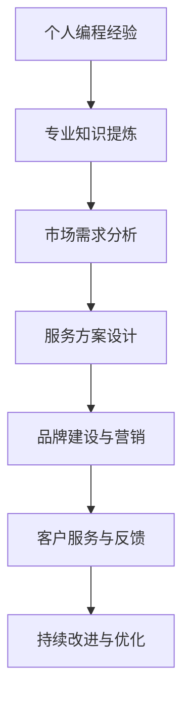

                 

关键词：编程经验、技术咨询服务、职业发展、知识变现、软件开发、咨询策略

> 摘要：本文旨在探讨如何有效地将个人的编程经验转化为有价值的咨询服务。我们将从背景介绍、核心概念、算法原理、数学模型、项目实践、实际应用、工具推荐及未来展望等方面展开论述，旨在为软件开发者提供一套可行的职业发展路径，使其在知识变现的过程中实现自我价值最大化。

## 1. 背景介绍

在信息技术飞速发展的今天，编程已经从一项技术技能转变为一种普遍的语言，用于描述复杂系统、应用程序和解决方案。随着技术的不断进步，软件开发者面临着多样化的职业选择。除了传统的软件开发工作，越来越多的开发者开始考虑将自身的编程经验转化为咨询服务，以此来扩大收入来源、提升个人品牌和影响力。

技术咨询服务是一种高价值、知识密集型的服务形式，它依托于个人的专业技能和行业经验，为客户提供个性化的技术解决方案。这种服务形式不仅能够帮助客户解决实际问题，还能为咨询者自身带来丰富的职业发展机遇。

本文将围绕如何将编程经验转化为技术咨询服务这一主题，详细探讨实现这一目标的方法和策略。

## 2. 核心概念与联系

在开始具体的转化策略之前，我们需要了解一些核心概念和它们之间的联系。以下是一个Mermaid流程图，展示了编程经验转化为技术咨询服务的基本流程：



### 2.1 个人编程经验

个人编程经验是指开发者通过实际项目和工作积累的技术知识、技能和经验。这些经验涵盖了从编程语言、框架、工具到软件工程方法的各个方面。个人编程经验是转化为技术咨询服务的基础。

### 2.2 专业知识提炼

专业知识提炼是将个人编程经验中具有共性和价值的内容进行系统化整理和提炼的过程。这包括编写技术文档、整理项目案例、总结开发经验等。通过专业知识提炼，开发者能够更加清晰地了解自己的优势和特长。

### 2.3 市场需求分析

市场需求分析是了解客户需求和行业趋势的过程。通过分析市场需求，开发者可以确定哪些技术和服务更受客户欢迎，从而制定更具针对性的服务方案。

### 2.4 服务方案设计

服务方案设计是基于市场需求分析的结果，结合个人编程经验，为客户量身定制的技术解决方案。服务方案需要具备针对性、实用性和创新性。

### 2.5 品牌建设与营销

品牌建设与营销是将个人或团队打造成知名品牌，吸引潜在客户的过程。这包括建立个人网站、撰写技术博客、参与技术社区和社交媒体营销等。

### 2.6 客户服务与反馈

客户服务与反馈是确保客户满意度的关键环节。通过提供优质的客户服务，收集客户反馈，开发者可以不断优化服务内容和质量。

### 2.7 持续改进与优化

持续改进与优化是技术咨询服务长期发展的重要保障。开发者需要不断学习新知识、掌握新技术，以保持服务的竞争力和创新能力。

## 3. 核心算法原理 & 具体操作步骤

### 3.1 算法原理概述

将编程经验转化为技术咨询服务的过程，本质上是一个算法问题，可以抽象为以下步骤：

1. **经验积累**：通过实际项目和工作积累编程经验。
2. **知识提炼**：将经验中的共性和价值部分进行系统化整理。
3. **需求分析**：了解客户需求和市场趋势。
4. **方案设计**：基于需求和经验，设计具体的服务方案。
5. **品牌建设**：建立个人或团队品牌，提升知名度。
6. **客户服务**：提供优质的客户服务，收集反馈。
7. **持续优化**：根据反馈不断改进和优化服务。

### 3.2 算法步骤详解

#### 3.2.1 经验积累

经验积累是整个过程的起点。开发者需要在实际项目中不断学习和实践，积累编程经验。这包括掌握多种编程语言、熟悉不同开发工具、参与复杂系统的设计和实现等。

#### 3.2.2 知识提炼

在积累了一定编程经验后，开发者需要对这些经验进行提炼。这可以通过编写技术文档、整理项目案例、总结开发经验等方式实现。具体步骤如下：

1. **编写技术文档**：将项目中使用的技术和工具进行系统化整理，形成技术文档。
2. **整理项目案例**：收集并整理成功项目案例，为后续服务提供实证依据。
3. **总结开发经验**：总结项目开发过程中遇到的问题、解决方案和经验教训。

#### 3.2.3 需求分析

需求分析是了解客户需求和市场趋势的过程。开发者可以通过以下方式获取需求信息：

1. **市场调研**：通过阅读行业报告、参加技术会议、关注行业动态等方式，了解市场需求和趋势。
2. **客户访谈**：直接与潜在客户进行沟通，了解他们的需求和期望。
3. **竞争对手分析**：分析竞争对手的服务内容、优势和不足，为自身服务提供参考。

#### 3.2.4 方案设计

基于需求和经验，开发者需要设计具体的服务方案。方案设计需要遵循以下原则：

1. **针对性**：根据客户需求，提供个性化的服务方案。
2. **实用性**：方案需要具备实际可操作性，能够解决客户实际问题。
3. **创新性**：在满足客户需求的基础上，尝试引入新技术和方法，提高服务竞争力。

#### 3.2.5 品牌建设

品牌建设是提升个人或团队知名度的重要环节。开发者可以通过以下方式建立品牌：

1. **建立个人网站**：展示个人技术背景、经验和服务内容，为潜在客户提供第一印象。
2. **撰写技术博客**：定期更新技术博客，分享技术心得和经验，提升专业形象。
3. **参与技术社区**：加入技术论坛、微信群、QQ群等，积极参与讨论，扩大影响力。
4. **社交媒体营销**：利用社交媒体平台，如LinkedIn、微博、微信公众号等，宣传个人品牌。

#### 3.2.6 客户服务

提供优质的客户服务是赢得客户信任和满意度的重要保障。开发者需要遵循以下原则：

1. **及时响应**：对客户提出的问题和需求，及时给予回应和解决方案。
2. **专业解答**：用专业的知识和技能为客户提供高质量的解答。
3. **耐心沟通**：与客户保持耐心沟通，了解他们的需求和期望，确保服务的针对性。
4. **持续跟进**：在项目实施过程中，持续关注客户反馈，根据反馈进行改进。

#### 3.2.7 持续优化

持续优化是技术咨询服务长期发展的重要保障。开发者需要保持学习的态度，不断更新自己的知识和技能，以适应不断变化的市场需求。具体措施包括：

1. **学习新技术**：关注新技术和发展趋势，及时掌握新知识。
2. **参与培训**：参加专业培训，提升自己的技能和知识水平。
3. **项目复盘**：对完成的项目进行复盘，总结经验教训，为后续项目提供参考。
4. **客户反馈**：收集客户反馈，根据反馈调整服务内容和质量。

## 3.3 算法优缺点

### 优点

1. **知识变现**：通过将编程经验转化为咨询服务，开发者可以将自己的专业知识转化为实际收入。
2. **职业发展**：技术咨询服务有助于提升个人品牌和影响力，为职业发展提供更多机遇。
3. **灵活性**：咨询服务可以根据市场需求和客户需求灵活调整，具有较强的适应能力。

### 缺点

1. **市场需求波动**：技术咨询服务受市场需求波动影响较大，可能导致收入不稳定。
2. **服务质量要求高**：提供高质量的咨询服务需要开发者具备扎实的专业知识和丰富的实践经验。
3. **时间成本较高**：建立和维护客户关系、品牌建设等过程需要大量时间和精力。

## 3.4 算法应用领域

将编程经验转化为技术咨询服务适用于多个领域，主要包括：

1. **软件开发**：开发者可以为客户提供软件开发咨询服务，包括系统架构设计、代码优化、性能调优等。
2. **数据科学**：数据科学家可以为客户提供数据分析、数据挖掘、机器学习等咨询服务。
3. **网络安全**：网络安全专家可以为客户提供安全评估、漏洞扫描、应急响应等咨询服务。
4. **人工智能**：人工智能专家可以为客户提供AI应用开发、算法优化、模型训练等咨询服务。

## 4. 数学模型和公式 & 详细讲解 & 举例说明

### 4.1 数学模型构建

在将编程经验转化为技术咨询服务的过程中，可以构建以下数学模型来量化各个环节的价值：

1. **经验价值模型**：
   $$V_E = f(A, P, T)$$
   其中，$V_E$ 表示经验价值，$A$ 表示技术水平，$P$ 表示项目数量，$T$ 表示项目完成时间。

2. **服务需求模型**：
   $$D_S = g(M, R, T)$$
   其中，$D_S$ 表示服务需求，$M$ 表示市场需求，$R$ 表示客户评价，$T$ 表示时间。

3. **品牌影响力模型**：
   $$B_I = h(C, M, T)$$
   其中，$B_I$ 表示品牌影响力，$C$ 表示客户满意度，$M$ 表示媒体曝光度，$T$ 表示时间。

### 4.2 公式推导过程

#### 4.2.1 经验价值模型推导

经验价值模型 $V_E = f(A, P, T)$ 的推导过程如下：

1. **技术水平（A）**：技术水平是影响经验价值的重要因素，通常与开发者的专业知识和技能水平成正比。
2. **项目数量（P）**：项目数量反映了开发者的工作量和经验积累程度，项目数量越多，经验价值越高。
3. **项目完成时间（T）**：项目完成时间反映了开发者的工作效率和项目管理的成熟度，项目完成时间越短，经验价值越高。

综合以上因素，经验价值模型可以表示为：
$$V_E = A \times P \times \frac{1}{T}$$

#### 4.2.2 服务需求模型推导

服务需求模型 $D_S = g(M, R, T)$ 的推导过程如下：

1. **市场需求（M）**：市场需求是影响服务需求的重要因素，市场需求越高，服务需求越大。
2. **客户评价（R）**：客户评价反映了客户对服务的满意度，客户评价越高，服务需求越大。
3. **时间（T）**：时间因素反映了市场需求和客户评价的动态变化，通常与服务需求成正比。

综合以上因素，服务需求模型可以表示为：
$$D_S = M \times R \times T$$

#### 4.2.3 品牌影响力模型推导

品牌影响力模型 $B_I = h(C, M, T)$ 的推导过程如下：

1. **客户满意度（C）**：客户满意度是影响品牌影响力的重要因素，客户满意度越高，品牌影响力越大。
2. **媒体曝光度（M）**：媒体曝光度反映了品牌在公众视野中的知名度，媒体曝光度越高，品牌影响力越大。
3. **时间（T）**：时间因素反映了品牌影响力的积累过程，通常与品牌影响力成正比。

综合以上因素，品牌影响力模型可以表示为：
$$B_I = C \times M \times T$$

### 4.3 案例分析与讲解

以下是一个具体案例，用于说明如何应用上述数学模型。

#### 案例背景

某软件开发工程师（A）在过去的五年中积累了丰富的编程经验，完成了多个大型项目（P）。根据项目完成时间（T）和客户反馈（R），A的技术水平（A）和市场需求（M）相对较高。此外，A通过撰写技术博客、参与技术社区和社交媒体营销，成功建立了个人品牌（C）。

#### 案例分析

1. **经验价值模型**：
   $$V_E = A \times P \times \frac{1}{T}$$
   根据案例背景，我们可以估算 A、P 和 T 的值：
   - A（技术水平）：根据客户反馈和项目经验，A 的技术水平为 8（满分为 10）。
   - P（项目数量）：A 完成了 5 个大型项目。
   - T（项目完成时间）：A 的项目平均完成时间为 6 个月。

   代入公式：
   $$V_E = 8 \times 5 \times \frac{1}{6} \approx 6.67$$
   A 的经验价值约为 6.67。

2. **服务需求模型**：
   $$D_S = M \times R \times T$$
   根据案例背景，我们可以估算 M、R 和 T 的值：
   - M（市场需求）：市场需求较高，M 为 9。
   - R（客户评价）：客户满意度为 8。
   - T（时间）：时间为 1 年。

   代入公式：
   $$D_S = 9 \times 8 \times 1 = 72$$
   A 的服务需求为 72。

3. **品牌影响力模型**：
   $$B_I = C \times M \times T$$
   根据案例背景，我们可以估算 C、M 和 T 的值：
   - C（客户满意度）：客户满意度为 8。
   - M（媒体曝光度）：媒体曝光度为 7。
   - T（时间）：时间为 1 年。

   代入公式：
   $$B_I = 8 \times 7 \times 1 = 56$$
   A 的品牌影响力为 56。

通过以上分析，我们可以看出，该开发者具备较高的经验价值、服务需求和高品牌影响力。这将为其在技术咨询服务领域取得成功提供有力支持。

## 5. 项目实践：代码实例和详细解释说明

### 5.1 开发环境搭建

为了更好地展示如何将编程经验转化为技术咨询服务，我们将使用一个简单的项目——一个基于 Flask 的 Web 应用。以下是在 Ubuntu 系统上搭建开发环境的过程：

1. **安装 Python**：
   ```bash
   sudo apt-get update
   sudo apt-get install python3-pip
   ```
2. **安装 Flask**：
   ```bash
   pip3 install Flask
   ```

### 5.2 源代码详细实现

以下是一个简单的 Flask 应用程序，用于演示如何实现一个基本的 Web 服务。

```python
# app.py

from flask import Flask, request, jsonify

app = Flask(__name__)

@app.route('/')
def hello():
    return 'Hello, World!'

@app.route('/api/data', methods=['POST'])
def process_data():
    data = request.get_json()
    result = process_data_result(data)
    return jsonify(result)

def process_data_result(data):
    # 这里是一个简单的数据处理逻辑
    return {'status': 'success', 'data': data}

if __name__ == '__main__':
    app.run(debug=True)
```

### 5.3 代码解读与分析

这个简单的 Flask 应用程序主要包括两个部分：根路由 `/` 和 API 路由 `/api/data`。

1. **根路由 `/`**：当用户访问网站的根路径（例如 `http://127.0.0.1:5000/`）时，`hello` 函数会被触发，返回一个字符串 `'Hello, World!'`。
2. **API 路由 `/api/data`**：这个路由用于处理 POST 请求，接受一个 JSON 格式的数据对象。当接收到请求后，会调用 `process_data` 函数处理数据，并返回处理结果。`process_data` 函数是一个简单的数据处理逻辑，用于模拟实际的数据处理过程。

### 5.4 运行结果展示

1. **运行应用**：
   ```bash
   python3 app.py
   ```
   运行成功后，应用将在本地 5000 端口启动，可以通过浏览器访问 `http://127.0.0.1:5000/` 查看根路由的结果。
2. **访问 API**：
   使用 POSTMAN 或其他工具发送一个 POST 请求到 `http://127.0.0.1:5000/api/data`，并包含一个 JSON 格式的数据对象。例如：

   ```json
   {
       "name": "John Doe",
       "age": 30
   }
   ```
   返回的结果将是一个 JSON 对象，包含原始数据和处理结果：

   ```json
   {
       "status": "success",
       "data": {
           "name": "John Doe",
           "age": 30
       }
   }
   ```

通过这个简单的项目，我们可以看到如何将编程经验应用于实际开发中，并展示如何实现一个基本的 Web 服务。这个项目可以作为技术咨询服务的一个示例，为客户提供定制化的 Web 应用开发服务。

## 6. 实际应用场景

技术咨询服务在实际应用中具有广泛的场景，下面列举几个典型的应用领域：

### 6.1 软件开发

软件开发是技术咨询服务最直接的应用领域。开发者可以为客户提供以下服务：

1. **系统架构设计**：为客户提供高性能、高可扩展性的系统架构设计。
2. **代码优化**：对现有系统进行性能分析和优化，提高系统运行效率。
3. **模块开发**：根据客户需求开发特定的功能模块，实现系统的功能扩展。
4. **系统集成**：将多个系统进行集成，实现数据共享和业务协同。

### 6.2 数据科学

数据科学家可以为客户提供以下服务：

1. **数据分析**：通过对大量数据进行分析，提取有价值的信息和洞察。
2. **数据挖掘**：利用机器学习算法挖掘数据中的潜在模式和关联，为客户提供决策支持。
3. **数据可视化**：将复杂的数据转化为易于理解和分析的图形和图表。
4. **数据治理**：确保数据质量和数据安全，建立完善的数据管理体系。

### 6.3 网络安全

网络安全专家可以为客户提供以下服务：

1. **安全评估**：对客户的系统进行安全评估，识别潜在的安全漏洞和风险。
2. **漏洞扫描**：定期对客户的系统进行漏洞扫描，及时发现和修复安全漏洞。
3. **应急响应**：在发生安全事件时，为客户提供及时的应急响应和解决方案。
4. **安全培训**：为客户提供安全培训，提高员工的安全意识和技能。

### 6.4 人工智能

人工智能专家可以为客户提供以下服务：

1. **AI 应用开发**：根据客户需求开发特定的人工智能应用，如智能语音助手、图像识别系统等。
2. **算法优化**：对现有的人工智能算法进行优化，提高算法的准确性和效率。
3. **模型训练**：根据客户数据训练人工智能模型，实现自动化决策和预测。
4. **AI 系统集成**：将人工智能技术集成到客户的业务系统中，提升业务智能化水平。

### 6.5 跨领域应用

技术咨询服务不仅限于传统的 IT 领域，还可以应用于其他行业，如医疗、金融、制造等。以下是一些跨领域应用场景：

1. **医疗领域**：提供医疗信息系统开发、数据分析和智能诊断等服务。
2. **金融领域**：提供金融科技解决方案、风险管理咨询和数据分析等服务。
3. **制造领域**：提供智能制造解决方案、生产优化和供应链管理咨询等服务。

通过以上实际应用场景，我们可以看到技术咨询服务在各个领域的广泛应用和巨大价值。开发者可以通过提供专业化的技术咨询服务，帮助客户解决实际问题，实现自身价值的最大化。

### 6.5 未来应用展望

随着技术的不断进步，技术咨询服务将在未来迎来更多的发展机遇。以下是几个可能的应用趋势：

#### 6.5.1 AI 与大数据的结合

人工智能和大数据技术的快速发展，将使得技术咨询服务在数据分析、智能决策和个性化服务等方面发挥更大作用。企业可以通过与 AI 大数据服务商合作，提升业务效率和竞争力。

#### 6.5.2 智能化服务的普及

智能化服务正逐渐渗透到各个领域，如智能家居、智能医疗、智能交通等。技术咨询服务将围绕智能化服务的发展需求，提供定制化的解决方案，推动各行各业的智能化转型。

#### 6.5.3 跨界融合

技术咨询服务不再局限于单一领域，而是逐渐向跨界融合方向发展。例如，医疗与人工智能的结合将催生出智能医疗解决方案；制造与物联网的结合将推动智能制造的发展。跨界融合将为技术咨询服务带来更多机遇。

#### 6.5.4 云计算与边缘计算的结合

云计算和边缘计算的结合，将使得技术咨询服务在分布式计算、实时数据处理和远程协作等方面得到广泛应用。企业可以通过云计算和边缘计算技术，实现更高效的业务运营和更灵活的服务模式。

#### 6.5.5 数字化转型的深化

随着全球数字化转型的推进，越来越多的企业将面临数字化转型带来的挑战。技术咨询服务将在帮助企业实现数字化转型过程中发挥关键作用，提供全方位的技术支持和解决方案。

### 6.6 面临的挑战

尽管技术咨询服务具有广阔的发展前景，但在实际操作中也面临一些挑战：

#### 6.6.1 技术更新速度快

技术领域的发展速度极快，开发者需要不断学习新知识、掌握新技术，以保持自身的竞争力。这对开发者的学习和自我提升能力提出了更高要求。

#### 6.6.2 市场需求波动

技术咨询服务受市场需求波动影响较大，可能导致收入不稳定。开发者需要具备良好的市场敏感度和风险管理能力，以应对市场变化。

#### 6.6.3 知识产权保护

在技术咨询服务过程中，涉及到大量的知识和信息。保护知识产权是维护开发者权益的重要环节。开发者需要了解相关法律法规，确保自身的知识产权得到有效保护。

#### 6.6.4 服务质量要求高

提供高质量的咨询服务是赢得客户信任和满意度的重要保障。开发者需要具备扎实的专业知识和丰富的实践经验，以应对客户的各种需求和问题。

### 6.7 研究展望

未来，技术咨询服务的发展将继续依赖于技术创新和市场需求。以下是几个可能的研究方向：

#### 6.7.1 服务模式创新

探索新的服务模式，如按需服务、订阅服务等，以更好地满足客户需求，提高服务效率。

#### 6.7.2 人工智能在咨询服务中的应用

研究人工智能技术在咨询服务中的应用，如自动化问答系统、智能客服等，以提高服务效率和用户体验。

#### 6.7.3 跨领域融合研究

深入研究不同领域的技术融合，为跨界企业提供更加专业化、个性化的技术咨询服务。

#### 6.7.4 数据隐私和安全研究

随着数据隐私和安全问题日益突出，研究如何在提供咨询服务的同时，保障数据隐私和安全，成为重要课题。

通过不断的技术创新和市场探索，技术咨询服务将在未来迎来更加广阔的发展空间。

## 7. 工具和资源推荐

为了帮助开发者更好地将编程经验转化为技术咨询服务，以下是几个推荐的工具和资源：

### 7.1 学习资源推荐

1. **在线课程平台**：
   - Coursera
   - edX
   - Udemy
   - Pluralsight
   这些平台提供了丰富的编程和技术课程，有助于开发者不断提升自身技能。

2. **技术博客和社区**：
   - Stack Overflow
   - GitHub
   - Medium
   - Hacker News
   这些平台汇集了大量的技术文章、代码案例和行业动态，有助于开发者了解最新技术和市场需求。

3. **电子书和论文**：
   - IEEE Xplore
   - ACM Digital Library
   - arXiv
   这些数据库提供了丰富的电子书和学术论文，有助于开发者深入研究和学习。

### 7.2 开发工具推荐

1. **集成开发环境（IDE）**：
   - Visual Studio Code
   - IntelliJ IDEA
   - PyCharm
   这些 IDE 提供了强大的编程功能和插件支持，可以提高开发效率。

2. **版本控制系统**：
   - Git
   - SVN
   - Mercurial
   版本控制系统有助于团队协作和代码管理，确保项目的稳定性和可靠性。

3. **容器化和自动化工具**：
   - Docker
   - Kubernetes
   - Jenkins
   容器化和自动化工具可以帮助开发者快速部署和运维应用程序，提高开发效率。

### 7.3 相关论文推荐

1. **《软件工程：实践者的研究方法》**：作者 Steve McConnell
   该书提供了软件工程实践中的宝贵经验和研究方法，对开发者具有很高的参考价值。

2. **《人工智能：一种现代方法》**：作者 Stuart Russell 和 Peter Norvig
   该书系统地介绍了人工智能的基本理论和应用方法，是人工智能领域的经典教材。

3. **《大规模分布式存储系统：原理解析与架构实战》**：作者石峰
   该书深入解析了大规模分布式存储系统的原理和架构，对开发分布式系统具有很高的指导意义。

通过利用这些工具和资源，开发者可以更好地提升自身技能，为技术咨询服务打下坚实基础。

## 8. 总结：未来发展趋势与挑战

随着信息技术的发展，编程经验转化为技术咨询服务已成为软件开发者的重要职业发展方向。本文从背景介绍、核心概念、算法原理、数学模型、项目实践、实际应用、工具推荐及未来展望等方面，详细探讨了如何将编程经验有效地转化为咨询服务。

在未来，技术咨询服务将继续受到市场需求和技术创新的驱动，迎来更多的发展机遇。然而，开发者也将面临技术更新速度快、市场需求波动等挑战。为了应对这些挑战，开发者需要不断提升自身技能，关注市场需求，灵活调整服务策略。

总之，通过充分利用编程经验，结合市场需求和技术创新，开发者可以在技术咨询服务领域实现自身价值的最大化。我们期待在未来的技术浪潮中，看到更多开发者通过咨询服务为行业和社会贡献自己的智慧和力量。

## 9. 附录：常见问题与解答

### 9.1 如何确定自己的咨询服务方向？

**解答**：确定咨询服务方向可以从以下几个方面入手：

1. **个人兴趣**：选择自己感兴趣的技术领域，这样更容易保持热情和专注。
2. **市场需求**：通过市场调研、行业报告等途径了解当前市场需求，选择具有较高市场价值的咨询服务方向。
3. **自身优势**：评估自己的技术能力和经验，选择自己擅长且具有独特优势的领域。
4. **行业趋势**：关注技术发展趋势，选择具有潜力的新兴领域。

### 9.2 技术咨询服务如何定价？

**解答**：技术咨询服务的定价可以考虑以下因素：

1. **服务内容**：根据服务的内容和复杂度进行定价，如系统架构设计、代码优化等。
2. **市场需求**：根据市场需求和客户预算确定价格，确保具有竞争力。
3. **自身价值**：根据个人的技术水平和经验，合理评估自身价值，制定合适的价格。
4. **成本核算**：考虑人力成本、设备成本等实际支出，确保服务的利润空间。

### 9.3 如何建立和维护客户关系？

**解答**：建立和维护客户关系可以从以下几个方面入手：

1. **专业沟通**：用专业的知识和技能与客户沟通，展示自己的专业能力。
2. **及时响应**：对客户的提问和需求及时给予回应，确保客户满意度。
3. **优质服务**：提供高质量的咨询服务，确保客户体验到良好的服务体验。
4. **持续跟进**：在项目完成后，持续关注客户反馈，提供后续支持和优化建议。
5. **诚信经营**：遵守诚信原则，建立良好的口碑，吸引更多潜在客户。

### 9.4 如何提升个人品牌影响力？

**解答**：提升个人品牌影响力可以采取以下策略：

1. **内容创作**：定期发布技术博客、教程、案例分析等高质量内容，展示专业能力。
2. **社交媒体**：利用社交媒体平台（如 LinkedIn、微博、微信公众号等）进行宣传和互动。
3. **参与社区**：积极参与技术社区和论坛，分享经验和观点，扩大影响力。
4. **公开演讲**：参加技术会议和讲座，进行公开演讲，提升知名度。
5. **合作交流**：与业内同行建立合作关系，共同开展项目，提升团队影响力。

通过以上策略，开发者可以逐步提升个人品牌影响力，为技术咨询服务的发展奠定基础。

