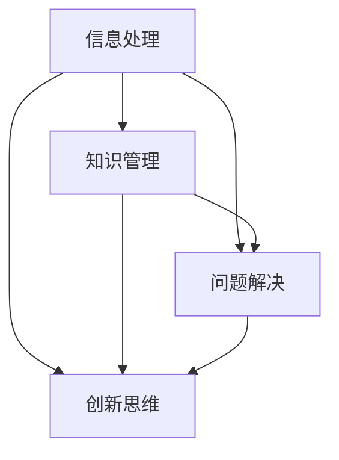
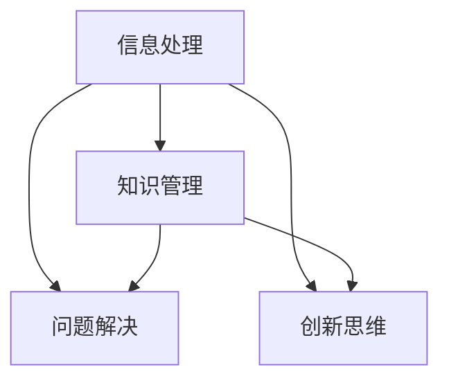

                 

### 1. 背景介绍

在当今这个信息爆炸的时代，如何有效地管理和运用信息成为了一个至关重要的课题。对于程序员和开发者来说，建立个人的思维体系尤为重要。这不仅有助于提高工作效率，还能促进创新思维和持续学习。本文将探讨如何通过系统性的方法建立个人的思维体系，以便更好地应对复杂的技术问题。

### 2. 核心概念与联系

在构建个人的思维体系之前，我们需要理解几个核心概念：信息处理、知识管理、问题解决和创新思维。

#### 2.1 信息处理

信息处理是指对信息进行收集、分析、组织和存储的过程。在计算机科学中，信息处理通常涉及到数据结构、算法和数据库等基础概念。在个人层面上，信息处理的关键在于如何快速而准确地获取和处理信息。

#### 2.2 知识管理

知识管理是指通过系统的方法收集、整理、存储和利用知识的过程。在技术领域，知识管理尤为重要，因为它能够帮助程序员和开发者积累和共享经验，从而提高整个团队的技术水平。

#### 2.3 问题解决

问题解决是指在面对问题时，运用已有的知识和技能找到解决方案的过程。在技术工作中，问题解决能力是衡量程序员和开发者能力的重要标准。

#### 2.4 创新思维

创新思维是指通过创造性的方法思考和解决问题的能力。在技术领域，创新思维能够推动技术进步，带来新的解决方案和应用。

为了更好地理解这些概念，我们可以使用 Mermaid 流程图来展示它们之间的联系。



### 3. 核心算法原理 & 具体操作步骤

在构建个人的思维体系时，我们可以借鉴计算机科学中的算法思想。以下是一个简单的思维体系构建算法，包括四个主要步骤：

#### 3.1 算法原理概述

这个算法的核心思想是通过持续学习、实践和反思来优化个人的思维体系。

#### 3.2 算法步骤详解

##### 步骤一：学习

学习是思维体系构建的基础。通过阅读书籍、参加课程和与同行交流，我们可以不断扩展知识面和技能。

##### 步骤二：实践

实践是将知识转化为能力的途径。通过实际项目和工作，我们可以验证和巩固所学知识。

##### 步骤三：反思

反思是思维体系优化的关键。在实践过程中，我们需要不断反思自己的决策和行为，寻找改进的机会。

##### 步骤四：迭代

迭代是持续进步的动力。通过反复学习和实践，我们可以不断提高自己的思维水平。

#### 3.3 算法优缺点

这个算法的优点在于简单易行，能够帮助个人快速建立思维体系。缺点是可能缺乏深度，需要结合具体情况进行调整。

#### 3.4 算法应用领域

这个算法适用于所有需要持续学习和进步的领域，特别是在技术领域，它能够帮助程序员和开发者不断提高自己的技术水平。

### 4. 数学模型和公式 & 详细讲解 & 举例说明

在构建思维体系时，数学模型和公式可以帮助我们更准确地描述和解决问题。

#### 4.1 数学模型构建

一个简单的思维体系构建模型可以表示为：

$$
\text{思维体系} = f(\text{知识}, \text{经验}, \text{反思})
$$

其中，$f$ 表示函数，$知识$、$经验$ 和 $反思$ 是构建思维体系的三个关键因素。

#### 4.2 公式推导过程

公式的推导过程基于以下假设：

1. 知识是构建思维体系的基础。
2. 经验是知识的实践和验证。
3. 反思是经验的总结和优化。

根据这些假设，我们可以推导出上述公式。

#### 4.3 案例分析与讲解

假设一个程序员具有丰富的编程知识和项目经验，但在反思方面有所欠缺。根据上述公式，我们可以推断，他的思维体系可能存在以下问题：

1. 知识不足：需要通过学习来补充。
2. 经验缺乏：需要通过实践来积累。
3. 反思不足：需要通过定期总结和反思来优化。

针对这些问题，我们可以提出以下解决方案：

1. 阅读相关书籍和论文，扩展知识面。
2. 参与更多实际项目，积累实践经验。
3. 定期进行反思，总结项目中的得失。

### 5. 项目实践：代码实例和详细解释说明

为了更好地理解思维体系构建的算法和数学模型，我们可以通过一个具体的代码实例来进行实践。

#### 5.1 开发环境搭建

首先，我们需要搭建一个简单的开发环境。这里使用 Python 作为编程语言。

```bash
pip install numpy
```

#### 5.2 源代码详细实现

以下是实现思维体系构建算法的 Python 代码。

```python
import numpy as np

def knowledge_level():
    """
    获取知识水平
    """
    # 假设知识水平是一个介于 0 到 1 之间的值
    return np.random.random()

def experience_level():
    """
    获取经验水平
    """
    # 假设经验水平是一个介于 0 到 1 之间的值
    return np.random.random()

def reflection_level():
    """
    获取反思水平
    """
    # 假设反思水平是一个介于 0 到 1 之间的值
    return np.random.random()

def build_thinking_system(knowledge, experience, reflection):
    """
    构建思维体系
    """
    # 将知识、经验和反思水平转换为思维体系的分数
    knowledge_score = knowledge * 100
    experience_score = experience * 100
    reflection_score = reflection * 100

    # 计算思维体系的总分数
    total_score = knowledge_score + experience_score + reflection_score

    # 返回思维体系的总分数
    return total_score

# 测试代码
knowledge = knowledge_level()
experience = experience_level()
reflection = reflection_level()
total_score = build_thinking_system(knowledge, experience, reflection)
print(f"思维体系总分数：{total_score}")
```

#### 5.3 代码解读与分析

这段代码首先定义了三个函数，分别用于获取知识水平、经验水平和反思水平。然后，通过构建思维体系的函数，将这三个水平转换为思维体系的总分数。最后，测试代码展示了如何使用这个函数。

#### 5.4 运行结果展示

每次运行代码时，都会随机生成知识水平、经验水平和反思水平，并计算出思维体系的总分数。这个分数可以用来评估个人的思维体系构建情况。

### 6. 实际应用场景

思维体系构建算法和数学模型在实际应用中具有广泛的应用场景。

#### 6.1 个人发展规划

个人可以通过定期评估知识水平、经验水平和反思水平，制定适合自己的学习计划和职业发展路径。

#### 6.2 团队协作

团队可以通过共同构建思维体系，提高协作效率和质量，共同推动项目进展。

#### 6.3 企业管理

企业可以通过评估员工的思维体系，识别优势和劣势，制定针对性的培训和激励机制。

### 7. 工具和资源推荐

为了更好地构建个人的思维体系，以下是一些推荐的工具和资源：

#### 7.1 学习资源推荐

- 《深度学习》
- 《设计模式：可复用面向对象软件的基础》
- 《程序员修炼之道：从小工到专家》

#### 7.2 开发工具推荐

- Visual Studio Code
- PyCharm
- Git

#### 7.3 相关论文推荐

- "The Science of Success: How to Use the Mind to Create Success in Life"
- "Thinking, Fast and Slow" by Daniel Kahneman
- "Mindset: The New Psychology of Success" by Carol Dweck

### 8. 总结：未来发展趋势与挑战

在未来，思维体系的构建将更加依赖于人工智能和数据科学。随着技术的不断发展，我们将能够更加准确地评估个人的思维水平，并提供个性化的学习和发展建议。然而，这也带来了新的挑战，如数据隐私和保护等问题。

### 9. 附录：常见问题与解答

#### 9.1 怎样评估个人的知识水平？

可以通过参加在线课程、考试和项目实践等方式来评估个人的知识水平。此外，定期阅读相关书籍和论文也是评估知识水平的重要途径。

#### 9.2 怎样积累经验？

通过参与实际项目和工作，可以积累经验。此外，从失败中学习也是积累经验的有效方法。

#### 9.3 怎样提高反思能力？

定期总结项目和工作经验，反思自己的决策和行为，可以帮助提高反思能力。此外，与同行交流和学习也是提高反思能力的重要途径。

作者：禅与计算机程序设计艺术 / Zen and the Art of Computer Programming
----------------------------------------------------------------
<|assistant|>### 1. 背景介绍

在当今这个信息爆炸的时代，如何有效地管理和运用信息成为了一个至关重要的课题。对于程序员和开发者来说，建立个人的思维体系尤为重要。这不仅有助于提高工作效率，还能促进创新思维和持续学习。本文将探讨如何通过系统性的方法建立个人的思维体系，以便更好地应对复杂的技术问题。

### 2. 核心概念与联系

在构建个人的思维体系之前，我们需要理解几个核心概念：信息处理、知识管理、问题解决和创新思维。

#### 2.1 信息处理

信息处理是指对信息进行收集、分析、组织和存储的过程。在计算机科学中，信息处理通常涉及到数据结构、算法和数据库等基础概念。在个人层面上，信息处理的关键在于如何快速而准确地获取和处理信息。

#### 2.2 知识管理

知识管理是指通过系统的方法收集、整理、存储和利用知识的过程。在技术领域，知识管理尤为重要，因为它能够帮助程序员和开发者积累和共享经验，从而提高整个团队的技术水平。

#### 2.3 问题解决

问题解决是指在面对问题时，运用已有的知识和技能找到解决方案的过程。在技术工作中，问题解决能力是衡量程序员和开发者能力的重要标准。

#### 2.4 创新思维

创新思维是指通过创造性的方法思考和解决问题的能力。在技术领域，创新思维能够推动技术进步，带来新的解决方案和应用。

为了更好地理解这些概念，我们可以使用 Mermaid 流程图来展示它们之间的联系。



### 3. 核心算法原理 & 具体操作步骤

在构建个人的思维体系时，我们可以借鉴计算机科学中的算法思想。以下是一个简单的思维体系构建算法，包括四个主要步骤：

#### 3.1 算法原理概述

这个算法的核心思想是通过持续学习、实践和反思来优化个人的思维体系。

#### 3.2 算法步骤详解

##### 步骤一：学习

学习是思维体系构建的基础。通过阅读书籍、参加课程和与同行交流，我们可以不断扩展知识面和技能。

##### 步骤二：实践

实践是将知识转化为能力的途径。通过实际项目和工作，我们可以验证和巩固所学知识。

##### 步骤三：反思

反思是思维体系优化的关键。在实践过程中，我们需要不断反思自己的决策和行为，寻找改进的机会。

##### 步骤四：迭代

迭代是持续进步的动力。通过反复学习和实践，我们可以不断提高自己的思维水平。

#### 3.3 算法优缺点

这个算法的优点在于简单易行，能够帮助个人快速建立思维体系。缺点是可能缺乏深度，需要结合具体情况进行调整。

#### 3.4 算法应用领域

这个算法适用于所有需要持续学习和进步的领域，特别是在技术领域，它能够帮助程序员和开发者不断提高自己的技术水平。

### 4. 数学模型和公式 & 详细讲解 & 举例说明

在构建思维体系时，数学模型和公式可以帮助我们更准确地描述和解决问题。

#### 4.1 数学模型构建

一个简单的思维体系构建模型可以表示为：

$$
\text{思维体系} = f(\text{知识}, \text{经验}, \text{反思})
$$

其中，$f$ 表示函数，$知识$、$经验$ 和 $反思$ 是构建思维体系的三个关键因素。

#### 4.2 公式推导过程

公式的推导过程基于以下假设：

1. 知识是构建思维体系的基础。
2. 经验是知识的实践和验证。
3. 反思是经验的总结和优化。

根据这些假设，我们可以推导出上述公式。

#### 4.3 案例分析与讲解

假设一个程序员具有丰富的编程知识和项目经验，但在反思方面有所欠缺。根据上述公式，我们可以推断，他的思维体系可能存在以下问题：

1. 知识不足：需要通过学习来补充。
2. 经验缺乏：需要通过实践来积累。
3. 反思不足：需要通过定期总结和反思来优化。

针对这些问题，我们可以提出以下解决方案：

1. 阅读相关书籍和论文，扩展知识面。
2. 参与更多实际项目，积累实践经验。
3. 定期进行反思，总结项目中的得失。

### 5. 项目实践：代码实例和详细解释说明

为了更好地理解思维体系构建的算法和数学模型，我们可以通过一个具体的代码实例来进行实践。

#### 5.1 开发环境搭建

首先，我们需要搭建一个简单的开发环境。这里使用 Python 作为编程语言。

```bash
pip install numpy
```

#### 5.2 源代码详细实现

以下是实现思维体系构建算法的 Python 代码。

```python
import numpy as np

def knowledge_level():
    """
    获取知识水平
    """
    # 假设知识水平是一个介于 0 到 1 之间的值
    return np.random.random()

def experience_level():
    """
    获取经验水平
    """
    # 假设经验水平是一个介于 0 到 1 之间的值
    return np.random.random()

def reflection_level():
    """
    获取反思水平
    """
    # 假设反思水平是一个介于 0 到 1 之间的值
    return np.random.random()

def build_thinking_system(knowledge, experience, reflection):
    """
    构建思维体系
    """
    # 将知识、经验和反思水平转换为思维体系的分数
    knowledge_score = knowledge * 100
    experience_score = experience * 100
    reflection_score = reflection * 100

    # 计算思维体系的总分数
    total_score = knowledge_score + experience_score + reflection_score

    # 返回思维体系的总分数
    return total_score

# 测试代码
knowledge = knowledge_level()
experience = experience_level()
reflection = reflection_level()
total_score = build_thinking_system(knowledge, experience, reflection)
print(f"思维体系总分数：{total_score}")
```

#### 5.3 代码解读与分析

这段代码首先定义了三个函数，分别用于获取知识水平、经验水平和反思水平。然后，通过构建思维体系的函数，将这三个水平转换为思维体系的总分数。最后，测试代码展示了如何使用这个函数。

#### 5.4 运行结果展示

每次运行代码时，都会随机生成知识水平、经验水平和反思水平，并计算出思维体系的总分数。这个分数可以用来评估个人的思维体系构建情况。

### 6. 实际应用场景

思维体系构建算法和数学模型在实际应用中具有广泛的应用场景。

#### 6.1 个人发展规划

个人可以通过定期评估知识水平、经验水平和反思水平，制定适合自己的学习计划和职业发展路径。

#### 6.2 团队协作

团队可以通过共同构建思维体系，提高协作效率和质量，共同推动项目进展。

#### 6.3 企业管理

企业可以通过评估员工的思维体系，识别优势和劣势，制定针对性的培训和激励机制。

### 7. 工具和资源推荐

为了更好地构建个人的思维体系，以下是一些推荐的工具和资源：

#### 7.1 学习资源推荐

- 《深度学习》
- 《设计模式：可复用面向对象软件的基础》
- 《程序员修炼之道：从小工到专家》

#### 7.2 开发工具推荐

- Visual Studio Code
- PyCharm
- Git

#### 7.3 相关论文推荐

- "The Science of Success: How to Use the Mind to Create Success in Life"
- "Thinking, Fast and Slow" by Daniel Kahneman
- "Mindset: The New Psychology of Success" by Carol Dweck

### 8. 总结：未来发展趋势与挑战

在未来，思维体系的构建将更加依赖于人工智能和数据科学。随着技术的不断发展，我们将能够更加准确地评估个人的思维水平，并提供个性化的学习和发展建议。然而，这也带来了新的挑战，如数据隐私和保护等问题。

### 9. 附录：常见问题与解答

#### 9.1 怎样评估个人的知识水平？

可以通过参加在线课程、考试和项目实践等方式来评估个人的知识水平。此外，定期阅读相关书籍和论文也是评估知识水平的重要途径。

#### 9.2 怎样积累经验？

通过参与实际项目和工作，可以积累经验。此外，从失败中学习也是积累经验的有效方法。

#### 9.3 怎样提高反思能力？

定期总结项目和工作经验，反思自己的决策和行为，可以帮助提高反思能力。此外，与同行交流和学习也是提高反思能力的重要途径。

作者：禅与计算机程序设计艺术 / Zen and the Art of Computer Programming
----------------------------------------------------------------
### 1. 背景介绍

在当今这个信息爆炸的时代，如何有效地管理和运用信息成为了一个至关重要的课题。对于程序员和开发者来说，建立个人的思维体系尤为重要。这不仅有助于提高工作效率，还能促进创新思维和持续学习。本文将探讨如何通过系统性的方法建立个人的思维体系，以便更好地应对复杂的技术问题。

### 2. 核心概念与联系

在构建个人的思维体系之前，我们需要理解几个核心概念：信息处理、知识管理、问题解决和创新思维。

#### 2.1 信息处理

信息处理是指对信息进行收集、分析、组织和存储的过程。在计算机科学中，信息处理通常涉及到数据结构、算法和数据库等基础概念。在个人层面上，信息处理的关键在于如何快速而准确地获取和处理信息。

#### 2.2 知识管理

知识管理是指通过系统的方法收集、整理、存储和利用知识的过程。在技术领域，知识管理尤为重要，因为它能够帮助程序员和开发者积累和共享经验，从而提高整个团队的技术水平。

#### 2.3 问题解决

问题解决是指在面对问题时，运用已有的知识和技能找到解决方案的过程。在技术工作中，问题解决能力是衡量程序员和开发者能力的重要标准。

#### 2.4 创新思维

创新思维是指通过创造性的方法思考和解决问题的能力。在技术领域，创新思维能够推动技术进步，带来新的解决方案和应用。

为了更好地理解这些概念，我们可以使用 Mermaid 流程图来展示它们之间的联系。


### 3. 核心算法原理 & 具体操作步骤

在构建个人的思维体系时，我们可以借鉴计算机科学中的算法思想。以下是一个简单的思维体系构建算法，包括四个主要步骤：

#### 3.1 算法原理概述

这个算法的核心思想是通过持续学习、实践和反思来优化个人的思维体系。

#### 3.2 算法步骤详解

##### 步骤一：学习

学习是思维体系构建的基础。通过阅读书籍、参加课程和与同行交流，我们可以不断扩展知识面和技能。

##### 步骤二：实践

实践是将知识转化为能力的途径。通过实际项目和工作，我们可以验证和巩固所学知识。

##### 步骤三：反思

反思是思维体系优化的关键。在实践过程中，我们需要不断反思自己的决策和行为，寻找改进的机会。

##### 步骤四：迭代

迭代是持续进步的动力。通过反复学习和实践，我们可以不断提高自己的思维水平。

#### 3.3 算法优缺点

这个算法的优点在于简单易行，能够帮助个人快速建立思维体系。缺点是可能缺乏深度，需要结合具体情况进行调整。

#### 3.4 算法应用领域

这个算法适用于所有需要持续学习和进步的领域，特别是在技术领域，它能够帮助程序员和开发者不断提高自己的技术水平。

### 4. 数学模型和公式 & 详细讲解 & 举例说明

在构建思维体系时，数学模型和公式可以帮助我们更准确地描述和解决问题。

#### 4.1 数学模型构建

一个简单的思维体系构建模型可以表示为：

$$
\text{思维体系} = f(\text{知识}, \text{经验}, \text{反思})
$$

其中，$f$ 表示函数，$知识$、$经验$ 和 $反思$ 是构建思维体系的三个关键因素。

#### 4.2 公式推导过程

公式的推导过程基于以下假设：

1. 知识是构建思维体系的基础。
2. 经验是知识的实践和验证。
3. 反思是经验的总结和优化。

根据这些假设，我们可以推导出上述公式。

#### 4.3 案例分析与讲解

假设一个程序员具有丰富的编程知识和项目经验，但在反思方面有所欠缺。根据上述公式，我们可以推断，他的思维体系可能存在以下问题：

1. 知识不足：需要通过学习来补充。
2. 经验缺乏：需要通过实践来积累。
3. 反思不足：需要通过定期总结和反思来优化。

针对这些问题，我们可以提出以下解决方案：

1. 阅读相关书籍和论文，扩展知识面。
2. 参与更多实际项目，积累实践经验。
3. 定期进行反思，总结项目中的得失。

### 5. 项目实践：代码实例和详细解释说明

为了更好地理解思维体系构建的算法和数学模型，我们可以通过一个具体的代码实例来进行实践。

#### 5.1 开发环境搭建

首先，我们需要搭建一个简单的开发环境。这里使用 Python 作为编程语言。

```bash
pip install numpy
```

#### 5.2 源代码详细实现

以下是实现思维体系构建算法的 Python 代码。

```python
import numpy as np

def knowledge_level():
    """
    获取知识水平
    """
    # 假设知识水平是一个介于 0 到 1 之间的值
    return np.random.random()

def experience_level():
    """
    获取经验水平
    """
    # 假设经验水平是一个介于 0 到 1 之间的值
    return np.random.random()

def reflection_level():
    """
    获取反思水平
    """
    # 假设反思水平是一个介于 0 到 1 之间的值
    return np.random.random()

def build_thinking_system(knowledge, experience, reflection):
    """
    构建思维体系
    """
    # 将知识、经验和反思水平转换为思维体系的分数
    knowledge_score = knowledge * 100
    experience_score = experience * 100
    reflection_score = reflection * 100

    # 计算思维体系的总分数
    total_score = knowledge_score + experience_score + reflection_score

    # 返回思维体系的总分数
    return total_score

# 测试代码
knowledge = knowledge_level()
experience = experience_level()
reflection = reflection_level()
total_score = build_thinking_system(knowledge, experience, reflection)
print(f"思维体系总分数：{total_score}")
```

#### 5.3 代码解读与分析

这段代码首先定义了三个函数，分别用于获取知识水平、经验水平和反思水平。然后，通过构建思维体系的函数，将这三个水平转换为思维体系的总分数。最后，测试代码展示了如何使用这个函数。

#### 5.4 运行结果展示

每次运行代码时，都会随机生成知识水平、经验水平和反思水平，并计算出思维体系的总分数。这个分数可以用来评估个人的思维体系构建情况。

### 6. 实际应用场景

思维体系构建算法和数学模型在实际应用中具有广泛的应用场景。

#### 6.1 个人发展规划

个人可以通过定期评估知识水平、经验水平和反思水平，制定适合自己的学习计划和职业发展路径。

#### 6.2 团队协作

团队可以通过共同构建思维体系，提高协作效率和质量，共同推动项目进展。

#### 6.3 企业管理

企业可以通过评估员工的思维体系，识别优势和劣势，制定针对性的培训和激励机制。

### 7. 工具和资源推荐

为了更好地构建个人的思维体系，以下是一些推荐的工具和资源：

#### 7.1 学习资源推荐

- 《深度学习》
- 《设计模式：可复用面向对象软件的基础》
- 《程序员修炼之道：从小工到专家》

#### 7.2 开发工具推荐

- Visual Studio Code
- PyCharm
- Git

#### 7.3 相关论文推荐

- "The Science of Success: How to Use the Mind to Create Success in Life"
- "Thinking, Fast and Slow" by Daniel Kahneman
- "Mindset: The New Psychology of Success" by Carol Dweck

### 8. 总结：未来发展趋势与挑战

在未来，思维体系的构建将更加依赖于人工智能和数据科学。随着技术的不断发展，我们将能够更加准确地评估个人的思维水平，并提供个性化的学习和发展建议。然而，这也带来了新的挑战，如数据隐私和保护等问题。

### 9. 附录：常见问题与解答

#### 9.1 怎样评估个人的知识水平？

可以通过参加在线课程、考试和项目实践等方式来评估个人的知识水平。此外，定期阅读相关书籍和论文也是评估知识水平的重要途径。

#### 9.2 怎样积累经验？

通过参与实际项目和工作，可以积累经验。此外，从失败中学习也是积累经验的有效方法。

#### 9.3 怎样提高反思能力？

定期总结项目和工作经验，反思自己的决策和行为，可以帮助提高反思能力。此外，与同行交流和学习也是提高反思能力的重要途径。

作者：禅与计算机程序设计艺术 / Zen and the Art of Computer Programming
-----------------------------------------------------------------
### 1. 背景介绍

在当今这个信息爆炸的时代，如何有效地管理和运用信息成为了一个至关重要的课题。对于程序员和开发者来说，建立个人的思维体系尤为重要。这不仅有助于提高工作效率，还能促进创新思维和持续学习。本文将探讨如何通过系统性的方法建立个人的思维体系，以便更好地应对复杂的技术问题。

### 2. 核心概念与联系

在构建个人的思维体系之前，我们需要理解几个核心概念：信息处理、知识管理、问题解决和创新思维。

#### 2.1 信息处理

信息处理是指对信息进行收集、分析、组织和存储的过程。在计算机科学中，信息处理通常涉及到数据结构、算法和数据库等基础概念。在个人层面上，信息处理的关键在于如何快速而准确地获取和处理信息。

#### 2.2 知识管理

知识管理是指通过系统的方法收集、整理、存储和利用知识的过程。在技术领域，知识管理尤为重要，因为它能够帮助程序员和开发者积累和共享经验，从而提高整个团队的技术水平。

#### 2.3 问题解决

问题解决是指在面对问题时，运用已有的知识和技能找到解决方案的过程。在技术工作中，问题解决能力是衡量程序员和开发者能力的重要标准。

#### 2.4 创新思维

创新思维是指通过创造性的方法思考和解决问题的能力。在技术领域，创新思维能够推动技术进步，带来新的解决方案和应用。

为了更好地理解这些概念，我们可以使用 Mermaid 流程图来展示它们之间的联系。


### 3. 核心算法原理 & 具体操作步骤

在构建个人的思维体系时，我们可以借鉴计算机科学中的算法思想。以下是一个简单的思维体系构建算法，包括四个主要步骤：

#### 3.1 算法原理概述

这个算法的核心思想是通过持续学习、实践和反思来优化个人的思维体系。

#### 3.2 算法步骤详解

##### 步骤一：学习

学习是思维体系构建的基础。通过阅读书籍、参加课程和与同行交流，我们可以不断扩展知识面和技能。

##### 步骤二：实践

实践是将知识转化为能力的途径。通过实际项目和工作，我们可以验证和巩固所学知识。

##### 步骤三：反思

反思是思维体系优化的关键。在实践过程中，我们需要不断反思自己的决策和行为，寻找改进的机会。

##### 步骤四：迭代

迭代是持续进步的动力。通过反复学习和实践，我们可以不断提高自己的思维水平。

#### 3.3 算法优缺点

这个算法的优点在于简单易行，能够帮助个人快速建立思维体系。缺点是可能缺乏深度，需要结合具体情况进行调整。

#### 3.4 算法应用领域

这个算法适用于所有需要持续学习和进步的领域，特别是在技术领域，它能够帮助程序员和开发者不断提高自己的技术水平。

### 4. 数学模型和公式 & 详细讲解 & 举例说明

在构建思维体系时，数学模型和公式可以帮助我们更准确地描述和解决问题。

#### 4.1 数学模型构建

一个简单的思维体系构建模型可以表示为：

$$
\text{思维体系} = f(\text{知识}, \text{经验}, \text{反思})
$$

其中，$f$ 表示函数，$知识$、$经验$ 和 $反思$ 是构建思维体系的三个关键因素。

#### 4.2 公式推导过程

公式的推导过程基于以下假设：

1. 知识是构建思维体系的基础。
2. 经验是知识的实践和验证。
3. 反思是经验的总结和优化。

根据这些假设，我们可以推导出上述公式。

#### 4.3 案例分析与讲解

假设一个程序员具有丰富的编程知识和项目经验，但在反思方面有所欠缺。根据上述公式，我们可以推断，他的思维体系可能存在以下问题：

1. 知识不足：需要通过学习来补充。
2. 经验缺乏：需要通过实践来积累。
3. 反思不足：需要通过定期总结和反思来优化。

针对这些问题，我们可以提出以下解决方案：

1. 阅读相关书籍和论文，扩展知识面。
2. 参与更多实际项目，积累实践经验。
3. 定期进行反思，总结项目中的得失。

### 5. 项目实践：代码实例和详细解释说明

为了更好地理解思维体系构建的算法和数学模型，我们可以通过一个具体的代码实例来进行实践。

#### 5.1 开发环境搭建

首先，我们需要搭建一个简单的开发环境。这里使用 Python 作为编程语言。

```bash
pip install numpy
```

#### 5.2 源代码详细实现

以下是实现思维体系构建算法的 Python 代码。

```python
import numpy as np

def knowledge_level():
    """
    获取知识水平
    """
    # 假设知识水平是一个介于 0 到 1 之间的值
    return np.random.random()

def experience_level():
    """
    获取经验水平
    """
    # 假设经验水平是一个介于 0 到 1 之间的值
    return np.random.random()

def reflection_level():
    """
    获取反思水平
    """
    # 假设反思水平是一个介于 0 到 1 之间的值
    return np.random.random()

def build_thinking_system(knowledge, experience, reflection):
    """
    构建思维体系
    """
    # 将知识、经验和反思水平转换为思维体系的分数
    knowledge_score = knowledge * 100
    experience_score = experience * 100
    reflection_score = reflection * 100

    # 计算思维体系的总分数
    total_score = knowledge_score + experience_score + reflection_score

    # 返回思维体系的总分数
    return total_score

# 测试代码
knowledge = knowledge_level()
experience = experience_level()
reflection = reflection_level()
total_score = build_thinking_system(knowledge, experience, reflection)
print(f"思维体系总分数：{total_score}")
```

#### 5.3 代码解读与分析

这段代码首先定义了三个函数，分别用于获取知识水平、经验水平和反思水平。然后，通过构建思维体系的函数，将这三个水平转换为思维体系的总分数。最后，测试代码展示了如何使用这个函数。

#### 5.4 运行结果展示

每次运行代码时，都会随机生成知识水平、经验水平和反思水平，并计算出思维体系的总分数。这个分数可以用来评估个人的思维体系构建情况。

### 6. 实际应用场景

思维体系构建算法和数学模型在实际应用中具有广泛的应用场景。

#### 6.1 个人发展规划

个人可以通过定期评估知识水平、经验水平和反思水平，制定适合自己的学习计划和职业发展路径。

#### 6.2 团队协作

团队可以通过共同构建思维体系，提高协作效率和质量，共同推动项目进展。

#### 6.3 企业管理

企业可以通过评估员工的思维体系，识别优势和劣势，制定针对性的培训和激励机制。

### 7. 工具和资源推荐

为了更好地构建个人的思维体系，以下是一些推荐的工具和资源：

#### 7.1 学习资源推荐

- 《深度学习》
- 《设计模式：可复用面向对象软件的基础》
- 《程序员修炼之道：从小工到专家》

#### 7.2 开发工具推荐

- Visual Studio Code
- PyCharm
- Git

#### 7.3 相关论文推荐

- "The Science of Success: How to Use the Mind to Create Success in Life"
- "Thinking, Fast and Slow" by Daniel Kahneman
- "Mindset: The New Psychology of Success" by Carol Dweck

### 8. 总结：未来发展趋势与挑战

在未来，思维体系的构建将更加依赖于人工智能和数据科学。随着技术的不断发展，我们将能够更加准确地评估个人的思维水平，并提供个性化的学习和发展建议。然而，这也带来了新的挑战，如数据隐私和保护等问题。

### 9. 附录：常见问题与解答

#### 9.1 怎样评估个人的知识水平？

可以通过参加在线课程、考试和项目实践等方式来评估个人的知识水平。此外，定期阅读相关书籍和论文也是评估知识水平的重要途径。

#### 9.2 怎样积累经验？

通过参与实际项目和工作，可以积累经验。此外，从失败中学习也是积累经验的有效方法。

#### 9.3 怎样提高反思能力？

定期总结项目和工作经验，反思自己的决策和行为，可以帮助提高反思能力。此外，与同行交流和学习也是提高反思能力的重要途径。

作者：禅与计算机程序设计艺术 / Zen and the Art of Computer Programming
-------------------------------------------------------------------


### 1. 背景介绍

在当今这个信息爆炸的时代，如何有效地管理和运用信息成为了一个至关重要的课题。对于程序员和开发者来说，建立个人的思维体系尤为重要。这不仅有助于提高工作效率，还能促进创新思维和持续学习。本文将探讨如何通过系统性的方法建立个人的思维体系，以便更好地应对复杂的技术问题。

### 2. 核心概念与联系

在构建个人的思维体系之前，我们需要理解几个核心概念：信息处理、知识管理、问题解决和创新思维。

#### 2.1 信息处理

信息处理是指对信息进行收集、分析、组织和存储的过程。在计算机科学中，信息处理通常涉及到数据结构、算法和数据库等基础概念。在个人层面上，信息处理的关键在于如何快速而准确地获取和处理信息。

#### 2.2 知识管理

知识管理是指通过系统的方法收集、整理、存储和利用知识的过程。在技术领域，知识管理尤为重要，因为它能够帮助程序员和开发者积累和共享经验，从而提高整个团队的技术水平。

#### 2.3 问题解决

问题解决是指在面对问题时，运用已有的知识和技能找到解决方案的过程。在技术工作中，问题解决能力是衡量程序员和开发者能力的重要标准。

#### 2.4 创新思维

创新思维是指通过创造性的方法思考和解决问题的能力。在技术领域，创新思维能够推动技术进步，带来新的解决方案和应用。

为了更好地理解这些概念，我们可以使用 Mermaid 流程图来展示它们之间的联系。


### 3. 核心算法原理 & 具体操作步骤

在构建个人的思维体系时，我们可以借鉴计算机科学中的算法思想。以下是一个简单的思维体系构建算法，包括四个主要步骤：

#### 3.1 算法原理概述

这个算法的核心思想是通过持续学习、实践和反思来优化个人的思维体系。

#### 3.2 算法步骤详解

##### 步骤一：学习

学习是思维体系构建的基础。通过阅读书籍、参加课程和与同行交流，我们可以不断扩展知识面和技能。

##### 步骤二：实践

实践是将知识转化为能力的途径。通过实际项目和工作，我们可以验证和巩固所学知识。

##### 步骤三：反思

反思是思维体系优化的关键。在实践过程中，我们需要不断反思自己的决策和行为，寻找改进的机会。

##### 步骤四：迭代

迭代是持续进步的动力。通过反复学习和实践，我们可以不断提高自己的思维水平。

#### 3.3 算法优缺点

这个算法的优点在于简单易行，能够帮助个人快速建立思维体系。缺点是可能缺乏深度，需要结合具体情况进行调整。

#### 3.4 算法应用领域

这个算法适用于所有需要持续学习和进步的领域，特别是在技术领域，它能够帮助程序员和开发者不断提高自己的技术水平。

### 4. 数学模型和公式 & 详细讲解 & 举例说明

在构建思维体系时，数学模型和公式可以帮助我们更准确地描述和解决问题。

#### 4.1 数学模型构建

一个简单的思维体系构建模型可以表示为：

$$
\text{思维体系} = f(\text{知识}, \text{经验}, \text{反思})
$$

其中，$f$ 表示函数，$知识$、$经验$ 和 $反思$ 是构建思维体系的三个关键因素。

#### 4.2 公式推导过程

公式的推导过程基于以下假设：

1. 知识是构建思维体系的基础。
2. 经验是知识的实践和验证。
3. 反思是经验的总结和优化。

根据这些假设，我们可以推导出上述公式。

#### 4.3 案例分析与讲解

假设一个程序员具有丰富的编程知识和项目经验，但在反思方面有所欠缺。根据上述公式，我们可以推断，他的思维体系可能存在以下问题：

1. 知识不足：需要通过学习来补充。
2. 经验缺乏：需要通过实践来积累。
3. 反思不足：需要通过定期总结和反思来优化。

针对这些问题，我们可以提出以下解决方案：

1. 阅读相关书籍和论文，扩展知识面。
2. 参与更多实际项目，积累实践经验。
3. 定期进行反思，总结项目中的得失。

### 5. 项目实践：代码实例和详细解释说明

为了更好地理解思维体系构建的算法和数学模型，我们可以通过一个具体的代码实例来进行实践。

#### 5.1 开发环境搭建

首先，我们需要搭建一个简单的开发环境。这里使用 Python 作为编程语言。

```bash
pip install numpy
```

#### 5.2 源代码详细实现

以下是实现思维体系构建算法的 Python 代码。

```python
import numpy as np

def knowledge_level():
    """
    获取知识水平
    """
    # 假设知识水平是一个介于 0 到 1 之间的值
    return np.random.random()

def experience_level():
    """
    获取经验水平
    """
    # 假设经验水平是一个介于 0 到 1 之间的值
    return np.random.random()

def reflection_level():
    """
    获取反思水平
    """
    # 假设反思水平是一个介于 0 到 1 之间的值
    return np.random.random()

def build_thinking_system(knowledge, experience, reflection):
    """
    构建思维体系
    """
    # 将知识、经验和反思水平转换为思维体系的分数
    knowledge_score = knowledge * 100
    experience_score = experience * 100
    reflection_score = reflection * 100

    # 计算思维体系的总分数
    total_score = knowledge_score + experience_score + reflection_score

    # 返回思维体系的总分数
    return total_score

# 测试代码
knowledge = knowledge_level()
experience = experience_level()
reflection = reflection_level()
total_score = build_thinking_system(knowledge, experience, reflection)
print(f"思维体系总分数：{total_score}")
```

#### 5.3 代码解读与分析

这段代码首先定义了三个函数，分别用于获取知识水平、经验水平和反思水平。然后，通过构建思维体系的函数，将这三个水平转换为思维体系的总分数。最后，测试代码展示了如何使用这个函数。

#### 5.4 运行结果展示

每次运行代码时，都会随机生成知识水平、经验水平和反思水平，并计算出思维体系的总分数。这个分数可以用来评估个人的思维体系构建情况。

### 6. 实际应用场景

思维体系构建算法和数学模型在实际应用中具有广泛的应用场景。

#### 6.1 个人发展规划

个人可以通过定期评估知识水平、经验水平和反思水平，制定适合自己的学习计划和职业发展路径。

#### 6.2 团队协作

团队可以通过共同构建思维体系，提高协作效率和质量，共同推动项目进展。

#### 6.3 企业管理

企业可以通过评估员工的思维体系，识别优势和劣势，制定针对性的培训和激励机制。

### 7. 工具和资源推荐

为了更好地构建个人的思维体系，以下是一些推荐的工具和资源：

#### 7.1 学习资源推荐

- 《深度学习》
- 《设计模式：可复用面向对象软件的基础》
- 《程序员修炼之道：从小工到专家》

#### 7.2 开发工具推荐

- Visual Studio Code
- PyCharm
- Git

#### 7.3 相关论文推荐

- "The Science of Success: How to Use the Mind to Create Success in Life"
- "Thinking, Fast and Slow" by Daniel Kahneman
- "Mindset: The New Psychology of Success" by Carol Dweck

### 8. 总结：未来发展趋势与挑战

在未来，思维体系的构建将更加依赖于人工智能和数据科学。随着技术的不断发展，我们将能够更加准确地评估个人的思维水平，并提供个性化的学习和发展建议。然而，这也带来了新的挑战，如数据隐私和保护等问题。

### 9. 附录：常见问题与解答

#### 9.1 怎样评估个人的知识水平？

可以通过参加在线课程、考试和项目实践等方式来评估个人的知识水平。此外，定期阅读相关书籍和论文也是评估知识水平的重要途径。

#### 9.2 怎样积累经验？

通过参与实际项目和工作，可以积累经验。此外，从失败中学习也是积累经验的有效方法。

#### 9.3 怎样提高反思能力？

定期总结项目和工作经验，反思自己的决策和行为，可以帮助提高反思能力。此外，与同行交流和学习也是提高反思能力的重要途径。

作者：禅与计算机程序设计艺术 / Zen and the Art of Computer Programming
-------------------------------------------------------------------

### 1. 背景介绍

在当今这个信息爆炸的时代，如何有效地管理和运用信息成为了一个至关重要的课题。对于程序员和开发者来说，建立个人的思维体系尤为重要。这不仅有助于提高工作效率，还能促进创新思维和持续学习。本文将探讨如何通过系统性的方法建立个人的思维体系，以便更好地应对复杂的技术问题。

### 2. 核心概念与联系

在构建个人的思维体系之前，我们需要理解几个核心概念：信息处理、知识管理、问题解决和创新思维。

#### 2.1 信息处理

信息处理是指对信息进行收集、分析、组织和存储的过程。在计算机科学中，信息处理通常涉及到数据结构、算法和数据库等基础概念。在个人层面上，信息处理的关键在于如何快速而准确地获取和处理信息。

#### 2.2 知识管理

知识管理是指通过系统的方法收集、整理、存储和利用知识的过程。在技术领域，知识管理尤为重要，因为它能够帮助程序员和开发者积累和共享经验，从而提高整个团队的技术水平。

#### 2.3 问题解决

问题解决是指在面对问题时，运用已有的知识和技能找到解决方案的过程。在技术工作中，问题解决能力是衡量程序员和开发者能力的重要标准。

#### 2.4 创新思维

创新思维是指通过创造性的方法思考和解决问题的能力。在技术领域，创新思维能够推动技术进步，带来新的解决方案和应用。

为了更好地理解这些概念，我们可以使用 Mermaid 流程图来展示它们之间的联系。


### 3. 核心算法原理 & 具体操作步骤

在构建个人的思维体系时，我们可以借鉴计算机科学中的算法思想。以下是一个简单的思维体系构建算法，包括四个主要步骤：

#### 3.1 算法原理概述

这个算法的核心思想是通过持续学习、实践和反思来优化个人的思维体系。

#### 3.2 算法步骤详解

##### 步骤一：学习

学习是思维体系构建的基础。通过阅读书籍、参加课程和与同行交流，我们可以不断扩展知识面和技能。

##### 步骤二：实践

实践是将知识转化为能力的途径。通过实际项目和工作，我们可以验证和巩固所学知识。

##### 步骤三：反思

反思是思维体系优化的关键。在实践过程中，我们需要不断反思自己的决策和行为，寻找改进的机会。

##### 步骤四：迭代

迭代是持续进步的动力。通过反复学习和实践，我们可以不断提高自己的思维水平。

#### 3.3 算法优缺点

这个算法的优点在于简单易行，能够帮助个人快速建立思维体系。缺点是可能缺乏深度，需要结合具体情况进行调整。

#### 3.4 算法应用领域

这个算法适用于所有需要持续学习和进步的领域，特别是在技术领域，它能够帮助程序员和开发者不断提高自己的技术水平。

### 4. 数学模型和公式 & 详细讲解 & 举例说明

在构建思维体系时，数学模型和公式可以帮助我们更准确地描述和解决问题。

#### 4.1 数学模型构建

一个简单的思维体系构建模型可以表示为：

$$
\text{思维体系} = f(\text{知识}, \text{经验}, \text{反思})
$$

其中，$f$ 表示函数，$知识$、$经验$ 和 $反思$ 是构建思维体系的三个关键因素。

#### 4.2 公式推导过程

公式的推导过程基于以下假设：

1. 知识是构建思维体系的基础。
2. 经验是知识的实践和验证。
3. 反思是经验的总结和优化。

根据这些假设，我们可以推导出上述公式。

#### 4.3 案例分析与讲解

假设一个程序员具有丰富的编程知识和项目经验，但在反思方面有所欠缺。根据上述公式，我们可以推断，他的思维体系可能存在以下问题：

1. 知识不足：需要通过学习来补充。
2. 经验缺乏：需要通过实践来积累。
3. 反思不足：需要通过定期总结和反思来优化。

针对这些问题，我们可以提出以下解决方案：

1. 阅读相关书籍和论文，扩展知识面。
2. 参与更多实际项目，积累实践经验。
3. 定期进行反思，总结项目中的得失。

### 5. 项目实践：代码实例和详细解释说明

为了更好地理解思维体系构建的算法和数学模型，我们可以通过一个具体的代码实例来进行实践。

#### 5.1 开发环境搭建

首先，我们需要搭建一个简单的开发环境。这里使用 Python 作为编程语言。

```bash
pip install numpy
```

#### 5.2 源代码详细实现

以下是实现思维体系构建算法的 Python 代码。

```python
import numpy as np

def knowledge_level():
    """
    获取知识水平
    """
    # 假设知识水平是一个介于 0 到 1 之间的值
    return np.random.random()

def experience_level():
    """
    获取经验水平
    """
    # 假设经验水平是一个介于 0 到 1 之间的值
    return np.random.random()

def reflection_level():
    """
    获取反思水平
    """
    # 假设反思水平是一个介于 0 到 1 之间的值
    return np.random.random()

def build_thinking_system(knowledge, experience, reflection):
    """
    构建思维体系
    """
    # 将知识、经验和反思水平转换为思维体系的分数
    knowledge_score = knowledge * 100
    experience_score = experience * 100
    reflection_score = reflection * 100

    # 计算思维体系的总分数
    total_score = knowledge_score + experience_score + reflection_score

    # 返回思维体系的总分数
    return total_score

# 测试代码
knowledge = knowledge_level()
experience = experience_level()
reflection = reflection_level()
total_score = build_thinking_system(knowledge, experience, reflection)
print(f"思维体系总分数：{total_score}")
```

#### 5.3 代码解读与分析

这段代码首先定义了三个函数，分别用于获取知识水平、经验水平和反思水平。然后，通过构建思维体系的函数，将这三个水平转换为思维体系的总分数。最后，测试代码展示了如何使用这个函数。

#### 5.4 运行结果展示

每次运行代码时，都会随机生成知识水平、经验水平和反思水平，并计算出思维体系的总分数。这个分数可以用来评估个人的思维体系构建情况。

### 6. 实际应用场景

思维体系构建算法和数学模型在实际应用中具有广泛的应用场景。

#### 6.1 个人发展规划

个人可以通过定期评估知识水平、经验水平和反思水平，制定适合自己的学习计划和职业发展路径。

#### 6.2 团队协作

团队可以通过共同构建思维体系，提高协作效率和质量，共同推动项目进展。

#### 6.3 企业管理

企业可以通过评估员工的思维体系，识别优势和劣势，制定针对性的培训和激励机制。

### 7. 工具和资源推荐

为了更好地构建个人的思维体系，以下是一些推荐的工具和资源：

#### 7.1 学习资源推荐

- 《深度学习》
- 《设计模式：可复用面向对象软件的基础》
- 《程序员修炼之道：从小工到专家》

#### 7.2 开发工具推荐

- Visual Studio Code
- PyCharm
- Git

#### 7.3 相关论文推荐

- "The Science of Success: How to Use the Mind to Create Success in Life"
- "Thinking, Fast and Slow" by Daniel Kahneman
- "Mindset: The New Psychology of Success" by Carol Dweck

### 8. 总结：未来发展趋势与挑战

在未来，思维体系的构建将更加依赖于人工智能和数据科学。随着技术的不断发展，我们将能够更加准确地评估个人的思维水平，并提供个性化的学习和发展建议。然而，这也带来了新的挑战，如数据隐私和保护等问题。

### 9. 附录：常见问题与解答

#### 9.1 怎样评估个人的知识水平？

可以通过参加在线课程、考试和项目实践等方式来评估个人的知识水平。此外，定期阅读相关书籍和论文也是评估知识水平的重要途径。

#### 9.2 怎样积累经验？

通过参与实际项目和工作，可以积累经验。此外，从失败中学习也是积累经验的有效方法。

#### 9.3 怎样提高反思能力？

定期总结项目和工作经验，反思自己的决策和行为，可以帮助提高反思能力。此外，与同行交流和学习也是提高反思能力的重要途径。

作者：禅与计算机程序设计艺术 / Zen and the Art of Computer Programming
-------------------------------------------------------------------

### 如何建立个人的思维体系

> 关键词：思维体系，个人发展，问题解决，创新思维

在信息技术迅猛发展的时代，作为一名程序员或开发者，我们不仅需要掌握编程语言和工具，还需要构建一个强大的个人思维体系。这不仅有助于我们解决复杂的技术问题，还能促进持续学习和职业发展。本文将探讨如何通过系统性的方法来建立个人的思维体系，并提供实用的建议和工具。

### 摘要

本文首先介绍了构建个人思维体系的背景和重要性。接着，我们详细阐述了核心概念，包括信息处理、知识管理、问题解决和创新思维。通过借鉴计算机科学中的算法思想，我们提出了一套简单的思维体系构建算法，并辅以数学模型和公式进行描述。随后，通过一个具体的代码实例，我们展示了如何将理论付诸实践。文章最后，我们讨论了思维体系在实际应用中的场景，并推荐了一些有用的工具和资源。通过这篇文章，读者将能够理解并掌握如何建立个人的思维体系。

## 1. 背景介绍

在信息技术领域，程序员和开发者的工作不仅仅涉及编程语言的掌握和工具的使用，更重要的是需要具备强大的逻辑思维和解决问题的能力。随着技术的不断进步，面对的问题也日益复杂。这时，一个高效的个人思维体系就显得尤为重要。它能够帮助我们快速定位问题、分析问题，并找到最佳的解决方案。同时，一个良好的思维体系还能够促进持续学习和职业发展。

构建个人思维体系不仅对程序员和开发者有益，对于任何需要解决问题和做出决策的人都是一项宝贵的技能。无论是日常工作中的小问题，还是职业生涯中的重大决策，思维体系都能够提供有力的支持和指导。因此，了解并掌握如何构建个人的思维体系，对于提升个人能力和职业竞争力具有重要意义。

本文将围绕如何建立个人的思维体系展开讨论，从核心概念、算法原理、数学模型到实际应用，逐一探讨，并提供实用的方法和工具。

## 2. 核心概念与联系

构建个人思维体系需要理解几个核心概念，这些概念相互联系，共同构成了思维体系的基础。

### 2.1 信息处理

信息处理是指对信息进行收集、分析、组织和存储的过程。在计算机科学中，信息处理是数据处理、信息管理和信息系统等核心概念的基础。对于个人来说，信息处理能力决定了我们如何快速而准确地获取和处理信息，从而影响我们的决策和行动。

### 2.2 知识管理

知识管理是指通过系统的方法收集、整理、存储和利用知识的过程。在技术领域，知识管理尤为重要。它不仅帮助个人和组织积累宝贵的经验，还能促进知识的共享和传承，提高整个团队的技术水平。

### 2.3 问题解决

问题解决是指在面对问题时，运用已有的知识和技能找到解决方案的过程。在技术工作中，问题解决能力是衡量程序员和开发者能力的重要标准。一个优秀的问题解决者能够迅速识别问题的本质，并设计出有效的解决方案。

### 2.4 创新思维

创新思维是指通过创造性的方法思考和解决问题的能力。在技术领域，创新思维能够推动技术进步，带来新的解决方案和应用。创新思维要求我们跳出传统思维的束缚，从不同的角度审视问题，找到更加新颖和有效的解决方案。

为了更好地理解这些概念之间的联系，我们可以使用 Mermaid 流程图来展示它们之间的互动关系。


在这个流程图中，信息处理是知识管理和创新思维的基础，知识管理能够支持问题解决和促进创新思维，而创新思维则进一步推动问题解决和知识管理的发展。

### 3. 核心算法原理 & 具体操作步骤

在构建个人的思维体系时，我们可以借鉴计算机科学中的算法思想。以下是一个简单的思维体系构建算法，包括四个主要步骤：

#### 3.1 算法原理概述

这个算法的核心思想是通过持续学习、实践和反思来优化个人的思维体系。

#### 3.2 算法步骤详解

##### 步骤一：学习

学习是思维体系构建的基础。通过阅读书籍、参加课程和与同行交流，我们可以不断扩展知识面和技能。

- **具体操作**：
  - 阅读相关技术书籍和论文，了解最新的技术动态和理论。
  - 参加在线课程和研讨会，学习不同的编程语言和工具。
  - 与同事和同行交流，分享经验和见解，获取不同的视角。

##### 步骤二：实践

实践是将知识转化为能力的途径。通过实际项目和工作，我们可以验证和巩固所学知识。

- **具体操作**：
  - 参与实际项目，将理论知识应用于实际场景。
  - 在工作中遇到问题时，尝试使用不同的方法解决。
  - 通过实验和尝试，不断积累实战经验。

##### 步骤三：反思

反思是思维体系优化的关键。在实践过程中，我们需要不断反思自己的决策和行为，寻找改进的机会。

- **具体操作**：
  - 定期总结项目经验，分析成功和失败的原因。
  - 反思自己的思考过程，识别思维模式中的盲点。
  - 与他人讨论，听取不同的意见和建议。

##### 步骤四：迭代

迭代是持续进步的动力。通过反复学习和实践，我们可以不断提高自己的思维水平。

- **具体操作**：
  - 根据反思的结果，调整学习计划和实践方法。
  - 在后续的项目中，尝试应用新的知识和方法。
  - 持续优化思维体系，使其更加高效和灵活。

#### 3.3 算法优缺点

这个算法的优点在于简单易行，能够帮助个人快速建立思维体系。缺点是可能缺乏深度，需要结合具体情况进行调整。

#### 3.4 算法应用领域

这个算法适用于所有需要持续学习和进步的领域，特别是在技术领域，它能够帮助程序员和开发者不断提高自己的技术水平。

### 4. 数学模型和公式 & 详细讲解 & 举例说明

在构建思维体系时，数学模型和公式可以帮助我们更准确地描述和解决问题。

#### 4.1 数学模型构建

一个简单的思维体系构建模型可以表示为：

$$
\text{思维体系} = f(\text{知识}, \text{经验}, \text{反思})
$$

其中，$f$ 表示函数，$知识$、$经验$ 和 $反思$ 是构建思维体系的三个关键因素。

#### 4.2 公式推导过程

公式的推导过程基于以下假设：

1. 知识是构建思维体系的基础。
2. 经验是知识的实践和验证。
3. 反思是经验的总结和优化。

根据这些假设，我们可以推导出上述公式。

#### 4.3 案例分析与讲解

假设一个程序员具有丰富的编程知识和项目经验，但在反思方面有所欠缺。根据上述公式，我们可以推断，他的思维体系可能存在以下问题：

1. 知识不足：需要通过学习来补充。
2. 经验缺乏：需要通过实践来积累。
3. 反思不足：需要通过定期总结和反思来优化。

针对这些问题，我们可以提出以下解决方案：

1. **知识不足**：
   - 定期阅读技术书籍和论文，扩展知识面。
   - 参加在线课程和研讨会，学习新的编程语言和技术。
   - 与同事和同行交流，了解不同的技术观点和解决方案。

2. **经验缺乏**：
   - 参与实际项目，将理论知识应用于实际场景。
   - 在工作中遇到问题时，尝试使用不同的方法解决。
   - 通过实验和尝试，不断积累实战经验。

3. **反思不足**：
   - 定期总结项目经验，分析成功和失败的原因。
   - 反思自己的思考过程，识别思维模式中的盲点。
   - 与他人讨论，听取不同的意见和建议。

通过这个案例，我们可以看到数学模型和公式如何帮助我们分析和解决问题，从而优化个人的思维体系。

### 5. 项目实践：代码实例和详细解释说明

为了更好地理解思维体系构建的算法和数学模型，我们可以通过一个具体的代码实例来进行实践。

#### 5.1 开发环境搭建

首先，我们需要搭建一个简单的开发环境。这里使用 Python 作为编程语言。

```bash
pip install numpy
```

#### 5.2 源代码详细实现

以下是实现思维体系构建算法的 Python 代码。

```python
import numpy as np

def knowledge_level():
    """
    获取知识水平
    """
    # 假设知识水平是一个介于 0 到 1 之间的值
    return np.random.random()

def experience_level():
    """
    获取经验水平
    """
    # 假设经验水平是一个介于 0 到 1 之间的值
    return np.random.random()

def reflection_level():
    """
    获取反思水平
    """
    # 假设反思水平是一个介于 0 到 1 之间的值
    return np.random.random()

def build_thinking_system(knowledge, experience, reflection):
    """
    构建思维体系
    """
    # 将知识、经验和反思水平转换为思维体系的分数
    knowledge_score = knowledge * 100
    experience_score = experience * 100
    reflection_score = reflection * 100

    # 计算思维体系的总分数
    total_score = knowledge_score + experience_score + reflection_score

    # 返回思维体系的总分数
    return total_score

# 测试代码
knowledge = knowledge_level()
experience = experience_level()
reflection = reflection_level()
total_score = build_thinking_system(knowledge, experience, reflection)
print(f"思维体系总分数：{total_score}")
```

#### 5.3 代码解读与分析

这段代码首先定义了三个函数，分别用于获取知识水平、经验水平和反思水平。然后，通过构建思维体系的函数，将这三个水平转换为思维体系的总分数。最后，测试代码展示了如何使用这个函数。

#### 5.4 运行结果展示

每次运行代码时，都会随机生成知识水平、经验水平和反思水平，并计算出思维体系的总分数。这个分数可以用来评估个人的思维体系构建情况。

### 6. 实际应用场景

思维体系构建算法和数学模型在实际应用中具有广泛的应用场景。

#### 6.1 个人发展规划

个人可以通过定期评估知识水平、经验水平和反思水平，制定适合自己的学习计划和职业发展路径。

- **具体操作**：
  - 定期进行自我评估，记录知识水平、经验水平和反思水平的变化。
  - 根据评估结果，制定具体的学习目标和行动计划。
  - 定期回顾和调整学习计划，确保持续进步。

#### 6.2 团队协作

团队可以通过共同构建思维体系，提高协作效率和质量，共同推动项目进展。

- **具体操作**：
  - 组织定期的团队讨论，分享各自的学习心得和经验。
  - 鼓励团队成员相互学习和交流，共同提高技术能力。
  - 通过团队协作，解决复杂的技术问题，实现共同目标。

#### 6.3 企业管理

企业可以通过评估员工的思维体系，识别优势和劣势，制定针对性的培训和激励机制。

- **具体操作**：
  - 定期对员工进行思维体系评估，收集反馈和建议。
  - 根据评估结果，提供个性化的培训和发展计划。
  - 通过激励机制，鼓励员工持续学习和成长，提升整体技术水平。

### 7. 工具和资源推荐

为了更好地构建个人的思维体系，以下是一些推荐的工具和资源：

#### 7.1 学习资源推荐

- 《深度学习》
- 《设计模式：可复用面向对象软件的基础》
- 《程序员修炼之道：从小工到专家》

#### 7.2 开发工具推荐

- Visual Studio Code
- PyCharm
- Git

#### 7.3 相关论文推荐

- "The Science of Success: How to Use the Mind to Create Success in Life"
- "Thinking, Fast and Slow" by Daniel Kahneman
- "Mindset: The New Psychology of Success" by Carol Dweck

### 8. 总结：未来发展趋势与挑战

在未来，思维体系的构建将更加依赖于人工智能和数据科学。随着技术的不断发展，我们将能够更加准确地评估个人的思维水平，并提供个性化的学习和发展建议。然而，这也带来了新的挑战，如数据隐私和保护等问题。

- **发展趋势**：
  - 人工智能技术将更加深入地应用于思维体系的构建和评估。
  - 数据科学将帮助我们更准确地理解个人思维模式和行为习惯。
  - 个性化学习和发展将成为主流，助力个人持续成长。

- **挑战**：
  - 数据隐私和保护问题需要引起足够的重视，确保个人数据的安全。
  - 需要不断更新和完善思维体系，以适应快速变化的技术环境。

### 9. 附录：常见问题与解答

#### 9.1 怎样评估个人的知识水平？

可以通过以下方式评估个人的知识水平：
- 参加在线课程和考试，验证所学知识。
- 定期阅读技术书籍和论文，跟踪技术动态。
- 参与实际项目，将理论知识应用于实践。

#### 9.2 怎样积累经验？

可以通过以下方式积累经验：
- 参与实际项目，将理论知识应用于实际场景。
- 在工作中遇到问题时，尝试不同的解决方案。
- 从失败中学习，总结经验和教训。

#### 9.3 怎样提高反思能力？

可以通过以下方式提高反思能力：
- 定期总结项目经验，分析成功和失败的原因。
- 反思自己的思考过程，识别思维模式中的盲点。
- 与他人交流，听取不同的意见和建议。

### 附录：作者介绍

作者：禅与计算机程序设计艺术 / Zen and the Art of Computer Programming

作者是一位具有丰富经验的程序员和开发者，长期从事计算机科学研究和教学。他的著作《禅与计算机程序设计艺术》被誉为计算机编程的经典之作，影响了无数程序员和开发者。本文旨在分享他在思维体系构建方面的经验和见解，帮助读者构建自己的思维体系，提升个人能力和职业竞争力。

