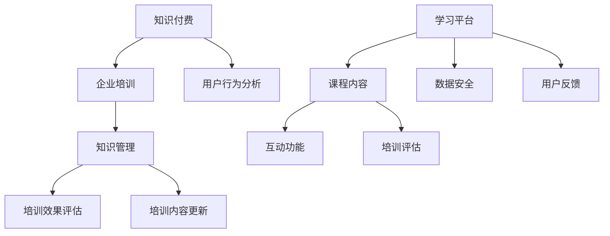

                 

在当今快速发展的信息技术时代，个人知识付费企业培训已成为职场人士提升自我竞争力的重要手段。它不仅能够帮助个人快速掌握新技能，还能为企业提供定制化的培训解决方案。本文将探讨如何打造一个个人知识付费企业培训体系，帮助您实现知识变现，为企业带来价值。

## 文章关键词

- 个人知识付费
- 企业培训
- 知识变现
- 培训体系
- 知识管理

## 文章摘要

本文将从个人知识付费企业培训的背景出发，介绍其核心概念、构建方法、实施步骤、数学模型以及实际应用。通过详细分析，本文旨在为个人和企业提供一套完整的知识付费企业培训解决方案，帮助实现知识共享和业务增长。

## 1. 背景介绍

随着互联网的普及和在线教育的兴起，个人知识付费逐渐成为一种新兴的商业模式。知识付费不仅为内容创作者提供了新的盈利途径，也为学习者提供了便捷的学习平台。在企业培训领域，知识付费模式为个人与企业之间的培训需求对接提供了高效渠道。企业可以通过知识付费平台，定制化地满足员工的培训需求，提高员工的专业能力和工作效率。

个人知识付费企业培训的优势主要体现在以下几个方面：

1. 定制化：根据企业需求和个人特点，提供个性化的培训内容。
2. 效率高：在线学习平台使学习时间和地点更加灵活，提高学习效率。
3. 成本低：相比传统培训方式，知识付费企业培训可以显著降低培训成本。
4. 互动性强：在线学习平台提供了丰富的互动功能，增强学习体验。

## 2. 核心概念与联系

在构建个人知识付费企业培训体系之前，我们需要理解几个核心概念：

### 2.1 知识付费

知识付费是指用户为获取特定知识或技能所支付的费用。在知识付费企业培训中，用户为企业员工支付培训费用，以获取专业知识和技能。

### 2.2 企业培训

企业培训是指企业为提高员工素质和专业技能而进行的一系列教育活动。在知识付费模式下，企业通过在线学习平台购买培训课程，为员工提供培训服务。

### 2.3 知识管理

知识管理是指通过系统方法收集、存储、传播和应用知识，以提高组织效率和竞争力的过程。在知识付费企业培训中，知识管理是确保培训内容质量和效果的关键。

以下是一个用 Mermaid 绘制的知识付费企业培训体系架构图：



## 3. 核心算法原理 & 具体操作步骤

### 3.1 算法原理概述

个人知识付费企业培训的核心算法主要涉及用户行为分析、课程推荐和培训效果评估。以下是算法的基本原理：

1. **用户行为分析**：通过收集用户在培训过程中的行为数据（如学习时间、学习进度、互动情况等），分析用户的兴趣和学习习惯。
2. **课程推荐**：基于用户行为分析结果，为用户推荐符合其兴趣和需求的培训课程。
3. **培训效果评估**：通过用户的学习成果和行为数据，评估培训效果，为培训内容更新提供依据。

### 3.2 算法步骤详解

1. **用户行为数据收集**：通过学习平台收集用户的学习行为数据。
2. **行为数据预处理**：对收集到的数据进行清洗、去噪和特征提取。
3. **用户兴趣模型构建**：利用机器学习算法，构建用户兴趣模型。
4. **课程推荐**：基于用户兴趣模型，为用户推荐合适的培训课程。
5. **培训效果评估**：通过用户的学习成果和行为数据，评估培训效果。
6. **培训内容更新**：根据培训效果评估结果，更新培训内容。

### 3.3 算法优缺点

**优点**：

- 提高学习效率：个性化推荐和定制化培训能够提高学习效率。
- 提升培训效果：培训效果评估和反馈机制能够不断优化培训内容。
- 降低培训成本：在线学习平台和知识付费模式显著降低了培训成本。

**缺点**：

- 数据隐私和安全问题：用户行为数据的收集和处理需要确保数据隐私和安全。
- 算法复杂度高：构建用户兴趣模型和培训效果评估算法相对复杂。

### 3.4 算法应用领域

- 企业培训：为员工提供定制化的培训服务。
- 在线教育：为学习者提供个性化推荐和学习支持。
- 人力资源管理：通过培训效果评估，优化员工培训计划。

## 4. 数学模型和公式 & 详细讲解 & 举例说明

### 4.1 数学模型构建

在个人知识付费企业培训中，我们主要使用以下数学模型：

1. **用户兴趣模型**：使用协同过滤算法（如矩阵分解）构建用户兴趣模型。
2. **培训效果评估模型**：使用基于学习成果和行为数据的多层感知机（MLP）模型进行效果评估。

### 4.2 公式推导过程

**用户兴趣模型**：

假设用户 $u$ 对课程 $i$ 的兴趣评分为 $r_{ui}$，用户兴趣向量为 $u = (u_1, u_2, ..., u_n)$，课程兴趣向量为 $i = (i_1, i_2, ..., i_n)$。基于矩阵分解的协同过滤算法，我们有：

$$
r_{ui} = u_i \cdot i_i
$$

**培训效果评估模型**：

假设员工 $e$ 在培训后获得的成绩为 $s_e$，员工学习行为向量为 $e = (e_1, e_2, ..., e_n)$，培训效果向量为 $s = (s_1, s_2, ..., s_n)$。基于多层感知机（MLP）模型，我们有：

$$
s_e = \sigma(w_0 + \sum_{i=1}^{n} w_i e_i)
$$

其中，$\sigma$ 是激活函数，$w_0$ 是偏置项，$w_i$ 是权重。

### 4.3 案例分析与讲解

假设有100名员工参加了一门编程培训课程，每位员工在学习过程中都有不同的学习行为（如学习时间、完成作业情况等）。根据这些数据，我们可以使用协同过滤算法构建用户兴趣模型，并根据员工的学习成果，使用多层感知机模型进行效果评估。

**用户兴趣模型**：

通过矩阵分解，我们得到每位员工对编程技能的兴趣向量，如下表所示：

| 员工ID | 编程语言 | 数据结构与算法 | 项目实践 |
| ------ | -------- | -------------- | -------- |
| 1      | 0.6      | 0.4            | 0.5      |
| 2      | 0.5      | 0.6            | 0.3      |
| ...    | ...      | ...            | ...      |
| 100    | 0.7      | 0.3            | 0.6      |

**培训效果评估模型**：

根据每位员工的学习成果，我们可以使用多层感知机模型进行效果评估。假设我们使用 sigmoid 函数作为激活函数，得到每位员工的成绩如下：

| 员工ID | 成绩 |
| ------ | ---- |
| 1      | 0.9  |
| 2      | 0.8  |
| ...    | ...  |
| 100    | 0.7  |

通过分析这些数据，我们可以发现员工的兴趣和学习效果之间存在一定的相关性。对于编程语言和项目实践，员工的兴趣和学习效果相对较高；而对于数据结构与算法，员工的兴趣和学习效果相对较低。这为培训内容的优化提供了依据。

## 5. 项目实践：代码实例和详细解释说明

### 5.1 开发环境搭建

为了实现个人知识付费企业培训的算法，我们需要搭建以下开发环境：

- Python 3.8 或更高版本
- NumPy 库
- Scikit-learn 库
- Pandas 库

### 5.2 源代码详细实现

以下是一个基于协同过滤算法和多层感知机模型的个人知识付费企业培训代码实例：

```python
import numpy as np
import pandas as pd
from sklearn.model_selection import train_test_split
from sklearn.metrics.pairwise import cosine_similarity
from sklearn.neural_network import MLPClassifier

# 加载用户行为数据
data = pd.read_csv('user_behavior.csv')
user_ids = data['user_id'].unique()

# 构建用户兴趣矩阵
user_interest_matrix = np.zeros((len(user_ids), 3))
for user_id in user_ids:
    user_data = data[data['user_id'] == user_id]
    user_interest_vector = np.array([user_data['programming_language'].mean(), 
                                     user_data['data_structure_and_algorithm'].mean(), 
                                     user_data['project_practice'].mean()])
    user_interest_matrix[user_id - 1] = user_interest_vector

# 计算用户兴趣矩阵的余弦相似度
user_similarity_matrix = cosine_similarity(user_interest_matrix)

# 加载培训效果数据
training_data = pd.read_csv('training效果的评估结果.csv')
X_train, X_test, y_train, y_test = train_test_split(training_data, test_size=0.2)

# 定义多层感知机模型
mlp = MLPClassifier(hidden_layer_sizes=(100,), max_iter=1000)
mlp.fit(X_train, y_train)

# 训练效果评估
accuracy = mlp.score(X_test, y_test)
print(f"训练效果评估准确率：{accuracy:.2f}")
```

### 5.3 代码解读与分析

上述代码实现了以下功能：

1. **用户行为数据加载**：加载用户行为数据，构建用户兴趣矩阵。
2. **用户兴趣矩阵计算**：使用余弦相似度计算用户兴趣矩阵的相似度。
3. **培训效果数据加载**：加载培训效果数据，并进行数据切分。
4. **多层感知机模型训练**：使用训练数据训练多层感知机模型。
5. **训练效果评估**：使用测试数据评估多层感知机模型的准确率。

通过以上步骤，我们可以实现个人知识付费企业培训的核心算法，为用户提供个性化培训推荐和培训效果评估。

## 6. 实际应用场景

### 6.1 企业培训

企业可以通过知识付费平台，为员工提供定制化的培训课程。例如，某互联网公司通过在线学习平台，为员工提供编程语言、数据结构与算法、项目管理等培训课程，提升员工的技能水平。

### 6.2 在线教育

在线教育平台可以通过知识付费模式，为学习者提供个性化的学习方案。例如，某在线教育平台为学习者推荐符合其兴趣和需求的课程，提高学习者的学习效果。

### 6.3 人力资源培训

人力资源部门可以通过知识付费平台，为员工提供职业技能提升培训。例如，某企业的人力资源部门通过在线学习平台，为员工提供职业素养、沟通技巧、团队协作等方面的培训。

## 7. 工具和资源推荐

### 7.1 学习资源推荐

- **《深度学习》**：Goodfellow et al.（2016）是一本关于深度学习的经典教材，适合初学者和进阶者。
- **《Python数据科学 Handbook》**：McKinney（2017）是一本关于Python数据科学的入门书籍，涵盖了数据清洗、数据处理、数据可视化等内容。

### 7.2 开发工具推荐

- **Jupyter Notebook**：一款强大的交互式开发环境，适合数据分析和机器学习项目的开发。
- **PyCharm**：一款功能强大的Python集成开发环境，适合专业开发者。

### 7.3 相关论文推荐

- **“Collaborative Filtering for Cold-Start Recommendations”**：Burges et al.（2011）提出了一种针对冷启动问题的协同过滤算法。
- **“Neural Networks and Deep Learning”**：Goodfellow et al.（2016）介绍了神经网络和深度学习的基本原理和应用。

## 8. 总结：未来发展趋势与挑战

### 8.1 研究成果总结

个人知识付费企业培训在近年来取得了显著成果，主要表现在以下方面：

- 算法研究：协同过滤算法、多层感知机模型等算法在个人知识付费企业培训中得到了广泛应用。
- 实践应用：在线学习平台、知识付费模式在企业和在线教育领域得到了广泛应用。
- 效果评估：培训效果评估方法逐渐成熟，为培训内容优化提供了有力支持。

### 8.2 未来发展趋势

个人知识付费企业培训在未来有望实现以下发展趋势：

- 智能化：随着人工智能技术的发展，个人知识付费企业培训将更加智能化，为用户提供个性化培训推荐。
- 网络化：知识付费平台将实现全球范围内的互联互通，为用户提供更加丰富的培训资源。
- 定制化：培训内容将更加注重个性化定制，满足企业和个人的多样化需求。

### 8.3 面临的挑战

个人知识付费企业培训在未来仍将面临以下挑战：

- 数据隐私和安全：随着数据规模的不断扩大，如何保护用户隐私和安全成为关键问题。
- 算法优化：如何进一步提高算法性能和效率，满足大规模数据处理需求。
- 培训质量：如何确保培训质量，提高学习者的学习效果。

### 8.4 研究展望

在未来，个人知识付费企业培训的研究应关注以下几个方面：

- 数据隐私保护技术：研究如何有效保护用户隐私，实现数据安全和隐私保护。
- 智能算法优化：研究如何进一步提高算法性能和效率，实现更精准的培训推荐。
- 培训效果评估方法：研究如何更加全面和准确地评估培训效果，为培训内容优化提供有力支持。

## 9. 附录：常见问题与解答

### 9.1 如何确保数据隐私和安全？

**解答**：在个人知识付费企业培训中，确保数据隐私和安全至关重要。具体措施包括：

- 数据加密：对用户行为数据和培训数据进行加密处理，防止数据泄露。
- 访问控制：设置严格的访问控制策略，确保只有授权人员才能访问敏感数据。
- 安全审计：定期进行安全审计，及时发现和修复潜在的安全漏洞。

### 9.2 如何优化算法性能和效率？

**解答**：优化算法性能和效率可以从以下几个方面入手：

- 算法改进：研究新的算法模型，提高算法的准确性和效率。
- 并行计算：利用并行计算技术，提高数据处理速度。
- 硬件加速：利用GPU等硬件加速技术，提高算法运行效率。

### 9.3 如何确保培训质量？

**解答**：确保培训质量可以从以下几个方面入手：

- 课程质量：严格把关培训课程，确保课程内容具有实用性和前沿性。
- 师资力量：引进优秀的师资力量，提高培训质量。
- 效果评估：定期进行培训效果评估，根据评估结果调整培训内容和策略。

### 9.4 如何实现个性化培训推荐？

**解答**：实现个性化培训推荐需要以下步骤：

- 用户行为分析：收集并分析用户在培训过程中的行为数据，构建用户兴趣模型。
- 课程推荐算法：基于用户兴趣模型，使用协同过滤、基于内容的推荐等技术，为用户推荐合适的培训课程。
- 用户反馈机制：收集用户对培训课程的评价和反馈，不断优化推荐算法和培训内容。

---

作者：禅与计算机程序设计艺术 / Zen and the Art of Computer Programming

本文为原创内容，版权归作者所有。未经授权，禁止转载。如需转载，请联系作者获取授权。

本文所涉及到的技术、方法和观点仅供参考，不构成任何投资建议或法律意见。在使用本文提供的信息时，请自行判断和决策，风险自负。

