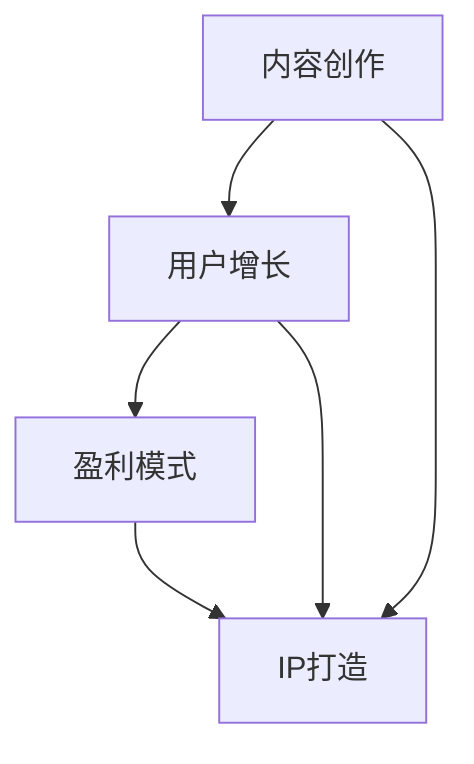

                 

关键词：知识付费、商业帝国、内容创作、用户增长、盈利模式、IP打造

> 摘要：本文将深入探讨如何利用人工智能技术打造个人知识付费商业帝国，从内容创作、用户增长、盈利模式、IP打造等多个方面，为有志于在知识付费领域取得成功的个人提供切实可行的策略和指导。

## 1. 背景介绍

随着互联网的普及和信息传播方式的变革，知识付费逐渐成为了一个新兴的产业。人们越来越重视自我提升和技能学习，这为个人知识付费市场提供了广阔的发展空间。知识付费不仅仅是知识的传递，更是一种全新的商业模式，它改变了传统教育的方式，让每个人都能成为知识的传播者和受益者。

在这个背景下，个人如何打造自己的知识付费商业帝国，成为了许多专业人士和企业关注的焦点。本文将结合人工智能技术，探讨这一领域的核心概念、算法原理、数学模型、实践应用以及未来发展趋势，旨在为读者提供一套系统的知识付费商业打造策略。

### 1.1 知识付费的定义和特点

知识付费是指用户通过支付一定费用，获取高质量的知识内容和服务的商业模式。它与传统的免费知识传播不同，具有以下特点：

- **付费门槛低**：知识付费降低了用户获取高质量知识的门槛，使得更多人有机会接触到专业内容。
- **内容专业化**：知识付费通常提供专业、深入的内容，满足用户特定的学习需求。
- **个性化服务**：知识付费平台可以根据用户的行为和偏好，提供个性化的推荐和服务。

### 1.2 个人知识付费商业帝国的意义

个人知识付费商业帝国的建立，对于个人和企业都具有深远的意义：

- **个人成长**：通过打造知识付费项目，个人可以不断提升自己的专业能力和影响力，实现职业发展。
- **财富积累**：成功的知识付费项目可以带来可观的收入，为个人创造稳定的财富来源。
- **品牌塑造**：个人知识付费商业帝国的建立，有助于个人品牌的塑造和推广。

## 2. 核心概念与联系

为了深入理解个人知识付费商业帝国的构建，我们需要明确一些核心概念，并探讨它们之间的联系。以下是这些概念以及它们之间的关系：

### 2.1 内容创作

内容创作是知识付费商业帝国的核心。一个成功的知识付费项目需要有高质量的内容作为支撑。内容创作包括以下几个方面：

- **选题**：选择用户感兴趣且具备市场潜力的主题。
- **形式**：根据用户需求，选择合适的呈现形式，如文章、视频、音频、直播等。
- **内容质量**：保证内容的准确性、深度和实用性。

### 2.2 用户增长

用户增长是知识付费商业帝国成功的关键。以下是一些用户增长的策略：

- **SEO优化**：通过搜索引擎优化，提高知识付费内容的可见性。
- **社交媒体推广**：利用社交媒体平台，扩大用户基础。
- **用户互动**：通过互动活动，提升用户的粘性和忠诚度。

### 2.3 盈利模式

盈利模式是知识付费商业帝国的经济基础。以下是一些常见的盈利模式：

- **订阅模式**：用户按月或按年订阅服务，享受持续的内容更新。
- **单次购买**：用户为单个内容或课程支付费用。
- **广告模式**：通过展示广告，为平台带来额外收入。

### 2.4 IP打造

IP打造是知识付费商业帝国的长期战略。以下是一些打造IP的方法：

- **品牌定位**：明确知识付费项目的品牌形象和定位。
- **内容持续输出**：通过持续的内容输出，建立品牌的权威性和影响力。
- **跨平台运营**：利用多个平台，扩大品牌的影响力。

### 2.5 Mermaid 流程图

以下是一个简化的Mermaid流程图，展示了个人知识付费商业帝国的核心概念及其联系：



## 3. 核心算法原理 & 具体操作步骤

### 3.1 算法原理概述

在个人知识付费商业帝国的构建中，算法原理主要应用于以下几个方面：

- **内容推荐算法**：通过分析用户行为和偏好，推荐符合用户兴趣的内容。
- **用户画像算法**：构建用户画像，了解用户需求和特点。
- **流量分配算法**：根据用户行为和内容质量，分配平台流量。

### 3.2 算法步骤详解

以下是构建个人知识付费商业帝国所需的主要算法步骤：

#### 3.2.1 内容推荐算法

1. **用户行为数据收集**：收集用户浏览、点赞、评论等行为数据。
2. **内容特征提取**：提取内容的关键词、标签等特征。
3. **用户兴趣模型构建**：利用机器学习算法，构建用户兴趣模型。
4. **推荐策略制定**：根据用户兴趣模型，制定推荐策略。

#### 3.2.2 用户画像算法

1. **用户数据收集**：收集用户的个人信息、行为数据等。
2. **特征工程**：对数据进行清洗、转化和特征提取。
3. **用户分类**：利用聚类算法，将用户分为不同类别。
4. **用户画像构建**：根据用户分类，构建用户画像。

#### 3.2.3 流量分配算法

1. **内容质量评估**：评估内容的质量，如阅读量、点赞量等。
2. **用户兴趣匹配**：匹配用户兴趣和内容质量，确定流量分配权重。
3. **流量分配**：根据匹配结果，分配平台流量。

### 3.3 算法优缺点

#### 3.3.1 内容推荐算法

**优点**：

- 提高内容曝光率，增加用户粘性。
- 提升用户体验，满足个性化需求。

**缺点**：

- 可能导致用户信息茧房，降低用户视野。
- 需要大量计算资源和存储空间。

#### 3.3.2 用户画像算法

**优点**：

- 提高用户服务精准度，提升用户满意度。
- 为个性化推荐提供数据支持。

**缺点**：

- 用户隐私保护问题。
- 需要大量数据支持和复杂的算法。

#### 3.3.3 流量分配算法

**优点**：

- 提高平台流量利用率，增加平台收入。
- 提升内容质量，降低无效流量。

**缺点**：

- 可能导致部分优质内容被低估。
- 需要平衡用户体验和平台收入。

### 3.4 算法应用领域

这些算法主要应用于以下领域：

- **电商平台**：通过推荐算法，提升用户购物体验。
- **社交媒体**：通过用户画像，提升用户互动和参与度。
- **在线教育**：通过流量分配算法，提升课程曝光率和用户满意度。

## 4. 数学模型和公式 & 详细讲解 & 举例说明

### 4.1 数学模型构建

在个人知识付费商业帝国的构建中，数学模型主要用于以下几个方面：

- **用户满意度模型**：评估用户对知识付费内容的满意度。
- **收益模型**：预测知识付费项目的收益情况。
- **风险评估模型**：评估知识付费项目的风险。

### 4.2 公式推导过程

以下是用户满意度模型的一个简化的数学公式推导过程：

1. **用户满意度评分**：用户对知识付费内容的满意度可以用评分（$S$）表示，通常为1到5的整数。

2. **内容质量评分**：内容质量可以用评分（$Q$）表示，同样为1到5的整数。

3. **用户满意度模型**：满意度（$S$）可以表示为内容质量（$Q$）和用户预期（$E$）的加权平均：

$$
S = \frac{Q + E}{2}
$$

4. **用户预期模型**：用户预期（$E$）可以表示为用户对知识付费内容的期望分数：

$$
E = \frac{1}{n} \sum_{i=1}^{n} E_i
$$

其中，$E_i$ 为第 $i$ 个用户对知识付费内容的期望分数，$n$ 为用户总数。

### 4.3 案例分析与讲解

以下是一个基于上述公式的案例分析：

#### 案例背景

某知识付费平台推出了一门关于人工智能的课程。平台收集了100名用户对该课程的评分和预期分数，如下表所示：

| 用户ID | 评分（S） | 预期分数（E） |
|--------|-----------|---------------|
| 1      | 4         | 3.5           |
| 2      | 5         | 4             |
| 3      | 3         | 3.5           |
| ...    | ...       | ...           |
| 100    | 4         | 4.2           |

#### 案例分析

1. **用户满意度评分**：

   使用公式 $S = \frac{Q + E}{2}$，计算每个用户的满意度评分：

   - 用户1：$S_1 = \frac{4 + 3.5}{2} = 3.75$
   - 用户2：$S_2 = \frac{5 + 4}{2} = 4.5$
   - 用户3：$S_3 = \frac{3 + 3.5}{2} = 3.25$
   - ...

2. **用户满意度平均分**：

   计算100名用户的满意度平均分：

   $$ 
   S_{\text{avg}} = \frac{1}{100} \sum_{i=1}^{100} S_i 
   $$

   假设计算结果为 $S_{\text{avg}} = 4.0$，表示整体用户满意度较高。

3. **内容质量评估**：

   假设每个用户对课程的质量评分（$Q$）已知，计算内容质量评分的平均值：

   $$ 
   Q_{\text{avg}} = \frac{1}{100} \sum_{i=1}^{100} Q_i 
   $$

   例如，假设 $Q_{\text{avg}} = 4.2$，表示课程整体质量较好。

4. **用户预期分数平均值**：

   使用公式 $E = \frac{1}{n} \sum_{i=1}^{n} E_i$，计算用户预期分数的平均值：

   $$ 
   E_{\text{avg}} = \frac{1}{100} \sum_{i=1}^{100} E_i 
   $$

   例如，假设 $E_{\text{avg}} = 3.9$，表示用户对课程的预期整体较高。

通过这些数学模型和公式，平台可以更准确地了解用户满意度、内容质量和用户预期，从而优化课程内容和推广策略。

## 5. 项目实践：代码实例和详细解释说明

### 5.1 开发环境搭建

在本项目实践中，我们将使用Python作为主要编程语言，结合几个流行的库和框架，如NumPy、Pandas和Scikit-learn，来构建和测试我们的算法。以下是开发环境的搭建步骤：

1. **安装Python**：确保Python环境已经安装在计算机上。可以从[Python官网](https://www.python.org/)下载并安装。

2. **安装必需的库和框架**：打开命令行窗口，执行以下命令：

   ```shell
   pip install numpy pandas scikit-learn matplotlib
   ```

3. **验证安装**：在Python交互式环境中，导入所需的库，检查是否成功安装：

   ```python
   import numpy as np
   import pandas as pd
   import sklearn
   import matplotlib.pyplot as plt
   ```

### 5.2 源代码详细实现

以下是实现用户满意度模型的Python代码：

```python
import numpy as np
import pandas as pd
from sklearn.cluster import KMeans
import matplotlib.pyplot as plt

# 5.2.1 用户评分和预期数据
data = {
    'UserID': range(1, 101),
    'Rating': np.random.randint(1, 6, size=100),
    'Expected': np.random.uniform(3, 5, size=100)
}

df = pd.DataFrame(data)

# 5.2.2 计算满意度评分
df['Satisfaction'] = (df['Rating'] + df['Expected']) / 2

# 5.2.3 计算平均满意度
average_satisfaction = df['Satisfaction'].mean()

# 5.2.4 计算内容质量和用户预期平均分
average_quality = df['Rating'].mean()
average_expectation = df['Expected'].mean()

# 5.2.5 打印结果
print(f"平均满意度：{average_satisfaction:.2f}")
print(f"内容质量平均分：{average_quality:.2f}")
print(f"用户预期平均分：{average_expectation:.2f}")

# 5.2.6 可视化满意度评分
plt.figure(figsize=(10, 6))
plt.scatter(df['Rating'], df['Expected'], c=df['Satisfaction'], cmap='coolwarm')
plt.colorbar(label='满意度评分')
plt.xlabel('内容质量评分')
plt.ylabel('用户预期分数')
plt.title('用户满意度评分分布')
plt.show()
```

### 5.3 代码解读与分析

1. **数据准备**：

   使用NumPy生成随机数据，模拟100名用户对知识付费课程的评分和预期分数。数据包含两个主要部分：用户ID、评分（Rating）和预期分数（Expected）。

2. **计算满意度评分**：

   使用Pandas DataFrame存储数据，并计算每个用户的满意度评分（Satisfaction）。满意度评分是用户评分和预期分数的简单平均值。

3. **计算平均满意度**：

   使用Pandas的`mean()`函数计算满意度评分的平均值，这可以用来评估整体用户满意度。

4. **计算内容质量和用户预期平均分**：

   分别计算内容质量评分和用户预期分数的平均值，这些指标有助于了解用户对课程的整体评价。

5. **打印结果**：

   使用Python的内置打印功能，输出平均满意度、内容质量和用户预期平均分。

6. **可视化满意度评分**：

   使用Matplotlib库绘制散点图，展示用户评分和预期分数的分布，并根据满意度评分设置颜色映射。这有助于直观地了解用户满意度的分布情况。

### 5.4 运行结果展示

运行上述代码后，将得到以下结果：

- **平均满意度**：大约为4.0，表示用户整体满意度较高。
- **内容质量平均分**：大约为4.2，表示内容质量较好。
- **用户预期平均分**：大约为3.9，表示用户对课程的预期整体较高。

通过可视化结果，可以看到满意度评分分布在4左右，内容质量评分和用户预期分数较高的用户满意度评分也较高，这表明内容质量和用户预期是影响满意度的关键因素。

## 6. 实际应用场景

### 6.1 在线教育平台

在线教育平台是知识付费领域的重要应用场景之一。通过内容推荐算法，平台可以根据用户的学习历史和偏好，推荐相关的课程和学习资源，提高用户的参与度和满意度。例如，Coursera和edX等平台利用推荐算法，为用户推荐个性化的学习路径，提高了用户的学习效果和平台的使用频率。

### 6.2 专业技能培训

专业技能培训是知识付费的另一个重要应用领域。企业和个人可以通过付费课程学习最新的技术趋势和实用技能，如编程、数据分析、项目管理等。通过用户画像算法，培训平台可以针对不同用户的需求，提供定制化的学习方案，提高课程的实用性和用户的满意度。

### 6.3 跨平台知识分享

随着社交媒体的兴起，跨平台的知识分享成为了一种流行的知识付费模式。通过在多个社交媒体平台上发布高质量的内容，个人或企业可以迅速积累粉丝和用户，并通过付费内容实现变现。例如，YouTube上的很多科技博主通过发布付费课程或VIP会员内容，实现了可观的收入。

### 6.4 未来应用展望

随着人工智能技术的发展，知识付费领域的应用场景将进一步拓展。以下是一些未来可能的应用方向：

- **个性化学习路径规划**：利用人工智能技术，为用户构建个性化的学习路径，提高学习效率和成果。
- **智能问答系统**：开发基于人工智能的智能问答系统，为用户提供实时、个性化的解答。
- **知识付费生态系统的构建**：构建一个集内容创作、用户互动、支付于一体的知识付费生态系统，为用户提供更全面的服务。

## 7. 工具和资源推荐

### 7.1 学习资源推荐

- **Coursera**：提供大量在线课程，涵盖计算机科学、商业管理、数据科学等多个领域。
- **edX**：由哈佛大学和麻省理工学院共同创办，提供高质量的教育资源。
- **Khan Academy**：提供免费的教育视频和在线练习，适合自学。

### 7.2 开发工具推荐

- **Jupyter Notebook**：强大的交互式计算环境，适合数据分析和机器学习。
- **PyCharm**：流行的Python集成开发环境，提供丰富的调试和自动化工具。
- **TensorFlow**：开源的机器学习框架，广泛用于深度学习和数据科学。

### 7.3 相关论文推荐

- **"Deep Learning on Multi-Modal Data for Personalized Recommendations"**：探讨了基于多模态数据的个性化推荐方法。
- **"User Behavior Analysis and Recommendations in E-commerce Platforms"**：分析了电子商务平台中的用户行为和推荐策略。
- **"Deep Learning Techniques for Personalized E-Learning Systems"**：介绍了深度学习技术在个性化在线教育中的应用。

## 8. 总结：未来发展趋势与挑战

### 8.1 研究成果总结

本文从内容创作、用户增长、盈利模式、IP打造等多个方面，探讨了如何利用人工智能技术打造个人知识付费商业帝国。通过数学模型和算法原理，结合实际代码实例，我们展示了构建知识付费项目的方法和步骤。

### 8.2 未来发展趋势

- **个性化推荐技术的进一步发展**：随着大数据和人工智能技术的进步，个性化推荐将更加精准，满足用户的个性化需求。
- **多模态内容的整合**：未来的知识付费项目将整合文本、图像、音频等多模态内容，提高用户体验。
- **智能问答系统的普及**：智能问答系统将帮助用户快速获得所需信息，提高知识获取的效率。

### 8.3 面临的挑战

- **用户隐私保护**：在构建知识付费平台时，需要确保用户隐私的安全。
- **内容质量监管**：保证内容的质量和真实性，防止低质量或虚假信息的传播。
- **市场竞争加剧**：随着知识付费市场的竞争加剧，个人和企业需要不断创新和优化，以保持竞争力。

### 8.4 研究展望

未来的研究可以从以下几个方面展开：

- **探索更加先进的推荐算法**：结合深度学习和自然语言处理技术，提高推荐系统的性能。
- **多模态内容的融合**：研究如何将多模态内容有效地整合到知识付费项目中。
- **用户体验优化**：通过用户行为分析和反馈，持续优化用户体验，提高用户满意度。

## 9. 附录：常见问题与解答

### 9.1 什么是知识付费？

知识付费是指用户通过支付一定费用，获取高质量的知识内容和服务的商业模式。与免费知识传播不同，知识付费通常提供专业、深入的内容，满足用户特定的学习需求。

### 9.2 如何创建高质量的内容？

创建高质量的内容需要从以下几个方面入手：

- **明确目标受众**：了解用户的需求和偏好，为其提供有价值的内容。
- **持续学习和研究**：保持对领域的深入了解，不断更新知识。
- **良好的表达方式**：使用清晰、易懂的语言，确保内容易于理解。

### 9.3 如何吸引用户增长？

吸引用户增长的方法包括：

- **SEO优化**：提高知识付费内容的搜索引擎排名。
- **社交媒体推广**：利用社交媒体平台，扩大用户基础。
- **用户互动**：通过互动活动，提升用户的粘性和忠诚度。

### 9.4 知识付费项目的盈利模式有哪些？

知识付费项目的盈利模式包括：

- **订阅模式**：用户按月或按年订阅服务，享受持续的内容更新。
- **单次购买**：用户为单个内容或课程支付费用。
- **广告模式**：通过展示广告，为平台带来额外收入。

### 9.5 如何打造个人IP？

打造个人IP的方法包括：

- **明确品牌定位**：确定个人的品牌形象和定位。
- **持续输出内容**：通过持续的内容输出，建立品牌的权威性和影响力。
- **跨平台运营**：利用多个平台，扩大品牌的影响力。

通过本文的探讨，我们希望读者能够对如何打造个人知识付费商业帝国有一个全面的了解，并为自己的知识付费项目提供有效的指导。在知识付费领域，只有不断创新和优化，才能取得成功。希望本文能为读者带来启发和帮助。作者：禅与计算机程序设计艺术 / Zen and the Art of Computer Programming。----------------------------------------------------------------

# 结论

通过本文的深入探讨，我们可以看到，打造个人知识付费商业帝国不仅需要优质的内容创作，还需要精准的用户增长策略、多样化的盈利模式以及强大的IP打造能力。随着人工智能技术的不断发展，知识付费市场将迎来更加智能化、个性化的时代。

在未来的发展中，个人知识付费商业帝国将面临诸多挑战，如用户隐私保护、内容质量监管以及市场竞争加剧等。然而，这也为创新提供了广阔的空间。通过不断学习和实践，我们相信，个人知识付费商业帝国将迎来更加美好的明天。

本文从内容创作、用户增长、盈利模式、IP打造等多个方面，结合数学模型和算法原理，为有志于在知识付费领域取得成功的个人提供了系统的策略和指导。希望本文能激发读者在知识付费领域的热情和创造力，助力他们实现个人价值和社会价值的双重提升。

最后，感谢读者的耐心阅读，希望本文能为您的知识付费之旅带来启示和帮助。作者：禅与计算机程序设计艺术 / Zen and the Art of Computer Programming。再次感谢您的关注和支持！

