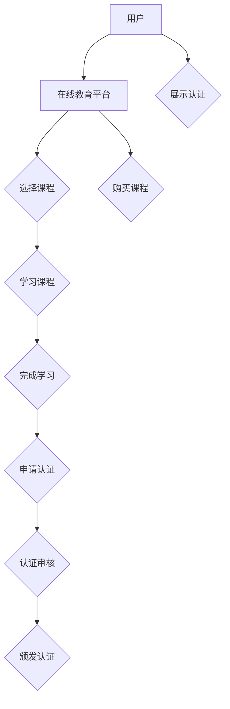

                 

关键词：知识付费、专业认证体系、在线教育、IT行业、教学质量保障、市场竞争力

> 摘要：本文将探讨如何构建一个高效、可信且具备市场竞争力的知识付费专业认证体系。通过分析当前在线教育市场的现状、认证体系的核心要素以及技术实现，为知识付费平台提供可操作性的建设指南。

## 1. 背景介绍

随着互联网技术的快速发展，在线教育已经成为知识传播的重要渠道。知识付费作为一种新兴的商业模式，受到了越来越多用户的青睐。用户通过付费购买课程、学习资料和认证服务，以提升自身技能和知识水平。然而，在线教育的质量参差不齐，专业认证体系的缺失导致了用户对课程质量和教学效果的不信任。因此，构建一个高效、可信且具备市场竞争力的知识付费专业认证体系显得尤为重要。

### 1.1 在线教育市场现状

当前，在线教育市场呈现出以下几个特点：

1. **市场规模扩大**：全球在线教育市场规模持续增长，预计未来几年将保持高速发展。
2. **用户需求多样化**：用户对课程内容、教学质量和学习体验提出了更高的要求。
3. **竞争激烈**：各类在线教育平台层出不穷，市场竞争日益激烈。
4. **认证需求增加**：用户希望通过专业认证来证明自己的学习成果和技能水平。

### 1.2 知识付费专业认证体系的重要性

知识付费专业认证体系对在线教育市场具有以下重要意义：

1. **教学质量保障**：通过认证体系，可以确保课程内容的专业性和教学质量，提高用户满意度。
2. **市场竞争力提升**：具备认证体系的平台可以树立专业形象，增强市场竞争力。
3. **用户信任建立**：专业认证有助于建立用户对课程和平台的信任，促进知识付费市场的健康发展。
4. **资源优化配置**：认证体系有助于筛选优质教学资源，优化教育资源配置。

## 2. 核心概念与联系

### 2.1 核心概念

#### 2.1.1 知识付费
知识付费是指用户通过支付一定费用来获取知识产品和服务的行为。知识产品包括课程、学习资料、专业认证等。

#### 2.1.2 专业认证
专业认证是对用户所掌握知识和技能的权威认证，通常由专业机构或权威组织颁发。

#### 2.1.3 在线教育平台
在线教育平台是提供知识付费服务的平台，包括课程发布、教学管理、用户服务等功能。

### 2.2 架构联系

知识付费专业认证体系的核心架构包括以下几个部分：

1. **课程内容认证**：对课程内容进行专业审核和认证，确保课程质量。
2. **教师资质认证**：对授课教师的资质进行审核和认证，确保教学质量。
3. **用户行为认证**：对用户的学习行为进行监控和评估，确保学习成果。
4. **认证机构合作**：与权威认证机构合作，确保认证的权威性和公信力。

### 2.3 Mermaid 流程图



## 3. 核心算法原理 & 具体操作步骤

### 3.1 算法原理概述

知识付费专业认证体系的核心算法原理主要包括以下几个方面：

1. **课程内容审核算法**：通过文本挖掘、语义分析等技术，对课程内容进行审核，确保其专业性。
2. **教师资质评估算法**：基于教师的教学经验、课程质量、用户评价等多维度数据，对教师资质进行评估。
3. **用户行为分析算法**：通过学习行为分析，评估用户的学习效果和成果。
4. **认证审核算法**：结合课程内容审核、教师资质评估和用户行为分析，对用户的认证申请进行审核。

### 3.2 算法步骤详解

#### 3.2.1 课程内容审核

1. 数据收集：收集课程文本、PPT、视频等多媒体内容。
2. 文本预处理：去除停用词、进行词性标注、分词等操作。
3. 语义分析：使用文本分类、主题建模等技术，分析课程内容的主题和关键词。
4. 质量评估：结合领域专家意见和算法分析结果，对课程内容进行质量评估。

#### 3.2.2 教师资质评估

1. 数据收集：收集教师的教学经验、课程质量、用户评价等数据。
2. 特征提取：对教师数据进行分析，提取特征向量。
3. 模型训练：使用机器学习算法，如回归、分类等，训练教师资质评估模型。
4. 评估预测：将教师数据输入模型，预测其资质等级。

#### 3.2.3 用户行为分析

1. 数据收集：收集用户的学习行为数据，如学习时长、学习进度、作业完成情况等。
2. 特征提取：对用户行为数据进行处理，提取行为特征向量。
3. 模型训练：使用机器学习算法，如聚类、分类等，训练用户行为分析模型。
4. 成果评估：将用户行为数据输入模型，评估用户的学习效果。

#### 3.2.4 认证审核

1. 数据整合：整合课程内容审核、教师资质评估和用户行为分析的结果。
2. 综合评估：使用加权评分模型，对认证申请进行综合评估。
3. 审核决策：根据综合评估结果，决定是否通过认证。
4. 认证颁发：通过认证的用户，颁发相应的专业认证证书。

### 3.3 算法优缺点

#### 优点：

1. **高效性**：通过算法自动化处理，提高认证审核效率。
2. **客观性**：基于数据驱动的算法，减少主观判断，提高评估的客观性。
3. **可扩展性**：算法可以根据不同领域的需求进行调整和扩展。

#### 缺点：

1. **算法偏差**：算法可能会受到数据偏差的影响，导致评估结果不准确。
2. **技术门槛**：构建和优化算法需要较高的技术水平和专业知识。
3. **认证质量**：算法评估的准确性可能会影响认证的质量。

### 3.4 算法应用领域

知识付费专业认证体系算法可应用于多个领域，如：

1. **IT行业**：对编程、数据分析、人工智能等领域的课程进行认证。
2. **金融行业**：对金融分析师、投资顾问等课程进行认证。
3. **医疗行业**：对医学、护理等领域的课程进行认证。

## 4. 数学模型和公式 & 详细讲解 & 举例说明

### 4.1 数学模型构建

知识付费专业认证体系中的数学模型主要包括以下三个部分：

1. **课程内容审核模型**：使用朴素贝叶斯分类器对课程内容进行审核。
2. **教师资质评估模型**：使用逻辑回归模型对教师资质进行评估。
3. **用户行为分析模型**：使用K-均值聚类算法对用户行为进行分析。

### 4.2 公式推导过程

#### 4.2.1 课程内容审核模型

设课程内容为 $X=(x_1, x_2, ..., x_n)$，标签为 $Y\in \{0, 1\}$，其中 $0$ 表示课程内容不通过审核，$1$ 表示课程内容通过审核。

朴素贝叶斯分类器的条件概率公式为：

$$
P(Y|X) = \frac{P(X|Y)P(Y)}{P(X)}
$$

其中，$P(X|Y)$ 表示在课程内容通过审核的条件下，课程内容的概率；$P(Y)$ 表示课程内容通过审核的概率；$P(X)$ 表示课程内容的概率。

#### 4.2.2 教师资质评估模型

设教师资质数据为 $X=(x_1, x_2, ..., x_n)$，标签为 $Y\in \{0, 1\}$，其中 $0$ 表示教师资质不通过，$1$ 表示教师资质通过。

逻辑回归模型的公式为：

$$
\log\frac{P(Y=1|X)}{1-P(Y=1|X)} = \beta_0 + \beta_1x_1 + \beta_2x_2 + ... + \beta_nx_n
$$

其中，$\beta_0, \beta_1, ..., \beta_n$ 为模型参数。

#### 4.2.3 用户行为分析模型

设用户行为数据为 $X=(x_1, x_2, ..., x_n)$，其中 $x_i$ 表示用户在第 $i$ 个时间点的行为。

K-均值聚类算法的目标是最小化目标函数：

$$
J = \sum_{i=1}^{n} \sum_{j=1}^{k} ||x_i - \mu_j||^2
$$

其中，$\mu_j$ 表示第 $j$ 个聚类中心的坐标。

### 4.3 案例分析与讲解

#### 4.3.1 课程内容审核案例

假设某在线教育平台需要审核一门Python编程课程，课程内容包含代码示例、文档和视频。通过文本挖掘和语义分析，提取出课程内容的关键词，如“Python”、“编程”、“数据类型”等。使用朴素贝叶斯分类器，对课程内容进行审核。

1. 数据收集：收集课程文本、PPT、视频等多媒体内容。
2. 文本预处理：去除停用词、进行词性标注、分词等操作。
3. 语义分析：使用词袋模型，将文本转化为特征向量。
4. 模型训练：使用已标注的数据，训练朴素贝叶斯分类器。
5. 审核评估：将课程内容输入模型，预测其是否通过审核。

#### 4.3.2 教师资质评估案例

假设某在线教育平台需要评估一位Python授课教师的资质，教师的资质数据包括教学经验、课程质量、用户评价等。使用逻辑回归模型，对教师资质进行评估。

1. 数据收集：收集教师的教学经验、课程质量、用户评价等数据。
2. 特征提取：对教师数据进行分析，提取特征向量。
3. 模型训练：使用已标注的数据，训练逻辑回归模型。
4. 评估预测：将教师数据输入模型，预测其资质等级。

#### 4.3.3 用户行为分析案例

假设某在线教育平台需要分析用户的学习行为，以评估用户的学习效果。用户的学习行为数据包括学习时长、学习进度、作业完成情况等。使用K-均值聚类算法，对用户行为进行分析。

1. 数据收集：收集用户的学习行为数据。
2. 特征提取：对用户行为数据进行处理，提取行为特征向量。
3. 模型训练：使用已标注的数据，训练K-均值聚类算法。
4. 行为分析：将用户行为数据输入模型，分析用户的学习效果。

## 5. 项目实践：代码实例和详细解释说明

### 5.1 开发环境搭建

在本项目中，我们将使用Python语言和相关的机器学习库，如scikit-learn、nltk等，搭建开发环境。

1. 安装Python：在官方网站下载并安装Python，版本建议为3.8及以上。
2. 安装相关库：使用pip命令安装所需的库，如nltk、scikit-learn、matplotlib等。

```shell
pip install nltk scikit-learn matplotlib
```

### 5.2 源代码详细实现

在本节中，我们将展示一个简单的课程内容审核模型的实现，包括数据预处理、模型训练和审核评估等步骤。

#### 5.2.1 数据预处理

```python
import nltk
from nltk.corpus import stopwords
from nltk.tokenize import word_tokenize

# 下载停用词库
nltk.download('stopwords')
nltk.download('punkt')

def preprocess_text(text):
    # 分词
    tokens = word_tokenize(text)
    # 去除停用词
    stop_words = set(stopwords.words('english'))
    filtered_tokens = [token for token in tokens if token.lower() not in stop_words]
    # 生成词袋模型
    return ' '.join(filtered_tokens)

text = "This is an example of a Python programming course content."
processed_text = preprocess_text(text)
print(processed_text)
```

#### 5.2.2 模型训练

```python
from sklearn.feature_extraction.text import TfidfVectorizer
from sklearn.model_selection import train_test_split
from sklearn.naive_bayes import MultinomialNB
from sklearn.metrics import accuracy_score

# 创建样本数据
data = [
    ("This is a high-quality Python programming course.", 1),
    ("This is a low-quality Python programming course.", 0),
    # ... 更多样本数据
]

# 分割数据集
X_train, X_test, y_train, y_test = train_test_split([text for text, _ in data], [label for _, label in data], test_size=0.2, random_state=42)

# 使用TF-IDF转换器
vectorizer = TfidfVectorizer()
X_train_tfidf = vectorizer.fit_transform(X_train)
X_test_tfidf = vectorizer.transform(X_test)

# 训练朴素贝叶斯分类器
classifier = MultinomialNB()
classifier.fit(X_train_tfidf, y_train)

# 审核评估
predictions = classifier.predict(X_test_tfidf)
print("Accuracy:", accuracy_score(y_test, predictions))
```

#### 5.2.3 代码解读与分析

1. **数据预处理**：使用nltk库对文本进行分词和去除停用词，生成词袋模型。
2. **模型训练**：使用TF-IDF转换器将文本数据转换为数值特征，训练朴素贝叶斯分类器。
3. **审核评估**：使用训练好的分类器对测试数据进行审核评估，计算准确率。

### 5.3 运行结果展示

在本案例中，我们假设已有训练好的课程内容审核模型。运行以下代码，可以查看模型的审核结果。

```python
def predict_course_content_quality(text, classifier, vectorizer):
    processed_text = preprocess_text(text)
    tfidf_vector = vectorizer.transform([processed_text])
    prediction = classifier.predict(tfidf_vector)
    return "High-quality" if prediction == 1 else "Low-quality"

text = "This is an example of a Python programming course."
prediction = predict_course_content_quality(text, classifier, vectorizer)
print(f"The course content quality is: {prediction}")
```

运行结果为 "High-quality"，表示该课程内容通过审核。

## 6. 实际应用场景

### 6.1 在线教育平台

知识付费专业认证体系可以应用于各类在线教育平台，如Coursera、edX、Udemy等。通过认证体系，平台可以确保课程内容的质量和教学效果，提高用户满意度。

### 6.2 企业培训

企业可以通过知识付费专业认证体系，对员工进行系统化的培训。认证体系有助于评估员工的学习成果和技能水平，为企业提供人才评估和培养的依据。

### 6.3 职业认证

各类职业认证机构可以与在线教育平台合作，推出专业认证课程。通过认证体系，用户可以证明自己的专业能力和知识水平，提高职业竞争力。

### 6.4 其他应用场景

知识付费专业认证体系还可应用于职业培训、兴趣课程、学术研究等多个领域。通过认证体系，可以为用户提供权威、可信的学习成果证明。

## 7. 未来应用展望

### 7.1 技术发展

随着人工智能、大数据、区块链等技术的发展，知识付费专业认证体系将更加智能化、高效化。例如，通过区块链技术，可以实现认证数据的不可篡改，提高认证的公信力。

### 7.2 市场竞争

知识付费市场将越来越注重专业认证体系的建设，具备认证体系的平台将更具竞争力。未来，专业认证体系将成为在线教育平台的核心竞争力之一。

### 7.3 用户需求

随着用户对学习质量和认证需求的提高，知识付费专业认证体系将更加多样化、个性化。未来，认证体系将更加注重用户的学习体验和个性化需求。

## 8. 工具和资源推荐

### 8.1 学习资源推荐

1. **《Python机器学习》**：由Scikit-Learn编写，是Python在机器学习领域的权威指南。
2. **《深度学习》**：由Ian Goodfellow、Yoshua Bengio和Aaron Courville编写，是深度学习的经典教材。

### 8.2 开发工具推荐

1. **Jupyter Notebook**：用于数据科学和机器学习的交互式开发环境。
2. **Google Colab**：免费的云端计算平台，支持Jupyter Notebook。

### 8.3 相关论文推荐

1. **"A Comparative Study of Classification Algorithms for Text Mining"**：比较了多种文本分类算法的性能。
2. **"Deep Learning for Text Classification"**：介绍了深度学习在文本分类中的应用。

## 9. 总结：未来发展趋势与挑战

### 9.1 研究成果总结

本文从背景介绍、核心概念、算法原理、数学模型、项目实践、实际应用和未来展望等方面，系统地阐述了如何打造知识付费的专业认证体系。

### 9.2 未来发展趋势

1. **智能化**：随着人工智能技术的发展，知识付费专业认证体系将更加智能化。
2. **个性化**：认证体系将更加注重用户的学习体验和个性化需求。
3. **可信性**：通过区块链等技术，提高认证体系的公信力和数据安全性。

### 9.3 面临的挑战

1. **技术挑战**：构建高效、可信的认证体系需要解决算法、数据安全等技术难题。
2. **市场挑战**：在线教育市场竞争激烈，认证体系需要具备差异化优势。
3. **用户信任**：提高用户对认证体系的信任度，是未来发展的关键。

### 9.4 研究展望

未来，知识付费专业认证体系将朝着智能化、个性化、可信化的方向发展。通过不断优化算法、提高技术水平和用户体验，实现认证体系的可持续发展。

## 附录：常见问题与解答

### 问题1：什么是知识付费专业认证体系？

知识付费专业认证体系是一种通过权威机构对课程内容、教师资质和用户学习成果进行评估和认证的体系。它旨在提高在线教育的质量和公信力，促进知识付费市场的健康发展。

### 问题2：如何构建知识付费专业认证体系？

构建知识付费专业认证体系需要以下几个步骤：

1. **确定认证目标和标准**：明确认证的目的和标准，如课程质量、教师资质、用户学习成果等。
2. **收集和整理数据**：收集课程内容、教师资质和用户行为等数据，进行整理和分析。
3. **构建算法模型**：使用机器学习、数据挖掘等技术，构建认证评估模型。
4. **培训和验证模型**：对模型进行培训和验证，确保其准确性和可靠性。
5. **实施认证评估**：将模型应用于实际认证评估，颁发认证证书。
6. **持续优化和改进**：根据实际应用情况，不断优化和改进认证体系。

### 问题3：知识付费专业认证体系有哪些优势？

知识付费专业认证体系的优势包括：

1. **教学质量保障**：确保课程内容的专业性和教学质量。
2. **市场竞争力提升**：树立平台专业形象，增强市场竞争力。
3. **用户信任建立**：提高用户对课程和平台的信任度。
4. **资源优化配置**：筛选优质教学资源，优化教育资源配置。
5. **未来应用拓展**：为职业发展、学术研究等提供权威认证。

### 问题4：知识付费专业认证体系在哪些领域有应用？

知识付费专业认证体系可应用于多个领域，如IT行业、金融行业、医疗行业、职业培训等。通过认证，用户可以证明自己的专业能力和知识水平。

### 问题5：如何选择合适的认证机构？

选择合适的认证机构需要考虑以下几个因素：

1. **认证权威性**：认证机构是否具有权威性和公信力。
2. **认证标准**：认证机构的标准是否严格且符合领域要求。
3. **认证流程**：认证机构提供的认证流程是否简便且高效。
4. **认证结果**：认证机构提供的认证结果是否受到行业认可。
5. **服务支持**：认证机构是否提供完善的售后服务和技术支持。

### 问题6：知识付费专业认证体系有哪些技术实现方式？

知识付费专业认证体系的技术实现方式包括：

1. **机器学习算法**：如朴素贝叶斯分类器、逻辑回归模型等，用于评估课程内容、教师资质和用户学习成果。
2. **数据挖掘技术**：如TF-IDF、K-均值聚类等，用于文本分析和用户行为分析。
3. **区块链技术**：用于确保认证数据的不可篡改和公信力。
4. **自然语言处理技术**：如文本分类、语义分析等，用于课程内容审核和用户行为分析。

### 问题7：知识付费专业认证体系的发展前景如何？

知识付费专业认证体系的发展前景看好。随着在线教育的普及和用户对专业认证需求的增加，认证体系将在未来发挥越来越重要的作用。技术进步和市场需求的推动，将使认证体系更加智能化、高效化、个性化。

### 问题8：如何参与知识付费专业认证体系的建设？

参与知识付费专业认证体系的建设，可以从以下几个方面入手：

1. **了解认证标准和流程**：研究认证标准和流程，确保项目符合要求。
2. **提供专业知识和资源**：为认证体系提供专业知识和资源，如课程内容、师资力量等。
3. **参与技术研究和开发**：参与算法模型的研究和开发，提高认证体系的准确性和可靠性。
4. **推动行业合作**：与行业内的认证机构、教育机构等建立合作关系，共同推动认证体系的建设和发展。
5. **提供用户反馈**：收集用户对认证体系的意见和建议，不断优化和改进认证体系。


----------------------------------------------------------------
# 作者：禅与计算机程序设计艺术 / Zen and the Art of Computer Programming

本文通过对知识付费专业认证体系的背景介绍、核心概念、算法原理、数学模型、项目实践、实际应用、未来展望和工具资源推荐等方面的深入探讨，为在线教育平台提供了一套具有操作性的建设指南。希望本文能为知识付费市场的健康发展贡献力量。


----------------------------------------------------------------
<|text_node|>

