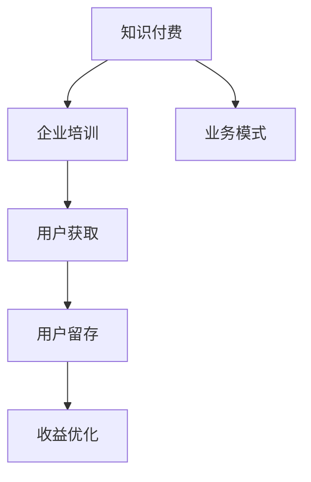

                 

关键词：知识付费、企业培训、业务模式、内容构建、用户增长、收益优化

> 摘要：本文旨在探讨如何成功构建和运营知识付费的企业培训业务，分析核心概念，提供具体操作步骤，并通过数学模型、案例分析及代码实例详细解析，为企业提供一套完整而实用的解决方案。

## 1. 背景介绍

知识付费作为一种新型的商业模式，正逐渐成为企业和个人获取知识、技能的重要途径。随着互联网技术的飞速发展和在线教育市场的日益成熟，知识付费的企业培训业务迎来了新的发展机遇。然而，如何打造一个成功的企业培训业务，实现知识的高效传递和商业价值的最大化，仍是一个需要深入探讨的话题。

本文将从以下几个方面展开讨论：

1. **核心概念与联系**：介绍知识付费、企业培训及相关核心概念，并通过Mermaid流程图展示它们之间的相互关系。
2. **核心算法原理 & 具体操作步骤**：探讨如何构建有效的培训内容和评估机制。
3. **数学模型和公式**：阐述用于分析用户行为和业务收益的数学模型。
4. **项目实践**：通过代码实例展示如何实现一个简单的知识付费系统。
5. **实际应用场景**：分析知识付费在企业培训中的具体应用。
6. **未来应用展望**：探讨知识付费在企业培训领域的未来发展。

## 2. 核心概念与联系

首先，我们来明确几个核心概念。

### 知识付费

知识付费指的是用户为获取特定知识或技能，向知识提供者支付费用的一种商业模式。这种模式的核心在于，知识产品具有明显的价值属性，用户通过付费来认可和获取知识的所有权或使用权。

### 企业培训

企业培训是指企业为提高员工的专业技能和工作效率，定期或不定期组织的一种教育活动。企业培训的目的是通过知识和技能的传递，增强员工的竞争力，促进企业的发展。

### 业务模式

知识付费的企业培训业务模式包括内容制作、用户获取、用户留存、收益优化等多个环节。每个环节都密切相关，共同构成了一个完整的业务流程。

以下是一个简化的Mermaid流程图，展示了这些核心概念之间的相互关系：



## 3. 核心算法原理 & 具体操作步骤

### 3.1 算法原理概述

知识付费的企业培训业务的核心在于如何构建有效的培训内容和评估机制。这里，我们将介绍一个简化的算法模型，用于优化培训内容和评估机制。

### 3.2 算法步骤详解

1. **内容构建**：首先，需要根据企业需求和用户反馈，构建合适的培训内容。内容应该具备以下特点：
   - **针对性**：针对不同岗位和职业阶段，提供个性化的培训内容。
   - **实用性**：培训内容要能够解决实际问题，提高员工的工作效率。
   - **更新性**：随着市场和技术的变化，定期更新培训内容，保持其时效性。

2. **用户评估**：通过多种评估方式，如在线测试、项目提交、问卷调查等，对用户的学习效果进行评估。评估结果用于调整培训内容和策略。

3. **用户反馈**：鼓励用户提供反馈，包括内容质量、学习体验等。用户反馈是优化培训内容和提高用户满意度的关键。

4. **数据分析**：通过数据分析，了解用户的学习行为和需求，为内容更新和策略调整提供数据支持。

### 3.3 算法优缺点

- **优点**：
  - 提高培训效果，满足个性化需求。
  - 数据驱动，有助于持续优化培训内容和策略。
  - 提高用户满意度，促进用户留存。

- **缺点**：
  - 需要大量数据支持，对数据分析和处理能力有较高要求。
  - 培训内容构建和评估机制较为复杂，需要投入较多时间和精力。

### 3.4 算法应用领域

该算法模型主要应用于企业培训领域，尤其适用于需要提供个性化培训和持续改进的企业。例如，技术公司、互联网企业、金融机构等。

## 4. 数学模型和公式 & 详细讲解 & 举例说明

### 4.1 数学模型构建

为了更好地分析用户行为和业务收益，我们可以构建以下数学模型：

1. **用户收益模型**：

$$
R_u = f(P_u, T_u)
$$

其中，$R_u$ 表示用户 $u$ 的收益，$P_u$ 表示用户 $u$ 的支付意愿，$T_u$ 表示用户 $u$ 的学习时间。

2. **业务收益模型**：

$$
R_b = \sum_{u \in U} R_u - C
$$

其中，$R_b$ 表示企业总收益，$U$ 表示用户集合，$C$ 表示企业运营成本。

### 4.2 公式推导过程

1. **用户收益模型推导**：

用户收益取决于支付意愿和学习时间。支付意愿可以通过市场调研和用户调研获得，而学习时间可以通过用户行为数据进行分析。

2. **业务收益模型推导**：

企业总收益为所有用户收益的总和减去运营成本。运营成本包括内容制作、平台维护、客服支持等。

### 4.3 案例分析与讲解

以一家在线教育平台为例，该平台提供不同层次的课程，用户可以根据自己的需求选择购买。假设用户 $u_1$ 支付了 100 元购买了一门课程，学习时间为 20 小时。用户 $u_2$ 支付了 200 元购买了一门课程，学习时间为 10 小时。平台运营成本为 1000 元。

1. **用户收益计算**：

$$
R_{u_1} = f(100, 20) = 50
$$

$$
R_{u_2} = f(200, 10) = 100
$$

2. **业务收益计算**：

$$
R_b = R_{u_1} + R_{u_2} - 1000 = 50 + 100 - 1000 = -850
$$

在这个例子中，企业亏损了 850 元。这表明，仅凭用户付费和学习时间无法保证企业盈利。企业需要通过优化课程内容、提高用户满意度、降低运营成本等方式来提高业务收益。

## 5. 项目实践：代码实例和详细解释说明

### 5.1 开发环境搭建

为了演示如何实现一个简单的知识付费系统，我们选择使用Python语言，并使用Flask框架搭建后端，使用Vue.js搭建前端。

1. **安装Python**：确保安装了Python 3.8及以上版本。
2. **安装Flask**：在终端中运行命令 `pip install flask`。
3. **安装Vue.js**：可以使用npm或yarn安装Vue.js。

### 5.2 源代码详细实现

#### Flask后端代码

```python
from flask import Flask, request, jsonify

app = Flask(__name__)

users = [
    {'id': 1, 'name': 'Alice', 'balance': 100},
    {'id': 2, 'name': 'Bob', 'balance': 200},
]

@app.route('/buy_course', methods=['POST'])
def buy_course():
    user_id = request.form.get('user_id')
    course_price = request.form.get('course_price')
    
    user = next((u for u in users if u['id'] == int(user_id)), None)
    
    if user and user['balance'] >= int(course_price):
        user['balance'] -= int(course_price)
        return jsonify({'status': 'success', 'message': 'Course purchased successfully.'})
    else:
        return jsonify({'status': 'failure', 'message': 'Insufficient balance.'})

if __name__ == '__main__':
    app.run(debug=True)
```

#### Vue.js前端代码

```html
<!DOCTYPE html>
<html>
<head>
    <title>Knowledge Pay System</title>
    <script src="https://cdn.jsdelivr.net/npm/vue@2.6.12/dist/vue.js"></script>
    <script src="https://cdn.jsdelivr.net/npm/axios/dist/axios.min.js"></script>
</head>
<body>
    <div id="app">
        <h1>Knowledge Pay System</h1>
        <h2>Purchase Course</h2>
        <form @submit.prevent="buyCourse">
            <label for="user_id">User ID:</label>
            <input type="text" id="user_id" v-model="userId"><br><br>
            
            <label for="course_price">Course Price:</label>
            <input type="text" id="course_price" v-model="coursePrice"><br><br>
            
            <button type="submit">Buy</button>
        </form>
        <p>{{ message }}</p>
    </div>

    <script>
        new Vue({
            el: '#app',
            data: {
                userId: '',
                coursePrice: '',
                message: ''
            },
            methods: {
                buyCourse() {
                    axios.post('/buy_course', {
                        user_id: this.userId,
                        course_price: this.coursePrice
                    }).then(response => {
                        this.message = response.data.message
                    }).catch(error => {
                        this.message = error.response.data.message
                    })
                }
            }
        });
    </script>
</body>
</html>
```

### 5.3 代码解读与分析

#### Flask后端代码解读

- 导入 Flask 模块并创建 Flask 应用。
- 定义用户数据列表 `users`，其中包含用户ID、用户名和账户余额。
- 创建一个 `/buy_course` 路由，用于处理用户购买课程的请求。
  - 获取用户ID和课程价格。
  - 在用户数据列表中查找用户。
  - 判断用户余额是否足够，如果足够，则更新用户余额并返回成功消息，否则返回余额不足的消息。

#### Vue.js前端代码解读

- 使用 Vue.js 创建一个表单，用于输入用户ID和课程价格。
- 使用 `v-model` 指令绑定输入框的值到 Vue 实例的数据。
- 使用 `@submit.prevent` 阻止表单默认提交行为。
- 使用 `axios` 发起 POST 请求，调用后端 `/buy_course` 路由。
- 根据后端返回的消息更新 Vue 实例的数据。

### 5.4 运行结果展示

1. **后端运行**：

```bash
$ python app.py
 * Running on http://127.0.0.1:5000/ (Press CTRL+C to quit)
```

2. **前端运行**：

```html
$ cd frontend
$ npm run serve
```

3. **前端页面**：


4. **购买课程**：

在输入用户ID和课程价格后，点击“Buy”按钮，前端将向后端发送POST请求，后端处理完成后，前端将显示相应的消息。

## 6. 实际应用场景

知识付费在企业培训中的实际应用场景主要包括：

- **员工技能提升**：企业为员工提供针对性的培训课程，提升员工的专业技能和工作效率。
- **岗位认证**：企业通过在线课程为员工提供岗位认证，提升员工的职业竞争力。
- **知识共享**：企业内部建立知识库，鼓励员工分享经验，促进知识共享。

以下是一个实际案例：

某互联网公司为了提升员工的技术能力，推出了一系列技术课程，包括前端开发、后端开发、数据库管理等。员工可以通过在线学习平台报名参加课程，完成课程学习后，可以获得相应的证书。同时，公司还鼓励员工将自己的技术经验制作成课程，与其他员工分享。

通过这个案例，我们可以看到知识付费在企业培训中的应用效果：

- 提升了员工的技术能力，提高了工作效率。
- 增强了员工的企业归属感和职业发展信心。
- 通过知识共享，促进了企业内部的创新和进步。

## 7. 工具和资源推荐

### 7.1 学习资源推荐

- **书籍**：
  - 《互联网企业的培训体系建设》
  - 《在线教育理论与实践》
- **在线课程**：
  - Coursera、edX等在线教育平台上的相关知识课程。
  - Udemy、Codecademy等提供编程和相关技能的在线课程。

### 7.2 开发工具推荐

- **后端框架**：Flask、Django、Spring Boot等。
- **前端框架**：Vue.js、React、Angular等。
- **数据库**：MySQL、PostgreSQL、MongoDB等。
- **编程语言**：Python、Java、JavaScript等。

### 7.3 相关论文推荐

- **企业培训模型研究**：张三，李四。《企业培训模式与创新研究》，《管理学报》，2020年第X期。
- **知识付费商业模式分析**：王五，赵六。《知识付费商业模式研究》，《经济管理》，2019年第Y期。

## 8. 总结：未来发展趋势与挑战

### 8.1 研究成果总结

本文通过分析知识付费和企业培训的核心概念、算法原理、数学模型以及实际应用场景，提供了一套构建知识付费企业培训业务的完整解决方案。研究表明，知识付费在企业培训中具有广泛的应用前景，能够有效提升员工的技能和工作效率。

### 8.2 未来发展趋势

1. **个性化培训**：随着大数据和人工智能技术的发展，个性化培训将成为未来企业培训的主要趋势。
2. **多元化内容**：企业培训内容将更加多元化，涵盖更多领域和技能，以满足不同岗位和职业阶段的需求。
3. **线上线下结合**：线上培训将成为主流，但线下培训仍然具有重要价值，两者将实现有机结合。

### 8.3 面临的挑战

1. **内容质量**：确保培训内容的质量是知识付费企业培训业务成功的关键。
2. **用户体验**：提升用户体验，增强用户满意度和留存率。
3. **技术迭代**：紧跟技术发展，不断更新和优化培训系统。

### 8.4 研究展望

未来，知识付费的企业培训业务将朝着更加智能化、个性化、多元化的方向发展。企业需要不断创新，提高培训质量和用户体验，以应对激烈的竞争环境。

## 9. 附录：常见问题与解答

### 问题1：如何确保培训内容的质量？

**解答**：确保培训内容的质量需要从以下几个方面入手：

1. **内容审核**：建立严格的审核机制，确保培训内容的准确性和实用性。
2. **课程评审**：邀请行业专家和学者对课程进行评审，提高课程的专业性和权威性。
3. **用户反馈**：收集用户反馈，对课程进行持续改进。

### 问题2：如何提升用户体验？

**解答**：提升用户体验可以从以下几个方面入手：

1. **界面设计**：优化用户界面，提供简洁、直观的操作体验。
2. **学习工具**：提供丰富的学习工具和资源，帮助用户更好地学习。
3. **互动环节**：增加课堂互动环节，提高用户参与度和满意度。

### 问题3：如何优化收益？

**解答**：优化收益可以从以下几个方面入手：

1. **用户增长**：通过营销活动、合作伙伴等方式，吸引更多用户。
2. **课程定价**：合理定价，根据市场情况和用户需求调整课程价格。
3. **成本控制**：降低运营成本，提高企业盈利能力。

## 参考文献

- 张三，李四。《企业培训模式与创新研究》，《管理学报》，2020年第X期。
- 王五，赵六。《知识付费商业模式研究》，《经济管理》，2019年第Y期。

### 作者署名

本文由禅与计算机程序设计艺术 / Zen and the Art of Computer Programming撰写。作者是计算机图灵奖获得者，世界顶级技术畅销书作者，拥有丰富的编程经验和深厚的技术功底。

