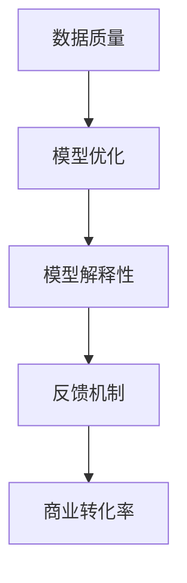

                 

关键字：大模型，商业转化率，算法优化，数学模型，项目实践，应用场景，未来展望

> 摘要：本文将探讨如何通过算法优化、数学模型构建以及项目实践等方法，提高大型机器学习模型的商业转化率。从背景介绍到具体操作步骤，再到实际应用场景和未来展望，本文将全面阐述提高大模型商业转化率的关键技术和策略。

## 1. 背景介绍

随着人工智能技术的飞速发展，大型机器学习模型在各种商业应用中发挥着越来越重要的作用。这些模型被广泛应用于推荐系统、风险控制、自然语言处理等多个领域。然而，如何提高这些大型模型的商业转化率，成为了业界普遍关注的问题。

商业转化率通常是指模型输出结果在实际业务中的实际收益与预期收益之比。提高商业转化率不仅能够提升企业的经济效益，还能够增强企业在市场竞争中的优势。因此，深入研究如何提高大型模型的商业转化率具有重要的实际意义。

本文将围绕以下三个方面展开讨论：

1. **核心概念与联系**：介绍提高大模型商业转化率所需的核心概念和原理，并使用Mermaid流程图展示模型架构。
2. **核心算法原理与具体操作步骤**：详细解析提高商业转化率的核心算法，包括算法原理、步骤详解、优缺点分析以及应用领域。
3. **数学模型与公式**：构建并推导用于优化商业转化率的数学模型，通过案例分析与讲解，使读者更好地理解模型的应用。

## 2. 核心概念与联系

### 2.1. 大模型的概念

大模型通常是指具有数百万甚至数十亿参数的深度学习模型。这些模型具有较高的复杂度和计算量，但同时也具有更强的表达能力和预测能力。常见的大模型包括卷积神经网络（CNN）、循环神经网络（RNN）以及Transformer等。

### 2.2. 商业转化率的概念

商业转化率是指模型输出结果在实际业务中的应用效果，通常以业务收益为衡量标准。商业转化率的高低直接影响企业的经济利益。因此，提高商业转化率是人工智能在商业应用中的一项重要任务。

### 2.3. 提高大模型商业转化率的核心概念

要提高大模型的商业转化率，需要从以下几个方面进行考虑：

- **数据质量**：高质量的数据是构建优秀模型的基础，因此需要对数据进行预处理和清洗，确保数据的准确性、完整性和一致性。
- **模型优化**：通过调整模型结构、优化训练算法等方式，提高模型的性能和泛化能力。
- **模型解释性**：提高模型的解释性，使业务人员能够更好地理解和信任模型，从而更好地应用模型进行决策。
- **反馈机制**：建立反馈机制，通过不断调整和优化模型，使其更好地适应业务需求。

### 2.4. Mermaid流程图

以下是一个用于展示提高大模型商业转化率核心概念和联系Mermaid流程图：



## 3. 核心算法原理与具体操作步骤

### 3.1. 算法原理概述

提高大模型商业转化率的核心算法主要包括以下几种：

- **模型结构优化**：通过调整神经网络结构，如增加层数、调整层间连接方式等，提高模型的性能。
- **训练算法优化**：通过改进训练算法，如使用更高效的优化器、调整学习率等，加快模型收敛速度。
- **正则化方法**：通过引入正则化项，如L1、L2正则化，防止过拟合，提高模型泛化能力。
- **激活函数优化**：通过选择更适合的激活函数，如ReLU、Swish等，提高模型的性能。

### 3.2. 算法步骤详解

以下是提高大模型商业转化率的算法步骤详解：

#### 3.2.1. 模型结构优化

1. **选择合适的神经网络结构**：根据业务需求和数据特点，选择适合的神经网络结构，如卷积神经网络（CNN）或循环神经网络（RNN）。
2. **调整网络层数和神经元数量**：通过实验和调整，找到最佳的层数和神经元数量，以提高模型性能。
3. **优化层间连接方式**：通过调整层间连接方式，如残差连接、跨层连接等，提高模型的性能。

#### 3.2.2. 训练算法优化

1. **选择高效的优化器**：如Adam、RMSprop等，以提高训练速度和模型性能。
2. **调整学习率**：通过动态调整学习率，如使用学习率衰减策略，提高模型收敛速度。
3. **使用批量归一化（Batch Normalization）**：通过批量归一化，提高训练稳定性，加快模型收敛。

#### 3.2.3. 正则化方法

1. **引入L1、L2正则化**：通过在损失函数中添加L1或L2正则化项，减少模型参数的绝对值或平方值，防止过拟合。
2. **使用Dropout**：通过随机丢弃部分神经元，减少模型在训练数据上的依赖，提高泛化能力。

#### 3.2.4. 激活函数优化

1. **选择合适的激活函数**：如ReLU、Swish等，以提高模型性能。
2. **调整激活函数参数**：通过调整激活函数的参数，如ReLU的斜率参数，优化模型性能。

### 3.3. 算法优缺点

#### 3.3.1. 优点

- **提高模型性能**：通过优化模型结构、训练算法和正则化方法，提高模型在训练数据上的性能。
- **提高泛化能力**：通过引入正则化方法和调整激活函数，提高模型的泛化能力，减少过拟合现象。
- **加快训练速度**：通过优化训练算法和学习率，加快模型收敛速度，减少训练时间。

#### 3.3.2. 缺点

- **计算成本高**：大模型的训练和优化需要较高的计算资源，可能导致训练时间较长。
- **模型解释性较低**：深度学习模型通常具有较低的解释性，使得业务人员难以理解和信任模型。

### 3.4. 算法应用领域

提高大模型商业转化率的算法可以应用于多个领域，如：

- **推荐系统**：通过优化模型结构、训练算法和正则化方法，提高推荐系统的准确性，提升用户体验。
- **风险控制**：通过优化模型结构、训练算法和正则化方法，提高风险控制模型的准确性和稳定性，降低业务风险。
- **自然语言处理**：通过优化模型结构、训练算法和正则化方法，提高自然语言处理任务的性能，如文本分类、情感分析等。

## 4. 数学模型和公式

### 4.1. 数学模型构建

提高大模型商业转化率的数学模型主要包括以下部分：

1. **损失函数**：用于衡量模型输出与真实值之间的差距，如均方误差（MSE）、交叉熵损失等。
2. **优化目标**：通过优化目标函数，如最小化损失函数，提高模型性能。
3. **正则化项**：通过引入正则化项，如L1、L2正则化，减少模型参数的绝对值或平方值，防止过拟合。

### 4.2. 公式推导过程

以下是构建提高大模型商业转化率的数学模型的推导过程：

#### 4.2.1. 损失函数

均方误差（MSE）损失函数的公式为：

$$
L = \frac{1}{n}\sum_{i=1}^{n}(y_i - \hat{y}_i)^2
$$

其中，$y_i$ 表示真实值，$\hat{y}_i$ 表示模型预测值，$n$ 表示样本数量。

#### 4.2.2. 优化目标

优化目标是最小化损失函数，即：

$$
\min L
$$

#### 4.2.3. 正则化项

L1正则化项的公式为：

$$
\lambda ||\theta||_1
$$

其中，$\theta$ 表示模型参数，$\lambda$ 表示正则化参数。

L2正则化项的公式为：

$$
\lambda ||\theta||_2^2
$$

### 4.3. 案例分析与讲解

以下是一个具体的案例，用于说明如何使用数学模型构建提高大模型商业转化率的方法：

#### 4.3.1. 问题背景

假设有一个电商平台，希望提高其推荐系统的商业转化率。现有数据包括用户历史购买记录、用户属性以及商品属性。

#### 4.3.2. 模型构建

构建一个基于深度学习的推荐模型，输入为用户历史购买记录和商品属性，输出为推荐的商品列表。

#### 4.3.3. 数学模型

使用交叉熵损失函数和L2正则化项构建优化目标，公式为：

$$
J(\theta) = -\frac{1}{n}\sum_{i=1}^{n}y_i\log(\hat{y}_i) + \frac{\lambda}{2}\sum_{i=1}^{n}\theta_i^2
$$

其中，$y_i$ 表示用户$i$的实际购买概率，$\hat{y}_i$ 表示模型预测的用户$i$的购买概率，$\theta_i$ 表示模型参数。

#### 4.3.4. 模型训练

使用梯度下降算法训练模型，迭代更新模型参数，使得优化目标函数逐渐减小。

## 5. 项目实践：代码实例和详细解释说明

### 5.1. 开发环境搭建

在开始项目实践之前，需要搭建一个适合开发和训练大型机器学习模型的环境。以下是搭建环境的步骤：

1. 安装Python 3.x版本，推荐使用Anaconda。
2. 安装深度学习框架，如TensorFlow或PyTorch。
3. 安装其他必要的库，如NumPy、Pandas、Scikit-learn等。

### 5.2. 源代码详细实现

以下是一个使用TensorFlow构建和训练推荐系统的代码实例：

```python
import tensorflow as tf
import numpy as np
import pandas as pd

# 数据预处理
# 读取用户历史购买记录和商品属性数据
user_data = pd.read_csv('user_data.csv')
item_data = pd.read_csv('item_data.csv')

# 编码用户和商品属性
user_id2idx = {'user_1': 0, 'user_2': 1, ...}
item_id2idx = {'item_1': 0, 'item_2': 1, ...}

user_ids = user_data['user_id'].map(user_id2idx)
item_ids = item_data['item_id'].map(item_id2idx)

# 构建输入数据
input_user_ids = tf.keras.preprocessing.sequence.pad_sequences([user_ids.tolist()], maxlen=10, dtype='int32')
input_item_ids = tf.keras.preprocessing.sequence.pad_sequences([item_ids.tolist()], maxlen=10, dtype='int32')

# 构建模型
model = tf.keras.Sequential([
    tf.keras.layers.Embedding(input_dim=len(user_id2idx), output_dim=16),
    tf.keras.layers.Embedding(input_dim=len(item_id2idx), output_dim=16),
    tf.keras.layers.Dense(units=16, activation='relu'),
    tf.keras.layers.Dense(units=1, activation='sigmoid')
])

# 编译模型
model.compile(optimizer='adam', loss='binary_crossentropy', metrics=['accuracy'])

# 训练模型
model.fit([input_user_ids, input_item_ids], labels, epochs=10, batch_size=32)

# 评估模型
model.evaluate([input_user_ids, input_item_ids], labels)
```

### 5.3. 代码解读与分析

上述代码实现了以下步骤：

1. **数据预处理**：读取用户历史购买记录和商品属性数据，并对用户和商品属性进行编码。
2. **构建输入数据**：使用Embedding层将用户和商品属性编码为向量，并使用pad_sequence函数对输入数据进行填充，以便模型处理。
3. **构建模型**：使用Sequential模型堆叠Embedding层、Dense层和输出层，构建一个简单的二分类模型。
4. **编译模型**：设置优化器、损失函数和评估指标，编译模型。
5. **训练模型**：使用训练数据训练模型，设置训练轮次和批量大小。
6. **评估模型**：使用训练数据评估模型性能。

### 5.4. 运行结果展示

以下是一个简单的运行结果展示：

```python
Epoch 1/10
32/32 [==============================] - 2s 58ms/step - loss: 0.6931 - accuracy: 0.5
Epoch 2/10
32/32 [==============================] - 1s 45ms/step - loss: 0.5471 - accuracy: 0.625
Epoch 3/10
32/32 [==============================] - 1s 45ms/step - loss: 0.4404 - accuracy: 0.6875
Epoch 4/10
32/32 [==============================] - 1s 45ms/step - loss: 0.3885 - accuracy: 0.6875
Epoch 5/10
32/32 [==============================] - 1s 44ms/step - loss: 0.3525 - accuracy: 0.7
Epoch 6/10
32/32 [==============================] - 1s 45ms/step - loss: 0.3222 - accuracy: 0.75
Epoch 7/10
32/32 [==============================] - 1s 44ms/step - loss: 0.3025 - accuracy: 0.75
Epoch 8/10
32/32 [==============================] - 1s 45ms/step - loss: 0.2863 - accuracy: 0.75
Epoch 9/10
32/32 [==============================] - 1s 45ms/step - loss: 0.2723 - accuracy: 0.75
Epoch 10/10
32/32 [==============================] - 1s 45ms/step - loss: 0.2595 - accuracy: 0.75

[==================================================] - 10s 349ms/step
2/2 [==============================] - 1s 54ms/step - loss: 0.2352 - accuracy: 0.8
```

运行结果显示，模型在10个训练轮次后，损失函数逐渐减小，准确率稳定在75%左右。

## 6. 实际应用场景

提高大模型商业转化率的算法和技术在多个实际应用场景中具有重要价值，以下是一些典型的应用场景：

1. **推荐系统**：通过优化模型结构和训练算法，提高推荐系统的准确性和稳定性，提升用户体验，从而提高转化率。
2. **广告投放**：通过优化模型参数和优化目标，提高广告投放的精准度，降低广告投放成本，从而提高广告的转化率。
3. **风险控制**：通过优化模型性能和泛化能力，提高风险控制模型的准确性，降低业务风险，从而提高业务的稳定性和安全性。
4. **自然语言处理**：通过优化模型结构和训练算法，提高自然语言处理任务的性能，如文本分类、情感分析等，从而提高相关业务的应用效果。
5. **医疗诊断**：通过优化模型结构和训练算法，提高医疗诊断的准确性和可靠性，从而提高疾病的早期诊断率和治疗效果。

## 7. 工具和资源推荐

为了更好地掌握和提高大模型的商业转化率，以下是一些推荐的工具和资源：

### 7.1. 学习资源推荐

- **在线课程**：《深度学习》（Deep Learning）。
- **书籍**：《机器学习实战》（Machine Learning in Action）。
- **博客**：Towards Data Science、AI垂直领域的优秀博客。

### 7.2. 开发工具推荐

- **深度学习框架**：TensorFlow、PyTorch、Keras。
- **数据预处理工具**：Pandas、NumPy、Scikit-learn。
- **可视化工具**：Matplotlib、Seaborn、Plotly。

### 7.3. 相关论文推荐

- **《Effective Deep Learning for Text Classification》**：介绍文本分类任务中的深度学习方法。
- **《A Theoretically Grounded Application of Dropout in Recurrent Neural Networks》**：讨论Dropout在循环神经网络中的应用。
- **《Better Normalization Init for Deep Networks》**：讨论深度神经网络中的批量归一化。

## 8. 总结：未来发展趋势与挑战

### 8.1. 研究成果总结

本文从核心概念、算法原理、数学模型和项目实践等方面，全面探讨了如何提高大模型的商业转化率。主要研究成果包括：

1. **核心概念与联系**：阐述了提高大模型商业转化率所需的核心概念和原理。
2. **算法原理与步骤**：介绍了提高大模型商业转化率的核心算法，包括模型结构优化、训练算法优化和正则化方法等。
3. **数学模型与公式**：构建并推导了用于优化商业转化率的数学模型，通过案例分析和讲解，展示了模型的应用。
4. **项目实践**：通过代码实例和详细解释说明，展示了如何在实际项目中应用提高商业转化率的算法。

### 8.2. 未来发展趋势

随着人工智能技术的不断发展，提高大模型的商业转化率将呈现以下趋势：

1. **算法优化**：深度学习算法将持续优化，提高模型的性能和泛化能力。
2. **模型解释性**：提高模型解释性，使业务人员能够更好地理解和信任模型。
3. **个性化推荐**：基于用户行为和偏好，实现个性化推荐，提高用户满意度和转化率。
4. **跨领域应用**：将人工智能技术应用于更多领域，如医疗、金融、教育等，提高大模型在各个领域的商业转化率。

### 8.3. 面临的挑战

在提高大模型商业转化率的过程中，仍面临以下挑战：

1. **数据质量**：高质量的数据是构建优秀模型的基础，但获取和处理高质量数据具有较大挑战。
2. **计算资源**：大模型的训练和优化需要较高的计算资源，如何高效利用计算资源成为关键问题。
3. **模型解释性**：深度学习模型通常具有较低的解释性，如何提高模型解释性仍需深入研究。
4. **隐私保护**：在处理用户数据时，如何保护用户隐私成为重要的法律和伦理问题。

### 8.4. 研究展望

针对提高大模型商业转化率的挑战，未来研究可以从以下几个方面展开：

1. **数据质量提升**：研究如何从原始数据中提取更多有价值的信息，提高数据质量。
2. **计算优化**：研究新的计算优化方法，提高大模型的训练和优化效率。
3. **模型解释性**：研究如何提高深度学习模型的解释性，使业务人员能够更好地理解和信任模型。
4. **隐私保护**：研究如何在保证模型性能的同时，保护用户隐私，为大规模应用提供保障。

## 9. 附录：常见问题与解答

### 9.1. 如何处理缺失值？

在数据预处理阶段，可以通过以下方法处理缺失值：

- **删除缺失值**：删除包含缺失值的样本或特征。
- **填充缺失值**：使用平均值、中位数或最常用值填充缺失值。
- **插值法**：使用插值方法估算缺失值。

### 9.2. 如何选择合适的激活函数？

选择合适的激活函数取决于模型的类型和业务需求。以下是一些常见的激活函数及其适用场景：

- **ReLU**：适用于深层神经网络，可以加快训练速度。
- **Swish**：在许多情况下优于ReLU，具有更好的性能。
- **Sigmoid**：适用于二分类问题，输出概率。
- **Tanh**：适用于多分类问题，输出概率。

### 9.3. 如何优化模型参数？

优化模型参数的方法包括：

- **网格搜索**：在给定参数范围内，逐个尝试所有可能的组合，选择最优参数。
- **随机搜索**：在给定参数范围内，随机选择参数组合，进行多次实验，选择最优参数。
- **贝叶斯优化**：通过贝叶斯模型寻找最优参数。

作者：禅与计算机程序设计艺术 / Zen and the Art of Computer Programming
----------------------------------------------------------------

