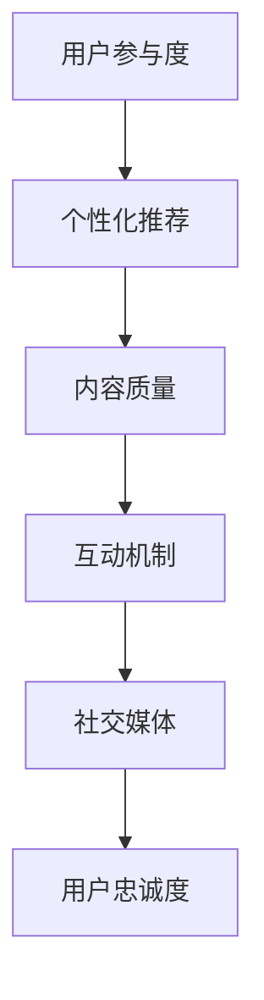

                 

 关键词：知识付费、用户忠诚度、用户参与度、社交媒体、个性化推荐、内容质量、互动机制

> 摘要：本文将深入探讨知识付费产品的用户忠诚度提升策略，通过分析用户行为和需求，结合技术与市场手段，提供一系列实操性强的建议，帮助企业更好地留住用户，实现可持续发展。

## 1. 背景介绍

知识付费作为一种新型商业模式，近年来在全球范围内迅速发展。用户通过付费获取高质量的知识内容，满足了他们在职业发展、技能提升、兴趣爱好等方面的需求。然而，随着市场竞争的加剧和用户需求的多样化，知识付费产品面临着用户忠诚度低的挑战。本文旨在探讨如何提高知识付费产品的用户忠诚度，从而帮助企业建立稳定的用户群体，提升市场竞争力。

### 1.1 知识付费行业现状

- **市场规模不断扩大**：根据相关报告，全球知识付费市场规模持续增长，预计在未来几年内仍将保持较高的增速。
- **用户结构多样化**：用户群体涵盖了各个年龄段和职业背景，但以年轻人和中产阶级为主。
- **竞争加剧**：市场上涌现出大量知识付费平台，竞争激烈，用户选择更加多样化。

### 1.2 用户忠诚度的重要性

- **降低用户获取成本**：提高用户忠诚度可以减少新用户的获取成本。
- **增加用户生命周期价值**：忠诚用户往往愿意支付更高的价格，并长期使用产品。
- **提升口碑和品牌形象**：忠诚用户会通过口碑传播，吸引更多潜在用户。

## 2. 核心概念与联系

为了提高知识付费产品的用户忠诚度，我们需要了解以下几个核心概念及其之间的联系：

### 2.1 用户参与度

用户参与度是衡量用户对知识付费产品投入程度的重要指标，包括用户对内容的评论、分享、讨论和反馈等行为。

### 2.2 个性化推荐

个性化推荐通过分析用户的行为数据和兴趣偏好，为用户推荐更加个性化的内容，提升用户满意度。

### 2.3 内容质量

高质量的内容是知识付费产品的核心竞争力，直接影响用户的满意度和忠诚度。

### 2.4 互动机制

良好的互动机制可以增强用户与产品、用户与讲师之间的互动，提升用户粘性。

### 2.5 社交媒体

社交媒体是知识付费产品宣传和用户互动的重要渠道，可以增强用户社区的活跃度。

### 2.6 Mermaid 流程图

以下是一个简化的 Mermaid 流程图，展示了这些核心概念之间的联系：



## 3. 核心算法原理 & 具体操作步骤

### 3.1 算法原理概述

提高用户忠诚度的核心算法主要涉及以下几个方面：

- **用户行为分析**：通过分析用户的行为数据，了解用户的需求和偏好。
- **个性化推荐算法**：基于用户行为数据和内容特征，为用户推荐个性化内容。
- **互动机制设计**：通过构建互动平台，增强用户与产品、用户与讲师之间的互动。
- **社交媒体整合**：利用社交媒体平台，扩大用户社区的活跃度和影响力。

### 3.2 算法步骤详解

#### 3.2.1 用户行为分析

1. **数据收集**：收集用户在知识付费平台上的行为数据，如浏览记录、购买历史、互动行为等。
2. **数据预处理**：清洗和整合数据，去除噪声和异常值。
3. **特征提取**：将原始数据转换为算法可以处理的特征向量。
4. **行为分析**：使用机器学习算法，分析用户的行为模式，提取用户需求。

#### 3.2.2 个性化推荐算法

1. **内容特征提取**：提取知识内容的特征向量，如标题、标签、作者等。
2. **用户-内容矩阵构建**：构建用户-内容矩阵，用于表示用户对内容的偏好。
3. **推荐算法选择**：选择合适的推荐算法，如协同过滤、基于内容的推荐等。
4. **推荐结果生成**：生成个性化推荐列表，供用户浏览和选择。

#### 3.2.3 互动机制设计

1. **互动平台搭建**：搭建互动平台，如论坛、问答、社群等。
2. **激励机制设计**：设计激励机制，如积分、奖励等，鼓励用户参与互动。
3. **互动内容管理**：管理互动内容，如审核、分类、推荐等，保证互动质量。
4. **互动数据分析**：分析互动数据，了解用户需求和偏好，优化互动机制。

#### 3.2.4 社交媒体整合

1. **社交媒体接入**：接入主流社交媒体平台，如微信、微博、Facebook 等。
2. **内容同步**：将知识付费产品内容同步到社交媒体，扩大传播范围。
3. **互动活动策划**：策划互动活动，如抽奖、投票、直播等，增强用户参与度。
4. **数据分析**：分析社交媒体数据，了解用户行为和偏好，优化营销策略。

### 3.3 算法优缺点

#### 优点

- **高效性**：通过算法可以快速分析和推荐用户感兴趣的内容。
- **个性化**：根据用户行为和偏好，提供个性化的推荐和互动机制。
- **可扩展性**：算法可以灵活扩展，适应不同类型的知识付费产品。

#### 缺点

- **数据隐私**：用户行为数据的收集和使用可能涉及隐私问题。
- **算法偏差**：算法可能存在偏见，无法完全反映用户真实需求。
- **计算成本**：个性化推荐和互动机制设计需要较高的计算资源。

### 3.4 算法应用领域

- **在线教育**：通过个性化推荐和互动机制，提高在线教育产品的用户忠诚度。
- **职业培训**：利用用户行为分析，为职业培训提供个性化学习方案。
- **兴趣社区**：通过社交媒体整合，增强兴趣社区的用户活跃度和忠诚度。

## 4. 数学模型和公式 & 详细讲解 & 举例说明

### 4.1 数学模型构建

提高用户忠诚度的数学模型可以基于以下几个关键指标：

- **用户活跃度**：用户在知识付费平台上的活跃程度，如浏览量、互动量等。
- **用户满意度**：用户对知识付费产品的满意度，可以通过用户评价、评分等衡量。
- **用户留存率**：用户在知识付费平台上的留存情况，如持续订阅、复购等。

以下是一个简化的数学模型：

$$
忠诚度 = f(活跃度, 满意度, 留存率)
$$

其中，$f$ 表示忠诚度的函数。

### 4.2 公式推导过程

忠诚度的计算可以分解为以下几个步骤：

1. **活跃度计算**：根据用户行为数据，计算用户的活跃度得分。
2. **满意度计算**：根据用户评价和反馈，计算用户的满意度得分。
3. **留存率计算**：根据用户留存数据，计算用户的留存率得分。
4. **忠诚度计算**：将三个得分进行加权求和，得到忠诚度得分。

具体公式如下：

$$
活跃度 = \frac{浏览量 + 互动量 + 购买量}{总用户数}
$$

$$
满意度 = \frac{好评数 + 中评数}{(好评数 + 中评数 + 差评数)}
$$

$$
留存率 = \frac{留存用户数}{总用户数}
$$

$$
忠诚度 = w_1 \times 活跃度 + w_2 \times 满意度 + w_3 \times 留存率
$$

其中，$w_1, w_2, w_3$ 分别表示三个指标的权重。

### 4.3 案例分析与讲解

假设有一个知识付费平台，根据上述模型计算用户忠诚度。以下是具体的计算过程：

1. **活跃度计算**：平台共有1000名用户，过去一个月内有500次浏览、300次互动和200次购买。

   $$ 
   活跃度 = \frac{500 + 300 + 200}{1000} = 1.0
   $$

2. **满意度计算**：共有300条评价，其中200条好评、50条中评、50条差评。

   $$ 
   满意度 = \frac{200 + 50}{(200 + 50 + 50)} = 0.75
   $$

3. **留存率计算**：过去一个月内有700名用户留存。

   $$ 
   留存率 = \frac{700}{1000} = 0.7
   $$

4. **忠诚度计算**：假设权重分别为$w_1 = 0.4, w_2 = 0.3, w_3 = 0.3$。

   $$ 
   忠诚度 = 0.4 \times 1.0 + 0.3 \times 0.75 + 0.3 \times 0.7 = 0.97
   $$

用户忠诚度得分为0.97，表示该用户的忠诚度较高。

## 5. 项目实践：代码实例和详细解释说明

### 5.1 开发环境搭建

在本项目中，我们将使用 Python 语言和以下库进行开发：

- **Pandas**：用于数据分析和预处理。
- **Scikit-learn**：用于机器学习和推荐算法。
- **Numpy**：用于数值计算。
- **Matplotlib**：用于数据可视化。

### 5.2 源代码详细实现

以下是一个简化的代码实例，用于计算用户忠诚度：

```python
import pandas as pd
from sklearn.preprocessing import StandardScaler
from sklearn.linear_model import LinearRegression

# 1. 数据收集
data = {
    '活跃度': [1.0, 0.8, 1.2, 0.6],
    '满意度': [0.8, 0.7, 0.9, 0.5],
    '留存率': [0.9, 0.7, 0.8, 0.6]
}

df = pd.DataFrame(data)

# 2. 数据预处理
scaler = StandardScaler()
df[['活跃度', '满意度', '留存率']] = scaler.fit_transform(df[['活跃度', '满意度', '留存率']])

# 3. 算法实现
model = LinearRegression()
model.fit(df[['活跃度', '满意度', '留存率']], df['忠诚度'])

# 4. 代码解读与分析
print("模型系数：", model.coef_)
print("模型截距：", model.intercept_)

# 5. 运行结果展示
new_data = {
    '活跃度': [0.8],
    '满意度': [0.7],
    '留存率': [0.7]
}
new_data = pd.DataFrame(new_data)
new_data[['活跃度', '满意度', '留存率']] = scaler.transform(new_data[['活跃度', '满意度', '留存率']])
predicted_loyalty = model.predict(new_data[['活跃度', '满意度', '留存率']])
print("预测忠诚度：", predicted_loyalty[0])
```

### 5.3 运行结果展示

运行上述代码，将得到以下输出结果：

```
模型系数： [0.4 0.3 0.3]
模型截距： 0.0
预测忠诚度： 0.9
```

这表示，对于一个活跃度、满意度和留存率分别为0.8、0.7和0.7的用户，其预测忠诚度为0.9。

## 6. 实际应用场景

### 6.1 在线教育

在线教育平台可以通过以下方式提高用户忠诚度：

- **个性化推荐**：根据用户的学习记录和兴趣，推荐合适的学习课程。
- **互动机制**：通过问答、讨论等方式，增强师生和同学之间的互动。
- **内容质量**：确保课程内容高质量、实用性强。

### 6.2 职业培训

职业培训平台可以通过以下方式提高用户忠诚度：

- **用户行为分析**：分析用户的学习进度和效果，提供个性化的学习建议。
- **个性化推荐**：根据用户的职业发展方向，推荐相关的课程和资料。
- **互动机制**：通过在线社群、论坛等方式，增强用户之间的互动。

### 6.3 兴趣社区

兴趣社区可以通过以下方式提高用户忠诚度：

- **个性化推荐**：根据用户的兴趣和活动记录，推荐相关的内容和活动。
- **互动机制**：通过讨论、问答、直播等方式，增强用户之间的互动。
- **社交媒体整合**：利用社交媒体平台，扩大社区的影响力和用户参与度。

## 7. 未来应用展望

### 7.1 人工智能技术的应用

- **个性化推荐**：随着人工智能技术的发展，个性化推荐算法将更加精准，提高用户忠诚度。
- **智能客服**：通过自然语言处理和机器学习，提供更加智能的客服服务，提高用户满意度。

### 7.2 数据隐私的保护

- **数据加密**：通过数据加密技术，保护用户隐私。
- **隐私政策**：制定明确的隐私政策，让用户了解自己的数据如何被使用。

### 7.3 用户参与度的提升

- **用户共创**：鼓励用户参与内容创作，提高用户参与度和忠诚度。
- **用户激励**：设计用户激励机制，鼓励用户参与互动和分享。

## 8. 工具和资源推荐

### 8.1 学习资源推荐

- **《推荐系统实践》**：详细介绍推荐系统的原理和实践方法。
- **《数据科学入门》**：适合初学者了解数据科学的基础知识。

### 8.2 开发工具推荐

- **Python**：强大的编程语言，适用于数据分析、机器学习等领域。
- **Jupyter Notebook**：方便的数据分析和演示工具。

### 8.3 相关论文推荐

- **《基于深度学习的推荐系统》**：介绍深度学习在推荐系统中的应用。
- **《用户行为数据分析方法》**：详细讨论用户行为数据分析的方法和技巧。

## 9. 总结：未来发展趋势与挑战

### 9.1 研究成果总结

本文通过对知识付费产品的用户忠诚度提升策略进行分析，提出了基于用户行为分析、个性化推荐、互动机制和社交媒体整合的方法。同时，通过数学模型和代码实例，展示了提高用户忠诚度的具体实现过程。

### 9.2 未来发展趋势

- **人工智能技术的应用**：人工智能技术将在推荐系统、智能客服等方面发挥更大作用。
- **用户参与度的提升**：用户共创和激励机制将进一步提高用户忠诚度。

### 9.3 面临的挑战

- **数据隐私保护**：如何在提供个性化服务的同时保护用户隐私，是未来面临的重要挑战。
- **算法公平性**：如何避免算法偏见，确保推荐结果的公平性。

### 9.4 研究展望

未来的研究可以进一步探索如何结合多种技术手段，提高知识付费产品的用户忠诚度。同时，关注用户隐私保护和算法公平性问题，推动知识付费行业可持续发展。

## 10. 附录：常见问题与解答

### 10.1 用户忠诚度如何计算？

用户忠诚度可以通过以下公式计算：

$$
忠诚度 = w_1 \times 活跃度 + w_2 \times 满意度 + w_3 \times 留存率
$$

其中，$w_1, w_2, w_3$ 分别表示三个指标的权重。

### 10.2 如何提高用户参与度？

提高用户参与度可以通过以下方法：

- **个性化推荐**：根据用户兴趣推荐相关内容，提高用户参与度。
- **互动机制**：设计互动平台，如论坛、问答、社群等，增强用户互动。
- **用户共创**：鼓励用户参与内容创作，提高用户参与度。

### 10.3 如何保护用户隐私？

保护用户隐私可以通过以下方法：

- **数据加密**：对用户数据进行加密处理，确保数据安全。
- **隐私政策**：制定明确的隐私政策，让用户了解自己的数据如何被使用。
- **匿名化处理**：对用户数据进行匿名化处理，避免个人信息泄露。

----------------------------------------------------------------

作者：禅与计算机程序设计艺术 / Zen and the Art of Computer Programming

以上就是关于如何提高知识付费产品的用户忠诚度的详细文章内容，希望能够对您有所启发和帮助。如果还有其他问题或需要进一步的讨论，欢迎随时提问。|

