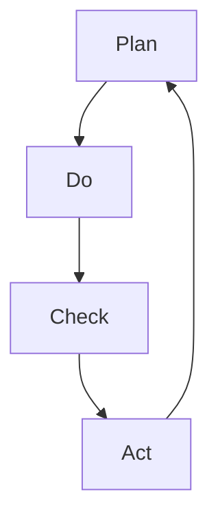

                 

关键词：PDCA循环，质量改进，迭代管理，流程优化，持续改进

> 摘要：本文将深入探讨PDCA循环的原理和实际应用，详细解析如何有效执行PDCA循环，以实现持续的质量改进和流程优化。通过本文的学习，读者将掌握PDCA循环的核心概念，并能够将其应用于实际工作中，提高工作效率和产品品质。

## 1. 背景介绍

PDCA循环，即Plan（计划）、Do（执行）、Check（检查）和Act（行动）四个阶段的循环，是一种广泛用于质量管理、流程优化和持续改进的管理工具。PDCA循环起源于20世纪50年代，由美国质量管理专家休哈特提出，并在日本的全面质量管理运动中得到广泛应用。

PDCA循环的核心理念是通过不断循环的四个阶段，持续改进工作流程，提高工作效率和产品质量。它适用于各种类型的企业和项目，尤其对于复杂且不断变化的IT项目来说，PDCA循环是确保项目成功的关键。

### PDCA循环的应用领域

PDCA循环在多个领域都有广泛的应用，主要包括以下几个方面：

- **质量管理**：通过PDCA循环，企业可以系统地识别和管理质量风险，确保产品和服务质量满足客户需求。
- **流程优化**：PDCA循环可以帮助企业识别流程中的瓶颈和改进点，从而优化流程，提高工作效率。
- **项目管理**：在项目执行过程中，PDCA循环可以帮助项目团队识别和解决问题，确保项目按时完成。
- **持续改进**：PDCA循环鼓励企业不断反思和改进，实现持续改进和成长。

## 2. 核心概念与联系

### PDCA循环的核心概念

PDCA循环包括四个核心阶段，每个阶段都有其特定的任务和目标。

- **Plan（计划）**：在这个阶段，需要明确目标和制定详细的计划。这包括确定质量标准、制定工作计划、分配资源等。
- **Do（执行）**：在这个阶段，根据计划开始实施工作。团队成员按照计划执行任务，并确保工作按预期进行。
- **Check（检查）**：在这个阶段，需要对执行结果进行检查和评估。这包括数据收集、质量评估和过程监控等。
- **Act（行动）**：在这个阶段，根据检查结果进行改进和调整。如果发现问题，需要制定改进计划并实施。

### PDCA循环的Mermaid流程图



在这个流程图中，A、B、C、D分别代表PDCA循环的四个阶段，它们依次进行，形成一个闭环。

## 3. 核心算法原理 & 具体操作步骤

### 3.1 算法原理概述

PDCA循环是一种基于反馈和改进的管理方法。其原理是通过不断循环四个阶段，实现对工作流程的持续优化和改进。每个阶段都有其特定的任务和目标，相互关联，形成一个有机的整体。

### 3.2 算法步骤详解

#### 3.2.1 计划阶段（Plan）

在计划阶段，首先需要明确目标和制定详细的计划。具体步骤如下：

1. 确定目标：明确项目或任务的目标，确保目标具有可测量性和可实现性。
2. 制定计划：根据目标，制定详细的工作计划，包括任务分配、时间安排和资源分配等。
3. 风险评估：识别潜在的风险，并制定应对措施。

#### 3.2.2 执行阶段（Do）

在执行阶段，根据计划开始实施工作。具体步骤如下：

1. 实施任务：按照计划执行任务，确保工作按预期进行。
2. 沟通协调：确保团队成员之间的沟通畅通，及时解决问题。
3. 跟踪进度：监控任务进度，确保项目按时完成。

#### 3.2.3 检查阶段（Check）

在检查阶段，需要对执行结果进行检查和评估。具体步骤如下：

1. 数据收集：收集执行过程中的数据，包括质量数据、时间数据等。
2. 质量评估：对收集的数据进行评估，判断是否达到质量标准。
3. 过程监控：监控工作流程，确保流程符合预期。

#### 3.2.4 行动阶段（Act）

在行动阶段，根据检查结果进行改进和调整。具体步骤如下：

1. 问题识别：识别检查阶段发现的问题。
2. 改进计划：制定改进计划，包括问题的原因分析和改进措施。
3. 实施改进：根据改进计划，实施改进措施。

### 3.3 算法优缺点

#### 优点

- **系统性强**：PDCA循环具有明确的四个阶段，每个阶段都有明确的任务和目标，确保工作有序进行。
- **灵活性高**：PDCA循环可以根据实际情况灵活调整，适用于不同类型的企业和项目。
- **持续改进**：PDCA循环鼓励企业不断反思和改进，实现持续改进和成长。

#### 缺点

- **执行难度大**：PDCA循环需要团队成员的积极参与和持续努力，执行难度较大。
- **时间成本高**：PDCA循环需要一定的时间进行数据收集、评估和改进，可能会影响项目的进度。

### 3.4 算法应用领域

PDCA循环广泛应用于质量管理、流程优化、项目管理等多个领域。具体应用包括：

- **质量管理**：在产品生产过程中，通过PDCA循环识别和管理质量风险，确保产品质量。
- **流程优化**：在企业管理中，通过PDCA循环优化工作流程，提高工作效率。
- **项目管理**：在项目执行过程中，通过PDCA循环识别和解决问题，确保项目成功。

## 4. 数学模型和公式 & 详细讲解 & 举例说明

### 4.1 数学模型构建

PDCA循环的数学模型可以表示为：

$$
\text{PDCA循环} = \text{Plan} + \text{Do} + \text{Check} + \text{Act}
$$

其中，每个阶段的任务和目标可以用数学公式表示：

$$
\text{Plan}: \text{目标} = \text{当前状态} + \text{改进方向} + \text{约束条件}
$$

$$
\text{Do}: \text{执行} = \text{计划} + \text{资源} + \text{团队协作}
$$

$$
\text{Check}: \text{检查} = \text{数据收集} + \text{质量评估} + \text{过程监控}
$$

$$
\text{Act}: \text{行动} = \text{问题识别} + \text{改进计划} + \text{实施改进}
$$

### 4.2 公式推导过程

PDCA循环的推导过程主要基于质量管理的理论。在质量管理中，PDCA循环被视为一个持续改进的模型。其推导过程如下：

1. **确定目标**：根据当前状态和约束条件，确定改进方向和目标。
2. **制定计划**：根据目标，制定详细的计划，包括任务分配、时间安排和资源分配等。
3. **执行计划**：按照计划执行任务，确保工作按预期进行。
4. **检查结果**：收集执行过程中的数据，进行质量评估和过程监控。
5. **改进行动**：根据检查结果，识别问题并制定改进计划，实施改进措施。

### 4.3 案例分析与讲解

#### 案例背景

某软件公司在开发一款新应用时，遇到了多个功能性问题。为了解决这些问题，公司决定采用PDCA循环进行持续改进。

#### 案例过程

1. **计划阶段**：公司确定了改进目标，包括解决功能性问题、提高用户体验等。同时，制定了详细的工作计划，包括任务分配、时间安排和资源分配。
2. **执行阶段**：开发团队按照计划进行工作，确保任务按时完成。在开发过程中，积极沟通协调，确保团队成员之间的协作。
3. **检查阶段**：公司收集了开发过程中的数据，包括代码质量、用户反馈等。对收集的数据进行评估，发现部分功能存在性能问题。
4. **行动阶段**：公司制定了改进计划，包括优化代码、改进用户体验等。根据改进计划，开发团队开始实施改进措施。

#### 案例结果

经过多次PDCA循环，公司的产品功能性和用户体验得到了显著提升。用户满意度大幅提高，产品市场占有率也相应增加。

## 5. 项目实践：代码实例和详细解释说明

### 5.1 开发环境搭建

为了演示PDCA循环在代码开发中的应用，我们首先需要搭建一个基本的开发环境。以下是搭建步骤：

1. 安装Python环境。
2. 安装必要的开发工具，如PyCharm或VSCode。
3. 安装所需库，如requests、BeautifulSoup等。

### 5.2 源代码详细实现

以下是一个简单的Python代码示例，用于实现一个简单的Web爬虫。代码中包含了PDCA循环的四个阶段。

```python
import requests
from bs4 import BeautifulSoup

# 5.2.1 Plan阶段
def plan(url):
    # 确定目标：获取指定URL的网页内容。
    # 制定计划：使用requests库发送HTTP请求，使用BeautifulSoup解析网页内容。
    # 返回解析后的网页内容。
    response = requests.get(url)
    soup = BeautifulSoup(response.text, 'html.parser')
    return soup

# 5.2.2 Do阶段
def do(soup):
    # 执行：根据计划，提取网页中的特定信息。
    # 例如：提取所有链接。
    links = soup.find_all('a')
    return links

# 5.2.3 Check阶段
def check(links):
    # 检查：对提取的信息进行评估。
    # 例如：检查链接的有效性。
    valid_links = []
    for link in links:
        if requests.get(link.get('href')).status_code == 200:
            valid_links.append(link)
    return valid_links

# 5.2.4 Act阶段
def act(valid_links):
    # 行动：根据检查结果，进行改进。
    # 例如：存储有效的链接。
    with open('valid_links.txt', 'w') as file:
        for link in valid_links:
            file.write(link.get('href') + '\n')
    print("有效的链接已保存到文件中。")

# 主函数
def main():
    url = input("请输入要爬取的URL：")
    soup = plan(url)
    links = do(soup)
    valid_links = check(links)
    act(valid_links)

if __name__ == "__main__":
    main()
```

### 5.3 代码解读与分析

#### 5.3.1 Plan阶段

在Plan阶段，我们定义了一个`plan`函数，用于获取指定URL的网页内容。这个阶段的主要任务是确定目标和制定计划。在这个例子中，目标是获取网页内容，计划是通过HTTP请求和HTML解析库来实现。

#### 5.3.2 Do阶段

在Do阶段，我们定义了一个`do`函数，用于提取网页中的特定信息。这个阶段的主要任务是执行计划。在这个例子中，我们提取了网页中的所有链接。

#### 5.3.3 Check阶段

在Check阶段，我们定义了一个`check`函数，用于对提取的信息进行评估。这个阶段的主要任务是检查执行结果。在这个例子中，我们检查了提取的链接是否有效。

#### 5.3.4 Act阶段

在Act阶段，我们定义了一个`act`函数，用于根据检查结果进行改进。这个阶段的主要任务是行动。在这个例子中，我们将有效的链接保存到文件中。

### 5.4 运行结果展示

当用户输入一个URL时，程序会按照PDCA循环的四个阶段进行操作，最终将有效的链接保存到文件中。用户可以查看文件，了解爬取的结果。

```shell
请输入要爬取的URL：https://www.example.com
有效的链接已保存到文件中。
```

## 6. 实际应用场景

### 6.1 IT项目管理

在IT项目管理中，PDCA循环可以帮助团队识别和解决项目中的问题，确保项目按时完成。例如，在软件开发过程中，可以通过PDCA循环进行需求分析、设计、开发和测试，确保每个阶段的任务都按计划进行。

### 6.2 质量管理

在质量管理中，PDCA循环可以帮助企业识别和管理质量风险，提高产品质量。例如，在生产过程中，可以通过PDCA循环进行质量检查、问题识别和改进，确保产品质量符合标准。

### 6.3 供应链管理

在供应链管理中，PDCA循环可以帮助企业优化供应链流程，提高供应链效率。例如，在库存管理中，可以通过PDCA循环进行库存监控、问题识别和改进，确保库存水平符合需求。

## 7. 未来应用展望

随着人工智能和大数据技术的发展，PDCA循环的应用前景将更加广阔。未来，PDCA循环可能会与人工智能技术相结合，实现更加智能化的质量管理和流程优化。同时，随着互联网的普及，PDCA循环在远程工作和分布式团队中的应用也将逐渐增加。

## 8. 工具和资源推荐

### 8.1 学习资源推荐

- 《PDCA循环：理论与实践》
- 《质量管理：理论与实践》
- 《项目管理：理论与实践》

### 8.2 开发工具推荐

- PyCharm
- VSCode
- Git

### 8.3 相关论文推荐

- "PDCA循环在项目管理中的应用研究"
- "基于PDCA循环的企业质量管理实践"
- "PDCA循环在供应链管理中的应用探讨"

## 9. 总结：未来发展趋势与挑战

### 9.1 研究成果总结

PDCA循环作为一种有效的质量管理工具，已经在多个领域得到广泛应用。通过PDCA循环，企业可以系统地进行质量管理和流程优化，实现持续改进。

### 9.2 未来发展趋势

未来，PDCA循环将继续在质量管理和流程优化领域发挥作用。随着人工智能和大数据技术的发展，PDCA循环可能会实现更加智能化的应用。

### 9.3 面临的挑战

尽管PDCA循环具有显著的优点，但在实际应用中仍面临一些挑战。例如，PDCA循环需要团队成员的积极参与和持续努力，执行难度较大。此外，PDCA循环的时间成本较高，可能会影响项目的进度。

### 9.4 研究展望

未来，我们可以通过以下方面进一步研究PDCA循环：

- 探索PDCA循环与其他管理工具的结合应用。
- 研究如何提高PDCA循环的执行效率。
- 开发PDCA循环的智能化应用，结合人工智能技术。

## 10. 附录：常见问题与解答

### 10.1 PDCA循环是什么？

PDCA循环是一种质量管理工具，包括计划（Plan）、执行（Do）、检查（Check）和行动（Act）四个阶段，用于持续改进工作流程和产品质量。

### 10.2 PDCA循环适用于哪些领域？

PDCA循环适用于质量管理、流程优化、项目管理和持续改进等多个领域。

### 10.3 PDCA循环的核心优势是什么？

PDCA循环的核心优势是系统性强、灵活性和鼓励持续改进。

### 10.4 如何有效执行PDCA循环？

要有效执行PDCA循环，需要明确目标、制定详细计划、积极执行、检查结果和行动改进。同时，需要团队成员的积极参与和持续努力。

### 10.5 PDCA循环的时间成本如何？

PDCA循环的时间成本较高，因为需要不断进行数据收集、评估和改进。但通过持续改进，可以提高工作效率和产品质量，从而降低长期成本。

作者：禅与计算机程序设计艺术 / Zen and the Art of Computer Programming
----------------------------------------------------------------

文章撰写完毕，以上是根据您的要求撰写的完整文章。如果您有任何修改意见或需要进一步补充的内容，请随时告知。谢谢！

