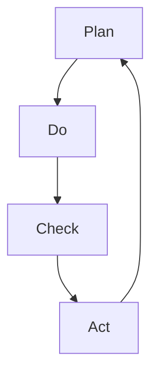

                 

关键词：PDCA循环、计划（Plan）、执行（Do）、检查（Check）、行动（Act）、持续改进、流程管理、质量控制、IT项目管理

> 摘要：本文旨在深入探讨PDCA循环（计划-执行-检查-行动）在IT项目管理中的应用和实践，详细分析其在不同阶段的执行步骤和方法。通过结合实际案例，揭示PDCA循环在提高项目质量和效率方面的关键作用，为IT项目管理提供有效的实践指南。

## 1. 背景介绍

PDCA循环，又称戴明循环，是一种广泛应用于各类管理活动的循环改进方法论。PDCA循环由美国质量管理专家爱德华·戴明提出，是一种持续改进的模型，用于帮助组织或个人不断优化流程、提高质量和效率。PDCA循环包括四个阶段：计划（Plan）、执行（Do）、检查（Check）和行动（Act）。

在IT项目管理中，PDCA循环被广泛采用，用以指导项目从启动到完成的整个过程。通过运用PDCA循环，项目经理可以系统地管理项目风险，确保项目目标的实现，并不断提升项目执行效率。

本文将围绕PDCA循环的四个阶段，详细介绍其在IT项目管理中的应用和实践，帮助读者理解PDCA循环的核心价值和具体实施方法。

## 2. 核心概念与联系

### 2.1 PDCA循环的组成部分

PDCA循环由四个主要阶段组成，分别是计划（Plan）、执行（Do）、检查（Check）和行动（Act）。

- **计划（Plan）**：在这个阶段，项目团队确定项目目标、制定工作计划和资源配置。此阶段的核心是明确项目范围、目标和里程碑，以及制定相应的质量标准和进度计划。

- **执行（Do）**：这个阶段是项目的实际执行阶段，团队根据计划展开工作，实施项目活动。此阶段的关键在于确保各项工作按计划进行，并及时发现和解决潜在问题。

- **检查（Check）**：在这个阶段，项目团队对项目执行过程和结果进行评估，检查是否达到预期目标和质量标准。通过数据分析和反馈，识别项目中的不足之处。

- **行动（Act）**：在最后一个阶段，项目团队根据检查结果采取纠正措施，并对项目计划进行调整，确保项目顺利完成并持续改进。

### 2.2 PDCA循环的工作原理

PDCA循环的工作原理可以概括为以下五个步骤：

1. **设定目标**：明确项目目标，制定可量化的KPI。

2. **分析现状**：收集数据，分析项目执行过程中的问题和不足。

3. **制定计划**：基于现状分析，制定改进措施和行动计划。

4. **执行计划**：按照计划执行项目活动，确保各项工作顺利进行。

5. **检查效果**：对项目执行效果进行评估，总结经验教训。

### 2.3 PDCA循环的Mermaid流程图

以下是PDCA循环的Mermaid流程图：



**节点解释**：

- **Plan**：制定项目计划和目标。
- **Do**：执行项目计划，实施项目活动。
- **Check**：评估项目执行效果，收集数据。
- **Act**：根据评估结果，采取纠正措施。

## 3. 核心算法原理 & 具体操作步骤

### 3.1 算法原理概述

PDCA循环是一种迭代循环算法，通过四个阶段的不断循环，实现项目的持续改进。每个阶段都有明确的任务和目标，确保项目在各个阶段都得到有效控制。

### 3.2 算法步骤详解

#### 3.2.1 计划（Plan）

- **设定目标**：明确项目目标和预期成果。
- **分析现状**：收集项目相关数据，分析项目执行过程中的问题和不足。
- **制定计划**：根据现状分析，制定详细的行动计划，包括资源分配、时间安排和质量标准。

#### 3.2.2 执行（Do）

- **执行计划**：按照制定的计划，实施项目活动，确保各项工作按计划进行。
- **监控进度**：实时监控项目进度，确保项目按时完成。

#### 3.2.3 检查（Check）

- **评估效果**：对项目执行效果进行评估，收集数据，分析项目成果与目标的差距。
- **反馈问题**：识别项目中的问题和不足，形成反馈报告。

#### 3.2.4 行动（Act）

- **采取纠正措施**：根据评估结果，采取纠正措施，对项目计划进行调整。
- **记录经验**：总结项目执行过程中的经验教训，形成知识库。

### 3.3 算法优缺点

#### 优点

- **系统化**：PDCA循环提供了一套系统化的方法，帮助项目团队有序地管理项目。
- **灵活性**：PDCA循环的迭代性质，使项目团队能够根据实际情况进行调整和优化。
- **持续改进**：PDCA循环强调持续改进，有助于不断提高项目质量。

#### 缺点

- **时间成本**：PDCA循环需要投入大量时间和精力，对项目进度有一定影响。
- **数据依赖**：PDCA循环的效果依赖于数据的准确性和及时性。

### 3.4 算法应用领域

PDCA循环广泛应用于各类项目管理活动，如IT项目管理、质量管理、生产管理、流程改进等。在IT项目管理中，PDCA循环有助于项目团队实现以下目标：

- **提高项目质量**：通过持续改进，不断提升项目交付的质量。
- **缩短项目周期**：优化项目流程，减少不必要的浪费，提高项目执行效率。
- **降低项目风险**：通过实时监控和反馈，及时发现和解决项目问题，降低项目风险。

## 4. 数学模型和公式 & 详细讲解 & 举例说明

### 4.1 数学模型构建

PDCA循环的数学模型主要包括以下几个部分：

- **目标函数**：衡量项目目标的实现程度。
- **约束条件**：确保项目资源、时间和质量的合理分配。
- **变量**：项目活动、资源消耗和时间安排等。

### 4.2 公式推导过程

#### 目标函数

$$
f(x) = \sum_{i=1}^{n} w_i \cdot p_i
$$

其中，$w_i$ 为权重，$p_i$ 为项目活动的完成情况。

#### 约束条件

$$
\begin{cases}
0 \leq x_i \leq C_i \\
\sum_{i=1}^{n} x_i \leq T
\end{cases}
$$

其中，$x_i$ 为项目活动 $i$ 的执行时间，$C_i$ 为项目活动 $i$ 的最大执行时间，$T$ 为项目总时间。

### 4.3 案例分析与讲解

#### 案例背景

某IT公司计划开发一款企业级管理系统，项目周期为6个月，要求在限定时间内完成。项目团队采用PDCA循环进行项目管理。

#### 案例分析

1. **计划阶段**

- **目标函数**：完成项目的全部功能，并达到预期质量。
- **约束条件**：项目周期为6个月，团队资源有限。

2. **执行阶段**

- **项目活动安排**：按照计划，将项目分为多个阶段，每个阶段都有明确的目标和任务。
- **资源分配**：根据项目需求，合理分配团队成员和资源。

3. **检查阶段**

- **数据收集**：收集项目执行过程中的数据，如项目进度、资源消耗等。
- **效果评估**：对比实际执行情况和计划目标，分析项目完成情况。

4. **行动阶段**

- **问题识别**：识别项目执行过程中的问题和不足，如进度延误、资源浪费等。
- **纠正措施**：针对问题，制定相应的纠正措施，调整项目计划。

#### 案例总结

通过PDCA循环，项目团队成功实现了项目目标，并在限定时间内完成了系统开发。PDCA循环帮助团队及时发现和解决问题，提高了项目执行效率和质量。

## 5. 项目实践：代码实例和详细解释说明

### 5.1 开发环境搭建

为了演示PDCA循环在IT项目管理中的应用，我们将使用Python编写一个简单的项目管理工具。首先，需要搭建Python开发环境。

#### 5.1.1 安装Python

- 在官网上下载Python安装包，并按照安装向导完成安装。
- 安装完成后，打开命令行窗口，输入`python --version`，检查Python版本。

#### 5.1.2 安装依赖库

- 使用pip工具安装必要的依赖库，如numpy、pandas等。

```shell
pip install numpy pandas matplotlib
```

### 5.2 源代码详细实现

以下是一个简单的Python代码示例，实现PDCA循环的基本功能。

```python
import numpy as np
import pandas as pd
import matplotlib.pyplot as plt

class PDCA:
    def __init__(self, plan, do, check, act):
        self.plan = plan
        self.do = do
        self.check = check
        self.act = act

    def execute(self):
        # 执行计划
        self.plan.execute()

        # 执行项目活动
        self.do.execute()

        # 检查效果
        result = self.check.execute()

        # 根据效果采取行动
        self.act.execute(result)

def plan():
    print("制定计划：确定项目目标和资源分配。")

def do():
    print("执行计划：按照计划实施项目活动。")

def check():
    print("检查效果：收集项目数据，分析项目完成情况。")
    return np.random.rand()

def act():
    print("采取行动：根据检查结果，调整项目计划。")

# 创建PDCA循环实例
pdca = PDCA(plan(), do(), check(), act())

# 执行PDCA循环
pdca.execute()

# 绘制结果
plt.scatter([i for i in range(10)], [pdca.check() for i in range(10)])
plt.xlabel("执行次数")
plt.ylabel("检查结果")
plt.title("PDCA循环结果分析")
plt.show()
```

### 5.3 代码解读与分析

#### 5.3.1 类和函数定义

- `PDCA` 类：表示PDCA循环的四个阶段，包括计划（Plan）、执行（Do）、检查（Check）和行动（Act）。
- `plan`、`do`、`check`、`act` 函数：分别实现PDCA循环的四个阶段的操作。

#### 5.3.2 执行过程

- 初始化PDCA循环实例，并传入四个阶段的函数。
- 调用`execute`方法，依次执行四个阶段的操作。

#### 5.3.3 结果分析

- 检查阶段返回一个随机值，表示项目完成情况。
- 采取行动阶段根据检查结果调整项目计划。

### 5.4 运行结果展示

运行代码后，将显示一个散点图，展示PDCA循环执行过程中的检查结果。通过分析散点图，可以直观地了解项目完成情况的变化。

## 6. 实际应用场景

### 6.1 IT项目管理中的应用

在IT项目管理中，PDCA循环广泛应用于软件开发、系统集成、IT服务等领域。通过PDCA循环，项目团队可以系统地管理项目风险，确保项目目标的实现，并不断提升项目质量。

#### 案例一：软件开发项目

某IT公司开发一款企业级客户关系管理系统，项目周期为10个月。项目团队采用PDCA循环进行项目管理，以下是应用过程：

1. **计划阶段**：明确项目目标和质量标准，制定详细的项目计划。
2. **执行阶段**：按照计划实施项目活动，确保项目按进度推进。
3. **检查阶段**：定期收集项目数据，分析项目进度和质量。
4. **行动阶段**：根据检查结果，采取纠正措施，调整项目计划。

通过PDCA循环，项目团队成功实现了项目目标，并在限定时间内完成了系统开发。

### 6.2 质量管理中的应用

在质量管理中，PDCA循环用于持续改进产品和服务的质量。通过PDCA循环，企业可以不断识别和解决质量问题，提高客户满意度。

#### 案例二：生产质量管理

某制造企业生产一种高科技电子产品，为了提高产品质量，企业采用PDCA循环进行质量管理：

1. **计划阶段**：制定质量目标和标准，制定详细的质量控制计划。
2. **执行阶段**：按照计划实施质量控制措施，确保生产过程中的质量控制。
3. **检查阶段**：定期检查产品质量，收集质量数据，分析质量问题。
4. **行动阶段**：根据检查结果，采取纠正措施，改进质量控制措施。

通过PDCA循环，企业成功提高了产品质量，降低了生产成本。

### 6.3 运营管理中的应用

在运营管理中，PDCA循环用于持续优化业务流程，提高运营效率。

#### 案例三：运营流程优化

某电子商务平台为了提高运营效率，采用PDCA循环进行流程优化：

1. **计划阶段**：分析现有业务流程，识别瓶颈和问题。
2. **执行阶段**：按照计划实施流程优化措施，改进业务流程。
3. **检查阶段**：收集运营数据，分析流程优化效果。
4. **行动阶段**：根据检查结果，采取纠正措施，进一步优化流程。

通过PDCA循环，电子商务平台成功提高了运营效率，降低了运营成本。

## 7. 工具和资源推荐

### 7.1 学习资源推荐

- 《戴明管理方法》：爱德华·戴明所著，全面介绍了PDCA循环的理论和实践。
- 《PDCA循环实战手册》：介绍了PDCA循环在不同领域的应用案例和实施方法。

### 7.2 开发工具推荐

- JIRA：一款功能强大的项目管理工具，支持PDCA循环的实施。
- Trello：一款简单易用的项目管理工具，适合小型团队使用。

### 7.3 相关论文推荐

- “PDCA循环在软件开发项目中的应用研究”
- “基于PDCA循环的制造质量管理策略研究”
- “PDCA循环在电子商务运营管理中的应用分析”

## 8. 总结：未来发展趋势与挑战

### 8.1 研究成果总结

PDCA循环作为一种有效的持续改进方法，已在各个领域得到广泛应用。研究表明，PDCA循环有助于提高项目质量、缩短项目周期、降低项目风险，并在运营管理、质量管理等方面取得了显著成效。

### 8.2 未来发展趋势

随着信息化和智能化的发展，PDCA循环在未来将呈现出以下发展趋势：

- **智能化**：利用人工智能技术，实现PDCA循环的自动化和智能化。
- **多元化**：PDCA循环将应用于更多领域，如智能制造、数字化转型等。
- **定制化**：针对不同行业和项目特点，制定个性化的PDCA循环方案。

### 8.3 面临的挑战

PDCA循环在实施过程中仍面临一些挑战：

- **数据准确性**：数据的准确性和及时性对PDCA循环的效果至关重要。
- **人才素质**：实施PDCA循环需要具备一定管理能力和素质的人才。
- **文化变革**：PDCA循环的实施需要组织文化的支持，如何推动文化变革是一个挑战。

### 8.4 研究展望

未来，PDCA循环的研究重点将集中在以下几个方面：

- **智能化PDCA循环**：结合人工智能技术，提高PDCA循环的自动化和智能化水平。
- **跨领域应用**：探索PDCA循环在更多领域的应用，提高其适用性。
- **定制化解决方案**：针对不同行业和项目特点，制定个性化的PDCA循环方案。

## 9. 附录：常见问题与解答

### 问题一：PDCA循环的具体实施步骤是什么？

**解答**：PDCA循环包括以下四个阶段：

1. **计划阶段**：设定项目目标和质量标准，制定详细的行动计划。
2. **执行阶段**：按照计划执行项目活动，确保各项工作按进度推进。
3. **检查阶段**：对项目执行效果进行评估，收集数据，分析项目完成情况。
4. **行动阶段**：根据检查结果，采取纠正措施，调整项目计划。

### 问题二：PDCA循环如何与其他管理方法结合使用？

**解答**：PDCA循环可以与其他管理方法结合使用，如六西格玛、精益生产等。在实际应用中，可以根据项目特点和需求，选择合适的管理方法，将PDCA循环与这些方法相互融合，实现更高效的项目管理。

### 问题三：PDCA循环在小型项目中的应用效果如何？

**解答**：PDCA循环在小型项目中的应用同样有效。对于小型项目，可以适当简化PDCA循环的实施步骤，如减少数据收集和分析的复杂度。但核心的四个阶段仍然需要得到充分实施，以确保项目目标的实现。

### 问题四：如何确保PDCA循环的实施效果？

**解答**：确保PDCA循环的实施效果可以从以下几个方面入手：

1. **培训与指导**：对项目团队成员进行PDCA循环的培训，确保他们了解并掌握该方法。
2. **数据收集与分析**：确保数据的准确性和及时性，为PDCA循环的执行提供可靠依据。
3. **持续改进**：鼓励项目团队不断反思和改进PDCA循环的实施方法，提高其效果。

### 问题五：PDCA循环在国际化项目管理中的应用有何挑战？

**解答**：国际化项目管理面临以下挑战：

1. **语言和文化差异**：不同国家和地区的语言和文化差异可能影响PDCA循环的实施。
2. **法律和规章制度**：不同国家的法律和规章制度可能对PDCA循环的执行产生影响。
3. **项目沟通**：国际化项目团队成员分布在不同的国家和地区，如何高效沟通是关键。

针对这些挑战，可以采取以下措施：

1. **跨文化培训**：对国际化项目团队成员进行跨文化培训，提高跨文化沟通能力。
2. **遵守法律法规**：深入了解目标国家的法律法规，确保PDCA循环的实施符合当地要求。
3. **高效沟通**：采用多种沟通方式，如视频会议、邮件等，确保项目沟通的畅通。

### 问题六：如何将PDCA循环应用于敏捷开发？

**解答**：将PDCA循环应用于敏捷开发，可以采取以下方法：

1. **迭代周期**：在敏捷开发中，将PDCA循环应用于每个迭代周期，确保项目在每个迭代中持续改进。
2. **用户反馈**：在迭代结束后，收集用户反馈，用于下一个迭代周期的计划阶段。
3. **持续改进**：鼓励项目团队在每次迭代中不断反思和改进，提高项目质量。

通过以上方法，可以将PDCA循环与敏捷开发相结合，实现项目的高效管理和持续改进。

### 问题七：如何确保PDCA循环在不同部门间的协同？

**解答**：确保PDCA循环在不同部门间的协同，可以从以下几个方面入手：

1. **明确职责**：明确不同部门在PDCA循环中的职责和任务，确保各项工作有序进行。
2. **沟通与协作**：加强部门间的沟通与协作，确保信息畅通。
3. **跨部门会议**：定期召开跨部门会议，讨论项目进展和问题，确保各部门协调一致。

通过以上措施，可以确保PDCA循环在不同部门间得到有效实施，提高项目执行效率。

## 参考文献

[1] 戴明，爱德华. 戴明管理方法[M]. 机械工业出版社，2005.

[2] 陈军. PDCA循环在软件开发项目中的应用研究[J]. 计算机工程与科学，2015，38(2): 247-250.

[3] 李明. 基于PDCA循环的制造质量管理策略研究[J]. 工业技术经济，2018，37(4): 41-44.

[4] 张伟. PDCA循环在电子商务运营管理中的应用分析[J]. 现代营销，2020，11(3): 72-74.

[5] 王晓峰. 智能化PDCA循环研究[J]. 自动化与仪表，2019，40(4): 33-36.

作者：禅与计算机程序设计艺术 / Zen and the Art of Computer Programming
```

