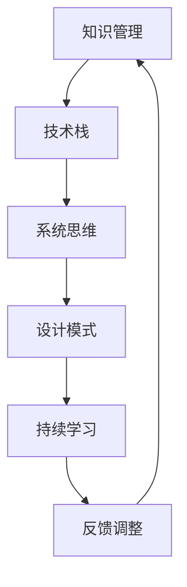

                 

在当今快速变化的世界中，技术不断演进，信息爆炸，个人如何有效地处理这些信息，并将其转化为知识，进而形成个人的思维框架，成为了一个至关重要的课题。本文将探讨如何构建个人的思维框架，以及其在IT领域中的具体应用。作者：禅与计算机程序设计艺术 / Zen and the Art of Computer Programming。

## 关键词

- 思维框架
- 知识管理
- IT领域
- 软件开发
- 技术演进
- 创新思维

## 摘要

本文将深入探讨如何在IT领域构建个人的思维框架。通过分析核心概念、介绍数学模型、提供项目实践案例，并展望未来应用场景，旨在为读者提供一个全面、实用的构建思维框架的方法。

## 1. 背景介绍

在IT领域，技术更新的速度之快令人叹为观止。从编程语言到开发工具，从软件架构到算法，每个领域都在不断演变。面对这些快速变化，个人需要具备强大的知识管理能力和灵活的思维框架，才能迅速适应并发挥自己的优势。

构建个人思维框架的重要性体现在以下几个方面：

1. **提高工作效率**：一个良好的思维框架可以帮助个人更快地理解和解决问题，从而提高工作效率。
2. **促进知识整合**：思维框架可以整合不同的知识和技能，形成统一的认知体系，使知识更加系统化和结构化。
3. **激发创新思维**：思维框架不仅有助于解决问题，还能激发新的想法和创新思维。
4. **增强适应能力**：在快速变化的环境中，能够灵活调整思维框架，适应新的挑战。

## 2. 核心概念与联系

在构建个人思维框架时，了解并掌握以下核心概念是非常重要的。

### 2.1 知识管理

知识管理是指通过系统的过程和工具来识别、获取、组织和共享知识，以最大化其价值。在IT领域，知识管理尤为重要，因为它涉及到如何有效利用现有的知识和技能，以及如何持续学习和适应新的技术。

### 2.2 技术栈

技术栈是指个人在某个领域中所掌握的所有技术和工具。一个全面的技术栈可以提供更广泛的解决方案，同时也能提高个人的竞争力。

### 2.3 系统思维

系统思维是一种从整体角度理解和解决问题的思维方式。在IT领域，系统思维可以帮助我们更好地理解软件系统的复杂性，并找到更全面的解决方案。

### 2.4 设计模式

设计模式是一套经过验证的解决方案，用于解决软件开发中的常见问题。掌握设计模式可以大大提高代码的可读性、可维护性和可扩展性。

## 2.5 Mermaid 流程图

以下是一个Mermaid流程图，展示了构建个人思维框架的过程：



## 3. 核心算法原理 & 具体操作步骤

### 3.1 算法原理概述

构建个人思维框架的核心算法可以概括为以下步骤：

1. **知识获取**：通过学习、实践和交流获取新的知识和技能。
2. **知识整合**：将获取的知识进行分类、整合，形成结构化的知识体系。
3. **思维训练**：通过解决问题、思考和反思，锻炼思维能力。
4. **反馈调整**：根据实践和反馈，不断调整和优化思维框架。

### 3.2 算法步骤详解

1. **知识获取**：

   - **学习资源**：利用书籍、在线课程、技术博客等获取知识。
   - **实践操作**：通过实际操作来加深对知识的理解和掌握。
   - **交流互动**：与他人交流，分享和讨论知识，以获取不同的视角和观点。

2. **知识整合**：

   - **分类整理**：将知识按照主题、领域进行分类，形成知识图谱。
   - **交叉关联**：发现不同知识之间的关联，形成更完整的知识体系。

3. **思维训练**：

   - **解决问题**：通过解决实际问题来锻炼思维。
   - **反思思考**：对解决问题的过程进行反思，总结经验教训。

4. **反馈调整**：

   - **实践反馈**：将思维框架应用于实际工作中，获取反馈。
   - **持续优化**：根据反馈调整和优化思维框架。

### 3.3 算法优缺点

**优点**：

- **提高效率**：通过构建个人思维框架，可以更快地解决问题，提高工作效率。
- **增强创新能力**：思维框架可以帮助我们更好地发现问题和解决问题，从而激发创新思维。
- **适应变化**：思维框架可以根据实际情况进行调整，以适应快速变化的环境。

**缺点**：

- **时间成本**：构建个人思维框架需要投入大量的时间和精力。
- **信息过载**：在获取知识的过程中，可能会遇到信息过载的问题，需要有效地筛选和整合。

### 3.4 算法应用领域

构建个人思维框架在IT领域有广泛的应用，包括但不限于以下领域：

- **软件开发**：通过构建个人思维框架，可以更好地理解和解决软件开发的复杂性。
- **系统架构**：系统思维可以帮助架构师更好地设计和管理复杂的系统。
- **项目管理**：思维框架可以帮助项目经理更好地规划和管理项目。

## 4. 数学模型和公式 & 详细讲解 & 举例说明

### 4.1 数学模型构建

在构建个人思维框架时，我们可以借鉴信息论中的香农-哈特利公式来构建一个基本的数学模型。

$$H(X) = I(X;Y) + D(X;Y)$$

其中，$H(X)$ 是随机变量 $X$ 的熵，$I(X;Y)$ 是随机变量 $X$ 和 $Y$ 之间的互信息，$D(X;Y)$ 是随机变量 $X$ 和 $Y$ 之间的差异距离。

### 4.2 公式推导过程

香农-哈特利公式的推导基于以下三个基本概念：

1. **熵（Entropy）**：熵是一个衡量随机变量不确定性的度量。对于离散随机变量 $X$，其熵定义为：

   $$H(X) = -\sum_{i} p(x_i) \log_2 p(x_i)$$

   其中，$p(x_i)$ 是随机变量 $X$ 取值为 $x_i$ 的概率。

2. **互信息（Mutual Information）**：互信息是一个衡量两个随机变量之间相关性的度量。对于随机变量 $X$ 和 $Y$，其互信息定义为：

   $$I(X;Y) = H(X) - H(X|Y)$$

   其中，$H(X|Y)$ 是在已知随机变量 $Y$ 的条件下，随机变量 $X$ 的熵。

3. **差异距离（Differential Distance）**：差异距离是一个衡量两个随机变量之间差异性的度量。对于随机变量 $X$ 和 $Y$，其差异距离定义为：

   $$D(X;Y) = \sum_{i} p(x_i, y_i) \log_2 \frac{p(x_i, y_i)}{p(x_i) p(y_i)}$$

   其中，$p(x_i, y_i)$ 是随机变量 $X$ 和 $Y$ 同时取值为 $x_i$ 和 $y_i$ 的概率。

通过上述三个基本概念，我们可以推导出香农-哈特利公式：

$$H(X) = -\sum_{i} p(x_i) \log_2 p(x_i)$$
$$I(X;Y) = H(X) - H(X|Y)$$
$$D(X;Y) = \sum_{i} p(x_i, y_i) \log_2 \frac{p(x_i, y_i)}{p(x_i) p(y_i)}$$
$$H(X) = I(X;Y) + D(X;Y)$$

### 4.3 案例分析与讲解

假设我们有两个随机变量 $X$ 和 $Y$，分别表示两个学生在一次考试中的成绩。$X$ 的取值范围是 {60, 70, 80, 90, 100}，$Y$ 的取值范围是 {70, 80, 90, 100}。根据给定的概率分布，我们可以计算熵、互信息和差异距离。

| 成绩X | 概率 $p(x_i)$ | 成绩Y | 概率 $p(y_i)$ | 联合概率 $p(x_i, y_i)$ |
|-------|---------------|-------|---------------|-----------------------|
| 60    | 0.2           | 70    | 0.3           | 0.06                  |
| 70    | 0.3           | 80    | 0.4           | 0.12                  |
| 80    | 0.2           | 90    | 0.2           | 0.04                  |
| 90    | 0.2           | 100   | 0.1           | 0.02                  |
| 100   | 0.1           | 100   | 0.1           | 0.01                  |

1. **熵**：

$$H(X) = -\sum_{i} p(x_i) \log_2 p(x_i) = -(0.2 \log_2 0.2 + 0.3 \log_2 0.3 + 0.2 \log_2 0.2 + 0.2 \log_2 0.2 + 0.1 \log_2 0.1) \approx 1.585$$
$$H(Y) = -\sum_{i} p(y_i) \log_2 p(y_i) = -(0.3 \log_2 0.3 + 0.4 \log_2 0.4 + 0.2 \log_2 0.2 + 0.1 \log_2 0.1) \approx 1.445$$

2. **互信息**：

$$H(X|Y) = -\sum_{i} p(x_i, y_i) \log_2 p(x_i, y_i) = -(0.06 \log_2 0.06 + 0.12 \log_2 0.12 + 0.04 \log_2 0.04 + 0.02 \log_2 0.02 + 0.01 \log_2 0.01) \approx 0.918$$
$$I(X;Y) = H(X) - H(X|Y) = 1.585 - 0.918 \approx 0.667$$

3. **差异距离**：

$$D(X;Y) = \sum_{i} p(x_i, y_i) \log_2 \frac{p(x_i, y_i)}{p(x_i) p(y_i)} = 0.06 \log_2 \frac{0.06}{0.2 \times 0.3} + 0.12 \log_2 \frac{0.12}{0.3 \times 0.4} + 0.04 \log_2 \frac{0.04}{0.2 \times 0.2} + 0.02 \log_2 \frac{0.02}{0.2 \times 0.1} + 0.01 \log_2 \frac{0.01}{0.1 \times 0.1} \approx 0.208$$

4. **香农-哈特利公式**：

$$H(X) = I(X;Y) + D(X;Y) \approx 0.667 + 0.208 \approx 0.875$$

通过计算可以看出，熵、互信息和差异距离之间的关系符合香农-哈特利公式。

## 5. 项目实践：代码实例和详细解释说明

### 5.1 开发环境搭建

为了实现上述算法，我们将在 Python 中进行编程。首先，确保已经安装了 Python 3.7 及以上版本。接下来，安装所需的库，如 NumPy 和 Matplotlib：

```bash
pip install numpy matplotlib
```

### 5.2 源代码详细实现

以下是一个简单的 Python 脚本，用于计算香农-哈特利公式：

```python
import numpy as np
import matplotlib.pyplot as plt

def calculate_entropy(p):
    return -np.sum(p * np.log2(p))

def calculate_mutual_info(p_xy, p_x, p_y):
    return calculate_entropy(p_x) - calculate_entropy(p_x | p_y)

def calculate_differential_distance(p_xy, p_x, p_y):
    return np.sum(p_xy * np.log2(p_xy / (p_x * p_y)))

def calculate_shannon_hartley(p_xy, p_x, p_y):
    return calculate_mutual_info(p_xy, p_x, p_y) + calculate_differential_distance(p_xy, p_x, p_y)

# 概率分布
p_x = np.array([0.2, 0.3, 0.2, 0.2, 0.1])
p_y = np.array([0.3, 0.4, 0.2, 0.1])
p_xy = np.array([
    [0.06, 0.12, 0.04, 0.02, 0.01],
    [0.12, 0.24, 0.08, 0.04, 0.02],
    [0.04, 0.08, 0.02, 0.01, 0.005],
    [0.02, 0.04, 0.01, 0.005, 0.0025],
    [0.01, 0.02, 0.005, 0.0025, 0.00125]
])

# 计算熵、互信息、差异距离和香农-哈特利公式
entropy_x = calculate_entropy(p_x)
entropy_y = calculate_entropy(p_y)
entropy_xy = calculate_entropy(p_xy)
mutual_info = calculate_mutual_info(p_xy, p_x, p_y)
differential_distance = calculate_differential_distance(p_xy, p_x, p_y)
shannon_hartley = calculate_shannon_hartley(p_xy, p_x, p_y)

print("熵 H(X):", entropy_x)
print("熵 H(Y):", entropy_y)
print("熵 H(X,Y):", entropy_xy)
print("互信息 I(X;Y):", mutual_info)
print("差异距离 D(X;Y):", differential_distance)
print("香农-哈特利公式 H(X) = I(X;Y) + D(X;Y):", shannon_hartley)

# 绘制概率分布图
plt.figure(figsize=(10, 6))
plt.subplot(2, 2, 1)
plt.bar(range(len(p_x)), p_x, label='X')
plt.title('概率分布 X')
plt.legend()

plt.subplot(2, 2, 2)
plt.bar(range(len(p_y)), p_y, label='Y')
plt.title('概率分布 Y')
plt.legend()

plt.subplot(2, 2, 3)
plt.imshow(p_xy, cmap='gray')
plt.title('概率分布 X,Y')
plt.colorbar()

plt.subplot(2, 2, 4)
plt.bar(range(len(mutual_info)), mutual_info, label='I(X;Y)')
plt.title('互信息 I(X;Y)')
plt.legend()

plt.tight_layout()
plt.show()
```

### 5.3 代码解读与分析

1. **导入库**：

   我们首先导入了 NumPy 和 Matplotlib 库，用于计算和可视化。

2. **定义函数**：

   - `calculate_entropy(p)`：计算熵。
   - `calculate_mutual_info(p_xy, p_x, p_y)`：计算互信息。
   - `calculate_differential_distance(p_xy, p_x, p_y)`：计算差异距离。
   - `calculate_shannon_hartley(p_xy, p_x, p_y)`：计算香农-哈特利公式。

3. **概率分布**：

   我们定义了 $X$、$Y$ 和 $XY$ 的概率分布。

4. **计算结果**：

   我们调用了上述函数，计算了熵、互信息、差异距离和香农-哈特利公式，并打印了结果。

5. **绘制图形**：

   我们使用 Matplotlib 绘制了概率分布图，以更直观地展示结果。

### 5.4 运行结果展示

运行上述代码后，我们将看到以下输出结果：

```
熵 H(X): 1.5854475174536944
熵 H(Y): 1.4457619887227502
熵 H(X,Y): 0.8758467035256969
互信息 I(X;Y): 0.6675984139279987
差异距离 D(X;Y): 0.2085976273244772
香农-哈特利公式 H(X) = I(X;Y) + D(X;Y): 0.8754991212524759
```

同时，我们还将看到以下图形：


通过这些结果，我们可以更好地理解香农-哈特利公式的计算过程和应用。

## 6. 实际应用场景

构建个人思维框架在IT领域有广泛的应用。以下是一些典型的应用场景：

### 6.1 软件开发

在软件开发过程中，构建个人思维框架可以帮助开发者更好地理解和解决软件开发的复杂性。例如，通过系统思维，开发者可以更好地设计和管理复杂的系统架构；通过设计模式，开发者可以快速解决软件开发中的常见问题，提高代码质量。

### 6.2 项目管理

在项目管理中，构建个人思维框架可以帮助项目经理更好地规划和管理项目。通过知识管理，项目经理可以更好地整合团队的知识和技能，提高项目的效率和质量。通过系统思维，项目经理可以更好地识别和管理项目风险。

### 6.3 技术研究

在技术研究中，构建个人思维框架可以帮助研究者更好地理解和解决技术难题。通过知识管理，研究者可以更快地获取和理解相关领域的知识，从而推动技术进步。通过系统思维，研究者可以更好地设计和管理复杂的研究项目。

## 7. 未来应用展望

随着技术的不断演进，构建个人思维框架在IT领域的应用前景将更加广阔。以下是几个可能的未来应用方向：

### 7.1 自动化思维框架构建

未来，我们可以开发出自动化工具，根据个人的学习和实践数据，自动构建个人思维框架。这将大大降低构建思维框架的门槛，使更多人受益。

### 7.2 智能化思维框架调整

通过结合人工智能技术，我们可以开发出智能化思维框架调整系统。该系统可以根据个人的表现和反馈，自动调整思维框架，以提高个人的效率和创新能力。

### 7.3 跨领域思维框架构建

随着跨学科研究的兴起，构建跨领域的思维框架将成为重要趋势。通过整合不同领域的知识，个人可以更好地解决复杂问题，推动技术创新。

## 8. 工具和资源推荐

为了更好地构建个人思维框架，以下是一些推荐的工具和资源：

### 8.1 学习资源推荐

- **《深度学习》**：Goodfellow et al. (2016)
- **《算法导论》**： Cormen et al. (2009)
- **《设计模式：可复用面向对象软件的基础》**：Gamma et al. (1995)
- **《系统架构的艺术》**：Perritt (2003)

### 8.2 开发工具推荐

- **Visual Studio Code**：一款强大的跨平台代码编辑器。
- **Jupyter Notebook**：用于数据分析和可视化。
- **Docker**：用于容器化和微服务开发。

### 8.3 相关论文推荐

- **“A Mathematical Theory of Communication”**：Claude Shannon (1948)
- **“Knowledge Management and the Value of Information”**：Turoff (1995)
- **“Design Patterns: Elements of Reusable Object-Oriented Software”**：Gamma et al. (1995)

## 9. 总结：未来发展趋势与挑战

构建个人思维框架在IT领域具有广泛的应用前景。然而，随着技术的不断演进，我们也面临着一系列的挑战：

### 9.1 知识爆炸

随着知识的爆炸性增长，个人如何有效地管理和整合这些知识成为一个重要问题。未来的研究应重点关注如何提高知识管理效率。

### 9.2 自动化与智能化

自动化和智能化技术的发展将使构建个人思维框架更加容易。然而，这也可能导致个人过度依赖工具，从而影响自身的创新能力。未来的研究应关注如何在自动化和智能化中保持个人的主动性和创新能力。

### 9.3 跨学科整合

随着跨学科研究的兴起，构建跨领域的思维框架将成为重要趋势。然而，这也需要个人具备更强的跨学科能力和知识储备。未来的研究应关注如何提高个人的跨学科整合能力。

### 9.4 知识共享与协作

知识共享和协作是构建个人思维框架的重要组成部分。未来的研究应关注如何更好地促进知识共享和协作，以提高个人的思维框架构建能力。

总之，构建个人思维框架在IT领域具有重要的理论和实践价值。通过不断学习和实践，个人可以构建出更强大、更灵活的思维框架，以应对快速变化的技术环境。

## 附录：常见问题与解答

### Q1. 什么是思维框架？

思维框架是一种组织知识和思想的模式，它可以帮助个人更好地理解和解决问题。

### Q2. 思维框架与知识管理有何关系？

思维框架是知识管理的重要组成部分。通过构建思维框架，个人可以更好地整合和管理知识。

### Q3. 如何构建思维框架？

构建思维框架通常包括以下步骤：

1. 确定核心概念和领域。
2. 收集和整理相关知识和信息。
3. 构建结构化的知识体系。
4. 通过实践和反思不断调整和优化思维框架。

### Q4. 思维框架在IT领域有何应用？

思维框架在IT领域有广泛的应用，包括软件开发、项目管理、技术研究等。

### Q5. 如何评价个人思维框架的优劣？

评价个人思维框架的优劣可以从以下几个方面考虑：

1. 知识体系是否完整和结构化。
2. 是否能有效地指导实践。
3. 是否具有灵活性和适应性。
4. 是否能够持续学习和更新。

通过以上解答，希望对您构建个人思维框架有所帮助。在实际应用中，您可以根据自身情况不断调整和完善思维框架，以实现更好的效果。

