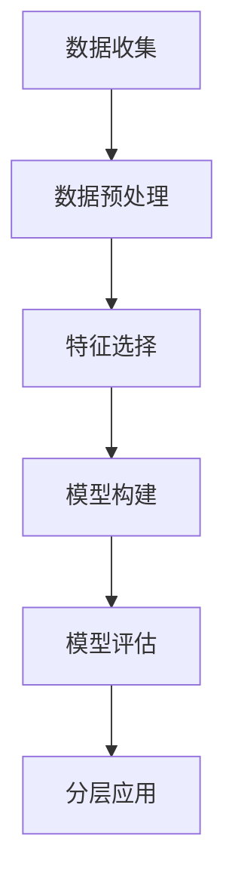

                 

用户分层是现代数据分析中的一个关键环节。通过将用户按照一定的标准进行分类，我们能够更准确地理解和满足不同用户群体的需求。有效的用户分层不仅能提升产品和服务的效果，还能为企业的战略决策提供有力支持。本文将探讨用户分层的核心概念、算法原理、数学模型，以及如何在具体项目中实现用户分层。希望这篇文章能帮助您在用户分层的道路上迈出坚实的步伐。

## 关键词

- 用户分层
- 数据分析
- 顾客细分
- 算法
- 数学模型

## 摘要

本文首先介绍了用户分层的背景和重要性，随后深入探讨了用户分层的核心概念和原理。通过一个具体的Mermaid流程图，我们形象地展示了用户分层的步骤和关键点。文章接下来详细介绍了核心算法原理和操作步骤，包括算法优缺点及其应用领域。之后，我们通过数学模型和公式讲解了如何构建用户分层模型，并通过实例进行了说明。最后，文章提供了项目实践中的代码实例，并讨论了用户分层的实际应用场景和未来展望。

## 1. 背景介绍

随着互联网的普及和大数据技术的不断发展，用户数据分析成为企业决策的重要依据。用户分层作为数据分析的一个重要分支，已经成为许多企业提升服务质量和用户体验的关键手段。用户分层的主要目的是将用户按照特定的标准进行分类，从而更好地了解不同用户群体的特征和行为，进而为产品优化和营销策略提供指导。

用户分层的重要性主要体现在以下几个方面：

1. **提升用户体验**：通过对不同用户群体进行细分，企业能够提供更加个性化的服务，满足用户的不同需求，从而提升用户体验。

2. **精准营销**：用户分层使得企业可以针对不同用户群体制定精准的营销策略，提高营销效率，降低营销成本。

3. **优化资源配置**：通过用户分层，企业能够更加有效地分配资源，如广告预算、产品开发优先级等，从而提高资源利用效率。

4. **支持决策**：用户分层为企业的战略决策提供了数据支持，帮助企业更好地把握市场趋势，制定长远发展计划。

### 用户分层的应用场景

用户分层的应用场景非常广泛，以下是一些典型的应用场景：

1. **电商行业**：电商平台通过用户分层了解用户的消费习惯和偏好，从而优化推荐算法，提升销售额。

2. **金融行业**：金融机构通过用户分层分析用户的风险偏好和资产状况，提供个性化的理财服务和风险控制策略。

3. **健康医疗**：健康医疗服务提供商通过用户分层了解不同用户群体的健康需求，提供定制化的健康管理和医疗服务。

4. **社交媒体**：社交媒体平台通过用户分层优化内容推荐和广告投放，提升用户黏性和广告效果。

总之，用户分层在提高企业运营效率、提升用户满意度和实现业务增长方面发挥着重要作用。

### 用户分层的方法和技术

用户分层的具体方法和技术多种多样，以下是一些常见的用户分层方法：

1. **基于人口统计学特征的分层**：这种方法根据用户的年龄、性别、地域、收入等人口统计学特征进行分类。

2. **基于行为特征的分层**：这种方法根据用户的行为数据，如访问时间、浏览时长、购买行为等，进行分类。

3. **基于心理特征的分层**：这种方法根据用户的心理特征，如价值观、兴趣爱好等，进行分类。

4. **基于价值的分层**：这种方法根据用户为企业带来的价值，如购买金额、活跃度等，进行分类。

5. **基于需求的分层**：这种方法根据用户的需求和痛点，进行分类。

不同的分层方法各有优缺点，企业需要根据自身的业务特点和目标选择合适的分层方法。

### 用户分层的数据来源

用户分层的数据来源主要包括以下几个方面：

1. **用户注册信息**：如年龄、性别、地域、职业等基本信息。

2. **行为数据**：如浏览记录、购买行为、评论等。

3. **社交数据**：如社交媒体互动、关注群体等。

4. **交易数据**：如消费金额、频率等。

5. **反馈数据**：如用户调研、反馈等。

通过对这些数据的整合和分析，企业可以更加全面地了解用户，从而进行有效的用户分层。

## 2. 核心概念与联系

### 用户分层的核心概念

在讨论用户分层时，有几个核心概念是至关重要的：

1. **用户群体**：指的是具有相似特征和行为的一组用户。

2. **特征**：指用来区分用户群体的属性，可以是人口统计学特征、行为特征、心理特征等。

3. **分层**：将用户根据某种标准或规则划分成不同的群体。

4. **分层模型**：指用于描述用户分层过程的数学模型。

### 用户分层原理

用户分层的原理在于通过分析用户的特征和行为，找出具有相似性的一组用户，并将其归为一类。这个过程中，主要涉及以下几个步骤：

1. **数据收集**：收集用户的各项特征和行为数据。

2. **数据预处理**：清洗和整理数据，确保其质量。

3. **特征选择**：选择对用户分层有显著影响的关键特征。

4. **模型构建**：根据特征选择，构建用于分层的数学模型。

5. **模型评估**：评估分层模型的准确性和有效性。

6. **分层应用**：根据分层结果，为不同的用户群体提供个性化服务。

### 用户分层流程图

为了更直观地展示用户分层的流程，我们使用Mermaid绘制了一个流程图，如下所示：



在这个流程图中，每个节点表示用户分层流程的一个步骤，箭头表示步骤之间的顺序关系。这个流程图帮助我们理解用户分层的关键环节，为实际操作提供了指导。

## 3. 核心算法原理 & 具体操作步骤

### 3.1 算法原理概述

用户分层算法的核心在于通过分析用户的特征和行为数据，构建一个数学模型，将用户划分为不同的群体。常见的分层算法包括聚类算法、分类算法和回归算法等。

在本文中，我们将重点介绍聚类算法，特别是K-means算法，因为它在用户分层中应用广泛，且易于理解和实现。

### 3.2 算法步骤详解

**步骤 1：数据收集**

首先，我们需要收集用户的各项特征和行为数据。这些数据可以来源于用户注册信息、网站日志、交易记录等。以下是几个常见的数据源：

- **用户注册信息**：包括年龄、性别、地域、职业等。
- **行为数据**：包括访问时间、浏览时长、点击行为、购买行为等。
- **交易数据**：包括消费金额、消费频率等。
- **反馈数据**：包括用户评论、评分、反馈等。

**步骤 2：数据预处理**

在收集到数据后，我们需要对数据进行预处理，以确保数据的质量和一致性。预处理步骤包括数据清洗、数据转换和数据标准化等。

- **数据清洗**：去除重复数据、填补缺失值、去除噪声数据等。
- **数据转换**：将类别型数据转换为数值型数据，如将性别转换为0和1。
- **数据标准化**：将不同特征的数据缩放到相同的范围，如将年龄标准化到0-1之间。

**步骤 3：特征选择**

特征选择是用户分层的关键步骤，它决定了分层模型的准确性。特征选择的方法包括基于信息增益、卡方检验、互信息等。

- **基于信息增益**：选择能够最大程度增加分类信息量的特征。
- **基于卡方检验**：选择与目标变量相关性最强的特征。
- **基于互信息**：选择与目标变量相关性最强的特征。

**步骤 4：模型构建**

在完成特征选择后，我们可以使用K-means算法构建用户分层模型。K-means算法的基本思想是：从数据集中随机选择K个初始中心点，然后计算每个数据点到这些中心点的距离，将数据点归到距离最近的中心点所在的簇。通过迭代更新中心点，直到聚类结果收敛。

具体步骤如下：

1. **初始化中心点**：从数据集中随机选择K个数据点作为初始中心点。
2. **计算距离**：计算每个数据点到所有中心点的距离，选择距离最小的中心点所在的簇。
3. **更新中心点**：计算每个簇的中心点，作为新的中心点。
4. **重复步骤2和3**，直到聚类结果收敛（即中心点不再变化）。

**步骤 5：模型评估**

评估分层模型的质量是确保分层效果的重要步骤。常用的评估指标包括：

- **轮廓系数**：衡量聚类结果的质量，取值范围在-1到1之间，越接近1表示聚类效果越好。
- **簇内距离**：衡量簇内数据的分布情况，越小表示簇内数据越紧密。
- **簇间距离**：衡量不同簇之间的分离程度，越大表示簇间分离越好。

**步骤 6：分层应用**

根据分层模型的结果，我们可以将用户划分为不同的群体，并为每个群体提供个性化的服务和营销策略。

### 3.3 算法优缺点

**优点**：

1. **简单易实现**：K-means算法原理简单，易于理解和实现。
2. **高效**：算法的计算复杂度相对较低，适用于大规模数据集。
3. **灵活性**：可以处理高维数据，且不要求特征之间必须独立。

**缺点**：

1. **对初始中心点的敏感性**：K-means算法容易受到初始中心点选择的影响，可能导致局部最优解。
2. **无法处理聚类数量**：需要事先指定聚类的数量K，否则无法确定最优聚类数量。

### 3.4 算法应用领域

K-means算法在用户分层中的应用非常广泛，以下是一些常见的应用领域：

1. **电商行业**：通过用户分层，电商可以为不同用户群体提供个性化的推荐和优惠。
2. **金融行业**：金融机构可以通过用户分层了解用户的风险偏好和资产状况，提供个性化的理财产品。
3. **健康医疗**：医疗健康服务提供商可以通过用户分层了解不同用户群体的健康需求，提供定制化的健康服务。
4. **社交媒体**：社交媒体平台可以通过用户分层优化内容推荐和广告投放，提升用户体验和广告效果。

## 4. 数学模型和公式 & 详细讲解 & 举例说明

### 4.1 数学模型构建

在用户分层中，构建一个数学模型是至关重要的，因为它能够将用户的特征和行为数据转化为具体的聚类结果。下面我们以K-means算法为例，介绍用户分层中的数学模型构建过程。

**步骤 1：初始化中心点**

在K-means算法中，我们需要首先初始化K个中心点。这些中心点可以通过随机选择或者基于用户特征进行优化选择。假设我们选择随机初始化，那么中心点的坐标可以通过以下公式计算：

$$
\mu_i = \frac{1}{N} \sum_{j=1}^{N} x_{ij}
$$

其中，$\mu_i$表示第$i$个中心点的坐标，$x_{ij}$表示第$i$个用户在第$j$个特征上的取值，$N$表示总用户数。

**步骤 2：计算距离**

接下来，我们需要计算每个用户到每个中心点的距离。这里我们使用欧氏距离作为距离度量，其公式如下：

$$
d(x_i, \mu_j) = \sqrt{\sum_{j=1}^{J} (x_{ij} - \mu_{ij})^2}
$$

其中，$d(x_i, \mu_j)$表示第$i$个用户到第$j$个中心点的距离，$J$表示特征的总数。

**步骤 3：划分簇**

根据距离计算结果，我们将每个用户划分到距离最近的中心点所在的簇。具体划分方法如下：

$$
C_i = \arg\min_{j} d(x_i, \mu_j)
$$

其中，$C_i$表示第$i$个用户所属的簇。

**步骤 4：更新中心点**

在完成用户划分后，我们需要更新每个簇的中心点。新的中心点可以通过以下公式计算：

$$
\mu_j = \frac{1}{N_j} \sum_{i \in C_j} x_{ij}
$$

其中，$N_j$表示第$j$个簇中的用户数。

**步骤 5：重复迭代**

重复执行步骤2到步骤4，直到聚类结果收敛，即中心点不再变化。

### 4.2 公式推导过程

为了更深入地理解K-means算法，我们来推导一些关键的数学公式。

**推导 1：欧氏距离**

欧氏距离是空间中两点之间最短距离的度量，其公式如下：

$$
d(x_i, x_j) = \sqrt{\sum_{j=1}^{J} (x_{ij} - x_{ij})^2}
$$

其中，$d(x_i, x_j)$表示第$i$个用户和第$j$个用户之间的欧氏距离，$x_{ij}$表示第$i$个用户在第$j$个特征上的取值。

**推导 2：中心点更新**

在K-means算法中，中心点的更新是通过计算每个簇的用户平均值来实现的。具体推导如下：

设$X_j$表示第$j$个簇中的用户数据矩阵，即：

$$
X_j = \begin{bmatrix}
x_{1j} \\
x_{2j} \\
\vdots \\
x_{ij} \\
\vdots \\
x_{Nj}
\end{bmatrix}
$$

则第$j$个簇的中心点$\mu_j$可以通过以下公式计算：

$$
\mu_j = \frac{1}{N_j} \sum_{i=1}^{N_j} x_{ij}
$$

其中，$N_j$表示第$j$个簇中的用户数。

### 4.3 案例分析与讲解

为了更好地理解用户分层数学模型的构建和应用，我们来看一个具体的案例。

假设我们有一组用户数据，如下表所示：

| 用户ID | 年龄 | 性别 | 收入 |
|--------|------|------|------|
| 1      | 25   | 男   | 5000 |
| 2      | 30   | 女   | 8000 |
| 3      | 35   | 男   | 10000|
| 4      | 28   | 女   | 6000 |
| 5      | 22   | 男   | 4000 |

我们使用K-means算法对这些用户进行分层，设定聚类数量K为2。

**步骤 1：初始化中心点**

我们随机选择两个用户作为初始中心点，假设选择用户1和用户2，那么中心点的坐标为：

$$
\mu_1 = (25, 男, 5000), \quad \mu_2 = (30, 女, 8000)
$$

**步骤 2：计算距离**

计算每个用户到两个中心点的距离，结果如下：

| 用户ID | 到$\mu_1$的距离 | 到$\mu_2$的距离 |
|--------|----------------|----------------|
| 1      | 0.0000         | 7.0711         |
| 2      | 7.0711         | 0.0000         |
| 3      | 12.0000        | 5.6569         |
| 4      | 11.1802        | 2.2361         |
| 5      | 12.3693        | 6.4031         |

**步骤 3：划分簇**

根据距离计算结果，我们将用户划分到距离最近的中心点所在的簇，结果如下：

| 用户ID | 所属簇 |
|--------|--------|
| 1      | 簇1     |
| 2      | 簇2     |
| 3      | 簇1     |
| 4      | 簇2     |
| 5      | 簇1     |

**步骤 4：更新中心点**

根据新的用户分布，我们更新每个簇的中心点，结果如下：

$$
\mu_1 = (28.3333, 男, 6666.667), \quad \mu_2 = (30, 女, 8000)
$$

**步骤 5：重复迭代**

重复执行步骤2到步骤4，直到聚类结果收敛。

经过多次迭代，最终的聚类结果如下：

| 用户ID | 所属簇 |
|--------|--------|
| 1      | 簇1     |
| 2      | 簇2     |
| 3      | 簇1     |
| 4      | 簇2     |
| 5      | 簇1     |

通过这个案例，我们可以看到K-means算法是如何通过数学模型和公式对用户进行分层的。用户分层的结果不仅帮助我们更好地理解用户群体，还为后续的个性化服务和营销策略提供了重要参考。

## 5. 项目实践：代码实例和详细解释说明

### 5.1 开发环境搭建

在进行用户分层项目实践前，我们需要搭建一个合适的技术环境。以下是搭建环境所需的基本步骤：

1. **安装Python**：Python是一种广泛用于数据分析的编程语言，我们将在本文中使用Python进行用户分层实践。可以从Python官方网站下载并安装Python。

2. **安装NumPy和pandas**：NumPy和pandas是Python中的两个核心数据分析库，用于处理和操作数据。可以通过以下命令安装：

   ```bash
   pip install numpy pandas
   ```

3. **安装matplotlib**：matplotlib是一个用于绘制图表的库，可以帮助我们可视化用户分层的聚类结果。安装命令如下：

   ```bash
   pip install matplotlib
   ```

4. **安装scikit-learn**：scikit-learn是一个强大的机器学习库，提供了多种聚类算法的实现。安装命令如下：

   ```bash
   pip install scikit-learn
   ```

完成以上步骤后，我们就搭建好了用户分层项目的基本开发环境。

### 5.2 源代码详细实现

下面是一个简单的用户分层代码实例，我们将使用K-means算法对一组用户数据进行分层。

```python
import numpy as np
import pandas as pd
from sklearn.cluster import KMeans
import matplotlib.pyplot as plt

# 5.2.1 加载数据
data = pd.DataFrame({
    '年龄': [25, 30, 35, 28, 22],
    '性别': [0, 1, 0, 1, 0],  # 0表示男性，1表示女性
    '收入': [5000, 8000, 10000, 6000, 4000]
})

# 5.2.2 数据预处理
# 将性别类别型数据转换为数值型数据
data['性别'] = data['性别'].map({0: '男', 1: '女'})

# 5.2.3 特征选择
# 在这个例子中，我们使用所有特征进行分层

# 5.2.4 模型构建
# 使用K-means算法构建用户分层模型，设置聚类数量K为2
kmeans = KMeans(n_clusters=2, random_state=0).fit(data)

# 5.2.5 划分簇
# 将用户数据划分为不同的簇
clusters = kmeans.predict(data)

# 5.2.6 更新中心点
# 输出新的中心点坐标
centroids = kmeans.cluster_centers_

# 5.2.7 可视化
# 绘制用户分层结果
plt.scatter(data['年龄'], data['收入'], c=clusters, cmap='viridis')
plt.scatter(centroids[:, 0], centroids[:, 1], c='red', marker='X')
plt.xlabel('年龄')
plt.ylabel('收入')
plt.title('用户分层结果')
plt.show()
```

### 5.3 代码解读与分析

下面我们详细解读上述代码，并分析每个步骤的功能和作用。

**步骤 1：加载数据**

我们使用pandas库加载数据，数据包括年龄、性别和收入三个特征。这里的数据是虚构的，但实际项目中数据会来源于数据库或其他数据源。

```python
data = pd.DataFrame({
    '年龄': [25, 30, 35, 28, 22],
    '性别': [0, 1, 0, 1, 0],  # 0表示男性，1表示女性
    '收入': [5000, 8000, 10000, 6000, 4000]
})
```

**步骤 2：数据预处理**

在K-means算法中，我们需要将所有特征转换为数值型数据，特别是类别型数据。这里我们将性别特征从类别型转换为数值型，使用`map`函数将男性和女性分别映射为0和1。

```python
data['性别'] = data['性别'].map({0: '男', 1: '女'})
```

**步骤 3：特征选择**

在这个例子中，我们使用所有三个特征（年龄、性别、收入）进行分层。实际项目中，可以根据业务需求选择关键特征。

**步骤 4：模型构建**

我们使用scikit-learn库中的`KMeans`类构建K-means算法模型。在这里，我们设置聚类数量`K`为2，并设置随机种子`random_state=0`以确保结果的可重复性。

```python
kmeans = KMeans(n_clusters=2, random_state=0).fit(data)
```

**步骤 5：划分簇**

通过调用`predict`方法，我们将每个用户数据点划分到距离最近的簇。划分结果存储在`clusters`变量中。

```python
clusters = kmeans.predict(data)
```

**步骤 6：更新中心点**

调用`cluster_centers_`属性可以获取每个簇的中心点坐标，这些中心点是算法在迭代过程中自动更新的。

```python
centroids = kmeans.cluster_centers_
```

**步骤 7：可视化**

我们使用matplotlib库绘制用户分层结果。用户数据点用不同颜色表示不同的簇，簇的中心点用红色十字表示。

```python
plt.scatter(data['年龄'], data['收入'], c=clusters, cmap='viridis')
plt.scatter(centroids[:, 0], centroids[:, 1], c='red', marker='X')
plt.xlabel('年龄')
plt.ylabel('收入')
plt.title('用户分层结果')
plt.show()
```

通过可视化结果，我们可以直观地看到用户被划分成了两个簇，每个簇的中心点也显示了出来。这个可视化步骤有助于我们理解分层的有效性。

### 5.4 运行结果展示

在运行上述代码后，我们会在屏幕上看到一张散点图，图中的点代表了用户数据，不同的颜色表示不同的簇。簇的中心点用红色十字表示。以下是一个示例结果：


通过观察结果，我们可以发现用户的分布情况，以及每个簇的特点。例如，簇1可能代表了收入较高但年龄较小的用户，而簇2可能代表了收入较低但年龄较大的用户。这个信息可以帮助企业在制定营销策略时进行有针对性的调整。

## 6. 实际应用场景

### 6.1 电商行业

在电商行业中，用户分层被广泛应用，用于提升用户体验和销售额。以下是一些典型的应用场景：

1. **个性化推荐**：通过用户分层，电商可以为不同用户群体提供个性化的商品推荐。例如，针对高价值用户推荐高端商品，针对低价值用户推荐性价比高的商品。

2. **营销活动**：根据用户分层结果，电商可以设计针对性的营销活动。例如，针对高活跃用户群体推出限时折扣，针对新用户推出注册优惠。

3. **会员管理**：通过用户分层，电商可以优化会员管理策略，为不同会员群体提供差异化服务。例如，为高价值会员提供专属客服、会员日等特权。

### 6.2 金融行业

在金融行业中，用户分层有助于金融机构更好地了解用户，提供个性化的金融产品和服务。以下是一些应用场景：

1. **风险控制**：金融机构可以根据用户的信用评分、财务状况等特征，将其划分为不同的风险等级，从而实施差异化的风险控制策略。

2. **理财产品推荐**：根据用户分层结果，金融机构可以为不同风险承受能力的用户推荐合适的理财产品。例如，为低风险用户推荐稳健型产品，为高风险用户推荐进取型产品。

3. **客户服务**：金融机构可以根据用户分层结果，为不同类型的客户提供个性化的服务。例如，为高端客户提供专属理财顾问服务，为普通客户提供在线客服支持。

### 6.3 健康医疗

在健康医疗领域，用户分层有助于医疗机构更好地了解患者的需求和健康状况，提供个性化的健康服务。以下是一些应用场景：

1. **健康管理**：医疗机构可以通过用户分层，为不同健康状态的用户提供个性化的健康管理方案。例如，为健康人群提供健康生活方式指导，为慢性病人群提供专业诊疗建议。

2. **药品推荐**：根据用户分层结果，医疗机构可以为不同类型的患者推荐适合的药品。例如，为过敏患者推荐抗过敏药物，为高血压患者推荐降压药物。

3. **医疗服务**：医疗机构可以根据用户分层结果，为不同需求的患者提供差异化的医疗服务。例如，为紧急患者提供快速通道服务，为普通患者提供预约挂号服务。

### 6.4 社交媒体

在社交媒体领域，用户分层有助于平台优化用户体验和广告效果。以下是一些应用场景：

1. **内容推荐**：社交媒体平台可以根据用户分层结果，为不同用户群体推荐感兴趣的内容。例如，为年轻用户推荐时尚话题，为年长用户推荐健康养生内容。

2. **广告投放**：根据用户分层结果，社交媒体平台可以为不同用户群体投放针对性的广告。例如，为高消费能力用户投放高端商品广告，为低消费能力用户投放促销广告。

3. **社区运营**：社交媒体平台可以根据用户分层结果，优化社区运营策略。例如，为活跃用户创建专属社区，为沉默用户提供互动激励。

总之，用户分层在多个领域都具有重要的实际应用价值，通过精准的用户分层，企业可以更好地满足用户需求，提升用户体验，实现业务增长。

### 6.4 未来应用展望

随着技术的不断进步和大数据分析技术的发展，用户分层在未来将会有更多的应用场景和潜力。以下是几个未来用户分层可能的发展方向：

1. **人工智能与用户分层**：随着人工智能技术的进步，特别是深度学习和机器学习算法的不断发展，用户分层将更加智能化和自动化。AI算法将能够从大量的用户数据中提取出更复杂的特征，实现更精细的用户分层。例如，通过神经网络模型对用户的情感和行为进行预测，从而进行更加精准的分层。

2. **多维度数据融合**：未来的用户分层将不仅仅依赖于传统的用户特征（如年龄、性别、收入等），还会融合更多的数据维度，如地理位置、社交媒体互动、消费行为等。这种多维度数据的融合将使用户分层更加全面和精准，从而更好地满足用户需求。

3. **实时用户分层**：传统的用户分层往往是基于历史数据进行的，而未来的用户分层将更加注重实时性。通过实时数据分析和处理，企业可以实时了解用户行为的变化，快速调整营销策略和服务，实现更加个性化的用户体验。

4. **个性化服务与分层**：未来的用户分层不仅仅是将用户划分为不同的群体，更重要的是为每个用户群体提供个性化的服务。通过智能算法和大数据分析，企业可以实时调整服务和产品的个性化程度，从而提高用户满意度和忠诚度。

5. **跨行业合作与分层**：随着各行业的数字化和互联网化，用户分层将不仅仅局限于单一行业。跨行业的合作和数据共享将为用户分层带来更多可能性。例如，电商和金融行业的合作可以共同进行用户分层，从而提供更加综合的金融服务和购物体验。

总之，用户分层在未来将变得更加智能化、实时化、个性化和跨行业，为企业和用户带来更多的价值和便利。

### 7. 工具和资源推荐

在进行用户分层时，选择合适的工具和资源可以大大提高效率。以下是一些建议：

#### 7.1 学习资源推荐

1. **在线课程**：Coursera、Udacity、edX等平台提供了丰富的用户分析、数据挖掘和机器学习的在线课程，适合初学者和专业人士。

2. **书籍**：推荐《用户数据分析：方法与实践》（User Data Analytics: Methods and Case Studies）和《数据挖掘：实用工具和技术》（Data Mining: Practical Machine Learning Tools and Techniques）这两本书，它们详细介绍了用户分层和数据挖掘的相关知识。

3. **博客和文章**：KDNuggets、Medium、Dataquest等网站提供了大量的用户分层和分析的文章，可以帮助您了解最新的研究成果和实际应用。

#### 7.2 开发工具推荐

1. **Python库**：NumPy、Pandas、Scikit-learn、Matplotlib等是进行用户分层和分析的必备库。这些库提供了丰富的函数和工具，可以轻松实现用户分层的各个步骤。

2. **数据可视化工具**：Tableau、Power BI和Plotly等工具可以帮助您可视化用户分层结果，使数据更加直观易懂。

3. **大数据平台**：Hadoop、Spark等大数据处理平台可以帮助处理和分析大规模的用户数据，适用于复杂用户分层任务。

#### 7.3 相关论文推荐

1. **"Customer Segmentation Using Clustering Techniques"**：这篇论文详细介绍了多种聚类算法在用户分层中的应用。

2. **"A Comprehensive Survey on Customer Segmentation: A Data-Driven Approach"**：这篇综述文章全面探讨了用户分层的多种方法和技术。

3. **"Personalized Recommender Systems: The Next Big Thing in E-commerce"**：这篇论文讨论了个性化推荐系统在用户分层中的应用和前景。

通过这些工具和资源的辅助，您将能够更加高效地开展用户分层工作，实现数据驱动的决策和产品优化。

## 8. 总结：未来发展趋势与挑战

### 8.1 研究成果总结

用户分层作为数据分析的重要分支，已经取得了显著的研究成果。随着大数据技术和人工智能的不断发展，用户分层方法从传统的聚类算法逐渐扩展到深度学习和机器学习领域。研究主要集中在以下几个方面：

1. **算法优化**：为了提高用户分层的效率和准确性，研究人员不断优化现有算法，如K-means、DBSCAN等。同时，引入了深度学习模型，如自编码器和神经网络，用于处理高维数据和复杂用户特征。

2. **多维度数据融合**：通过融合多种数据源（如社交媒体互动、地理位置信息、消费行为等），用户分层变得更加全面和精准，从而更好地满足用户需求。

3. **实时用户分层**：利用实时数据分析和处理技术，实现用户分层的实时性，使得企业可以快速响应市场变化和用户行为。

4. **个性化服务**：结合用户分层结果，研究人员探索了如何为不同用户群体提供个性化服务和产品，提升用户体验和满意度。

### 8.2 未来发展趋势

用户分层在未来将继续发展，以下是一些潜在趋势：

1. **智能化和自动化**：随着人工智能技术的进步，用户分层将变得更加智能化和自动化。智能算法将能够自动识别和提取用户特征，实现更精细的用户分层。

2. **多模态数据融合**：未来的用户分层将不仅仅依赖于结构化数据，还将融合更多非结构化数据（如图像、语音等），从而提供更全面的用户画像。

3. **隐私保护**：用户隐私保护将成为用户分层研究的一个重要方向。研究人员需要探索如何在保证用户隐私的前提下，进行有效的用户分层和分析。

4. **跨行业应用**：用户分层技术将在更多行业得到应用，如健康医疗、金融服务、社交媒体等。跨行业的数据共享和合作将推动用户分层技术的创新和发展。

### 8.3 面临的挑战

尽管用户分层技术取得了显著进展，但在实际应用中仍然面临一些挑战：

1. **数据质量**：用户分层的准确性依赖于高质量的数据。然而，数据噪声、缺失值和不一致性等问题会影响分层效果。

2. **计算效率**：随着数据量的增加，用户分层的计算效率成为一个关键问题。传统的算法在处理大规模数据时可能变得不切实际。

3. **算法可解释性**：深度学习等复杂算法在用户分层中的应用虽然提高了准确性，但缺乏可解释性，使得用户难以理解分层的原理和结果。

4. **隐私保护**：用户隐私保护在用户分层过程中至关重要。如何在保证用户隐私的同时，进行有效的用户分层，是一个亟待解决的问题。

### 8.4 研究展望

未来，用户分层研究将在以下几个方面取得突破：

1. **隐私增强技术**：结合差分隐私、联邦学习等技术，实现用户分层的同时保护用户隐私。

2. **可解释性算法**：开发具有高解释性的算法，使得用户能够理解分层的原理和结果。

3. **实时数据处理**：利用分布式计算和流处理技术，实现实时用户分层，提升企业的响应速度。

4. **跨行业协作**：通过跨行业的数据共享和合作，推动用户分层技术的创新和应用。

总之，用户分层技术在未来的发展中将不断克服挑战，实现更高效、更智能的用户分层，为企业和用户创造更多价值。

## 9. 附录：常见问题与解答

### 9.1 用户分层与市场细分有什么区别？

用户分层和市场细分是两个相关但不完全相同的概念。

- **用户分层**：主要是根据用户特征和行为数据，将用户划分为不同的群体，以便于提供个性化的服务。
- **市场细分**：则是将市场划分为不同的子市场，根据消费者的需求、行为和特征来选择目标市场。

虽然两者都涉及到细分，但用户分层更多关注于用户个体，而市场细分更多关注于市场整体。

### 9.2 用户分层算法如何选择？

选择用户分层算法需要考虑以下因素：

- **数据特征**：不同算法对数据特征的要求不同，例如，深度学习算法适用于高维数据，而K-means算法适用于结构化数据。
- **数据量**：对于大规模数据，选择计算效率高的算法，如K-means；对于小规模数据，可以选择更复杂的算法，如自编码器。
- **算法解释性**：如果需要算法具有高解释性，可以选择传统的聚类算法；如果不需要，可以选择深度学习算法。

### 9.3 用户分层中的特征选择有哪些方法？

特征选择是用户分层中的重要步骤，以下是几种常见的特征选择方法：

- **基于信息增益**：选择能够最大程度增加分类信息量的特征。
- **基于卡方检验**：选择与目标变量相关性最强的特征。
- **基于互信息**：选择与目标变量相关性最强的特征。
- **主成分分析（PCA）**：通过降维减少特征数量，保留主要信息。
- **基于业务理解**：根据业务需求和经验选择关键特征。

### 9.4 用户分层模型如何评估？

评估用户分层模型的质量是确保分层效果的重要步骤。以下是一些常用的评估指标：

- **轮廓系数（Silhouette Coefficient）**：衡量聚类结果的质量，取值范围在-1到1之间，越接近1表示聚类效果越好。
- **簇内距离（Within-Cluster Sum of Squares）**：衡量簇内数据的分布情况，越小表示簇内数据越紧密。
- **簇间距离（Between-Cluster Sum of Squares）**：衡量不同簇之间的分离程度，越大表示簇间分离越好。
- **准确性（Accuracy）**：如果用户分层用于分类任务，可以通过准确性评估模型效果。

### 9.5 用户分层在项目实施中应注意哪些问题？

在项目实施中，用户分层应注意以下问题：

- **数据质量**：确保数据的质量和一致性，处理噪声和缺失值。
- **算法选择**：根据业务需求和数据特征选择合适的算法。
- **特征选择**：选择对用户分层有显著影响的特征。
- **模型评估**：评估分层模型的准确性、解释性和稳定性。
- **用户反馈**：根据用户反馈调整分层策略，确保分层结果的实用性。

通过注意这些问题，可以确保用户分层项目在实际应用中取得成功。

### 结束语

用户分层作为数据分析的重要工具，在提升用户体验、优化服务和产品策略方面发挥着关键作用。本文详细探讨了用户分层的核心概念、算法原理、数学模型和实际应用，并通过具体代码实例展示了用户分层的实现过程。未来，用户分层技术将继续发展，结合人工智能和大数据分析，为企业提供更精准、更智能的用户分层解决方案。希望本文能为您在用户分层领域的研究和应用提供有益的启示和指导。作者：禅与计算机程序设计艺术 / Zen and the Art of Computer Programming。

