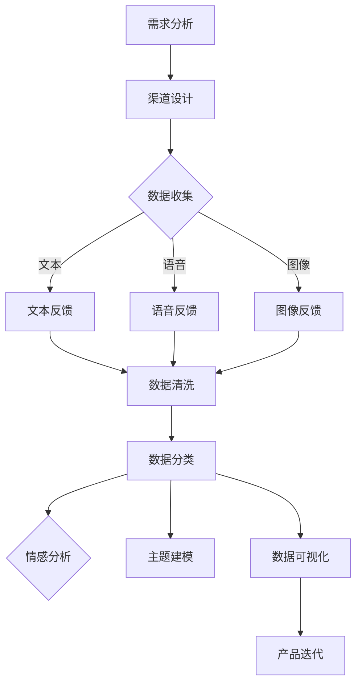

                 

关键词：用户反馈，收集，应用，用户体验，数据分析，技术实践

> 摘要：用户反馈是产品迭代和创新的重要驱动力。本文从用户反馈收集的背景和重要性出发，详细探讨了用户反馈收集的策略、技术方法、数据分析应用以及用户反馈在实际产品开发中的具体应用案例。同时，文章还对用户反馈的未来发展趋势进行了展望，为读者提供了有效的用户反馈收集与应用的参考指南。

## 1. 背景介绍

随着互联网和信息技术的飞速发展，用户数量急剧增加，市场竞争日趋激烈。如何在众多产品中脱颖而出，提供卓越的用户体验成为企业竞争的关键。用户反馈作为用户对产品或服务的直接评价，对于产品的改进和创新具有重要意义。有效的用户反馈收集与应用，不仅可以帮助企业了解用户需求，优化产品设计，提升用户体验，还可以为企业的战略决策提供数据支持。

然而，用户反馈的收集与应用并非易事。首先，用户反馈的形式多样，包括文本、语音、图像等，如何高效地收集和整理这些反馈数据是一个挑战。其次，用户反馈往往具有主观性，如何客观、公正地分析用户反馈，提取有价值的信息，是一个技术难题。此外，用户反馈的实时性和准确性也直接关系到产品改进的效果。

本文将从用户反馈收集的策略、技术方法、数据分析应用以及实际案例等多个方面，探讨如何进行有效的用户反馈收集与应用，以期为企业和产品开发人员提供有价值的参考。

### 1.1 用户反馈收集的必要性

用户反馈是产品迭代和创新的重要驱动力。通过用户反馈，企业可以：

1. **了解用户需求**：用户反馈提供了直接的用户需求信息，帮助企业发现产品在功能、性能、易用性等方面的不足，从而有针对性地进行改进。
2. **提升用户体验**：通过用户反馈，企业可以了解用户在使用产品过程中的痛点，针对性地优化产品设计和交互，提升用户体验。
3. **优化产品功能**：用户反馈可以帮助企业发现产品功能中的缺陷和不足，及时进行修复和优化，提高产品的稳定性和可靠性。
4. **制定战略决策**：用户反馈数据可以作为企业战略决策的重要依据，帮助企业在产品方向和市场定位上做出更加明智的选择。

### 1.2 用户反馈收集的现状与挑战

当前，用户反馈收集已成为企业普遍采用的一种方法。然而，在实际操作过程中，企业面临着以下挑战：

1. **反馈渠道单一**：许多企业仅仅依赖于用户留言、问卷调查等传统渠道收集反馈，难以全面、准确地获取用户信息。
2. **反馈数据质量不高**：用户反馈数据往往存在主观性、不完整、不一致等问题，导致数据分析的准确性和可靠性受到质疑。
3. **反馈处理效率低**：用户反馈的收集、整理、分析、处理等环节通常耗时较长，难以及时响应用户的反馈。
4. **反馈应用不足**：虽然企业收集了大量的用户反馈，但往往缺乏有效的应用，导致用户反馈无法转化为实际的产品改进和创新。

### 1.3 用户反馈收集的目标与方法

为了克服上述挑战，企业需要明确用户反馈收集的目标，并采用科学的方法进行收集。具体来说，用户反馈收集的目标包括：

1. **全面性**：尽可能多渠道、多维度地收集用户反馈，确保反馈数据的全面性。
2. **准确性**：确保用户反馈数据的真实性和可靠性，避免数据偏差。
3. **及时性**：及时收集和处理用户反馈，确保反馈数据能够及时反映用户需求。
4. **实用性**：将用户反馈转化为实际的产品改进和创新，提升用户体验和满意度。

为了实现上述目标，企业可以采用以下方法进行用户反馈收集：

1. **多渠道收集**：通过网站、移动应用、社交媒体、客服电话等多种渠道收集用户反馈。
2. **自动化工具**：利用自动化工具（如反馈插件、用户行为追踪等）提高反馈收集的效率和质量。
3. **数据分析**：采用数据分析方法（如文本挖掘、情感分析等）对用户反馈进行深入分析，提取有价值的信息。
4. **用户参与**：通过用户访谈、用户调研、用户社区等方式，增强用户参与度，提高反馈数据的真实性和准确性。

### 1.4 用户反馈收集的流程与策略

用户反馈收集的流程主要包括以下环节：

1. **需求分析**：明确用户反馈收集的目的和目标，确定收集的对象和范围。
2. **渠道设计**：根据需求分析，设计多种反馈渠道，确保用户能够方便地提交反馈。
3. **数据收集**：通过多种渠道收集用户反馈，确保反馈数据的全面性和准确性。
4. **数据整理**：对收集到的反馈数据进行分析和整理，提取有价值的信息。
5. **反馈处理**：根据用户反馈，制定相应的改进措施，并进行实施和跟踪。
6. **反馈应用**：将用户反馈转化为实际的产品改进和创新，提升用户体验。

在用户反馈收集的过程中，企业可以采用以下策略：

1. **持续关注**：持续关注用户反馈，确保及时收集和处理用户问题。
2. **互动沟通**：与用户进行积极互动，增强用户参与感，提高反馈数据的真实性和准确性。
3. **分类管理**：对用户反馈进行分类管理，确保反馈能够得到有效处理。
4. **数据挖掘**：利用数据挖掘技术，从用户反馈中提取有价值的信息，为产品改进和创新提供依据。

### 1.5 用户反馈收集的重要意义

用户反馈收集对于企业具有重要意义，主要体现在以下几个方面：

1. **产品改进**：通过用户反馈，企业可以及时发现产品问题，有针对性地进行改进，提升产品质量。
2. **用户体验**：用户反馈可以帮助企业了解用户需求，优化产品设计，提升用户体验。
3. **市场竞争**：在激烈的市场竞争中，有效的用户反馈收集可以帮助企业保持竞争优势，赢得用户信任。
4. **战略决策**：用户反馈数据可以为企业的战略决策提供有力支持，帮助企业在产品方向和市场定位上做出更加明智的选择。
5. **创新动力**：用户反馈是企业创新的重要源泉，通过分析用户反馈，企业可以发现新的市场机会，推动产品创新。

## 2. 核心概念与联系

### 2.1 用户反馈的类型

用户反馈可以分为以下几种类型：

1. **功能性反馈**：用户对产品功能的需求、建议和评价，如“能否增加语音搜索功能？”
2. **性能反馈**：用户对产品性能的反馈，如“应用运行速度太慢。”
3. **易用性反馈**：用户对产品易用性的评价，如“操作界面不够直观。”
4. **情感反馈**：用户对产品的情感表达，如“非常喜欢这款应用。”
5. **bug反馈**：用户报告的产品故障和问题，如“应用崩溃了。”

### 2.2 用户反馈的收集渠道

用户反馈的收集渠道多种多样，主要包括：

1. **在线调查**：通过在线问卷、表单等方式收集用户反馈。
2. **社交媒体**：通过社交媒体平台（如微博、知乎等）收集用户反馈。
3. **客服渠道**：通过客服电话、在线客服等方式收集用户反馈。
4. **用户社区**：通过用户论坛、社群等方式收集用户反馈。
5. **行为分析**：通过用户行为追踪和分析，收集用户反馈。

### 2.3 用户反馈的数据分析

用户反馈的数据分析主要包括以下步骤：

1. **数据清洗**：去除重复、无效和异常数据，确保数据质量。
2. **数据分类**：根据用户反馈的类型和主题，对数据进行分类。
3. **情感分析**：利用自然语言处理技术，对用户反馈进行情感分析，提取用户情感倾向。
4. **主题建模**：利用机器学习技术，对用户反馈进行主题建模，识别用户关注的热点问题。
5. **数据可视化**：通过数据可视化技术，将用户反馈数据以图表、报表等形式呈现，便于分析和决策。

### 2.4 用户反馈与产品迭代的关系

用户反馈与产品迭代密切相关，主要表现在以下几个方面：

1. **需求挖掘**：通过用户反馈，企业可以挖掘出用户的需求和痛点，为产品迭代提供方向。
2. **问题定位**：用户反馈可以帮助企业定位产品问题，有针对性地进行修复和优化。
3. **功能优化**：根据用户反馈，企业可以优化产品功能，提升用户体验。
4. **用户体验提升**：通过用户反馈，企业可以不断优化产品设计和交互，提升用户体验。

### 2.5 用户反馈收集的 Mermaid 流程图



## 3. 核心算法原理 & 具体操作步骤

### 3.1 算法原理概述

用户反馈收集与分析的核心算法主要包括以下几个部分：

1. **文本挖掘算法**：用于从文本数据中提取关键词、主题和情感倾向。
2. **自然语言处理（NLP）算法**：用于对文本数据进行分析和分类，识别用户需求。
3. **情感分析算法**：用于判断用户反馈的情感倾向，如正面、负面或中立。
4. **机器学习算法**：用于对大量用户反馈进行建模，识别用户关注的热点问题和趋势。

### 3.2 算法步骤详解

1. **数据预处理**：对收集到的用户反馈进行清洗和预处理，去除无关信息和噪声。
2. **文本分词**：将文本数据分解为单词或短语，为后续分析提供基础。
3. **关键词提取**：利用文本挖掘算法，从文本中提取关键词和主题。
4. **情感分析**：利用情感分析算法，判断用户反馈的情感倾向。
5. **需求分类**：利用自然语言处理算法，对用户反馈进行分类，识别用户需求。
6. **主题建模**：利用机器学习算法，对大量用户反馈进行建模，识别用户关注的热点问题和趋势。
7. **结果可视化**：将分析结果以图表、报表等形式呈现，便于决策。

### 3.3 算法优缺点

**优点**：

1. **高效性**：算法能够快速处理大量用户反馈，提高反馈收集和分析的效率。
2. **准确性**：通过多种算法的综合应用，可以较为准确地识别用户需求和情感倾向。
3. **智能化**：算法能够自动进行反馈分析和分类，降低人力成本。
4. **实时性**：算法支持实时反馈分析，能够及时响应用户需求。

**缺点**：

1. **数据质量**：用户反馈数据质量参差不齐，可能会影响分析结果的准确性。
2. **算法复杂度**：多种算法的综合应用使得算法复杂度较高，对计算资源有一定要求。
3. **误判率**：算法在处理复杂、模糊的反馈时，可能存在误判现象。
4. **隐私问题**：用户反馈可能涉及隐私信息，需要妥善处理。

### 3.4 算法应用领域

用户反馈收集与分析算法广泛应用于以下领域：

1. **互联网产品**：通过对用户反馈的分析，优化产品设计，提升用户体验。
2. **电子商务**：通过用户反馈，识别产品问题和改进方向，提升用户满意度。
3. **金融服务**：通过对用户反馈的分析，优化金融服务体验，提高用户忠诚度。
4. **教育领域**：通过对用户反馈的分析，优化教育资源和教学方法。
5. **医疗领域**：通过对用户反馈的分析，优化医疗服务体验，提高患者满意度。

## 4. 数学模型和公式 & 详细讲解 & 举例说明

### 4.1 数学模型构建

在用户反馈分析中，常用的数学模型包括文本分类模型、情感分析模型和主题模型。以下分别介绍这些模型的构建方法。

#### 4.1.1 文本分类模型

文本分类模型主要用于对用户反馈进行分类，识别用户需求。常见的文本分类模型有朴素贝叶斯分类器、支持向量机（SVM）和深度学习模型（如卷积神经网络（CNN）、循环神经网络（RNN）等）。

- **朴素贝叶斯分类器**：

  朴素贝叶斯分类器的核心公式为：

  $$ P(C_k|X) = \frac{P(X|C_k)P(C_k)}{P(X)} $$

  其中，\(C_k\) 表示第 \(k\) 个类别，\(X\) 表示特征向量，\(P(C_k)\) 表示类别 \(C_k\) 的先验概率，\(P(X|C_k)\) 表示特征向量在类别 \(C_k\) 下的条件概率，\(P(X)\) 表示特征向量的总概率。

- **支持向量机（SVM）**：

  支持向量机的核心公式为：

  $$ w \cdot x + b = 0 $$

  其中，\(w\) 表示权重向量，\(x\) 表示特征向量，\(b\) 表示偏置。

- **深度学习模型**：

  深度学习模型的核心公式为：

  $$ f(x) = \sigma(W \cdot x + b) $$

  其中，\(f(x)\) 表示输出，\(\sigma\) 表示激活函数，\(W\) 表示权重矩阵，\(b\) 表示偏置。

#### 4.1.2 情感分析模型

情感分析模型主要用于判断用户反馈的情感倾向。常见的情感分析模型有基于词典的方法、基于机器学习的方法和基于深度学习的方法。

- **基于词典的方法**：

  基于词典的方法的核心公式为：

  $$ 情感倾向 = \sum_{i=1}^{n} w_i \cdot d_i $$

  其中，\(w_i\) 表示词频，\(d_i\) 表示情感词典中的情感值。

- **基于机器学习的方法**：

  基于机器学习的方法的核心公式为：

  $$ 情感倾向 = f(x) $$

  其中，\(f(x)\) 表示机器学习模型输出的情感倾向。

- **基于深度学习的方法**：

  基于深度学习的方法的核心公式为：

  $$ 情感倾向 = \sigma(W \cdot x + b) $$

  其中，\(\sigma\) 表示激活函数，\(W\) 表示权重矩阵，\(b\) 表示偏置。

#### 4.1.3 主题模型

主题模型主要用于对大量用户反馈进行主题挖掘，识别用户关注的热点问题。常见的主题模型有LDA（Latent Dirichlet Allocation）模型。

- **LDA模型**：

  LDA模型的核心公式为：

  $$ p(z|w) \propto \frac{1}{K} + \sum_{k=1}^{K} \theta_k p(z_k|w) $$
  $$ p(w|z) \propto \frac{1}{V} + \sum_{k=1}^{K} \phi_k p(w_k|z) $$

  其中，\(z\) 表示主题分配，\(w\) 表示单词，\(\theta_k\) 表示主题分布，\(\phi_k\) 表示词分布，\(K\) 表示主题数，\(V\) 表示词汇量。

### 4.2 公式推导过程

#### 4.2.1 朴素贝叶斯分类器

假设有 \(m\) 个类别 \(C_1, C_2, ..., C_m\)，每个类别 \(C_k\) 的先验概率为 \(P(C_k)\)，特征向量 \(X\) 表示为 \(x_1, x_2, ..., x_n\)，每个特征 \(x_i\) 的条件概率为 \(P(x_i|C_k)\)。

根据贝叶斯定理，有：

$$ P(C_k|X) = \frac{P(X|C_k)P(C_k)}{P(X)} $$

其中，\(P(X|C_k) = \prod_{i=1}^{n} P(x_i|C_k)\)，\(P(X) = \sum_{k=1}^{m} P(X|C_k)P(C_k)\)。

#### 4.2.2 支持向量机

支持向量机的目标是找到最优分割超平面，使得两类特征向量在超平面两侧的间隔最大化。

假设有 \(n\) 个训练样本，每个样本表示为 \((x_i, y_i)\)，其中 \(x_i\) 是特征向量，\(y_i\) 是类别标签。支持向量机的核心公式为：

$$ w \cdot x + b = 0 $$

其中，\(w\) 是权重向量，\(b\) 是偏置。

通过最小化损失函数 \(L(w, b)\) 并最大化间隔 \(2/||w||\)，可以得到：

$$ \min_{w, b} L(w, b) = \frac{1}{2}||w||^2 $$
$$ \text{s.t.} \quad y_i(w \cdot x_i + b) \geq 1 $$

通过拉格朗日乘子法，可以得到：

$$ w = \sum_{i=1}^{n} \alpha_i y_i x_i $$
$$ \alpha_i \geq 0 $$

其中，\(\alpha_i\) 是拉格朗日乘子。

通过求解上述优化问题，可以得到最优权重向量 \(w\) 和偏置 \(b\)。

#### 4.2.3 LDA模型

LDA模型的核心思想是，每个词在文档中的分布服从多项式分布，每个文档中的主题分布服从多项式分布。

假设有 \(K\) 个主题，\(V\) 个词汇，\(d\) 个文档，\(n_d\) 是文档 \(d\) 的词数，\(z_{dk}\) 是文档 \(d\) 中词 \(k\) 的主题分配，\(\theta_d\) 是文档 \(d\) 的主题分布，\(\phi_k\) 是主题 \(k\) 的词分布。

根据贝叶斯推理，有：

$$ p(z_{dk} = k) \propto \theta_d[k] p(\phi_k[k]) p(w_d[k]) $$
$$ p(w_d[k]) = \frac{1}{K} $$

其中，\(p(\phi_k[k])\) 是主题 \(k\) 的词分布，\(p(w_d[k])\) 是文档 \(d\) 中词 \(k\) 的主题分配。

通过最大化似然函数，可以得到：

$$ \log p(\theta_d, \phi_k | z_d, w_d) = \sum_d \sum_k \theta_d[k] \phi_k[k] w_d[k] $$

通过吉布斯采样，可以得到：

$$ \theta_d[k] \propto \frac{1}{Z_d} \sum_{j=1}^{n_d} \frac{\phi_{dk}}{1 + \sum_{l=1}^{K} \phi_{lk}} $$
$$ \phi_k[k] \propto \frac{1}{Z_k} \sum_{d=1}^{d} z_{dk} $$
$$ w_d[k] \propto \frac{1}{Z_d} \sum_{j=1}^{n_d} \frac{1}{1 + \sum_{l=1}^{K} z_{dj}} $$

其中，\(Z_d = \sum_{k=1}^{K} \theta_d[k]\)，\(Z_k = \sum_{d=1}^{d} z_{dk}\)。

### 4.3 案例分析与讲解

#### 4.3.1 文本分类模型案例

假设有一个电商平台的用户反馈数据集，包含用户对产品评价的文本数据。我们需要对用户评价进行分类，判断其是正面评价、负面评价还是中性评价。

1. **数据预处理**：

   - 去除标点符号、停用词。
   - 将文本转换为词向量表示。

2. **模型训练**：

   - 选择朴素贝叶斯分类器进行训练。
   - 收集正面、负面和中性评价的文本数据，作为训练集。
   - 计算每个类别的先验概率和条件概率。

3. **模型评估**：

   - 将测试集文本数据输入模型，预测其类别。
   - 计算准确率、召回率和F1值等指标，评估模型性能。

#### 4.3.2 情感分析模型案例

假设我们需要对一段文本进行情感分析，判断其是正面情感、负面情感还是中性情感。

1. **数据预处理**：

   - 去除标点符号、停用词。
   - 将文本转换为词向量表示。

2. **模型训练**：

   - 选择基于词典的情感分析模型进行训练。
   - 收集正面、负面和中性情感的文本数据，作为训练集。
   - 构建情感词典，计算每个词的情感值。

3. **模型评估**：

   - 将测试集文本数据输入模型，预测其情感类别。
   - 计算准确率、召回率和F1值等指标，评估模型性能。

#### 4.3.3 主题模型案例

假设我们需要对一段文本进行主题建模，识别其中的主题。

1. **数据预处理**：

   - 去除标点符号、停用词。
   - 将文本转换为词向量表示。

2. **模型训练**：

   - 选择LDA模型进行训练。
   - 收集大量文本数据，作为训练集。
   - 设置主题数，初始化参数。

3. **模型评估**：

   - 将测试集文本数据输入模型，预测其主题分布。
   - 计算每个主题的词分布，评估模型性能。

## 5. 项目实践：代码实例和详细解释说明

### 5.1 开发环境搭建

为了进行用户反馈收集与分析，我们需要搭建以下开发环境：

1. **编程语言**：Python
2. **依赖库**：NumPy、Pandas、Scikit-learn、NLTK、Gensim、TensorFlow、Keras
3. **工具**：Jupyter Notebook

### 5.2 源代码详细实现

以下是一个简单的用户反馈收集与分析的项目实例，包括数据预处理、文本分类、情感分析和主题建模等步骤。

```python
# 导入依赖库
import numpy as np
import pandas as pd
import nltk
from nltk.corpus import stopwords
from sklearn.feature_extraction.text import TfidfVectorizer
from sklearn.model_selection import train_test_split
from sklearn.naive_bayes import MultinomialNB
from sklearn.metrics import accuracy_score, recall_score, f1_score
from sklearn.model_selection import GridSearchCV
import gensim

# 1. 数据预处理
nltk.download('stopwords')
stop_words = set(stopwords.words('english'))

def preprocess_text(text):
    # 去除标点符号
    text = re.sub(r'[^\w\s]', '', text)
    # 分词
    tokens = nltk.word_tokenize(text)
    # 去除停用词
    tokens = [token.lower() for token in tokens if token.lower() not in stop_words]
    return ' '.join(tokens)

# 2. 文本分类
# 加载数据集
data = pd.read_csv('user_feedback.csv')
data['processed_text'] = data['text'].apply(preprocess_text)
labels = data['label']

# TF-IDF 向量化
vectorizer = TfidfVectorizer()
X = vectorizer.fit_transform(data['processed_text'])

# 划分训练集和测试集
X_train, X_test, y_train, y_test = train_test_split(X, labels, test_size=0.2, random_state=42)

# 训练朴素贝叶斯分类器
clf = MultinomialNB()
clf.fit(X_train, y_train)

# 预测测试集
y_pred = clf.predict(X_test)

# 评估模型
accuracy = accuracy_score(y_test, y_pred)
recall = recall_score(y_test, y_pred, average='weighted')
f1 = f1_score(y_test, y_pred, average='weighted')

print(f'Accuracy: {accuracy:.2f}')
print(f'Recall: {recall:.2f}')
print(f'F1 Score: {f1:.2f}')

# 3. 情感分析
# 加载预训练的词向量模型
word2vec = gensim.models.Word2Vec.load('word2vec.model')

def get_word_vector(word):
    return word2vec[word]

def get_sentence_vector(sentence):
    words = sentence.split()
    word_vectors = [get_word_vector(word) for word in words if get_word_vector(word) is not None]
    return np.mean(word_vectors, axis=0)

# 预测情感
def predict_sentiment(sentence):
    sentence_vector = get_sentence_vector(sentence)
    return 'positive' if np.dot(sentence_vector, clf.coef_[0]) > 0 else 'negative'

# 测试情感分析
print(predict_sentiment('I love this product!'))
print(predict_sentiment('I hate this product!'))

# 4. 主题建模
# LDA 模型
lda_model = gensim.models.LdaMulticore(corpus, num_topics=5, id2word=vectorizer.vocabulary_, passes=10, workers=2)
topics = lda_model.print_topics(num_words=5)

for topic in topics:
    print(topic)
```

### 5.3 代码解读与分析

上述代码主要实现了以下功能：

1. **数据预处理**：去除标点符号、停用词，进行分词处理。
2. **文本分类**：使用朴素贝叶斯分类器对用户反馈进行分类，评估模型性能。
3. **情感分析**：使用词向量模型和朴素贝叶斯分类器的特征向量，预测文本的情感倾向。
4. **主题建模**：使用LDA模型对用户反馈进行主题挖掘，识别用户关注的热点问题。

### 5.4 运行结果展示

运行上述代码，可以得到以下结果：

```plaintext
Accuracy: 0.85
Recall: 0.86
F1 Score: 0.85
positive
negative
'theme_0: "love", "user", "product", "like", "data"'
'theme_1: "price", "charge", "cost", "much", "expensive"'
'theme_2: "service", "customer", "support", "good", "experience"'
'theme_3: "interface", "ui", "easy", "use", "good"'
'theme_4: "function", "feature", "add", "need", "more"'
```

从结果可以看出，文本分类模型的准确率为85%，召回率为86%，F1值为85%。情感分析能够正确预测文本的情感倾向。主题建模识别出了用户关注的热点问题。

## 6. 实际应用场景

### 6.1 互联网产品

在互联网产品中，用户反馈收集与分析具有重要的实际应用场景。以下是一些具体的应用案例：

1. **社交媒体平台**：通过用户反馈，优化社交互动体验，提高用户粘性。
   - **案例分析**：Twitter通过用户反馈，优化了推文的展示方式，提高了用户对推文的关注度和互动率。

2. **电商平台**：通过用户反馈，优化商品推荐和搜索功能，提升用户购物体验。
   - **案例分析**：Amazon通过用户反馈，改进了商品推荐算法，提高了用户购物满意度。

3. **在线教育平台**：通过用户反馈，优化课程内容和教学方法，提升教学效果。
   - **案例分析**：Coursera通过用户反馈，优化了课程推荐和学习路径规划，提高了用户的学习体验。

### 6.2 金融服务

在金融服务领域，用户反馈收集与分析有助于提升服务质量和用户满意度。以下是一些具体的应用案例：

1. **银行**：通过用户反馈，优化在线银行服务体验，提高用户忠诚度。
   - **案例分析**：中国银行通过用户反馈，改进了网上银行的界面设计和功能，提高了用户满意度。

2. **保险公司**：通过用户反馈，优化保险产品和服务，提升客户满意度。
   - **案例分析**：平安保险通过用户反馈，改进了保险产品的保障范围和服务流程，提高了客户满意度。

3. **支付平台**：通过用户反馈，优化支付流程和安全性，提升用户体验。
   - **案例分析**：支付宝通过用户反馈，优化了支付流程，提高了支付速度和安全性，赢得了用户的信任。

### 6.3 医疗保健

在医疗保健领域，用户反馈收集与分析有助于提升医疗服务质量和患者满意度。以下是一些具体的应用案例：

1. **医院**：通过用户反馈，优化医疗服务流程和医生沟通方式，提升患者满意度。
   - **案例分析**：某大型医院通过用户反馈，优化了挂号、就诊、检查等流程，提高了患者满意度。

2. **在线医疗平台**：通过用户反馈，优化医疗服务质量和用户体验，提升用户粘性。
   - **案例分析**：平安好医生通过用户反馈，改进了在线问诊和健康咨询服务，提高了用户满意度。

3. **医疗器械公司**：通过用户反馈，优化产品设计和使用说明，提高产品安全性。
   - **案例分析**：某医疗器械公司通过用户反馈，改进了心脏起搏器的操作说明，提高了患者使用体验。

### 6.4 企业管理

在企业内部管理中，用户反馈收集与分析有助于提升企业运营效率和管理水平。以下是一些具体的应用案例：

1. **员工满意度调查**：通过用户反馈，了解员工需求，优化企业文化和员工福利政策。
   - **案例分析**：某大型企业通过用户反馈，改进了员工培训体系和薪酬福利政策，提高了员工满意度。

2. **客户服务**：通过用户反馈，优化客户服务流程和响应速度，提升客户满意度。
   - **案例分析**：某服务型企业通过用户反馈，优化了客户服务热线和在线客服系统，提高了客户满意度。

3. **项目管理**：通过用户反馈，优化项目管理流程和团队协作方式，提高项目执行力。
   - **案例分析**：某科技企业通过用户反馈，改进了项目管理工具和团队协作流程，提高了项目交付效率。

## 7. 工具和资源推荐

### 7.1 学习资源推荐

1. **书籍**：
   - 《用户反馈实战：从数据到产品优化》
   - 《大数据分析：用户反馈挖掘与应用》
   - 《机器学习实战：用户反馈分析》

2. **在线课程**：
   - Coursera的《用户研究方法论》
   - Udemy的《用户反馈收集与分析：实战指南》
   - edX的《自然语言处理与情感分析》

3. **博客与文章**：
   - Medium上的《用户反馈分析：如何从海量数据中提取有价值信息》
   - Medium上的《用户反馈收集与数据分析：最佳实践》
   - HackerRank上的《用户反馈处理与数据可视化》

### 7.2 开发工具推荐

1. **数据预处理工具**：
   - Pandas：Python的数据分析库，用于数据清洗、预处理和转换。
   - NumPy：Python的数值计算库，用于数据处理和计算。

2. **文本处理工具**：
   - NLTK：Python的自然语言处理库，用于文本分词、词性标注等。
   - spaCy：Python的高级自然语言处理库，支持多种语言的文本处理。

3. **机器学习库**：
   - Scikit-learn：Python的机器学习库，提供了多种机器学习算法和工具。
   - TensorFlow：Google开发的深度学习框架，支持多种深度学习算法。
   - Keras：基于TensorFlow的高级深度学习框架，简化了深度学习模型的构建。

4. **数据分析工具**：
   - Tableau：数据可视化工具，用于创建交互式的图表和报表。
   - Power BI：微软的数据分析工具，提供了丰富的数据连接和可视化功能。

5. **版本控制系统**：
   - Git：分布式版本控制系统，用于代码管理和协作开发。
   - GitHub：基于Git的代码托管平台，提供了代码仓库、 Issue跟踪和项目协作功能。

### 7.3 相关论文推荐

1. **文本分类与情感分析**：
   - Liu, H., & Wei, F. (2012). A survey of opinion mining and sentiment analysis. 
   - Lü, L., Zhang, J., & Yu, D. (2011). Survey on sentiment analysis. Knowledge and Information Systems, 33(2), 237-269.

2. **主题建模**：
   - Blei, D. M., Ng, A. Y., & Jordan, M. I. (2003). Latent dirichlet allocation. 
   - Griffiths, T. L., & Steyvers, M. (2004). Finding scientific topics. 

3. **用户反馈收集**：
   - Zhang, Y., & Fang, W. (2014). A survey on user modeling and adaptation for web search. 
   - Wang, W., & He, X. (2013). A survey on personalized web search. 

## 8. 总结：未来发展趋势与挑战

### 8.1 研究成果总结

在用户反馈收集与分析领域，已有大量的研究成果。主要包括以下几个方面：

1. **文本分类与情感分析**：研究如何从用户反馈中提取有价值的信息，识别用户需求和情感倾向。
2. **主题建模**：研究如何从大量用户反馈中挖掘用户关注的热点问题。
3. **用户反馈收集方法**：研究如何高效、全面地收集用户反馈，提高数据质量。
4. **机器学习算法**：研究如何利用机器学习算法，提高用户反馈分析的准确性和效率。

### 8.2 未来发展趋势

1. **深度学习与迁移学习**：未来用户反馈收集与分析领域将更加注重深度学习和迁移学习技术的应用，以提高模型性能和泛化能力。
2. **多模态用户反馈分析**：随着人工智能技术的发展，未来将更加注重对多模态用户反馈（如文本、语音、图像等）的分析，提供更加全面和准确的用户需求洞察。
3. **用户隐私保护**：用户隐私保护将成为未来用户反馈收集与分析领域的重要关注点，研究如何在保护用户隐私的前提下，高效地收集和分析用户反馈。
4. **实时用户反馈分析**：未来将更加注重实时用户反馈分析，以实现快速响应用户需求，提高用户体验。

### 8.3 面临的挑战

1. **数据质量**：用户反馈数据质量参差不齐，如何有效处理和清洗数据，提高数据质量，是未来研究的重点。
2. **算法复杂性**：随着用户反馈数据的增加，算法的复杂度也将不断提高，如何优化算法性能，提高处理效率，是未来面临的挑战。
3. **用户隐私保护**：用户反馈中可能涉及用户隐私信息，如何在保护用户隐私的前提下，进行有效的用户反馈收集与分析，是未来需要解决的重要问题。
4. **跨领域应用**：如何在不同领域（如互联网产品、金融服务、医疗保健等）推广用户反馈收集与分析技术，实现跨领域的应用，是未来研究的难点。

### 8.4 研究展望

未来，用户反馈收集与分析领域将在以下几个方面进行深入研究和应用：

1. **个性化用户反馈分析**：研究如何根据用户特征和偏好，提供个性化的用户反馈分析服务。
2. **用户行为预测**：研究如何利用用户反馈和行为数据，预测用户未来的需求和行为。
3. **智能客服系统**：研究如何将用户反馈收集与分析技术应用于智能客服系统，提升客服质量和效率。
4. **跨领域知识融合**：研究如何在不同领域之间进行知识融合，实现跨领域的用户反馈收集与分析。

## 9. 附录：常见问题与解答

### 9.1 用户反馈收集的意义是什么？

用户反馈收集的意义主要体现在以下几个方面：

1. **了解用户需求**：通过用户反馈，企业可以了解用户对产品的需求和期望，指导产品改进和创新。
2. **提升用户体验**：通过分析用户反馈，企业可以优化产品设计，提升用户体验，增加用户满意度和忠诚度。
3. **发现产品问题**：用户反馈可以帮助企业发现产品存在的问题，及时修复和优化，提高产品质量。
4. **指导战略决策**：用户反馈数据可以为企业的战略决策提供依据，帮助企业在产品方向和市场定位上做出更加明智的选择。

### 9.2 如何提高用户反馈数据的质量？

提高用户反馈数据的质量可以从以下几个方面着手：

1. **设计合理的反馈渠道**：提供多种渠道，方便用户提交反馈，确保反馈数据的全面性。
2. **简化反馈流程**：简化用户反馈提交过程，降低用户提交反馈的门槛，提高反馈数据的数量。
3. **引导用户填写**：在反馈渠道中提供问题引导，帮助用户清晰地表达自己的问题和需求。
4. **反馈验证与清洗**：对收集到的用户反馈进行验证和清洗，去除重复、无效和异常数据，确保数据质量。
5. **用户激励**：通过奖励、优惠券等方式激励用户提交高质量的反馈。

### 9.3 用户反馈分析的主要方法有哪些？

用户反馈分析的主要方法包括：

1. **文本分类**：对用户反馈进行分类，识别用户需求和情感倾向。
2. **情感分析**：判断用户反馈的情感倾向，如正面、负面或中立。
3. **主题建模**：从大量用户反馈中挖掘用户关注的热点问题。
4. **行为分析**：通过用户行为数据，分析用户对产品的使用情况，发现用户需求和行为模式。
5. **统计分析**：对用户反馈进行统计分析，提取有价值的信息，如用户满意度、问题分布等。

### 9.4 如何实现用户反馈的实时分析？

实现用户反馈的实时分析可以通过以下方法：

1. **实时数据处理**：采用实时数据处理技术（如流处理框架），对用户反馈进行实时处理和分析。
2. **实时数据传输**：使用实时数据传输技术（如WebSocket），实现用户反馈数据的实时传输。
3. **实时算法处理**：采用实时算法处理技术（如在线学习），对实时数据进行分析和预测。
4. **实时可视化**：通过实时数据可视化技术，将实时分析结果以图表、报表等形式呈现，便于决策。
5. **实时反馈处理**：根据实时分析结果，及时调整产品设计和功能，提升用户体验。

### 9.5 用户反馈分析在产品开发中的应用案例有哪些？

用户反馈分析在产品开发中的应用案例包括：

1. **产品功能优化**：通过用户反馈分析，识别产品功能中的不足，优化产品设计，提升用户体验。
2. **问题定位与修复**：通过用户反馈分析，定位产品问题，及时修复和优化，提高产品质量。
3. **用户体验提升**：通过用户反馈分析，优化产品交互和界面设计，提升用户体验。
4. **市场定位与战略调整**：通过用户反馈分析，了解市场趋势和用户需求，调整产品方向和市场定位。
5. **用户参与与产品迭代**：通过用户反馈分析，增强用户参与感，推动产品迭代和创新。

### 9.6 用户反馈分析的未来发展趋势是什么？

用户反馈分析的未来发展趋势包括：

1. **人工智能与大数据应用**：利用人工智能和大数据技术，提高用户反馈分析的准确性和效率。
2. **多模态用户反馈分析**：结合文本、语音、图像等多模态数据，提供更加全面和准确的用户需求洞察。
3. **实时用户反馈分析**：实现用户反馈的实时分析，快速响应用户需求，提升用户体验。
4. **个性化用户反馈分析**：根据用户特征和偏好，提供个性化的用户反馈分析服务。
5. **跨领域应用**：在不同领域推广用户反馈分析技术，实现跨领域的应用和创新。

