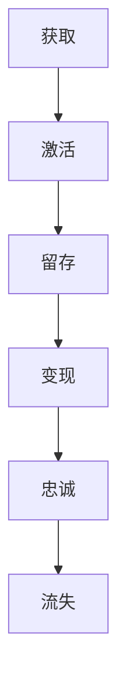

                 

关键词：用户生命周期管理、用户行为分析、用户价值提升、用户体验优化、数据驱动策略

> 摘要：本文旨在探讨如何通过有效的用户生命周期管理，提升用户的整体体验和品牌忠诚度。文章首先介绍了用户生命周期的基本概念，然后深入分析了用户生命周期管理的关键环节，最后提出了具体的实践策略和工具推荐。

## 1. 背景介绍

在当今数字化时代，用户数据的价值日益凸显。企业的成功往往依赖于如何利用这些数据来优化用户体验，从而实现业务的持续增长。用户生命周期管理（User Lifecycle Management）作为一种系统性的方法，通过对用户从首次接触到最终离开的全过程进行管理，能够帮助企业最大化用户价值，提升用户满意度和忠诚度。

用户生命周期通常分为五个阶段：获取（Acquisition）、激活（Activation）、留存（Retention）、变现（Conversion）和忠诚（Loyalty）。每个阶段都有其独特的目标和挑战，需要相应的策略和方法来确保用户价值的最大化。

## 2. 核心概念与联系

### 2.1 用户生命周期模型

用户生命周期的基本模型可以用Mermaid流程图来表示：



### 2.2 用户生命周期管理流程

用户生命周期管理的流程可以进一步细化为以下步骤：

1. **数据收集与分析**：收集用户行为数据，包括访问次数、页面停留时间、点击路径等。
2. **用户细分**：根据用户行为和特征进行用户细分，为每个细分群体制定个性化的策略。
3. **策略实施**：实施针对每个生命周期的策略，如获取新用户、激活潜在用户、提高用户留存率等。
4. **效果评估**：定期评估用户生命周期管理策略的效果，进行调整和优化。

## 3. 核心算法原理 & 具体操作步骤

### 3.1 算法原理概述

用户生命周期管理依赖于多个核心算法，包括：

1. **用户行为预测模型**：使用机器学习算法，预测用户的下一步行为，如购买、流失等。
2. **用户分群算法**：根据用户的特征和行为，将用户划分为不同的群体。
3. **A/B测试算法**：通过对比不同策略的效果，优化用户生命周期管理策略。

### 3.2 算法步骤详解

1. **数据预处理**：清洗和整理用户行为数据，为后续分析做准备。
2. **特征工程**：提取用户行为数据中的关键特征，如浏览时间、购买频次等。
3. **模型训练**：使用训练数据，训练用户行为预测模型和用户分群算法。
4. **策略实施**：根据模型预测结果，实施个性化的用户生命周期管理策略。
5. **效果评估**：评估策略的效果，进行调整和优化。

### 3.3 算法优缺点

1. **优点**：
   - **个性化**：能够为每个用户提供个性化的服务和体验。
   - **数据驱动**：基于用户行为数据，做出更加科学和合理的决策。
2. **缺点**：
   - **计算成本**：需要大量的计算资源和时间来处理和分析数据。
   - **模型过拟合**：模型可能对训练数据过度拟合，导致在实际应用中效果不佳。

### 3.4 算法应用领域

用户生命周期管理算法广泛应用于电子商务、金融科技、社交媒体等领域。通过优化用户生命周期管理，企业能够提高用户留存率和转化率，实现业务增长。

## 4. 数学模型和公式 & 详细讲解 & 举例说明

### 4.1 数学模型构建

用户生命周期管理中的关键数学模型包括用户流失率模型和用户价值模型。

1. **用户流失率模型**：
   $$ \text{流失率} = \frac{\text{流失用户数}}{\text{总用户数}} $$

2. **用户价值模型**：
   $$ \text{用户价值} = \text{收益} - \text{成本} $$

### 4.2 公式推导过程

1. **用户流失率模型**：
   假设一个时间周期内，有N个用户，其中L个用户流失，则流失率为L/N。

2. **用户价值模型**：
   用户价值是用户为企业带来的收益减去企业为用户提供服务的成本。

### 4.3 案例分析与讲解

以一家电子商务平台为例，分析用户生命周期管理中的数学模型应用。

1. **用户流失率**：
   在过去一个月内，平台共有10000个用户，其中流失了500个用户。则流失率为500/10000 = 0.05。

2. **用户价值**：
   每个用户的平均收益为100元，成本为20元，则每个用户的价值为100 - 20 = 80元。

## 5. 项目实践：代码实例和详细解释说明

### 5.1 开发环境搭建

开发用户生命周期管理项目，需要以下开发环境和工具：
- Python 3.x
- Scikit-learn 库
- Pandas 库
- Matplotlib 库

### 5.2 源代码详细实现

以下是用户生命周期管理项目中的一部分代码实现：

```python
import pandas as pd
from sklearn.model_selection import train_test_split
from sklearn.ensemble import RandomForestClassifier
import matplotlib.pyplot as plt

# 读取用户数据
data = pd.read_csv('user_data.csv')

# 数据预处理
X = data.drop('is流失', axis=1)
y = data['is流失']

# 划分训练集和测试集
X_train, X_test, y_train, y_test = train_test_split(X, y, test_size=0.2, random_state=42)

# 训练用户流失预测模型
model = RandomForestClassifier(n_estimators=100, random_state=42)
model.fit(X_train, y_train)

# 测试模型效果
accuracy = model.score(X_test, y_test)
print(f'模型准确率：{accuracy:.2f}')

# 可视化用户流失率
plt.scatter(X_test['浏览时间'], y_test)
plt.xlabel('浏览时间')
plt.ylabel('是否流失')
plt.show()
```

### 5.3 代码解读与分析

上述代码实现了用户流失预测模型，包括数据读取、预处理、模型训练和效果评估等步骤。通过可视化用户流失率，可以更好地理解用户行为特征与流失之间的关系。

## 6. 实际应用场景

用户生命周期管理在实际应用中具有广泛的应用场景，如：

1. **电子商务**：通过用户生命周期管理，电商平台能够更好地了解用户需求，提高转化率和销售额。
2. **金融科技**：银行和金融机构可以使用用户生命周期管理来识别高风险用户，降低信用风险。
3. **社交媒体**：社交媒体平台可以通过用户生命周期管理，提高用户活跃度和用户留存率。

## 7. 工具和资源推荐

### 7.1 学习资源推荐

1. 《用户画像与精准营销》
2. 《数据科学实战：用户行为分析》
3. 《机器学习实战》

### 7.2 开发工具推荐

1. Python 3.x
2. Jupyter Notebook
3. Scikit-learn 库
4. Pandas 库

### 7.3 相关论文推荐

1. “User Lifecycle Management: A Comprehensive Review”
2. “User Engagement and Retention: A Machine Learning Approach”
3. “Data-Driven Personalization in E-commerce: A Case Study”

## 8. 总结：未来发展趋势与挑战

### 8.1 研究成果总结

用户生命周期管理作为一种系统性的方法，已逐渐成为企业提升用户价值的重要手段。通过数据分析和机器学习算法，企业能够实现更加精准的用户行为预测和个性化服务。

### 8.2 未来发展趋势

1. **智能化**：随着人工智能技术的发展，用户生命周期管理将更加智能化和自动化。
2. **跨平台**：用户生命周期管理将不再局限于单一平台，而是实现跨平台和跨渠道的用户数据整合。

### 8.3 面临的挑战

1. **数据隐私**：如何保护用户隐私，在确保数据安全的同时，充分利用用户数据，是企业面临的一大挑战。
2. **模型过拟合**：如何避免模型过度拟合，提高模型在实际应用中的效果，也是用户生命周期管理领域需要解决的问题。

### 8.4 研究展望

未来，用户生命周期管理领域将继续深入研究，探索更加高效、智能的算法和方法，以帮助企业在激烈的市场竞争中脱颖而出。

## 9. 附录：常见问题与解答

### 9.1 用户体验优化是什么？

用户体验优化是指通过对产品或服务的设计和改进，提高用户的满意度和忠诚度。在用户生命周期管理中，用户体验优化是提升用户留存率和转化率的重要手段。

### 9.2 数据驱动策略有哪些优点？

数据驱动策略的优点包括：
- **客观性**：基于数据而非主观判断，提高决策的准确性。
- **可度量性**：数据驱动策略可以量化效果，便于评估和优化。
- **适应性**：可以根据实时数据调整策略，提高应变能力。

----------------------------------------------------------------

作者：禅与计算机程序设计艺术 / Zen and the Art of Computer Programming

