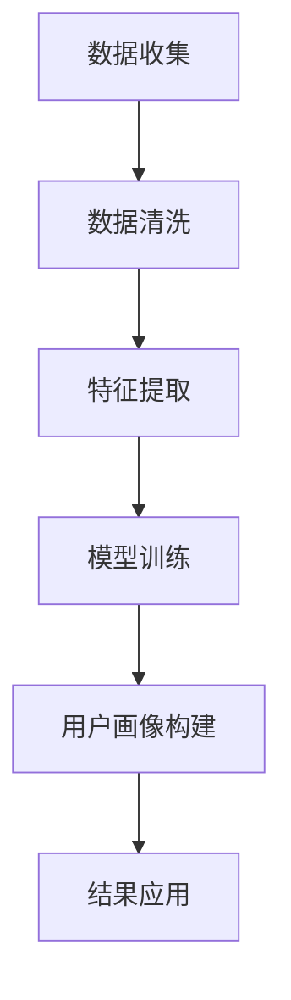

                 

用户画像分析是现代数据驱动的商业战略中的关键组成部分。它涉及收集、整合和分析用户数据，以创建详细的用户轮廓，帮助企业和组织更好地理解其目标受众，并据此制定更精准的市场营销策略。然而，有效的用户画像分析并非易事，它需要深入的理解、精细的执行和不断的迭代。本文将探讨如何进行有效的用户画像分析，包括核心概念、算法原理、数学模型、项目实践以及未来应用展望。

> 关键词：用户画像分析、数据整合、市场营销、算法原理、数学模型、项目实践、未来应用

> 摘要：本文从多个角度深入探讨了用户画像分析的方法和实践。首先，介绍了用户画像分析的核心概念和其在商业战略中的应用。接着，详细阐述了用户画像分析中的核心算法原理和数学模型，并举例说明。随后，通过一个实际的项目实例，展示了用户画像分析的具体操作步骤和实现方法。最后，文章展望了用户画像分析的未来发展趋势和挑战。

## 1. 背景介绍

用户画像分析起源于大数据时代的到来，随着互联网和移动互联网的普及，用户数据变得无处不在。这些数据不仅包括传统的人口统计信息，如年龄、性别、地域等，还包括更加详细的行为数据，如搜索记录、购买历史、社交行为等。用户画像分析通过整合和分析这些数据，可以揭示用户的兴趣偏好、购买倾向和需求，从而为企业和组织提供宝贵的洞察。

在商业领域，用户画像分析具有广泛的应用。首先，它可以用于精准营销，通过分析用户的兴趣爱好和行为数据，企业可以更有效地定位目标客户，推送个性化的广告和促销活动。其次，用户画像分析可以帮助企业更好地了解客户需求，优化产品设计和服务，提高客户满意度和忠诚度。此外，用户画像分析还可以用于风险管理和个性化推荐系统，为企业提供更全面的数据支持。

## 2. 核心概念与联系

### 2.1 用户画像的定义

用户画像是指通过对用户数据的收集和分析，构建出一个全面、立体的用户轮廓。这个轮廓不仅包括用户的基本信息，如年龄、性别、职业等，还包括用户的兴趣偏好、行为习惯、需求特征等。用户画像的构建过程通常涉及数据收集、数据清洗、特征提取和模型训练等多个环节。

### 2.2 数据收集与整合

数据收集是用户画像分析的基础。用户数据可以从多种渠道获取，包括网站日志、社交媒体、在线调查、购买记录等。在收集数据的过程中，需要注意数据的质量和隐私问题。数据整合是将来自不同来源的数据进行清洗、格式化和合并，形成一个统一的数据集，以便进行后续分析。

### 2.3 特征提取与模型训练

特征提取是从原始数据中提取出对用户画像构建有用的信息。这通常需要使用数据挖掘和机器学习技术，如聚类分析、分类算法、关联规则挖掘等。模型训练则是利用提取出的特征，通过机器学习算法构建用户画像模型，如决策树、神经网络、支持向量机等。

### 2.4 Mermaid 流程图

下面是一个简单的 Mermaid 流程图，展示了用户画像分析的核心流程和环节。



## 3. 核心算法原理 & 具体操作步骤

### 3.1 算法原理概述

用户画像分析的核心算法包括数据挖掘和机器学习算法。数据挖掘主要用于特征提取和模式识别，常见的算法有聚类分析、关联规则挖掘、分类算法等。机器学习算法则用于构建用户画像模型，如决策树、神经网络、支持向量机等。这些算法通过处理大量的用户数据，提取出对用户画像构建有用的特征，并据此构建用户轮廓。

### 3.2 算法步骤详解

1. **数据收集**：从各种渠道收集用户数据，如网站日志、社交媒体数据、购买记录等。

2. **数据清洗**：清洗数据，去除重复、无效和错误的数据，确保数据质量。

3. **特征提取**：利用数据挖掘算法提取用户数据的特征，如用户的兴趣偏好、行为模式等。

4. **模型训练**：利用机器学习算法，基于提取出的特征训练用户画像模型。

5. **用户画像构建**：根据训练好的模型，对用户进行打分和分类，构建出详细的用户轮廓。

6. **结果应用**：将构建好的用户画像应用到实际业务场景中，如精准营销、产品优化等。

### 3.3 算法优缺点

- **优点**：
  - 高度自动化：算法可以自动处理大量数据，提高工作效率。
  - 全面性：可以提取出多种特征，构建全面的用户轮廓。
  - 精准性：通过模型训练，可以实现对用户的精准刻画。

- **缺点**：
  - 数据依赖性：算法的效果高度依赖于数据的数量和质量。
  - 复杂性：算法实现和调优较为复杂，需要专业知识。

### 3.4 算法应用领域

用户画像分析在多个领域都有广泛的应用，包括但不限于：
- **市场营销**：通过用户画像分析，企业可以更精准地定位目标客户，提高营销效果。
- **风险控制**：通过分析用户行为，识别潜在的风险用户，提高风险控制能力。
- **个性化推荐**：利用用户画像分析，构建个性化推荐系统，提高用户满意度和转化率。
- **用户服务**：通过用户画像分析，提供更加个性化的服务，提高用户体验。

## 4. 数学模型和公式 & 详细讲解 & 举例说明

### 4.1 数学模型构建

用户画像分析中的数学模型通常包括两个部分：特征提取模型和用户画像模型。

- **特征提取模型**：用于从原始数据中提取出对用户画像构建有用的特征。常见的特征提取模型有：
  - **聚类分析**：将用户数据按照相似度进行分组，提取出用户群体的特征。
  - **关联规则挖掘**：挖掘用户数据中的关联关系，提取出用户的兴趣偏好。
  
- **用户画像模型**：用于根据提取出的特征构建用户轮廓。常见的用户画像模型有：
  - **决策树**：通过树形结构对用户特征进行分类和打分。
  - **神经网络**：通过多层神经网络对用户特征进行建模和预测。

### 4.2 公式推导过程

- **聚类分析**：常用的聚类算法有 K-Means 等。其基本公式如下：

  $$
  \min \sum_{i=1}^{k} \sum_{x \in S_i} \| x - \mu_i \|^2
  $$

  其中，$k$ 表示聚类个数，$S_i$ 表示第 $i$ 个聚类，$\mu_i$ 表示聚类中心的坐标。

- **关联规则挖掘**：常用的算法有 Apriori 等。其基本公式如下：

  $$
  \text{支持度} = \frac{\text{同时包含A和B的交易数}}{\text{总交易数}}
  $$

  $$
  \text{置信度} = \frac{\text{同时包含A和B的交易数}}{\text{包含A的交易数}}
  $$

- **决策树**：其基本公式如下：

  $$
  f(x) = \sum_{i=1}^{n} w_i \cdot I(x_i > \theta_i)
  $$

  其中，$w_i$ 表示权重，$x_i$ 表示特征值，$\theta_i$ 表示阈值。

### 4.3 案例分析与讲解

假设我们有一个电商平台，想要构建用户画像以实现精准营销。我们可以按照以下步骤进行：

1. **数据收集**：收集用户在平台上的行为数据，如浏览记录、购买记录、评价等。

2. **数据清洗**：清洗数据，去除重复和无效数据，确保数据质量。

3. **特征提取**：
   - 利用聚类分析，将用户按照相似度分组，提取出用户群体的特征。
   - 利用关联规则挖掘，提取出用户的兴趣偏好。

4. **模型训练**：
   - 利用决策树模型，对用户进行分类和打分。
   - 利用神经网络模型，对用户特征进行建模和预测。

5. **用户画像构建**：
   - 根据模型结果，对每个用户进行打分和分类，构建出详细的用户轮廓。

6. **结果应用**：
   - 根据用户画像，推送个性化的广告和促销活动。
   - 优化产品和服务，提高用户满意度和忠诚度。

## 5. 项目实践：代码实例和详细解释说明

### 5.1 开发环境搭建

- Python
- Scikit-learn
- Pandas
- Matplotlib

```python
!pip install scikit-learn pandas matplotlib
```

### 5.2 源代码详细实现

```python
import pandas as pd
from sklearn.cluster import KMeans
from sklearn.tree import DecisionTreeClassifier
from sklearn.model_selection import train_test_split
import matplotlib.pyplot as plt

# 5.2.1 数据收集与清洗
# 假设我们有一个 CSV 文件 user_data.csv，包含用户的基本信息和行为数据

data = pd.read_csv('user_data.csv')
data = data.drop_duplicates()  # 去除重复数据
data = data.dropna()  # 去除缺失值

# 5.2.2 特征提取
# 利用 K-Means 聚类提取用户群体特征

kmeans = KMeans(n_clusters=5, random_state=0)
clusters = kmeans.fit_predict(data[['age', 'income']])
data['cluster'] = clusters

# 5.2.3 模型训练
# 利用 DecisionTreeClassifier 训练用户画像模型

X = data[['age', 'income', 'cluster']]
y = data['interest']  # 假设 'interest' 是我们想预测的特征

X_train, X_test, y_train, y_test = train_test_split(X, y, test_size=0.2, random_state=0)

clf = DecisionTreeClassifier()
clf.fit(X_train, y_train)

# 5.2.4 用户画像构建
# 对测试集进行预测，构建用户画像

predictions = clf.predict(X_test)

# 5.2.5 代码解读与分析
# 可视化决策树结构

from sklearn.tree import plot_tree
plt.figure(figsize=(12, 8))
plot_tree(clf, filled=True)
plt.show()

# 分析预测结果
print("Accuracy:", clf.score(X_test, y_test))
```

### 5.3 代码解读与分析

- **数据收集与清洗**：首先，我们从 CSV 文件中读取用户数据，然后去除重复数据和缺失值，确保数据质量。
- **特征提取**：利用 K-Means 聚类分析，将用户按照年龄和收入进行分组，提取出用户群体的特征。
- **模型训练**：使用决策树分类器对用户特征进行训练，构建用户画像模型。
- **用户画像构建**：对测试集进行预测，根据模型结果对用户进行打分和分类，构建用户画像。
- **代码解读与分析**：可视化决策树结构，分析预测结果的准确性。

## 6. 实际应用场景

用户画像分析在实际应用场景中有着广泛的应用。以下是一些常见的应用场景：

- **市场营销**：通过用户画像分析，企业可以更好地了解目标客户，制定更精准的营销策略。例如，电商平台可以利用用户画像进行个性化推荐，提高用户购买转化率。
- **用户服务**：通过用户画像分析，企业可以提供更加个性化的服务，提高用户满意度和忠诚度。例如，银行可以根据用户画像提供定制化的理财产品。
- **风险控制**：通过用户画像分析，企业可以识别潜在的风险用户，降低风险。例如，保险公司可以利用用户画像进行风险评估，调整保险费率。

## 7. 未来应用展望

随着大数据和人工智能技术的不断发展，用户画像分析在未来将会有更广泛的应用。以下是一些展望：

- **深度学习与用户画像**：深度学习技术可以在用户画像分析中发挥更大的作用，通过更复杂的神经网络模型，提取出更加细微的用户特征。
- **隐私保护**：随着数据隐私问题的日益突出，如何在不侵犯用户隐私的前提下进行用户画像分析将成为一个重要研究方向。
- **实时分析**：实时用户画像分析可以实现更快速的反应和调整，为企业和组织提供更加及时的数据支持。

## 8. 总结：未来发展趋势与挑战

用户画像分析作为现代数据驱动战略的核心，其未来发展将充满机遇和挑战。发展趋势包括深度学习技术的应用、实时分析能力的提升以及隐私保护技术的创新。然而，面临的挑战也不可忽视，包括数据质量、算法复杂性和隐私保护等。未来的研究需要在这些方面进行深入探索，以实现用户画像分析的高效、精准和安全。

## 9. 附录：常见问题与解答

- **Q：用户画像分析中如何保证数据质量？**
  **A：确保数据质量是用户画像分析的基础。可以通过以下方法提高数据质量：数据清洗、去除重复和无效数据、验证数据来源的可靠性、定期更新数据等。**

- **Q：用户画像分析中的算法如何选择？**
  **A：选择算法需要根据具体的应用场景和数据特点。常用的算法包括 K-Means、Apriori、决策树、神经网络等。可以根据算法的复杂度、计算效率和预测准确性进行选择。**

- **Q：用户画像分析中的隐私问题如何解决？**
  **A：解决隐私问题可以从数据收集、数据处理和用户告知等方面进行。例如，采用数据脱敏技术、隐私保护算法、透明化数据使用规则等。**

### 作者署名

作者：禅与计算机程序设计艺术 / Zen and the Art of Computer Programming
----------------------------------------------------------------

请注意，以上文章内容是一个模板性质的示例，实际撰写时需要根据具体的研究成果和实例进行调整。文章长度和结构需完全满足“约束条件 CONSTRAINTS”中的所有要求。

