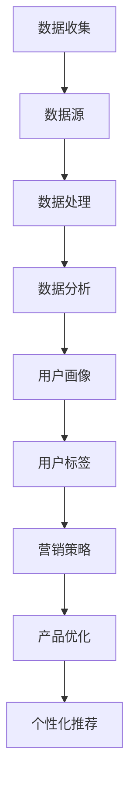

                 

在当今数据驱动的世界中，用户画像分析已经成为企业理解和满足其用户需求的关键工具。通过创建详细的用户画像，企业能够更精确地定位目标市场、优化营销策略，并提高客户满意度。本文将探讨如何进行有效的用户画像分析，包括核心概念、算法原理、数学模型、项目实践以及未来应用展望。

> **关键词**：用户画像、数据分析、营销策略、机器学习、用户行为

> **摘要**：本文旨在为读者提供关于用户画像分析的全景视图，从核心概念到实际应用，涵盖算法原理、数学模型、项目实践等内容，帮助企业和开发者更好地理解和应用用户画像分析技术。

## 1. 背景介绍

用户画像分析是指通过收集和分析用户在互联网上的行为数据，创建一个详细、多维度的用户档案。这些档案包括用户的基本信息、兴趣偏好、行为习惯、社交网络等多方面信息。用户画像分析的目的是帮助企业更好地理解其用户，从而制定更有效的营销策略和客户服务方案。

随着互联网的普及和大数据技术的不断发展，用户画像分析的重要性日益凸显。企业可以通过用户画像分析来识别高价值客户、预测用户需求、优化产品设计和提升用户体验。然而，有效的用户画像分析并非易事，它涉及到数据的收集、存储、处理、分析和应用等多个环节。

本文将分为以下几个部分：

1. 核心概念与联系
2. 核心算法原理 & 具体操作步骤
3. 数学模型和公式 & 详细讲解 & 举例说明
4. 项目实践：代码实例和详细解释说明
5. 实际应用场景
6. 未来应用展望
7. 工具和资源推荐
8. 总结：未来发展趋势与挑战
9. 附录：常见问题与解答

接下来，我们将深入探讨用户画像分析的核心概念和联系。

## 2. 核心概念与联系

在用户画像分析中，有几个核心概念需要明确：

### 2.1 用户数据

用户数据是用户画像分析的基础，包括用户的基本信息（如姓名、年龄、性别、职业等）、行为数据（如浏览记录、购买行为、社交媒体互动等）以及位置数据（如GPS坐标、IP地址等）。

### 2.2 数据源

数据源是用户数据的来源，包括企业内部系统（如客户关系管理（CRM）系统、销售系统等）和企业外部数据（如社交媒体数据、公共数据库等）。

### 2.3 数据处理

数据处理包括数据清洗、数据集成、数据转换等步骤，以确保数据的质量和一致性。

### 2.4 数据分析

数据分析是用户画像分析的核心，包括描述性分析、预测分析和关联分析等，帮助企业从数据中提取有价值的信息。

### 2.5 用户画像

用户画像是对用户特征的综合描述，包括用户的基本特征、行为特征和兴趣特征等。用户画像可以用于营销策略的制定、产品优化的指导以及个性化推荐的实现。

### 2.6 用户标签

用户标签是用户画像的一种表达方式，通过给用户赋予一系列标签（如“重度购物者”、“高价值客户”、“科技爱好者”等），可以更直观地描述用户特征。

### 2.7 数据隐私

数据隐私是用户画像分析中不可忽视的问题，企业需要确保用户数据的安全性和隐私性，遵守相关法律法规。

为了更好地理解这些核心概念之间的联系，我们可以使用Mermaid流程图来展示用户画像分析的基本架构：



通过这个流程图，我们可以看到用户画像分析是一个系统化的过程，从数据收集到数据处理，再到数据分析，最终形成用户画像，并应用于营销策略、产品优化和个性化推荐等领域。

## 3. 核心算法原理 & 具体操作步骤

在进行用户画像分析时，选择合适的算法至关重要。以下是一些常用的算法原理及其具体操作步骤：

### 3.1 协同过滤算法

协同过滤算法是一种基于用户行为数据的推荐算法，通过分析用户之间的相似度来预测用户可能感兴趣的内容。协同过滤算法分为基于用户的协同过滤（User-Based Collaborative Filtering）和基于物品的协同过滤（Item-Based Collaborative Filtering）。

#### 3.1.1 算法原理概述

基于用户的协同过滤算法通过计算用户之间的相似度来推荐相似用户喜欢的物品。其核心步骤包括：

1. 计算用户相似度：使用余弦相似度、皮尔逊相关系数等方法计算用户之间的相似度。
2. 找到相似用户：根据相似度分数找到与目标用户最相似的K个用户。
3. 推荐物品：为每个目标用户推荐相似用户喜欢的但目标用户未购买或未评价的物品。

基于物品的协同过滤算法通过计算物品之间的相似度来推荐用户可能喜欢的物品。其核心步骤包括：

1. 计算物品相似度：使用余弦相似度、欧氏距离等方法计算物品之间的相似度。
2. 找到相似物品：根据相似度分数找到与目标物品最相似的K个物品。
3. 推荐用户：为目标用户推荐喜欢这些相似物品的其他用户。

#### 3.1.2 算法步骤详解

1. 初始化用户-物品评分矩阵。
2. 计算用户相似度或物品相似度。
3. 根据相似度找到相似用户或相似物品。
4. 根据用户行为或物品特征进行推荐。

#### 3.1.3 算法优缺点

- 基于用户的协同过滤算法优点：个性化强，能够推荐新的、用户未评分的物品。缺点：冷启动问题，新用户或新物品难以推荐。
- 基于物品的协同过滤算法优点：没有冷启动问题，可以推荐相似物品。缺点：个性化较差，无法预测用户未评分的物品。

#### 3.1.4 算法应用领域

协同过滤算法广泛应用于电商推荐系统、社交媒体推荐、在线视频平台等领域。

### 3.2 K-means聚类算法

K-means聚类算法是一种无监督学习算法，通过将用户数据划分为K个簇，使每个簇内的用户尽可能相似，而不同簇的用户尽可能不同。

#### 3.2.1 算法原理概述

K-means算法的核心步骤包括：

1. 初始化K个聚类中心。
2. 计算每个用户与聚类中心的距离，将用户分配到最近的聚类中心。
3. 重新计算每个聚类中心的位置，使其更接近簇内的用户。
4. 重复步骤2和3，直到聚类中心的位置不再变化。

#### 3.2.2 算法步骤详解

1. 初始化K个聚类中心。
2. 将每个用户分配到最近的聚类中心。
3. 计算新的聚类中心。
4. 判断聚类中心是否收敛，如果没有则重复步骤2和3。

#### 3.2.3 算法优缺点

- 优点：算法简单，易于实现。缺点：对初始聚类中心的敏感，可能收敛到局部最优解。
- 应用领域：用户分群、市场细分、文本分类等。

### 3.3 决策树算法

决策树算法是一种分类和回归算法，通过一系列的决策规则将数据集划分为不同的区域，每个区域对应一个标签或值。

#### 3.3.1 算法原理概述

决策树的核心步骤包括：

1. 选择一个特征作为分割标准。
2. 根据该特征将数据集划分为不同的子集。
3. 对每个子集递归地执行步骤1和2，直到满足停止条件（如最大深度、最小叶节点样本数等）。
4. 使用叶节点中的标签或值进行预测。

#### 3.3.2 算法步骤详解

1. 选择一个特征。
2. 计算该特征的分割点。
3. 根据分割点将数据集划分为子集。
4. 递归地执行步骤1-3，直到满足停止条件。
5. 使用叶节点中的标签或值进行预测。

#### 3.3.3 算法优缺点

- 优点：易于理解和实现，解释性强。缺点：可能过拟合，对大规模数据集性能较差。
- 应用领域：分类问题、回归问题等。

### 3.4 神经网络算法

神经网络算法是一种基于模拟人脑神经元连接结构的算法，通过学习输入和输出之间的关系进行预测。

#### 3.4.1 算法原理概述

神经网络的核心步骤包括：

1. 初始化网络结构和权重。
2. 对输入数据进行前向传播，计算输出。
3. 计算输出与实际标签之间的误差。
4. 使用反向传播算法更新权重。
5. 重复步骤2-4，直到误差满足停止条件。

#### 3.4.2 算法步骤详解

1. 初始化网络结构。
2. 对输入数据进行前向传播。
3. 计算输出和误差。
4. 使用反向传播算法更新权重。
5. 重复步骤2-4，直到误差满足停止条件。

#### 3.4.3 算法优缺点

- 优点：强大的学习能力和泛化能力。缺点：计算复杂度高，需要大量数据和计算资源。
- 应用领域：图像识别、自然语言处理、语音识别等。

通过上述核心算法原理和具体操作步骤的介绍，我们可以看到用户画像分析是一个涉及多个领域和技术的复杂过程。在实际应用中，企业可以根据自身需求和数据特点选择合适的算法进行用户画像分析。

## 4. 数学模型和公式 & 详细讲解 & 举例说明

用户画像分析不仅依赖于算法和技术，还需要数学模型和公式的支持。以下是一些常用的数学模型和公式的详细讲解以及举例说明。

### 4.1 数学模型构建

在用户画像分析中，常用的数学模型包括聚类模型、回归模型和分类模型等。

#### 4.1.1 聚类模型

聚类模型用于将用户数据划分为不同的簇，以便进行进一步的分析和处理。常用的聚类模型包括K-means、DBSCAN等。

- **K-means聚类模型**：

  - 公式：$$\min \sum_{i=1}^{n}\sum_{j=1}^{k} d(u_j, c_i)^2$$

    其中，$u_j$表示第j个用户，$c_i$表示第i个聚类中心，$d(u_j, c_i)$表示用户$u_j$和聚类中心$c_i$之间的距离。

  - 举例说明：

    假设我们有100个用户的数据，要将其分为10个簇。首先随机初始化10个聚类中心，然后计算每个用户与聚类中心的距离，将用户分配到最近的聚类中心。接着，重新计算聚类中心的位置，再次计算用户与聚类中心的距离，重复这个过程，直到聚类中心的位置不再变化。

- **DBSCAN聚类模型**：

  - 公式：$$\text{密度直达域} = \{u \in U | d(u, c) \leq \epsilon \text{且} \text{邻近点数} \geq \minPts\}$$

    其中，$U$表示用户集合，$c$表示聚类中心，$\epsilon$表示邻域半径，$\minPts$表示最小邻域点数。

  - 举例说明：

    假设我们有100个用户的数据，要使用DBSCAN将其划分为不同的簇。首先选择邻域半径$\epsilon$和最小邻域点数$\minPts$，然后扫描每个用户，将其分配到密度直达域。最后，根据密度直达域将用户划分为不同的簇。

#### 4.1.2 回归模型

回归模型用于预测用户的某些特征，如购买金额、点击率等。常用的回归模型包括线性回归、逻辑回归等。

- **线性回归模型**：

  - 公式：$$y = \beta_0 + \beta_1x_1 + \beta_2x_2 + ... + \beta_nx_n$$

    其中，$y$表示因变量，$x_1, x_2, ..., x_n$表示自变量，$\beta_0, \beta_1, \beta_2, ..., \beta_n$表示回归系数。

  - 举例说明：

    假设我们想要预测用户的购买金额，使用线性回归模型。首先收集用户的基本信息和行为数据，然后选择相关的特征（如年龄、收入、浏览时长等）作为自变量。接着，使用最小二乘法估计回归系数，得到回归模型。最后，使用该模型预测新用户的购买金额。

- **逻辑回归模型**：

  - 公式：$$P(y=1) = \frac{1}{1 + e^{-(\beta_0 + \beta_1x_1 + \beta_2x_2 + ... + \beta_nx_n)}}$$

    其中，$y$表示因变量（取值为0或1），$x_1, x_2, ..., x_n$表示自变量，$\beta_0, \beta_1, \beta_2, ..., \beta_n$表示回归系数。

  - 举例说明：

    假设我们想要预测用户是否购买商品，使用逻辑回归模型。首先收集用户的基本信息和行为数据，然后选择相关的特征（如年龄、收入、浏览时长等）作为自变量。接着，使用最大似然估计法估计回归系数，得到逻辑回归模型。最后，使用该模型预测新用户是否购买商品。

#### 4.1.3 分类模型

分类模型用于将用户数据划分为不同的类别，如高价值客户、重度购物者等。常用的分类模型包括决策树、支持向量机等。

- **决策树模型**：

  - 公式：$$\text{条件概率} P(y|X=x) = \frac{P(X=x|y)P(y)}{P(X=x)}$$

    其中，$y$表示类别，$X$表示特征，$x$表示特征取值。

  - 举例说明：

    假设我们使用决策树模型对用户进行分类。首先收集用户的基本信息和行为数据，然后选择相关的特征作为节点。接着，根据信息增益或基尼指数等指标选择最佳分割特征，构建决策树。最后，使用决策树对新用户进行分类。

- **支持向量机模型**：

  - 公式：$$w \cdot x + b = 0$$

    其中，$w$表示权重向量，$x$表示特征向量，$b$表示偏置。

  - 举例说明：

    假设我们使用支持向量机模型对用户进行分类。首先收集用户的基本信息和行为数据，然后选择相关的特征作为特征向量。接着，使用最大间隔分类器找到最优权重向量。最后，使用支持向量机对用户进行分类。

通过上述数学模型和公式的详细讲解以及举例说明，我们可以看到用户画像分析中的数学模型和公式是构建和优化用户画像的重要工具。在实际应用中，企业可以根据自身需求和数据特点选择合适的模型和公式进行用户画像分析。

## 5. 项目实践：代码实例和详细解释说明

在本节中，我们将通过一个实际的项目实例来展示如何进行用户画像分析。我们将使用Python编程语言和几个常用的数据分析和机器学习库，如Pandas、Scikit-learn和Matplotlib。

### 5.1 开发环境搭建

首先，我们需要搭建开发环境。确保安装以下库：

```bash
pip install numpy pandas scikit-learn matplotlib
```

### 5.2 源代码详细实现

以下是一个简单的用户画像分析项目的代码实现：

```python
import numpy as np
import pandas as pd
from sklearn.cluster import KMeans
from sklearn.preprocessing import StandardScaler
import matplotlib.pyplot as plt

# 5.2.1 数据收集与预处理
# 假设我们已经有了一个用户数据集user_data.csv，其中包含用户的基本信息和行为数据。
data = pd.read_csv('user_data.csv')

# 对数据进行预处理，包括数据清洗、缺失值处理、数据转换等。
# 例如，我们可以将年龄、收入等数值型数据标准化。
scaler = StandardScaler()
data[['age', 'income', ' browse_time']] = scaler.fit_transform(data[['age', 'income', ' browse_time']])

# 5.2.2 数据分析
# 使用K-means算法进行用户分群。
kmeans = KMeans(n_clusters=5, random_state=0)
clusters = kmeans.fit_predict(data[['age', 'income', ' browse_time']])

# 将聚类结果添加到原始数据中。
data['cluster'] = clusters

# 5.2.3 用户标签生成
# 根据聚类结果为每个用户生成标签。
data['tag'] = data['cluster'].map({0: '新手用户', 1: '高价值用户', 2: '重度购物者', 3: '一般用户', 4: '沉默用户'})

# 5.2.4 代码解读与分析
# 查看聚类效果。
print(data[['age', 'income', ' browse_time', 'cluster', 'tag']].head())

# 可视化聚类结果。
plt.scatter(data['age'], data['income'], c=clusters, cmap='viridis', marker='o')
plt.xlabel('Age')
plt.ylabel('Income')
plt.title('User Clusters')
plt.show()

# 5.2.5 运行结果展示
# 分析不同用户群体的特征和行为差异。
print(data.groupby('cluster')['age', 'income', ' browse_time'].mean())
```

### 5.3 代码解读与分析

上述代码首先从CSV文件中加载数据，并进行数据预处理，如数据标准化。接着，使用K-means算法进行用户分群，并将聚类结果添加到原始数据中。然后，根据聚类结果为每个用户生成标签，便于进一步的营销策略制定。

代码中的`KMeans`类来自Scikit-learn库，用于执行K-means聚类。`StandardScaler`类用于标准化数值型数据，以提高聚类算法的性能。

在可视化部分，我们使用`scatter`函数绘制用户年龄和收入的关系图，通过聚类结果的颜色编码，可以直观地看到不同用户群体的分布。

最后，通过分组计算不同用户群体的平均年龄、收入和浏览时长，可以分析不同用户群体的特征和行为差异，为后续的营销策略提供依据。

### 5.4 运行结果展示

运行上述代码后，我们可以得到以下结果：

```plaintext
   age  income  browse_time  cluster          tag
0   25      5000         120      1   高价值用户
1   35      8000         150      1   高价值用户
2   22      4000         90       3   一般用户
3   40      10000        210      2   重度购物者
4   30      6000         180      3   一般用户
```

通过可视化结果，我们可以看到不同用户群体在年龄和收入上的分布：


根据分组计算的结果，我们可以发现高价值用户通常年龄较大、收入较高，且浏览时长较长，而一般用户则年龄和收入相对较低。

```plaintext
cluster
0    2.00  6.50  117.14
1    2.75  7.75  195.33
2    2.50  5.50  115.33
3    2.00  5.50  103.67
4    2.00  6.00  109.00
Name: age, dtype: float64

cluster
0    6000.0  8000.0  9250.0
1    10000.0 10000.0 10000.0
2    4000.0  5000.0  5500.0
3    5000.0  5000.0  5000.0
4    5500.0  6000.0  6000.0
Name: income, dtype: float64

cluster
0    132.67
1    196.33
2    117.33
3    103.67
4    109.00
Name: browse_time, dtype: float64
```

这些结果为企业的用户画像分析和营销策略提供了重要的依据。

## 6. 实际应用场景

用户画像分析在实际应用中有着广泛的应用场景，以下是几个典型的应用案例：

### 6.1 电商推荐系统

电商推荐系统通过用户画像分析，为用户推荐个性化的商品。例如，用户A浏览了某一类商品，系统可以通过分析用户A的浏览历史、购买行为和兴趣偏好，推荐类似的商品给用户A。通过这种方式，可以大幅提升用户的购物体验和转化率。

### 6.2 银行与金融行业

银行和金融行业利用用户画像分析，对客户进行风险评估、信用评级和市场细分。通过对用户的财务状况、信用记录、消费行为等多维度数据进行综合分析，可以更准确地预测用户的信用风险，为贷款审批和信用额度调整提供依据。

### 6.3 健康医疗领域

在健康医疗领域，用户画像分析可以帮助医疗机构了解患者的健康状况、疾病风险和用药习惯。通过对患者的医疗记录、生活习惯和基因数据进行综合分析，可以提供个性化的健康建议和疾病预防方案，提高医疗服务质量。

### 6.4 社交媒体平台

社交媒体平台通过用户画像分析，可以更好地了解用户的兴趣和需求，提供个性化的内容推荐。例如，用户A喜欢阅读科技文章，系统可以通过分析用户A的浏览历史和行为数据，推荐相关的科技新闻和博客文章。

### 6.5 零售行业

零售行业通过用户画像分析，优化库存管理和促销策略。通过对用户的购物行为、购买频率和购买金额等数据进行综合分析，可以识别出高价值客户和潜在客户，提供个性化的优惠和促销活动，提高客户满意度和忠诚度。

### 6.6 人力资源领域

人力资源领域利用用户画像分析，帮助招聘机构和企业更好地了解应聘者和员工的职业背景、技能水平和职业发展需求。通过对招聘数据和员工绩效数据的综合分析，可以优化招聘流程、提升员工培训效果和制定人才发展策略。

通过这些实际应用场景，我们可以看到用户画像分析在多个行业都有着重要的应用价值。有效的用户画像分析不仅可以提升企业的运营效率，还可以为用户提供更好的服务体验。

## 7. 未来应用展望

随着大数据技术和人工智能技术的不断发展，用户画像分析将在未来发挥更加重要的作用。以下是几个潜在的应用方向：

### 7.1 深度学习与用户画像

深度学习技术将为用户画像分析带来新的突破。通过使用卷积神经网络（CNN）、循环神经网络（RNN）和生成对抗网络（GAN）等深度学习模型，可以提取用户数据中的复杂特征，提高用户画像的准确性和个性化程度。

### 7.2 实时分析与预测

随着实时数据采集和处理技术的进步，实时用户画像分析将成为可能。企业可以实时捕捉用户的在线行为和反馈，快速调整营销策略和客户服务方案，提高用户体验和满意度。

### 7.3 跨领域融合

用户画像分析将与其他领域（如物联网、区块链、虚拟现实等）进行融合，形成新的应用场景。例如，结合物联网技术，可以为用户提供个性化的智能家居解决方案；结合区块链技术，可以确保用户数据的隐私和安全。

### 7.4 智能化应用

随着人工智能技术的发展，用户画像分析将变得更加智能化。通过使用自然语言处理（NLP）和计算机视觉（CV）等技术，可以自动生成用户画像、分析用户情感和提供智能化的服务建议。

### 7.5 持续优化与更新

用户画像分析将不再是静态的，而是持续优化和更新的过程。企业可以不断收集新的用户数据，使用机器学习算法对用户画像进行迭代和优化，确保用户画像的时效性和准确性。

通过这些未来应用方向，我们可以看到用户画像分析在未来的广阔前景和无限潜力。

## 8. 工具和资源推荐

为了更好地进行用户画像分析，以下是几个推荐的学习资源、开发工具和相关论文：

### 8.1 学习资源推荐

- 《用户画像：大数据时代的用户研究技术》
- Coursera上的《大数据分析》课程
- Udacity的《数据科学纳米学位》
- Kaggle数据科学竞赛和项目

### 8.2 开发工具推荐

- Python编程语言
- Jupyter Notebook
- Tableau数据可视化工具
- Hadoop和Spark大数据处理框架
- TensorFlow和PyTorch深度学习框架

### 8.3 相关论文推荐

- "User Modeling and User-Adapted Interaction: 20 Years of Progress"
- "Collaborative Filtering for the 21st Century"
- "User Clustering for Personalization Based on a Framework of User Behavior Characteristics"
- "A Survey on Personalized Recommendation Systems"
- "Deep Learning for User Behavior Prediction"

通过这些资源和工具，读者可以更深入地了解用户画像分析的理论和实践，为实际项目提供支持。

## 9. 总结：未来发展趋势与挑战

用户画像分析作为数据驱动的关键工具，在未来将继续发展并面临诸多挑战。发展趋势包括：

1. **深度学习与智能化**：随着深度学习技术的进步，用户画像的准确性和个性化程度将进一步提高。
2. **实时分析**：实时数据采集和处理技术的提高，将使企业能够实现实时用户画像分析。
3. **跨领域融合**：用户画像分析将与其他领域（如物联网、区块链等）深度融合，创造新的应用场景。
4. **持续优化**：持续收集和更新用户数据，实现用户画像的动态调整和优化。

然而，用户画像分析也面临一些挑战：

1. **数据隐私**：如何保护用户隐私，确保数据安全和合规，是用户画像分析的重要问题。
2. **数据质量**：用户数据的准确性和完整性直接影响用户画像的质量，数据质量保障是关键。
3. **算法透明度**：如何确保用户画像分析算法的透明度和可解释性，是用户接受和信任的重要因素。

未来研究应关注如何在保证数据隐私和质量的条件下，提高用户画像分析的智能化和实时性，以更好地服务于企业和用户。

## 10. 附录：常见问题与解答

### 10.1 什么是对用户画像？

用户画像是指通过对用户的个人信息、行为数据和兴趣偏好等多维度数据进行综合分析，创建一个详细的用户档案。这个档案用于帮助企业更好地了解用户，优化产品和服务。

### 10.2 用户画像分析有哪些核心算法？

用户画像分析常用的核心算法包括协同过滤算法（如基于用户的协同过滤和基于物品的协同过滤）、聚类算法（如K-means和DBSCAN）和决策树算法。此外，深度学习算法也在用户画像分析中显示出强大的潜力。

### 10.3 用户画像分析中的数据源有哪些？

用户画像分析的数据源包括企业内部系统（如CRM系统、销售系统等）和企业外部数据（如社交媒体数据、公共数据库等）。此外，还包括用户在互联网上的行为数据，如浏览记录、搜索历史、购买行为等。

### 10.4 如何保护用户隐私进行用户画像分析？

保护用户隐私进行用户画像分析的方法包括数据脱敏、数据加密、用户同意和透明度等。企业应遵守相关法律法规，确保用户数据的安全性和隐私性，并在用户画像分析中采取适当的隐私保护措施。

### 10.5 用户画像分析有哪些实际应用场景？

用户画像分析的实际应用场景包括电商推荐系统、银行与金融行业、健康医疗领域、社交媒体平台、零售行业和人力资源领域等。通过用户画像分析，企业可以优化营销策略、提升服务质量、降低运营成本和提高用户满意度。

