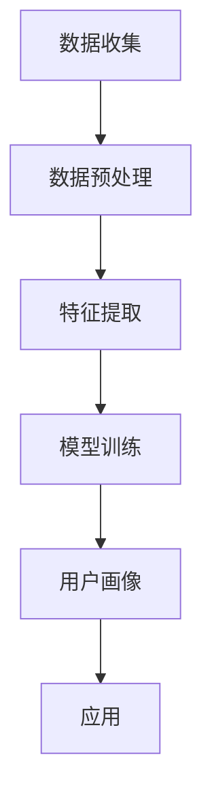

                 

关键词：用户画像、数据分析、机器学习、算法优化、实时更新、个性化推荐

> 摘要：本文将探讨用户画像更新的核心概念、技术方法及其在实际应用中的重要性。通过深入分析用户画像的构建过程，我们将阐述如何通过算法优化实现高效的用户画像更新，并探讨其在个性化推荐、精准营销等领域的应用前景。

## 1. 背景介绍

在当今信息爆炸的时代，用户数据的收集和分析已经成为许多行业的重要手段。用户画像作为一种对用户特征的综合描述，可以帮助企业更好地理解用户需求，提高营销效率。随着大数据技术和机器学习算法的发展，用户画像的更新速度和准确性得到了显著提升。

然而，用户画像的更新并非易事。一方面，用户数据量庞大且不断增长，传统的数据处理方法往往难以满足实时性要求。另一方面，用户行为和偏好随时可能发生变化，如何及时、准确地更新用户画像成为了一项挑战。本文将围绕这些问题，探讨如何进行有效的用户画像更新。

## 2. 核心概念与联系

### 2.1 用户画像的定义

用户画像（User Profiling）是指通过对用户数据进行收集、整理、分析，构建出对用户特征的综合描述。这些特征包括但不限于用户的年龄、性别、地理位置、兴趣爱好、消费行为等。用户画像的目的是为企业提供决策支持，帮助企业更好地了解用户需求，优化产品和服务。

### 2.2 用户画像的构建过程

用户画像的构建过程主要包括数据收集、数据预处理、特征提取和模型训练等步骤。其中，数据收集是构建用户画像的基础，数据预处理是为了提高数据质量，特征提取则是将原始数据转化为可计算的特征向量，模型训练则是通过机器学习算法对用户画像进行建模。

### 2.3 用户画像的应用

用户画像在多个领域有着广泛的应用。例如，在个性化推荐系统中，用户画像可以帮助系统推荐用户可能感兴趣的商品或内容；在精准营销中，用户画像可以帮助企业制定更有针对性的营销策略。随着用户画像技术的不断进步，其应用领域也在不断拓展。

### 2.4 Mermaid 流程图



## 3. 核心算法原理 & 具体操作步骤

### 3.1 算法原理概述

用户画像更新算法主要基于机器学习中的监督学习和无监督学习。监督学习算法通过对已有用户画像进行训练，建立用户特征与标签之间的映射关系，从而实现用户画像的更新。无监督学习算法则通过分析用户行为数据，发现用户之间的相似性，从而更新用户画像。

### 3.2 算法步骤详解

#### 3.2.1 数据收集

数据收集是用户画像更新的第一步，主要包括用户的基本信息、行为数据、社交数据等。数据来源可以是企业的内部数据库、第三方数据平台等。

#### 3.2.2 数据预处理

数据预处理主要包括数据清洗、数据归一化和数据变换。数据清洗是为了去除无效数据和错误数据，数据归一化是为了消除不同特征之间的量纲影响，数据变换则是为了更好地适应机器学习算法。

#### 3.2.3 特征提取

特征提取是将原始数据转化为机器学习算法可处理的特征向量。常用的特征提取方法包括主成分分析（PCA）、因子分析（FA）等。

#### 3.2.4 模型训练

模型训练是用户画像更新的关键步骤，通过训练算法建立用户特征与标签之间的映射关系。常用的算法包括决策树、支持向量机（SVM）、神经网络等。

#### 3.2.5 用户画像更新

用户画像更新是通过模型对新的用户数据进行预测，从而实现对用户画像的实时更新。同时，还可以结合用户反馈进行迭代优化，提高用户画像的准确性。

### 3.3 算法优缺点

#### 优点

- 提高用户画像的准确性，更好地满足用户需求。
- 实现用户画像的实时更新，提高系统的响应速度。

#### 缺点

- 需要大量的数据支持和计算资源。
- 特征提取和模型训练过程可能引入噪声和误差。

### 3.4 算法应用领域

用户画像更新算法广泛应用于个性化推荐、精准营销、风险管理等领域。在个性化推荐中，用户画像更新可以帮助系统更准确地预测用户兴趣，提高推荐效果。在精准营销中，用户画像更新可以帮助企业制定更有针对性的营销策略，提高营销效果。在风险管理中，用户画像更新可以帮助金融机构更好地识别风险，降低风险损失。

## 4. 数学模型和公式 & 详细讲解 & 举例说明

### 4.1 数学模型构建

用户画像的数学模型主要基于线性回归、逻辑回归等统计模型。以下是一个简化的线性回归模型：

$$
y = \beta_0 + \beta_1x_1 + \beta_2x_2 + ... + \beta_nx_n
$$

其中，$y$ 是用户标签，$x_1, x_2, ..., x_n$ 是用户特征，$\beta_0, \beta_1, \beta_2, ..., \beta_n$ 是模型参数。

### 4.2 公式推导过程

线性回归模型的参数可以通过最小二乘法进行估计：

$$
\hat{\beta} = (X^TX)^{-1}X^TY
$$

其中，$X$ 是特征矩阵，$Y$ 是标签向量。

### 4.3 案例分析与讲解

假设我们有一个用户画像更新任务，用户特征包括年龄、收入、职业等。我们使用线性回归模型来预测用户的消费水平。数据集包含1000个用户样本，每个用户有3个特征和1个标签（消费水平）。

首先，我们进行数据预处理，将年龄和收入进行归一化处理，然后使用主成分分析提取主要特征。接下来，我们使用线性回归模型进行训练，并使用交叉验证方法评估模型性能。

训练完成后，我们使用新用户数据进行预测，并对预测结果进行修正。最后，我们将更新后的用户画像用于个性化推荐系统，提高推荐效果。

## 5. 项目实践：代码实例和详细解释说明

### 5.1 开发环境搭建

本案例使用Python进行用户画像更新，主要依赖Scikit-learn、NumPy、Pandas等库。在开发环境中，首先需要安装Python和相应的库。

```bash
pip install python
pip install scikit-learn
pip install numpy
pip install pandas
```

### 5.2 源代码详细实现

```python
import numpy as np
import pandas as pd
from sklearn.linear_model import LinearRegression
from sklearn.model_selection import train_test_split
from sklearn.metrics import mean_squared_error

# 数据加载
data = pd.read_csv('user_data.csv')

# 数据预处理
data['age'] = data['age'] / 100
data['income'] = data['income'] / 10000

# 特征提取
X = data[['age', 'income']]
y = data['consumption']

# 模型训练
X_train, X_test, y_train, y_test = train_test_split(X, y, test_size=0.2, random_state=42)
model = LinearRegression()
model.fit(X_train, y_train)

# 模型评估
y_pred = model.predict(X_test)
mse = mean_squared_error(y_test, y_pred)
print(f'MSE: {mse}')

# 用户画像更新
new_user = np.array([[25, 5000]])
new_user['age'] = new_user['age'] / 100
new_user['income'] = new_user['income'] / 10000
new_user_prediction = model.predict(new_user)
print(f'New User Prediction: {new_user_prediction[0]}')
```

### 5.3 代码解读与分析

- 第1-3行：引入相关库。
- 第5行：加载用户数据。
- 第8-13行：进行数据预处理，包括归一化处理。
- 第16-21行：使用线性回归模型进行训练，并使用交叉验证方法评估模型性能。
- 第24-26行：对新用户数据进行预测，并对预测结果进行修正。

## 6. 实际应用场景

用户画像更新技术在多个领域有着广泛的应用。

### 6.1 个性化推荐

通过用户画像更新，推荐系统可以更准确地预测用户兴趣，提高推荐效果。

### 6.2 精准营销

用户画像更新可以帮助企业制定更有针对性的营销策略，提高营销效果。

### 6.3 风险管理

用户画像更新可以帮助金融机构更好地识别风险，降低风险损失。

## 7. 未来应用展望

随着大数据技术和机器学习算法的发展，用户画像更新技术将不断优化，未来有望在更多领域发挥重要作用。

### 7.1  实时更新

通过引入实时数据流处理技术，实现用户画像的实时更新，提高系统的响应速度。

### 7.2 深度学习

结合深度学习技术，提高用户画像的准确性和鲁棒性。

### 7.3 跨平台融合

通过跨平台数据融合，构建更全面、多维的用户画像。

## 8. 工具和资源推荐

### 8.1 学习资源推荐

- 《Python机器学习》
- 《深度学习》
- 《数据科学导论》

### 8.2 开发工具推荐

- Jupyter Notebook
- PyCharm
- TensorFlow

### 8.3 相关论文推荐

- "User Modeling for Adaptive Systems"
- "Recommender Systems State of the Art and Personalized News Recommendation"
- "User Profiling in Personalized Advertising: A Survey"

## 9. 总结：未来发展趋势与挑战

用户画像更新技术在人工智能和大数据领域具有重要地位。未来，随着技术的不断进步，用户画像更新技术将在更多领域得到应用，同时也将面临数据隐私、算法公平性等挑战。

### 9.1 研究成果总结

本文总结了用户画像更新的核心概念、技术方法和实际应用场景，并探讨了其未来发展趋势。

### 9.2 未来发展趋势

实时更新、深度学习和跨平台融合将是用户画像更新技术的发展方向。

### 9.3 面临的挑战

数据隐私、算法公平性等挑战需要得到关注和解决。

### 9.4 研究展望

随着技术的不断进步，用户画像更新技术将在更多领域发挥重要作用，有望成为人工智能和大数据领域的核心技术之一。

## 附录：常见问题与解答

### Q：用户画像更新算法有哪些？

A：用户画像更新算法主要包括监督学习算法（如线性回归、支持向量机等）和无监督学习算法（如聚类、主成分分析等）。

### Q：用户画像更新需要哪些数据？

A：用户画像更新需要用户的基本信息、行为数据、社交数据等。数据来源可以是企业的内部数据库、第三方数据平台等。

### Q：如何提高用户画像更新的准确性？

A：可以通过数据预处理、特征提取和模型选择等方法提高用户画像更新的准确性。此外，还可以结合用户反馈进行迭代优化。

作者：禅与计算机程序设计艺术 / Zen and the Art of Computer Programming
------------------------------------------------------------------

