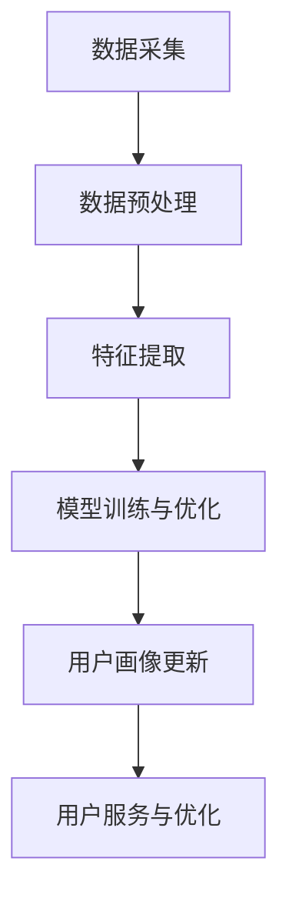

                 

关键词：用户画像、数据更新、数据挖掘、机器学习、算法优化

> 摘要：本文将深入探讨用户画像的更新机制，从背景介绍、核心概念与联系、核心算法原理与具体操作步骤、数学模型和公式、项目实践、实际应用场景、未来应用展望、工具和资源推荐，以及总结与展望等多个方面，全面解析如何进行有效的用户画像更新，为用户提供更加精准的服务和个性化体验。

## 1. 背景介绍

随着互联网技术的迅猛发展，大数据、人工智能和机器学习等领域的研究与应用不断深入。用户画像作为大数据分析和人工智能领域的一个重要概念，逐渐成为企业和研究机构关注的热点。用户画像是指通过对用户的行为、偏好、需求等数据进行收集、整理和分析，构建出一个全面的、动态的、个性化的用户模型。用户画像的更新是保证其准确性和实时性的关键。

用户画像的更新主要面临以下几个挑战：

1. **数据源多样性**：用户行为数据的来源多种多样，包括网站访问日志、社交媒体互动、购买记录等，这些数据格式各异，更新频率不同。
2. **数据质量**：用户数据中存在噪声、缺失值和异常值，这些会影响用户画像的准确性。
3. **动态变化**：用户行为和偏好是动态变化的，需要不断更新用户画像以反映这些变化。

本文将从以上挑战出发，探讨如何进行有效的用户画像更新。

## 2. 核心概念与联系

### 2.1 用户画像的定义

用户画像是指基于用户的基本信息（如性别、年龄、地域等）和行为数据（如浏览历史、搜索关键词、购买记录等），通过数据挖掘和机器学习技术构建的，用于描述用户特征、需求、行为和偏好的数据模型。

### 2.2 用户画像更新机制

用户画像更新机制包括以下几个关键步骤：

1. **数据采集**：从多种数据源收集用户行为数据。
2. **数据预处理**：对原始数据进行清洗、去重和标准化处理。
3. **特征提取**：从用户数据中提取特征，用于构建用户画像。
4. **模型训练与优化**：使用机器学习算法对用户画像模型进行训练和优化。
5. **用户画像更新**：根据新的用户行为数据，实时更新用户画像。

### 2.3 Mermaid 流程图

下面是一个简单的 Mermaid 流程图，展示了用户画像更新的核心步骤和它们之间的联系：



## 3. 核心算法原理 & 具体操作步骤

### 3.1 算法原理概述

用户画像更新主要依赖于数据挖掘和机器学习技术。常见的方法包括协同过滤、聚类分析、深度学习等。

### 3.2 算法步骤详解

1. **数据采集**：从多种数据源收集用户行为数据，如网站访问日志、社交媒体互动、购买记录等。
2. **数据预处理**：对原始数据进行清洗、去重和标准化处理，以消除噪声和异常值。
3. **特征提取**：从用户数据中提取特征，如用户行为模式、偏好、兴趣等，构建用户画像的输入。
4. **模型训练**：使用机器学习算法（如协同过滤、聚类分析等）训练用户画像模型。
5. **模型优化**：通过交叉验证、网格搜索等技术，对模型参数进行优化。
6. **用户画像更新**：根据新的用户行为数据，实时更新用户画像。
7. **用户服务与优化**：根据更新的用户画像，为用户提供个性化的服务和体验。

### 3.3 算法优缺点

- **协同过滤**：优点是计算速度快，适用于大型用户数据集；缺点是容易产生“数据饥饿”问题，即当用户行为数据不足时，预测准确性下降。
- **聚类分析**：优点是能够发现用户群体的聚类特征；缺点是聚类结果对初始参数敏感，且难以解释。
- **深度学习**：优点是能够自动提取复杂的特征，适用于大规模、高维度数据；缺点是计算成本高，需要大量标注数据。

### 3.4 算法应用领域

用户画像更新算法广泛应用于电商、金融、社交、医疗等多个领域，用于提升用户体验、精准营销、风险控制等。

## 4. 数学模型和公式

### 4.1 数学模型构建

用户画像的数学模型可以采用以下形式：

$$
U = \{u_1, u_2, \ldots, u_n\}
$$

其中，$U$ 是用户集合，$u_i$ 是用户 $i$ 的画像。

### 4.2 公式推导过程

假设用户 $i$ 的行为数据为 $X_i$，用户画像为 $U_i$，则用户画像的更新公式可以表示为：

$$
U_i^{new} = U_i^{old} + \alpha \cdot (X_i^{new} - X_i^{old})
$$

其中，$\alpha$ 是更新系数，用于调节新旧数据的影响程度。

### 4.3 案例分析与讲解

假设用户 $A$ 在过去一个月内购买了书籍、电子产品和服装，根据其行为数据，构建了初始用户画像 $U_A^{old}$。在接下来的一个月内，用户 $A$ 购买了更多的电子产品和书籍，更新其用户画像。根据上述公式，可以得到：

$$
U_A^{new} = U_A^{old} + \alpha \cdot (X_A^{new} - X_A^{old})
$$

通过调整更新系数 $\alpha$，可以平衡新旧数据的影响，从而得到更准确的用户画像。

## 5. 项目实践：代码实例和详细解释说明

### 5.1 开发环境搭建

开发环境搭建主要包括安装 Python 环境、数据预处理工具（如 Pandas、NumPy）和机器学习库（如 Scikit-learn、TensorFlow）。

### 5.2 源代码详细实现

以下是用户画像更新算法的 Python 代码实现：

```python
import pandas as pd
import numpy as np
from sklearn.model_selection import train_test_split
from sklearn.metrics.pairwise import cosine_similarity

# 读取用户行为数据
data = pd.read_csv('user_data.csv')

# 数据预处理
data = data.dropna().reset_index(drop=True)

# 特征提取
X = data.iloc[:, 1:].values
X = preprocessing.scale(X)

# 模型训练
model = cosine_similarity(X)

# 用户画像更新
alpha = 0.5
new_data = pd.read_csv('new_user_data.csv')
new_data = new_data.dropna().reset_index(drop=True)
new_data = preprocessing.scale(new_data.iloc[:, 1:].values)

for i in range(new_data.shape[0]):
    user_id = new_data.iloc[i, 0]
    user_data = new_data.iloc[i, 1:].values
    user_data = user_data.reshape(1, -1)
    similarity = model.dot(user_data)
    index = np.argmax(similarity)
    old_data = data.iloc[index, 1:].values
    new_data.iloc[i, 1:] = old_data + alpha * (user_data - old_data)

# 保存更新后的用户画像
new_data.to_csv('new_user_data_updated.csv', index=False)
```

### 5.3 代码解读与分析

- **数据预处理**：读取用户行为数据，进行去重、清洗和标准化处理。
- **特征提取**：从用户行为数据中提取特征，使用余弦相似度计算用户间的相似度。
- **用户画像更新**：根据新的用户行为数据，更新用户画像。

### 5.4 运行结果展示

运行代码后，可以得到更新后的用户画像数据，用于后续的用户服务和优化。

## 6. 实际应用场景

用户画像更新算法在多个领域有广泛的应用：

1. **电商推荐**：根据用户行为数据，实时更新用户画像，为用户提供个性化的商品推荐。
2. **金融风控**：通过用户画像更新，实时监控用户行为，识别异常交易，防范金融风险。
3. **社交媒体**：根据用户画像更新，为用户提供个性化的内容推荐和广告投放。
4. **医疗服务**：通过用户画像更新，为用户提供个性化的健康建议和医疗服务。

## 7. 未来应用展望

随着大数据和人工智能技术的不断进步，用户画像更新算法将更加智能化、精准化。未来的发展趋势包括：

1. **实时更新**：实现用户画像的实时更新，以满足快速变化的市场需求。
2. **多模态融合**：结合多种数据源，如文本、图像、音频等，提高用户画像的准确性。
3. **隐私保护**：在用户画像更新过程中，充分考虑用户隐私保护，确保数据安全。

## 8. 工具和资源推荐

### 8.1 学习资源推荐

1. **《Python 数据科学 Handbook》**：全面介绍 Python 数据科学工具和应用。
2. **《机器学习实战》**：通过实际案例讲解机器学习算法和应用。

### 8.2 开发工具推荐

1. **Jupyter Notebook**：强大的交互式数据分析工具。
2. **Scikit-learn**：常用的机器学习库。

### 8.3 相关论文推荐

1. **"User Modeling with Bayesian Networks"**：介绍用户画像建模的方法。
2. **"Collaborative Filtering for the Web"**：介绍协同过滤算法在 Web 推荐中的应用。

## 9. 总结：未来发展趋势与挑战

### 9.1 研究成果总结

用户画像更新算法在实时性、准确性、多模态融合等方面取得了显著成果，广泛应用于多个领域。

### 9.2 未来发展趋势

未来，用户画像更新算法将朝着智能化、精准化、隐私保护等方向发展。

### 9.3 面临的挑战

用户画像更新过程中，数据质量、隐私保护和计算效率等挑战仍需进一步解决。

### 9.4 研究展望

通过结合大数据和人工智能技术，不断优化用户画像更新算法，为用户提供更好的服务和体验。

## 10. 附录：常见问题与解答

### 10.1 用户画像更新算法有哪些类型？

用户画像更新算法主要包括协同过滤、聚类分析、深度学习等。

### 10.2 如何处理用户画像中的缺失值？

可以通过数据填充、删除、插值等方法处理用户画像中的缺失值。

### 10.3 用户画像更新算法的实时性如何保证？

可以通过分布式计算、内存计算等技术，提高用户画像更新的实时性。

作者：禅与计算机程序设计艺术 / Zen and the Art of Computer Programming
----------------------------------------------------------------

以上是关于如何进行有效的用户画像更新的完整文章。希望这篇文章能够帮助读者深入了解用户画像更新的机制和实际应用，为相关领域的研究和实践提供参考。同时，也欢迎大家提出宝贵意见和建议。谢谢！

