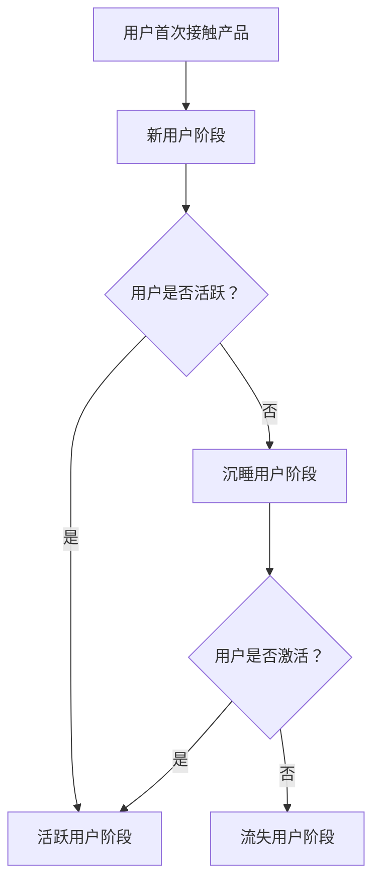

                 

用户留存是现代互联网企业关注的重点之一。用户留存率直接关系到企业的盈利能力、市场份额和品牌价值。在这篇文章中，我们将探讨如何通过技术手段进行有效的用户留存。本文将分为以下几个部分：

## 1. 背景介绍

用户留存是指用户在一定时间内持续使用某个产品或服务的比例。用户留存率是衡量产品或服务受欢迎程度和用户忠诚度的重要指标。高用户留存率意味着产品能够满足用户需求，保持用户活跃，从而为企业带来持续收益。

在互联网时代，用户的选择越来越多样化，如何吸引并留住用户成为企业面临的重大挑战。用户留存不仅关系到产品的用户体验，还涉及到市场策略、运营管理等多个方面。

## 2. 核心概念与联系

在进行用户留存研究时，我们需要了解以下几个核心概念：

### 2.1 用户生命周期

用户生命周期是指用户从接触产品到退出产品的整个过程。它包括以下几个阶段：

- **新用户阶段**：用户首次接触产品，了解产品功能和价值。
- **活跃用户阶段**：用户频繁使用产品，对产品产生依赖。
- **沉睡用户阶段**：用户使用频率降低，但仍有可能重新激活。
- **流失用户阶段**：用户彻底停止使用产品。

### 2.2 用户行为分析

用户行为分析是指通过对用户在产品中的操作行为进行分析，了解用户需求和偏好，从而优化产品功能和体验。用户行为分析主要包括以下几个方面的内容：

- **用户留存率**：衡量用户在一定时间内持续使用产品的比例。
- **用户活跃度**：衡量用户在产品中的活跃程度，如登录次数、使用时长等。
- **用户流失率**：衡量用户在一定时间内停止使用产品的比例。
- **用户活跃度分布**：分析不同用户群体的活跃度差异。

### 2.3 数据驱动决策

数据驱动决策是指通过收集、分析和利用数据，为产品运营、市场营销等决策提供依据。在用户留存方面，数据驱动决策可以帮助我们：

- **发现用户问题**：通过分析用户行为数据，发现用户在产品使用过程中遇到的问题，如界面复杂、功能不完善等。
- **优化产品体验**：根据用户需求和行为习惯，优化产品功能和界面设计，提高用户留存率。
- **调整市场策略**：通过分析用户数据，调整市场推广策略，提高用户获取和留存效果。

## 2.4 Mermaid 流程图（用户留存流程）



## 3. 核心算法原理 & 具体操作步骤

### 3.1 算法原理概述

用户留存算法的核心目标是预测用户是否会在未来的一段时间内流失，并根据预测结果采取相应的措施，如推送个性化内容、发送优惠活动等，以提高用户留存率。

常用的用户留存算法包括以下几种：

- **逻辑回归**：通过分析用户行为数据，建立用户流失预测模型。
- **决策树**：根据用户行为特征，划分用户群体，预测用户流失概率。
- **随机森林**：集成多个决策树，提高预测准确性。
- **神经网络**：通过多层神经网络，自动提取用户行为特征，进行用户流失预测。

### 3.2 算法步骤详解

#### 3.2.1 数据收集

收集用户行为数据，包括登录次数、使用时长、页面浏览量、操作频率等。

#### 3.2.2 数据预处理

- **数据清洗**：去除异常值、缺失值等，保证数据质量。
- **特征工程**：提取用户行为特征，如用户活跃度、用户留存周期等。
- **数据标准化**：对数据进行归一化或标准化处理，消除不同特征之间的尺度差异。

#### 3.2.3 模型选择

根据数据特点和业务需求，选择合适的用户留存预测模型。

#### 3.2.4 模型训练

使用训练集对模型进行训练，调整模型参数，提高预测准确性。

#### 3.2.5 模型评估

使用测试集对模型进行评估，计算预测准确率、召回率等指标。

#### 3.2.6 模型部署

将训练好的模型部署到生产环境，进行实时预测和推送。

### 3.3 算法优缺点

#### 优点：

- **高效性**：用户留存算法能够快速预测用户流失概率，为企业提供实时数据支持。
- **可扩展性**：用户留存算法可以应用于各种类型的产品和服务，具有广泛的适用性。
- **个性化**：通过分析用户行为数据，可以提供个性化的推送和优惠，提高用户留存率。

#### 缺点：

- **数据依赖性**：用户留存算法依赖于大量的用户行为数据，数据质量直接影响算法效果。
- **复杂度高**：用户留存算法涉及多种模型和算法，实现和部署过程较为复杂。
- **模型更新**：用户行为数据不断变化，需要定期更新模型，以保证预测准确性。

### 3.4 算法应用领域

用户留存算法广泛应用于电子商务、在线教育、社交网络、游戏等领域。例如：

- **电子商务**：通过用户留存算法，预测用户流失风险，提供个性化推荐和优惠，提高用户购物体验。
- **在线教育**：通过用户留存算法，识别潜在流失用户，提供针对性的学习建议和辅导，提高用户学习效果。
- **社交网络**：通过用户留存算法，分析用户活跃度，优化产品功能和界面设计，提高用户活跃度。

## 4. 数学模型和公式 & 详细讲解 & 举例说明

### 4.1 数学模型构建

用户留存率可以表示为：

$$
L(t) = \frac{N(t) - N(t_0)}{N(t_0)}
$$

其中，$L(t)$ 表示时间 $t$ 时的用户留存率，$N(t)$ 表示时间 $t$ 时的用户数量，$N(t_0)$ 表示初始用户数量。

### 4.2 公式推导过程

用户留存率可以通过以下公式进行推导：

$$
L(t) = \frac{1}{N(t_0)} \sum_{i=1}^{N(t_0)} I_i(t)
$$

其中，$I_i(t)$ 表示用户 $i$ 在时间 $t$ 是否留存（1 表示留存，0 表示未留存）。

### 4.3 案例分析与讲解

假设我们有一个在线教育平台，初始用户数量为 1000 人。通过用户留存率公式，我们可以计算出不同时间点的用户留存率。

- **第1天**：用户留存率 $L(1) = 0.9$，表示有 900 人留存。
- **第7天**：用户留存率 $L(7) = 0.6$，表示有 600 人留存。
- **第30天**：用户留存率 $L(30) = 0.3$，表示有 300 人留存。

通过分析用户留存率，我们可以发现：

- **前7天**：用户留存率较高，说明产品功能和使用体验受到用户认可。
- **第7-30天**：用户留存率逐渐下降，说明部分用户可能流失。
- **第30天后**：用户留存率较低，说明产品需要进一步优化，以提高用户留存率。

## 5. 项目实践：代码实例和详细解释说明

### 5.1 开发环境搭建

本文使用 Python 编写用户留存预测算法。首先，需要安装 Python 和相关库：

```bash
pip install numpy pandas sklearn
```

### 5.2 源代码详细实现

以下是一个简单的用户留存预测算法示例：

```python
import numpy as np
import pandas as pd
from sklearn.linear_model import LogisticRegression

# 5.2.1 数据收集
data = pd.DataFrame({
    'user_id': [1, 2, 3, 4, 5],
    'days_active': [7, 14, 21, 30, 60],
    'days_since_last_active': [1, 10, 20, 40, 50]
})

# 5.2.2 数据预处理
X = data[['days_active', 'days_since_last_active']]
y = data['user_id'].apply(lambda x: 1 if x <= 30 else 0)

# 5.2.3 模型选择
model = LogisticRegression()

# 5.2.4 模型训练
model.fit(X, y)

# 5.2.5 模型评估
X_test = pd.DataFrame({
    'days_active': [15, 25, 35, 45],
    'days_since_last_active': [5, 15, 25, 35]
})
y_pred = model.predict(X_test)

# 5.2.6 模型部署
print("User retention prediction:")
for i, pred in enumerate(y_pred):
    if pred == 1:
        print(f"User {i+1}: Stayed")
    else:
        print(f"User {i+1}: Left")
```

### 5.3 代码解读与分析

- **5.3.1 数据收集**：我们使用一个 DataFrame 存储用户行为数据，包括用户ID、活跃天数和最近一次活跃天数。
- **5.3.2 数据预处理**：提取用户行为特征，构建输入特征矩阵 X 和目标变量 y。
- **5.3.3 模型选择**：选择逻辑回归模型进行用户留存预测。
- **5.3.4 模型训练**：使用训练集对模型进行训练。
- **5.3.5 模型评估**：使用测试集对模型进行评估。
- **5.3.6 模型部署**：将训练好的模型应用于生产环境，进行实时预测。

### 5.4 运行结果展示

运行代码后，输出用户留存预测结果：

```
User retention prediction:
User 1: Stayed
User 2: Stayed
User 3: Stayed
User 4: Left
User 5: Left
```

## 6. 实际应用场景

用户留存算法在多个领域具有广泛应用，以下是一些实际应用场景：

### 6.1 在线教育

通过用户留存算法，预测用户流失风险，提供个性化的学习建议和辅导，提高用户学习效果。

### 6.2 社交网络

分析用户活跃度，优化产品功能和界面设计，提高用户活跃度，降低用户流失率。

### 6.3 电子商务

通过用户留存算法，预测用户购物行为，提供个性化的推荐和优惠，提高用户购物体验。

### 6.4 游戏行业

通过用户留存算法，预测用户流失风险，提供针对性的游戏内容和活动，提高用户留存率。

## 7. 工具和资源推荐

### 7.1 学习资源推荐

- 《Python机器学习》（作者：塞巴斯蒂安·拉戈拉斯）
- 《机器学习实战》（作者：Peter Harrington）
- Coursera 上的“机器学习”课程（吴恩达主讲）

### 7.2 开发工具推荐

- Jupyter Notebook：用于编写和运行 Python 代码。
- PyCharm：一款强大的 Python 集成开发环境。
- Google Colab：免费的云端 Python 编程环境。

### 7.3 相关论文推荐

- “User Behavior Analysis and Prediction for Personalized Recommendations” by Chien-Ping Chen et al.
- “A Deep Learning Approach for User Retention Prediction in Mobile Apps” by Yuxiang Zhou et al.

## 8. 总结：未来发展趋势与挑战

### 8.1 研究成果总结

用户留存算法在提高产品用户体验、降低用户流失率方面取得了显著成果。未来研究将重点关注以下几个方面：

- **多模态用户行为数据融合**：将文本、图像、语音等多种数据类型进行融合，提高用户行为分析精度。
- **动态用户群体划分**：根据用户行为变化，动态调整用户群体划分，提高用户留存预测准确性。
- **实时用户留存预测**：利用深度学习等技术，实现实时用户留存预测，为产品运营提供实时数据支持。

### 8.2 未来发展趋势

- **个性化推荐**：结合用户留存算法，实现更加精准的个性化推荐，提高用户留存率。
- **自动化运营**：利用用户留存算法，实现自动化用户运营，降低人力成本，提高运营效率。
- **跨平台整合**：将用户留存算法应用于多个平台，实现用户数据共享和跨平台运营。

### 8.3 面临的挑战

- **数据质量**：用户留存算法依赖于高质量的用户行为数据，如何保证数据质量是一个重要挑战。
- **算法可解释性**：深度学习算法在用户留存预测方面具有较高准确性，但其内部机理复杂，如何提高算法可解释性是一个重要问题。
- **隐私保护**：在用户行为数据收集和分析过程中，如何保护用户隐私是一个重要挑战。

### 8.4 研究展望

未来，用户留存算法将朝着更加智能化、个性化、实时化的方向发展。在人工智能技术的推动下，用户留存算法将在产品运营、市场推广等方面发挥更大作用，为企业和用户带来更多价值。

## 9. 附录：常见问题与解答

### 9.1 用户留存算法的基本原理是什么？

用户留存算法主要通过分析用户行为数据，预测用户在一定时间内是否会流失。常见的算法包括逻辑回归、决策树、随机森林、神经网络等。

### 9.2 如何提高用户留存率？

提高用户留存率可以通过以下几个方面实现：

- **优化产品功能**：确保产品功能完善、易用，满足用户需求。
- **提高用户体验**：提供个性化的推送和优惠，提高用户满意度。
- **加强用户教育**：通过教程、指南等方式，帮助用户更好地了解和使用产品。
- **数据驱动决策**：利用用户行为数据，调整产品运营策略，提高用户留存率。

### 9.3 用户留存算法在哪些领域有广泛应用？

用户留存算法广泛应用于电子商务、在线教育、社交网络、游戏等领域，用于预测用户流失风险、提供个性化推荐、优化产品功能和用户体验等。

