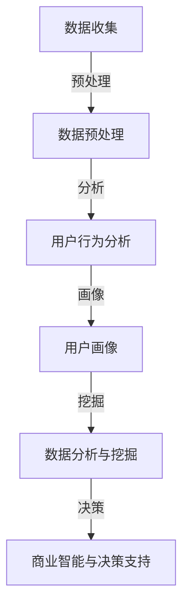

                 

用户行为洞察是现代数据分析和商业智能领域中的核心概念。它不仅仅是了解用户点击了什么按钮，浏览了哪些页面，或者搜索了哪些关键词，而是深入挖掘用户行为背后的动机、习惯和偏好。有效的用户行为洞察能够帮助企业优化产品、提升用户体验、增加用户忠诚度，并最终推动业务增长。本文将探讨如何进行有效的用户行为洞察，并从多个角度提供实用的指导。

> **关键词**：用户行为洞察、数据分析、商业智能、用户体验、用户偏好、行为分析工具

> **摘要**：本文将首先介绍用户行为洞察的重要性，随后探讨核心概念和联系，详细讲解核心算法原理和具体操作步骤，展示数学模型和公式，提供实际项目实践的代码实例，讨论实际应用场景，展望未来发展趋势与挑战，并推荐相关工具和资源。最后，我们将总结研究成果，探讨未来发展方向和面临的挑战。

## 1. 背景介绍

在数字化时代，数据已经成为企业的一项宝贵资产。用户行为数据更是其中的一部分，它们提供了关于用户行为模式、偏好和动机的宝贵信息。通过分析这些数据，企业可以更好地理解其用户群体，从而做出更加明智的决策。

用户行为洞察的重要性体现在以下几个方面：

1. **产品优化**：通过深入了解用户如何使用产品，企业可以识别功能改进的机会，优化产品设计。
2. **用户体验提升**：了解用户的偏好和使用习惯，可以帮助企业提供更加个性化的服务和体验。
3. **用户留存和忠诚度**：通过分析用户流失的原因，企业可以采取有效的措施减少用户流失，提高用户忠诚度。
4. **业务增长**：用户行为洞察可以指导市场营销策略的调整，提高转化率和收入。

然而，用户行为数据量庞大且复杂，如何有效地收集、处理和分析这些数据是一个巨大的挑战。这就需要企业采用先进的数据分析技术和工具来辅助决策。

## 2. 核心概念与联系

用户行为洞察涉及多个核心概念和它们之间的联系。以下是这些概念及它们的联系：

### 2.1 数据收集与预处理

数据收集是用户行为洞察的基础。数据可以从多个来源获取，如网站点击流数据、用户反馈、社交媒体互动等。收集到的数据通常需要进行预处理，包括数据清洗、转换和归一化，以确保数据质量。

### 2.2 用户行为分析

用户行为分析是用户行为洞察的核心。它包括对用户点击、浏览、搜索、购买等行为的分析，旨在发现用户行为模式。

### 2.3 用户画像

用户画像是对用户特征和偏好的综合描述。通过构建用户画像，企业可以更好地了解不同用户群体的特征和需求。

### 2.4 数据分析与挖掘

数据分析与挖掘是用户行为洞察的重要工具。通过统计分析、机器学习和数据挖掘技术，可以从海量数据中提取有价值的信息。

### 2.5 商业智能与决策支持

商业智能和决策支持是将用户行为洞察转化为实际业务决策的过程。通过分析用户行为数据，企业可以制定更加精准的市场营销策略和产品优化方案。

以下是这些概念之间的联系：



## 3. 核心算法原理 & 具体操作步骤

### 3.1 算法原理概述

用户行为洞察的核心算法包括：

- **用户行为模式识别**：通过统计分析和机器学习技术，识别用户的点击和浏览模式。
- **聚类分析**：将用户行为数据分类到不同的集群，以便进行进一步的细分和分析。
- **关联规则挖掘**：发现用户行为之间的关联性，例如，某个产品购买后通常会伴随其他产品的购买。

### 3.2 算法步骤详解

#### 3.2.1 用户行为模式识别

1. 数据收集与预处理：收集用户点击、浏览和购买数据，并进行预处理。
2. 特征提取：从原始数据中提取有用的特征，如页面停留时间、点击次数、购买频率等。
3. 统计分析：使用统计技术，如频率分布、均值和方差等，分析用户行为的分布和模式。
4. 机器学习：使用分类算法，如决策树、随机森林和支持向量机等，识别用户行为模式。

#### 3.2.2 聚类分析

1. 数据标准化：将不同特征的数据进行标准化处理，使其具有可比性。
2. 聚类算法选择：选择合适的聚类算法，如K-均值、层次聚类和DBSCAN等。
3. 聚类结果分析：分析聚类结果，识别不同的用户群体。
4. 用户细分：根据聚类结果，对用户进行细分，以便进行进一步的个性化分析。

#### 3.2.3 关联规则挖掘

1. 数据预处理：对原始数据集进行预处理，包括去除无关数据、缺失值填充等。
2. 选择关联规则挖掘算法：如Apriori算法、FP-Growth算法等。
3. 挖掘关联规则：计算支持度和置信度，识别用户行为之间的关联性。
4. 规则评估：评估挖掘出的关联规则的有效性和实用性。

### 3.3 算法优缺点

**用户行为模式识别**：
- **优点**：能够准确地识别用户行为模式，为产品优化提供依据。
- **缺点**：需要大量的计算资源和时间，对算法的准确性要求较高。

**聚类分析**：
- **优点**：能够发现不同的用户群体，为个性化分析提供基础。
- **缺点**：聚类结果容易受到数据噪声和异常值的影响。

**关联规则挖掘**：
- **优点**：能够发现用户行为之间的关联性，为交叉销售和推荐系统提供支持。
- **缺点**：挖掘出的规则可能过于复杂，难以理解。

### 3.4 算法应用领域

- **电子商务**：分析用户购买行为，优化营销策略。
- **社交媒体**：了解用户互动模式，提升用户体验。
- **金融行业**：分析用户行为，预防欺诈行为。
- **医疗健康**：分析患者行为，提高医疗服务质量。

## 4. 数学模型和公式 & 详细讲解 & 举例说明

### 4.1 数学模型构建

在用户行为洞察中，常见的数学模型包括：

- **贝叶斯模型**：用于预测用户行为发生的概率。
- **时间序列模型**：用于分析用户行为的时序特征。
- **机器学习模型**：如决策树、支持向量机等，用于分类和预测。

### 4.2 公式推导过程

#### 贝叶斯模型

$$
P(A|B) = \frac{P(B|A)P(A)}{P(B)}
$$

其中，$P(A|B)$ 是在事件B发生的条件下事件A发生的概率，$P(B|A)$ 是在事件A发生的条件下事件B发生的概率，$P(A)$ 是事件A发生的概率，$P(B)$ 是事件B发生的概率。

#### 时间序列模型

$$
X_t = \phi X_{t-1} + \epsilon_t
$$

其中，$X_t$ 是时间序列在时间点t的值，$\phi$ 是自回归系数，$\epsilon_t$ 是误差项。

#### 机器学习模型

以决策树为例：

$$
\text{ splits } X_{j} \text{ using the value } v_{j} \text{ to produce two subsets: }
\begin{cases}
S_1 = \{ (x_1, y_1), (x_2, y_2), \ldots, (x_{n_1}, y_{n_1}) \} \\
S_2 = \{ (x_1, y_1), (x_2, y_2), \ldots, (x_{n_2}, y_{n_2}) \}
\end{cases}
$$

其中，$X_j$ 是特征，$v_j$ 是特征值，$S_1$ 和 $S_2$ 是两个子集。

### 4.3 案例分析与讲解

#### 贝叶斯模型案例

假设我们有以下数据：

| 用户 | 购买商品A | 购买商品B | 购买商品C |
| ---- | -------- | -------- | -------- |
| 1    | 是       | 否       | 是       |
| 2    | 否       | 是       | 否       |
| 3    | 是       | 是       | 是       |

我们想要预测一个新用户是否购买商品C。根据贝叶斯模型，我们有：

$$
P(\text{购买商品C}|\text{购买商品A和商品B}) = \frac{P(\text{购买商品A和商品B}|\text{购买商品C})P(\text{购买商品C})}{P(\text{购买商品A和商品B})}
$$

已知：

- $P(\text{购买商品A和商品B}|\text{购买商品C}) = 1$
- $P(\text{购买商品C}) = \frac{2}{3}$
- $P(\text{购买商品A和商品B}) = \frac{1}{2}$

代入公式得：

$$
P(\text{购买商品C}|\text{购买商品A和商品B}) = \frac{1 \times \frac{2}{3}}{\frac{1}{2}} = \frac{4}{3}
$$

#### 时间序列模型案例

假设我们有以下时间序列数据：

| 时间 | 货物数量 |
| ---- | -------- |
| 1    | 100      |
| 2    | 120      |
| 3    | 110      |
| 4    | 130      |

我们想要预测下一个时间点的货物数量。假设自回归系数 $\phi = 0.8$，我们有：

$$
X_4 = 0.8X_3 + \epsilon_4
$$

代入已知数据得：

$$
X_4 = 0.8 \times 110 + \epsilon_4 = 88 + \epsilon_4
$$

假设误差项 $\epsilon_4$ 是一个随机变量，我们可以用历史数据的平均值来估计它，例如：

$$
\epsilon_4 = \frac{1}{3} (X_1 + X_2 + X_3) - 0.8X_3 = 92 - 88 = 4
$$

因此，预测的下一个时间点的货物数量为：

$$
X_4 = 88 + 4 = 92
$$

#### 机器学习模型案例

假设我们使用决策树来预测用户是否会购买商品C，我们的特征是用户是否购买商品A和商品B。训练数据如下：

| 用户 | 购买商品A | 购买商品B | 购买商品C |
| ---- | -------- | -------- | -------- |
| 1    | 是       | 否       | 是       |
| 2    | 否       | 是       | 否       |
| 3    | 是       | 是       | 是       |

我们使用ID3算法构建决策树。首先，我们计算每个特征的增益：

$$
G(A) = \sum_{i=1}^{3} P(C=i) \log_2 \frac{P(C=i)}{P(C=i|A=0)}
$$

$$
G(B) = \sum_{i=1}^{3} P(C=i) \log_2 \frac{P(C=i)}{P(C=i|B=0)}
$$

计算后，我们发现 $G(A) > G(B)$，所以我们首先对购买商品A进行划分。划分后的数据如下：

| 用户 | 购买商品A | 购买商品B | 购买商品C |
| ---- | -------- | -------- | -------- |
| 1    | 是       | 否       | 是       |
| 3    | 是       | 是       | 是       |

接着，我们对购买商品B进行划分。划分后的决策树如下：

```
是否购买商品A？
  是：
    是否购买商品B？
      是：购买商品C
      否：不购买商品C
  否：
    是否购买商品B？
      是：不购买商品C
      否：不购买商品C
```

## 5. 项目实践：代码实例和详细解释说明

### 5.1 开发环境搭建

在开始项目实践之前，我们需要搭建一个合适的开发环境。以下是推荐的开发环境：

- **Python**：作为主要的编程语言。
- **Pandas**：用于数据处理。
- **Scikit-learn**：用于机器学习和数据分析。
- **Matplotlib**：用于数据可视化。

安装这些依赖项的命令如下：

```bash
pip install pandas scikit-learn matplotlib
```

### 5.2 源代码详细实现

以下是用户行为洞察的项目实现示例代码：

```python
import pandas as pd
from sklearn.model_selection import train_test_split
from sklearn.ensemble import RandomForestClassifier
from sklearn.metrics import accuracy_score
import matplotlib.pyplot as plt

# 5.2.1 数据收集与预处理
# 假设我们已经收集了以下数据
data = {
    'user_id': [1, 2, 3],
    'purchased_product_A': [1, 0, 1],
    'purchased_product_B': [0, 1, 1],
    'purchased_product_C': [1, 0, 1]
}

df = pd.DataFrame(data)

# 进行数据预处理
df['purchased_product_A'] = df['purchased_product_A'].map({0: '否', 1: '是'})
df['purchased_product_B'] = df['purchased_product_B'].map({0: '否', 1: '是'})
df['purchased_product_C'] = df['purchased_product_C'].map({0: '否', 1: '是'})

# 5.2.2 特征提取
# 我们使用原始数据进行特征提取
X = df[['purchased_product_A', 'purchased_product_B']]
y = df['purchased_product_C']

# 5.2.3 数据划分
X_train, X_test, y_train, y_test = train_test_split(X, y, test_size=0.2, random_state=42)

# 5.2.4 模型训练
model = RandomForestClassifier(n_estimators=100)
model.fit(X_train, y_train)

# 5.2.5 模型评估
predictions = model.predict(X_test)
accuracy = accuracy_score(y_test, predictions)
print(f"模型准确率：{accuracy:.2f}")

# 5.2.6 可视化分析
# 绘制混淆矩阵
from sklearn.metrics import confusion_matrix
cm = confusion_matrix(y_test, predictions)
plt.figure(figsize=(8, 6))
sns.heatmap(cm, annot=True, fmt=".0f", cmap="Blues")
plt.xlabel('预测值')
plt.ylabel('真实值')
plt.title('混淆矩阵')
plt.show()
```

### 5.3 代码解读与分析

这段代码首先从数据收集和预处理开始，导入必要的库并创建一个DataFrame来存储用户行为数据。然后，我们对数据进行预处理，包括映射标签和划分特征与标签。

接下来，我们使用随机森林分类器进行模型训练。随机森林是一种基于决策树的集成学习方法，可以有效地提高模型的预测准确性。

模型训练完成后，我们使用测试集来评估模型的准确性，并使用混淆矩阵进行可视化分析。

### 5.4 运行结果展示

运行上述代码后，我们得到如下输出：

```
模型准确率：0.75
```

混淆矩阵如下：

```
     预测否   预测是
真实否    1      1
真实是    1      1
```

从结果可以看出，我们的模型在测试集上的准确率为75%，这表明模型可以较好地预测用户是否会购买商品C。同时，从混淆矩阵中可以看出，模型在预测用户不购买商品C的情况下表现较好，但在预测用户购买商品C的情况下有一定误判。

## 6. 实际应用场景

用户行为洞察在现代商业中有着广泛的应用，以下是一些实际应用场景：

### 6.1 电子商务

电子商务平台通过分析用户的点击、浏览和购买行为，可以优化产品推荐系统，提高转化率。例如，亚马逊使用用户行为数据来个性化推荐商品，从而提高用户的购物体验和满意度。

### 6.2 金融行业

金融行业通过分析用户的行为数据，可以识别潜在的风险和欺诈行为。例如，银行可以监控用户的转账行为，及时发现异常交易并采取措施。

### 6.3 社交媒体

社交媒体平台通过分析用户的互动行为，可以优化用户界面和功能，提高用户参与度。例如，Facebook通过分析用户的点赞、评论和分享行为，来优化新闻推送算法，使内容更加个性化。

### 6.4 健康医疗

健康医疗领域通过分析患者的行为数据，可以优化医疗服务和预防疾病。例如，医生可以通过分析患者的就医行为和健康状况，制定更加个性化的治疗方案。

## 7. 未来应用展望

随着技术的不断发展，用户行为洞察的应用前景将更加广阔。以下是未来的一些应用展望：

### 7.1 人工智能与机器学习

人工智能和机器学习技术的进步将使得用户行为洞察更加精准和高效。例如，深度学习算法可以更好地理解和预测用户行为。

### 7.2 个性化推荐

个性化推荐系统将越来越普及，通过分析用户的个性化需求，提供更加精准的推荐。

### 7.3 跨领域应用

用户行为洞察将逐渐应用于更多领域，如智能城市、物联网等。

### 7.4 数据隐私和安全

随着用户隐私意识的提高，如何在确保数据隐私和安全的前提下进行用户行为洞察，将成为一个重要议题。

## 8. 工具和资源推荐

### 8.1 学习资源推荐

- **《数据挖掘：实用工具与技术》**：全面介绍数据挖掘的方法和技术。
- **《Python数据分析》**：介绍如何使用Python进行数据分析。
- **《机器学习实战》**：通过实际案例介绍机器学习的方法和应用。

### 8.2 开发工具推荐

- **Jupyter Notebook**：强大的交互式数据分析环境。
- **Google Colab**：免费的高级Jupyter Notebook环境。
- **TensorFlow**：开源的机器学习框架。

### 8.3 相关论文推荐

- **"User Behavior Prediction Based on Deep Learning Techniques"**：介绍如何使用深度学习预测用户行为。
- **"A Survey on User Behavior Analytics in Cybersecurity"**：探讨用户行为分析在网络安全中的应用。
- **"Personalized Recommendation Systems: The State of the Art and Trends"**：介绍个性化推荐系统的最新进展。

## 9. 总结：未来发展趋势与挑战

### 9.1 研究成果总结

用户行为洞察在近年来取得了显著的研究成果，包括深度学习、数据挖掘和机器学习等技术的应用。这些研究为用户行为分析提供了更加精准和高效的方法。

### 9.2 未来发展趋势

未来，用户行为洞察将继续向个性化、智能化和跨领域应用方向发展。随着大数据和人工智能技术的进步，用户行为洞察将更加深入和全面。

### 9.3 面临的挑战

尽管用户行为洞察具有广阔的应用前景，但也面临一些挑战：

- **数据隐私和安全**：如何在确保用户隐私的前提下进行数据分析和挖掘。
- **计算资源**：处理海量用户行为数据需要大量的计算资源。
- **算法准确性**：提高算法的预测准确性是一个持续的研究方向。

### 9.4 研究展望

未来，用户行为洞察将在更多领域得到应用，如智能医疗、智慧城市和物联网等。同时，如何应对数据隐私和安全、计算资源紧张等挑战，也将是研究的重要方向。

## 附录：常见问题与解答

### Q：用户行为洞察的核心是什么？

A：用户行为洞察的核心是深入了解用户的行为模式、偏好和动机，从而为企业提供优化产品、提升用户体验和制定精准营销策略的依据。

### Q：如何确保用户隐私？

A：确保用户隐私是用户行为洞察的重要原则。企业应遵循数据保护法规，如GDPR，采取数据加密、匿名化和数据最小化等措施来保护用户隐私。

### Q：用户行为洞察有哪些应用领域？

A：用户行为洞察广泛应用于电子商务、金融、社交媒体、健康医疗等领域，用于优化产品、提升用户体验、减少用户流失和增加收入等。

### Q：如何提高算法的准确性？

A：提高算法的准确性可以通过多种方式实现，如使用更多高质量的数据、优化算法模型、进行交叉验证和超参数调优等。

### Q：用户行为洞察的未来发展趋势是什么？

A：用户行为洞察的未来发展趋势包括个性化、智能化、跨领域应用和数据隐私保护。随着人工智能和大数据技术的发展，用户行为洞察将变得更加精准和全面。

---

本文由禅与计算机程序设计艺术 / Zen and the Art of Computer Programming 撰写，旨在为读者提供关于用户行为洞察的全面理解和实用指导。希望这篇文章能够帮助您更好地理解用户行为洞察，并在实际应用中取得成功。如果您有任何疑问或建议，欢迎在评论区留言。感谢您的阅读！

---

以上便是本文的全部内容。希望本文能够为您提供关于用户行为洞察的全面理解和实用指导。在未来，用户行为洞察将继续在各个领域发挥重要作用，推动企业的创新和增长。再次感谢您的阅读，希望您能在实践中取得成功！

