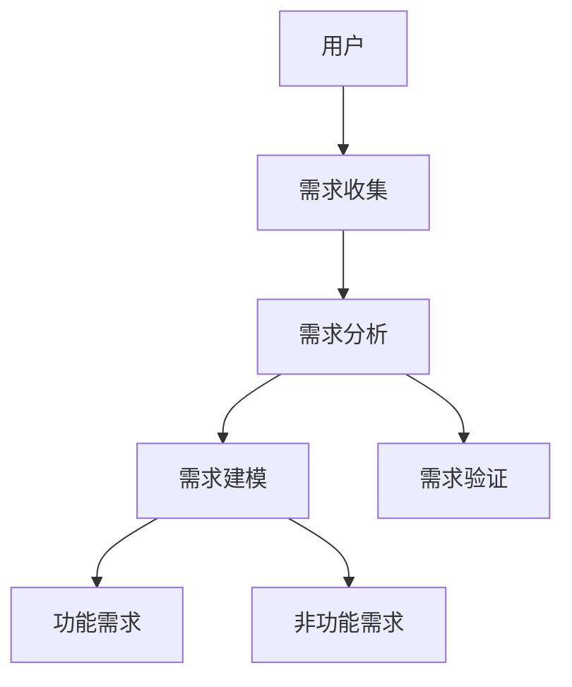

                 

 在信息技术迅速发展的今天，用户需求分析已经成为软件开发过程中至关重要的一环。一个优秀的软件产品不仅要具备强大的功能，更要满足用户的核心需求。本文将深入探讨如何进行有效的用户需求分析，从而为软件设计和开发提供坚实的基础。

## 文章关键词

- 用户需求分析
- 软件开发
- 用户体验
- 需求建模
- 需求管理

## 文章摘要

本文旨在提供一个系统的用户需求分析框架，通过理解用户需求、需求建模、需求验证和需求管理四个关键步骤，帮助企业开发出真正满足用户期望的软件产品。文章首先介绍了用户需求分析的重要性，然后详细探讨了每个步骤的具体方法和技巧。

## 1. 背景介绍

### 1.1 用户需求分析的定义

用户需求分析是指通过系统化的方法收集、分析和理解用户的需求，以便将用户需求转化为软件功能和特性。它不仅关注用户目前的需求，还包括对潜在需求的预测和前瞻性思考。

### 1.2 用户需求分析的重要性

- **提高软件质量**：通过准确理解用户需求，可以减少功能偏离和需求变更，提高软件质量。
- **降低开发风险**：及早识别和解决潜在的问题，降低项目开发风险。
- **提升用户满意度**：满足用户需求，提高用户满意度，增强产品竞争力。
- **节约成本**：减少不必要的功能开发和重复劳动，降低开发成本。

### 1.3 软件开发过程中的用户需求分析

在软件开发过程中，用户需求分析贯穿始终，从项目启动到软件发布和维护，每个阶段都需要对用户需求进行深入分析和讨论。

## 2. 核心概念与联系

### 2.1 用户需求分析的核心概念

用户需求分析涉及多个核心概念：

- **用户**：用户是软件的使用者，他们的需求是分析的核心。
- **需求**：需求是指用户为了解决特定问题或达到特定目标所需的功能或服务。
- **功能需求**：功能需求是指用户期望软件提供的基本功能。
- **非功能需求**：非功能需求是指软件需要满足的性能、可靠性、可用性等质量属性。

### 2.2 用户需求分析的架构

为了更清晰地理解用户需求分析，可以使用以下 Mermaid 流程图来展示核心概念之间的联系：



### 2.3 需求管理

需求管理是用户需求分析的重要组成部分，它包括需求的定义、记录、跟踪、变更控制等。有效的需求管理可以确保需求的准确性和一致性，从而提高软件开发的效率。

## 3. 核心算法原理 & 具体操作步骤

### 3.1 算法原理概述

用户需求分析的核心算法通常包括以下步骤：

- **需求收集**：通过与用户直接交流、问卷调查、用户反馈等方式收集用户需求。
- **需求分类**：将收集到的需求按照功能需求和非功能需求进行分类。
- **需求分析**：深入理解每个需求的具体内容，确定需求的优先级和可行性。
- **需求建模**：使用模型（如用户故事地图、用例模型等）来表示用户需求。
- **需求验证**：通过与用户进行讨论和原型测试，确保需求被正确理解和实现。
- **需求管理**：记录和管理需求变更，确保需求的追踪和控制。

### 3.2 算法步骤详解

#### 3.2.1 需求收集

需求收集是用户需求分析的第一步，主要通过以下方法进行：

- **用户访谈**：与用户进行面对面的交流，了解他们的需求和期望。
- **问卷调查**：通过设计问卷收集大量用户的需求信息。
- **用户观察**：观察用户在实际使用环境中的行为，发现潜在的需求。

#### 3.2.2 需求分类

收集到的需求需要按照功能需求和非功能需求进行分类。功能需求通常是指软件需要实现的具体功能，而非功能需求则涉及软件的质量属性，如性能、安全性、可靠性等。

#### 3.2.3 需求分析

需求分析是理解需求的具体内容，并确定每个需求的优先级和可行性。具体步骤包括：

- **需求文档编写**：将每个需求编写成文档，包括需求描述、优先级、可行性分析等。
- **需求讨论**：与相关利益相关者（如项目经理、开发人员、产品经理等）进行讨论，确保对需求的理解一致。

#### 3.2.4 需求建模

需求建模是将用户需求转化为具体的模型，如用户故事地图、用例模型等。这些模型有助于清晰地展示用户需求，并便于开发团队理解和实现。

#### 3.2.5 需求验证

需求验证是确保需求被正确理解和实现的过程。主要通过以下方法进行：

- **原型测试**：创建软件原型，让用户进行测试和反馈。
- **用户评审**：组织用户进行需求评审，确保需求的准确性和完整性。

#### 3.2.6 需求管理

需求管理是确保需求变更得到有效控制和追踪的过程。主要通过以下方法进行：

- **需求变更记录**：记录所有需求变更，包括变更的原因、影响和解决方案。
- **变更控制**：对需求变更进行审批和控制，确保变更的合理性和一致性。

### 3.3 算法优缺点

#### 优点

- **提高软件质量**：通过需求分析，可以减少功能偏差和需求变更，提高软件质量。
- **降低开发风险**：及早识别和解决潜在的问题，降低项目开发风险。
- **提升用户满意度**：满足用户需求，提高用户满意度，增强产品竞争力。

#### 缺点

- **时间成本**：需求分析是一个耗时的工作，可能会延迟项目进度。
- **资源需求**：需求分析需要投入人力资源，可能会增加项目成本。

### 3.4 算法应用领域

用户需求分析广泛应用于各种软件开发项目，包括：

- **企业级应用**：如ERP系统、CRM系统等。
- **移动应用**：如手机游戏、移动办公应用等。
- **Web应用**：如电子商务平台、社交媒体平台等。
- **物联网应用**：如智能家居、智能城市等。

## 4. 数学模型和公式 & 详细讲解 & 举例说明

### 4.1 数学模型构建

用户需求分析中的数学模型通常用于表示和分析需求。以下是一个简单的数学模型示例：

$$
需求模型 = f(用户需求, 环境因素, 技术约束)
$$

其中，用户需求、环境因素和技术约束是模型的三要素。

### 4.2 公式推导过程

为了构建上述数学模型，我们可以使用以下推导过程：

$$
需求模型 = 用户需求 \times 环境因素 + 技术约束
$$

其中，用户需求和环境因素是直接影响需求的因素，技术约束则是需求实现的限制条件。

### 4.3 案例分析与讲解

假设一个电子商务平台需要满足以下用户需求：

- **用户需求**：方便的用户注册和登录流程，商品浏览和搜索功能，购物车和订单管理功能。
- **环境因素**：竞争激烈的市场环境，快速响应的用户需求变化，技术更新速度较快。
- **技术约束**：系统性能要求高，安全性要求严格，开发成本受限。

根据上述数学模型，我们可以得到以下需求模型：

$$
需求模型 = (用户注册和登录流程, 商品浏览和搜索功能, 购物车和订单管理功能) \times (竞争激烈的市场环境, 快速响应的用户需求变化, 技术更新速度较快) + (系统性能要求高, 安全性要求严格, 开发成本受限)
$$

通过这个模型，我们可以更清晰地理解电子商务平台的需求，并针对不同的需求和约束进行优先级排序和资源分配。

## 5. 项目实践：代码实例和详细解释说明

### 5.1 开发环境搭建

为了更好地展示用户需求分析的过程，我们使用一个简单的Web应用项目作为实例。开发环境如下：

- **编程语言**：Python
- **框架**：Django
- **数据库**：MySQL
- **操作系统**：Ubuntu 18.04

### 5.2 源代码详细实现

以下是一个简单的用户注册功能的实现：

```python
# users/models.py
from django.db import models

class User(models.Model):
    username = models.CharField(max_length=100)
    password = models.CharField(max_length=100)
    email = models.EmailField()

    def __str__(self):
        return self.username
```

### 5.3 代码解读与分析

这段代码定义了一个名为`User`的模型，用于存储用户信息。模型中的字段包括`username`、`password`和`email`，分别用于存储用户的用户名、密码和电子邮件地址。

### 5.4 运行结果展示

通过Django的命令行工具，我们可以创建数据库表并插入数据：

```shell
$ python manage.py makemigrations
Migrations for 'users':
  users/migrations/0001_initial.py
    - Create model User

$ python manage.py migrate
Operations to perform:
  Apply all migrations: users
Running migrations:
  Applying users.0001_initial... OK
```

运行结果会在MySQL数据库中创建一个名为`users_user`的表，并插入数据。

## 6. 实际应用场景

### 6.1 电子商务平台

电子商务平台是用户需求分析的一个典型应用场景。通过分析用户需求，平台可以提供更加个性化的购物体验，提高用户满意度。

### 6.2 企业级应用

企业级应用也需要进行用户需求分析，以确保软件系统满足企业的业务需求和管理需求。

### 6.3 移动应用

移动应用的用户需求更加多样化，通过用户需求分析，可以设计出更符合用户使用习惯和需求的应用。

### 6.4 物联网应用

物联网应用需要满足复杂的需求，包括设备管理、数据分析和安全控制等。通过用户需求分析，可以更好地设计物联网系统的架构和功能。

## 7. 工具和资源推荐

### 7.1 学习资源推荐

- 《用户需求分析：技术与实践》
- 《软件需求工程：理论与实践》
- 《用户体验要素：互动设计四层次方法论》

### 7.2 开发工具推荐

- Sketch：界面设计工具
- Figma：协作式界面设计工具
- Jira：项目管理工具
- Confluence：知识共享和协作工具

### 7.3 相关论文推荐

- 《需求工程的研究进展与展望》
- 《基于用户行为的软件需求分析研究》
- 《用户需求建模与验证方法研究》

## 8. 总结：未来发展趋势与挑战

### 8.1 研究成果总结

用户需求分析在软件开发过程中起着至关重要的作用。通过有效的用户需求分析，可以减少开发风险，提高软件质量和用户满意度。

### 8.2 未来发展趋势

- **智能化需求分析**：随着人工智能技术的发展，智能化需求分析将成为趋势。
- **需求建模与验证技术**：需求建模和验证技术将不断演进，提高需求分析的准确性和效率。
- **用户体验设计**：用户体验设计将在用户需求分析中占据更加重要的地位。

### 8.3 面临的挑战

- **用户需求的动态性**：用户需求变化频繁，如何及时、准确地识别和应对这些变化是一个挑战。
- **需求的一致性**：在需求变更频繁的情况下，如何保持需求的一致性是一个难题。

### 8.4 研究展望

未来，用户需求分析将更加注重智能化和用户体验，通过不断探索新的需求分析方法和工具，提高需求分析的效率和准确性，从而推动软件开发的进步。

## 9. 附录：常见问题与解答

### 9.1 什么是用户需求分析？

用户需求分析是指通过系统化的方法收集、分析和理解用户的需求，以便将用户需求转化为软件功能和特性。

### 9.2 用户需求分析的重要性是什么？

用户需求分析的重要性在于：提高软件质量、降低开发风险、提升用户满意度、节约成本。

### 9.3 需求管理的目的是什么？

需求管理的目的是确保需求的准确性、一致性和可追踪性，从而提高软件开发的效率。

### 9.4 如何进行有效的用户需求收集？

进行有效的用户需求收集通常采用用户访谈、问卷调查、用户观察等方法。

### 9.5 如何进行需求分类？

需求通常按照功能需求和非功能需求进行分类。功能需求是指软件需要实现的具体功能，非功能需求则涉及软件的质量属性，如性能、可靠性等。

### 9.6 需求验证的方法有哪些？

需求验证的方法包括原型测试、用户评审、需求评审等。

### 9.7 用户需求分析与用户体验设计有何关联？

用户需求分析与用户体验设计密切相关。用户需求分析为用户体验设计提供了基础，而用户体验设计则是用户需求分析的具体实现。

## 参考文献

1. 《用户需求分析：技术与实践》
2. 《软件需求工程：理论与实践》
3. 《用户体验要素：互动设计四层次方法论》
4. 《需求工程的研究进展与展望》
5. 《基于用户行为的软件需求分析研究》
6. 《用户需求建模与验证方法研究》

---

本文详细探讨了如何进行有效的用户需求分析，从背景介绍、核心概念与联系、算法原理与操作步骤、数学模型和公式、项目实践、实际应用场景、工具和资源推荐，到总结与展望，全面阐述了用户需求分析在软件开发过程中的重要性。希望通过本文的阐述，能够为读者提供有益的参考和指导，提升软件开发的效率和用户满意度。作者：禅与计算机程序设计艺术 / Zen and the Art of Computer Programming。

