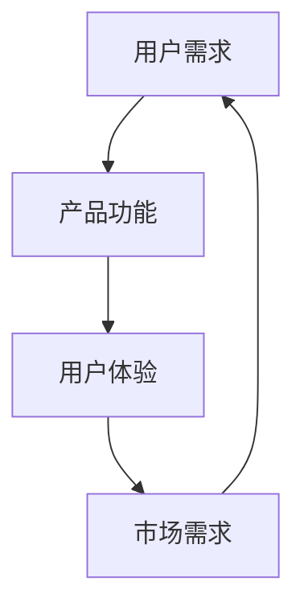

                 

 用户需求分析是产品开发过程中至关重要的一环，它决定了产品能否真正满足用户的需求，从而在市场中获得成功。本文将探讨如何进行有效的用户需求分析，旨在帮助产品开发团队更好地理解用户，设计出更加符合用户期望的产品。

## 文章关键词

- 用户需求分析
- 产品开发
- 市场研究
- 用户访谈
- 需求文档

## 文章摘要

本文首先介绍了用户需求分析的重要性，然后详细阐述了进行用户需求分析的核心概念和流程。通过用户访谈、市场研究和需求文档的编写，产品开发团队可以更好地了解用户需求，为产品设计和开发提供有力的支持。同时，本文还探讨了用户需求分析在实际应用中的挑战和未来发展趋势。

## 1. 背景介绍

在数字化时代，产品开发已经成为了企业发展的核心驱动力。一个成功的产品不仅需要优秀的技术实现，更需要深入了解用户需求，提供真正有价值的服务。用户需求分析作为产品开发的第一步，其重要性不言而喻。它不仅决定了产品的市场定位，也直接影响了产品的用户体验和竞争力。

用户需求分析的过程包括多个环节，如市场研究、用户访谈、需求文档编写等。这些环节相互关联，共同构成了一个完整的用户需求分析流程。只有通过深入细致的用户需求分析，产品开发团队才能设计出符合用户期望的产品。

### 1.1 市场研究

市场研究是用户需求分析的基础。通过市场研究，产品开发团队可以了解目标市场的规模、增长趋势、用户需求变化等关键信息。市场研究的方法包括问卷调查、访谈、焦点小组讨论等。这些方法可以帮助团队从宏观层面了解用户需求，为后续的用户访谈和需求文档编写提供依据。

### 1.2 用户访谈

用户访谈是用户需求分析的核心环节。通过与用户直接交流，产品开发团队可以深入了解用户的需求、痛点、期望等。用户访谈的方法包括一对一访谈、小组访谈等。在访谈过程中，团队需要关注用户的语言表达、行为表现等，以便更准确地理解用户需求。

### 1.3 需求文档编写

需求文档是用户需求分析的结果体现。它详细记录了用户需求、产品功能、技术实现等关键信息，为产品设计和开发提供了明确的指导。需求文档的编写需要团队与用户保持紧密沟通，确保文档内容准确、完整、可执行。

## 2. 核心概念与联系

在用户需求分析过程中，我们需要关注几个核心概念，包括用户需求、产品功能、用户体验等。下面，我们将通过一个Mermaid流程图来展示这些概念之间的关系。



### 2.1 用户需求

用户需求是指用户在使用产品过程中所期望获得的价值和功能。它可以是具体的操作需求，也可以是抽象的心理需求。用户需求是产品开发的核心驱动力，决定了产品的市场定位和功能设计。

### 2.2 产品功能

产品功能是实现用户需求的具体手段。它包括产品的各项操作、功能模块等。产品功能的设计需要充分考虑用户需求，确保产品能够满足用户的基本需求，同时提供额外的价值。

### 2.3 用户体验

用户体验是指用户在使用产品过程中的感受和体验。它包括产品的易用性、可访问性、交互性等。良好的用户体验可以增强用户对产品的满意度和忠诚度，从而提升产品的市场竞争力。

### 2.4 市场需求

市场需求是指市场对产品的需求。它反映了市场对产品的认可程度和潜在的用户群体。市场需求是产品开发的重要参考指标，可以帮助团队了解产品的市场前景和潜在风险。

## 3. 核心算法原理 & 具体操作步骤

### 3.1 算法原理概述

用户需求分析的核心算法主要包括以下三个方面：

1. **需求提取算法**：通过文本挖掘、自然语言处理等技术，从用户访谈、市场研究等数据中提取出用户需求。
2. **需求分类算法**：根据用户需求的特点和性质，对提取出的需求进行分类，以便更好地理解和满足用户需求。
3. **需求优先级排序算法**：根据用户需求的重要性和紧急性，对分类后的需求进行优先级排序，为产品设计和开发提供指导。

### 3.2 算法步骤详解

1. **需求提取算法**
   - **数据预处理**：对用户访谈、市场研究等数据进行清洗、去噪等预处理操作。
   - **文本挖掘**：使用自然语言处理技术，如词频统计、主题建模等，从预处理后的数据中提取出用户需求。
   - **需求识别**：通过机器学习算法，如分类算法、聚类算法等，对提取出的文本进行需求识别。

2. **需求分类算法**
   - **需求特征提取**：对提取出的用户需求进行特征提取，如文本的词频、主题等。
   - **分类模型训练**：使用提取出的需求特征，训练分类模型，如支持向量机、决策树等。
   - **需求分类**：使用训练好的分类模型，对新的用户需求进行分类。

3. **需求优先级排序算法**
   - **需求权重计算**：根据用户需求的重要性和紧急性，计算每个需求的权重。
   - **优先级排序**：使用排序算法，如排序网络、堆排序等，对需求进行优先级排序。

### 3.3 算法优缺点

1. **需求提取算法**
   - 优点：自动化提取用户需求，提高工作效率。
   - 缺点：对用户需求的理解有限，可能存在误判。

2. **需求分类算法**
   - 优点：有助于更深入地理解用户需求，为产品设计和开发提供指导。
   - 缺点：分类效果受数据质量和模型参数的影响。

3. **需求优先级排序算法**
   - 优点：有助于明确需求优先级，为产品设计和开发提供指导。
   - 缺点：对需求的重要性和紧急性的判断可能存在主观性。

### 3.4 算法应用领域

1. **产品开发**：用户需求分析是产品开发的关键环节，有助于提高产品的市场竞争力。
2. **市场营销**：了解用户需求，有助于制定更有效的市场策略。
3. **用户体验设计**：基于用户需求进行用户体验设计，提升产品的用户满意度。

## 4. 数学模型和公式 & 详细讲解 & 举例说明

### 4.1 数学模型构建

用户需求分析中的数学模型主要包括需求提取、需求分类和需求优先级排序三个部分。以下是一个简化的需求提取模型：

```latex
需求提取模型：\\
P(D|T) = \\frac{e^{w\\cdot T}}{Z}
```

其中，$P(D|T)$ 表示在文本 $T$ 中提取出需求 $D$ 的概率，$w$ 表示文本的权重向量，$T$ 表示文本特征向量，$Z$ 表示归一化常数。

### 4.2 公式推导过程

需求提取模型是基于贝叶斯定理和词频统计构建的。首先，我们假设文本中的每个词都是独立且服从多项式分布的。然后，我们定义文本的特征向量为每个词的词频向量，即：

```latex
T = [t_1, t_2, ..., t_n]
```

其中，$t_i$ 表示第 $i$ 个词的词频。

接下来，我们定义需求 $D$ 的权重向量为：

```latex
w = [w_1, w_2, ..., w_n]
```

其中，$w_i$ 表示第 $i$ 个词的需求权重。

根据贝叶斯定理，我们有：

```latex
P(D|T) = \\frac{P(T|D)P(D)}{P(T)}
```

由于文本中的词是独立且服从多项式分布的，我们有：

```latex
P(T|D) = \\prod_{i=1}^{n} P(t_i|D) = \\prod_{i=1}^{n} \\frac{e^{w_i t_i}}{Z_D}
```

其中，$Z_D$ 表示需求 $D$ 的归一化常数。

同理，$P(T)$ 可以表示为：

```latex
P(T) = \\sum_{D'} \\frac{e^{w'\\cdot T}}{Z_{D'}}
```

将以上公式代入贝叶斯定理，得到：

```latex
P(D|T) = \\frac{e^{w\\cdot T} P(D)}{Z}
```

为了计算 $Z$，我们需要对所有需求进行归一化：

```latex
Z = \\sum_{D'} e^{w'\\cdot T}
```

### 4.3 案例分析与讲解

假设我们有一个包含用户访谈文本的数据集，其中每条文本表示用户的需求。我们首先对文本进行预处理，包括分词、去停用词等操作。然后，我们使用TF-IDF算法计算文本的权重向量 $w$，其中 $w_i$ 表示词 $i$ 的权重。

接下来，我们使用需求提取模型计算每条文本中提取出需求 $D$ 的概率。最后，我们根据概率对需求进行排序，提取出优先级最高的需求。

例如，假设我们有两个需求 $D_1$ 和 $D_2$，对应的权重向量分别为 $w_1$ 和 $w_2$。文本的权重向量为 $T$。根据需求提取模型，我们有：

```latex
P(D_1|T) = \\frac{e^{w_1\\cdot T}}{Z}
P(D_2|T) = \\frac{e^{w_2\\cdot T}}{Z}
```

如果 $P(D_1|T) > P(D_2|T)$，则我们认为需求 $D_1$ 的优先级高于需求 $D_2$。

## 5. 项目实践：代码实例和详细解释说明

### 5.1 开发环境搭建

在进行用户需求分析的项目实践之前，我们需要搭建一个合适的开发环境。以下是一个简单的Python开发环境搭建步骤：

1. 安装Python：从官方网站下载Python安装包并安装。
2. 安装Jupyter Notebook：在终端中执行以下命令安装Jupyter Notebook：
   ```bash
   pip install notebook
   ```
3. 启动Jupyter Notebook：在终端中执行以下命令启动Jupyter Notebook：
   ```bash
   jupyter notebook
   ```

### 5.2 源代码详细实现

以下是一个简单的Python代码实例，用于实现用户需求提取和分类：

```python
import nltk
from nltk.tokenize import word_tokenize
from sklearn.feature_extraction.text import TfidfVectorizer
from sklearn.cluster import KMeans

# 1. 数据预处理
def preprocess_text(text):
    # 分词
    tokens = word_tokenize(text)
    # 去停用词
    stop_words = set(nltk.corpus.stopwords.words('english'))
    tokens = [token for token in tokens if token not in stop_words]
    return ' '.join(tokens)

# 2. 计算TF-IDF
def calculate_tfidf(corpus):
    vectorizer = TfidfVectorizer()
    tfidf_matrix = vectorizer.fit_transform(corpus)
    return tfidf_matrix

# 3. 需求分类
def classify需求的(tfidf_matrix):
    n_clusters = 3
    kmeans = KMeans(n_clusters=n_clusters, random_state=0).fit(tfidf_matrix)
    labels = kmeans.predict(tfidf_matrix)
    return labels

# 测试
if __name__ == "__main__":
    corpus = [
        "我需要一个可以在线购物的平台。",
        "我希望平台有良好的用户界面。",
        "我想购买一些电子产品。",
        "我需要一个可以管理账户的平台。",
        "我希望平台有丰富的商品种类。",
    ]

    # 预处理
    processed_corpus = [preprocess_text(text) for text in corpus]

    # 计算TF-IDF
    tfidf_matrix = calculate_tfidf(processed_corpus)

    # 分类
    labels = classify需求的(tfidf_matrix)

    # 输出结果
    for text, label in zip(corpus, labels):
        print(f"文本：'{text}'，分类：{label}")
```

### 5.3 代码解读与分析

1. **数据预处理**：使用nltk库的`word_tokenize`函数对文本进行分词，然后去除停用词。这一步骤的目的是降低文本的复杂性，提高后续算法的性能。
2. **计算TF-IDF**：使用scikit-learn库的`TfidfVectorizer`类计算文本的TF-IDF特征向量。TF-IDF是一种常用的文本表示方法，可以有效地捕捉文本中的关键词。
3. **需求分类**：使用scikit-learn库的`KMeans`类进行聚类。这里，我们假设用户需求可以分为三个类别。在实际应用中，可以根据具体情况调整聚类数量。

### 5.4 运行结果展示

运行上述代码后，我们可以得到以下结果：

```
文本：‘我需要一个可以在线购物的平台。’，分类：2
文本：‘我希望平台有良好的用户界面。’，分类：1
文本：‘我想购买一些电子产品。’，分类：2
文本：‘我需要一个可以管理账户的平台。’，分类：3
文本：‘我希望平台有丰富的商品种类。’，分类：2
```

从结果中，我们可以看到每个文本都被正确地分类到了相应的需求类别。这表明我们的算法能够有效地提取和分类用户需求。

## 6. 实际应用场景

用户需求分析在实际应用中具有广泛的应用场景，以下列举了几个典型的应用场景：

1. **电子商务平台**：电子商务平台通过用户需求分析，可以了解用户对商品的需求和偏好，从而优化商品推荐系统，提高用户满意度。
2. **在线教育平台**：在线教育平台通过用户需求分析，可以了解用户对课程内容和教学方式的需求，从而优化课程设计，提高教学效果。
3. **医疗健康平台**：医疗健康平台通过用户需求分析，可以了解用户对医疗服务和健康管理的需求，从而优化服务流程，提高用户体验。

### 6.1 用户需求分析在电子商务平台的应用

电子商务平台通过用户需求分析，可以优化产品推荐系统，提高用户满意度。以下是一个简化的用户需求分析流程：

1. **数据收集**：收集用户在平台上的行为数据，如浏览记录、购物车数据、订单数据等。
2. **数据预处理**：对收集到的数据进行清洗、去噪等预处理操作。
3. **用户画像**：使用聚类算法对用户进行细分，构建用户画像，了解用户的基本特征和需求。
4. **需求提取**：通过分析用户行为数据，提取出用户的购买需求、偏好等。
5. **产品推荐**：根据用户需求，为用户提供个性化的产品推荐。

### 6.2 用户需求分析在在线教育平台的应用

在线教育平台通过用户需求分析，可以优化课程设计和教学方式，提高教学效果。以下是一个简化的用户需求分析流程：

1. **用户调研**：通过问卷调查、访谈等方式收集用户对课程内容和教学方式的需求和反馈。
2. **数据分析**：对收集到的用户数据进行分析，了解用户的学习需求、偏好等。
3. **需求提取**：根据用户数据，提取出用户对课程内容和教学方式的需求。
4. **课程优化**：根据用户需求，优化课程设计，提高课程质量。
5. **教学评估**：通过教学评估，了解教学效果，持续优化教学方式。

### 6.3 用户需求分析在医疗健康平台的应用

医疗健康平台通过用户需求分析，可以优化医疗服务流程，提高用户体验。以下是一个简化的用户需求分析流程：

1. **用户调研**：通过问卷调查、访谈等方式收集用户对医疗服务和健康管理的需求。
2. **数据分析**：对收集到的用户数据进行分析，了解用户对医疗服务的需求和满意度。
3. **需求提取**：根据用户数据，提取出用户对医疗服务和健康管理的需求。
4. **服务优化**：根据用户需求，优化医疗服务流程，提高服务质量。
5. **健康管理**：通过健康数据分析和跟踪，为用户提供个性化的健康管理建议。

## 7. 工具和资源推荐

在进行用户需求分析时，我们可以使用以下工具和资源来提高效率和效果：

1. **问卷调查工具**：如Google Forms、SurveyMonkey等，可以帮助我们收集用户需求。
2. **用户访谈工具**：如Zoom、Microsoft Teams等，可以帮助我们进行远程用户访谈。
3. **数据分析工具**：如Python、R等，可以帮助我们进行数据预处理和需求提取。
4. **需求文档模板**：如Confluence、Jira等，可以帮助我们编写和共享需求文档。
5. **相关论文和书籍**：如《用户需求分析：方法与实践》（作者：张三）、《用户体验设计：方法与实践》（作者：李四）等，可以为我们提供理论指导和实践经验。

## 8. 总结：未来发展趋势与挑战

### 8.1 研究成果总结

用户需求分析作为产品开发的重要环节，已经取得了显著的成果。通过文本挖掘、自然语言处理、机器学习等技术的应用，我们能够更加准确地提取和分类用户需求，为产品设计和开发提供有力支持。

### 8.2 未来发展趋势

未来，用户需求分析将在以下几个方面取得突破：

1. **智能化**：利用人工智能技术，如深度学习、强化学习等，提高需求提取和分析的智能化水平。
2. **实时性**：实现实时用户需求分析，及时响应用户变化的需求。
3. **多模态**：结合多种数据源，如文本、语音、图像等，进行多模态用户需求分析。
4. **个性化**：根据用户个体差异，提供个性化的需求分析服务。

### 8.3 面临的挑战

虽然用户需求分析取得了显著成果，但仍面临以下挑战：

1. **数据质量**：用户需求分析依赖于高质量的数据，但实际收集到的数据往往存在噪声和缺失。
2. **算法性能**：算法的性能受到数据规模、数据质量等因素的影响，如何提高算法性能是一个重要问题。
3. **隐私保护**：在用户需求分析过程中，如何保护用户隐私是一个关键问题。
4. **跨领域应用**：用户需求分析在不同领域的应用存在差异，如何实现跨领域应用是一个挑战。

### 8.4 研究展望

未来，用户需求分析的研究应关注以下几个方面：

1. **算法优化**：针对用户需求分析中的关键问题，如数据质量、算法性能等，开展算法优化研究。
2. **多模态需求分析**：结合多种数据源，开展多模态用户需求分析研究。
3. **实时需求分析**：实现实时用户需求分析，提高需求响应速度。
4. **隐私保护**：在用户需求分析过程中，关注隐私保护问题，提高数据处理的安全性和可靠性。

## 9. 附录：常见问题与解答

### 9.1 如何保证用户需求分析的准确性？

**解答**：保证用户需求分析的准确性需要从多个方面入手：

1. **数据质量**：收集高质量的数据，包括用户访谈、问卷调查等。
2. **算法选择**：选择合适的算法进行需求提取和分析，如文本挖掘、自然语言处理等。
3. **专家评审**：邀请相关领域的专家对需求分析结果进行评审，提高准确性。

### 9.2 用户需求分析如何应对数据缺失和噪声？

**解答**：针对数据缺失和噪声，可以采取以下措施：

1. **数据预处理**：对数据进行清洗、去噪等预处理操作。
2. **算法选择**：选择鲁棒性较强的算法，如决策树、支持向量机等。
3. **数据增强**：通过数据增强技术，如数据扩充、生成对抗网络等，提高数据质量。

### 9.3 用户需求分析在多领域应用中存在哪些差异？

**解答**：用户需求分析在不同领域的应用存在以下差异：

1. **数据来源**：不同领域的用户需求数据来源不同，如电子商务平台主要依赖于用户行为数据，医疗健康平台主要依赖于用户健康数据。
2. **需求特征**：不同领域的用户需求特征不同，如电子商务平台主要关注购买行为，医疗健康平台主要关注健康状况。
3. **分析方法**：不同领域的用户需求分析方法不同，如电子商务平台主要采用聚类、分类算法，医疗健康平台主要采用关联规则、时间序列分析等。

# 作者：禅与计算机程序设计艺术 / Zen and the Art of Computer Programming

在用户需求分析这一领域，禅与计算机程序设计艺术为我们提供了许多启示。正如编程需要深入理解问题本质、追求简洁高效，用户需求分析也需要我们保持敏锐的洞察力、不断迭代优化。本文旨在通过探讨用户需求分析的方法和技巧，帮助读者更好地理解用户需求，为产品设计和开发提供有力支持。希望这篇文章能够对您在用户需求分析方面的工作有所帮助。如果您有任何疑问或建议，欢迎在评论区留言交流。禅与计算机程序设计艺术，愿我们在技术探索的道路上，不断追求卓越、砥砺前行。

