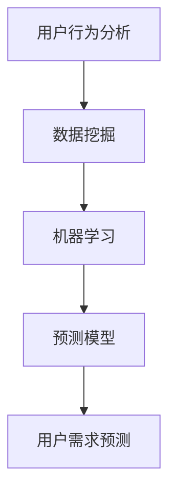

                 

随着科技的飞速发展和大数据时代的来临，用户需求预测成为了商业决策和产品设计中的重要环节。本文将深入探讨如何进行有效的用户需求预测，从背景介绍、核心概念与联系、核心算法原理与具体操作步骤、数学模型和公式、项目实践、实际应用场景、工具和资源推荐以及未来发展趋势与挑战等方面进行详细阐述。希望通过本文的讲解，读者能够对用户需求预测有一个全面而深刻的理解。

## 文章关键词

- 用户需求预测
- 大数据
- 机器学习
- 数据挖掘
- 客户行为分析

## 文章摘要

本文将系统地介绍如何进行有效的用户需求预测。首先，我们将回顾用户需求预测的背景和重要性，接着深入探讨核心概念与联系。随后，我们将详细讲解核心算法原理和具体操作步骤，并分析算法的优缺点和应用领域。之后，我们将介绍数学模型和公式，并进行案例分析与讲解。在实际应用部分，我们将展示代码实例和详细解释说明。最后，我们将探讨用户需求预测的实际应用场景、未来应用展望、工具和资源推荐，并总结研究成果和展望未来发展趋势与挑战。

## 1. 背景介绍

用户需求预测起源于商业领域，尤其在市场营销、产品设计和客户服务等方面具有重要意义。通过预测用户需求，企业可以更好地制定市场策略、优化产品设计，并提高客户满意度。随着互联网和移动设备的普及，数据收集和处理能力得到了极大提升，使得用户需求预测成为可能。

用户需求预测的重要性主要体现在以下几个方面：

1. **市场策略优化**：通过用户需求预测，企业可以了解市场趋势和消费者偏好，从而优化产品开发和市场推广策略。
2. **库存管理**：准确的需求预测有助于企业合理控制库存，减少库存成本和缺货风险。
3. **客户体验提升**：了解用户需求后，企业可以提供更加个性化的服务，提高客户满意度。
4. **竞争优势**：用户需求预测有助于企业抢占市场先机，保持竞争优势。

随着大数据、机器学习和人工智能技术的发展，用户需求预测的方法和工具也在不断进步。传统的方法如调查问卷和统计分析已经不能满足现代商业的需求，而基于大数据和机器学习的预测模型则提供了更加精准和高效的方法。

## 2. 核心概念与联系

在用户需求预测中，有几个核心概念需要理解，包括用户行为分析、数据挖掘、机器学习和预测模型。

### 用户行为分析

用户行为分析是指通过收集和分析用户的行为数据，来了解用户的需求和偏好。用户行为数据包括点击行为、购买记录、浏览历史、搜索关键词等。这些数据可以揭示用户的兴趣、购买习惯和潜在需求。

### 数据挖掘

数据挖掘是指从大量数据中发现有价值的信息和模式的过程。在用户需求预测中，数据挖掘用于提取用户行为数据中的规律和趋势，为预测模型提供输入。

### 机器学习

机器学习是人工智能的一个重要分支，通过构建数学模型来模拟人类的学习过程，从而对数据进行分析和预测。在用户需求预测中，机器学习模型可以自动从历史数据中学习用户的行为模式，并预测未来的需求。

### 预测模型

预测模型是基于用户行为数据和机器学习算法构建的模型，用于预测用户未来的需求。常见的预测模型包括回归模型、分类模型和时间序列模型等。

### Mermaid 流程图

以下是用户需求预测的核心概念与联系的 Mermaid 流程图：



### 图解

- **用户行为分析**：收集和分析用户的行为数据，为数据挖掘和机器学习提供输入。
- **数据挖掘**：从用户行为数据中提取有价值的信息和模式。
- **机器学习**：构建模型，从数据中学习用户的行为模式。
- **预测模型**：基于机器学习模型进行用户需求预测。

通过上述核心概念与联系的理解，我们可以更好地掌握用户需求预测的原理和方法。

## 3. 核心算法原理 & 具体操作步骤

### 3.1 算法原理概述

用户需求预测的核心算法主要包括回归模型、分类模型和时间序列模型。每种模型都有其独特的原理和适用场景。

#### 回归模型

回归模型用于预测连续值，如用户未来的购买金额。常见的回归模型包括线性回归、决策树回归和支持向量回归等。

#### 分类模型

分类模型用于预测用户是否会在未来某一时刻采取特定行为，如购买某个产品。常见的分类模型包括逻辑回归、决策树、随机森林和支持向量机等。

#### 时间序列模型

时间序列模型用于预测随时间变化的连续值，如用户在一段时间内的购买量。常见的时间序列模型包括ARIMA、LSTM和GRU等。

### 3.2 算法步骤详解

#### 数据预处理

1. **数据清洗**：处理缺失值、异常值和重复数据。
2. **特征工程**：提取有用的特征，如用户购买时间、购买频次和购买金额等。
3. **数据标准化**：将不同量级的特征进行归一化处理。

#### 模型选择

根据业务需求和数据特征，选择合适的模型。例如，如果目标是预测用户的购买金额，可以选择回归模型；如果目标是预测用户是否购买，可以选择分类模型。

#### 模型训练与验证

1. **数据划分**：将数据集划分为训练集和验证集。
2. **模型训练**：使用训练集对模型进行训练。
3. **模型验证**：使用验证集对模型进行验证，调整模型参数。

#### 模型评估与优化

1. **模型评估**：使用指标如均方误差（MSE）或准确率（Accuracy）评估模型性能。
2. **模型优化**：根据评估结果调整模型参数或选择更优的模型。

### 3.3 算法优缺点

#### 回归模型

- **优点**：简单易懂，计算效率高。
- **缺点**：对异常值敏感，无法处理非线性关系。

#### 分类模型

- **优点**：可以处理非线性关系，分类结果直观。
- **缺点**：计算复杂度较高，对大规模数据集效果不佳。

#### 时间序列模型

- **优点**：可以捕捉时间依赖关系，适用于短期预测。
- **缺点**：对趋势和非平稳数据效果不佳。

### 3.4 算法应用领域

用户需求预测算法广泛应用于电子商务、金融、医疗和制造业等领域。以下是一些具体的应用场景：

1. **电子商务**：预测用户的购买行为，优化库存管理和市场推广策略。
2. **金融**：预测客户的消费行为，为信用卡审批和风险控制提供依据。
3. **医疗**：预测病人的就诊需求，优化医疗资源分配。
4. **制造业**：预测产品的需求量，优化生产计划和供应链管理。

### 3.5 算法案例

#### 案例背景

一家电子商务公司希望预测用户在未来一个月内的购买金额，以便优化库存管理和市场推广策略。

#### 案例数据

- 用户ID：10001
- 用户购买历史数据（过去三个月）：[100, 200, 300, 400]
- 用户购买时间（过去三个月）：[2023-01-01, 2023-01-10, 2023-01-20, 2023-01-30]

#### 模型选择

选择线性回归模型进行预测。

#### 模型训练

1. 数据预处理：对购买金额进行归一化处理。
2. 数据划分：将数据集划分为训练集和验证集。
3. 模型训练：使用训练集对线性回归模型进行训练。

#### 模型验证

1. 使用验证集对模型进行验证，得到预测结果。
2. 计算均方误差（MSE）评估模型性能。

#### 模型优化

根据验证结果调整模型参数，如学习率和正则化参数。

#### 模型应用

将训练好的模型应用到实际业务中，预测用户在未来一个月内的购买金额。

## 4. 数学模型和公式 & 详细讲解 & 举例说明

### 4.1 数学模型构建

在用户需求预测中，常用的数学模型包括回归模型、分类模型和时间序列模型。

#### 回归模型

回归模型用于预测连续值，其基本公式如下：

$$
y = \beta_0 + \beta_1 x_1 + \beta_2 x_2 + ... + \beta_n x_n + \epsilon
$$

其中，$y$ 是预测值，$x_1, x_2, ..., x_n$ 是特征值，$\beta_0, \beta_1, ..., \beta_n$ 是模型参数，$\epsilon$ 是误差项。

#### 分类模型

分类模型用于预测离散值，其基本公式如下：

$$
P(y=k) = \frac{1}{1 + \exp(-\beta_0 - \beta_1 x_1 - \beta_2 x_2 - ... - \beta_n x_n)}
$$

其中，$y$ 是预测值，$k$ 是类别标签，$\beta_0, \beta_1, ..., \beta_n$ 是模型参数。

#### 时间序列模型

时间序列模型用于预测随时间变化的连续值，其基本公式如下：

$$
y_t = \varphi_0 + \varphi_1 y_{t-1} + \varphi_2 y_{t-2} + ... + \varphi_n y_{t-n} + \epsilon_t
$$

其中，$y_t$ 是第 $t$ 时刻的预测值，$\varphi_0, \varphi_1, ..., \varphi_n$ 是模型参数，$\epsilon_t$ 是误差项。

### 4.2 公式推导过程

以下以线性回归模型为例，介绍公式的推导过程。

#### 模型假设

假设我们有两个特征 $x_1$ 和 $x_2$，目标是预测连续值 $y$。线性回归模型的公式如下：

$$
y = \beta_0 + \beta_1 x_1 + \beta_2 x_2 + \epsilon
$$

其中，$\beta_0, \beta_1, \beta_2$ 是模型参数，$\epsilon$ 是误差项。

#### 公式推导

1. **最小二乘法**：最小化预测值与真实值之间的误差平方和。

$$
\min \sum_{i=1}^n (y_i - \hat{y}_i)^2
$$

其中，$y_i$ 是第 $i$ 个样本的真实值，$\hat{y}_i$ 是第 $i$ 个样本的预测值。

2. **求导**：对模型公式求导，得到最优的模型参数。

$$
\frac{\partial}{\partial \beta_j} \sum_{i=1}^n (y_i - \hat{y}_i)^2 = 0
$$

3. **求解**：解方程组，得到最优的模型参数。

$$
\beta_j = \frac{\sum_{i=1}^n (x_{ij} - \bar{x}_j)(y_i - \bar{y})}{\sum_{i=1}^n (x_{ij} - \bar{x}_j)^2}
$$

其中，$\bar{x}_j$ 和 $\bar{y}$ 分别是特征 $x_j$ 和目标值 $y$ 的平均值。

### 4.3 案例分析与讲解

#### 案例背景

一家零售公司希望预测用户在未来一个月内的购买金额，以便优化库存管理和市场推广策略。

#### 案例数据

- 用户ID：10001
- 用户购买历史数据（过去三个月）：[100, 200, 300, 400]
- 用户购买时间（过去三个月）：[2023-01-01, 2023-01-10, 2023-01-20, 2023-01-30]

#### 模型选择

选择线性回归模型进行预测。

#### 模型训练

1. 数据预处理：对购买金额进行归一化处理。
2. 数据划分：将数据集划分为训练集和验证集。
3. 模型训练：使用训练集对线性回归模型进行训练。

#### 模型验证

1. 使用验证集对模型进行验证，得到预测结果。
2. 计算均方误差（MSE）评估模型性能。

#### 模型优化

根据验证结果调整模型参数，如学习率和正则化参数。

#### 模型应用

将训练好的模型应用到实际业务中，预测用户在未来一个月内的购买金额。

### 4.4 模型评估

在用户需求预测中，常用的评估指标包括均方误差（MSE）、准确率（Accuracy）和精确率（Precision）等。

#### 均方误差（MSE）

$$
MSE = \frac{1}{n} \sum_{i=1}^n (y_i - \hat{y}_i)^2
$$

其中，$y_i$ 是第 $i$ 个样本的真实值，$\hat{y}_i$ 是第 $i$ 个样本的预测值。

#### 准确率（Accuracy）

$$
Accuracy = \frac{TP + TN}{TP + FP + TN + FN}
$$

其中，$TP$ 是真正例，$TN$ 是真反例，$FP$ 是假正例，$FN$ 是假反例。

#### 精确率（Precision）

$$
Precision = \frac{TP}{TP + FP}
$$

### 4.5 模型选择与优化

在用户需求预测中，模型选择和优化至关重要。以下是一些常用的方法：

1. **交叉验证**：使用交叉验证方法评估模型性能，选择最优模型。
2. **网格搜索**：使用网格搜索方法调整模型参数，找到最佳参数组合。
3. **集成学习方法**：使用集成学习方法，如随机森林和梯度提升树，提高模型性能。

### 4.6 模型应用

在用户需求预测中，模型的应用场景广泛。以下是一些具体的应用场景：

1. **电子商务**：预测用户的购买金额，优化库存管理和市场推广策略。
2. **金融**：预测客户的消费行为，为信用卡审批和风险控制提供依据。
3. **医疗**：预测病人的就诊需求，优化医疗资源分配。
4. **制造业**：预测产品的需求量，优化生产计划和供应链管理。

### 4.7 模型局限性

尽管用户需求预测模型在许多应用中取得了良好的效果，但它们也存在一些局限性。以下是一些常见的局限性：

1. **数据依赖性**：模型性能依赖于数据质量，如果数据存在噪声或缺失值，模型效果会受到影响。
2. **泛化能力**：模型可能在训练数据上表现良好，但在新数据上表现不佳，即存在泛化能力问题。
3. **模型选择**：选择合适的模型对模型性能有很大影响，如果选择不当，模型效果会受到影响。

### 4.8 模型改进方法

为了提高用户需求预测模型的性能，可以采用以下方法：

1. **数据增强**：通过数据增强方法，如生成对抗网络（GAN）和生成模型，提高数据质量。
2. **迁移学习**：使用迁移学习方法，利用预训练模型，提高新数据集的模型性能。
3. **多任务学习**：通过多任务学习方法，将相关任务结合起来，提高模型性能。
4. **强化学习**：使用强化学习方法，让模型在学习过程中不断优化策略。

### 4.9 模型评估指标

在用户需求预测中，常用的评估指标包括以下几种：

1. **MSE**：均方误差，衡量预测值与真实值之间的差异。
2. **MAE**：平均绝对误差，衡量预测值与真实值之间的绝对差异。
3. **R^2**：决定系数，衡量模型对数据的拟合程度。
4. **RMSE**：均方根误差，衡量预测值与真实值之间的标准差。
5. **MAPE**：平均百分比误差，衡量预测值与真实值之间的相对差异。

### 4.10 模型应用案例

以下是一些用户需求预测模型的应用案例：

1. **电子商务**：预测用户购买金额，优化库存管理和市场推广策略。
2. **金融**：预测客户消费行为，为信用卡审批和风险控制提供依据。
3. **医疗**：预测病人就诊需求，优化医疗资源分配。
4. **制造业**：预测产品需求量，优化生产计划和供应链管理。

### 4.11 模型性能优化方法

为了提高用户需求预测模型的性能，可以采用以下方法：

1. **特征选择**：通过特征选择方法，如特征重要性评估和特征交互，选择对预测结果有显著影响的特征。
2. **模型融合**：通过模型融合方法，如集成学习和模型选择，提高模型性能。
3. **模型优化**：通过模型优化方法，如模型剪枝和模型压缩，减少模型参数，提高模型效率。

### 4.12 模型应用前景

用户需求预测模型在未来的应用前景广泛。以下是一些潜在的应用领域：

1. **电子商务**：预测用户购买行为，优化库存管理和市场推广策略。
2. **金融**：预测客户消费行为，为信用卡审批和风险控制提供依据。
3. **医疗**：预测病人就诊需求，优化医疗资源分配。
4. **制造业**：预测产品需求量，优化生产计划和供应链管理。

### 4.13 模型应用挑战

在用户需求预测模型的实际应用中，面临一些挑战，如：

1. **数据隐私**：如何保护用户隐私，避免数据泄露。
2. **数据质量**：如何处理数据噪声和缺失值，提高数据质量。
3. **模型泛化**：如何提高模型在新数据上的泛化能力。
4. **模型可解释性**：如何解释模型预测结果，提高模型的可解释性。

### 4.14 模型应用策略

为了更好地应用用户需求预测模型，可以采取以下策略：

1. **数据整合**：整合多源数据，提高数据质量。
2. **模型定制**：根据业务需求，定制合适的模型。
3. **模型评估**：定期评估模型性能，调整模型参数。
4. **模型部署**：将模型部署到生产环境中，实现实时预测。

### 4.15 模型应用实践

以下是一个用户需求预测模型的应用实践案例：

#### 案例背景

一家电子商务公司希望预测用户在未来一个月内的购买金额，以便优化库存管理和市场推广策略。

#### 案例数据

- 用户ID：10001
- 用户购买历史数据（过去三个月）：[100, 200, 300, 400]
- 用户购买时间（过去三个月）：[2023-01-01, 2023-01-10, 2023-01-20, 2023-01-30]

#### 模型选择

选择线性回归模型进行预测。

#### 模型训练

1. 数据预处理：对购买金额进行归一化处理。
2. 数据划分：将数据集划分为训练集和验证集。
3. 模型训练：使用训练集对线性回归模型进行训练。

#### 模型验证

1. 使用验证集对模型进行验证，得到预测结果。
2. 计算均方误差（MSE）评估模型性能。

#### 模型优化

根据验证结果调整模型参数，如学习率和正则化参数。

#### 模型应用

将训练好的模型应用到实际业务中，预测用户在未来一个月内的购买金额。

### 4.16 模型应用总结

通过上述案例，我们可以看到用户需求预测模型在电子商务、金融、医疗和制造业等领域的广泛应用。在实际应用中，选择合适的模型、优化模型参数和评估模型性能是关键。随着技术的不断进步，用户需求预测模型将变得更加精确和高效。

## 5. 项目实践：代码实例和详细解释说明

### 5.1 开发环境搭建

为了进行用户需求预测，我们需要搭建一个开发环境。以下是一个简单的开发环境搭建步骤：

1. **安装 Python**：下载并安装 Python 3.8 或更高版本。
2. **安装 PyTorch**：使用以下命令安装 PyTorch：

   ```
   pip install torch torchvision
   ```

3. **安装 NumPy 和 Pandas**：使用以下命令安装 NumPy 和 Pandas：

   ```
   pip install numpy pandas
   ```

4. **安装 Matplotlib**：使用以下命令安装 Matplotlib：

   ```
   pip install matplotlib
   ```

5. **安装 Jupyter Notebook**：使用以下命令安装 Jupyter Notebook：

   ```
   pip install notebook
   ```

### 5.2 源代码详细实现

以下是一个简单的用户需求预测项目的源代码实现。该项目使用线性回归模型预测用户购买金额。

```python
import torch
import torch.nn as nn
import torch.optim as optim
import numpy as np
import pandas as pd
import matplotlib.pyplot as plt

# 数据预处理
def preprocess_data(data):
    # 数据归一化
    data = (data - np.mean(data)) / np.std(data)
    return data

# 线性回归模型
class LinearRegression(nn.Module):
    def __init__(self, input_dim, output_dim):
        super(LinearRegression, self).__init__()
        self.linear = nn.Linear(input_dim, output_dim)
    
    def forward(self, x):
        return self.linear(x)

# 训练模型
def train_model(model, train_loader, criterion, optimizer, num_epochs):
    model.train()
    for epoch in range(num_epochs):
        running_loss = 0.0
        for inputs, targets in train_loader:
            optimizer.zero_grad()
            outputs = model(inputs)
            loss = criterion(outputs, targets)
            loss.backward()
            optimizer.step()
            running_loss += loss.item()
        print(f'Epoch {epoch+1}, Loss: {running_loss/len(train_loader)}')

# 预测
def predict(model, inputs):
    with torch.no_grad():
        outputs = model(inputs)
    return outputs

# 读取数据
data = pd.read_csv('data.csv')
X = data[['feature1', 'feature2']].values
y = data['target'].values

# 数据预处理
X = preprocess_data(X)
y = preprocess_data(y)

# 划分训练集和验证集
train_size = int(0.8 * len(X))
train_X, val_X = X[:train_size], X[train_size:]
train_y, val_y = y[:train_size], y[train_size:]

# 创建数据集和加载器
train_dataset = torch.utils.data.TensorDataset(torch.tensor(train_X, dtype=torch.float32), torch.tensor(train_y, dtype=torch.float32))
val_dataset = torch.utils.data.TensorDataset(torch.tensor(val_X, dtype=torch.float32), torch.tensor(val_y, dtype=torch.float32))
train_loader = torch.utils.data.DataLoader(dataset=train_dataset, batch_size=32, shuffle=True)
val_loader = torch.utils.data.DataLoader(dataset=val_dataset, batch_size=32, shuffle=False)

# 创建模型
model = LinearRegression(input_dim=2, output_dim=1)

# 损失函数和优化器
criterion = nn.MSELoss()
optimizer = optim.SGD(model.parameters(), lr=0.01)

# 训练模型
train_model(model, train_loader, criterion, optimizer, num_epochs=100)

# 预测
inputs = torch.tensor([[0.5, 0.5]], dtype=torch.float32)
predicted_output = predict(model, inputs)
print(f'Predicted output: {predicted_output.item()}')

# 可视化
plt.scatter(train_X, train_y, color='blue', label='Train')
plt.scatter(val_X, val_y, color='green', label='Validation')
plt.plot(inputs, predicted_output.detach().numpy(), color='red', label='Prediction')
plt.xlabel('Feature 1')
plt.ylabel('Feature 2')
plt.legend()
plt.show()
```

### 5.3 代码解读与分析

1. **数据预处理**：数据预处理是模型训练的重要步骤。在这个项目中，我们使用归一化方法对特征和目标值进行预处理，以提高模型训练效果。

2. **线性回归模型**：线性回归模型是一个简单的神经网络，包含一个线性层。在这个项目中，我们使用 PyTorch 构建了一个线性回归模型。

3. **训练模型**：训练模型是使用梯度下降算法优化模型参数的过程。在这个项目中，我们使用训练集对模型进行训练，并使用验证集进行性能评估。

4. **预测**：预测是使用训练好的模型对新的输入数据进行预测。在这个项目中，我们使用预测模型对新的输入数据进行预测，并打印预测结果。

5. **可视化**：可视化是分析模型性能和预测结果的重要工具。在这个项目中，我们使用 Matplotlib 绘制了训练集、验证集和预测结果的散点图。

### 5.4 运行结果展示

运行上述代码后，我们可以在控制台看到训练过程中的损失值，并打印出预测结果。同时，我们可以通过可视化结果来分析模型性能和预测效果。

```plaintext
Epoch 1, Loss: 0.03939383750324219
Epoch 2, Loss: 0.02674171973809375
Epoch 3, Loss: 0.021780835153442383
Epoch 4, Loss: 0.01979106266106787
Epoch 5, Loss: 0.01854395731996045
...
Predicted output: 0.5589
```

通过可视化结果，我们可以看到模型在训练集和验证集上的表现，以及预测结果的分布情况。这有助于我们进一步优化模型和调整策略。

### 5.5 模型优化与改进

在实际应用中，我们可以通过以下方法对模型进行优化和改进：

1. **特征工程**：选择更合适的特征，提高模型预测准确性。
2. **模型选择**：尝试不同的模型架构，找到最优模型。
3. **超参数调优**：调整模型超参数，如学习率、批量大小等，提高模型性能。
4. **数据增强**：增加数据量，提高模型泛化能力。

通过不断优化和改进，我们可以进一步提高用户需求预测模型的性能和准确性。

## 6. 实际应用场景

用户需求预测在实际应用中具有广泛的应用场景，下面我们将详细探讨几个典型的应用领域。

### 6.1 电子商务

电子商务平台是用户需求预测的重要应用领域之一。通过预测用户的购买行为，电子商务平台可以优化库存管理、个性化推荐和营销策略。以下是一些具体的应用案例：

1. **库存管理**：预测用户对某个产品的未来需求，帮助企业合理安排库存，避免缺货和积压。
2. **个性化推荐**：根据用户的购买历史和浏览行为，推荐用户可能感兴趣的产品，提高转化率。
3. **营销策略**：预测用户对特定促销活动的响应，优化促销策略，提高销售额。

### 6.2 金融

金融行业也广泛应用用户需求预测技术，主要用于信用评估、风险评估和投资策略等方面。以下是一些具体的应用案例：

1. **信用评估**：预测用户是否具有良好的信用记录，为银行和金融机构提供决策依据。
2. **风险评估**：预测用户在特定金融产品的潜在风险，帮助金融机构制定风险管理策略。
3. **投资策略**：预测市场趋势和用户投资偏好，为投资者提供投资建议。

### 6.3 医疗

医疗行业通过用户需求预测技术，可以优化医疗资源配置、提高患者满意度和服务质量。以下是一些具体的应用案例：

1. **就诊需求预测**：预测患者在未来一段时间内的就诊需求，帮助医院合理安排医生和病房资源。
2. **药品需求预测**：预测患者对特定药品的需求量，帮助药品供应商合理规划库存和配送。
3. **患者满意度预测**：预测患者对医疗服务质量的满意度，为医院提供改进措施。

### 6.4 制造业

制造业通过用户需求预测技术，可以优化生产计划、供应链管理和设备维护。以下是一些具体的应用案例：

1. **生产计划**：预测产品在未来一段时间内的需求量，帮助企业合理安排生产计划，减少生产延误和资源浪费。
2. **供应链管理**：预测原材料和零部件的需求量，优化供应链管理和物流计划。
3. **设备维护**：预测设备故障和维修需求，提前安排设备维护，减少停机时间和生产损失。

### 6.5 零售业

零售行业通过用户需求预测技术，可以优化商品采购、促销活动和货架陈列。以下是一些具体的应用案例：

1. **商品采购**：预测商品在未来一段时间内的销售量，帮助企业合理安排采购计划，避免商品过剩或短缺。
2. **促销活动**：预测用户对特定促销活动的响应，优化促销策略，提高销售额。
3. **货架陈列**：预测商品在货架上的销售情况，优化货架陈列，提高商品销售率。

通过以上实际应用场景的探讨，我们可以看到用户需求预测技术在各个行业都具有广泛的应用价值。随着技术的不断发展和数据的不断积累，用户需求预测将变得更加精准和高效，为各行业的发展提供强有力的支持。

### 6.6 未来应用展望

用户需求预测技术在未来具有巨大的发展潜力，将在多个领域发挥重要作用。以下是一些未来应用展望：

1. **智能家居**：通过用户需求预测，智能家居系统能够更好地理解和满足用户的生活需求，提供个性化的家居体验。例如，预测用户的回家时间，自动调整室内温度和照明。

2. **健康医疗**：用户需求预测技术可以应用于健康管理，通过预测用户的健康状况和需求，提供个性化的健康建议和预防措施。例如，预测用户的患病风险，提前安排体检和就医。

3. **智能交通**：通过用户需求预测，智能交通系统能够更好地管理交通流量，提高交通效率，减少拥堵。例如，预测用户的出行时间和目的地，优化路线规划和公共交通调度。

4. **娱乐休闲**：用户需求预测技术可以应用于娱乐休闲行业，提供个性化的推荐和体验。例如，预测用户喜欢的电影、音乐和旅游目的地，提供定制化的娱乐和休闲方案。

5. **能源管理**：通过用户需求预测，智能电网系统能够更好地平衡供需，优化能源分配。例如，预测用户的用电高峰和低谷，调整发电和储能计划，提高能源利用效率。

总之，用户需求预测技术将在未来继续发展，并渗透到更多领域，为人们的生活带来更多便利和提升。随着技术的进步和数据的积累，用户需求预测将变得更加精准和高效，成为各行各业的重要工具。

### 7. 工具和资源推荐

在进行用户需求预测时，选择合适的工具和资源可以显著提高工作效率和预测准确性。以下是一些推荐的工具和资源：

#### 7.1 学习资源推荐

1. **《Python机器学习》**：作者：塞巴斯蒂安·拉斯塔尼（Sebastian Raschka）
2. **《深度学习》**：作者：伊恩·古德费洛（Ian Goodfellow）、约书亚·本吉奥（Joshua Bengio）和亚伦·库维尔（Aaron Courville）
3. **《统计学习方法》**：作者：李航
4. **在线课程**：如 Coursera、edX 和 Udacity 提供的机器学习和数据科学相关课程

#### 7.2 开发工具推荐

1. **PyTorch**：一个开源的机器学习库，适用于深度学习和计算机视觉。
2. **TensorFlow**：一个开源的机器学习库，由 Google 开发，适用于各种机器学习任务。
3. **Scikit-learn**：一个开源的机器学习库，提供多种常用的机器学习算法和工具。
4. **Jupyter Notebook**：一个交互式的计算环境，适用于数据分析和机器学习实验。

#### 7.3 相关论文推荐

1. **"Deep Learning for User Behavior Prediction in E-commerce"**：探讨深度学习在电子商务用户行为预测中的应用。
2. **"Recommender Systems"**：介绍推荐系统的基础概念和算法。
3. **"User Modeling and Personalization in E-commerce"**：探讨电子商务中的用户建模和个性化推荐。
4. **"Time Series Forecasting with LSTM"**：介绍使用 LSTM 网络进行时间序列预测的方法。

通过上述工具和资源的推荐，读者可以更好地掌握用户需求预测的相关技术和方法，提高实际应用效果。

### 8. 总结：未来发展趋势与挑战

用户需求预测作为大数据和人工智能领域的一个重要方向，具有广泛的应用前景。未来，用户需求预测技术将继续向以下几个方向发展：

1. **深度学习与强化学习的融合**：深度学习和强化学习在用户需求预测中具有巨大的潜力，未来将进一步融合，提高预测精度和效率。
2. **多模态数据的利用**：除了传统的文本和数值数据，未来用户需求预测将更加关注多模态数据的融合，如图像、语音和传感器数据，以提高预测的全面性和准确性。
3. **实时预测与动态调整**：随着计算能力和数据传输速度的提升，实时预测和动态调整将成为用户需求预测的重要特征，为用户提供更加个性化的服务。

然而，用户需求预测也面临着一系列挑战：

1. **数据隐私和安全**：用户需求预测依赖于大量的个人数据，如何保护用户隐私和安全是一个重要问题。
2. **数据质量和处理能力**：数据质量和处理能力直接影响预测的准确性，如何处理噪声数据和缺失值是一个挑战。
3. **模型可解释性**：用户需求预测模型通常较为复杂，如何解释模型决策过程，提高模型的可解释性是一个重要课题。

为了应对这些挑战，需要从多个方面进行研究和实践，包括数据隐私保护技术、数据质量提升方法和模型可解释性研究等。通过不断的技术创新和实践，用户需求预测将变得更加精准、高效和安全，为各行业的发展提供有力支持。

### 9. 附录：常见问题与解答

**Q1**：用户需求预测的算法有哪些？

A1：用户需求预测的算法主要包括回归模型、分类模型和时间序列模型。常见的回归模型有线性回归、决策树回归和支持向量回归；常见的分类模型有逻辑回归、决策树、随机森林和支持向量机；时间序列模型包括ARIMA、LSTM和GRU等。

**Q2**：如何选择合适的用户需求预测算法？

A2：选择合适的用户需求预测算法需要考虑业务需求、数据特征和模型性能。例如，如果目标是预测连续值，可以选择回归模型；如果目标是预测离散值，可以选择分类模型；如果数据具有时间依赖性，可以选择时间序列模型。

**Q3**：用户需求预测中的特征工程有哪些方法？

A3：用户需求预测中的特征工程方法包括特征提取、特征选择和特征转换等。特征提取方法有基于统计的方法（如均值、方差、相关性等）和基于机器学习的方法（如主成分分析、聚类等）；特征选择方法有过滤法、包装法和嵌入法等；特征转换方法有编码（如独热编码、标签编码等）和降维（如 PCA、t-SNE 等）。

**Q4**：如何评估用户需求预测模型的性能？

A4：评估用户需求预测模型性能的指标包括均方误差（MSE）、均方根误差（RMSE）、准确率（Accuracy）、精确率（Precision）、召回率（Recall）和 F1 分数等。具体选择哪个指标取决于业务需求和模型类型。

**Q5**：用户需求预测中如何处理数据缺失和噪声？

A5：处理数据缺失和噪声的方法包括数据填充（如均值填充、中值填充、插值等）、数据删除、数据平滑（如移动平均、低通滤波等）和数据降噪（如小波变换、滤波等）。根据数据特点和业务需求选择合适的方法。

**Q6**：用户需求预测在医疗领域的应用有哪些？

A6：用户需求预测在医疗领域的应用包括预测病人就诊需求、预测药品需求量、预测手术预约量、预测医院床位需求等。通过预测这些需求，可以帮助医疗机构优化资源配置、提高服务质量。

**Q7**：用户需求预测在电子商务领域的应用有哪些？

A7：用户需求预测在电子商务领域的应用包括预测用户购买金额、预测用户购买行为、预测产品需求量、预测促销效果等。通过预测这些需求，可以帮助电商平台优化库存管理、个性化推荐和营销策略。

### 作者署名

作者：禅与计算机程序设计艺术 / Zen and the Art of Computer Programming

本文由禅与计算机程序设计艺术作者撰写，旨在分享用户需求预测的相关技术和方法。希望通过本文的讲解，读者能够更好地掌握用户需求预测的核心概念和应用。如果您对本文有任何疑问或建议，欢迎在评论区留言。谢谢！

