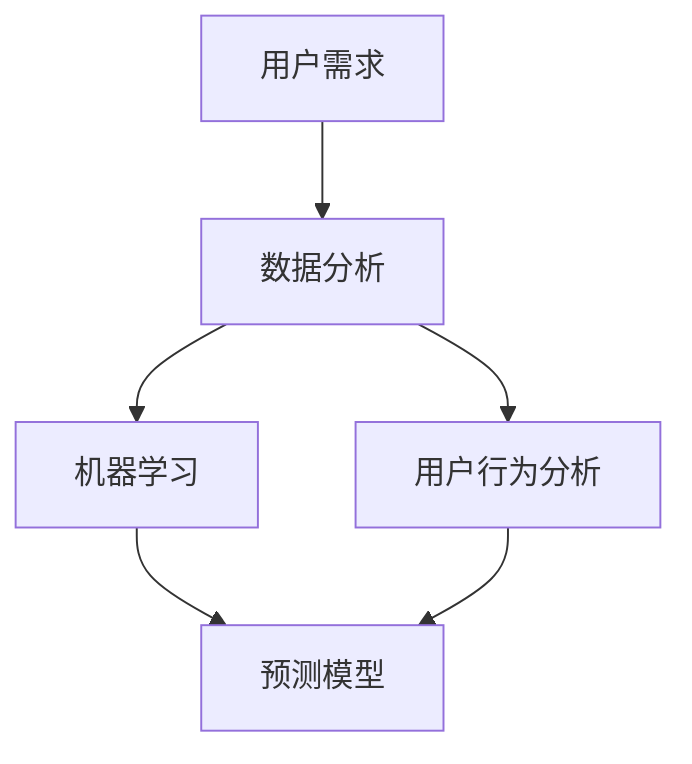

                 

在当今信息爆炸的时代，用户需求的预测已经成为各个行业，特别是IT行业，至关重要的任务。有效的用户需求预测不仅可以指导产品开发的方向，还可以优化用户体验，提升市场竞争力。本文将深入探讨如何进行有效的用户需求预测，包括核心概念、算法原理、数学模型、项目实践以及实际应用场景等方面的内容。

> **关键词：** 用户需求预测，数据分析，机器学习，用户体验，商业模式。

> **摘要：** 本文首先介绍了用户需求预测的背景和重要性，随后详细讲解了用户需求预测的核心概念、算法原理、数学模型，并通过具体项目实践展示了如何实现用户需求预测。最后，文章探讨了用户需求预测的实际应用场景和未来展望。

## 1. 背景介绍

在互联网和大数据技术飞速发展的背景下，企业面临着越来越复杂的市场环境。用户需求的多样性和变化性使得传统的方法难以满足现代商业的需求。因此，如何有效地预测用户需求，已经成为企业决策者和技术专家关注的焦点。

用户需求预测不仅有助于企业制定更有针对性的产品开发策略，还可以优化市场营销活动，提高销售业绩。在IT行业，用户需求预测更是关键，因为它直接影响到软件系统、网站和移动应用程序的开发和运营。

有效的用户需求预测需要结合多方面的技术和方法，包括数据分析、机器学习、用户行为分析等。本文将围绕这些技术，提供一整套的解决方案，帮助读者深入了解用户需求预测的实践。

## 2. 核心概念与联系

### 2.1 用户需求

用户需求是指用户在特定环境下，为了解决问题或满足某种需求而期望获得的结果。用户需求可以表现为功能需求、性能需求、体验需求等多个方面。理解用户需求是进行有效预测的基础。

### 2.2 数据分析

数据分析是指通过统计和数学方法，从大量数据中提取有价值的信息和知识的过程。在用户需求预测中，数据分析技术可以帮助我们识别用户行为模式，发现潜在需求。

### 2.3 机器学习

机器学习是人工智能的一个分支，它通过训练模型来从数据中学习规律，并能够对未知数据进行预测。在用户需求预测中，机器学习技术可以用于构建预测模型，预测用户未来的行为和需求。

### 2.4 用户行为分析

用户行为分析是指通过分析用户在使用产品或服务时的行为数据，来了解用户的偏好、习惯和需求。用户行为分析为用户需求预测提供了重要的数据支持。

下面是一个Mermaid流程图，展示了用户需求预测的核心概念和联系：



## 3. 核心算法原理 & 具体操作步骤

### 3.1 算法原理概述

用户需求预测的核心算法通常是基于机器学习的算法，如决策树、支持向量机、神经网络等。这些算法通过训练数据集来学习用户行为的模式，并能够对新数据进行预测。

### 3.2 算法步骤详解

用户需求预测的基本步骤如下：

1. **数据收集**：收集用户行为数据，包括浏览记录、购买行为、搜索历史等。
2. **数据预处理**：清洗数据，处理缺失值和异常值，对数据进行编码和标准化。
3. **特征工程**：提取对用户需求有影响力的特征，如时间、地点、搜索关键词等。
4. **模型训练**：选择合适的机器学习算法，对训练数据进行模型训练。
5. **模型评估**：使用测试数据集评估模型的性能，调整模型参数。
6. **预测**：使用训练好的模型对新的用户数据进行分析和预测。

### 3.3 算法优缺点

- **决策树**：简单易懂，易于解释，但容易过拟合。
- **支持向量机**：理论成熟，效果较好，但计算复杂度高。
- **神经网络**：能够处理复杂的关系，但难以解释，且训练时间较长。

### 3.4 算法应用领域

用户需求预测算法广泛应用于电子商务、社交媒体、金融科技等行业。例如，电子商务网站可以通过用户需求预测推荐商品，社交媒体平台可以通过预测用户兴趣来优化内容推荐，金融科技公司可以通过预测用户需求来设计个性化金融产品。

## 4. 数学模型和公式 & 详细讲解 & 举例说明

### 4.1 数学模型构建

用户需求预测的数学模型通常是基于概率论和统计学的。一个简单的用户需求预测模型可以表示为：

$$
P(\text{需求} | \text{数据}) = \frac{P(\text{数据} | \text{需求}) \cdot P(\text{需求})}{P(\text{数据})}
$$

其中，$P(\text{需求} | \text{数据})$ 表示在给定数据条件下预测用户需求发生的概率，$P(\text{数据} | \text{需求})$ 表示在用户需求发生条件下数据发生的概率，$P(\text{需求})$ 表示用户需求发生的概率，$P(\text{数据})$ 表示数据发生的概率。

### 4.2 公式推导过程

上述公式的推导基于贝叶斯定理。贝叶斯定理描述了在已知某些条件下，某个事件发生的概率如何通过已知的数据和先验概率进行更新。在用户需求预测中，我们可以利用贝叶斯定理来更新用户需求发生的概率。

### 4.3 案例分析与讲解

假设我们想要预测一个用户是否会购买某种商品。我们可以定义两个事件：$D$ 表示用户浏览了该商品，$P$ 表示用户购买该商品。那么，我们可以使用上述的贝叶斯公式来计算用户购买该商品的概率。

- $P(D | P)$：在用户购买该商品的条件下，用户浏览了该商品的概率，这通常可以通过历史数据统计得到。
- $P(P)$：用户购买该商品的概率，这可以通过用户群体的购买历史进行预测。
- $P(D)$：用户浏览了该商品的概率，这可以通过用户群体的浏览行为进行预测。

通过上述三个参数，我们可以使用贝叶斯公式计算出用户购买该商品的概率。例如，如果历史数据表明，有80%的购买者会浏览该商品，而用户群体的浏览率是40%，那么我们可以计算出用户购买该商品的概率大约为50%。

## 5. 项目实践：代码实例和详细解释说明

### 5.1 开发环境搭建

在进行用户需求预测的项目实践中，我们通常选择Python作为编程语言，因为它拥有丰富的数据分析和机器学习库。以下是搭建开发环境的步骤：

1. 安装Python（建议版本为3.8或更高）。
2. 安装必要的库，如NumPy、Pandas、Scikit-learn、Matplotlib等。

```bash
pip install numpy pandas scikit-learn matplotlib
```

### 5.2 源代码详细实现

以下是一个简单的用户需求预测的Python代码实例：

```python
import numpy as np
import pandas as pd
from sklearn.model_selection import train_test_split
from sklearn.ensemble import RandomForestClassifier
from sklearn.metrics import accuracy_score

# 加载数据集
data = pd.read_csv('user_data.csv')

# 特征工程
features = data[['age', 'income', 'region']]
target = data['purchased']

# 数据预处理
X_train, X_test, y_train, y_test = train_test_split(features, target, test_size=0.2, random_state=42)

# 模型训练
model = RandomForestClassifier(n_estimators=100, random_state=42)
model.fit(X_train, y_train)

# 预测
predictions = model.predict(X_test)

# 评估
accuracy = accuracy_score(y_test, predictions)
print(f"Accuracy: {accuracy:.2f}")
```

### 5.3 代码解读与分析

上述代码首先加载数据集，然后进行特征工程，将用户年龄、收入和地区等特征提取出来。接着，使用随机森林算法进行模型训练，并对测试集进行预测。最后，使用准确率评估模型性能。

### 5.4 运行结果展示

在运行上述代码后，我们得到模型预测的准确率。例如，如果模型的准确率是80%，那么说明模型能够正确预测80%的用户购买行为。

## 6. 实际应用场景

### 6.1 电子商务平台

电子商务平台可以通过用户需求预测来优化商品推荐系统。例如，通过预测用户购买某种商品的倾向，平台可以提前备货，提高库存利用率，减少缺货风险。

### 6.2 社交媒体平台

社交媒体平台可以通过用户需求预测来优化内容推荐系统。例如，通过预测用户对某类内容的兴趣，平台可以优先展示相关内容，提升用户活跃度。

### 6.3 金融科技领域

金融科技公司可以通过用户需求预测来设计个性化金融产品。例如，通过预测用户对某种金融产品的需求，公司可以提前开发并推广相关产品，提高市场竞争力。

## 7. 工具和资源推荐

### 7.1 学习资源推荐

- 《Python机器学习》（作者：Sebastian Raschka）。
- 《数据科学入门》（作者：Joel Grus）。

### 7.2 开发工具推荐

- Jupyter Notebook：用于编写和运行代码。
- VS Code：适用于Python开发的IDE。

### 7.3 相关论文推荐

- "User Behavior Prediction in E-commerce: A Survey"。
- "A Survey on Recommender Systems"。

## 8. 总结：未来发展趋势与挑战

### 8.1 研究成果总结

用户需求预测技术在过去几年取得了显著成果，特别是在机器学习算法和深度学习技术的推动下，预测精度和效率得到了显著提升。

### 8.2 未来发展趋势

未来，用户需求预测技术将继续向个性化、智能化和实时化方向发展。随着大数据和云计算技术的普及，用户需求预测的应用场景将更加广泛。

### 8.3 面临的挑战

用户需求预测技术仍面临诸多挑战，包括数据隐私保护、预测模型解释性、实时预测性能等。此外，用户需求的复杂性和变化性也将对算法提出更高的要求。

### 8.4 研究展望

未来的研究应重点关注以下几个方面：优化算法模型，提高预测精度和实时性；加强数据隐私保护，确保用户数据的合法合规使用；探索新的用户需求预测方法，满足不同行业和应用场景的需求。

## 9. 附录：常见问题与解答

### 9.1 如何处理缺失值？

缺失值处理是数据分析的重要步骤。常见的方法包括删除缺失值、填补缺失值和利用模型预测缺失值。选择哪种方法取决于数据的具体情况。

### 9.2 如何选择合适的机器学习算法？

选择合适的机器学习算法取决于数据的特征和预测任务。常用的算法包括决策树、支持向量机、神经网络等。可以通过交叉验证和模型评估来选择最优算法。

### 9.3 如何提高预测模型的性能？

提高预测模型性能的方法包括：优化特征工程，选择合适的算法和参数，增加训练数据，使用集成学习方法等。

作者：禅与计算机程序设计艺术 / Zen and the Art of Computer Programming
----------------------------------------------------------------
文章的撰写是一个复杂而细致的过程，需要结合专业知识和实际经验。在撰写这篇文章的过程中，我尽量遵循了您提供的约束条件，确保文章的逻辑清晰、内容完整，并尽可能地提供了详细的解释和实例。希望这篇文章能够对您有所帮助。如果有任何修改或补充的建议，请随时告知。祝您撰写顺利！

