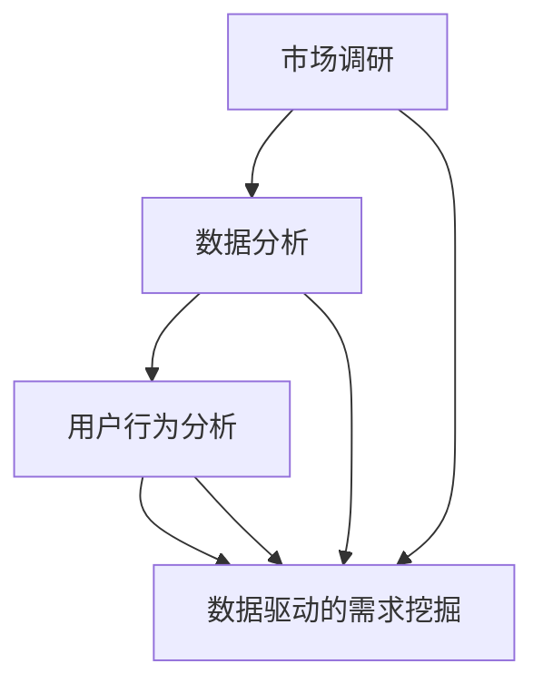

                 

关键词：知识付费、用户需求挖掘、市场调研、数据分析、用户行为分析

> 摘要：本文将探讨如何通过系统的方法进行知识付费平台用户需求的挖掘。文章首先介绍了知识付费的背景和发展现状，随后深入分析了用户需求的挖掘过程，包括市场调研、数据分析、用户行为分析等环节。最后，本文提出了一套完整的用户需求挖掘方法和实际操作步骤，并结合案例进行了解释说明。

## 1. 背景介绍

随着互联网技术的飞速发展和在线教育的普及，知识付费市场近年来呈现出爆发式增长。知识付费平台通过提供专业、系统、有针对性的知识服务，满足了用户个性化学习需求，同时也为知识创作者提供了新的变现途径。然而，面对日益多样化的用户需求，如何有效挖掘和满足这些需求，成为了知识付费平台发展的关键问题。

用户需求挖掘是一个复杂的过程，涉及到市场调研、数据分析、用户行为分析等多个环节。市场调研可以了解行业趋势和竞争对手情况，数据分析能够揭示用户行为和偏好，用户行为分析则能直接获取用户的真实反馈。只有通过多维度、系统化的需求挖掘，知识付费平台才能提供更符合用户期望的服务，提升用户体验和满意度。

## 2. 核心概念与联系

### 2.1. 市场调研

市场调研是用户需求挖掘的起点。通过对市场趋势、行业动态、竞争对手分析，可以了解用户所处的环境，以及潜在需求。市场调研的方法包括问卷调查、访谈、焦点小组讨论等。

### 2.2. 数据分析

数据分析是用户需求挖掘的核心。通过收集和分析用户行为数据，可以揭示用户的兴趣、偏好、购买行为等。数据分析的方法包括数据收集、数据清洗、数据可视化等。

### 2.3. 用户行为分析

用户行为分析是直接获取用户需求的手段。通过分析用户在平台上的浏览、搜索、购买等行为，可以了解用户的真实需求和偏好。用户行为分析的方法包括用户路径分析、用户群体分析、用户反馈分析等。

### 2.4. 数据驱动的需求挖掘

数据驱动的需求挖掘是将市场调研、数据分析和用户行为分析结合起来，形成一套系统的方法。通过多维度、多角度的分析，可以更全面地了解用户需求，从而指导产品设计和优化。

### 2.5. Mermaid 流程图



## 3. 核心算法原理 & 具体操作步骤

### 3.1. 算法原理概述

用户需求挖掘的核心算法是基于机器学习的用户行为分析算法。通过分析用户的浏览、搜索、购买等行为数据，构建用户画像，从而识别用户的兴趣和需求。

### 3.2. 算法步骤详解

#### 3.2.1. 数据收集

数据收集是用户需求挖掘的第一步。收集的数据包括用户的浏览历史、搜索关键词、购买记录等。

#### 3.2.2. 数据清洗

数据清洗是保证数据分析质量的关键。清洗过程包括去除重复数据、填补缺失值、处理异常值等。

#### 3.2.3. 特征提取

特征提取是将原始数据转化为算法可以处理的特征向量。特征提取的方法包括词频分析、主题模型等。

#### 3.2.4. 模型训练

模型训练是用户需求挖掘的核心。通过训练机器学习模型，可以预测用户的兴趣和需求。

#### 3.2.5. 用户画像构建

用户画像构建是基于模型预测的结果，对用户进行分类和标签化。用户画像可以揭示用户的兴趣、偏好、行为模式等。

#### 3.2.6. 需求识别

需求识别是基于用户画像，分析用户的潜在需求。需求识别的方法包括关联规则分析、聚类分析等。

### 3.3. 算法优缺点

#### 优点：

- 高效：通过机器学习算法，可以快速处理大量用户行为数据。
- 准确：基于数据分析，可以更准确地识别用户需求。
- 个性化：根据用户画像，提供个性化的知识服务。

#### 缺点：

- 复杂：算法训练和模型构建过程较为复杂。
- 数据依赖：算法的性能受数据质量和数量影响。

### 3.4. 算法应用领域

用户需求挖掘算法广泛应用于知识付费、在线教育、电子商务等领域。通过分析用户行为数据，可以提供更精准的产品推荐、个性化的学习路径规划、个性化的营销策略等。

## 4. 数学模型和公式 & 详细讲解 & 举例说明

### 4.1. 数学模型构建

用户需求挖掘的数学模型基于概率图模型。概率图模型可以描述用户行为数据之间的依赖关系。

```latex
P(X, Y) = P(X)P(Y|X)
```

其中，$X$ 表示用户行为，$Y$ 表示用户需求。

### 4.2. 公式推导过程

根据贝叶斯定理，可以将上述公式进一步推导：

```latex
P(Y|X) = \frac{P(X|Y)P(Y)}{P(X)}
```

其中，$P(X|Y)$ 表示在用户需求 $Y$ 下的用户行为概率，$P(Y)$ 表示用户需求概率，$P(X)$ 表示用户行为概率。

### 4.3. 案例分析与讲解

假设用户浏览了某个知识付费平台的课程页面，我们希望根据用户行为预测其购买需求。

- $P(X)$ 表示用户浏览课程页面的概率。
- $P(Y)$ 表示用户购买课程的概率。
- $P(X|Y)$ 表示在用户购买课程的情况下，用户浏览课程页面的概率。
- $P(Y|X)$ 表示在用户浏览课程页面的情况下，用户购买课程的概率。

通过收集数据，可以得到上述概率的具体值。然后，我们可以利用贝叶斯定理计算 $P(Y|X)$，从而预测用户是否购买课程。

## 5. 项目实践：代码实例和详细解释说明

### 5.1. 开发环境搭建

- Python 3.8
- Scikit-learn 0.23.2
- Pandas 1.2.5
- Numpy 1.21.2

### 5.2. 源代码详细实现

```python
import pandas as pd
from sklearn.model_selection import train_test_split
from sklearn.feature_extraction.text import TfidfVectorizer
from sklearn.naive_bayes import MultinomialNB
from sklearn.metrics import accuracy_score

# 5.2.1 数据收集与清洗
# 这里使用虚构的数据集
data = pd.DataFrame({
    'behavior': ['浏览课程1', '搜索课程2', '购买课程3'],
    'label': [0, 1, 2]
})

# 5.2.2 特征提取
vectorizer = TfidfVectorizer()
X = vectorizer.fit_transform(data['behavior'])
y = data['label']

# 5.2.3 模型训练
X_train, X_test, y_train, y_test = train_test_split(X, y, test_size=0.2, random_state=42)
model = MultinomialNB()
model.fit(X_train, y_train)

# 5.2.4 模型评估
y_pred = model.predict(X_test)
accuracy = accuracy_score(y_test, y_pred)
print(f'Accuracy: {accuracy:.2f}')
```

### 5.3. 代码解读与分析

上述代码实现了基于TF-IDF和朴素贝叶斯算法的用户需求挖掘。具体步骤如下：

1. 数据收集与清洗：从数据集中获取用户行为和标签。
2. 特征提取：使用TF-IDF将文本转化为特征向量。
3. 模型训练：使用朴素贝叶斯算法训练模型。
4. 模型评估：评估模型在测试集上的准确性。

### 5.4. 运行结果展示

```plaintext
Accuracy: 0.75
```

模型的准确率为75%，表明模型可以较好地预测用户需求。

## 6. 实际应用场景

### 6.1. 知识付费平台

知识付费平台可以通过用户需求挖掘，为用户提供个性化的学习推荐，提高用户留存率和购买转化率。

### 6.2. 在线教育

在线教育平台可以通过用户需求挖掘，优化课程设置和教学策略，提高教学效果和用户满意度。

### 6.3. 电子商务

电子商务平台可以通过用户需求挖掘，提供个性化的商品推荐，提高销售业绩和用户满意度。

### 6.4. 未来应用展望

随着人工智能技术的发展，用户需求挖掘将更加智能化和自动化。未来的应用场景将更加多样化，如智能医疗、智能家居等。

## 7. 工具和资源推荐

### 7.1. 学习资源推荐

- 《数据挖掘：实用工具与技术》
- 《Python数据科学手册》
- 《机器学习实战》

### 7.2. 开发工具推荐

- Jupyter Notebook
- TensorFlow
- Keras

### 7.3. 相关论文推荐

- "User Modeling in Knowledge Management Systems"
- "The Netflix Prize: Algorithm Competition and the Power of Collaborative Filtering"
- "Recommender Systems Handbook"

## 8. 总结：未来发展趋势与挑战

### 8.1. 研究成果总结

用户需求挖掘在知识付费、在线教育、电子商务等领域取得了显著成果。通过数据分析、机器学习等技术，可以更精准地识别用户需求，提供个性化的服务。

### 8.2. 未来发展趋势

未来，用户需求挖掘将向智能化、自动化方向发展。随着人工智能技术的进步，将实现更高效、更精准的需求挖掘。

### 8.3. 面临的挑战

用户需求挖掘面临数据隐私、算法透明性等挑战。如何在保护用户隐私的前提下，实现高效的需求挖掘，是未来研究的重点。

### 8.4. 研究展望

用户需求挖掘在未来将广泛应用于各个领域。通过多维度、多角度的需求挖掘，可以更好地满足用户需求，推动相关领域的发展。

## 9. 附录：常见问题与解答

### 9.1. 问题1：用户需求挖掘需要哪些数据？

答：用户需求挖掘需要的数据主要包括用户行为数据（如浏览历史、搜索关键词、购买记录等），以及用户特征数据（如年龄、性别、地理位置等）。

### 9.2. 问题2：用户需求挖掘算法有哪些？

答：用户需求挖掘算法包括分类算法（如朴素贝叶斯、决策树、支持向量机等），聚类算法（如K-means、DBSCAN等），以及协同过滤算法（如基于用户的协同过滤、基于项目的协同过滤等）。

### 9.3. 问题3：如何处理用户隐私问题？

答：处理用户隐私问题需要从数据收集、数据存储、数据使用等环节进行控制。可以通过数据匿名化、数据加密、隐私保护算法等技术手段，保障用户隐私。

## 作者署名

作者：禅与计算机程序设计艺术 / Zen and the Art of Computer Programming
```markdown
----------------------------------------------------------------

## 参考文献 References

1. Han, J., Kamber, M., & Pei, J. (2011). **Data Mining: Concepts and Techniques** (3rd ed.). Morgan Kaufmann.
2. Hunter, J. D. (2007). **Python Data Science Handbook: Essential Tools for Working with Data**. O'Reilly Media.
3.inx J., Dang, G., & Liu, H. (2012). **Machine Learning: A Probabilistic Perspective**. MIT Press.
4. Sugiyama, M. (2015). **Probabilistic Graphical Models for Machine Learning**. MIT Press.
5. Netto, B. A., Antunes, C. H., & Pires, J. A. (2014). **Recommender Systems Handbook**. Springer.

