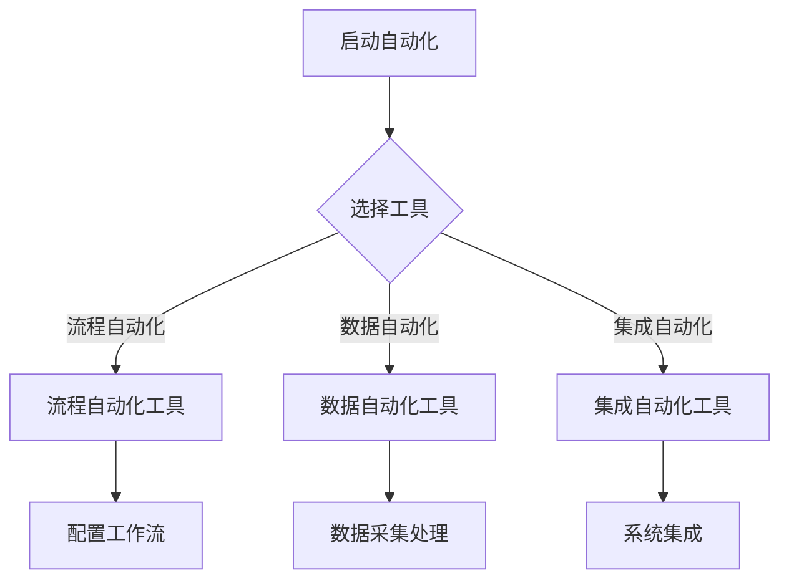

                 

 > **关键词：自动化创业、工具选择、技术分析、创业支持、IT领域**

> **摘要：本文将探讨如何选择适合自动化创业项目的工具。我们将分析各种工具的特点、使用场景和优缺点，并提供一些建议，帮助创业者更好地决策。**

---

## 1. 背景介绍

### 1.1 自动化创业的兴起

自动化创业近年来逐渐成为一种趋势。随着云计算、大数据、人工智能等技术的发展，许多创业者希望通过自动化工具来提高效率、降低成本，并加速产品开发。自动化工具的引入不仅能够提高工作效率，还能为企业带来更高的竞争力和市场机会。

### 1.2 自动化创业的优势

- **提高效率**：自动化工具可以自动完成重复性、规则性任务，减少人工操作，提高工作效率。
- **降低成本**：自动化减少了对人工的依赖，从而降低了人力成本。
- **加速创新**：自动化工具使创业者能够更快地尝试新的想法和商业模式。

### 1.3 自动化创业面临的挑战

- **技术门槛**：选择适合的自动化工具需要一定的技术背景。
- **安全与合规**：自动化过程中需确保数据安全和遵守相关法规。

---

## 2. 核心概念与联系

### 2.1 自动化工具的分类

- **流程自动化**：通过工具将业务流程自动化，如工作流管理软件。
- **数据自动化**：通过工具自动化数据采集、处理和分析，如ETL工具。
- **集成自动化**：通过工具实现不同系统之间的自动化集成，如API自动化工具。

### 2.2 自动化工具的工作原理

**Mermaid流程图：**



---

## 3. 核心算法原理 & 具体操作步骤

### 3.1 算法原理概述

自动化工具的核心原理是利用规则和脚本来自动化操作。以下是一些常见的算法原理：

- **条件判断**：根据输入条件自动执行不同的操作。
- **循环结构**：重复执行某段代码，直到满足某个条件。
- **函数调用**：调用预定义的函数来执行特定任务。

### 3.2 算法步骤详解

#### 3.2.1 选择自动化工具

1. 确定自动化需求。
2. 研究市场上常见的自动化工具。
3. 根据需求选择合适的工具。

#### 3.2.2 配置工作流

1. 安装并设置自动化工具。
2. 设计工作流，包括任务的启动条件、执行步骤、结果处理等。
3. 编写脚本或配置文件，实现自动化流程。

#### 3.2.3 测试与优化

1. 运行测试案例，检查自动化流程的正确性。
2. 根据测试结果调整工作流和脚本。
3. 持续优化，提高自动化效率。

### 3.3 算法优缺点

#### 优点

- **提高效率**：自动化工具可以节省大量时间和人力。
- **减少错误**：自动化流程可以减少人为错误。
- **易于扩展**：自动化脚本和配置文件易于修改和扩展。

#### 缺点

- **学习曲线**：选择和使用自动化工具需要一定的技术背景。
- **维护成本**：自动化工具需要定期维护和更新。

### 3.4 算法应用领域

- **软件开发**：自动化测试、持续集成和部署。
- **数据处理**：数据采集、清洗和预处理。
- **业务流程**：客户服务、财务管理、人力资源管理等。

---

## 4. 数学模型和公式 & 详细讲解 & 举例说明

### 4.1 数学模型构建

自动化工具的性能评估通常涉及到一些数学模型，如：

- **时间效率模型**：通过计算任务完成时间与人工操作时间的比值来评估效率。
- **错误率模型**：通过计算任务执行过程中出现的错误次数与总任务次数的比值来评估准确性。

### 4.2 公式推导过程

**时间效率模型**：

$$
\text{效率} = \frac{\text{自动化完成时间}}{\text{人工完成时间}}
$$

**错误率模型**：

$$
\text{错误率} = \frac{\text{错误次数}}{\text{总任务次数}}
$$

### 4.3 案例分析与讲解

假设一个自动化工具完成100个任务需要2小时，而人工完成同样任务需要5小时。那么：

$$
\text{效率} = \frac{2}{5} = 0.4
$$

这个自动化工具的时间效率为40%。

再假设在执行过程中出现了10个错误，那么：

$$
\text{错误率} = \frac{10}{100} = 0.1
$$

错误率为10%。

---

## 5. 项目实践：代码实例和详细解释说明

### 5.1 开发环境搭建

为了更好地理解自动化工具的使用，我们将在Python环境中实现一个简单的自动化脚本。

```bash
# 安装Python环境
pip install python
```

### 5.2 源代码详细实现

以下是一个简单的Python脚本，用于自动化登录一个网站并下载图片。

```python
import requests
from bs4 import BeautifulSoup

# 登录函数
def login(username, password):
    # 发送登录请求
    response = requests.post('https://example.com/login', data={'username': username, 'password': password})
    # 解析响应内容
    soup = BeautifulSoup(response.text, 'html.parser')
    # 获取登录状态
    login_status = soup.find('div', {'id': 'login_status'}).text
    return login_status

# 下载图片函数
def download_images(url):
    # 发送请求获取网页内容
    response = requests.get(url)
    # 解析网页内容
    soup = BeautifulSoup(response.text, 'html.parser')
    # 找到图片链接
    images = soup.find_all('img')
    # 下载图片
    for image in images:
        image_url = image['src']
        response = requests.get(image_url)
        with open(image_url.split('/')[-1], 'wb') as f:
            f.write(response.content)

# 主函数
def main():
    username = 'your_username'
    password = 'your_password'
    url = 'https://example.com'

    # 登录
    login_status = login(username, password)
    if login_status == '登录成功':
        # 下载图片
        download_images(url)
    else:
        print('登录失败')

# 运行主函数
if __name__ == '__main__':
    main()
```

### 5.3 代码解读与分析

1. **导入模块**：脚本中导入了requests和BeautifulSoup两个模块，用于发送网络请求和解析HTML内容。
2. **登录函数**：登录函数通过发送POST请求来模拟登录操作，并解析响应内容以获取登录状态。
3. **下载图片函数**：下载图片函数通过发送GET请求来获取网页内容，并解析HTML内容以找到图片链接，然后下载图片。
4. **主函数**：主函数调用登录函数和下载图片函数，根据登录状态决定是否执行下载操作。

### 5.4 运行结果展示

运行脚本后，会自动登录网站并下载图片。下载的图片会存储在当前目录下。

---

## 6. 实际应用场景

### 6.1 软件开发

在软件开发中，自动化工具可以用于测试、持续集成和部署。例如，使用Selenium进行自动化测试，使用Jenkins进行持续集成和部署。

### 6.2 数据处理

在数据处理领域，自动化工具可以用于数据采集、清洗和预处理。例如，使用Apache Kafka进行数据采集，使用Apache Spark进行数据清洗和预处理。

### 6.3 业务流程

在业务流程中，自动化工具可以用于客户服务、财务管理、人力资源管理等。例如，使用RPA机器人进行客户服务自动化，使用自动化财务软件进行财务管理。

---

## 7. 工具和资源推荐

### 7.1 学习资源推荐

- 《Python自动化实战》
- 《Selenium自动化测试实战》
- 《RPA流程自动化实战》

### 7.2 开发工具推荐

- Python
- Selenium
- Jenkins
- Apache Kafka
- Apache Spark

### 7.3 相关论文推荐

- "Automation of Software Testing: Practice and Experience"
- "Robotic Process Automation: The Future of Work"
- "Data Engineering with Apache Kafka and Spark"

---

## 8. 总结：未来发展趋势与挑战

### 8.1 研究成果总结

自动化创业工具的发展已取得显著成果。各种自动化工具的应用领域不断扩大，技术逐渐成熟，为企业带来了巨大的效益。

### 8.2 未来发展趋势

- **更加智能化**：自动化工具将结合人工智能技术，实现更加智能的自动化操作。
- **集成化**：自动化工具将实现跨系统的集成，提高企业的整体自动化水平。
- **定制化**：自动化工具将提供更加定制化的解决方案，满足不同企业的需求。

### 8.3 面临的挑战

- **技术更新**：自动化技术更新迅速，企业需要不断学习和更新知识。
- **安全风险**：自动化过程中需确保数据安全和遵守相关法规。

### 8.4 研究展望

随着技术的不断进步，自动化创业工具将为企业带来更大的价值。未来，自动化创业领域将充满机遇和挑战，值得深入研究和探索。

---

## 9. 附录：常见问题与解答

### 9.1 自动化创业工具有哪些？

自动化创业工具主要包括流程自动化工具、数据自动化工具和集成自动化工具。

### 9.2 如何选择适合的自动化创业工具？

选择适合的自动化创业工具需要考虑企业的需求、预算和团队的技术能力。可以通过以下步骤进行选择：

1. 确定自动化需求。
2. 研究市场上常见的自动化工具。
3. 根据需求选择合适的工具。
4. 进行测试和评估。

---

# 作者署名

**作者：禅与计算机程序设计艺术 / Zen and the Art of Computer Programming**

---

以上，便是关于如何选择适合自动化创业工具的完整文章。希望对您有所帮助！

