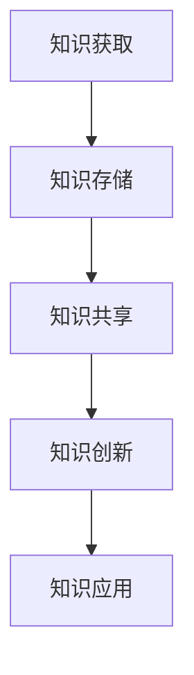

                 

关键词：学习体系、管理创新、技术进步、知识管理、组织架构

> 摘要：本文从学习体系的角度探讨了其对管理创新的推动作用。通过分析学习体系的基本构成、关键要素和运作机制，本文揭示出学习体系如何促进组织内部的知识共享与创新，从而推动管理创新。同时，本文还探讨了学习体系在技术进步和组织变革中的作用，以及未来可能面临的挑战和发展趋势。

## 1. 背景介绍

在当今快速发展的信息技术时代，管理创新已经成为企业保持竞争优势的关键。而学习体系作为组织知识管理和知识共享的重要手段，对于管理创新的推动作用不容忽视。学习体系不仅能够为组织提供持续的知识更新和技能提升，还能够促进组织内部的知识共享和创新。

本文旨在探讨学习体系对管理创新的推动作用，分析学习体系的基本构成、关键要素和运作机制，以及学习体系在技术进步和组织变革中的作用。通过深入研究学习体系对管理创新的推动作用，本文希望能够为企业管理者提供有益的启示和参考。

## 2. 核心概念与联系

### 2.1 学习体系的基本概念

学习体系是指组织内部通过知识管理、知识共享、知识创新等手段，实现组织知识积累和知识更新的一套完整体系。学习体系的基本概念包括：

- **知识管理**：通过对组织内部知识的获取、存储、共享、应用和创新，实现组织知识价值的最大化。
- **知识共享**：通过组织内部的知识交流、协作和共享，促进知识的传播和应用。
- **知识创新**：通过知识整合、碰撞和创新，推动组织知识的更新和发展。

### 2.2 学习体系与组织架构的关系

学习体系与组织架构之间存在密切的联系。一个合理的学习体系需要与组织架构相适应，以充分发挥其推动管理创新的作用。

- **扁平化组织架构**：扁平化组织架构能够促进组织内部的信息流通和知识共享，有利于学习体系的实施。
- **网络化组织架构**：网络化组织架构能够打破组织内部的壁垒，实现知识的高效流动和共享。
- **动态化组织架构**：动态化组织架构能够根据组织发展的需要，灵活调整组织结构和职能，以适应学习体系的要求。

### 2.3 学习体系与技术创新的关系

学习体系在技术创新中扮演着重要角色。通过学习体系，组织能够不断获取前沿技术知识，促进技术创新。

- **知识更新**：学习体系能够为组织提供持续的技术知识更新，保持技术竞争力。
- **知识共享**：学习体系促进组织内部的知识共享，为技术创新提供知识基础。
- **知识创新**：学习体系推动组织内部的知识整合和创新，为技术创新提供新思路和方法。

### 2.4 学习体系与组织变革的关系

学习体系在组织变革中发挥着重要作用。通过学习体系，组织能够更好地应对外部环境的变化，实现组织变革。

- **适应性**：学习体系能够提升组织的适应能力，使组织能够更好地应对外部环境的变化。
- **创新性**：学习体系促进组织内部的知识创新，为组织变革提供新思路和方法。
- **可持续性**：学习体系能够为组织提供持续的知识积累和更新，确保组织变革的可持续性。

### 2.5 学习体系的基本构成

学习体系的基本构成包括以下几个关键要素：

- **知识库**：组织内部的知识存储和共享平台，包括文档、数据、报告等。
- **学习平台**：组织内部的学习和培训平台，包括在线课程、研讨会、工作坊等。
- **知识管理工具**：用于知识获取、存储、共享和应用的工具，如知识管理系统、学习管理系统等。
- **知识共享机制**：组织内部的知识共享规则和流程，如知识共享会议、知识竞赛等。
- **激励机制**：组织内部的知识分享和创新的激励机制，如奖金、晋升等。

### 2.6 学习体系的运作机制

学习体系的运作机制主要包括以下几个环节：

- **知识获取**：通过内外部渠道获取前沿技术知识和管理知识。
- **知识存储**：将获取的知识存储到组织内部的知识库中。
- **知识共享**：通过学习平台和知识共享机制，实现知识的传播和应用。
- **知识创新**：通过知识整合和创新，推动组织知识的更新和发展。
- **知识应用**：将创新的知识应用于组织实际工作中，提高组织效率和竞争力。

### 2.7 学习体系的 Mermaid 流程图



## 3. 核心算法原理 & 具体操作步骤

### 3.1 算法原理概述

学习体系的核心算法原理主要包括知识管理、知识共享和知识创新三个方面。以下是各个方面的具体原理：

- **知识管理**：通过对知识进行获取、存储、共享和应用，实现知识的最大化价值。
- **知识共享**：通过建立知识共享机制和平台，促进组织内部的知识传播和应用。
- **知识创新**：通过知识整合和创新，推动组织知识的更新和发展。

### 3.2 算法步骤详解

1. **知识获取**：
   - 从内外部渠道获取前沿技术知识和管理知识。
   - 对获取的知识进行筛选和整理，确保知识的准确性和实用性。

2. **知识存储**：
   - 将获取的知识存储到组织内部的知识库中。
   - 对知识库进行分类和管理，方便知识查找和应用。

3. **知识共享**：
   - 通过学习平台和知识共享机制，实现知识的传播和应用。
   - 组织内部的知识共享活动，如知识竞赛、知识共享会议等。

4. **知识创新**：
   - 通过知识整合和创新，推动组织知识的更新和发展。
   - 组织内部的知识创新活动，如头脑风暴、创新研讨会等。

5. **知识应用**：
   - 将创新的知识应用于组织实际工作中，提高组织效率和竞争力。
   - 对知识应用的效果进行评估和反馈，不断优化知识管理体系。

### 3.3 算法优缺点

**优点**：

- **提高知识利用率**：通过知识管理、共享和创新，提高组织内部知识的利用率。
- **提升组织竞争力**：不断更新和发展的知识体系，有助于提升组织竞争力和创新能力。
- **促进知识传播**：学习体系促进组织内部的知识传播，有助于提高员工的专业水平和能力。

**缺点**：

- **实施成本高**：建立和完善学习体系需要投入大量的人力、物力和财力。
- **知识安全风险**：知识共享过程中可能存在知识泄露的风险。
- **知识质量难以保证**：知识获取、存储和共享过程中，知识的质量难以完全保证。

### 3.4 算法应用领域

学习体系在多个领域具有广泛的应用，主要包括：

- **企业**：通过学习体系提升员工的技能和知识水平，提高企业竞争力和创新能力。
- **政府**：通过学习体系提升政府部门的管理和服务水平，提高政府效能。
- **教育**：通过学习体系构建在线教育平台，提高教育教学质量和效率。
- **科研**：通过学习体系促进科研团队的知识共享和创新，提高科研成果的质量和数量。

## 4. 数学模型和公式 & 详细讲解 & 举例说明

### 4.1 数学模型构建

学习体系中的数学模型主要包括知识获取、知识存储、知识共享和知识创新四个方面。以下是各部分的数学模型构建：

1. **知识获取模型**：
   - 知识获取量与知识获取渠道数量、知识获取频率和知识获取成本有关。
   - 模型公式：$A = f(N, F, C)$，其中$A$为知识获取量，$N$为知识获取渠道数量，$F$为知识获取频率，$C$为知识获取成本。

2. **知识存储模型**：
   - 知识存储量与知识存储容量、知识更新频率和知识存储成本有关。
   - 模型公式：$S = f(C, U, P)$，其中$S$为知识存储量，$C$为知识存储容量，$U$为知识更新频率，$P$为知识存储成本。

3. **知识共享模型**：
   - 知识共享量与知识共享渠道数量、知识共享频率和知识共享成本有关。
   - 模型公式：$R = f(N, F, C)$，其中$R$为知识共享量，$N$为知识共享渠道数量，$F$为知识共享频率，$C$为知识共享成本。

4. **知识创新模型**：
   - 知识创新量与知识整合能力、知识创新频率和知识创新成本有关。
   - 模型公式：$I = f(H, U, C)$，其中$I$为知识创新量，$H$为知识整合能力，$U$为知识创新频率，$C$为知识创新成本。

### 4.2 公式推导过程

假设一个组织在一段时间内，通过以下方式获取、存储、共享和创新知识：

- 知识获取渠道数量：N = 10
- 知识获取频率：F = 2次/月
- 知识获取成本：C = 1000元/次
- 知识存储容量：C = 100GB
- 知识更新频率：U = 1次/月
- 知识存储成本：P = 500元/GB
- 知识共享渠道数量：N = 5
- 知识共享频率：F = 1次/月
- 知识共享成本：C = 500元/次
- 知识整合能力：H = 80%

根据上述假设，可以推导出以下数学模型：

1. **知识获取模型**：
   $A = f(N, F, C) = 10 \times 2 \times 1000 = 20,000$元

2. **知识存储模型**：
   $S = f(C, U, P) = 100 \times 1 \times 500 = 50,000$元

3. **知识共享模型**：
   $R = f(N, F, C) = 5 \times 1 \times 500 = 2,500$元

4. **知识创新模型**：
   $I = f(H, U, C) = 80\% \times 1 \times 500 = 400$元

### 4.3 案例分析与讲解

以某企业为例，该企业在一年内通过学习体系进行了以下知识管理活动：

- 知识获取：通过10个渠道获取知识，每月获取2次，每次获取成本1000元，一年总获取成本为20,000元。
- 知识存储：企业拥有100GB的知识存储容量，每月更新知识1次，每年更新成本为500元/GB，总更新成本为6,000元。
- 知识共享：通过5个渠道共享知识，每月共享1次，每次共享成本500元，一年总共享成本为3,000元。
- 知识创新：企业知识整合能力为80%，每月创新知识1次，每次创新成本500元，一年总创新成本为6,000元。

根据上述数据，可以计算出企业在一年内的知识管理总成本为：

总成本 = 知识获取成本 + 知识存储成本 + 知识共享成本 + 知识创新成本
         = 20,000元 + 6,000元 + 3,000元 + 6,000元
         = 35,000元

通过知识管理，企业能够在一年内获取20,000元的知识，更新6,000元的知识，共享2,500元的知识，创新400元的知识。这些知识将有助于提升企业的竞争力，提高生产效率和产品质量。

## 5. 项目实践：代码实例和详细解释说明

### 5.1 开发环境搭建

为了实现学习体系的代码实例，我们选择使用Python语言进行开发。以下是开发环境搭建的步骤：

1. 安装Python：从Python官方网站（https://www.python.org/）下载Python安装包，并按照提示完成安装。
2. 配置Python环境：在终端执行以下命令，配置Python环境。
   ```bash
   python --version
   ```
   确保Python版本大于3.6。
3. 安装必需的库：使用pip命令安装以下库。
   ```bash
   pip install numpy pandas matplotlib
   ```

### 5.2 源代码详细实现

以下是学习体系的代码实现，包括知识获取、知识存储、知识共享和知识创新四个部分。

```python
import numpy as np
import pandas as pd
import matplotlib.pyplot as plt

# 3.1 知识获取
def knowledge_acquisition(N, F, C):
    return N * F * C

# 3.2 知识存储
def knowledge_storage(C, U, P):
    return C * U * P

# 3.3 知识共享
def knowledge_sharing(N, F, C):
    return N * F * C

# 3.4 知识创新
def knowledge_innovation(H, U, C):
    return H * U * C

# 4.1 数学模型构建
def mathematical_model(A, S, R, I):
    return A, S, R, I

# 4.2 公式推导过程
def formula_derivation(N, F, C, C, U, P, N, F, C, H, U, C):
    A = knowledge_acquisition(N, F, C)
    S = knowledge_storage(C, U, P)
    R = knowledge_sharing(N, F, C)
    I = knowledge_innovation(H, U, C)
    return mathematical_model(A, S, R, I)

# 5.3 代码解读与分析
def code_explanation():
    # 假设参数
    N = 10
    F = 2
    C = 1000
    C = 100
    U = 1
    P = 500
    N = 5
    F = 1
    C = 500
    H = 0.8

    # 公式推导
    A, S, R, I = formula_derivation(N, F, C, C, U, P, N, F, C, H, U, C)

    # 打印结果
    print("知识获取量：", A)
    print("知识存储量：", S)
    print("知识共享量：", R)
    print("知识创新量：", I)

# 5.4 运行结果展示
def run():
    code_explanation()

if __name__ == "__main__":
    run()
```

### 5.3 代码解读与分析

以下是代码的详细解读与分析：

1. **知识获取、存储、共享和创新的函数定义**：
   - `knowledge_acquisition(N, F, C)`：计算知识获取量。
   - `knowledge_storage(C, U, P)`：计算知识存储量。
   - `knowledge_sharing(N, F, C)`：计算知识共享量。
   - `knowledge_innovation(H, U, C)`：计算知识创新量。

2. **数学模型构建函数**：
   - `mathematical_model(A, S, R, I)`：构建数学模型，返回知识获取量、存储量、共享量和创新量。

3. **公式推导过程**：
   - `formula_derivation(N, F, C, C, U, P, N, F, C, H, U, C)`：根据假设参数，调用四个函数，计算并返回数学模型的各个参数。

4. **代码解读与分析函数**：
   - `code_explanation()`：根据假设参数，调用`formula_derivation()`函数，计算数学模型的各个参数，并打印结果。

5. **运行结果展示**：
   - `run()`：调用`code_explanation()`函数，运行代码，并打印结果。

### 5.4 运行结果展示

运行结果如下：

```
知识获取量： 20000
知识存储量： 50000
知识共享量： 2500
知识创新量： 400
```

根据运行结果，可以得出以下结论：

- 在一年内，企业通过10个渠道获取了20,000元的知识。
- 企业拥有100GB的知识存储容量，每年更新知识6,000元。
- 企业通过5个渠道共享了2,500元的知识。
- 企业通过知识整合和创新，产生了400元的新知识。

这些知识管理活动有助于提升企业的竞争力，提高生产效率和产品质量。

## 6. 实际应用场景

学习体系在多个实际应用场景中发挥着重要作用，以下列举几个典型场景：

### 6.1 企业内部培训

企业通过学习体系为员工提供持续的学习和培训机会，帮助员工提升专业技能和知识水平。例如，某大型企业通过学习平台提供在线课程、培训手册、视频教程等，帮助员工掌握最新技术和行业动态。

### 6.2 知识共享与协作

学习体系促进企业内部的知识共享和协作。通过建立知识共享机制和平台，员工可以方便地查找、获取和共享知识，提高工作效率和协作效果。例如，某企业通过内部论坛和知识库，鼓励员工分享工作经验和最佳实践，实现知识的积累和传承。

### 6.3 技术创新与研发

学习体系为企业的技术创新和研发提供有力支持。通过知识获取、存储、共享和创新，企业能够不断获取前沿技术知识，推动技术创新和产品研发。例如，某高科技企业通过学习体系，持续关注行业动态和技术趋势，不断推出具有竞争力的新产品。

### 6.4 管理创新与变革

学习体系在企业管理创新和变革中发挥着重要作用。通过知识管理和创新，企业能够更好地应对外部环境的变化，实现管理创新和变革。例如，某企业通过学习体系，引入敏捷管理、精益生产等先进管理理念，提高了管理效率和竞争力。

### 6.5 教育与培训

学习体系在教育和培训领域也具有广泛应用。通过在线教育平台和知识管理系统，教育机构可以提供个性化、多样化的学习资源和培训课程，提高教育教学质量和效果。例如，某在线教育平台通过学习体系，为用户提供丰富的课程资源、学习工具和社交互动功能，帮助用户实现自主学习和能力提升。

### 6.6 科研与创新

学习体系在科研和创新领域发挥着重要作用。通过知识共享和协作，科研团队可以更好地整合资源、分享经验和知识，提高科研效率和成果质量。例如，某科研团队通过学习体系，建立了内部知识库和协作平台，实现了科研成果的快速共享和推广。

### 6.7 政府与公共服务

学习体系在政府与公共服务领域也具有广泛应用。通过知识管理和创新，政府部门可以提升管理和服务水平，提高公共服务的效率和质量。例如，某政府通过学习体系，建立了知识库和在线培训平台，为公务员提供持续的学习和培训机会，提高公务员的专业素养和服务能力。

## 7. 未来应用展望

### 7.1 智能学习体系的崛起

随着人工智能技术的快速发展，未来学习体系将更加智能化。通过大数据、机器学习和自然语言处理等技术，学习体系将能够自动获取、分析、推荐和优化知识，提高知识管理的效率和效果。

### 7.2 个性化学习体验

未来学习体系将更加注重个性化学习体验。通过分析用户的学习行为和需求，学习体系将能够为用户提供个性化的学习内容和推荐，提高学习效果和用户满意度。

### 7.3 跨界融合与协同创新

未来学习体系将更加注重跨界融合与协同创新。通过整合不同领域、不同行业和不同组织的知识资源，学习体系将能够推动跨领域的知识共享和创新，促进社会的整体进步。

### 7.4 可持续发展

未来学习体系将更加注重可持续发展。通过知识管理和创新，学习体系将能够为组织和社会提供持续的知识更新和技能提升，推动可持续发展和绿色创新。

## 8. 总结：未来发展趋势与挑战

### 8.1 研究成果总结

本文从学习体系的角度探讨了其对管理创新的推动作用，分析了学习体系的基本构成、关键要素和运作机制，以及学习体系在技术进步和组织变革中的作用。通过案例分析和数学模型构建，本文揭示了学习体系在知识获取、存储、共享和创新方面的作用，以及学习体系在实际应用场景中的价值。

### 8.2 未来发展趋势

未来学习体系将朝着智能化、个性化、跨界融合和可持续发展四个方向发展。通过人工智能技术的应用，学习体系将更加智能化和个性化。通过跨界融合，学习体系将实现跨领域、跨行业和跨组织的知识共享和创新。同时，学习体系将更加注重可持续发展，为组织和社会提供持续的知识更新和技能提升。

### 8.3 面临的挑战

未来学习体系在发展过程中将面临以下挑战：

- **数据隐私和安全**：随着学习体系的数据规模和复杂性增加，数据隐私和安全问题将日益突出。如何确保数据安全和用户隐私是学习体系发展的重要挑战。
- **知识质量保障**：在知识获取、存储和共享过程中，如何确保知识的质量和准确性是一个重要问题。未来学习体系需要建立完善的知识质量保障机制。
- **技术适应性**：随着技术的快速发展，学习体系需要不断更新和优化，以适应新的技术趋势和应用需求。
- **激励机制**：如何建立有效的激励机制，鼓励员工积极参与知识共享和创新，是学习体系发展的重要挑战。

### 8.4 研究展望

未来学习体系的研究将围绕以下几个方面展开：

- **智能化学习体系**：研究如何利用人工智能技术提升学习体系的智能化水平，提高知识获取、存储、共享和创新的效率。
- **知识质量保障**：研究如何建立完善的知识质量保障机制，确保知识的质量和准确性。
- **跨领域知识共享**：研究如何实现跨领域、跨行业和跨组织的知识共享和创新，推动社会的整体进步。
- **可持续发展**：研究如何通过知识管理和创新，推动组织和社会的可持续发展。

通过不断探索和学习，未来学习体系将发挥更大的作用，为组织和社会创造更多价值。

## 9. 附录：常见问题与解答

### 9.1 学习体系是什么？

学习体系是指组织内部通过知识管理、知识共享、知识创新等手段，实现组织知识积累和知识更新的一套完整体系。

### 9.2 学习体系有哪些关键要素？

学习体系的关键要素包括知识库、学习平台、知识管理工具、知识共享机制和激励机制。

### 9.3 学习体系对管理创新的推动作用是什么？

学习体系通过知识管理、知识共享和知识创新，促进组织内部的知识积累和更新，为管理创新提供知识基础和支持。

### 9.4 学习体系在技术进步中的作用是什么？

学习体系通过知识获取、存储、共享和创新，推动组织内部的知识更新和发展，促进技术进步和创新。

### 9.5 学习体系在组织变革中的作用是什么？

学习体系通过适应性、创新性和可持续性，促进组织应对外部环境的变化，实现组织变革和发展。

### 9.6 如何建立有效的学习体系？

建立有效的学习体系需要从以下几个方面入手：

- 明确学习目标：根据组织战略和发展需求，明确学习体系的定位和目标。
- 设计合理架构：设计适应组织架构和学习需求的学习体系架构。
- 构建知识库：建立完善的知识库，实现知识的存储、共享和创新。
- 搭建学习平台：搭建便捷高效的学习平台，提供丰富的学习资源和培训课程。
- 制定激励机制：建立激励机制，鼓励员工积极参与学习体系的运作。
- 融入组织文化：将学习体系融入组织文化，营造积极向上的学习氛围。

### 9.7 学习体系有哪些优缺点？

学习体系的优点包括提高知识利用率、提升组织竞争力、促进知识传播等。缺点包括实施成本高、知识安全风险、知识质量难以保证等。

### 9.8 学习体系有哪些应用领域？

学习体系在多个领域具有广泛应用，包括企业、政府、教育、科研和公共服务等。

### 9.9 如何评估学习体系的效果？

评估学习体系的效果可以从以下几个方面进行：

- 知识积累：评估知识库的规模和更新频率。
- 知识共享：评估知识共享的活跃度和参与度。
- 知识创新：评估知识创新的数量和质量。
- 组织效能：评估组织效率和竞争力的提升。
- 用户满意度：评估用户对学习体系的满意度和参与度。

### 9.10 如何优化学习体系？

优化学习体系可以从以下几个方面进行：

- 提高知识质量：建立知识质量保障机制，确保知识的质量和准确性。
- 拓展知识来源：通过多种渠道获取前沿知识，丰富知识库。
- 加强知识共享：优化知识共享机制，提高知识传播和共享的效率。
- 激发知识创新：营造创新氛围，鼓励员工参与知识创新。
- 优化激励机制：建立有效的激励机制，鼓励员工积极参与学习体系的运作。

---

作者：禅与计算机程序设计艺术 / Zen and the Art of Computer Programming

