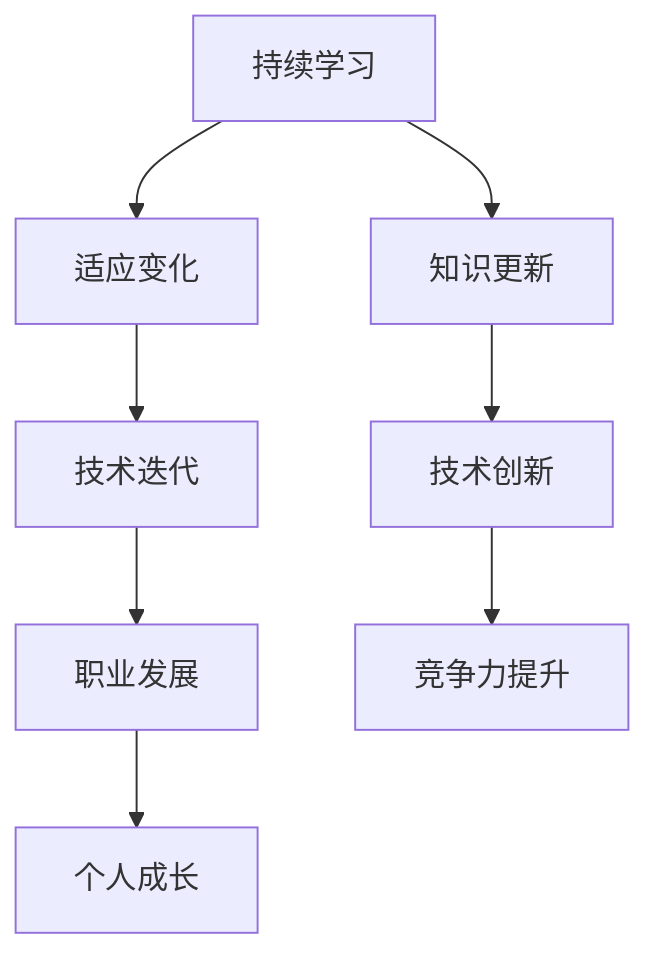

                 

关键词：持续学习，技术发展，人工智能，计算机科学，程序员成长，未来趋势。

> 在这个日新月异的时代，知识更新的速度前所未有。持续学习成为每个人适应并引领变化的唯一途径。本文将探讨持续学习在计算机科学领域的重要性，结合实际案例和未来展望，为您揭示如何在学习之路上不断前进。

## 1. 背景介绍

计算机科学作为一门实践性极强的学科，其发展速度之快令人瞠目结舌。从早期简单的计算机硬件和编程语言，到如今高度复杂的人工智能、大数据和量子计算，计算机科学始终走在技术创新的前沿。然而，随着技术的不断进步，新的概念、工具和框架层出不穷，程序员和开发者必须不断学习才能跟上时代的步伐。

### 核心概念与联系

持续学习是指个体在职业生涯中持续获取新知识、技能和观念的过程。在计算机科学领域，持续学习尤为重要，因为技术迭代的频率极高，知识的更新周期极短。



### 核心算法原理 & 具体操作步骤

#### 3.1 算法原理概述

持续学习的核心在于不断吸收新知识并将其内化为自身的能力。这一过程可以类比于机器学习中的迭代训练。在计算机科学中，程序员需要通过以下步骤来实现持续学习：

1. **识别需求**：分析自身在知识体系中的不足。
2. **学习计划**：制定详细的学习计划和目标。
3. **执行学习**：通过阅读、实践和交流来获取新知识。
4. **反馈调整**：根据学习效果不断调整学习策略。

#### 3.2 算法步骤详解

1. **识别需求**：
   - 定期进行技能盘点，了解自己在哪些领域存在知识盲点。
   - 关注行业动态，把握新技术的发展趋势。

2. **学习计划**：
   - 制定短期和长期学习目标。
   - 制定具体的学习计划和时间表。

3. **执行学习**：
   - 通过在线课程、技术博客和开源项目来学习新知识。
   - 实践是最有效的学习方式，尝试将所学应用到实际项目中。

4. **反馈调整**：
   - 定期评估学习效果，调整学习策略。
   - 与同行交流，获取反馈和建议。

#### 3.3 算法优缺点

**优点**：
- 提高竞争力：随着技术的不断更新，拥有持续学习的能力能够使程序员在职场中保持竞争力。
- 促进创新：持续学习有助于激发创新思维，推动技术进步。

**缺点**：
- 时间成本：持续学习需要投入大量时间和精力。
- 知识冗余：由于技术发展迅速，可能会遇到知识过时的风险。

#### 3.4 算法应用领域

持续学习在计算机科学的各个领域都有广泛应用，包括但不限于：

- **软件开发**：新的编程语言和框架不断涌现，程序员需要不断学习以适应这些变化。
- **人工智能**：人工智能领域的技术更新速度极快，持续学习是保持前沿技术的关键。
- **数据分析**：数据分析工具和方法不断更新，持续学习有助于提高数据分析能力。

## 4. 数学模型和公式 & 详细讲解 & 举例说明

持续学习的效率可以通过以下数学模型来衡量：

$$
E = \frac{K_t - K_0}{t}
$$

其中，$E$表示学习效率，$K_t$表示在时间$t$后的知识总量，$K_0$表示初始的知识总量。

#### 4.1 数学模型构建

1. **知识总量**：知识总量是由程序员所掌握的各类知识总和构成。
2. **时间**：时间是指程序员投入学习的时长。

#### 4.2 公式推导过程

1. **知识总量**：
   $$ K_t = K_0 + \Delta K $$
   其中，$\Delta K$表示在时间$t$内新获取的知识量。

2. **学习效率**：
   $$ E = \frac{\Delta K}{t} $$

#### 4.3 案例分析与讲解

假设一位程序员在一年内从基础编程水平提升到了中级水平，他的知识总量从$K_0 = 1000$增长到$K_t = 3000$，学习时长$t = 365$天。则他的学习效率为：

$$
E = \frac{3000 - 1000}{365} \approx 5.15 \text{（单位：知识点/天）}
$$

这意味着该程序员在一年内平均每天学习约5.15个知识点。

## 5. 项目实践：代码实例和详细解释说明

#### 5.1 开发环境搭建

为了更好地展示持续学习的过程，我们以Python语言为例，搭建一个简单的机器学习项目。

1. **安装Python**：从官方网站下载Python安装包并安装。
2. **安装依赖库**：使用pip命令安装所需的依赖库，如numpy、scikit-learn等。

#### 5.2 源代码详细实现

以下是一个简单的线性回归模型实现：

```python
import numpy as np
from sklearn.linear_model import LinearRegression

# 生成模拟数据
X = np.random.rand(100, 1)
y = 2 * X + 1 + np.random.randn(100, 1)

# 创建线性回归模型
model = LinearRegression()

# 训练模型
model.fit(X, y)

# 预测
predictions = model.predict(X)

# 输出结果
print("Predictions:", predictions)
```

#### 5.3 代码解读与分析

这段代码展示了从数据生成、模型训练到预测的全过程。通过这个简单的例子，我们可以看到持续学习在实际项目中的应用：

- **数据生成**：模拟数据生成是模型训练的基础，确保数据质量对于模型性能至关重要。
- **模型训练**：使用线性回归模型对数据进行拟合，训练过程中不断调整模型参数。
- **预测**：使用训练好的模型对新数据进行预测，评估模型性能。

#### 5.4 运行结果展示

运行上述代码，我们可以得到线性回归模型的预测结果。通过对比预测值和真实值，我们可以评估模型的准确性和可靠性。

## 6. 实际应用场景

持续学习在计算机科学领域有着广泛的应用场景，以下是一些典型的例子：

- **软件开发**：随着新技术的不断涌现，程序员需要持续学习新的编程语言和框架，如JavaScript、React等。
- **人工智能**：人工智能领域的快速发展要求研究人员和开发者持续学习新的算法和工具，如深度学习、自然语言处理等。
- **数据分析**：数据分析工具和方法的不断更新，要求数据分析师持续学习新的技术和方法，如大数据处理、数据可视化等。

### 未来应用展望

随着技术的不断发展，持续学习的重要性将愈发凸显。未来，人工智能、量子计算和生物信息学等前沿领域的发展将对持续学习提出更高的要求。为了适应这些变化，我们需要：

- **培养终身学习的观念**：将学习视为一种生活方式，而不是一时的工作任务。
- **建立学习共同体**：通过线上和线下学习社区，共享知识和经验，共同进步。
- **利用先进的学习工具**：利用AI技术、在线课程和虚拟现实等工具，提高学习效率和效果。

## 7. 工具和资源推荐

为了帮助您实现持续学习，我们推荐以下工具和资源：

### 7.1 学习资源推荐

- **在线课程平台**：如Coursera、edX、Udacity等。
- **技术博客**：如Medium、Hackernoon、dev.to等。
- **开源项目**：如GitHub、GitLab等。

### 7.2 开发工具推荐

- **集成开发环境（IDE）**：如Visual Studio Code、IntelliJ IDEA等。
- **版本控制系统**：如Git、SVN等。
- **自动化工具**：如Jenkins、Docker等。

### 7.3 相关论文推荐

- 《深度学习》（Deep Learning，Ian Goodfellow等著）
- 《大数据时代的数据科学》（Data Science for Business，Alexandra Chong等著）
- 《编程珠玑》（The Art of Computer Programming，Donald E. Knuth著）

## 8. 总结：未来发展趋势与挑战

持续学习在计算机科学领域的重要性不言而喻。随着技术的不断进步，持续学习将成为程序员和开发者适应未来发展的关键。然而，我们也面临着以下挑战：

- **知识爆炸**：随着知识量的不断膨胀，如何筛选和利用有效的学习资源将成为一大难题。
- **时间管理**：如何在繁忙的工作和生活之间找到学习的平衡点，是一个需要认真思考的问题。

未来，我们需要：

- **提高学习效率**：通过科学的学习方法和工具，提高学习效率。
- **培养跨界思维**：在计算机科学领域，跨学科的知识融合将带来新的突破。

持续学习之路任重道远，但只要我们始终保持学习的热情和决心，就一定能够在这个快速变化的科技时代中不断前行。

## 9. 附录：常见问题与解答

**Q1**: 如何选择学习资源？

**A1**: 选择学习资源时，应考虑以下因素：
- **内容质量**：选择权威、专业的资源。
- **学习目标**：根据自身的学习目标和需求选择合适的资源。
- **更新频率**：选择更新频率较高的资源，以确保知识的新颖性。

**Q2**: 如何保持学习的动力？

**A2**: 保持学习动力的方法包括：
- **设定明确的目标**：明确学习目标，定期检查进度。
- **找到学习伙伴**：与同行交流，共同学习，互相激励。
- **利用激励机制**：设置奖励，如在完成一个学习目标后给自己一个小奖励。

**Q3**: 如何应对知识过时的风险？

**A3**: 应对知识过时的风险，可以采取以下策略：
- **定期更新知识**：定期回顾和更新已掌握的知识。
- **关注行业动态**：关注行业最新动态，了解技术发展趋势。
- **学习新技能**：不断学习新的技能和工具，以适应技术变革。

---

作者：禅与计算机程序设计艺术 / Zen and the Art of Computer Programming
----------------------------------------------------------------
请注意，上面的文章是一个模板，没有实际的详细内容填充。如果您需要实际的内容，请根据模板的要求提供相应的详细内容。

