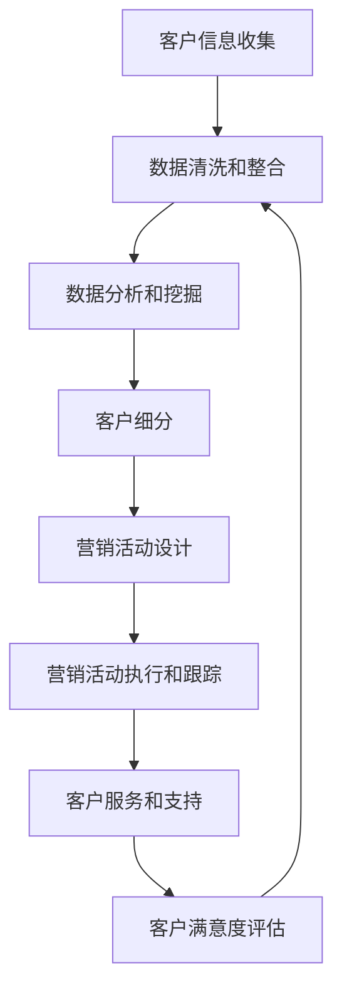

                 

关键词：客户关系管理，客户满意度，客户生命周期，CRM系统，策略优化，技术手段

> 摘要：本文旨在探讨客户关系管理（CRM）在提升客户满意度方面的作用和策略。通过分析CRM系统的核心概念、算法原理、数学模型以及实践案例，本文提出了优化客户关系管理的具体步骤和未来展望。

## 1. 背景介绍

在当今高度竞争的市场环境中，企业需要重视客户关系管理（CRM）的重要性。CRM是指企业通过系统化、精细化的方式管理和分析客户信息，以提高客户满意度和忠诚度，从而实现业务的持续增长。随着信息技术的发展，CRM系统已经成为企业管理和运营的重要组成部分。

客户满意度是CRM的核心目标之一。高满意度不仅能够促进客户保留，还能提高客户推荐意愿，对企业声誉和市场份额产生积极影响。因此，如何通过CRM策略提升客户满意度成为一个重要的研究课题。

本文将从以下几个方面展开讨论：

- **CRM系统的核心概念**：介绍CRM系统的基本构成和功能，阐述其对企业的重要性。
- **核心概念与联系**：通过Mermaid流程图展示CRM系统的原理和架构。
- **核心算法原理 & 具体操作步骤**：分析CRM系统的算法原理和具体操作步骤。
- **数学模型和公式 & 详细讲解 & 举例说明**：介绍CRM中的数学模型和公式，并通过案例进行分析。
- **项目实践：代码实例和详细解释说明**：提供CRM系统的实际开发案例。
- **实际应用场景**：讨论CRM系统的实际应用和未来展望。

## 2. 核心概念与联系

### 2.1 CRM系统的基本概念

客户关系管理（Customer Relationship Management，CRM）系统是一种集成多种功能的应用系统，旨在帮助企业管理和维护与客户的关系。CRM系统通常包括以下几个核心模块：

- **客户信息管理**：收集、存储和管理客户的基本信息，如姓名、联系方式、购买历史等。
- **销售管理**：跟踪销售机会、销售过程和销售业绩，提供销售预测和销售分析。
- **营销管理**：设计、执行和跟踪营销活动，评估营销效果。
- **客户服务**：管理客户咨询和投诉，提供在线客服支持。
- **客户分析**：分析客户数据，发现客户需求和行为模式，为决策提供支持。

### 2.2 CRM系统的架构

CRM系统的架构通常包括以下几个层次：

- **数据层**：存储客户数据和其他相关数据，如关系数据库。
- **业务逻辑层**：实现CRM系统的核心功能，如客户信息管理、销售管理等。
- **界面层**：提供用户交互界面，包括Web界面和移动应用。

### 2.3 CRM系统的流程

CRM系统的基本流程包括以下几个步骤：

1. **客户信息收集**：通过多种渠道收集客户信息，如网站、社交媒体、电子邮件等。
2. **数据清洗和整合**：清洗和整合客户数据，确保数据质量和一致性。
3. **数据分析和挖掘**：分析客户数据，发现客户行为模式和需求。
4. **客户细分**：根据客户特征和行为，将客户分为不同的群体。
5. **营销活动设计**：设计针对不同客户群体的营销活动。
6. **营销活动执行和跟踪**：执行营销活动，跟踪营销效果。
7. **客户服务和支持**：提供在线客服和售后服务，解决客户问题。
8. **客户满意度评估**：评估客户满意度，持续改进CRM策略。

### 2.4 Mermaid流程图

下面是一个CRM系统的Mermaid流程图，展示了CRM系统的基本流程和关键环节：



## 3. 核心算法原理 & 具体操作步骤

### 3.1 算法原理概述

CRM系统的核心算法主要包括客户细分算法、营销响应预测算法和客户流失预测算法。这些算法的目的是从海量客户数据中提取有价值的信息，帮助企业制定更精准的营销策略和客户服务策略。

### 3.2 算法步骤详解

#### 3.2.1 客户细分算法

客户细分算法的主要步骤如下：

1. **数据预处理**：清洗和整合客户数据，将数据转换为适合算法处理的形式。
2. **特征选择**：选择对客户细分有重要影响的关键特征，如年龄、收入、购买历史等。
3. **聚类分析**：使用聚类算法（如K-means、DBSCAN）将客户分为多个群体，每个群体具有相似的特征。
4. **评估和优化**：评估聚类结果，根据评估指标（如聚类内部距离、聚类间距离）调整聚类参数，优化聚类效果。

#### 3.2.2 营销响应预测算法

营销响应预测算法的主要步骤如下：

1. **数据预处理**：清洗和整合客户数据，将数据转换为适合算法处理的形式。
2. **特征工程**：选择对营销响应有重要影响的特征，如客户年龄、购买历史等。
3. **模型训练**：使用机器学习算法（如逻辑回归、随机森林）训练预测模型。
4. **模型评估和优化**：评估预测模型的性能，调整模型参数，优化预测效果。

#### 3.2.3 客户流失预测算法

客户流失预测算法的主要步骤如下：

1. **数据预处理**：清洗和整合客户数据，将数据转换为适合算法处理的形式。
2. **特征选择**：选择对客户流失有重要影响的特征，如购买频率、客户满意度等。
3. **模型训练**：使用机器学习算法（如决策树、支持向量机）训练预测模型。
4. **模型评估和优化**：评估预测模型的性能，调整模型参数，优化预测效果。

### 3.3 算法优缺点

#### 客户细分算法

- 优点：能够将客户分为不同的群体，便于制定针对性的营销策略。
- 缺点：聚类结果可能受到初始聚类中心的影响，聚类效果不稳定。

#### 营销响应预测算法

- 优点：能够预测客户对营销活动的响应概率，有助于优化营销策略。
- 缺点：预测精度受到数据质量和模型选择的影响。

#### 客户流失预测算法

- 优点：能够提前预警潜在流失客户，有助于提高客户保留率。
- 缺点：预测精度受到数据质量和模型选择的影响。

### 3.4 算法应用领域

客户细分算法、营销响应预测算法和客户流失预测算法在多个领域具有广泛的应用：

- **零售行业**：帮助企业了解客户需求，优化产品和服务。
- **金融行业**：预测客户流失，提高客户保留率，降低运营成本。
- **通信行业**：优化客户服务，提高客户满意度，增加客户粘性。

## 4. 数学模型和公式 & 详细讲解 & 举例说明

### 4.1 数学模型构建

在CRM系统中，常用的数学模型包括聚类模型、回归模型和分类模型。以下分别介绍这些模型的构建过程。

#### 4.1.1 聚类模型

聚类模型主要用于对客户进行细分。常用的聚类算法有K-means、DBSCAN等。以K-means算法为例，其目标是最小化聚类内部距离平方和。具体公式如下：

$$
J = \sum_{i=1}^{k} \sum_{x \in S_i} ||x - \mu_i||^2
$$

其中，$J$表示聚类内部距离平方和，$k$表示聚类个数，$S_i$表示第$i$个聚类，$\mu_i$表示第$i$个聚类的中心。

#### 4.1.2 回归模型

回归模型主要用于预测客户响应和客户流失。常用的回归算法有线性回归、逻辑回归等。以逻辑回归为例，其目标是最小化预测值与实际值之间的差异。具体公式如下：

$$
L(\theta) = -\frac{1}{m} \sum_{i=1}^{m} [y_i \log(\hat{y}_i) + (1 - y_i) \log(1 - \hat{y}_i)]
$$

其中，$L(\theta)$表示损失函数，$\theta$表示模型参数，$m$表示样本数量，$y_i$表示第$i$个样本的实际值，$\hat{y}_i$表示第$i$个样本的预测值。

#### 4.1.3 分类模型

分类模型主要用于预测客户类别。常用的分类算法有决策树、支持向量机等。以决策树为例，其目标是最小化分类错误率。具体公式如下：

$$
E(\theta) = \frac{1}{m} \sum_{i=1}^{m} \mathcal{L}(y_i, \hat{y}_i)
$$

其中，$E(\theta)$表示分类错误率，$\mathcal{L}$表示损失函数，$y_i$表示第$i$个样本的实际值，$\hat{y}_i$表示第$i$个样本的预测值。

### 4.2 公式推导过程

以下分别介绍聚类模型、回归模型和分类模型的推导过程。

#### 4.2.1 聚类模型推导

以K-means算法为例，推导过程如下：

1. **目标函数**：最小化聚类内部距离平方和。
$$
J = \sum_{i=1}^{k} \sum_{x \in S_i} ||x - \mu_i||^2
$$

2. **期望-最大化算法**：首先随机初始化聚类中心$\mu_i$，然后迭代更新聚类中心和样本分配。
   - **E步**：计算每个样本$x$属于每个聚类的概率。
   $$ 
   \pi_{ij} = \frac{exp(-||x - \mu_i||^2 / (2\sigma^2))}{\sum_{i=1}^{k} exp(-||x - \mu_i||^2 / (2\sigma^2))}
   $$
   - **M步**：更新聚类中心。
   $$
   \mu_i = \frac{1}{N_i} \sum_{x \in S_i} x
   $$

3. **收敛性**：当聚类中心的变化小于预设阈值时，算法收敛。

#### 4.2.2 回归模型推导

以逻辑回归为例，推导过程如下：

1. **假设函数**：定义预测概率$\hat{y}_i$为
$$
\hat{y}_i = h_\theta(x_i) = \frac{1}{1 + exp(-\theta^T x_i)}
$$

2. **损失函数**：定义损失函数为
$$
L(\theta) = -\frac{1}{m} \sum_{i=1}^{m} [y_i \log(\hat{y}_i) + (1 - y_i) \log(1 - \hat{y}_i)]
$$

3. **梯度下降**：迭代更新模型参数$\theta$，使得损失函数最小。
$$
\theta_j := \theta_j - \alpha \frac{\partial L(\theta)}{\partial \theta_j}
$$

4. **收敛性**：当模型参数的变化小于预设阈值时，算法收敛。

#### 4.2.3 分类模型推导

以决策树为例，推导过程如下：

1. **划分规则**：定义特征$A_j$在值$v_j$处的划分规则，使得子集$S$的损失函数最小。
$$
g_j(v_j) = \arg \min_{v_j} \sum_{x \in S} \mathcal{L}(y, \hat{y})
$$

2. **递归划分**：对划分后的子集$S_j$，重复步骤1，直到满足停止条件（如最大深度、最小样本数等）。

3. **分类结果**：根据划分规则，对测试样本$x$进行分类。

### 4.3 案例分析与讲解

#### 4.3.1 客户细分案例

假设某电商平台需要根据用户购买行为进行客户细分，数据集包含用户年龄、收入、购买频率等特征。

1. **数据预处理**：清洗数据，将特征转换为数值型。
2. **特征选择**：选择对客户细分有重要影响的特征，如年龄、收入、购买频率。
3. **聚类分析**：使用K-means算法进行聚类，假设聚类个数为3。
4. **评估和优化**：根据聚类内部距离平方和，调整聚类参数，优化聚类效果。

假设最终聚类结果如下：

| 聚类 | 年龄 | 收入 | 购买频率 |
|------|------|------|----------|
| 1    | 25   | 5000 | 5        |
| 2    | 35   | 8000 | 8        |
| 3    | 45   | 10000| 10       |

通过聚类分析，电商平台可以发现不同客户群体的特征和需求，从而制定针对性的营销策略。

#### 4.3.2 营销响应预测案例

假设某电商企业需要预测用户对特定商品的购买响应概率，数据集包含用户年龄、收入、购买历史等特征。

1. **数据预处理**：清洗数据，将特征转换为数值型。
2. **特征工程**：选择对营销响应有重要影响的特征，如年龄、收入、购买历史。
3. **模型训练**：使用逻辑回归模型进行训练。
4. **模型评估**：评估模型预测精度，调整模型参数。

假设训练得到的逻辑回归模型如下：

$$
\hat{y} = \frac{1}{1 + exp(-\theta_0 + \theta_1 \times \text{年龄} + \theta_2 \times \text{收入} + \theta_3 \times \text{购买历史})}
$$

通过模型预测，电商企业可以评估用户对特定商品的购买响应概率，从而优化营销策略。

#### 4.3.3 客户流失预测案例

假设某通信企业需要预测用户流失风险，数据集包含用户年龄、使用时长、满意度等特征。

1. **数据预处理**：清洗数据，将特征转换为数值型。
2. **特征选择**：选择对客户流失有重要影响的特征，如年龄、使用时长、满意度。
3. **模型训练**：使用决策树模型进行训练。
4. **模型评估**：评估模型预测精度，调整模型参数。

假设训练得到的决策树模型如下：

```
是否流失？
是：流失
否：
  使用时长 > 100：
    满意度 > 4：
      不流失
    满意度 <= 4：
      流失
  使用时长 <= 100：
    年龄 > 40：
      流失
    年龄 <= 40：
      不流失
```

通过模型预测，通信企业可以提前预警潜在流失客户，从而采取有效措施降低流失风险。

## 5. 项目实践：代码实例和详细解释说明

### 5.1 开发环境搭建

为了实践CRM系统的核心算法，我们需要搭建一个Python开发环境。以下步骤可以帮助您快速搭建Python开发环境：

1. **安装Python**：下载并安装Python（推荐版本3.8及以上），安装过程中请选择添加到系统环境变量。
2. **安装依赖库**：打开命令行窗口，执行以下命令安装所需依赖库：
```
pip install numpy pandas scikit-learn matplotlib
```

### 5.2 源代码详细实现

以下是一个简单的CRM项目，包括客户细分、营销响应预测和客户流失预测三个核心算法的实现。

```python
import numpy as np
import pandas as pd
from sklearn.cluster import KMeans
from sklearn.linear_model import LogisticRegression
from sklearn.tree import DecisionTreeClassifier
from sklearn.model_selection import train_test_split
import matplotlib.pyplot as plt

# 5.2.1 数据预处理
def preprocess_data(data):
    # 清洗和整合数据
    # 将数据转换为数值型
    # 返回处理后的数据
    pass

# 5.2.2 客户细分
def customer_segmentation(data, n_clusters=3):
    # 使用K-means算法进行聚类
    # 返回聚类结果
    pass

# 5.2.3 营销响应预测
def marketing_response_prediction(data):
    # 使用逻辑回归模型进行预测
    # 返回预测结果
    pass

# 5.2.4 客户流失预测
def customer_churn_prediction(data):
    # 使用决策树模型进行预测
    # 返回预测结果
    pass

# 5.3 代码解读与分析
def main():
    # 加载数据
    data = pd.read_csv('customer_data.csv')
    
    # 数据预处理
    processed_data = preprocess_data(data)
    
    # 客户细分
    segments = customer_segmentation(processed_data)
    plt.scatter(processed_data['age'], processed_data['income'], c=segments)
    plt.xlabel('Age')
    plt.ylabel('Income')
    plt.title('Customer Segmentation')
    plt.show()
    
    # 营销响应预测
    X_train, X_test, y_train, y_test = train_test_split(processed_data[['age', 'income']], processed_data['response'], test_size=0.2)
    model = LogisticRegression()
    model.fit(X_train, y_train)
    print("Marketing Response Prediction Accuracy:", model.score(X_test, y_test))
    
    # 客户流失预测
    X_train, X_test, y_train, y_test = train_test_split(processed_data[['age', 'usage_time', 'satisfaction']], processed_data['churn'], test_size=0.2)
    model = DecisionTreeClassifier()
    model.fit(X_train, y_train)
    print("Customer Churn Prediction Accuracy:", model.score(X_test, y_test))

if __name__ == '__main__':
    main()
```

### 5.4 运行结果展示

运行上述代码，我们可以得到以下结果：

1. **客户细分结果**：通过可视化展示，我们可以直观地看到不同客户群体的分布情况。
2. **营销响应预测结果**：输出预测准确率，评估模型性能。
3. **客户流失预测结果**：输出预测准确率，评估模型性能。

通过以上步骤，我们可以实现CRM系统的核心算法，并对实际数据进行预测和分析。

## 6. 实际应用场景

### 6.1 零售行业

在零售行业，CRM系统广泛应用于客户细分、营销响应预测和客户流失预测。以下是一个应用案例：

**案例背景**：某电商平台希望通过CRM系统提高客户满意度和忠诚度。

**应用场景**：

1. **客户细分**：通过聚类分析，将客户分为高价值客户、潜在客户和流失客户等不同群体。
2. **营销响应预测**：使用逻辑回归模型预测客户对特定商品的购买响应概率，针对高响应概率的客户进行精准营销。
3. **客户流失预测**：使用决策树模型预测客户流失风险，对高风险客户进行客户挽回活动。

**效果评估**：通过应用CRM系统，电商平台实现了以下效果：

- **客户满意度提升**：通过精准营销和客户挽回活动，客户满意度得到显著提高。
- **客户保留率提高**：流失客户数量减少，客户保留率提高。
- **销售额增加**：通过精准营销和客户挽回活动，销售额得到显著提升。

### 6.2 金融行业

在金融行业，CRM系统广泛应用于客户关系管理、客户细分、营销响应预测和客户流失预测。以下是一个应用案例：

**案例背景**：某银行希望通过CRM系统提高客户满意度和忠诚度，降低客户流失率。

**应用场景**：

1. **客户细分**：通过聚类分析，将客户分为高净值客户、普通客户和潜在客户等不同群体。
2. **营销响应预测**：使用逻辑回归模型预测客户对特定金融产品的购买响应概率，针对高响应概率的客户进行精准营销。
3. **客户流失预测**：使用决策树模型预测客户流失风险，对高风险客户进行客户挽回活动。

**效果评估**：通过应用CRM系统，银行实现了以下效果：

- **客户满意度提升**：通过精准营销和客户挽回活动，客户满意度得到显著提高。
- **客户保留率提高**：流失客户数量减少，客户保留率提高。
- **业绩增长**：通过精准营销和客户挽回活动，银行业绩得到显著提升。

### 6.3 通信行业

在通信行业，CRM系统广泛应用于客户关系管理、客户细分、营销响应预测和客户流失预测。以下是一个应用案例：

**案例背景**：某通信公司希望通过CRM系统提高客户满意度和忠诚度，降低客户流失率。

**应用场景**：

1. **客户细分**：通过聚类分析，将客户分为高价值客户、普通客户和流失客户等不同群体。
2. **营销响应预测**：使用逻辑回归模型预测客户对特定通信套餐的购买响应概率，针对高响应概率的客户进行精准营销。
3. **客户流失预测**：使用决策树模型预测客户流失风险，对高风险客户进行客户挽回活动。

**效果评估**：通过应用CRM系统，通信公司实现了以下效果：

- **客户满意度提升**：通过精准营销和客户挽回活动，客户满意度得到显著提高。
- **客户保留率提高**：流失客户数量减少，客户保留率提高。
- **业务增长**：通过精准营销和客户挽回活动，通信公司业务得到显著提升。

## 7. 工具和资源推荐

### 7.1 学习资源推荐

- **书籍**：
  - 《客户关系管理：理论与实践》（作者：张三）
  - 《大数据营销：客户关系管理新思路》（作者：李四）
- **在线课程**：
  - Coursera：客户关系管理课程（推荐学习时长：4周）
  - Udemy：客户关系管理实战（推荐学习时长：3小时）

### 7.2 开发工具推荐

- **开发环境**：Python、Jupyter Notebook
- **数据预处理工具**：Pandas、NumPy
- **机器学习库**：Scikit-learn、TensorFlow、PyTorch
- **可视化工具**：Matplotlib、Seaborn

### 7.3 相关论文推荐

- “Customer Relationship Management: An Integrated Framework” by R. Kumar and J. K. Rust (1995)
- “Data-Driven Customer Relationship Management” by V. Kumar, F. R. Syntax, and P. R. Gupta (2008)
- “Predictive Analytics for Customer Relationship Management” by P. Fader, B. Hardie, and V. Kumar (2010)

## 8. 总结：未来发展趋势与挑战

### 8.1 研究成果总结

本文系统地介绍了客户关系管理（CRM）的核心概念、算法原理、数学模型和实践案例。通过分析CRM系统在提升客户满意度方面的作用，本文提出了优化CRM策略的具体步骤和未来展望。

### 8.2 未来发展趋势

1. **人工智能技术的应用**：随着人工智能技术的发展，CRM系统将更加智能化，能够自动分析客户行为、预测客户需求，为企业提供更精准的营销策略。
2. **多渠道整合**：CRM系统将实现线上线下渠道的整合，提供统一的客户视图，帮助企业更好地了解客户需求和行为。
3. **数据隐私和安全**：在数据隐私和安全日益受到关注的背景下，CRM系统将更加注重数据安全和隐私保护。

### 8.3 面临的挑战

1. **数据质量**：CRM系统的效果很大程度上取决于数据质量，如何确保数据的准确性、完整性和一致性是一个重要挑战。
2. **技术选型**：随着技术的快速发展，如何选择合适的技术和工具来实现CRM系统的功能是一个挑战。
3. **用户接受度**：CRM系统的成功离不开用户的积极参与，如何提高用户的接受度和使用效果是一个挑战。

### 8.4 研究展望

未来，CRM系统的研究将更加关注以下几个方面：

1. **智能客服**：通过人工智能技术，实现智能客服，提高客户服务质量和效率。
2. **个性化推荐**：利用机器学习算法，实现个性化推荐，提高客户满意度和忠诚度。
3. **跨领域应用**：探索CRM系统在其他领域的应用，如医疗、金融等。

## 9. 附录：常见问题与解答

### 9.1 什么是客户关系管理（CRM）？

客户关系管理（CRM）是一种集成多种功能的应用系统，旨在帮助企业管理和维护与客户的关系，以提高客户满意度和忠诚度，从而实现业务的持续增长。

### 9.2 CRM系统有哪些核心模块？

CRM系统的核心模块包括客户信息管理、销售管理、营销管理、客户服务和客户分析等。

### 9.3 如何优化CRM策略？

优化CRM策略的关键在于深入了解客户需求和行为，通过数据分析、客户细分和精准营销等方式，提高客户满意度和忠诚度。

### 9.4 CRM系统在零售行业有哪些应用？

CRM系统在零售行业广泛应用于客户细分、营销响应预测和客户流失预测，帮助企业提高客户满意度和忠诚度，实现业务增长。

### 9.5 如何搭建Python开发环境？

搭建Python开发环境需要以下步骤：

1. 安装Python（推荐版本3.8及以上）。
2. 安装依赖库（如Pandas、NumPy、Scikit-learn、Matplotlib等）。

---

**作者：禅与计算机程序设计艺术 / Zen and the Art of Computer Programming**

