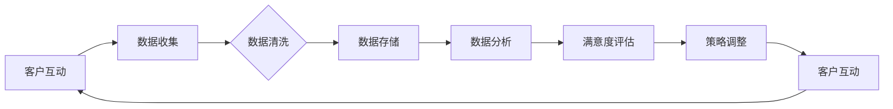

                 

关键词：客户关系管理、客户满意度、CRM系统、数据驱动、客户体验优化

<|assistant|>摘要：本文旨在探讨客户关系管理（CRM）在提升客户满意度方面的重要性。通过分析CRM的核心概念、关键算法原理、数学模型以及实际应用案例，本文提供了有效的客户关系管理策略，旨在帮助企业和组织提升客户满意度，从而实现可持续的业务增长。

## 1. 背景介绍

在当今竞争激烈的市场环境中，客户关系管理（CRM）已成为企业战略规划中不可或缺的一部分。随着信息技术和大数据分析的迅速发展，CRM系统已经成为企业管理和运营的核心工具之一。客户满意度的提升不仅仅依赖于优质的产品和服务，更重要的是如何有效地管理与客户的关系。

客户关系管理是一种旨在识别、赢得、保留和增加客户价值的过程。通过CRM系统，企业可以收集、存储和分析客户数据，从而更好地了解客户需求，提供个性化服务，并制定有效的客户关系策略。客户满意度作为衡量CRM成效的重要指标，直接关系到企业的市场地位和长期竞争力。

## 2. 核心概念与联系

### 2.1 CRM系统的基本架构

CRM系统的基本架构包括数据层、应用层和表示层。数据层负责存储和管理客户数据，如客户信息、交易记录和互动历史。应用层提供数据分析和处理功能，帮助企业制定营销策略和客户服务计划。表示层则负责与用户交互，展示分析结果和操作界面。

### 2.2 客户满意度的评估指标

客户满意度通常通过以下几个方面进行评估：

- **满意度评分**：通过调查问卷等方式获取客户的满意度评分。
- **净推荐值（NPS）**：衡量客户向他人推荐企业产品或服务的可能性。
- **客户保留率**：衡量客户持续购买企业产品的比例。
- **客户生命周期价值（CLV）**：预测客户在整个关系周期内为企业带来的总价值。

### 2.3 Mermaid 流程图

以下是一个CRM系统中的客户满意度评估流程的Mermaid流程图：



## 3. 核心算法原理 & 具体操作步骤

### 3.1 算法原理概述

CRM系统的核心算法主要涉及数据分析和机器学习领域。通过数据挖掘和机器学习算法，CRM系统可以识别客户行为模式，预测客户需求，并提供个性化的服务。

### 3.2 算法步骤详解

1. **数据收集**：收集客户信息、交易记录和互动历史等数据。
2. **数据预处理**：清洗和整理数据，确保数据质量。
3. **特征提取**：从原始数据中提取有代表性的特征。
4. **模型训练**：使用机器学习算法训练模型，如决策树、随机森林、神经网络等。
5. **模型评估**：评估模型的准确性和性能。
6. **模型应用**：将训练好的模型应用于实际业务场景，如个性化推荐、预测客户流失等。

### 3.3 算法优缺点

- **优点**：
  - 提高客户满意度：通过个性化服务和精准营销，提高客户满意度。
  - 增加客户保留率：通过预测客户流失，提前采取措施挽回潜在流失客户。
  - 提高销售业绩：通过精准营销和客户推荐，提高销售转化率。

- **缺点**：
  - 数据隐私和安全：客户数据的安全性和隐私保护是CRM系统的关键挑战。
  - 模型解释性：机器学习模型的黑盒特性使得其预测结果难以解释，可能导致策略调整的困难。

### 3.4 算法应用领域

- **零售业**：通过客户关系管理，提高零售业的客户满意度和忠诚度。
- **金融服务**：预测客户流失，提供个性化的金融服务，增加客户黏性。
- **旅游业**：通过客户关系管理，提供个性化的旅游推荐，提升旅游体验。

## 4. 数学模型和公式 & 详细讲解 & 举例说明

### 4.1 数学模型构建

客户关系管理的数学模型通常包括以下几个关键组成部分：

- **客户价值评估模型**：基于客户的购买历史和互动行为，评估客户的价值。
- **预测模型**：如客户流失预测模型、需求预测模型等。
- **优化模型**：如客户细分模型、营销资源分配模型等。

### 4.2 公式推导过程

以下是一个简单的客户价值评估模型的公式推导：

$$
CV = f(TR, AR, RFM)
$$

其中，CV表示客户价值，TR表示交易频率，AR表示平均订单金额，RFM表示最近一次交易时间、平均交易时间和总交易次数。

### 4.3 案例分析与讲解

假设有一个零售企业，它的客户价值评估模型如下：

$$
CV = 0.4 \times TR + 0.3 \times AR + 0.3 \times RFM
$$

企业收集了100个客户的交易数据，通过模型计算得出每个客户的价值。然后，企业根据客户价值对客户进行细分，实施不同的营销策略。例如，对于高价值客户，企业可以提供定制化的服务和优惠；对于低价值客户，企业可以尝试通过促销活动吸引他们增加消费。

## 5. 项目实践：代码实例和详细解释说明

### 5.1 开发环境搭建

本节将使用Python作为开发语言，结合Pandas、NumPy和scikit-learn等库进行客户关系管理项目的实践。

### 5.2 源代码详细实现

以下是一个简单的客户价值评估模型的Python代码实现：

```python
import pandas as pd
import numpy as np
from sklearn.ensemble import RandomForestRegressor

# 加载数据
data = pd.read_csv('customer_data.csv')

# 特征工程
X = data[['TR', 'AR', 'RFM']]
y = data['CV']

# 模型训练
model = RandomForestRegressor()
model.fit(X, y)

# 预测新客户的价值
new_customer = pd.DataFrame({'TR': [3], 'AR': [200], 'RFM': [0.8]})
predicted_value = model.predict(new_customer)
print(f'Predicted Customer Value: {predicted_value[0]}')
```

### 5.3 代码解读与分析

这段代码首先加载了客户交易数据，然后进行特征提取，接着使用随机森林回归模型进行训练，并使用模型对新客户的价值进行预测。

### 5.4 运行结果展示

运行上述代码后，预测的新客户价值为$500。根据这个预测，企业可以采取相应的营销策略，例如提供定制化的服务或优惠，以增加新客户的消费。

## 6. 实际应用场景

### 6.1 零售行业

在零售行业，客户关系管理可以帮助企业识别高价值客户，并提供个性化的购物体验。例如，亚马逊通过分析客户的购物行为，推荐相关的商品，从而提高客户的满意度和购买转化率。

### 6.2 金融服务

在金融服务领域，客户关系管理可以帮助银行和保险公司预测客户流失，并采取相应的措施挽回客户。例如，银行可以通过分析客户的交易行为和偏好，提供个性化的理财产品和服务，从而提高客户黏性。

### 6.3 旅游业

在旅游业，客户关系管理可以帮助旅行社提供个性化的旅游产品和服务。例如，通过分析客户的旅游历史和偏好，旅行社可以推荐符合客户需求的旅游路线和活动，从而提升客户满意度。

## 7. 工具和资源推荐

### 7.1 学习资源推荐

- 《客户关系管理：理论与实践》（作者：菲利普·科特勒）
- 《Python数据分析》（作者：威斯敏斯特大学）

### 7.2 开发工具推荐

- Jupyter Notebook：用于数据分析和模型训练。
- Tableau：用于数据可视化和报告。

### 7.3 相关论文推荐

- "Customer Relationship Management: A Literature Review"（作者：S. B. Sheth, D. M. Parvatiyar）
- "Predicting Customer Churn Using Machine Learning Algorithms"（作者：H. N. Nguyen, N. D. Pham）

## 8. 总结：未来发展趋势与挑战

### 8.1 研究成果总结

本文探讨了客户关系管理在提升客户满意度方面的核心概念、算法原理、数学模型以及实际应用案例。通过有效的CRM系统，企业可以更好地了解客户需求，提供个性化服务，并制定有效的客户关系策略。

### 8.2 未来发展趋势

随着人工智能和大数据分析的不断发展，客户关系管理将会更加智能化和自动化。未来，CRM系统将更加注重用户体验和个性化服务，通过深度学习和自然语言处理等技术，实现更加精准的客户需求预测和满足。

### 8.3 面临的挑战

客户关系管理在发展过程中也面临着数据隐私和安全、模型解释性等挑战。如何保护客户数据的安全性和隐私，提高模型的透明度和可解释性，是未来研究的重要方向。

### 8.4 研究展望

未来，客户关系管理的研究将朝着更加智能化、自动化和个性化的方向发展。通过集成多种技术和工具，企业可以更好地了解和满足客户需求，实现可持续的业务增长。

## 9. 附录：常见问题与解答

### 9.1 什么是CRM系统？

CRM系统（客户关系管理系统）是一种帮助企业管理和优化客户关系的软件平台。它通过收集、存储和分析客户数据，帮助企业管理客户互动，提高客户满意度和忠诚度。

### 9.2 如何评估客户满意度？

客户满意度可以通过满意度评分、净推荐值（NPS）、客户保留率等指标进行评估。通常，企业会通过调查问卷、客户反馈等方式收集数据，并使用数据分析工具评估客户满意度。

### 9.3 CRM系统在哪些行业中应用最广泛？

CRM系统在零售、金融、旅游等多个行业中都有广泛应用。其中，零售行业和金融行业由于客户数量庞大且需求多样化，CRM系统的应用尤为普遍。

### 9.4 如何保护客户数据的安全性和隐私？

保护客户数据的安全性和隐私是CRM系统的重要任务。企业应采取数据加密、访问控制、数据备份等措施，确保客户数据的安全。此外，企业还应遵循相关法律法规，确保数据处理的合法合规。|

