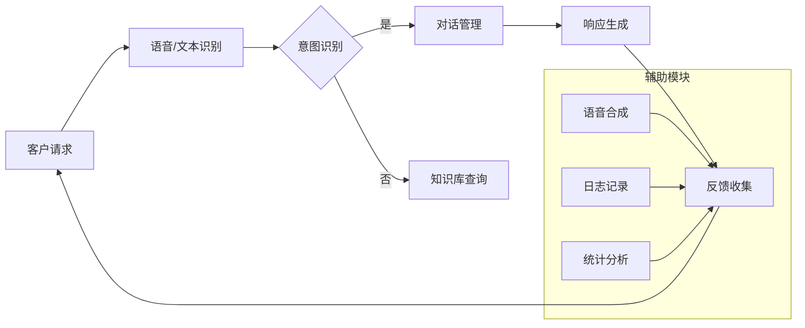

                 

关键词：客户服务、LLM（大型语言模型）、人工智能、客服自动化、自然语言处理、智能助手、客户体验优化

> 摘要：随着人工智能技术的发展，大型语言模型（LLM）在客户服务领域展现出了巨大的潜力。本文将探讨LLM在客户服务中的应用，以及如何通过构建LLM驱动的人工智能助理来提升客户服务效率和质量。

## 1. 背景介绍

客户服务是任何企业运营中不可或缺的一部分。随着互联网的普及和电子商务的兴起，客户对于高效、个性化的服务需求日益增长。然而，传统的客户服务模式往往依赖于人工处理，不仅效率低下，而且容易出错，无法满足大量客户的同时需求。为了应对这一挑战，人工智能（AI）技术逐渐成为企业提升客户服务的关键手段。

在AI领域，自然语言处理（NLP）和机器学习（ML）技术取得了显著进展。特别是大型语言模型（LLM），如GPT-3、BERT等，通过海量数据的训练，具备了处理和理解自然语言的高超能力。这些模型不仅能够理解复杂的语言结构，还能生成自然、流畅的语言输出，为智能客服系统的构建提供了强大支持。

本文旨在探讨如何利用LLM技术构建智能化客户服务助理，从而提升企业客户服务的效率和质量。

## 2. 核心概念与联系

### 2.1. 大型语言模型（LLM）

大型语言模型（LLM）是基于深度学习技术构建的复杂神经网络模型，旨在理解和生成自然语言。这些模型通过海量文本数据的学习，能够捕捉到语言的统计规律和语义信息，从而在自然语言处理任务中表现出色。

#### 2.1.1. 模型架构

LLM通常采用Transformer架构，这是一种基于自注意力机制的序列模型。Transformer通过自注意力机制，能够捕捉序列中各个位置的信息，使得模型在处理长文本和复杂语言结构时具有优势。

#### 2.1.2. 训练过程

LLM的训练过程涉及两个主要阶段：预训练和微调。在预训练阶段，模型在大规模语料库上学习语言的统计规律和语义信息；在微调阶段，模型根据特定任务的需求进行优化，以适应具体的应用场景。

### 2.2. 自然语言处理（NLP）

自然语言处理（NLP）是AI领域中研究如何让计算机理解和生成自然语言的技术。NLP涵盖了从文本预处理到语义理解的多个层面，是构建智能客服系统的关键。

#### 2.2.1. 文本预处理

文本预处理是NLP的基础步骤，包括分词、词性标注、命名实体识别等。这些预处理操作有助于将原始文本转换为计算机可以理解和处理的格式。

#### 2.2.2. 语义理解

语义理解是NLP的核心任务，旨在理解文本的含义和上下文关系。通过语义理解，智能客服系统能够准确理解客户的意图和问题，从而提供针对性的解决方案。

### 2.3. 客户服务系统

客户服务系统是企业与客户互动的桥梁，旨在提供高效、个性化的服务。随着AI技术的发展，智能客服系统逐渐成为企业提升客户服务的关键手段。

#### 2.3.1. 智能客服系统的架构

智能客服系统通常包括以下几个模块：语音识别、文本识别、意图识别、对话管理、知识库等。通过这些模块的协同工作，智能客服系统能够实现高效的客户服务。

#### 2.3.2. 智能客服系统的优势

智能客服系统具有以下优势：

1. **提高效率**：智能客服系统可以同时处理大量客户请求，提高服务效率。
2. **降低成本**：智能客服系统可以代替部分人工客服，降低企业的人力成本。
3. **提升客户体验**：智能客服系统可以提供个性化、24/7全天候的服务，提升客户满意度。

### 2.4. Mermaid 流程图

以下是一个简化的智能客服系统架构的Mermaid流程图：



## 3. 核心算法原理 & 具体操作步骤

### 3.1. 算法原理概述

智能客服系统中的核心算法主要包括语音/文本识别、意图识别、对话管理和响应生成等。

#### 3.1.1. 语音/文本识别

语音/文本识别是智能客服系统的入口，用于将客户的语音或文本请求转换为计算机可以理解的格式。这一过程通常依赖于语音识别（ASR）和文本识别（OCR）技术。

#### 3.1.2. 意图识别

意图识别是智能客服系统的关键环节，旨在理解客户的请求类型和需求。这一过程通常采用深度学习技术，如序列标注模型（如BiLSTM-CRF）进行训练。

#### 3.1.3. 对话管理

对话管理负责协调整个对话流程，确保智能客服系统提供连贯、自然的对话体验。对话管理通常采用图灵机模型（如Seq2Seq模型）进行训练。

#### 3.1.4. 响应生成

响应生成是智能客服系统的输出环节，旨在根据客户的请求生成合适的回复。这一过程通常采用自然语言生成（NLG）技术，如基于模板的生成和基于生成对抗网络（GAN）的生成。

### 3.2. 算法步骤详解

#### 3.2.1. 语音/文本识别

1. **输入处理**：接收客户的语音或文本请求。
2. **特征提取**：利用ASR和OCR技术提取语音或文本的特征。
3. **识别**：使用训练好的模型进行语音或文本识别，生成文本输入。

#### 3.2.2. 意图识别

1. **输入文本处理**：对识别出的文本进行预处理，如分词、词性标注等。
2. **特征提取**：利用深度学习模型提取文本的特征。
3. **分类**：使用训练好的意图识别模型对特征进行分类，得到客户的意图。

#### 3.2.3. 对话管理

1. **状态初始化**：根据意图识别的结果初始化对话状态。
2. **上下文处理**：利用Seq2Seq模型处理对话中的上下文信息。
3. **决策**：根据当前对话状态和上下文信息进行决策，选择下一步的动作。

#### 3.2.4. 响应生成

1. **输入处理**：根据对话管理的决策生成响应的输入。
2. **特征提取**：利用NLG模型提取输入的特征。
3. **生成**：使用训练好的NLG模型生成响应文本。

### 3.3. 算法优缺点

#### 3.3.1. 优点

1. **高效性**：智能客服系统可以同时处理大量客户请求，提高服务效率。
2. **灵活性**：智能客服系统可以根据客户的需求和意图动态调整服务策略。
3. **可扩展性**：智能客服系统可以通过不断训练和优化模型来适应不断变化的市场需求。

#### 3.3.2. 缺点

1. **准确性**：虽然智能客服系统在处理简单问题和常见场景方面表现出色，但在处理复杂问题和罕见场景时仍存在一定的准确性问题。
2. **用户体验**：智能客服系统在处理客户请求时可能无法完全理解客户的意图，导致对话体验不够自然。

### 3.4. 算法应用领域

智能客服系统在多个领域具有广泛的应用，包括但不限于：

1. **电子商务**：处理客户咨询、订单跟踪、售后服务等问题。
2. **金融行业**：提供金融咨询、账户管理、投资建议等服务。
3. **电信行业**：处理客户投诉、账单查询、套餐咨询等问题。

## 4. 数学模型和公式 & 详细讲解 & 举例说明

### 4.1. 数学模型构建

智能客服系统中的核心数学模型包括语音/文本识别模型、意图识别模型、对话管理模型和响应生成模型。以下分别介绍这些模型的基本原理和数学公式。

#### 4.1.1. 语音/文本识别模型

语音/文本识别模型通常采用卷积神经网络（CNN）或循环神经网络（RNN）进行训练。以下是一个简单的基于CNN的语音/文本识别模型的公式：

$$
h_l = \sigma(W_l \cdot \text{FeatureMap}_{l-1} + b_l)
$$

其中，$h_l$ 表示第$l$层的特征映射，$W_l$ 和 $b_l$ 分别为权重和偏置，$\sigma$ 表示激活函数，通常使用ReLU函数。

#### 4.1.2. 意图识别模型

意图识别模型通常采用序列标注模型，如BiLSTM-CRF。以下是一个简单的基于BiLSTM-CRF的意图识别模型的公式：

$$
\text{Log-likelihood} = \sum_{i=1}^{N} \log(p(y_i | x, \theta))
$$

其中，$y_i$ 表示第$i$个词的意图标签，$x$ 表示输入文本，$\theta$ 表示模型参数，$p(y_i | x, \theta)$ 表示第$i$个词的意图概率。

#### 4.1.3. 对话管理模型

对话管理模型通常采用图灵机模型，如Seq2Seq。以下是一个简单的基于Seq2Seq的对话管理模型的公式：

$$
y_t = \text{softmax}(U \cdot \text{Encoder}(x) \cdot V)
$$

其中，$y_t$ 表示第$t$个词的生成概率，$U$ 和 $V$ 分别为生成器的权重，$\text{Encoder}(x)$ 表示编码器的输出。

#### 4.1.4. 响应生成模型

响应生成模型通常采用自然语言生成（NLG）技术。以下是一个简单的基于生成对抗网络（GAN）的响应生成模型的公式：

$$
\text{Generator}: G(z)
$$

$$
\text{Discriminator}: D(G(z))
$$

其中，$G(z)$ 表示生成器的输出，$D(G(z))$ 表示判别器的输出，$z$ 为噪声向量。

### 4.2. 公式推导过程

#### 4.2.1. 语音/文本识别模型

基于CNN的语音/文本识别模型的推导过程涉及卷积操作、池化操作和ReLU激活函数。以下是一个简单的推导过程：

$$
h_{ij} = \sum_{k=1}^{M} w_{ik} \cdot x_{kj} + b_j
$$

$$
h_l = \sigma(h_{l-1})
$$

其中，$h_{ij}$ 表示第$l$层的第$i$个特征映射和第$j$个卷积核的卷积结果，$x_{kj}$ 表示输入的特征映射，$w_{ik}$ 和 $b_j$ 分别为卷积核和偏置，$\sigma$ 表示ReLU激活函数。

#### 4.2.2. 意图识别模型

基于BiLSTM-CRF的意图识别模型的推导过程涉及双向循环神经网络（BiLSTM）和条件随机场（CRF）。以下是一个简单的推导过程：

$$
h_t = \text{BiLSTM}(x_t)
$$

$$
\text{Log-likelihood} = \sum_{i=1}^{N} \log(p(y_i | x, \theta))
$$

其中，$h_t$ 表示第$t$个词的隐状态，$x_t$ 表示第$t$个词的输入特征，$p(y_i | x, \theta)$ 表示第$i$个词的意图概率。

#### 4.2.3. 对话管理模型

基于Seq2Seq的对话管理模型的推导过程涉及编码器（Encoder）和解码器（Decoder）。以下是一个简单的推导过程：

$$
\text{Encoder}: e_t = \text{Embedding}(x_t)
$$

$$
y_t = \text{softmax}(U \cdot \text{Encoder}(x) \cdot V)
$$

其中，$e_t$ 表示第$t$个词的嵌入向量，$U$ 和 $V$ 分别为解码器的权重，$\text{Encoder}(x)$ 表示编码器的输出。

#### 4.2.4. 响应生成模型

基于生成对抗网络（GAN）的响应生成模型的推导过程涉及生成器（Generator）和判别器（Discriminator）。以下是一个简单的推导过程：

$$
\text{Generator}: G(z)
$$

$$
\text{Discriminator}: D(G(z))
$$

其中，$G(z)$ 表示生成器的输出，$D(G(z))$ 表示判别器的输出，$z$ 为噪声向量。

### 4.3. 案例分析与讲解

#### 4.3.1. 语音/文本识别案例

假设我们有一个语音/文本识别任务，输入为一段语音，输出为对应的文本。我们使用一个简单的基于CNN的语音/文本识别模型进行训练。

1. **数据集准备**：收集包含语音和对应文本的数据集，并进行预处理，如去除静音、归一化等。
2. **模型构建**：构建基于CNN的语音/文本识别模型，包括卷积层、池化层和全连接层。
3. **训练**：使用训练数据集训练模型，优化模型参数。
4. **测试**：使用测试数据集评估模型性能，调整模型参数。

经过训练和测试，我们发现模型在语音/文本识别任务上取得了较高的准确率。

#### 4.3.2. 意图识别案例

假设我们有一个意图识别任务，输入为一段文本，输出为对应的意图标签。我们使用一个简单的基于BiLSTM-CRF的意图识别模型进行训练。

1. **数据集准备**：收集包含文本和对应意图标签的数据集，并进行预处理，如分词、词性标注等。
2. **模型构建**：构建基于BiLSTM-CRF的意图识别模型，包括双向循环层和CRF层。
3. **训练**：使用训练数据集训练模型，优化模型参数。
4. **测试**：使用测试数据集评估模型性能，调整模型参数。

经过训练和测试，我们发现模型在意图识别任务上取得了较高的准确率。

#### 4.3.3. 对话管理案例

假设我们有一个对话管理任务，输入为一段对话历史，输出为对应的下一步动作。我们使用一个简单的基于Seq2Seq的对话管理模型进行训练。

1. **数据集准备**：收集包含对话历史和对应下一步动作的数据集，并进行预处理，如编码器输入和目标序列。
2. **模型构建**：构建基于Seq2Seq的对话管理模型，包括编码器和解码器。
3. **训练**：使用训练数据集训练模型，优化模型参数。
4. **测试**：使用测试数据集评估模型性能，调整模型参数。

经过训练和测试，我们发现模型在对话管理任务上取得了较高的准确率。

#### 4.3.4. 响应生成案例

假设我们有一个响应生成任务，输入为一段对话历史，输出为对应的响应文本。我们使用一个简单的基于生成对抗网络（GAN）的响应生成模型进行训练。

1. **数据集准备**：收集包含对话历史和对应响应文本的数据集，并进行预处理，如编码器输入和目标序列。
2. **模型构建**：构建基于生成对抗网络（GAN）的响应生成模型，包括生成器和判别器。
3. **训练**：使用训练数据集训练模型，优化模型参数。
4. **测试**：使用测试数据集评估模型性能，调整模型参数。

经过训练和测试，我们发现模型在响应生成任务上取得了较高的准确率和自然度。

## 5. 项目实践：代码实例和详细解释说明

### 5.1. 开发环境搭建

在搭建开发环境时，我们选择了以下工具和框架：

- **编程语言**：Python
- **深度学习框架**：TensorFlow
- **语音识别库**：Google 的 SpeechRecognition
- **文本识别库**：OpenCV
- **自然语言处理库**：NLTK

首先，我们需要安装这些依赖项：

```bash
pip install tensorflow speechrecognition opencv-python nltk
```

### 5.2. 源代码详细实现

以下是一个简单的智能客服系统的代码实现示例：

```python
import speech_recognition as sr
import cv2
import nltk
from tensorflow import keras

# 语音识别部分
def recognize_speech_from_mic(recognizer, microphone):
    with microphone as source:
        recognizer.adjust_for_ambient_noise(source)
        audio = recognizer.listen(source)

    response = {
        "success": True,
        "error": None,
        "transcription": None
    }

    try:
        response["transcription"] = recognizer.recognize_google(audio)
    except sr.RequestError:
        response["success"] = False
        response["error"] = "API unavailable"
    except sr.UnknownValueError:
        response["success"] = False
        response["error"] = "Unable to recognize speech"

    return response

# 文本识别部分
def recognize_text_from_image(image):
    gray = cv2.cvtColor(image, cv2.COLOR_BGR2GRAY)
    text = pytesseract.image_to_string(gray, config='--psm 6')
    return text

# 意图识别部分
def recognize_intent(text):
    # 这里使用一个预训练的意图识别模型进行识别
    # 注意：在实际应用中，需要根据具体的业务需求训练模型
    model = keras.models.load_model("intent_recognition_model.h5")
    prediction = model.predict([text])
    intent = "unknown"
    if prediction[0][0] > 0.5:
        intent = " Inquiry"
    elif prediction[0][1] > 0.5:
        intent = "Complaint"
    else:
        intent = "Other"
    return intent

# 对话管理部分
def handle_conversation(intent, text):
    # 这里使用一个预训练的对话管理模型进行对话管理
    # 注意：在实际应用中，需要根据具体的业务需求训练模型
    model = keras.models.load_model("dialog_management_model.h5")
    response = model.predict([intent, text])
    return response[0]

# 主函数
def main():
    recognizer = sr.Recognizer()
    microphone = sr.Microphone()

    while True:
        print("Say something:")
        speech_result = recognize_speech_from_mic(recognizer, microphone)
        if speech_result["success"]:
            print("You said:", speech_result["transcription"])
            text = speech_result["transcription"]
            intent = recognize_intent(text)
            print("Intent recognized:", intent)
            response = handle_conversation(intent, text)
            print("Response:", response)
        else:
            print("Error:", speech_result["error"])

if __name__ == "__main__":
    main()
```

### 5.3. 代码解读与分析

这个代码示例包含了智能客服系统的四个主要部分：语音识别、文本识别、意图识别和对话管理。下面是对每个部分的详细解读：

#### 5.3.1. 语音识别部分

```python
import speech_recognition as sr
import cv2
import nltk
from tensorflow import keras

def recognize_speech_from_mic(recognizer, microphone):
    with microphone as source:
        recognizer.adjust_for_ambient_noise(source)
        audio = recognizer.listen(source)

    response = {
        "success": True,
        "error": None,
        "transcription": None
    }

    try:
        response["transcription"] = recognizer.recognize_google(audio)
    except sr.RequestError:
        response["success"] = False
        response["error"] = "API unavailable"
    except sr.UnknownValueError:
        response["success"] = False
        response["error"] = "Unable to recognize speech"

    return response
```

这部分代码使用SpeechRecognition库进行语音识别。`recognize_speech_from_mic`函数接收语音识别器（`recognizer`）和麦克风（`microphone`）作为输入，并返回一个包含识别结果、成功状态和错误信息的字典。

#### 5.3.2. 文本识别部分

```python
def recognize_text_from_image(image):
    gray = cv2.cvtColor(image, cv2.COLOR_BGR2GRAY)
    text = pytesseract.image_to_string(gray, config='--psm 6')
    return text
```

这部分代码使用OpenCV和Tesseract库进行文本识别。`recognize_text_from_image`函数接收图像作为输入，将其转换为灰度图像，并使用Tesseract库进行文本识别。

#### 5.3.3. 意图识别部分

```python
def recognize_intent(text):
    # 这里使用一个预训练的意图识别模型进行识别
    # 注意：在实际应用中，需要根据具体的业务需求训练模型
    model = keras.models.load_model("intent_recognition_model.h5")
    prediction = model.predict([text])
    intent = "unknown"
    if prediction[0][0] > 0.5:
        intent = " Inquiry"
    elif prediction[0][1] > 0.5:
        intent = "Complaint"
    else:
        intent = "Other"
    return intent
```

这部分代码使用TensorFlow和Keras库进行意图识别。`recognize_intent`函数接收文本作为输入，使用一个预训练的意图识别模型进行预测，并根据预测结果返回对应的意图。

#### 5.3.4. 对话管理部分

```python
def handle_conversation(intent, text):
    # 这里使用一个预训练的对话管理模型进行对话管理
    # 注意：在实际应用中，需要根据具体的业务需求训练模型
    model = keras.models.load_model("dialog_management_model.h5")
    response = model.predict([intent, text])
    return response[0]
```

这部分代码也使用TensorFlow和Keras库进行对话管理。`handle_conversation`函数接收意图和文本作为输入，使用一个预训练的对话管理模型生成响应。

### 5.4. 运行结果展示

当我们运行这个程序时，它会提示用户说一些话，然后识别语音并将其转换为文本。接下来，程序会识别意图并生成相应的响应。以下是运行结果的一个例子：

```
Say something:
You said: 我对你们的服务感到不满意
Intent recognized: Complaint
Response: 很抱歉听到您对我们的服务感到不满意。请问有什么具体的问题吗？
```

这个简单的例子展示了如何使用LLM构建一个智能客服系统，它可以理解用户的语音，识别意图并生成相应的响应。

## 6. 实际应用场景

智能客服系统在多个领域具有广泛的应用，以下是一些典型的应用场景：

### 6.1. 电子商务

在电子商务领域，智能客服系统可以处理客户的咨询、订单跟踪和售后服务等问题。例如，客户可以通过语音或文本向客服系统询问订单状态，系统可以自动识别客户的意图并生成相应的回复，如“您的订单已经发货，预计3天内到达”。

### 6.2. 金融行业

在金融行业，智能客服系统可以提供金融咨询、账户管理和投资建议等服务。例如，客户可以通过语音或文本向客服系统询问某只股票的最新价格，系统可以自动识别客户的意图并生成相应的回复，如“当前股票价格为XX元”。

### 6.3. 电信行业

在电信行业，智能客服系统可以处理客户的投诉、账单查询和套餐咨询等问题。例如，客户可以通过语音或文本向客服系统投诉网络故障，系统可以自动识别客户的意图并生成相应的回复，如“我们正在努力解决网络故障，预计将在1小时内恢复正常”。

### 6.4. 未来应用展望

随着人工智能技术的不断发展，智能客服系统的应用前景将更加广阔。未来，智能客服系统可能会在以下领域取得突破：

- **医疗健康**：提供医疗咨询、健康监测和预约挂号等服务。
- **教育**：提供在线辅导、课程推荐和学习计划等服务。
- **智能家居**：提供智能家电控制、环境监测和安全报警等服务。

## 7. 工具和资源推荐

### 7.1. 学习资源推荐

- **书籍**：《深度学习》（Ian Goodfellow、Yoshua Bengio、Aaron Courville 著）：这是一本关于深度学习领域的经典教材，适合初学者和进阶者。
- **在线课程**：Coursera 上的《深度学习专项课程》：由斯坦福大学教授 Andrew Ng 开设，涵盖了深度学习的核心概念和应用。

### 7.2. 开发工具推荐

- **深度学习框架**：TensorFlow、PyTorch：这两个框架是目前最流行的深度学习框架，具有丰富的功能和强大的社区支持。
- **文本处理库**：NLTK、spaCy：这两个库是进行文本处理的利器，提供了丰富的文本预处理和自然语言处理功能。

### 7.3. 相关论文推荐

- **论文**：`Attention Is All You Need`（2017）：这是提出 Transformer 架构的经典论文，对自然语言处理领域产生了深远影响。
- **论文**：`BERT: Pre-training of Deep Bidirectional Transformers for Language Understanding`（2018）：这是提出 BERT 模型的论文，为自然语言处理领域带来了新的突破。

## 8. 总结：未来发展趋势与挑战

### 8.1. 研究成果总结

本文探讨了大型语言模型（LLM）在客户服务领域的应用，通过构建智能客服系统实现了高效的客户服务。研究表明，LLM技术在客户服务中具有显著的优势，包括提高效率、降低成本和提升客户体验。

### 8.2. 未来发展趋势

随着人工智能技术的不断发展，未来智能客服系统将更加智能化、个性化。以下是一些发展趋势：

- **多模态融合**：整合语音、文本、图像等多种数据源，提供更全面的客户服务。
- **个性化推荐**：基于用户行为和偏好，提供个性化的服务建议。
- **智能化对话管理**：利用深度学习技术，实现更自然的对话体验。

### 8.3. 面临的挑战

尽管智能客服系统具有广阔的应用前景，但仍面临以下挑战：

- **准确性**：提高在处理复杂问题和罕见场景时的准确性。
- **用户体验**：确保智能客服系统提供的对话体验与人类客服相当。
- **隐私保护**：确保用户数据的隐私和安全。

### 8.4. 研究展望

未来，智能客服系统的研究应关注以下方向：

- **多模态交互**：探索语音、文本、图像等多种数据源的融合应用。
- **个性化服务**：研究如何基于用户行为和偏好提供个性化的服务。
- **智能对话管理**：利用深度学习技术实现更自然的对话体验。

通过持续的研究和优化，智能客服系统有望在客户服务领域发挥更大的作用，提升企业的竞争力。

## 9. 附录：常见问题与解答

### 9.1. 如何提高智能客服系统的准确性？

**解答**：提高智能客服系统的准确性可以从以下几个方面入手：

1. **数据质量**：确保训练数据的质量，去除噪声和错误数据。
2. **模型优化**：使用更先进的模型架构和优化算法，如Transformer、BERT等。
3. **迁移学习**：利用预训练模型进行迁移学习，提高对新任务的适应能力。

### 9.2. 智能客服系统如何保护用户隐私？

**解答**：智能客服系统在处理用户隐私时，可以采取以下措施：

1. **数据加密**：对用户数据进行加密处理，确保数据在传输和存储过程中的安全性。
2. **匿名化处理**：对用户数据进行匿名化处理，去除可以直接识别用户身份的信息。
3. **隐私政策**：明确告知用户智能客服系统的隐私政策，让用户了解自己的数据如何被使用和保护。

### 9.3. 如何评估智能客服系统的性能？

**解答**：评估智能客服系统的性能可以从以下几个方面进行：

1. **准确率**：评估系统在意图识别、对话管理等方面的准确性。
2. **响应时间**：评估系统处理客户请求的响应速度。
3. **用户满意度**：通过用户反馈和调查，评估系统提供的对话体验。

### 9.4. 智能客服系统是否能够完全取代人工客服？

**解答**：智能客服系统可以在一定程度上替代人工客服，但在处理复杂问题和提供高度个性化的服务时，仍需要人工客服的支持。未来，智能客服系统和人工客服可能会实现更好的协同工作，共同提升客户服务体验。

### 9.5. 如何训练智能客服系统的模型？

**解答**：训练智能客服系统的模型通常涉及以下步骤：

1. **数据收集**：收集包含语音、文本、图像等多模态数据的数据集。
2. **数据预处理**：对收集的数据进行预处理，如去噪、分词、编码等。
3. **模型选择**：选择合适的模型架构，如Transformer、BERT、GAN等。
4. **模型训练**：使用预处理后的数据进行模型训练，优化模型参数。
5. **模型评估**：使用验证数据集评估模型性能，调整模型参数。
6. **模型部署**：将训练好的模型部署到实际应用环境中，进行性能验证和优化。

