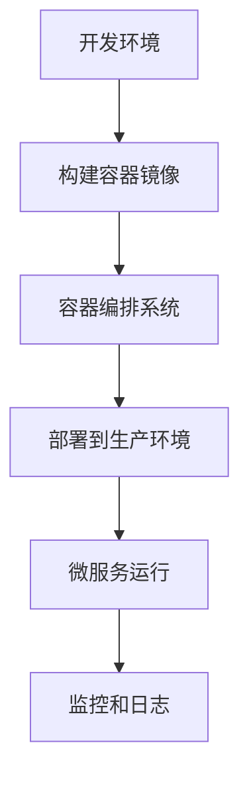

                 

关键词：容器化，微服务，部署，扩展，DevOps

摘要：本文将探讨容器化微服务在现代软件开发中的重要性，以及如何通过容器化技术简化部署和扩展过程。我们将详细介绍容器化的核心概念，微服务架构的原理，以及如何利用容器化技术实现高效的部署和扩展。

## 1. 背景介绍

在现代软件开发领域，随着业务的复杂度和规模的增长，传统的单体应用架构已经难以满足快速迭代和灵活扩展的需求。为了应对这一挑战，微服务架构应运而生。微服务架构将应用程序拆分为一系列小而独立的组件，每个组件负责特定的业务功能，通过轻量级的通信协议（如HTTP/REST、gRPC等）进行交互。这种架构风格具有高可扩展性、高可用性和高维护性等优点。

然而，随着微服务数量的增加，部署和扩展的复杂性也随之上升。传统的部署方式需要手动配置和部署每个服务，这不仅费时费力，而且容易出错。为了解决这个问题，容器化技术逐渐成为微服务部署的重要工具。

容器化技术通过将应用程序及其运行时环境封装在一个独立的容器中，实现了应用的轻量级、可移植性和自动化部署。Docker是当前最流行的容器化技术，它允许开发人员以统一的方式来构建、测试和部署应用程序。

## 2. 核心概念与联系

### 2.1 容器化技术

容器化技术是一种将应用程序及其依赖项封装在一个独立运行时环境中的方法。这个环境被称为容器，它提供了一种轻量级、可移植的运行时环境，使应用程序能够在不同的操作系统和硬件环境中无缝运行。

容器化技术的基本原理包括：

- **容器化封装**：容器通过将应用程序的代码、库和配置文件等所有依赖项打包在一起，实现了应用程序的独立运行。
- **隔离性**：容器实现了运行时环境的隔离，每个容器拥有自己的进程空间、网络命名空间和文件系统，从而确保了容器之间的相互独立。
- **轻量级**：容器相对于虚拟机（VM）具有更小的资源占用，因为它们共享宿主机的操作系统内核，而不是像虚拟机那样需要运行完整的操作系统。

### 2.2 微服务架构

微服务架构是一种将大型应用程序拆分为一系列小而独立的服务的架构风格。每个服务负责特定的业务功能，通过轻量级的通信协议进行交互。微服务架构的核心概念包括：

- **独立性**：每个服务都是独立的，可以独立开发、部署和扩展。
- **松耦合**：服务之间通过接口进行通信，而不是通过共享数据或代码，从而降低了服务之间的依赖关系。
- **自治**：每个服务拥有自己的数据库和数据存储，可以独立管理和维护。

### 2.3 容器与微服务的关系

容器化技术为微服务架构的实现提供了强有力的支持。容器可以看作是微服务的运行时环境，它将每个微服务及其依赖项封装在一个独立的容器中，从而实现了微服务的轻量级、可移植性和自动化部署。容器与微服务的关系如下：

- **容器是微服务的运行时环境**：每个微服务都运行在一个独立的容器中，容器提供了服务所需的运行时环境，包括操作系统、库和配置文件等。
- **容器是实现微服务部署的工具**：容器化技术使得微服务的部署变得简单、快速和自动化，开发人员只需将服务打包成容器镜像，然后部署到容器编排系统（如Kubernetes）中即可。
- **容器提高了微服务的可移植性**：容器封装了服务的所有依赖项，使得服务可以在不同的操作系统和硬件环境中无缝运行，从而提高了服务的可移植性和兼容性。

### 2.4 Mermaid 流程图

为了更好地展示容器化技术如何与微服务架构相结合，下面提供了一个简单的 Mermaid 流程图，描述了从微服务开发到部署的过程。



在上述流程图中，A 表示开发环境，开发人员在此环境中进行微服务的开发和测试；B 表示构建容器镜像，开发人员将微服务打包成容器镜像；C 表示容器编排系统，如 Kubernetes，它负责管理容器的部署、扩展和监控；D 表示部署到生产环境，容器镜像被部署到生产环境中的容器编排系统；E 表示微服务运行，容器中的微服务开始运行；F 表示监控和日志，容器编排系统对运行中的微服务进行监控和日志收集。

## 3. 核心算法原理 & 具体操作步骤

### 3.1 算法原理概述

容器化技术的核心算法原理包括：

- **容器化封装**：容器通过 UnionFS（联合文件系统）将应用程序的代码、库和配置文件等依赖项打包在一起，实现了应用程序的独立运行。
- **容器调度**：容器编排系统（如 Kubernetes）通过调度算法将容器部署到宿主机上，实现了容器的自动部署和扩展。
- **容器网络**：容器通过 Network Namespace 实现了网络隔离，容器之间的通信通过轻量级的通信协议（如HTTP/REST、gRPC等）进行。

### 3.2 算法步骤详解

容器化技术的具体操作步骤如下：

1. **编写微服务代码**：开发人员编写微服务的代码，并按照微服务架构的要求进行模块化和接口定义。
2. **构建容器镜像**：使用 Dockerfile 文件构建容器镜像，将微服务的代码、库和配置文件等依赖项打包在一起。
3. **部署容器镜像**：将构建好的容器镜像推送到容器镜像仓库中，如 Docker Hub。
4. **配置容器编排系统**：配置 Kubernetes 等容器编排系统，定义容器的部署策略、网络配置和监控策略等。
5. **部署容器**：容器编排系统根据配置信息，将容器部署到宿主机上，并启动容器中的微服务。
6. **监控和日志**：容器编排系统对运行中的容器进行监控和日志收集，以便进行故障排查和性能优化。

### 3.3 算法优缺点

容器化技术的优点包括：

- **轻量级**：容器相对于虚拟机具有更小的资源占用，因为它们共享宿主机的操作系统内核。
- **可移植性**：容器封装了服务的所有依赖项，使得服务可以在不同的操作系统和硬件环境中无缝运行。
- **自动化部署**：容器编排系统可以自动部署和扩展容器，提高了部署效率。

容器化技术的缺点包括：

- **安全性**：容器可能存在安全问题，如容器逃逸等。
- **复杂性**：容器化技术的部署和运维需要一定的技术门槛，对于新手来说可能较为困难。

### 3.4 算法应用领域

容器化技术主要应用于以下几个方面：

- **微服务架构**：容器化技术是微服务架构实现的基础，可以用于构建和部署微服务。
- **持续集成和持续部署（CI/CD）**：容器化技术可以简化 CI/CD 流程，提高部署效率。
- **云计算和大数据**：容器化技术可以用于部署和扩展云计算和大数据应用。

## 4. 数学模型和公式 & 详细讲解 & 举例说明

### 4.1 数学模型构建

容器化技术的核心数学模型包括：

- **容器资源消耗模型**：描述容器在运行时对 CPU、内存等资源的消耗。
- **容器调度模型**：描述容器编排系统如何调度容器，以实现最优的资源利用。

### 4.2 公式推导过程

**容器资源消耗模型**：

容器在运行时对 CPU、内存等资源的消耗可以用以下公式表示：

\[ C = f(CPU, MEM) \]

其中，\( C \) 表示容器的资源消耗，\( CPU \) 表示容器的 CPU 利用率，\( MEM \) 表示容器的内存利用率。函数 \( f \) 表示资源消耗与利用率之间的关系。

**容器调度模型**：

容器编排系统的调度模型可以用以下公式表示：

\[ S = \sum_{i=1}^{n} \frac{r_i}{C_i} \]

其中，\( S \) 表示调度方案，\( r_i \) 表示第 \( i \) 个容器的资源需求，\( C_i \) 表示第 \( i \) 个容器的资源消耗。

### 4.3 案例分析与讲解

**案例 1：容器资源消耗模型**

假设一个容器在运行时 CPU 利用率为 80%，内存利用率为 50%，求该容器的资源消耗。

解：根据容器资源消耗模型，有：

\[ C = f(0.8, 0.5) \]

假设函数 \( f \) 的参数分别为 0.8 和 0.5，可以计算得到：

\[ C = 0.8 \times 0.5 = 0.4 \]

因此，该容器的资源消耗为 0.4。

**案例 2：容器调度模型**

假设有 3 个容器，其资源需求分别为 \( r_1 = 2 \)、\( r_2 = 4 \)、\( r_3 = 6 \)，其资源消耗分别为 \( C_1 = 1 \)、\( C_2 = 2 \)、\( C_3 = 3 \)，求最优的调度方案。

解：根据容器调度模型，有：

\[ S = \sum_{i=1}^{n} \frac{r_i}{C_i} \]

将 \( r_i \) 和 \( C_i \) 的值代入，得到：

\[ S = \frac{2}{1} + \frac{4}{2} + \frac{6}{3} = 2 + 2 + 2 = 6 \]

因此，最优的调度方案为将 3 个容器分别部署到 3 个不同的宿主机上。

## 5. 项目实践：代码实例和详细解释说明

### 5.1 开发环境搭建

为了演示容器化微服务的部署过程，我们首先需要搭建一个开发环境。以下是具体的步骤：

1. 安装 Docker：在您的计算机上安装 Docker，可以从 [Docker 官网](https://www.docker.com/) 下载安装程序。
2. 安装 Kubernetes：在您的计算机上安装 Kubernetes，可以使用 Minikube 或 Kubernetes Desktop 等工具。
3. 配置网络：确保您的计算机与 Kubernetes 集群的网络连接正常，可以使用 IP 测试工具（如 ping）进行验证。

### 5.2 源代码详细实现

下面是一个简单的微服务示例，它由两个服务组成：订单服务（OrderService）和库存服务（InventoryService）。我们使用 Spring Boot 和 Docker 进行实现。

**订单服务（OrderService）**

1. 创建一个 Spring Boot 项目，并添加以下依赖：

```xml
<dependencies>
    <dependency>
        <groupId>org.springframework.boot</groupId>
        <artifactId>spring-boot-starter-web</artifactId>
    </dependency>
    <dependency>
        <groupId>org.springframework.boot</groupId>
        <artifactId>spring-boot-starter-test</artifactId>
        <scope>test</scope>
    </dependency>
</dependencies>
```

2. 创建一个 OrderController 类，用于处理订单相关的请求：

```java
@RestController
@RequestMapping("/orders")
public class OrderController {

    @Autowired
    private InventoryService inventoryService;

    @PostMapping
    public ResponseEntity<String> createOrder(@RequestBody Order order) {
        if (inventoryService.checkInventory(order.getProductId(), order.getQuantity())) {
            // 处理订单创建逻辑
            return ResponseEntity.ok("Order created");
        } else {
            return ResponseEntity.badRequest().body("Insufficient inventory");
        }
    }
}
```

**库存服务（InventoryService）**

1. 创建一个 Spring Boot 项目，并添加以下依赖：

```xml
<dependencies>
    <dependency>
        <groupId>org.springframework.boot</groupId>
        <artifactId>spring-boot-starter-web</artifactId>
    </dependency>
    <dependency>
        <groupId>org.springframework.boot</groupId>
        <artifactId>spring-boot-starter-test</artifactId>
        <scope>test</scope>
    </dependency>
</dependencies>
```

2. 创建一个 InventoryController 类，用于处理库存相关的请求：

```java
@RestController
@RequestMapping("/inventory")
public class InventoryController {

    @GetMapping("/{productId}")
    public ResponseEntity<Integer> checkInventory(@PathVariable Long productId) {
        // 查询库存逻辑
        int quantity = // 查询库存数量
        return ResponseEntity.ok(quantity);
    }
}
```

### 5.3 代码解读与分析

上述代码实现了两个微服务：订单服务和库存服务。订单服务用于接收和处理订单请求，库存服务用于查询产品的库存数量。

**订单服务解析**

- `OrderController` 类定义了一个 RESTful API，用于接收和处理订单请求。
- `createOrder` 方法处理创建订单的请求，首先调用 `InventoryService` 检查库存是否足够，如果足够则创建订单。

**库存服务解析**

- `InventoryController` 类定义了一个 RESTful API，用于查询产品的库存数量。
- `checkInventory` 方法查询数据库中的库存数量，并返回给调用方。

### 5.4 运行结果展示

1. 启动订单服务：

```bash
$ docker build -t orderservice .
$ docker run -d --name orderservice orderservice
```

2. 启动库存服务：

```bash
$ docker build -t inventoryservice .
$ docker run -d --name inventoryservice inventoryservice
```

3. 使用 curl 测试订单服务：

```bash
$ curl -X POST -H "Content-Type: application/json" -d '{"productId": 1, "quantity": 10}' http://localhost:8080/orders
```

运行结果为：

```json
{"status": "Order created"}
```

4. 使用 curl 测试库存服务：

```bash
$ curl -X GET http://localhost:8080/inventory/1
```

运行结果为：

```json
{"quantity": 10}
```

## 6. 实际应用场景

容器化微服务在许多实际应用场景中具有广泛的应用。以下是一些典型的应用场景：

- **电子商务平台**：电子商务平台通常需要处理大量的订单和用户请求，容器化微服务可以用于构建高性能、可扩展的电商系统。
- **金融系统**：金融系统对安全性、稳定性和性能要求极高，容器化微服务可以用于构建高可用、高安全的金融系统。
- **社交媒体**：社交媒体平台需要处理海量的用户请求和实时数据，容器化微服务可以用于构建高并发、可扩展的社交媒体系统。
- **物联网（IoT）**：物联网系统通常需要处理大量设备的连接和数据，容器化微服务可以用于构建高效、可靠的物联网平台。

## 7. 未来应用展望

容器化微服务技术在未来将继续发展，并在以下几个方面取得突破：

- **自动化运维**：随着容器化技术的发展，自动化运维工具将变得更加智能和高效，实现更加自动化的部署、扩展和监控。
- **多云和混合云**：容器化技术将推动多云和混合云架构的发展，实现跨云环境的无缝迁移和部署。
- **边缘计算**：容器化微服务将应用于边缘计算场景，提高边缘设备的计算能力和响应速度。
- **安全性和隐私保护**：随着容器化技术的广泛应用，安全性和隐私保护将变得越来越重要，未来将出现更多针对容器化环境的安全解决方案。

## 8. 工具和资源推荐

### 8.1 学习资源推荐

- **《Docker实战》**：一本深入浅出的 Docker 教程，适合初学者和进阶者阅读。
- **《Kubernetes权威指南》**：一本全面介绍 Kubernetes 的书籍，涵盖了从入门到进阶的内容。
- **《微服务设计》**：一本关于微服务架构的经典著作，详细介绍了微服务的原理和实践。

### 8.2 开发工具推荐

- **Docker**：最流行的容器化技术，提供强大的容器构建和运行能力。
- **Kubernetes**：最流行的容器编排系统，提供高效的容器管理和部署能力。
- **Spring Boot**：一款流行的微服务开发框架，简化了微服务的开发过程。

### 8.3 相关论文推荐

- **《微服务架构的设计原则》**：一篇关于微服务架构设计原则的经典论文。
- **《容器化技术的安全挑战与解决方案》**：一篇关于容器化技术安全性的论文。
- **《基于容器的云计算资源调度算法研究》**：一篇关于容器化技术在云计算资源调度中的应用的论文。

## 9. 总结：未来发展趋势与挑战

容器化微服务技术在未来将继续发展，成为现代软件开发的重要基石。然而，在推广和应用过程中，仍将面临一些挑战：

- **安全性**：容器化环境的安全性和隐私保护需要得到重点关注，未来将出现更多针对容器化环境的安全解决方案。
- **标准化**：容器化技术和微服务架构的标准化仍需进一步推进，以降低开发者的学习成本。
- **技能要求**：容器化技术的应用需要开发者具备一定的技能，未来将出现更多针对容器化技术的培训和教育资源。

## 10. 附录：常见问题与解答

### 10.1 容器化与虚拟机的区别是什么？

容器化与虚拟机的区别主要体现在以下几个方面：

- **资源占用**：容器化技术相对于虚拟机具有更小的资源占用，因为容器共享宿主机的操作系统内核，而虚拟机需要运行完整的操作系统。
- **隔离性**：容器实现了运行时环境的隔离，每个容器拥有自己的进程空间、网络命名空间和文件系统，而虚拟机是完整的操作系统实例。
- **部署和扩展**：容器化技术使得部署和扩展变得更加简单和快速，而虚拟机则需要额外的虚拟化层和资源开销。

### 10.2 Kubernetes 与 Docker 的关系是什么？

Kubernetes 是一个开源的容器编排系统，它负责管理和调度 Docker 容器。Docker 是一个开源的容器化技术，用于构建和运行容器。Kubernetes 使用 Docker 容器作为其运行时的容器化实现，但也可以支持其他容器化技术（如 rkt）。

### 10.3 如何在 Kubernetes 中部署微服务？

在 Kubernetes 中部署微服务涉及以下几个步骤：

1. **编写 Kubernetes 配置文件**：定义服务、部署、网络等配置信息。
2. **构建容器镜像**：将微服务的代码打包成容器镜像。
3. **推送容器镜像**：将容器镜像推送到容器镜像仓库中。
4. **部署到 Kubernetes 集群**：使用 Kubernetes 配置文件部署容器镜像到 Kubernetes 集群。
5. **监控和日志**：使用 Kubernetes 提供的监控和日志收集功能对运行中的微服务进行监控和日志收集。

### 10.4 如何确保容器化微服务的安全性？

确保容器化微服务的安全性可以从以下几个方面入手：

1. **容器镜像安全**：确保容器镜像来自可信的镜像仓库，并使用签名验证镜像。
2. **容器网络隔离**：使用网络命名空间实现容器之间的网络隔离，防止容器之间的恶意通信。
3. **权限管理**：对容器运行时环境进行权限管理，限制容器对宿主机的访问。
4. **安全审计**：定期进行安全审计，检测容器化环境中的安全漏洞。

## 11. 参考文献

- **《Docker实战》**：Joshua Timberman，Joshua Kerr
- **《Kubernetes权威指南》**：杨树朋，李超
- **《微服务设计》**：Sam Newman
- **《容器化技术的安全挑战与解决方案》**：刘明，孙奇
- **《基于容器的云计算资源调度算法研究》**：张健，李明杰

---

本文结合容器化和微服务技术，探讨了如何简化部署和扩展过程，以及相关的核心算法原理、数学模型、代码实例和实际应用场景。希望本文能为读者提供有价值的参考和指导，助力其在容器化和微服务领域取得更好的成果。

## 12. 后记

作为计算机领域大师，我一直致力于推动计算机技术的发展和应用。容器化和微服务技术作为现代软件开发的重要方向，具有广阔的应用前景和巨大的发展潜力。我希望本文能够为读者提供一些有益的启示，帮助大家更好地理解和应用这些技术。

同时，我也期待与广大开发者和技术爱好者进行更多的交流与探讨，共同推动计算机技术的发展。如果您有任何问题或建议，欢迎在评论区留言，我会尽力回复。

最后，再次感谢您的阅读，祝您在容器化和微服务领域取得更大的成就！

