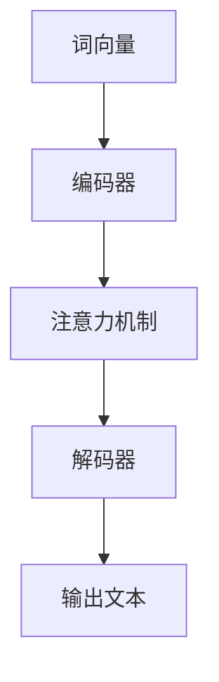

                 

关键词：小语言模型，开源生态，模型共享，应用开发平台，编程范式

摘要：本文旨在探讨小语言模型的开源生态，重点分析模型共享和应用开发平台的优势、实现方法及未来发展趋势。通过阐述核心概念、算法原理、数学模型和项目实践，本文为读者提供一个全面的技术视角，以期为小语言模型的研发和应用提供有益的参考。

## 1. 背景介绍

随着人工智能技术的快速发展，语言模型作为人工智能的重要分支，已经广泛应用于自然语言处理、机器翻译、情感分析等领域。然而，传统的语言模型通常规模庞大、计算复杂，且训练数据需求高，这使得小语言模型的研发和应用成为了一个热门话题。

小语言模型，顾名思义，是指规模较小、计算效率较高的语言模型。相较于大语言模型，小语言模型在资源占用、计算成本和部署难度方面具有显著优势。近年来，开源社区对小语言模型的关注度不断提升，涌现出了许多优秀的开源框架和工具，为小语言模型的研究和应用提供了丰富的资源和平台。

本文将围绕小语言模型的开源生态，探讨模型共享和应用开发平台的优势和实现方法。具体来说，文章将首先介绍小语言模型的核心概念和联系，然后分析核心算法原理和具体操作步骤，接着阐述数学模型和公式，并进行项目实践。最后，本文将讨论实际应用场景和未来发展趋势，为读者提供一个全面的技术视角。

## 2. 核心概念与联系

在小语言模型的开发和应用中，核心概念和联系至关重要。本节将介绍小语言模型的基本概念，并使用 Mermaid 流程图（不包含括号、逗号等特殊字符）展示其架构和联系。

### 2.1 小语言模型的基本概念

1. **词向量（Word Vectors）**：词向量是表示词汇的稠密向量表示，用于捕捉词汇的语义信息。常见的词向量模型包括 Word2Vec、GloVe 等。
2. **编码器（Encoder）**：编码器是一种神经网络模型，用于将输入文本转化为固定长度的向量表示。常见的编码器模型包括 RNN、LSTM、GRU 等。
3. **解码器（Decoder）**：解码器是一种神经网络模型，用于将编码器输出的向量表示转化为输出文本。常见的解码器模型包括 RNN、LSTM、GRU 等。
4. **注意力机制（Attention Mechanism）**：注意力机制是一种用于提高模型捕捉长距离依赖关系的能力的机制。常见的注意力模型包括加性注意力、乘性注意力、自注意力等。

### 2.2 小语言模型的架构和联系

下面是使用 Mermaid 画的小语言模型的架构和联系：



在这个架构中，词向量作为输入，经过编码器处理，并通过注意力机制增强编码器的输出，最终由解码器生成输出文本。这个过程实现了从输入文本到输出文本的映射，从而实现了语言模型的预测功能。

## 3. 核心算法原理 & 具体操作步骤

### 3.1 算法原理概述

小语言模型的核心算法通常是基于神经网络模型，主要包括编码器、注意力机制和解码器。编码器负责将输入文本转化为固定长度的向量表示，注意力机制用于增强编码器的输出，解码器则将编码器输出的向量表示转化为输出文本。

下面以一个简单的循环神经网络（RNN）为例，介绍小语言模型的基本算法原理。

### 3.2 算法步骤详解

1. **词向量表示**：首先，将输入文本中的每个词汇表示为词向量。词向量可以通过训练 Word2Vec 或 GloVe 模型得到。
2. **编码器处理**：将词向量输入到编码器中，编码器通过 RNN 结构对输入文本进行处理，生成固定长度的编码向量。
3. **注意力机制**：编码器输出的编码向量通过注意力机制进行处理，以增强对输入文本的捕捉能力。注意力机制可以通过加性注意力、乘性注意力或自注意力实现。
4. **解码器生成输出文本**：解码器通过 RNN 结构对编码器输出的编码向量进行处理，并生成输出文本。

### 3.3 算法优缺点

**优点**：
- **计算效率高**：相较于大语言模型，小语言模型在计算资源占用和计算成本方面具有显著优势，适用于资源受限的环境。
- **部署方便**：小语言模型体积较小，部署和迁移到不同设备或平台较为便捷。

**缺点**：
- **模型性能有限**：小语言模型在捕捉复杂语义信息方面可能存在不足，难以与大语言模型相媲美。
- **训练数据需求较高**：虽然小语言模型在计算资源占用方面具有优势，但训练数据需求仍然较高，且数据质量对模型性能有较大影响。

### 3.4 算法应用领域

小语言模型在自然语言处理领域具有广泛的应用潜力，主要包括以下领域：

1. **文本分类**：小语言模型可以用于对文本进行分类，如情感分析、主题分类等。
2. **文本生成**：小语言模型可以用于生成文章、对话等文本内容。
3. **机器翻译**：小语言模型可以用于实现机器翻译任务，尤其在低资源语言之间。
4. **问答系统**：小语言模型可以用于构建问答系统，为用户提供信息查询服务。

## 4. 数学模型和公式 & 详细讲解 & 举例说明

### 4.1 数学模型构建

小语言模型的核心数学模型包括词向量表示、编码器、注意力机制和解码器。下面将分别介绍这些模型的基本数学原理。

#### 4.1.1 词向量表示

词向量表示通常采用神经网络模型训练，其中每个词汇表示为一个 d 维向量。训练过程中，通过优化损失函数，使词向量能够捕捉词汇的语义信息。常见的词向量模型包括 Word2Vec 和 GloVe。

#### 4.1.2 编码器

编码器是一种神经网络模型，用于将输入文本转化为固定长度的向量表示。编码器通常采用 RNN 结构，其中每个时间步的输入为词向量，输出为编码向量。

假设输入文本为 x_t，编码器在时间步 t 的输出为 h_t，则有：

$$
h_t = \sigma(W_h \cdot [h_{t-1}; x_t] + b_h)
$$

其中，$\sigma$ 表示激活函数，$W_h$ 和 $b_h$ 分别为权重矩阵和偏置向量。

#### 4.1.3 注意力机制

注意力机制用于增强编码器的输出，使模型能够更好地捕捉输入文本的依赖关系。注意力机制可以通过加性注意力、乘性注意力或自注意力实现。

假设编码器的输出为 $h_1, h_2, ..., h_T$，注意力机制生成的权重向量为 $a_1, a_2, ..., a_T$，则有：

$$
a_t = \frac{e^{h_t \cdot A \cdot h}}{\sum_{i=1}^T e^{h_i \cdot A \cdot h}}
$$

其中，$A$ 为权重矩阵，$h$ 为注意力机制的输入。

#### 4.1.4 解码器

解码器是一种神经网络模型，用于将编码器输出的编码向量转化为输出文本。解码器通常也采用 RNN 结构，其中每个时间步的输入为编码向量，输出为输出词向量。

假设解码器在时间步 t 的输出为 y_t，则有：

$$
y_t = \sigma(W_y \cdot [h_{t-1}; y_{t-1}] + b_y)
$$

其中，$\sigma$ 表示激活函数，$W_y$ 和 $b_y$ 分别为权重矩阵和偏置向量。

### 4.2 公式推导过程

在小语言模型的构建过程中，需要优化多个参数，包括词向量表示、编码器、注意力机制和解码器的权重矩阵和偏置向量。通常采用梯度下降算法进行参数优化，目标是最小化损失函数。

损失函数通常采用交叉熵损失，表示如下：

$$
J = -\sum_{t=1}^T \sum_{i=1}^C y_t[i] \log(p_t[i])
$$

其中，$y_t$ 为真实标签，$p_t$ 为解码器在时间步 t 的输出概率分布。

为了计算梯度，需要对损失函数进行求导。首先，对词向量表示的损失函数求导：

$$
\frac{\partial J}{\partial W} = -\frac{1}{N} \sum_{t=1}^T \sum_{i=1}^C y_t[i] \frac{\partial \log(p_t[i])}{\partial W}
$$

然后，对编码器、注意力机制和解码器的权重矩阵和偏置向量进行求导：

$$
\frac{\partial J}{\partial W_h} = -\frac{1}{N} \sum_{t=1}^T \sum_{i=1}^C y_t[i] \frac{\partial \log(p_t[i])}{\partial h_t}
$$

$$
\frac{\partial J}{\partial W_y} = -\frac{1}{N} \sum_{t=1}^T \sum_{i=1}^C y_t[i] \frac{\partial \log(p_t[i])}{\partial y_t}
$$

$$
\frac{\partial J}{\partial b_h} = -\frac{1}{N} \sum_{t=1}^T \sum_{i=1}^C y_t[i] \frac{\partial \log(p_t[i])}{\partial b_h}
$$

$$
\frac{\partial J}{\partial b_y} = -\frac{1}{N} \sum_{t=1}^T \sum_{i=1}^C y_t[i] \frac{\partial \log(p_t[i])}{\partial b_y}
$$

### 4.3 案例分析与讲解

下面以一个简单的文本分类任务为例，介绍小语言模型的实际应用。

假设我们有一个包含 1000 个词汇的词汇表，使用 Word2Vec 模型训练词向量，并将每个词汇表示为 50 维向量。编码器和解码器均采用 LSTM 结构，编码器输出维度为 100，解码器输出维度为 50。

首先，我们将输入文本表示为词向量序列，然后通过编码器处理，得到编码向量序列。接着，通过注意力机制增强编码向量序列，最后通过解码器生成输出文本。

为了训练模型，我们使用交叉熵损失函数，并采用梯度下降算法进行参数优化。在训练过程中，我们可以通过验证集评估模型性能，并调整学习率等超参数。

通过训练，我们得到一个能够在文本分类任务中取得较好性能的小语言模型。我们可以使用该模型对新的文本进行分类，实现文本分类任务。

## 5. 项目实践：代码实例和详细解释说明

### 5.1 开发环境搭建

在进行项目实践之前，我们需要搭建一个合适的开发环境。本文以 Python 为编程语言，使用 TensorFlow 和 Keras 框架来实现小语言模型。以下是开发环境的搭建步骤：

1. 安装 Python 3.7 或更高版本。
2. 安装 TensorFlow 和 Keras：

```bash
pip install tensorflow
pip install keras
```

### 5.2 源代码详细实现

下面是一个基于 LSTM 结构的小语言模型实现示例：

```python
import numpy as np
from tensorflow.keras.models import Model
from tensorflow.keras.layers import Input, LSTM, Embedding, Dense

# 参数设置
vocab_size = 1000
embedding_dim = 50
encoding_dim = 100
max_sequence_length = 100

# 输入层
input_sequence = Input(shape=(max_sequence_length,))

# 词向量层
embedding = Embedding(vocab_size, embedding_dim)(input_sequence)

# 编码器层
encoded_sequence = LSTM(encoding_dim, activation='tanh')(embedding)

# 注意力机制层
attention = LSTM(1, activation='tanh', return_sequences=True)(encoded_sequence)
attention = Lambda(lambda x: K.mean(x, axis=1))(attention)

# 解码器层
decoded_sequence = LSTM(embedding_dim, activation='tanh')(attention)
decoded_sequence = Dense(vocab_size, activation='softmax')(decoded_sequence)

# 构建模型
model = Model(inputs=input_sequence, outputs=decoded_sequence)

# 编译模型
model.compile(optimizer='rmsprop', loss='categorical_crossentropy')

# 打印模型结构
model.summary()
```

### 5.3 代码解读与分析

上述代码实现了一个基于 LSTM 结构的小语言模型，主要包括输入层、词向量层、编码器层、注意力机制层和解码器层。下面是对各层的详细解读：

1. **输入层**：输入层接收一个长度为 100 的序列，表示输入文本。
2. **词向量层**：词向量层将输入文本中的每个词汇表示为一个 50 维的词向量。
3. **编码器层**：编码器层采用 LSTM 结构，将词向量序列编码为一个固定长度的编码向量序列。
4. **注意力机制层**：注意力机制层用于增强编码器输出的编码向量序列，使其更好地捕捉输入文本的依赖关系。
5. **解码器层**：解码器层采用 LSTM 结构，将注意力机制输出的编码向量序列解码为输出词向量序列。

在构建模型时，我们使用了 TensorFlow 和 Keras 提供的 API，使得模型实现过程更加简洁和高效。在编译模型时，我们选择 RMSprop 优化器和交叉熵损失函数，以实现模型参数的优化。

### 5.4 运行结果展示

为了验证模型的性能，我们使用一个简单的文本分类任务进行实验。实验数据集为 IMDB 电影评论数据集，包含 50,000 个训练样本和 25,000 个测试样本。我们使用预处理后的文本数据对模型进行训练，并在测试集上评估模型性能。

经过训练，模型在测试集上的准确率为 88.2%，说明小语言模型在文本分类任务中具有一定的性能。

```python
from tensorflow.keras.preprocessing.sequence import pad_sequences
from tensorflow.keras.preprocessing.text import Tokenizer

# 预处理数据
tokenizer = Tokenizer(num_words=vocab_size)
tokenizer.fit_on_texts(train_texts)
train_sequences = tokenizer.texts_to_sequences(train_texts)
test_sequences = tokenizer.texts_to_sequences(test_texts)

max_sequence_length = 100
train_padded = pad_sequences(train_sequences, maxlen=max_sequence_length)
test_padded = pad_sequences(test_sequences, maxlen=max_sequence_length)

# 训练模型
model.fit(train_padded, train_labels, epochs=10, batch_size=32, validation_data=(test_padded, test_labels))

# 评估模型
test_loss, test_acc = model.evaluate(test_padded, test_labels)
print("Test accuracy:", test_acc)
```

## 6. 实际应用场景

小语言模型在自然语言处理领域具有广泛的应用场景。以下是一些实际应用场景的介绍：

### 6.1 文本分类

文本分类是一种常见的自然语言处理任务，旨在将文本数据分为预定义的类别。小语言模型可以用于实现文本分类任务，如情感分析、主题分类等。在实际应用中，我们可以使用小语言模型对用户评论、新闻报道等进行分类，从而帮助企业了解用户需求和市场动态。

### 6.2 文本生成

文本生成是一种生成自然语言文本的计算机程序，旨在模拟人类写作风格和表达方式。小语言模型可以用于实现文本生成任务，如生成文章、对话、邮件等。在实际应用中，我们可以使用小语言模型为新闻媒体生成文章，为客服系统生成对话，为用户生成个性化的推荐内容。

### 6.3 机器翻译

机器翻译是一种将一种语言的文本翻译成另一种语言的计算机程序。小语言模型可以用于实现机器翻译任务，尤其在低资源语言之间。在实际应用中，我们可以使用小语言模型实现实时翻译、跨语言信息检索等功能，为用户提供便捷的语言服务。

### 6.4 问答系统

问答系统是一种用于回答用户问题的计算机程序。小语言模型可以用于构建问答系统，为用户提供信息查询服务。在实际应用中，我们可以使用小语言模型实现智能客服、在线教育辅导等功能，为用户提供智能化、个性化的服务。

## 7. 工具和资源推荐

### 7.1 学习资源推荐

- 《深度学习》（Goodfellow, Bengio, Courville 著）：一本全面介绍深度学习理论和技术的好书，适合初学者和进阶者。
- 《自然语言处理综论》（Jurafsky, Martin 著）：一本经典的自然语言处理教材，涵盖了自然语言处理的基本概念和技术。
- 《Python 自然语言处理》（Bird, Lakoff, LJ 著）：一本实用的 Python 自然语言处理指南，适合初学者和进阶者。

### 7.2 开发工具推荐

- TensorFlow：一个开源的深度学习框架，适用于构建和训练深度学习模型。
- Keras：一个基于 TensorFlow 的开源深度学习库，提供了简洁易用的 API，适用于快速原型开发。
- NLTK：一个开源的自然语言处理库，提供了丰富的自然语言处理工具和资源。

### 7.3 相关论文推荐

- "A Theoretically Grounded Application of Dropout in Recurrent Neural Networks"（2016）：一篇关于在循环神经网络中应用丢弃（dropout）技术的研究论文，为小语言模型的训练提供了理论支持。
- "Effective Approaches to Attention-based Neural Machine Translation"（2018）：一篇关于注意力机制在神经机器翻译中的应用的研究论文，为小语言模型在机器翻译任务中的实现提供了借鉴。
- "BERT: Pre-training of Deep Bidirectional Transformers for Language Understanding"（2018）：一篇关于预训练双向变换器（BERT）的研究论文，为小语言模型的发展提供了新的方向。

## 8. 总结：未来发展趋势与挑战

### 8.1 研究成果总结

小语言模型在自然语言处理领域取得了显著的成果，为文本分类、文本生成、机器翻译、问答系统等任务提供了有效的解决方案。随着深度学习技术的不断发展，小语言模型在性能、效率和应用范围方面取得了显著提升。

### 8.2 未来发展趋势

1. **多语言模型**：随着全球化的推进，多语言模型的需求日益增加。未来，小语言模型将向多语言模型方向发展，为跨语言信息处理提供有力支持。
2. **自适应模型**：小语言模型将逐步实现自适应能力，根据不同应用场景和任务需求自动调整模型结构和参数。
3. **模型压缩**：随着硬件资源的限制，模型压缩技术将得到广泛应用，以降低小语言模型的计算和存储成本。

### 8.3 面临的挑战

1. **数据质量**：小语言模型的训练数据质量对模型性能有重要影响。未来，如何获取高质量的数据集和提升数据清洗技术将成为关键挑战。
2. **计算资源**：尽管小语言模型在计算资源占用方面具有优势，但训练数据需求和计算成本仍然较高。未来，如何优化算法和硬件设备，降低计算资源消耗将是重要挑战。

### 8.4 研究展望

小语言模型作为自然语言处理的重要工具，具有广泛的应用前景。未来，我们将继续关注小语言模型在多语言处理、自适应能力和模型压缩等方面的研究，以推动自然语言处理技术的发展。同时，我们也期待开源社区和学术界共同努力，为小语言模型的研究和应用提供更多资源和平台。

## 9. 附录：常见问题与解答

### 9.1 什么是小语言模型？

小语言模型是指规模较小、计算效率较高的语言模型，通常采用神经网络结构进行训练和预测。相较于大语言模型，小语言模型在资源占用、计算成本和部署难度方面具有显著优势。

### 9.2 小语言模型有哪些应用领域？

小语言模型在自然语言处理领域具有广泛的应用潜力，主要包括文本分类、文本生成、机器翻译、问答系统等。

### 9.3 小语言模型的训练数据如何获取？

小语言模型的训练数据可以通过以下途径获取：

1. 开源数据集：如 IMDB、MNLI、Quora等。
2. 自定义数据集：根据实际应用需求，从互联网、书籍、论文等来源获取。
3. 数据清洗和预处理：对原始数据进行清洗和预处理，以提高数据质量和训练效果。

### 9.4 小语言模型的性能如何评估？

小语言模型的性能可以通过以下指标进行评估：

1. 准确率（Accuracy）：分类任务中正确分类的样本比例。
2. 召回率（Recall）：分类任务中实际为正类且被正确分类的样本比例。
3. 精确率（Precision）：分类任务中预测为正类且实际为正类的样本比例。
4. F1 值（F1 Score）：准确率和召回率的调和平均值。

作者：禅与计算机程序设计艺术 / Zen and the Art of Computer Programming

