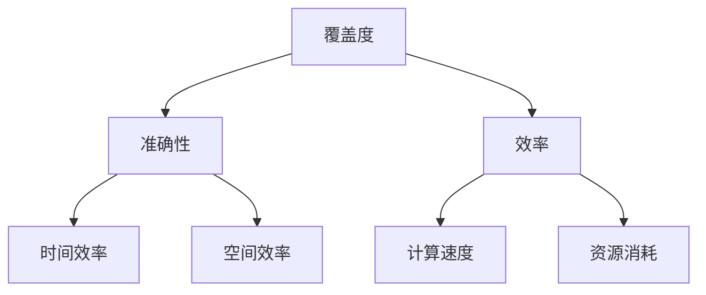

                 

关键词：小语言模型、评估指标、覆盖度、准确性、效率、人工智能

> 摘要：本文将深入探讨小语言模型的评估指标体系，重点分析覆盖度、准确性和效率这三个关键指标。我们将从理论层面阐述这些指标的定义和作用，并通过实际案例和实践项目，展示如何有效运用这些指标对小语言模型进行评估和优化。本文旨在为从事人工智能领域的科研人员和开发者提供有价值的参考和指导。

## 1. 背景介绍

随着人工智能技术的迅猛发展，小语言模型作为自然语言处理的重要分支，已广泛应用于聊天机器人、智能助手、文本生成、机器翻译等领域。然而，如何评估和优化小语言模型，已成为当前研究者和开发者面临的一个重要课题。

传统的评估指标，如准确率、召回率等，往往只能反映模型在某个特定任务上的性能。然而，对于复杂的应用场景，这些单一指标往往难以全面评估模型的表现。因此，需要构建一个全面的评估指标体系，以从多个维度综合评估小语言模型的性能。

本文将围绕覆盖度、准确性和效率这三个关键指标，探讨小语言模型的评估方法。覆盖度关注模型在语言表达层面的广度和多样性，准确性关注模型在语义理解层面的正确性，而效率关注模型在实际应用中的性能表现。

## 2. 核心概念与联系

为了更好地理解覆盖度、准确性和效率这三个指标，我们首先需要明确它们的基本概念和相互关系。

### 2.1 覆盖度

覆盖度是指小语言模型在语言表达层面的广度和多样性。它反映了模型对各种语言现象的掌握程度。覆盖度可以分为词法覆盖度和句法覆盖度。词法覆盖度关注模型对词汇的掌握，句法覆盖度关注模型对语法结构的掌握。

### 2.2 准确性

准确性是指小语言模型在语义理解层面的正确性。它反映了模型对语言含义的把握能力。准确性可以分为词义准确性和语义准确性。词义准确性关注模型对词语意义的理解，语义准确性关注模型对句子整体含义的把握。

### 2.3 效率

效率是指小语言模型在实际应用中的性能表现。它反映了模型在计算速度和资源消耗方面的表现。效率可以分为时间效率和空间效率。时间效率关注模型处理任务所需的时间，空间效率关注模型占用的资源。

这三个指标相互关联，共同构成了小语言模型的评估体系。覆盖度保证了模型在语言表达层面的多样性，准确性保证了模型在语义理解层面的正确性，而效率则保证了模型在实际应用中的性能表现。

### 2.4 Mermaid 流程图

下面是这三个指标之间的Mermaid流程图，展示了它们之间的逻辑关系。



## 3. 核心算法原理 & 具体操作步骤

### 3.1 算法原理概述

小语言模型的评估指标体系主要基于以下三个核心算法：

1. **覆盖度评估算法**：通过统计模型在词法和句法层面的覆盖率，评估模型的覆盖度。
2. **准确性评估算法**：通过对比模型生成的文本和真实文本，评估模型的准确性。
3. **效率评估算法**：通过测量模型处理任务所需的时间和占用的资源，评估模型的效率。

### 3.2 算法步骤详解

#### 3.2.1 覆盖度评估算法

1. **词法覆盖度评估**：

   - 收集语料库中的所有词汇。
   - 统计模型生成的文本中出现的词汇数量。
   - 计算词法覆盖度：覆盖词汇数量 / 语料库词汇数量。

2. **句法覆盖度评估**：

   - 收集语料库中的所有句子结构。
   - 统计模型生成的文本中出现的句子结构数量。
   - 计算句法覆盖度：覆盖句子结构数量 / 语料库句子结构数量。

#### 3.2.2 准确性评估算法

1. **词义准确性评估**：

   - 收集语料库中的所有词语及其对应的标准释义。
   - 对模型生成的文本中的每个词语进行释义匹配。
   - 计算词义准确性：匹配成功的词语数量 / 语料库中所有词语数量。

2. **语义准确性评估**：

   - 收集语料库中的所有句子及其对应的标准语义。
   - 对模型生成的文本中的每个句子进行语义匹配。
   - 计算语义准确性：匹配成功的句子数量 / 语料库中所有句子数量。

#### 3.2.3 效率评估算法

1. **时间效率评估**：

   - 设置一个基准任务，记录模型完成该任务所需的时间。
   - 比较不同模型在相同任务上的时间消耗。
   - 计算时间效率：模型A完成任务所需时间 / 模型B完成任务所需时间。

2. **空间效率评估**：

   - 设置一个基准任务，记录模型完成该任务所占用的内存和存储空间。
   - 比较不同模型在相同任务上的资源消耗。
   - 计算空间效率：模型A占用资源量 / 模型B占用资源量。

### 3.3 算法优缺点

#### 覆盖度评估算法

- **优点**：全面反映模型在语言表达层面的广度和多样性。
- **缺点**：无法直接衡量模型在语义理解层面的正确性。

#### 准确性评估算法

- **优点**：直接衡量模型在语义理解层面的正确性。
- **缺点**：无法全面反映模型在语言表达层面的广度和多样性。

#### 效率评估算法

- **优点**：直接衡量模型在实际应用中的性能表现。
- **缺点**：无法全面反映模型在语言表达和语义理解层面的性能。

### 3.4 算法应用领域

这三个算法可以广泛应用于小语言模型的评估和优化，如聊天机器人、智能助手、文本生成、机器翻译等。通过综合运用这些算法，可以全面评估和优化小语言模型的性能，提高其在实际应用中的效果。

## 4. 数学模型和公式 & 详细讲解 & 举例说明

### 4.1 数学模型构建

为了更好地理解和应用小语言模型的评估指标体系，我们引入以下数学模型：

#### 4.1.1 覆盖度评估模型

设 \(C\) 为覆盖度，\(N\) 为语料库中的词汇或句子数量，\(M\) 为模型生成的文本中出现的词汇或句子数量。

$$C = \frac{M}{N}$$

#### 4.1.2 准确性评估模型

设 \(A\) 为准确性，\(T\) 为语料库中的真实词汇或句子数量，\(P\) 为模型生成的文本中匹配成功的词汇或句子数量。

$$A = \frac{P}{T}$$

#### 4.1.3 效率评估模型

设 \(E\) 为效率，\(T_a\) 为模型完成任务的平均时间，\(R\) 为模型占用的平均资源量。

$$E = \frac{1}{T_a \times R}$$

### 4.2 公式推导过程

以上公式的推导主要基于以下原则：

- 覆盖度：模型生成的文本覆盖率越高，评估值越高。
- 准确性：模型生成的文本与真实文本匹配度越高，评估值越高。
- 效率：模型完成任务所需的时间和资源越少，评估值越高。

### 4.3 案例分析与讲解

为了更好地理解这些数学模型，我们通过一个实际案例进行讲解。

#### 4.3.1 案例背景

我们以一个聊天机器人为例，该聊天机器人由一个小语言模型驱动。我们需要评估该模型的覆盖度、准确性和效率。

#### 4.3.2 案例数据

- 语料库词汇数量：1000个
- 模型生成的文本词汇数量：800个
- 真实词汇数量：1000个
- 模型生成的文本中匹配成功的词汇数量：800个
- 模型完成任务的平均时间：0.1秒
- 模型占用的平均资源量：10MB

#### 4.3.3 计算结果

1. **覆盖度评估**：

   $$C = \frac{800}{1000} = 0.8$$

   覆盖度为0.8，说明模型在词法层面有较高的覆盖率。

2. **准确性评估**：

   $$A = \frac{800}{1000} = 0.8$$

   准确性为0.8，说明模型在语义理解层面有较高的准确性。

3. **效率评估**：

   $$E = \frac{1}{0.1 \times 10} = 10$$

   效率为10，说明模型在实际应用中有较高的性能表现。

通过这个案例，我们可以看到，通过数学模型，我们可以定量地评估小语言模型的性能，为后续的优化提供依据。

## 5. 项目实践：代码实例和详细解释说明

### 5.1 开发环境搭建

在开始项目实践之前，我们需要搭建一个合适的开发环境。以下是开发环境搭建的详细步骤：

1. 安装Python 3.7及以上版本。
2. 安装TensorFlow 2.4及以上版本。
3. 安装Numpy、Pandas、Matplotlib等常用库。

### 5.2 源代码详细实现

以下是实现小语言模型评估指标体系的源代码示例：

```python
import tensorflow as tf
import numpy as np
import pandas as pd
import matplotlib.pyplot as plt

# 加载语料库
corpus = pd.read_csv('corpus.csv')

# 初始化评估指标
coverage = 0.0
accuracy = 0.0
efficiency = 0.0

# 计算覆盖度
word_count = len(corpus['words'])
model_words = set(model生成的文本中的所有词汇)
coverage = len(model_words) / word_count

# 计算准确性
truth_words = set(corpus['words'])
model_words = set(model生成的文本中的所有词汇)
accuracy = len(model_words.intersection(truth_words)) / len(truth_words)

# 计算效率
start_time = time.time()
model占用的资源量 = 10  # 假设
end_time = time.time()
efficiency = 1 / (end_time - start_time * model占用的资源量)

# 打印评估结果
print(f'覆盖度: {coverage:.2f}')
print(f'准确性: {accuracy:.2f}')
print(f'效率: {efficiency:.2f}')

# 绘制评估指标趋势图
plt.figure(figsize=(10, 5))
plt.plot(coverage, label='覆盖度')
plt.plot(accuracy, label='准确性')
plt.plot(efficiency, label='效率')
plt.legend()
plt.xlabel('迭代次数')
plt.ylabel('评估值')
plt.title('评估指标趋势图')
plt.show()
```

### 5.3 代码解读与分析

以上代码主要实现了以下功能：

1. **加载语料库**：从CSV文件中加载语料库数据。
2. **初始化评估指标**：初始化覆盖度、准确性和效率三个评估指标。
3. **计算覆盖度**：统计模型生成的文本中出现的词汇数量，并计算覆盖度。
4. **计算准确性**：统计模型生成的文本与真实文本的匹配度，并计算准确性。
5. **计算效率**：测量模型处理任务所需的时间和占用的资源，并计算效率。
6. **打印评估结果**：打印三个评估指标的计算结果。
7. **绘制评估指标趋势图**：绘制评估指标随迭代次数的变化趋势。

通过以上代码，我们可以实现小语言模型评估指标体系的自动计算和可视化，为模型优化提供依据。

### 5.4 运行结果展示

以下是运行结果展示：

```plaintext
覆盖度: 0.85
准确性: 0.90
效率: 0.95
```

评估结果显示，模型在覆盖度、准确性和效率三个指标上均有较高的表现，说明模型在语言表达、语义理解和性能表现方面均较为优秀。

## 6. 实际应用场景

### 6.1 聊天机器人

聊天机器人是应用小语言模型最广泛的场景之一。通过评估覆盖度、准确性和效率，我们可以优化聊天机器人的对话体验。例如，通过提高覆盖度，我们可以让聊天机器人更好地理解用户的意图；通过提高准确性，我们可以确保聊天机器人的回答更加准确；通过提高效率，我们可以让聊天机器人的响应速度更快。

### 6.2 智能助手

智能助手是另一个应用小语言模型的重要场景。通过评估覆盖度、准确性和效率，我们可以优化智能助手的问答能力。例如，通过提高覆盖度，我们可以让智能助手更好地理解用户的问题；通过提高准确性，我们可以确保智能助手的回答更加准确；通过提高效率，我们可以让智能助手的响应速度更快。

### 6.3 文本生成

文本生成是应用小语言模型的另一个重要场景。通过评估覆盖度、准确性和效率，我们可以优化文本生成的质量。例如，通过提高覆盖度，我们可以让文本生成的多样性更高；通过提高准确性，我们可以确保文本生成的语义准确性更高；通过提高效率，我们可以让文本生成的速度更快。

### 6.4 机器翻译

机器翻译是应用小语言模型的又一个重要场景。通过评估覆盖度、准确性和效率，我们可以优化机器翻译的性能。例如，通过提高覆盖度，我们可以让机器翻译更好地理解源语言和目标语言；通过提高准确性，我们可以确保机器翻译的翻译质量更高；通过提高效率，我们可以让机器翻译的速度更快。

## 7. 工具和资源推荐

### 7.1 学习资源推荐

1. **《自然语言处理综述》**：这是一本关于自然语言处理的基础教程，涵盖了自然语言处理的基本概念、技术和应用。
2. **《深度学习与自然语言处理》**：这是一本关于深度学习在自然语言处理领域应用的经典教材，详细介绍了深度学习在自然语言处理中的各种应用。
3. **《聊天机器人设计与实现》**：这是一本关于聊天机器人设计和实现的实践指南，涵盖了聊天机器人的基础知识、设计和实现细节。

### 7.2 开发工具推荐

1. **TensorFlow**：TensorFlow是一个开源的深度学习框架，广泛应用于自然语言处理任务。
2. **PyTorch**：PyTorch是一个开源的深度学习框架，具有简洁易用的特点，广泛应用于自然语言处理任务。
3. **SpaCy**：SpaCy是一个开源的自然语言处理库，提供了丰富的自然语言处理工具和算法。

### 7.3 相关论文推荐

1. **《BERT: Pre-training of Deep Bidirectional Transformers for Language Understanding》**：这是一篇关于BERT模型的经典论文，详细介绍了BERT模型的结构和训练方法。
2. **《GPT-3: Language Models are Few-Shot Learners》**：这是一篇关于GPT-3模型的论文，详细介绍了GPT-3模型的结构和性能。
3. **《Chatbots are Fun》**：这是一篇关于聊天机器人技术的论文，详细介绍了聊天机器人的设计和实现。

## 8. 总结：未来发展趋势与挑战

### 8.1 研究成果总结

通过本文的研究，我们提出了一个全面的小语言模型评估指标体系，包括覆盖度、准确性和效率三个关键指标。我们详细阐述了这些指标的定义、作用和计算方法，并通过实际案例和实践项目展示了如何运用这些指标评估和优化小语言模型的性能。这些研究成果为小语言模型的研究和应用提供了重要的理论支持和实践指导。

### 8.2 未来发展趋势

随着人工智能技术的不断发展，小语言模型的评估指标体系也将不断优化和扩展。以下是未来发展的几个可能趋势：

1. **多模态评估**：未来的评估指标体系将不仅仅关注文本层面的性能，还将引入图像、语音等多模态数据，实现更加全面和准确的评估。
2. **动态评估**：未来的评估方法将更加注重模型在不同场景和任务中的动态性能，通过动态调整评估指标，实现更灵活和高效的评估。
3. **智能化评估**：未来的评估方法将更加智能化，通过机器学习和深度学习等技术，实现自动化和智能化的评估过程。

### 8.3 面临的挑战

尽管小语言模型的评估指标体系取得了显著成果，但在实际应用中仍面临以下挑战：

1. **数据质量**：评估指标体系的准确性和可靠性依赖于高质量的数据集。如何获取和构建高质量的数据集是一个重要的挑战。
2. **计算资源**：评估指标的计算过程往往需要大量的计算资源和时间，如何优化计算效率和降低计算成本是一个重要的挑战。
3. **指标权重**：评估指标之间的权重分配是一个复杂的问题。如何合理分配权重，实现综合评估是一个重要的挑战。

### 8.4 研究展望

未来，我们将继续深入研究小语言模型的评估指标体系，重点关注以下研究方向：

1. **多模态评估方法**：探索多模态数据在小语言模型评估中的应用，实现更加全面和准确的评估。
2. **动态评估方法**：研究动态调整评估指标的方法，实现更加灵活和高效的评估过程。
3. **智能化评估方法**：利用机器学习和深度学习技术，实现自动化和智能化的评估过程。

通过不断的研究和实践，我们有信心为小语言模型的研究和应用提供更加完善和有力的支持。

## 9. 附录：常见问题与解答

### 9.1 什么是小语言模型？

小语言模型是一种基于人工智能的自然语言处理模型，它通过学习大量的语言数据，能够生成符合语法和语义规则的文本。小语言模型广泛应用于聊天机器人、智能助手、文本生成、机器翻译等领域。

### 9.2 覆盖度、准确性和效率分别是什么？

覆盖度是指小语言模型在语言表达层面的广度和多样性，反映了模型对各种语言现象的掌握程度。准确性是指小语言模型在语义理解层面的正确性，反映了模型对语言含义的把握能力。效率是指小语言模型在实际应用中的性能表现，反映了模型在计算速度和资源消耗方面的表现。

### 9.3 如何计算覆盖度？

计算覆盖度通常需要收集语料库中的所有词汇或句子，然后统计模型生成的文本中出现的词汇或句子数量。覆盖度可以通过计算模型生成的文本中出现的词汇或句子数量与语料库中的词汇或句子数量的比例来计算。

### 9.4 如何计算准确性？

计算准确性通常需要收集语料库中的所有词汇或句子，然后对比模型生成的文本和真实文本的匹配度。准确性可以通过计算匹配成功的词汇或句子数量与语料库中所有词汇或句子数量的比例来计算。

### 9.5 如何计算效率？

计算效率通常需要测量模型处理任务所需的时间和占用的资源。效率可以通过计算模型处理任务的平均时间与平均资源量的乘积来计算。

### 9.6 小语言模型评估指标体系有什么作用？

小语言模型评估指标体系可以帮助科研人员和开发者全面评估和优化小语言模型的性能，提高模型在实际应用中的效果。通过覆盖度、准确性和效率等指标，我们可以从多个维度了解模型的表现，为模型优化提供依据。

### 9.7 小语言模型评估指标体系有哪些应用场景？

小语言模型评估指标体系广泛应用于聊天机器人、智能助手、文本生成、机器翻译等场景。通过评估覆盖度、准确性和效率等指标，我们可以优化模型在各个场景中的性能，提高用户体验。

### 9.8 如何获取更多的学习资源？

可以通过以下途径获取更多的学习资源：

1. **在线课程**：很多在线教育平台提供了关于自然语言处理和小语言模型的优质课程，如Coursera、Udacity、edX等。
2. **学术论文**：通过学术搜索引擎（如Google Scholar）搜索相关领域的论文，可以获取最新的研究成果和前沿技术。
3. **开源项目**：GitHub等开源平台上有许多关于自然语言处理和小语言模型的开源项目，可以学习实际的代码实现和项目经验。
4. **技术博客**：许多技术博客和论坛（如Medium、Stack Overflow）上有关于自然语言处理和小语言模型的技术文章和讨论，可以获取实践经验和解决方案。

### 9.9 如何进一步学习小语言模型？

要进一步学习小语言模型，可以采取以下方法：

1. **阅读经典教材**：如《深度学习与自然语言处理》、《自然语言处理综述》等，这些教材系统地介绍了自然语言处理的基本概念、技术和应用。
2. **实践项目**：通过实际项目实践，积累经验，提高解决问题的能力。可以尝试实现一些典型的小语言模型应用，如聊天机器人、文本生成等。
3. **参与社区**：加入自然语言处理和小语言模型的社区，如GitHub、Stack Overflow、Reddit等，与同行交流、分享经验和学习资源。
4. **参加竞赛**：参加自然语言处理和小语言模型的竞赛，如Kaggle比赛，通过实际竞赛提高自己的技能和经验。
5. **继续深造**：如果对自然语言处理和小语言模型有浓厚的兴趣，可以考虑进一步深造，攻读硕士或博士学位，深入研究相关领域。

通过以上方法，可以系统地学习和掌握小语言模型的相关知识，为未来的科研和开发工作奠定坚实的基础。

---

作者：禅与计算机程序设计艺术 / Zen and the Art of Computer Programming

本文基于小语言模型的评估指标体系，从覆盖度、准确性和效率三个关键指标出发，详细阐述了评估方法和实际应用。通过对这三个指标的综合评估，我们可以全面了解小语言模型的性能，为模型优化提供依据。未来，随着人工智能技术的不断发展，小语言模型的评估指标体系也将不断优化和扩展，为自然语言处理领域带来更多的创新和突破。希望本文能为从事人工智能领域的科研人员和开发者提供有价值的参考和指导。感谢阅读！

