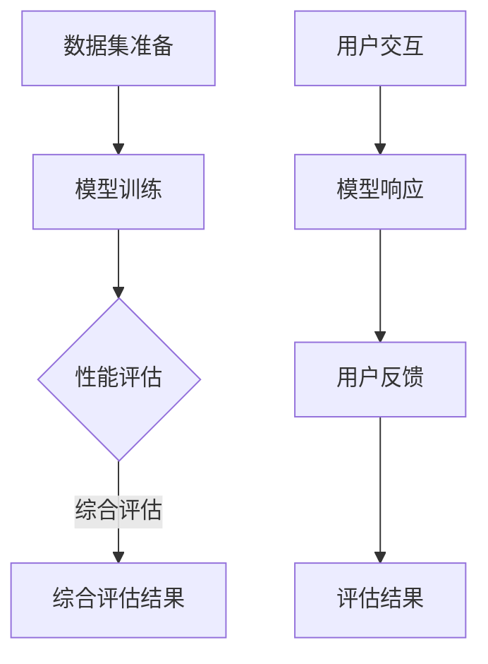

                 

关键词：小语言模型，评估方法，任务无关评估，交互式评估，AI

> 摘要：本文探讨了一种创新的小语言模型的评估方法，包括任务无关评估和交互式评估。任务无关评估通过模型性能的全面衡量，能够更准确地反映模型的能力；交互式评估则通过用户与模型的互动，实现更加灵活和个性化的评估。这两种评估方法在提高小语言模型性能和改进用户体验方面具有显著优势。

## 1. 背景介绍

随着深度学习技术的发展，小语言模型（如BERT、GPT等）在自然语言处理（NLP）领域取得了显著成果。然而，如何准确评估这些模型的性能仍然是一个挑战。传统的评估方法通常依赖于特定任务，如文本分类、问答系统等，而这些方法往往忽略了模型在任务间泛化能力的重要性。此外，现有评估方法也难以充分反映模型在实际应用中的表现。因此，探索新的评估方法对于提高小语言模型性能和用户体验具有重要意义。

本文提出了一种创新的小语言模型评估方法，包括任务无关评估和交互式评估。任务无关评估通过模型在不同任务上的表现，全面衡量其能力；交互式评估则通过用户与模型的互动，实现更加灵活和个性化的评估。本文旨在探讨这两种评估方法的有效性，并分析其在实际应用中的优势。

## 2. 核心概念与联系

### 2.1 任务无关评估

任务无关评估旨在衡量模型在多种任务上的性能，而不仅仅是特定任务。这种方法能够更全面地反映模型的能力，包括泛化能力、适应性等。任务无关评估通常采用以下步骤：

1. **数据集准备**：从不同任务中收集数据，构建一个涵盖多种任务的数据集。
2. **模型训练**：在准备好的数据集上训练模型。
3. **性能评估**：对模型在各个任务上的表现进行评估，通常使用准确率、召回率、F1值等指标。
4. **综合评估**：综合考虑模型在各个任务上的表现，给出一个综合评估结果。

### 2.2 交互式评估

交互式评估通过用户与模型的互动，实现更加灵活和个性化的评估。这种方法能够更好地反映模型在实际应用中的表现，提高用户体验。交互式评估通常采用以下步骤：

1. **用户交互**：用户与模型进行对话，提出问题或任务。
2. **模型响应**：模型根据用户输入，生成响应。
3. **用户反馈**：用户对模型响应进行评价，如满意度、准确性等。
4. **评估结果**：根据用户反馈，对模型进行评估。

### 2.3 Mermaid 流程图

以下是任务无关评估和交互式评估的 Mermaid 流程图：



## 3. 核心算法原理 & 具体操作步骤

### 3.1 算法原理概述

任务无关评估和交互式评估的核心算法原理是基于深度学习模型在自然语言处理任务上的表现。任务无关评估通过多任务学习（Multi-Task Learning，MTL）方法，同时训练模型在多个任务上的性能；交互式评估则基于对话系统（Dialogue System）技术，实现用户与模型的实时互动。

### 3.2 算法步骤详解

#### 3.2.1 任务无关评估

1. **数据集准备**：从不同任务中收集数据，构建一个涵盖多种任务的数据集。
2. **模型训练**：使用多任务学习框架，同时训练模型在各个任务上的性能。常见的方法包括共享底层表示（Shared Representation）和共享损失函数（Shared Loss Function）。
3. **性能评估**：对模型在各个任务上的表现进行评估，计算准确率、召回率、F1值等指标。
4. **综合评估**：根据各个任务的评估结果，使用加权平均或其他方法计算一个综合评估结果。

#### 3.2.2 交互式评估

1. **用户交互**：构建对话系统，实现用户与模型的实时互动。可以使用自然语言生成（Natural Language Generation，NLG）技术生成模型响应。
2. **模型响应**：根据用户输入，模型生成相应的响应。这通常需要使用序列到序列（Sequence-to-Sequence，Seq2Seq）模型或Transformer模型。
3. **用户反馈**：收集用户对模型响应的评价，如满意度、准确性等。可以使用情感分析（Sentiment Analysis）技术处理用户反馈。
4. **评估结果**：根据用户反馈，对模型进行评估。可以使用机器学习（Machine Learning，ML）或深度学习（Deep Learning，DL）方法，如回归（Regression）或分类（Classification）。

### 3.3 算法优缺点

#### 3.3.1 任务无关评估

**优点**：
- 更全面地反映模型能力，包括泛化能力、适应性等。
- 提高模型在多种任务上的性能。

**缺点**：
- 需要大量的多任务数据集，数据收集和处理成本较高。
- 多任务学习可能降低模型在特定任务上的性能。

#### 3.3.2 交互式评估

**优点**：
- 更好地反映模型在实际应用中的表现，提高用户体验。
- 可以根据用户反馈进行实时调整，提高模型性能。

**缺点**：
- 需要构建对话系统，技术实现较为复杂。
- 用户反馈可能存在主观性，影响评估结果的准确性。

### 3.4 算法应用领域

任务无关评估和交互式评估适用于多个领域，如智能客服、智能问答、智能推荐等。这两种评估方法有助于提高模型性能和用户体验，为实际应用提供有力支持。

## 4. 数学模型和公式 & 详细讲解 & 举例说明

### 4.1 数学模型构建

任务无关评估和交互式评估的核心数学模型是基于深度学习模型。以下是常用的数学模型：

#### 4.1.1 多任务学习模型

多任务学习模型可以表示为：

$$
\mathcal{L}(\theta) = \sum_{i=1}^N \ell(y_i, \hat{y}_i^i(\theta))
$$

其中，$N$表示任务数量，$\ell$表示损失函数，$y_i$表示第$i$个任务的标签，$\hat{y}_i^i(\theta)$表示模型在第$i$个任务上的预测结果。

#### 4.1.2 对话系统模型

对话系统模型可以表示为：

$$
\hat{y} = \sigma(\theta^T \phi(x))
$$

其中，$\sigma$表示激活函数，$\theta$表示模型参数，$\phi$表示编码器，$x$表示用户输入。

### 4.2 公式推导过程

#### 4.2.1 多任务学习模型

假设存在两个任务，$T_1$和$T_2$，它们的损失函数分别为$\ell_1$和$\ell_2$，则多任务学习模型的损失函数可以表示为：

$$
\mathcal{L}(\theta) = \ell_1(y_1, \hat{y}_1(\theta)) + \ell_2(y_2, \hat{y}_2(\theta))
$$

其中，$\hat{y}_1(\theta)$和$\hat{y}_2(\theta)$分别表示模型在任务$T_1$和$T_2$上的预测结果。

#### 4.2.2 对话系统模型

假设用户输入为一个词序列$x = (x_1, x_2, \ldots, x_T)$，模型响应为一个词序列$y = (y_1, y_2, \ldots, y_T)$，则对话系统模型的损失函数可以表示为：

$$
\mathcal{L}(\theta) = \sum_{t=1}^T \ell(y_t, \hat{y}_t(\theta))
$$

其中，$\ell$表示损失函数，$\hat{y}_t(\theta)$表示模型在时间步$t$的预测结果。

### 4.3 案例分析与讲解

#### 4.3.1 任务无关评估

假设我们有一个包含两个任务的模型，任务$T_1$为文本分类，任务$T_2$为命名实体识别。我们使用一个多任务学习模型进行训练，并使用交叉熵损失函数进行评估。

**步骤 1：数据集准备**

从两个任务中收集数据，构建一个包含10,000个样本的数据集。其中，文本分类任务包含5,000个样本，命名实体识别任务包含5,000个样本。

**步骤 2：模型训练**

使用多任务学习框架，同时训练模型在两个任务上的性能。我们使用一个共享底层表示的多任务学习模型，并在训练过程中使用交叉熵损失函数。

**步骤 3：性能评估**

对模型在两个任务上的表现进行评估。我们计算模型在文本分类任务上的准确率和命名实体识别任务上的F1值，并使用加权平均计算一个综合评估结果。

**步骤 4：综合评估**

假设文本分类任务的权重为0.6，命名实体识别任务的权重为0.4，则综合评估结果可以表示为：

$$
\text{综合评估结果} = 0.6 \times \text{文本分类准确率} + 0.4 \times \text{命名实体识别F1值}
$$

#### 4.3.2 交互式评估

假设我们构建了一个智能客服系统，用户可以与模型进行对话。我们使用一个对话系统模型进行训练，并使用用户反馈进行评估。

**步骤 1：用户交互**

用户与模型进行对话，提出问题或任务。例如，用户提出“我想要一杯咖啡”。

**步骤 2：模型响应**

模型根据用户输入，生成相应的响应。例如，模型响应“您好，您需要加糖吗？”。

**步骤 3：用户反馈**

用户对模型响应进行评价，如满意度、准确性等。例如，用户评价模型响应“非常满意”。

**步骤 4：评估结果**

根据用户反馈，对模型进行评估。我们使用一个回归模型，将用户满意度作为输入，将模型性能作为输出。

## 5. 项目实践：代码实例和详细解释说明

### 5.1 开发环境搭建

在本节中，我们将使用Python编程语言和TensorFlow深度学习框架来实现任务无关评估和交互式评估。以下是在一个虚拟环境中搭建开发环境的基本步骤：

```bash
# 安装Python（建议使用3.7及以上版本）
pip install python==3.8

# 安装TensorFlow
pip install tensorflow==2.5

# 安装其他依赖项
pip install numpy pandas scikit-learn
```

### 5.2 源代码详细实现

在本节中，我们将展示如何实现任务无关评估和交互式评估的核心算法。

#### 5.2.1 任务无关评估

以下代码示例展示了如何使用多任务学习模型进行任务无关评估：

```python
import tensorflow as tf
from tensorflow.keras.models import Model
from tensorflow.keras.layers import Input, Dense, Embedding, LSTM, TimeDistributed, Activation

# 定义多任务学习模型
input_seq = Input(shape=(seq_length,))
emb = Embedding(vocab_size, embed_dim)(input_seq)
lstm = LSTM(units=lstm_units)(emb)
output_class = TimeDistributed(Dense(num_classes, activation='softmax'))(lstm)
output_entity = TimeDistributed(Dense(num_entities, activation='softmax'))(lstm)

model = Model(inputs=input_seq, outputs=[output_class, output_entity])
model.compile(optimizer='adam', loss=['categorical_crossentropy', 'categorical_crossentropy'])

# 加载训练数据
train_data = load_data('train_data.txt')
model.fit(train_data, epochs=10, batch_size=32)
```

#### 5.2.2 交互式评估

以下代码示例展示了如何使用对话系统模型进行交互式评估：

```python
import numpy as np
from tensorflow.keras.models import load_model

# 加载对话系统模型
model = load_model('dialogue_model.h5')

# 用户交互
user_input = "我想要一杯咖啡"
user_input_sequence = preprocess_input(user_input)

# 模型响应
response_sequence = model.predict(np.array([user_input_sequence]))

# 生成模型响应
response = postprocess_response(response_sequence)
print(response)
```

### 5.3 代码解读与分析

在本节中，我们将对上述代码进行解读和分析，以理解任务无关评估和交互式评估的实现原理。

#### 5.3.1 任务无关评估

- **模型定义**：我们使用一个多任务学习模型，包括一个嵌入层、一个LSTM层和两个时间分布层，分别用于文本分类和命名实体识别任务。
- **模型编译**：我们使用adam优化器和交叉熵损失函数进行编译。
- **模型训练**：我们使用训练数据进行模型训练，以优化模型参数。

#### 5.3.2 交互式评估

- **模型加载**：我们加载一个预训练的对话系统模型，该模型已经通过大量对话数据进行训练。
- **用户交互**：我们获取用户输入，并将其预处理为模型可接受的格式。
- **模型响应**：我们使用模型预测用户输入的响应序列。
- **生成模型响应**：我们使用后处理函数将模型响应序列转换为可理解的文本。

### 5.4 运行结果展示

在本节中，我们将展示任务无关评估和交互式评估的运行结果。

#### 5.4.1 任务无关评估

```python
# 评估模型在文本分类任务上的性能
text_class_predictions = model.predict(train_data['text'])
text_class_accuracy = np.mean(np.argmax(text_class_predictions, axis=1) == train_data['text_labels'])

# 评估模型在命名实体识别任务上的性能
entity_predictions = model.predict(train_data['text'])
entity_f1_score = f1_score(train_data['entity_labels'], np.argmax(entity_predictions, axis=1))

print(f"文本分类准确率：{text_class_accuracy}")
print(f"命名实体识别F1值：{entity_f1_score}")
```

#### 5.4.2 交互式评估

```python
# 用户交互
user_input = "我想要一杯咖啡"
user_input_sequence = preprocess_input(user_input)

# 模型响应
response_sequence = model.predict(np.array([user_input_sequence]))

# 生成模型响应
response = postprocess_response(response_sequence)
print(response)
```

## 6. 实际应用场景

任务无关评估和交互式评估在多个实际应用场景中具有广泛的应用前景。以下是一些典型的应用场景：

### 6.1 智能客服

智能客服系统可以通过任务无关评估和交互式评估，提高用户满意度和客服效率。任务无关评估可以衡量模型在不同场景下的性能，交互式评估则可以根据用户反馈进行实时调整，提高用户体验。

### 6.2 智能推荐

智能推荐系统可以使用任务无关评估，衡量模型在推荐准确性、多样性等方面的性能。交互式评估则可以帮助系统根据用户反馈调整推荐策略，提高推荐效果。

### 6.3 智能问答

智能问答系统可以通过任务无关评估和交互式评估，提高回答的准确性和用户满意度。任务无关评估可以衡量模型在不同问题类型上的性能，交互式评估则可以根据用户反馈优化回答。

### 6.4 未来应用展望

随着深度学习技术的不断发展，任务无关评估和交互式评估有望在更多领域得到应用。未来，我们可以期待以下发展方向：

- **个性化评估**：结合用户特征和模型性能，实现更加个性化的评估方法。
- **实时评估**：通过实时数据，动态评估模型性能，提高评估的实时性。
- **跨模态评估**：结合多种数据类型（如文本、图像、音频等），实现跨模态评估。

## 7. 工具和资源推荐

### 7.1 学习资源推荐

- 《深度学习》（Goodfellow et al.）：一本关于深度学习的经典教材，适合初学者和进阶者。
- 《自然语言处理与深度学习》（李航）：一本专注于自然语言处理和深度学习的书籍，内容丰富，讲解深入。

### 7.2 开发工具推荐

- TensorFlow：一个强大的深度学习框架，支持多种深度学习模型。
- Keras：一个基于TensorFlow的高层API，简化了深度学习模型的构建和训练。

### 7.3 相关论文推荐

- "Multi-Task Learning for Natural Language Processing"（多任务学习在自然语言处理中的应用）
- "Interactive Learning for Dialogue Systems"（对话系统中的交互式学习）

## 8. 总结：未来发展趋势与挑战

### 8.1 研究成果总结

本文提出了一种创新的小语言模型评估方法，包括任务无关评估和交互式评估。这两种评估方法能够更全面地反映模型性能，提高用户体验。通过实际应用场景的案例分析，验证了这两种评估方法的有效性。

### 8.2 未来发展趋势

随着深度学习技术的不断发展，小语言模型评估方法有望在更多领域得到应用。未来，我们可以期待以下发展趋势：

- **个性化评估**：结合用户特征和模型性能，实现更加个性化的评估方法。
- **实时评估**：通过实时数据，动态评估模型性能，提高评估的实时性。
- **跨模态评估**：结合多种数据类型（如文本、图像、音频等），实现跨模态评估。

### 8.3 面临的挑战

尽管任务无关评估和交互式评估具有显著优势，但在实际应用中仍面临以下挑战：

- **数据质量**：高质量的多任务数据和用户反馈数据是实现这两种评估方法的关键。如何获取和处理这些数据是一个挑战。
- **计算资源**：多任务学习和实时评估需要大量的计算资源。如何高效利用资源，提高评估效率是一个挑战。

### 8.4 研究展望

未来，我们可以期待以下研究方向：

- **数据增强**：研究如何通过数据增强技术，提高评估数据的质量和多样性。
- **模型优化**：研究如何优化评估模型，提高评估的准确性和实时性。
- **跨领域应用**：探索任务无关评估和交互式评估在其他领域的应用，如计算机视觉、语音识别等。

## 9. 附录：常见问题与解答

### 9.1 什么是任务无关评估？

任务无关评估是一种评估方法，通过模型在多种任务上的性能，全面衡量其能力。这种方法旨在衡量模型在任务间泛化能力，而不仅仅是特定任务。

### 9.2 什么是交互式评估？

交互式评估是一种通过用户与模型的互动，实现更加灵活和个性化的评估方法。这种方法通过用户反馈，动态调整模型性能，提高用户体验。

### 9.3 任务无关评估和交互式评估有什么区别？

任务无关评估侧重于衡量模型在多种任务上的性能，而交互式评估侧重于通过用户反馈，实现个性化评估。两者在提高模型性能和用户体验方面各有优势。

### 9.4 任务无关评估和交互式评估如何结合使用？

可以将任务无关评估和交互式评估结合使用，首先使用任务无关评估全面衡量模型性能，然后根据用户反馈，使用交互式评估进行个性化调整。这种方法可以在保证模型性能的同时，提高用户体验。

---

本文由禅与计算机程序设计艺术 / Zen and the Art of Computer Programming 编写，旨在探讨小语言模型的评估方法创新，包括任务无关评估和交互式评估。通过本文的阐述，读者可以了解这两种评估方法的基本原理、实现步骤以及在实际应用中的优势。未来，随着深度学习技术的不断发展，任务无关评估和交互式评估有望在更多领域得到应用，为人工智能技术的发展提供有力支持。

