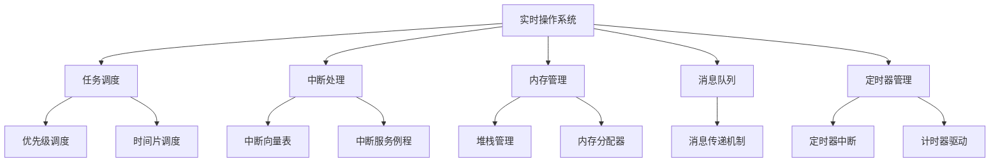

                 

 **关键词：** 嵌入式系统，实时操作系统，移植，架构设计，性能优化，代码实现，案例分析

**摘要：** 本文将深入探讨嵌入式实时操作系统（RTOS）的移植过程，包括其核心概念、架构设计、算法原理、数学模型、代码实现以及实际应用场景。通过详细的分析和案例研究，本文旨在为嵌入式开发者提供有价值的指导，帮助他们更有效地进行RTOS的移植工作。

## 1. 背景介绍

嵌入式实时操作系统（RTOS）在嵌入式系统中扮演着至关重要的角色。RTOS专门设计用于处理对时间敏感的任务，确保任务在规定的时间内得到响应，这对于许多嵌入式应用至关重要，如工业控制、汽车电子、医疗设备和消费电子等。

随着物联网（IoT）和边缘计算的发展，嵌入式系统的重要性日益增加。然而，嵌入式系统的多样性和复杂性也给RTOS的移植带来了挑战。不同的硬件平台和操作系统需求使得RTOS的移植成为一项复杂且具有挑战性的任务。

本文旨在提供一份全面且详细的指南，帮助嵌入式开发者理解和执行RTOS的移植过程。文章将涵盖RTOS的核心概念、架构设计、算法原理、数学模型、代码实现和实际应用场景，并提供实用的工具和资源推荐。

## 2. 核心概念与联系

在深入了解RTOS的移植之前，我们需要理解一些核心概念和它们之间的关系。以下是一个用Mermaid绘制的流程图，展示了RTOS核心概念和架构的组成部分：



### 2.1. 任务调度

任务调度是RTOS的核心功能之一，它负责根据一定的调度策略（如优先级调度或时间片调度）来分配CPU时间。任务调度器需要确保每个任务都能在规定的时间内得到执行。

### 2.2. 中断处理

中断处理是RTOS处理外部事件的重要机制。中断服务例程（ISR）负责在特定事件发生时执行特定的操作。中断向量表用于映射中断号到相应的ISR。

### 2.3. 内存管理

内存管理涉及堆栈管理和内存分配器。堆栈管理确保每个任务都有独立的堆栈空间，以存储局部变量和函数调用信息。内存分配器负责动态分配和回收内存，以满足任务对内存的需求。

### 2.4. 消息队列

消息队列提供了一种异步通信机制，允许任务之间交换消息。消息传递机制确保消息能够安全地传递，避免任务之间的数据竞争和冲突。

### 2.5. 定时器管理

定时器管理负责生成定时中断，用于触发特定事件或任务。计时器驱动负责与硬件定时器进行交互，而定时器中断则用于执行定时相关的操作。

## 3. 核心算法原理 & 具体操作步骤

### 3.1. 算法原理概述

RTOS的核心算法包括任务调度算法、中断处理算法和内存管理算法。以下是对这些算法的简要概述：

### 3.2. 算法步骤详解

#### 3.2.1. 任务调度算法

1. **初始化**：创建任务列表，初始化任务状态。
2. **调度**：根据调度策略选择下一个任务执行。
3. **上下文切换**：保存当前任务的上下文，加载下一个任务的上下文。
4. **执行**：执行下一个任务，直到任务完成或被中断。

#### 3.2.2. 中断处理算法

1. **中断请求**：硬件触发中断请求。
2. **中断向量表查询**：查询中断向量表获取ISR地址。
3. **ISR执行**：执行ISR，处理中断事件。
4. **中断返回**：恢复中断前的上下文，返回主程序。

#### 3.2.3. 内存管理算法

1. **初始化**：初始化内存分配器，设置内存池。
2. **内存分配**：根据任务需求分配内存。
3. **内存回收**：回收不再使用的内存。
4. **内存映射**：将内存地址映射到任务堆栈。

### 3.3. 算法优缺点

#### 任务调度算法

- **优点**：高效的任务切换和响应时间。
- **缺点**：复杂的调度策略实现和维护。

#### 中断处理算法

- **优点**：快速响应外部事件。
- **缺点**：可能导致上下文切换开销。

#### 内存管理算法

- **优点**：动态内存分配，高效利用内存。
- **缺点**：内存碎片问题。

### 3.4. 算法应用领域

RTOS算法广泛应用于各种嵌入式系统，如工业控制、实时监控、通信设备和智能交通系统。

## 4. 数学模型和公式 & 详细讲解 & 举例说明

RTOS的数学模型和公式对于理解其工作原理至关重要。以下是一个内存管理中的简单例子：

### 4.1. 数学模型构建

内存分配器通常使用以下公式来计算内存块的大小：

$$
\text{size} = \text{malloc(\text{size\_t size})}
$$

其中，`size_t` 是一个无符号整数类型，用于表示内存块的大小。

### 4.2. 公式推导过程

内存分配器的核心是空闲内存块的列表。每个空闲内存块都有一个大小和一个空闲状态。内存分配器使用以下公式来合并相邻的空闲内存块：

$$
\text{merged\_size} = \text{size1} + \text{size2}
$$

其中，`size1` 和 `size2` 分别是两个相邻空闲内存块的大小。

### 4.3. 案例分析与讲解

假设我们有一个内存池，初始包含以下空闲内存块：

- 块1：大小为 1024字节
- 块2：大小为 2048字节
- 块3：大小为 512字节

如果我们需要分配一个大小为 1536字节的内存块，内存分配器将尝试合并块1和块2，形成一个新的空闲内存块：

$$
\text{merged\_size} = 1024 + 2048 = 3072 \text{字节}
$$

然后，我们将从新的空闲内存块中分配 1536字节，剩余的 1536字节将作为新的空闲内存块添加到空闲内存块列表中。

## 5. 项目实践：代码实例和详细解释说明

### 5.1. 开发环境搭建

为了实践RTOS的移植，我们需要搭建一个合适的开发环境。以下是搭建开发环境的步骤：

1. 安装交叉编译工具链，如 GNU Arm Embedded Toolchain。
2. 安装集成开发环境（IDE），如 Eclipse CDT。
3. 配置RTOS开发板，如 STM32 Nucleo开发板。

### 5.2. 源代码详细实现

以下是一个简单的RTOS任务调度器实现：

```c
#include <stdio.h>
#include <stdlib.h>

#define MAX_TASKS 10
#define TASK_STACK_SIZE 1024

typedef struct {
    void (*taskFunction)(void *);
    void *parameters;
    int priority;
    int state;
    void *stack;
} Task;

Task tasks[MAX_TASKS];
int taskCount = 0;

void initializeRTOS() {
    // 初始化RTOS数据结构
}

void schedule() {
    // 调度任务
}

void yield() {
    // 交出CPU控制权
}

void createTask(void (*function)(void *), void *parameters, int priority) {
    // 创建任务
}

void taskFunction(void *parameters) {
    // 任务函数实现
}

int main() {
    // 初始化RTOS
    initializeRTOS();
    
    // 创建任务
    createTask(taskFunction, NULL, 1);
    
    // 开始RTOS调度
    schedule();
    
    return 0;
}
```

### 5.3. 代码解读与分析

上述代码提供了一个简单的RTOS任务调度器的框架。`Task` 结构体定义了任务的属性，如任务函数、优先级和状态。`tasks` 数组用于存储所有任务的实例。

`initializeRTOS()` 函数用于初始化RTOS数据结构。`schedule()` 函数负责调度任务，选择下一个任务执行。`yield()` 函数用于交出CPU控制权，允许其他任务运行。

`createTask()` 函数用于创建任务，将任务函数、参数和优先级传递给RTOS。`taskFunction()` 函数是任务的实际实现，可以执行任何所需的操作。

### 5.4. 运行结果展示

当RTOS运行时，`schedule()` 函数将根据任务的优先级和状态选择下一个任务执行。通过`yield()` 函数，任务可以交出CPU控制权，允许其他任务运行。

## 6. 实际应用场景

RTOS在嵌入式系统中有着广泛的应用场景。以下是一些典型的应用实例：

1. **工业控制**：RTOS用于实时监控和控制工业过程，如机器人和自动化生产线。
2. **汽车电子**：RTOS用于管理汽车电子系统，如车身控制单元、安全气囊和仪表板显示。
3. **医疗设备**：RTOS用于实时处理医疗数据，如心电图监护仪和智能医疗设备。
4. **消费电子**：RTOS用于智能手表、智能家居设备和智能音响等消费电子产品。

## 7. 工具和资源推荐

### 7.1. 学习资源推荐

- 《实时操作系统设计与实现》
- 《嵌入式系统设计与开发》
- 《STM32嵌入式系统开发实战》

### 7.2. 开发工具推荐

- Eclipse CDT
- GNU Arm Embedded Toolchain
- STM32CubeMX

### 7.3. 相关论文推荐

- "Real-Time Systems: Design Principles for Distributed Embedded Applications"
- "Efficient Task Scheduling in Real-Time Systems"
- "Memory Management for Real-Time Systems"

## 8. 总结：未来发展趋势与挑战

### 8.1. 研究成果总结

RTOS的研究成果为嵌入式系统的实时性能提供了坚实的基础。随着物联网和边缘计算的发展，RTOS在嵌入式系统中的应用越来越广泛。

### 8.2. 未来发展趋势

- **智能感知与协作**：RTOS将更深入地整合智能感知技术，实现更高效的任务协作。
- **资源优化与节能**：RTOS将致力于优化资源利用和降低能耗，以满足日益增长的应用需求。
- **异构计算与协作**：RTOS将支持异构计算平台，实现高效的任务分配和协作。

### 8.3. 面临的挑战

- **性能与资源限制**：RTOS需要在有限的硬件资源下提供高效的实时性能。
- **可靠性保障**：RTOS需要确保任务在规定的时间内得到响应，避免系统崩溃。
- **安全与隐私**：RTOS需要保护系统免受恶意攻击，确保数据安全和用户隐私。

### 8.4. 研究展望

未来RTOS的研究将重点关注以下几个方面：

- **自适应调度**：根据应用需求动态调整调度策略。
- **智能资源管理**：利用人工智能技术优化资源分配和调度。
- **实时数据处理**：提高实时数据处理能力，支持大规模数据流处理。

## 9. 附录：常见问题与解答

### 9.1. Q：RTOS与常规操作系统的区别是什么？

A：RTOS与常规操作系统的主要区别在于其设计目标。RTOS专注于实时性能，确保任务在规定的时间内得到响应。而常规操作系统则更注重通用性和资源管理。

### 9.2. Q：RTOS适用于哪些类型的嵌入式系统？

A：RTOS适用于对实时性要求较高的嵌入式系统，如工业控制、汽车电子、医疗设备和通信设备。对于一些对实时性要求不高的嵌入式系统，如智能家居设备，常规操作系统可能更为适用。

### 9.3. Q：如何选择合适的RTOS？

A：选择合适的RTOS需要考虑应用需求、硬件平台和开发经验。可以参考以下因素：

- **实时性能**：RTOS的实时性能指标，如调度延迟、中断处理时间和任务切换时间。
- **开发工具和支持**：RTOS提供的开发工具、文档和社区支持。
- **硬件兼容性**：RTOS支持的硬件平台和开发板。
- **功能特性**：RTOS提供的高级功能，如消息队列、定时器和内存管理。

### 9.4. Q：RTOS移植过程中常见的问题有哪些？

A：RTOS移植过程中常见的问题包括：

- **硬件兼容性**：确保RTOS与目标硬件平台兼容，包括处理器、外设和中断处理。
- **资源限制**：在资源受限的硬件平台上优化RTOS性能，包括内存、CPU和I/O。
- **中断处理**：正确处理中断请求，避免中断冲突和上下文切换问题。
- **调度策略**：选择合适的调度策略，确保任务在规定的时间内得到响应。
- **调试和测试**：充分测试RTOS的各个组件，确保系统的稳定性和可靠性。

## 结论

嵌入式实时操作系统（RTOS）在嵌入式系统中发挥着重要作用，其移植过程是一项复杂且具有挑战性的任务。本文通过详细的分析和案例研究，为嵌入式开发者提供了RTOS移植的全面指南。通过理解RTOS的核心概念、架构设计、算法原理、数学模型和代码实现，开发者可以更有效地进行RTOS的移植工作。随着物联网和边缘计算的发展，RTOS的应用前景将更加广阔，但其研究也面临着新的挑战。未来，RTOS将继续朝着更高效、更智能和更可靠的方向发展。希望本文能为嵌入式开发者提供有价值的参考和启示。作者：禅与计算机程序设计艺术 / Zen and the Art of Computer Programming
----------------------------------------------------------------

以上就是本文的完整内容。如果您有任何疑问或建议，欢迎在评论区留言，我们将尽快为您解答。希望本文对您的学习和工作有所帮助！


