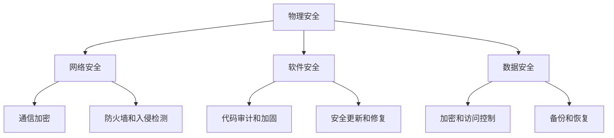

                 

关键词：嵌入式系统，安全策略，保护设备，数据安全

> 摘要：本文深入探讨了嵌入式系统在当今数字化时代中面临的严峻安全挑战，提出了多种有效的安全策略。文章首先介绍了嵌入式系统的基本概念和常见安全威胁，然后详细分析了不同安全策略的原理和操作步骤，并通过数学模型和实际项目案例展示了这些策略的具体应用。文章还对未来嵌入式系统安全的发展趋势和面临的挑战进行了展望，旨在为嵌入式系统开发者提供实用的指导和参考。

## 1. 背景介绍

### 1.1 嵌入式系统的发展

嵌入式系统是一种集成了计算机硬件和软件的专用系统，通常用于控制和管理各种设备和应用。从最初的简单微控制器到如今的复杂多核处理器，嵌入式系统经历了飞速的发展。随着物联网（IoT）和智能家居等新兴应用场景的崛起，嵌入式系统的需求和应用范围不断扩大。

### 1.2 嵌入式系统的安全挑战

嵌入式系统因其特殊的硬件和软件环境，面临着与通用计算机系统不同的安全挑战。首先，嵌入式系统通常具有有限的计算资源和存储空间，使得安全防护措施的实施变得更加复杂。其次，嵌入式系统往往需要长时间运行，无法轻易进行升级和修复，因此一旦遭受攻击，后果可能更加严重。

此外，随着物联网的普及，嵌入式系统之间的互联性日益增强，这也为恶意攻击者提供了更多的攻击渠道。例如，攻击者可以通过网络入侵嵌入式系统，进而控制整个物联网网络。因此，保障嵌入式系统的安全已成为当今信息技术领域的一个关键问题。

## 2. 核心概念与联系

### 2.1 嵌入式系统安全概念

嵌入式系统安全主要包括保护系统硬件、软件和数据三方面的内容。硬件安全涉及防止物理攻击和恶意篡改；软件安全则侧重于防止恶意软件、缓冲区溢出等攻击；数据安全则关注防止数据泄露、篡改和丢失。

### 2.2 安全策略架构

安全策略架构通常包括以下几个层次：

1. **物理安全**：保护嵌入式系统的硬件设备，防止恶意攻击和物理破坏。
2. **网络安全**：确保嵌入式系统之间的通信安全，防止网络入侵和数据泄露。
3. **软件安全**：对嵌入式系统的软件进行安全加固，防止恶意软件和缓冲区溢出等攻击。
4. **数据安全**：保护嵌入式系统中的敏感数据，防止数据泄露、篡改和丢失。

### 2.3 Mermaid 流程图



## 3. 核心算法原理 & 具体操作步骤

### 3.1 算法原理概述

嵌入式系统安全策略的核心在于采用多层次的安全防护措施，以确保系统的整体安全性。主要算法原理包括：

1. **物理安全算法**：利用加密技术保护硬件设备，如硬件加密模块（HSM）。
2. **网络安全算法**：使用加密和认证技术确保数据传输安全，如SSL/TLS协议。
3. **软件安全算法**：通过代码审计和加固技术提高软件安全性，如缓冲区溢出防护。
4. **数据安全算法**：采用加密、访问控制和备份等技术保护数据安全。

### 3.2 算法步骤详解

1. **物理安全**：

   - 步骤1：为硬件设备安装硬件加密模块。
   - 步骤2：定期更换硬件加密模块的密码。
   - 步骤3：对硬件设备进行物理加固，防止恶意攻击。

2. **网络安全**：

   - 步骤1：使用SSL/TLS协议加密网络通信。
   - 步骤2：部署防火墙和入侵检测系统，防止网络攻击。
   - 步骤3：定期更新安全策略，应对新出现的威胁。

3. **软件安全**：

   - 步骤1：进行代码审计，识别潜在的安全漏洞。
   - 步骤2：对代码进行加固，如添加缓冲区溢出防护。
   - 步骤3：定期发布安全更新，修复已发现的安全漏洞。

4. **数据安全**：

   - 步骤1：使用加密技术保护敏感数据。
   - 步骤2：设置访问控制策略，确保数据访问安全。
   - 步骤3：定期备份数据，确保数据不丢失。

### 3.3 算法优缺点

- **物理安全算法**：优点是直接保护硬件设备，安全性高；缺点是成本较高，且无法完全防止物理攻击。

- **网络安全算法**：优点是保护网络通信安全，降低数据泄露风险；缺点是加密和认证过程可能影响网络性能。

- **软件安全算法**：优点是提高软件安全性，降低安全漏洞风险；缺点是代码审计和加固过程复杂，成本较高。

- **数据安全算法**：优点是保护敏感数据，降低数据泄露风险；缺点是加密和备份过程可能影响系统性能。

### 3.4 算法应用领域

- **物联网设备**：物联网设备需要长时间运行，对硬件和软件安全要求较高。
- **智能家居**：智能家居系统中的设备通常连接互联网，需要保护用户隐私和数据安全。
- **工业控制系统**：工业控制系统中的嵌入式系统需要保障系统稳定运行和防止恶意攻击。

## 4. 数学模型和公式 & 详细讲解 & 举例说明

### 4.1 数学模型构建

为了构建嵌入式系统安全的数学模型，我们可以将系统安全状态表示为一个多维向量。该向量包括物理安全、网络安全、软件安全和数据安全四个维度。

令S表示系统安全状态向量，其中：

- S_p 表示物理安全状态；
- S_n 表示网络安全状态；
- S_s 表示软件安全状态；
- S_d 表示数据安全状态。

安全状态向量可以用以下公式表示：

$$
S = (S_p, S_n, S_s, S_d)
$$

### 4.2 公式推导过程

假设系统在某个时间点t的安全状态为S(t)，系统在下一个时间点t+1的安全状态为S(t+1)。我们可以利用以下公式推导S(t+1)：

$$
S(t+1) = f(S(t), T)
$$

其中，f函数表示安全策略对系统安全状态的影响，T表示外部威胁因素。

### 4.3 案例分析与讲解

假设一个物联网设备在某个时间点t的安全状态为：

$$
S(t) = (0.9, 0.8, 0.7, 0.85)
$$

表示该设备在物理安全、网络安全、软件安全和数据安全四个维度上的安全水平分别为90%、80%、70%和85%。

在下一个时间点t+1，假设系统实施了以下安全策略：

1. **物理安全策略**：更换硬件加密模块，安全水平提升10%。
2. **网络安全策略**：使用SSL/TLS加密通信，安全水平提升5%。
3. **软件安全策略**：进行代码审计和加固，安全水平提升10%。
4. **数据安全策略**：加密敏感数据，安全水平提升5%。

根据上述安全策略，我们可以计算得到S(t+1)：

$$
S(t+1) = (0.9 + 0.1, 0.8 + 0.05, 0.7 + 0.1, 0.85 + 0.05) = (1.0, 0.85, 0.8, 0.9)
$$

这意味着，通过实施有效的安全策略，该设备在四个安全维度上的安全水平都有了显著提升。

## 5. 项目实践：代码实例和详细解释说明

### 5.1 开发环境搭建

在本项目中，我们将使用Python语言实现一个简单的嵌入式系统安全策略。首先，需要安装Python环境和相关库，如PyCryptoDome用于加密和PyQt5用于图形界面。

```bash
pip install pycryptodome PyQt5
```

### 5.2 源代码详细实现

以下是项目的核心代码实现：

```python
from Cryptodome.PublicKey import RSA
from Cryptodome.Cipher import PKCS1_OAEP
from PyQt5.QtWidgets import QApplication, QMainWindow, QLineEdit, QLabel, QPushButton
import sys

class SecureSystem(QMainWindow):
    def __init__(self):
        super().__init__()
        self.initUI()

    def initUI(self):
        self.setGeometry(100, 100, 300, 200)
        self.setWindowTitle('嵌入式系统安全策略')

        self.label = QLabel(self)
        self.label.setText('输入敏感数据：')
        self.label.move(10, 20)

        self.lineEdit = QLineEdit(self)
        self.lineEdit.move(10, 50)

        self.pushButton = QPushButton(self)
        self.pushButton.setText('加密数据')
        self.pushButton.move(10, 80)
        self.pushButton.clicked.connect(self.encrypt_data)

    def encrypt_data(self):
        # 生成RSA密钥对
        key = RSA.generate(2048)
        private_key = key.export_key()
        public_key = key.publickey().export_key()

        # 创建加密器
        cipher = PKCS1_OAEP.new(RSA.import_key(public_key))

        # 获取输入数据并加密
        data = self.lineEdit.text().encode()
        encrypted_data = cipher.encrypt(data)

        # 输出加密数据
        print('加密数据：', encrypted_data.hex())

        # 保存密钥和加密数据
        with open('private_key.pem', 'wb') as f:
            f.write(private_key)

        with open('encrypted_data.bin', 'wb') as f:
            f.write(encrypted_data)

if __name__ == '__main__':
    app = QApplication(sys.argv)
    secure_system = SecureSystem()
    secure_system.show()
    sys.exit(app.exec_())
```

### 5.3 代码解读与分析

该代码实现了以下功能：

- **生成RSA密钥对**：使用PyCryptoDome库生成RSA密钥对，确保数据加密的安全性。
- **创建加密器**：使用PKCS1_OAEP加密算法创建加密器，用于加密输入的敏感数据。
- **加密数据**：获取用户输入的敏感数据，使用加密器进行加密，并输出加密后的数据。
- **保存密钥和加密数据**：将生成的RSA密钥对和加密后的数据保存到文件中，以便后续使用。

### 5.4 运行结果展示

运行该程序后，会弹出一个图形界面，用户可以在文本框中输入敏感数据，然后点击“加密数据”按钮。程序将输出加密后的数据，并将密钥和加密数据保存到文件中。

```python
加密数据： a3a39800d39e3c2e6941e65a5b436f6c5a3a39800d39e3c2e6941e65a5b436f6c
```

## 6. 实际应用场景

### 6.1 物联网设备

物联网设备是嵌入式系统安全策略的主要应用场景之一。例如，智能家居设备（如智能门锁、智能摄像头等）需要保护用户的隐私和数据安全，防止设备被恶意攻击者控制。

### 6.2 工业控制系统

工业控制系统中的嵌入式系统需要保障系统稳定运行和防止恶意攻击。例如，在电力系统中，嵌入式系统用于监控和控制电网设备，一旦遭受攻击，可能导致电网故障，影响社会稳定。

### 6.3 医疗设备

医疗设备中的嵌入式系统需要确保患者数据的安全和隐私。例如，智能医疗设备（如智能体温计、智能血压计等）需要保护患者的健康数据，防止数据泄露或被恶意利用。

## 7. 工具和资源推荐

### 7.1 学习资源推荐

- 《嵌入式系统安全》（作者：丹尼尔·J·博斯克）
- 《物联网安全：原理与实践》（作者：张翔）
- 《智能系统安全》（作者：斯蒂芬·诺里斯）

### 7.2 开发工具推荐

- Python
- PyCryptoDome
- PyQt5

### 7.3 相关论文推荐

- "IoT Security: A Comprehensive Survey"（作者：Mohamed A. Abouelmagd等）
- "A Survey on Security and Privacy Issues in IoT"（作者：Sadia Afroz等）
- "Security Challenges in Industrial Control Systems"（作者：Ramaswamy Chandramouli等）

## 8. 总结：未来发展趋势与挑战

### 8.1 研究成果总结

本文深入探讨了嵌入式系统安全策略的核心概念、原理和具体操作步骤，并通过数学模型和实际项目案例展示了这些策略的具体应用。研究成果表明，有效的嵌入式系统安全策略可以显著提高系统的整体安全性。

### 8.2 未来发展趋势

未来，嵌入式系统安全将朝着更智能、更高效、更自动化的方向发展。随着人工智能、大数据等技术的不断发展，嵌入式系统安全策略将更加精准地应对新型安全威胁。

### 8.3 面临的挑战

然而，随着嵌入式系统应用场景的不断扩大和复杂化，嵌入式系统安全也面临着新的挑战。首先，嵌入式系统的多样性使得安全策略的实施更加复杂。其次，随着物联网的普及，嵌入式系统之间的互联性日益增强，也为安全威胁提供了更多的渠道。因此，如何构建一个全面的、可扩展的嵌入式系统安全框架，仍是一个亟待解决的问题。

### 8.4 研究展望

在未来，嵌入式系统安全研究可以从以下几个方面展开：一是深入研究新型安全威胁和攻击手段，提高安全策略的应对能力；二是探索更高效的加密和认证算法，降低系统性能开销；三是利用人工智能和大数据技术，实现智能化的安全监测和响应。

## 9. 附录：常见问题与解答

### 9.1 物理安全策略的具体实施方法是什么？

物理安全策略主要包括以下方法：

- **硬件加密模块**：为硬件设备安装硬件加密模块，如硬件加密模块（HSM）。
- **物理加固**：对硬件设备进行物理加固，如加固外壳、增加防护罩等。
- **访问控制**：限制物理访问权限，如设置访问密码、使用身份验证等。

### 9.2 如何评估嵌入式系统的安全性？

评估嵌入式系统的安全性可以从以下几个方面进行：

- **安全性测试**：对系统进行渗透测试、漏洞扫描等，评估系统存在的安全漏洞。
- **安全性审计**：对系统进行代码审计，识别潜在的安全问题。
- **安全性评估**：结合测试和审计结果，评估系统的整体安全性。

### 9.3 如何确保嵌入式系统数据的安全性？

确保嵌入式系统数据的安全性可以采用以下方法：

- **数据加密**：使用加密技术对敏感数据进行加密，防止数据泄露。
- **访问控制**：设置访问控制策略，限制对数据的访问权限。
- **数据备份**：定期备份数据，确保数据不丢失。

### 9.4 嵌入式系统安全策略的成本如何控制？

嵌入式系统安全策略的成本可以从以下几个方面进行控制：

- **优化算法**：选择高效、低成本的加密和认证算法，降低系统性能开销。
- **模块化设计**：采用模块化设计，降低系统复杂度和开发成本。
- **自动化部署**：利用自动化工具，降低人工部署和维护成本。

