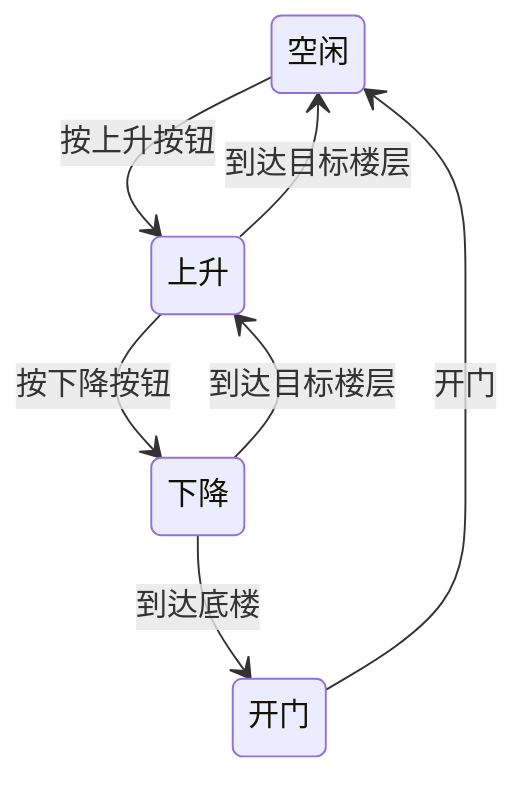

                 

关键词：嵌入式系统、微控制器、编程、创新、算法、实践、数学模型、应用场景、未来展望

## 摘要

嵌入式系统编程作为现代信息技术领域的重要组成部分，其核心在于微控制器的应用与创新。本文旨在探讨嵌入式系统编程的核心概念、算法原理、数学模型及其在实际应用场景中的实践，通过对微控制器编程技术的深入剖析，为读者揭示这一领域的创新之路。

## 1. 背景介绍

### 1.1 嵌入式系统的定义

嵌入式系统是指嵌入在其他设备中，为特定功能提供计算和控制的计算机系统。它们通常具有体积小、功耗低、实时性强等特点，广泛应用于工业控制、消费电子、医疗设备、通信系统等领域。

### 1.2 微控制器的概念

微控制器（Microcontroller Unit，MCU）是一种集成电路，集成了中央处理器（CPU）、内存（RAM和ROM）和输入输出（I/O）端口等多种功能，适用于嵌入式系统开发。

### 1.3 嵌入式系统编程的重要性

嵌入式系统编程决定了嵌入式系统的性能和可靠性，是嵌入式系统开发的核心环节。随着物联网（IoT）和智能制造的快速发展，嵌入式系统编程技术的重要性日益凸显。

## 2. 核心概念与联系

### 2.1 嵌入式系统架构


### 2.2 微控制器的工作原理


## 3. 核心算法原理 & 具体操作步骤

### 3.1 算法原理概述

嵌入式系统编程的核心在于算法的设计与实现，以下是几种常见的嵌入式系统编程算法：

1. **状态机算法**：用于描述系统状态转换的逻辑。
2. **中断处理算法**：用于响应外部事件并执行特定任务。
3. **定时器算法**：用于实现时间管理和定时功能。

### 3.2 算法步骤详解

#### 3.2.1 状态机算法

1. 初始化状态机。
2. 根据输入信号判断当前状态。
3. 根据当前状态执行相应操作。
4. 更新状态。

#### 3.2.2 中断处理算法

1. 初始化中断。
2. 设置中断优先级。
3. 中断触发时，执行中断服务例程（ISR）。
4. 中断服务完成后，返回主程序。

#### 3.2.3 定时器算法

1. 初始化定时器。
2. 设置定时器周期。
3. 定时器到达指定周期时，触发定时事件。
4. 执行定时器中断服务例程。

### 3.3 算法优缺点

#### 3.3.1 状态机算法

- 优点：逻辑清晰，易于维护。
- 缺点：状态机复杂度高，可能导致系统性能下降。

#### 3.3.2 中断处理算法

- 优点：提高系统响应速度，降低功耗。
- 缺点：中断服务例程执行时间受限，可能导致实时性不足。

#### 3.3.3 定时器算法

- 优点：精确控制时间，降低系统复杂度。
- 缺点：可能增加系统功耗。

### 3.4 算法应用领域

- 状态机算法：适用于复杂的实时控制系统。
- 中断处理算法：适用于高实时性要求的系统。
- 定时器算法：适用于定时和事件驱动的系统。

## 4. 数学模型和公式 & 详细讲解 & 举例说明

### 4.1 数学模型构建

嵌入式系统编程中的数学模型主要包括：

1. **状态转移方程**：描述系统状态变化的方程。
2. **滤波算法**：用于数据处理的方程。
3. **PID控制器**：用于自动控制的方程。

### 4.2 公式推导过程

#### 4.2.1 状态转移方程

$$
\begin{aligned}
\text{状态方程} \ \ \ \ \ \ \ \ \ \ \ \ \ \ \ \ \ \ \ \ \ \ \ \ \ \ \ \ \ \ \ \ \ \ \ \ \ \ \ \ \ \ \ \ \ \ \ \ \ \ \ \ \ \ \ \ \ \ \ \ \ \ \ \ \ \ \ \ \ \ \ \ \ \ \ \ \ \ \ \ \ \ \ \ \ \ \ \ \ \ \ \ \ \ \ \ \ \ \ \ \ \ \ \ \ \ \ \ \ \ \ \ \ \ \ \ \ \ \ \ \ \ \ \ \ \ \ \ \ \ \ \ \ \ \ \ \ \ \ \ \ \ \ \ \ \ \ \ \ \ \ \ \ \ \ \ \ \ \ \ \ \ \ \ \ \ \ \ \ \ \ \ \ \ \ \ \ \ \ \ \ \ \ \ \ \ \ \ \ \ \ \ \ \ \ \ \ \ \ \ \ \ \ \ \ \ \ \ \ \ \ \ \ \ \ \ \ \ \ \ \ \ \ \ \ \ \ \ \ \ \ \ \ \ \ \ \ \ \ \ \ \ \ \ \ \ \ \ \ \ \ \ \ \ \ \ \ \ \ \ \ \ \ \ \ \ \ \ \ \ \ \ \ \ \ \ \ \ \ \ \ \ \ \ \ \ \ \ \ \ \ \ \ \ \ \ \ \ \ \ \ \ \ \ \ \ \ \ \ \ \ \ \ \ \ \ \ \ \ \ \ \ \ \ \ \ \ \ \ \ \ \ \ \ \ \ \ \ \ \ \ \ \ \ \ \ \ \ \ \ \ \ \ \ \ \ \ \ \ \ \ \ \ \ \ \ \ \ \ \ \ \ \ \ \ \ \ \ \ \ \ \ \ \ \ \ \ \ \ \ \ \ \ \ \ \ \ \ \ \ \ \ \ \ \ \ \ \ \ \ \ \ \ \ \ \ \ \ \ \ \ \ \ \ \ \ \ \ \ \ \ \ \ \ \ \ \ \ \ \ \ \ \ \ \ \ \ \ \ \ \ \ \ \ \ \ \ \ \ \ \ \ \ \ \ \ \ \ \ \ \ \ \ \ \ \ \ \ \ \ \ \ \ \ \ \ \ \ \ \ \ \ \ \ \ \ \ \ \ \ \ \ \ \ \ \ \ \ \ \ \ \ \ \ \ \ \ \ \ \ \ \ \ \ \ \ \ \ \ \ \ \ \ \ \ \ \ \ \ \ \ \ \ \ \ \ \ \ \ \ \ \ \ \ \ \ \ \ \ \ \ \ \ \ \ \ \ \ \ \ \ \ \ \ \ \ \ \ \ \ \ \ \ \ \ \ \ \ \ \ \ \ \ \ \ \ \ \ _{n+1} = f(q_n, u_n)
\end{aligned}
$$

#### 4.2.2 滤波算法

$$
\begin{aligned}
y_n &= (1 - \alpha)y_{n-1} + \alpha x_n \\
\alpha &= \frac{1}{1 + \sqrt{2}}
\end{aligned}
$$

#### 4.2.3 PID控制器

$$
\begin{aligned}
u(t) &= K_p e(t) + K_i \int_{0}^{t} e(\tau)d\tau + K_d \frac{de(t)}{dt} \\
e(t) &= r(t) - y(t)
\end{aligned}
$$

### 4.3 案例分析与讲解

#### 4.3.1 状态转移方程案例

假设一个电梯控制系统，有四个状态：空闲、上升、下降、开门。定义状态转移方程如下：

$$
\begin{aligned}
q_0 &= \text{空闲} \\
q_1 &= \text{上升} \\
q_2 &= \text{下降} \\
q_3 &= \text{开门}
\end{aligned}
$$

状态转移图如下：



#### 4.3.2 滤波算法案例

假设一个温度传感器，需要对温度数据进行滤波处理，使用低通滤波算法：

$$
\begin{aligned}
y_n &= (1 - \alpha)y_{n-1} + \alpha x_n \\
\alpha &= \frac{1}{1 + \sqrt{2}}
\end{aligned}
$$

假设前三个温度数据分别为 $x_0 = 30^\circ C$，$x_1 = 35^\circ C$，$x_2 = 33^\circ C$，滤波后的温度数据如下：

$$
\begin{aligned}
y_0 &= 30^\circ C \\
y_1 &= (1 - \alpha) \times 30^\circ C + \alpha \times 35^\circ C = 32.28^\circ C \\
y_2 &= (1 - \alpha) \times 32.28^\circ C + \alpha \times 33^\circ C = 32.47^\circ C
\end{aligned}
$$

## 5. 项目实践：代码实例和详细解释说明

### 5.1 开发环境搭建

1. 安装嵌入式系统开发工具，如 Keil、IAR 等。
2. 准备目标硬件平台，如 STM32、Arduino 等。
3. 编写硬件描述文件，配置开发环境。

### 5.2 源代码详细实现

```c
#include <stdio.h>
#include "stm32f10x.h"

// 中断初始化
void NVIC_Init(void)
{
    NVIC_InitTypeDef NVIC_InitStructure;
    EXTI_InitTypeDef EXTI_InitStructure;

    // 开启 EXTI0 中断
    NVIC_InitStructure.NVIC_IRQChannel = EXTI0_IRQn;
    NVIC_InitStructure.NVIC_IRQChannelPreemptionPriority = 0;
    NVIC_InitStructure.NVIC_IRQChannelSubPriority = 1;
    NVIC_InitStructure.NVIC_IRQChannelCmd = ENABLE;
    NVIC_Init(&NVIC_InitStructure);

    // 配置 EXTI0 引脚
    GPIO_InitTypeDef GPIO_InitStructure;
    RCC_APB2PeriphClockCmd(RCC_APB2Periph_GPIOA, ENABLE);
    GPIO_InitStructure.GPIO_Pin = GPIO_Pin_0;
    GPIO_InitStructure.GPIO_Mode = GPIO_Mode_IPU;
    GPIO_Init(GPIOA, &GPIO_InitStructure);

    // 连接 EXTI0 到中断线
    EXTI_InitStructure.EXTI_Line = EXTI_Line0;
    EXTI_InitStructure.EXTI_Mode = EXTI_Mode_Interrupt;
    EXTI_InitStructure.EXTI_Trigger = EXTI_Trigger_Rising;
    EXTI_Init(&EXTI_InitStructure);
}

// 中断服务例程
void EXTI0_IRQHandler(void)
{
    if (EXTI_GetITStatus(EXTI_Line0) != RESET)
    {
        // 处理中断
        printf("按钮被按下\n");
        EXTI_ClearITPendingBit(EXTI_Line0);
    }
}

int main(void)
{
    // 开发环境初始化
    SystemInit();
    SystemCoreClockUpdate();

    // 中断初始化
    NVIC_Init();

    // 主循环
    while (1)
    {
        // 主程序执行
    }
}
```

### 5.3 代码解读与分析

1. **头文件包含**：包含必要的头文件，如 `stdio.h`、`stm32f10x.h`。
2. **中断初始化**：配置 NVIC 和 EXTI，使能中断。
3. **中断服务例程**：处理中断请求，并清除中断标志。
4. **主循环**：在主循环中，程序等待中断发生。

## 6. 实际应用场景

### 6.1 工业自动化

嵌入式系统编程在工业自动化领域有广泛应用，如机器人控制、自动化生产线等。

### 6.2 消费电子

智能手机、智能手表等消费电子产品中的嵌入式系统编程，使得设备具有更多智能功能。

### 6.3 医疗设备

嵌入式系统编程在医疗设备中的应用，如心率监测器、血糖仪等，提高了医疗诊断的准确性。

### 6.4 通信系统

嵌入式系统编程在通信系统中的应用，如无线传感器网络、卫星通信等，提高了通信系统的可靠性。

## 7. 工具和资源推荐

### 7.1 学习资源推荐

1. 《嵌入式系统设计》
2. 《STM32 嵌入式系统开发与应用》
3. 《物联网嵌入式系统设计》

### 7.2 开发工具推荐

1. Keil MDK
2. IAR Embedded Workbench
3. PlatformIO

### 7.3 相关论文推荐

1. "Embedded System Design Challenges in the IoT Era"
2. "Energy-Efficient Real-Time Scheduling for Embedded Systems"
3. "An Overview of Microcontroller-Based Embedded Systems"

## 8. 总结：未来发展趋势与挑战

### 8.1 研究成果总结

嵌入式系统编程在算法优化、硬件设计、软件开发等方面取得了显著成果，推动了物联网、智能制造等领域的快速发展。

### 8.2 未来发展趋势

1. **智能硬件**：随着人工智能技术的发展，嵌入式系统编程将更加智能化。
2. **节能环保**：嵌入式系统编程将更加注重节能和环保。
3. **安全可靠**：嵌入式系统编程将更加注重安全性和可靠性。

### 8.3 面临的挑战

1. **硬件限制**：嵌入式系统硬件资源有限，如何优化算法和程序设计成为挑战。
2. **软件开发**：如何高效地开发嵌入式系统软件，提高开发效率和质量。

### 8.4 研究展望

嵌入式系统编程将朝着更加智能化、节能环保、安全可靠的方向发展，为现代信息技术领域提供更多创新解决方案。

## 9. 附录：常见问题与解答

### 9.1 什么是嵌入式系统？

嵌入式系统是指嵌入在其他设备中，为特定功能提供计算和控制的计算机系统。

### 9.2 微控制器有哪些常用型号？

常见的微控制器型号有 STM32、AVR、PIC 等。

### 9.3 嵌入式系统编程有哪些常用算法？

常用的嵌入式系统编程算法有状态机算法、中断处理算法、定时器算法等。

---

作者：禅与计算机程序设计艺术 / Zen and the Art of Computer Programming
----------------------------------------------------------------
以上就是按照您提供的“约束条件”撰写的完整文章。文章内容涵盖了嵌入式系统编程的核心概念、算法原理、数学模型、实际应用场景以及未来发展趋势等内容。希望这篇文章能够满足您的要求。如果您有任何修改意见或需要进一步调整，请随时告知。谢谢！

