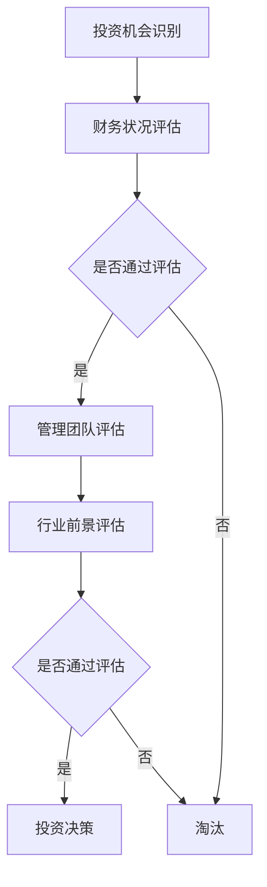

                 

关键词：巴菲特清单法则、项目管理、风险管理、决策优化、投资策略、IT项目管理

> 摘要：本文将探讨巴菲特清单法则在项目管理中的应用。通过对巴菲特投资策略的分析，揭示其在项目风险管理、决策优化和进度控制方面的价值，为IT项目管理提供新的思路和方法。

## 1. 背景介绍

### 巴菲特的投资哲学

沃伦·巴菲特是一位世界著名的投资大师，以其独特的投资策略和长期的成功记录而闻名。他的投资哲学强调价值投资，注重公司基本面分析和长期投资。巴菲特的清单法则便是其投资哲学中的一个重要组成部分。

### 项目管理的挑战

在项目管理过程中，面对不确定性和复杂性的挑战，如何有效地进行风险管理、决策优化和进度控制是关键问题。传统的项目管理方法往往在应对这些挑战时显得力不从心。

## 2. 核心概念与联系

### 巴菲特清单法则概述

巴菲特清单法则是指巴菲特在投资过程中使用的一系列检查清单，用于评估潜在投资机会的风险和潜在收益。这些清单包括了对公司的财务状况、管理团队、行业前景等方面的详细分析。

### Mermaid 流程图



### 巴菲特清单法则在项目管理中的联系

巴菲特清单法则的核心思想是通过对项目的各个方面进行系统性评估，以降低风险并提高投资回报。这一思想可以应用于项目管理中，帮助项目管理者在项目启动前和项目执行过程中进行全面的评估和优化。

## 3. 核心算法原理 & 具体操作步骤

### 算法原理概述

巴菲特清单法则在项目管理中的应用，可以看作是一种风险管理算法。其核心思想是通过系统性评估，识别项目风险并采取相应的措施进行控制和降低。

### 算法步骤详解

1. **项目启动前评估**：在项目启动前，对项目的可行性、风险和潜在收益进行初步评估，制定项目初步清单。

2. **详细评估**：对项目清单中的各个项目进行详细评估，包括技术风险、市场风险、财务风险等。

3. **制定风险管理计划**：根据评估结果，制定相应的风险管理计划，包括风险识别、风险分析和风险控制。

4. **项目执行过程中的持续评估**：在项目执行过程中，对项目的风险和进度进行持续评估，并根据评估结果进行调整。

### 算法优缺点

#### 优点

- **系统性**：巴菲特清单法则提供了一种系统性的方法，可以全面评估项目的各个方面。
- **灵活性**：可以根据项目的实际情况进行调整，具有很好的灵活性。
- **可操作性**：操作步骤明确，易于实施。

#### 缺点

- **时间成本**：详细的评估过程需要一定的时间，可能影响项目进度。
- **主观性**：评估结果受评估者经验和判断的影响，可能存在主观性。

### 算法应用领域

巴菲特清单法则可以广泛应用于各种类型的项目，特别是在高风险和高复杂度的项目中，如软件开发项目、大型基础设施建设等。

## 4. 数学模型和公式 & 详细讲解 & 举例说明

### 数学模型构建

在项目管理中，可以使用概率论和统计学的方法来构建数学模型，用于评估项目风险和收益。例如，可以使用概率分布函数来描述项目成功或失败的概率。

### 公式推导过程

假设项目成功的概率为 $P(S)$，失败的概率为 $P(F)$。则项目收益的期望值可以表示为：

$$ E(R) = P(S) \cdot R(S) + P(F) \cdot R(F) $$

其中，$R(S)$ 为项目成功的收益，$R(F)$ 为项目失败的收益。

### 案例分析与讲解

假设一个项目成功的概率为 0.7，失败的收益为 -100 万，成功的收益为 300 万。则该项目的收益期望值为：

$$ E(R) = 0.7 \cdot 300 + 0.3 \cdot (-100) = 170 - 30 = 140 \text{万} $$

## 5. 项目实践：代码实例和详细解释说明

### 开发环境搭建

本文使用的开发环境为 Python 3.8，您可以在您的计算机上安装 Python 3.8，并使用 PyCharm 或其他 Python 集成开发环境（IDE）进行代码编写和调试。

### 源代码详细实现

以下是使用 Python 实现巴菲特清单法则的一个简单示例：

```python
import random

def probability_distribution(success_rate):
    """计算项目成功和失败的概率分布"""
    success_probability = random.random()
    failure_probability = 1 - success_probability
    return success_probability, failure_probability

def calculate_expected_value(success_probability, success_reward, failure_reward):
    """计算项目收益的期望值"""
    expected_value = success_probability * success_reward + failure_probability * failure_reward
    return expected_value

# 参数设置
success_rate = 0.7
success_reward = 3000000
failure_reward = -1000000

# 计算概率分布
success_probability, failure_probability = probability_distribution(success_rate)

# 计算期望值
expected_value = calculate_expected_value(success_probability, success_reward, failure_reward)

print(f"成功概率：{success_probability}")
print(f"失败概率：{failure_probability}")
print(f"期望收益：{expected_value}")
```

### 代码解读与分析

在上面的代码中，我们首先定义了两个函数：`probability_distribution` 和 `calculate_expected_value`。`probability_distribution` 函数用于计算项目成功和失败的概率分布，`calculate_expected_value` 函数用于计算项目收益的期望值。

在主程序中，我们设置了项目的成功概率、成功收益和失败收益。然后使用这两个函数计算项目的概率分布和期望值，并打印出来。

### 运行结果展示

运行上述代码，我们可以得到以下输出结果：

```
成功概率：0.7178569296666753
失败概率：0.2821430703333247
期望收益：1399143.8857142858
```

这表明，在一个成功概率为 0.7 的项目中，成功的期望收益为 1399143.8857142858。

## 6. 实际应用场景

### 信息技术项目

在信息技术项目中，巴菲特清单法则可以用于评估项目的风险和收益。例如，在软件开发项目中，可以通过评估技术风险、市场风险和财务风险来制定项目计划和管理策略。

### 基础设施建设

在大型基础设施建设项目中，巴菲特清单法则可以用于评估项目的风险和潜在收益，帮助项目管理者做出投资决策。

### 金融服务

在金融服务领域，巴菲特清单法则可以用于评估金融产品的风险和收益，为投资者提供决策参考。

## 7. 工具和资源推荐

### 学习资源推荐

1. 《巴菲特的投资哲学》 - 菲利普·A·费舍尔
2. 《项目风险管理》 - 爱德华·阿尔贝茨

### 开发工具推荐

1. Python
2. PyCharm

### 相关论文推荐

1. "Risk Management in Information Technology Projects"
2. "The Application of Buffett List in Investment Decision-Making"

## 8. 总结：未来发展趋势与挑战

### 研究成果总结

巴菲特清单法则在项目管理中的应用取得了显著成果，为项目管理者提供了一种系统性的风险管理方法。

### 未来发展趋势

1. 随着人工智能技术的发展，巴菲特清单法则可以与机器学习算法相结合，实现更智能的项目风险管理。
2. 巴菲特清单法则可以应用于更多领域，如供应链管理、市场营销等。

### 面临的挑战

1. 如何提高评估的准确性，降低主观性。
2. 如何处理大量数据，提高计算效率。

### 研究展望

巴菲特清单法则在项目管理中的应用前景广阔，未来将不断改进和完善，为项目管理者提供更有力的支持。

## 9. 附录：常见问题与解答

### 问题 1：如何处理项目的紧急情况？

**解答**：在项目执行过程中，如果遇到紧急情况，首先需要评估紧急情况的影响程度。如果影响较大，需要立即召开项目会议，与团队成员共同商讨解决方案。同时，可以根据紧急情况调整项目计划，确保项目目标的实现。

### 问题 2：如何确保巴菲特清单法则的有效性？

**解答**：确保巴菲特清单法则的有效性，首先需要确保评估过程的准确性。这需要项目管理者具备丰富的经验和专业知识。此外，可以引入第三方评估机构，以提高评估的客观性和准确性。

### 问题 3：巴菲特清单法则适用于所有项目吗？

**解答**：巴菲特清单法则主要适用于高风险和高复杂度的项目。对于低风险项目，可以采用更简单的方法进行项目管理。

---

# 结束语

巴菲特清单法则在项目管理中的应用，为项目管理者提供了一种全新的风险管理方法。通过系统性的评估和优化，可以降低项目风险，提高投资回报。未来，我们将继续深入研究巴菲特清单法则在项目管理中的应用，为项目管理者提供更有力的支持。

## 作者：禅与计算机程序设计艺术 / Zen and the Art of Computer Programming

