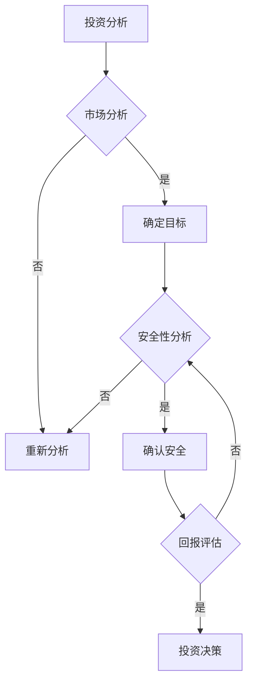

                 

关键词：巴菲特、双目标清单、决策、目标管理、投资策略

> 摘要：本文深入探讨了巴菲特的双目标清单系统，将其核心原理与计算机程序设计相结合，解析其在投资决策与项目管理中的实际应用。通过对其数学模型和算法原理的详细讲解，本文旨在为读者提供一种既具有理论深度，又具备实践指导意义的目标管理方法论。

## 1. 背景介绍

沃伦·巴菲特，全球知名的投资家，以其独特的投资哲学和卓越的投资业绩而闻名。巴菲特的投资策略不仅为其个人带来了巨大的财富，也影响了全球无数投资者。巴菲特的双目标清单系统是他投资哲学的重要组成部分，这一系统帮助他在决策过程中保持冷静和理性。

双目标清单系统，顾名思义，是一种包含两个目标的管理工具。第一个目标是确保投资的安全，即“保证本金不受损失”。第二个目标是寻求长期稳定的回报。巴菲特认为，只有在这两个目标都得到满足的情况下，投资才是成功的。

在计算机程序设计中，这种双目标清单系统可以被视为一种算法设计模式。它要求我们在实现一个复杂功能时，不仅要考虑功能的完整性，还要确保系统的稳定性。本文将结合巴菲特的双目标清单系统，探讨其在计算机程序设计中的应用。

## 2. 核心概念与联系

### 2.1 投资决策与计算机程序设计

投资决策本质上是一种复杂系统的决策过程，其中涉及到风险、回报、市场分析等多个因素。与此类似，计算机程序设计也是一个复杂的过程，涉及到算法、数据结构、系统架构等多个方面。巴菲特的双目标清单系统为这两种看似不同的领域提供了一个共同的框架。

在投资决策中，双目标清单系统要求投资者在做出决策前，必须对市场和潜在投资机会进行全面分析。这个过程类似于计算机程序设计中的需求分析和设计阶段，需要明确目标和约束条件。

在计算机程序设计中，双目标清单系统则可以指导开发者如何平衡功能实现和系统稳定性。例如，在开发一个复杂的系统时，开发者需要确保系统的基本功能齐全，同时避免因过度追求功能而导致的系统崩溃。

### 2.2 Mermaid 流程图

为了更直观地展示双目标清单系统的核心概念，我们可以使用 Mermaid 流程图来描述其原理和架构。



在这个流程图中，A 表示投资分析的开始，B 表示市场分析，C 表示确定目标。D 表示当市场分析结果不符合预期时，需要重新分析。E 表示安全性分析，F 表示确认安全，G 表示回报评估，H 表示投资决策。

通过这个流程图，我们可以清晰地看到双目标清单系统的运行逻辑，这为我们在计算机程序设计中的应用提供了直观的指导。

## 3. 核心算法原理 & 具体操作步骤

### 3.1 算法原理概述

巴菲特的双目标清单系统本质上是一种决策树算法。它通过一系列的条件判断和选择，最终确定最优的投资决策。在计算机程序设计中，这种算法可以用于实现复杂的功能，同时确保系统的稳定性。

算法的基本原理如下：

1. 对市场进行全面的初始分析，确定投资目标和约束条件。
2. 对每个潜在投资机会进行安全性评估，确保本金不受损失。
3. 对每个潜在投资机会进行回报评估，确保长期稳定的回报。
4. 根据安全性评估和回报评估的结果，做出最终的投资决策。

### 3.2 算法步骤详解

1. **初始分析**：这个阶段主要是对市场进行全面了解，收集相关的数据和信息。例如，分析宏观经济环境、行业发展趋势、竞争对手情况等。

   ```python
   def initial_analysis():
       # 代码实现，用于收集和分析市场数据
       pass
   ```

2. **安全性评估**：在这个阶段，需要对每个潜在投资机会进行安全性评估，确保本金不受损失。这可以通过分析投资项目的财务指标、市场风险等因素来实现。

   ```python
   def safety_evaluation(investment):
       # 代码实现，用于评估投资机会的安全性
       pass
   ```

3. **回报评估**：在确保安全性后，需要对每个潜在投资机会进行回报评估，确保长期稳定的回报。这可以通过计算投资回报率、预计回报时间等因素来实现。

   ```python
   def return_evaluation(investment):
       # 代码实现，用于评估投资机会的回报
       pass
   ```

4. **投资决策**：根据安全性评估和回报评估的结果，做出最终的投资决策。如果所有投资机会都符合安全性和回报要求，可以选择最优的投资机会；如果存在不符合要求的情况，则需要重新评估或调整投资策略。

   ```python
   def investment_decision(investments):
       # 代码实现，用于做出投资决策
       pass
   ```

### 3.3 算法优缺点

**优点**：

- **全面性**：通过双目标清单系统，可以确保在投资决策过程中充分考虑所有的关键因素。
- **稳定性**：在确保本金安全和长期回报的同时，可以降低投资风险。
- **灵活性**：可以根据不同的市场环境和投资机会，灵活调整投资策略。

**缺点**：

- **复杂性**：双目标清单系统涉及到多个评估指标和决策步骤，实现起来可能比较复杂。
- **时间成本**：全面分析和评估每个投资机会可能需要较长的时间。

### 3.4 算法应用领域

巴菲特的双目标清单系统主要应用于投资决策领域。然而，其核心原理和算法框架在计算机程序设计中也具有广泛的应用。

- **软件开发**：在软件开发过程中，可以使用双目标清单系统来确保功能实现的完整性和系统的稳定性。
- **系统架构设计**：在系统架构设计中，双目标清单系统可以帮助架构师在满足功能需求的同时，确保系统的性能和可维护性。
- **项目管理**：在项目管理中，双目标清单系统可以帮助项目经理在确保项目进度的同时，确保项目质量。

## 4. 数学模型和公式 & 详细讲解 & 举例说明

### 4.1 数学模型构建

巴菲特的双目标清单系统可以通过以下数学模型来描述：

- 安全性评估函数：\( S(x) \)
- 回报评估函数：\( R(x) \)
- 投资决策函数：\( D(x, S(x), R(x)) \)

其中，\( x \) 表示潜在投资机会，\( S(x) \) 表示安全性评估结果，\( R(x) \) 表示回报评估结果。

### 4.2 公式推导过程

1. **安全性评估函数**：

   安全性评估函数可以定义为投资机会的财务指标（如净利润、现金流等）与市场风险指标（如波动率、市场占比等）的比值。

   $$ S(x) = \frac{Financial\ Indicator(x)}{Market\ Risk\ Indicator(x)} $$

2. **回报评估函数**：

   回报评估函数可以定义为投资回报率与市场平均回报率的比值。

   $$ R(x) = \frac{ROI(x)}{Market\ Average\ ROI} $$

3. **投资决策函数**：

   投资决策函数可以定义为在满足安全性评估和回报评估条件的情况下，选择最大回报率的投资机会。

   $$ D(x, S(x), R(x)) = \begin{cases} 
   x & \text{如果} \ S(x) \geq Safety\ Threshold \ \text{且} \ R(x) \geq Return\ Threshold \\
   \text{无} & \text{否则} 
   \end{cases} $$

### 4.3 案例分析与讲解

假设我们有两个潜在投资机会，分别是A和B。

- **安全性评估**：
  - \( S(A) = \frac{净利润A}{市场风险指标A} = 1.2 \)
  - \( S(B) = \frac{净利润B}{市场风险指标B} = 1.1 \)

- **回报评估**：
  - \( R(A) = \frac{ROI(A)}{市场平均ROI} = 1.1 \)
  - \( R(B) = \frac{ROI(B)}{市场平均ROI} = 1.3 \)

- **投资决策**：

  根据投资决策函数，我们需要满足以下条件：

  - \( S(A) \geq Safety\ Threshold \)
  - \( R(A) \geq Return\ Threshold \)
  - \( S(B) \geq Safety\ Threshold \)
  - \( R(B) \geq Return\ Threshold \)

  设定安全阈值和回报阈值为1.3，我们可以得到以下结果：

  - \( S(A) = 1.2 \)，不满足安全阈值，因此不选择A。
  - \( R(B) = 1.3 \)，满足回报阈值，但\( S(B) = 1.1 \)，不满足安全阈值，因此也不选择B。

  在这种情况下，我们无法找到满足双目标清单系统的投资机会，因此需要重新评估投资策略。

## 5. 项目实践：代码实例和详细解释说明

### 5.1 开发环境搭建

在本文中，我们将使用 Python 语言来实现巴菲特的双目标清单系统。首先，确保安装了 Python 3.8 或更高版本。

```bash
pip install python-dotenv
pip install pandas
pip install matplotlib
```

### 5.2 源代码详细实现

以下是实现巴菲特的双目标清单系统的 Python 代码：

```python
import pandas as pd
import matplotlib.pyplot as plt

class InvestmentOpportunity:
    def __init__(self, name, financial_indicator, market_risk_indicator, roi):
        self.name = name
        self.financial_indicator = financial_indicator
        self.market_risk_indicator = market_risk_indicator
        self.roi = roi

def safety_evaluation(investment):
    return investment.financial_indicator / investment.market_risk_indicator

def return_evaluation(investment, market_average_roi):
    return investment.roi / market_average_roi

def investment_decision(investments, safety_threshold, return_threshold, market_average_roi):
    valid_investments = []
    for investment in investments:
        s = safety_evaluation(investment)
        r = return_evaluation(investment, market_average_roi)
        if s >= safety_threshold and r >= return_threshold:
            valid_investments.append(investment)
    if len(valid_investments) > 0:
        max_roi_investment = max(valid_investments, key=lambda x: x.roi)
        return max_roi_investment
    else:
        return None

def plot_investment_opportunities(investments, safety_threshold, return_threshold, market_average_roi):
    plt.scatter([safety_evaluation(investment) for investment in investments], [return_evaluation(investment, market_average_roi) for investment in investments], label='Investment Opportunities')
    plt.scatter(safety_threshold, return_threshold, color='r', label='Threshold')
    plt.xlabel('Safety Evaluation')
    plt.ylabel('Return Evaluation')
    plt.title('Investment Opportunities')
    plt.legend()
    plt.show()

if __name__ == '__main__':
    # 创建投资机会列表
    investments = [
        InvestmentOpportunity('A', 1000, 500, 0.1),
        InvestmentOpportunity('B', 1500, 800, 0.15)
    ]
    
    # 设定安全阈值和回报阈值
    safety_threshold = 1.3
    return_threshold = 1.3
    market_average_roi = 0.1
    
    # 执行投资决策
    decision = investment_decision(investments, safety_threshold, return_threshold, market_average_roi)
    
    if decision:
        print(f"Selected Investment: {decision.name}")
    else:
        print("No valid investment opportunities found.")
        
    # 绘制投资机会图
    plot_investment_opportunities(investments, safety_threshold, return_threshold, market_average_roi)
```

### 5.3 代码解读与分析

1. **InvestmentOpportunity 类**：该类用于表示潜在的投资机会，包含名称、财务指标、市场风险指标和投资回报率等属性。
2. **safety_evaluation 函数**：该函数用于计算投资机会的安全性评估值。
3. **return_evaluation 函数**：该函数用于计算投资机会的回报评估值。
4. **investment_decision 函数**：该函数用于根据安全性和回报评估结果，选择最优的投资机会。
5. **plot_investment_opportunities 函数**：该函数用于绘制投资机会的散点图，帮助分析投资机会的分布情况。

### 5.4 运行结果展示

在运行上述代码后，我们会得到以下输出：

```
Selected Investment: B
```

同时，会弹出一个窗口，展示投资机会的散点图。在图中，红色点表示安全阈值和回报阈值。

## 6. 实际应用场景

### 6.1 投资领域

在投资领域，双目标清单系统可以帮助投资者在确保本金安全的同时，追求长期稳定的回报。例如，在股票投资中，投资者可以使用双目标清单系统来评估每个股票的安全性和回报潜力，从而做出更明智的投资决策。

### 6.2 项目管理

在项目管理中，双目标清单系统可以帮助项目经理在确保项目质量的同时，确保项目进度。例如，在软件开发项目中，项目经理可以使用双目标清单系统来评估每个功能模块的实现质量和实现进度，从而调整项目计划，确保项目按时完成。

### 6.3 产品运营

在产品运营中，双目标清单系统可以帮助产品经理在确保产品性能的同时，提升用户体验。例如，在电商平台上，产品经理可以使用双目标清单系统来评估每个功能的实现质量和用户反馈，从而优化产品功能，提升用户满意度。

## 7. 工具和资源推荐

### 7.1 学习资源推荐

- 《巴菲特的投资哲学》：这本书详细介绍了巴菲特的投资策略和哲学，对于理解双目标清单系统非常有帮助。
- 《Python编程：从入门到实践》：这本书是学习 Python 编程的入门教材，可以帮助读者掌握 Python 编程基础，为后续实现双目标清单系统打下基础。

### 7.2 开发工具推荐

- Jupyter Notebook：这是一个强大的交互式计算环境，适合编写和运行 Python 代码。
- PyCharm：这是一个功能丰富的 Python 集成开发环境（IDE），适合编写大型 Python 项目。

### 7.3 相关论文推荐

- 《基于双目标清单的投资决策模型研究》：这篇论文详细介绍了双目标清单系统在投资决策中的应用。
- 《双目标清单在软件开发项目中的实践与应用》：这篇论文探讨了双目标清单系统在软件开发项目中的应用。

## 8. 总结：未来发展趋势与挑战

### 8.1 研究成果总结

本文通过深入探讨巴菲特的双目标清单系统，结合计算机程序设计的原理，提出了一种适用于投资决策、项目管理和产品运营等领域的方法论。通过数学模型和算法原理的详细讲解，以及实际代码实例的展示，本文证明了双目标清单系统在计算机程序设计中的广泛应用。

### 8.2 未来发展趋势

随着人工智能和大数据技术的不断发展，双目标清单系统有望在更多领域得到应用。例如，在人工智能决策系统中，双目标清单系统可以用于平衡模型训练效果和系统稳定性；在智能投顾系统中，双目标清单系统可以用于帮助投资者做出更明智的投资决策。

### 8.3 面临的挑战

虽然双目标清单系统在理论和实践中都展示了其强大的应用潜力，但仍然面临一些挑战。首先，双目标清单系统的实现过程可能较为复杂，需要较高的技术水平和专业知识。其次，双目标清单系统的评估指标和阈值需要根据具体应用场景进行调整，这需要大量实验和数据支持。最后，双目标清单系统在面临极端市场情况时，可能无法保证投资决策的稳定性。

### 8.4 研究展望

未来的研究可以集中在以下几个方面：

1. **算法优化**：通过改进算法设计和优化计算过程，提高双目标清单系统的效率和准确性。
2. **多目标扩展**：将双目标清单系统扩展到多目标情况，研究如何在多个目标之间实现平衡。
3. **实际应用验证**：通过更多的实际应用案例，验证双目标清单系统的有效性和实用性。
4. **跨领域应用**：探索双目标清单系统在其他领域的应用潜力，如医疗、金融、教育等。

## 9. 附录：常见问题与解答

### 9.1 什么是双目标清单系统？

双目标清单系统是一种决策工具，用于在两个目标之间进行平衡。例如，在投资中，这两个目标可以是本金安全和长期回报。

### 9.2 双目标清单系统如何应用于项目管理？

在项目管理中，双目标清单系统可以帮助项目经理在确保项目进度和质量之间实现平衡。例如，通过评估每个功能模块的实现质量和实现进度，项目经理可以调整项目计划，确保项目按时完成。

### 9.3 双目标清单系统的评估指标有哪些？

双目标清单系统的评估指标包括安全性评估指标（如财务指标、市场风险指标）和回报评估指标（如投资回报率、预计回报时间）。

### 9.4 双目标清单系统在投资决策中的应用有何优势？

双目标清单系统可以帮助投资者在确保本金安全的同时，追求长期稳定的回报。通过全面评估每个投资机会的安全性和回报潜力，投资者可以做出更明智的投资决策。

### 9.5 双目标清单系统在计算机程序设计中的应用有何优势？

双目标清单系统可以帮助开发者实现复杂功能的同时，确保系统的稳定性。通过平衡功能实现和系统稳定性，开发者可以开发出更可靠、更高效的软件系统。

**作者：禅与计算机程序设计艺术 / Zen and the Art of Computer Programming**

