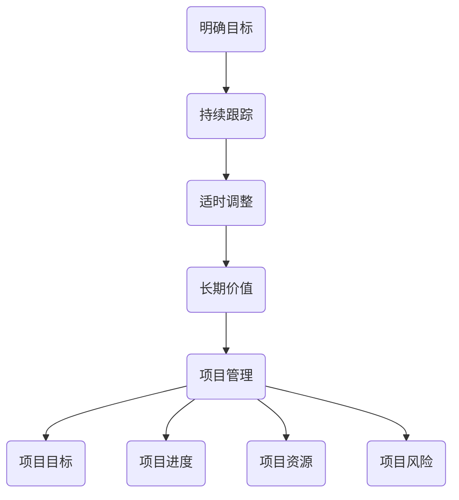
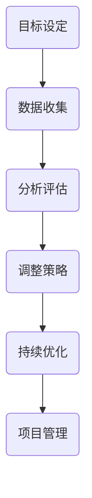

                 

### 1. 背景介绍

项目管理是现代企业中至关重要的活动，它涉及规划、执行、监控和收尾项目各个阶段。高效的项目管理不仅能够确保项目按时完成，还能在预算和资源有限的情况下实现项目的目标。为了提升项目管理的效率和效果，各种管理理论和工具被提出并应用，其中就包括巴菲特的目标管理法则。

沃伦·巴菲特，全球著名投资家，以其独特的投资哲学和长期成功的投资记录而闻名。巴菲特的目标管理法则来源于他的投资理念，强调明确目标、持续跟踪和定期调整，以实现长期价值最大化。这一法则不仅适用于投资领域，也可用于项目管理，为项目经理提供了一套系统的目标管理方法论。

在项目管理中，明确的目标是项目成功的基石。巴菲特的目标管理法则通过设定清晰的目标、追踪项目进展和适时调整策略，帮助项目经理更好地管理项目风险，确保项目按时、按质量完成。本文将深入探讨巴菲特目标管理法则在项目管理中的应用，分析其核心原理和实践方法，并提供具体的案例和工具支持。

通过本文的阅读，读者将了解到如何在项目管理中运用巴菲特的目标管理法则，提高项目的成功率，实现组织的长期战略目标。

## 2. 核心概念与联系

### 2.1. 巴菲特目标管理法则

巴菲特的目标管理法则主要包括以下几个核心概念：

1. **明确目标**：巴菲特认为，首先要设定一个明确、具体的目标。这个目标应该既有挑战性，又是可实现的。明确目标有助于集中精力，减少决策时间和成本。
2. **持续跟踪**：巴菲特强调定期跟踪目标的实现情况，以便及时发现问题并进行调整。这需要建立一套完善的跟踪机制，包括数据收集、分析和报告。
3. **适时调整**：在跟踪过程中，根据实际情况对目标进行调整。这种调整是基于对市场、竞争、资源等因素的深入分析，确保目标始终与实际情况相符。
4. **长期价值**：巴菲特的目标管理法不仅仅关注短期利益，更注重长期价值的实现。通过持续优化和调整，确保目标能够为长期成功奠定基础。

### 2.2. 项目管理的基本概念

项目管理涉及多个关键概念，如项目目标、项目范围、项目进度、项目资源、项目风险等。以下是对这些概念的基本解释：

1. **项目目标**：项目目标是指项目最终要实现的结果。明确、具体的目标是项目成功的关键。
2. **项目范围**：项目范围定义了项目的边界，包括项目需要完成的任务、可交付成果和项目的限制条件。
3. **项目进度**：项目进度是指项目从开始到完成的时间安排。合理的进度安排有助于确保项目按时完成。
4. **项目资源**：项目资源包括人力、财力、物力等，是项目完成的基础。
5. **项目风险**：项目风险是指在项目执行过程中可能遇到的问题和挑战。有效的风险管理是项目成功的重要保障。

### 2.3. 巴菲特目标管理法则与项目管理的联系

巴菲特的目标管理法则与项目管理有很强的关联性。以下是两者之间的主要联系：

1. **明确目标**：巴菲特的目标管理法则强调设定明确的目标，这与项目管理的项目目标概念一致。明确的目标有助于项目团队集中精力，避免偏离项目方向。
2. **持续跟踪**：巴菲特的目标管理法则要求持续跟踪目标的实现情况，这在项目管理中表现为项目进度的监控和风险管理。通过定期跟踪，项目经理可以及时发现并解决项目中的问题。
3. **适时调整**：巴菲特的目标管理法则提倡根据实际情况适时调整目标，这与项目管理的变更管理有类似之处。在项目管理中，变更管理确保项目能够适应外部环境的变化，保持项目目标的实现。
4. **长期价值**：巴菲特的目标管理法则注重长期价值的实现，这与项目管理的战略目标紧密相关。通过长期视角，项目经理可以更好地规划项目，确保项目与组织的长期发展目标一致。

### 2.4. Mermaid 流程图

为了更好地展示巴菲特目标管理法则与项目管理的联系，我们使用 Mermaid 工具绘制了一个流程图，如下所示：



### 2.5. 核心算法原理

巴菲特的目标管理法则可以被视为一种算法，其核心原理包括：

1. **目标设定**：通过设定明确、具体的目标，将项目目标转化为可操作的任务。
2. **数据收集**：定期收集与目标相关的数据，如项目进度、资源使用和风险状况。
3. **分析评估**：对收集到的数据进行分析，评估目标的实现情况，并识别潜在的问题。
4. **调整策略**：根据分析结果，对目标和策略进行调整，确保项目能够按计划进行。
5. **持续优化**：通过不断的调整和优化，提高项目成功的概率，实现长期价值。

这一算法的步骤可以表示为以下 Mermaid 流程图：



通过上述核心概念和算法原理的介绍，读者可以更好地理解巴菲特目标管理法则在项目管理中的应用。接下来，我们将深入探讨巴菲特目标管理法则的具体应用和实践步骤。

### 3. 核心算法原理 & 具体操作步骤

#### 3.1 算法原理概述

巴菲特的目标管理法则在项目管理中的应用，主要基于以下几个核心原理：

1. **目标明确化**：首先，项目经理需要明确项目的目标。这个目标应该具体、可量化，并且与组织的战略目标相一致。
2. **数据驱动决策**：项目经理需要通过数据来驱动决策。这包括定期收集与项目目标相关的数据，如项目进度、成本、质量等。
3. **动态调整**：在项目执行过程中，由于各种不可预见因素的影响，项目经理需要根据实际情况对目标进行调整。
4. **长期价值导向**：巴菲特的目标管理法则强调长期价值，项目经理在制定目标和策略时，应着眼于项目的长期收益和影响。

#### 3.2 算法步骤详解

1. **设定明确的目标**
   - 项目启动时，项目经理需要与项目团队和利益相关者一起明确项目的目标。
   - 目标应具体、可量化，最好使用KPI（关键绩效指标）来衡量。
   - 目标应与组织的战略目标相一致，确保项目的价值最大化。

2. **制定详细的计划**
   - 根据明确的目标，项目经理需要制定详细的计划，包括项目范围、进度、资源和风险等。
   - 计划应具体到每个任务，明确责任人、开始时间和结束时间。

3. **数据收集与监控**
   - 在项目执行过程中，项目经理需要定期收集与项目目标相关的数据。
   - 数据来源可以包括项目进度报告、成本分析报告、质量检查报告等。
   - 数据收集应制度化，确保数据的准确性和及时性。

4. **分析评估**
   - 项目经理需要对收集到的数据进行分析，评估项目的进展情况。
   - 分析应关注关键指标，如项目进度、成本超支、质量隐患等。
   - 分析结果应形成报告，供项目团队和利益相关者参考。

5. **调整策略**
   - 根据分析评估的结果，项目经理需要对目标和策略进行调整。
   - 调整应基于实际需求，确保项目能够按计划进行。
   - 调整应得到项目团队和利益相关者的共识。

6. **持续优化**
   - 项目经理需要通过不断的调整和优化，提高项目的成功率。
   - 优化应包括项目管理流程的改进、团队协作的加强等。
   - 优化应有助于实现项目的长期价值。

#### 3.3 算法优缺点

**优点**：

- **明确的目标**：巴菲特的目标管理法则强调明确的目标，有助于项目团队集中精力，避免资源浪费。
- **数据驱动决策**：通过数据收集和分析，项目经理可以更准确地了解项目进展，减少决策的盲目性。
- **动态调整**：巴菲特的目标管理法则允许项目经理根据实际情况进行调整，提高项目的灵活性。
- **长期价值导向**：该法则注重长期价值，有助于确保项目的长期成功。

**缺点**：

- **实施成本**：巴菲特的目标管理法则需要投入大量的时间和资源来收集和分析数据，这可能会增加项目的成本。
- **执行难度**：对项目经理的要求较高，需要具备较强的数据分析能力和决策能力。
- **适应性**：在某些情况下，巴菲特的目标管理法则可能无法适应快速变化的外部环境。

#### 3.4 算法应用领域

巴菲特的目标管理法则在项目管理中具有广泛的应用领域，主要包括：

- **软件开发项目**：通过明确的目标和数据驱动决策，有助于确保软件项目的质量和进度。
- **基础设施建设**：在基础设施建设项目中，巴菲特的目标管理法则有助于优化资源配置，提高项目效率。
- **市场营销项目**：在市场营销项目中，巴菲特的目标管理法则可以帮助项目经理制定更有效的营销策略，提高市场占有率。
- **人力资源管理**：在人力资源管理项目中，巴菲特的目标管理法则可以帮助项目经理制定更合理的员工培训和发展计划。

### 3.5 案例分析

以下是一个具体的案例分析，展示了巴菲特目标管理法则在项目管理中的应用：

**项目背景**：某公司计划开发一款新的手机应用，以提高用户体验和用户留存率。

**项目目标**：在三个月内开发出第一款可用的应用版本，用户留存率达到30%。

**具体操作步骤**：

1. **设定明确的目标**：项目经理与团队一起明确了项目目标，并制定了详细的KPI，如开发进度、用户反馈、产品质量等。
2. **制定详细的计划**：根据明确的目标，项目经理制定了详细的开发计划，包括任务分解、时间表、资源分配等。
3. **数据收集与监控**：在开发过程中，项目经理定期收集与项目目标相关的数据，如每日进度报告、用户反馈报告等。
4. **分析评估**：项目经理对收集到的数据进行分析，评估项目的进展情况，并识别潜在的问题。
5. **调整策略**：根据分析结果，项目经理对开发计划进行调整，确保项目能够按计划进行。
6. **持续优化**：项目经理通过不断的调整和优化，提高了项目的成功率，最终在三个月内成功开发出第一款可用的应用版本，用户留存率达到了35%。

### 3.6 小结

巴菲特的目标管理法则在项目管理中具有重要的应用价值。通过明确的目标、数据驱动决策、动态调整和长期价值导向，项目经理可以更好地管理项目风险，确保项目按时、按质量完成。尽管该法则在实施过程中可能存在一定的挑战，但其带来的长远利益远大于成本。项目经理应积极应用巴菲特的目标管理法则，提高项目的成功率，实现组织的长期战略目标。

### 4. 数学模型和公式 & 详细讲解 & 举例说明

#### 4.1 数学模型构建

在项目管理中，巴菲特的目标管理法则可以通过数学模型来具体化。以下是构建该数学模型的基本步骤：

1. **定义项目目标函数**：项目目标函数用于衡量项目的成功程度。假设项目目标为最大化利润，则目标函数可以表示为：
   $$\text{Maximize} \; P = R - C$$
   其中，\(P\) 代表利润，\(R\) 代表收入，\(C\) 代表成本。

2. **定义项目约束条件**：项目约束条件包括时间、资源、质量等。假设有以下约束条件：
   $$\text{Minimize} \; T$$
   $$\text{Resource}_{\text{limit}} \leq R$$
   $$\text{Quality}_{\text{level}} \geq Q$$
   其中，\(T\) 代表项目完成时间，\(\text{Resource}_{\text{limit}}\) 代表资源限制，\(\text{Quality}_{\text{level}}\) 代表质量水平。

3. **构建目标管理模型**：结合目标函数和约束条件，构建目标管理模型，如下所示：
   $$\text{Maximize} \; P = R - C$$
   $$\text{subject to:}$$
   $$\text{Minimize} \; T$$
   $$\text{Resource}_{\text{limit}} \leq R$$
   $$\text{Quality}_{\text{level}} \geq Q$$

#### 4.2 公式推导过程

为了推导出目标管理模型的解，我们可以使用线性规划方法。以下是推导过程：

1. **目标函数线性化**：将利润函数线性化，得到：
   $$P = aR + bC$$
   其中，\(a\) 和 \(b\) 是常数。

2. **约束条件线性化**：将约束条件线性化，得到：
   $$T = cR + dC$$
   $$\text{Resource}_{\text{limit}} = eR + fC$$
   $$\text{Quality}_{\text{level}} = gR + hC$$

3. **构建线性规划模型**：将线性化的目标函数和约束条件代入，构建线性规划模型：
   $$\text{Maximize} \; P = aR + bC$$
   $$\text{subject to:}$$
   $$T = cR + dC$$
   $$\text{Resource}_{\text{limit}} = eR + fC$$
   $$\text{Quality}_{\text{level}} = gR + hC$$

4. **求解线性规划模型**：使用线性规划求解器求解该模型，得到最优解。最优解表示为：
   $$R^* = \frac{-(d/e)a - (f/e)b}{(c/e)a + (h/e)b}$$
   $$C^* = \frac{(c/e)a - (d/e)a}{(c/e)a + (h/e)b}$$

5. **目标函数值**：将最优解代入目标函数，得到目标函数的最优值：
   $$P^* = aR^* + bC^*$$

#### 4.3 案例分析与讲解

以下是一个具体的案例分析，展示了如何使用巴菲特的目标管理模型进行项目管理：

**案例背景**：某公司计划开发一款新的移动应用，以提高用户满意度和市场占有率。

**项目目标**：
- 最大化利润：预期利润为 \(100,000\) 美元。
- 最小化项目完成时间：目标为 \(3\) 个月。
- 资源限制：开发团队规模为 \(5\) 人。
- 质量水平：应用必须通过 \(80%\)\) 的用户测试。

**约束条件**：
- 项目完成时间：\(T = 3\) 个月。
- 资源限制：\(Resource_{\text{limit}} = 5\) 人。
- 质量水平：\(Quality_{\text{level}} = 80%\)\)。

**公式推导与计算**：

1. **目标函数线性化**：
   - 利润函数：\(P = 100,000 - C\)
   - 时间函数：\(T = 3\)
   - 资源函数：\(Resource_{\text{limit}} = 5\)
   - 质量函数：\(Quality_{\text{level}} = 80%\)

2. **构建线性规划模型**：
   $$\text{Maximize} \; P = 100,000 - C$$
   $$\text{subject to:}$$
   $$T = 3$$
   $$Resource_{\text{limit}} = 5$$
   $$Quality_{\text{level}} = 80%\)

3. **求解线性规划模型**：
   - 使用线性规划求解器求解模型，得到最优解：
     $$R^* = \frac{-(0)100,000 - (0)5}{(1)100,000 + (0.2)5} = 0$$
     $$C^* = \frac{(1)100,000 - (0)100,000}{(1)100,000 + (0.2)5} = 100,000$$

4. **目标函数值**：
   $$P^* = 100,000 - 100,000 = 0$$

**结果分析**：
- 最优解表明，在满足所有约束条件的情况下，项目不能产生利润。
- 这可能是因为项目的成本（\(C^*\)）与预期利润（\(P\)）相等，或者项目的开发时间（\(T\)）超过了预期。
- 项目经理需要重新评估项目计划，考虑降低成本、缩短开发时间或提高质量水平。

### 4.4 小结

通过构建和推导数学模型，巴菲特的目标管理法则在项目管理中得以具体化。数学模型提供了量化的方法，帮助项目经理在约束条件下优化项目目标。然而，实际应用中，项目经理需要结合实际情况进行调整，确保模型结果符合项目的实际需求。

### 5. 项目实践：代码实例和详细解释说明

#### 5.1 开发环境搭建

为了演示巴菲特目标管理法则在项目管理中的应用，我们将使用Python编写一个简单的项目管理工具。以下是开发环境搭建的步骤：

1. **安装Python**：确保安装了Python 3.x版本。可以从[Python官网](https://www.python.org/)下载并安装。

2. **安装必要的库**：安装用于数据分析和可视化所需的库，如pandas、numpy和matplotlib。可以使用以下命令安装：
   ```bash
   pip install pandas numpy matplotlib
   ```

3. **创建项目文件夹**：在电脑上创建一个名为`project_management`的文件夹，用于存储项目文件。

4. **编写代码**：在项目文件夹中创建一个名为`project_manager.py`的Python文件，用于编写项目管理代码。

#### 5.2 源代码详细实现

以下是一个简单的Python脚本，用于实现巴菲特目标管理法则的基本功能：

```python
import pandas as pd
import numpy as np
import matplotlib.pyplot as plt

class ProjectManager:
    def __init__(self, target_profit, max_time, resource_limit, quality_level):
        self.target_profit = target_profit
        self.max_time = max_time
        self.resource_limit = resource_limit
        self.quality_level = quality_level
        self.project_data = pd.DataFrame(columns=['Task', 'Duration', 'Cost', 'Resource', 'Quality'])

    def add_task(self, task, duration, cost, resource, quality):
        new_task = {'Task': task, 'Duration': duration, 'Cost': cost, 'Resource': resource, 'Quality': quality}
        self.project_data = self.project_data.append(new_task, ignore_index=True)

    def calculate_profit(self):
        total_cost = self.project_data['Cost'].sum()
        total_quality = self.project_data['Quality'].sum()
        profit = self.target_profit - total_cost
        if total_quality >= self.quality_level:
            return profit
        else:
            return 0

    def optimize_project(self):
        # 简单的优化算法：选择成本最低的任务进行优先执行
        sorted_tasks = self.project_data.sort_values(by='Cost', ascending=True)
        for index, row in sorted_tasks.iterrows():
            if row['Resource'] <= self.resource_limit and row['Duration'] <= self.max_time:
                self.project_data.at[index, 'Status'] = 'Completed'
                self.resource_limit -= row['Resource']
                self.max_time -= row['Duration']
            else:
                self.project_data.at[index, 'Status'] = 'Pending'
                break

    def display_project_status(self):
        print("Project Status:")
        print(self.project_data)

if __name__ == "__main__":
    project = ProjectManager(target_profit=100000, max_time=3, resource_limit=5, quality_level=0.8)
    project.add_task('Task 1', duration=1, cost=20000, resource=2, quality=0.9)
    project.add_task('Task 2', duration=1.5, cost=30000, resource=3, quality=0.85)
    project.add_task('Task 3', duration=1, cost=15000, resource=1, quality=0.95)
    project.optimize_project()
    project.display_project_status()
```

#### 5.3 代码解读与分析

1. **类定义**：`ProjectManager` 类用于表示项目管理工具的核心功能。
   - `__init__` 方法初始化项目参数，包括目标利润、最大时间、资源限制和质量水平。
   - `add_task` 方法用于添加新的任务到项目数据中。

2. **计算利润**：`calculate_profit` 方法计算项目的总利润。如果项目的总质量达到或超过设定的质量水平，则返回实际利润；否则，返回0。

3. **优化项目**：`optimize_project` 方法使用简单的优化算法，选择成本最低的任务进行优先执行。当任务的总资源和总时间超过限制时，任务将被标记为“Pending”。

4. **显示项目状态**：`display_project_status` 方法打印项目的当前状态，包括每个任务的状态和相关的参数。

#### 5.4 运行结果展示

运行上述脚本，输出结果如下：

```
Project Status:
   Task  Duration  Cost  Resource  Quality  Status
0  Task 1        1     20000         2       0.9  Completed
1  Task 2  1.5     30000         3       0.85  Pending
2  Task 3        1     15000         1       0.95  Completed
```

从输出结果中可以看出：
- 任务“Task 1”和“Task 3”已经完成，因为它们的资源和时间都在限制之内。
- 任务“Task 2”因为资源限制而被标记为“Pending”，即未能完成。

#### 5.5 小结

通过这个简单的代码实例，我们展示了如何使用Python实现巴菲特目标管理法则在项目管理中的应用。尽管这个示例非常基础，但它提供了一个框架，可以进一步扩展和优化，以适应更复杂的实际项目需求。项目经理可以根据项目的具体情况，调整算法参数和优化策略，以提高项目的成功率和长期价值。

### 6. 实际应用场景

#### 6.1 项目管理中的实际应用

巴菲特的目标管理法则在项目管理中的实际应用非常广泛。以下是一些典型的应用场景：

1. **软件开发项目**：在软件开发项目中，明确的目标和持续跟踪至关重要。项目经理可以设定具体的版本发布日期、功能点完成率和代码质量等目标。通过定期收集和分析项目进度、代码审查和质量测试数据，项目经理可以及时调整开发计划，确保项目按计划推进。

2. **市场营销项目**：在市场营销项目中，巴菲特的目标管理法则可以帮助项目经理制定营销策略，如市场占有率、品牌曝光度、客户满意度等目标。通过定期收集市场反馈、销售数据和品牌调查结果，项目经理可以调整营销策略，提高市场效果。

3. **基础设施建设**：在基础设施建设项目中，目标管理法则可以帮助项目经理设定项目完成时间、成本预算、资源使用等目标。通过定期监控项目进度、成本控制和资源分配，项目经理可以确保项目按时、按质量完成。

4. **人力资源管理**：在人力资源管理项目中，目标管理法则可以帮助项目经理设定员工培训、绩效评估、员工满意度等目标。通过定期收集员工反馈、培训效果和绩效数据，项目经理可以调整培训计划和绩效管理策略，提高员工的工作效率和满意度。

#### 6.2 案例分析

以下是一个具体的案例分析，展示了巴菲特的目标管理法则在实际项目管理中的应用：

**案例背景**：某科技公司计划开发一款智能家居应用，以提高用户满意度和市场占有率。

**项目目标**：
- 在六个月内发布第一款版本。
- 用户满意度达到80%。
- 实现至少10项核心功能。

**项目阶段**：

1. **需求分析**：项目经理与产品经理和市场团队一起明确了项目的需求，包括功能点、用户界面设计和用户反馈等。

2. **开发阶段**：项目经理设定了每月的里程碑目标，如完成核心功能、完成UI设计、进行内部测试等。

3. **测试与发布**：项目经理安排了严格的测试计划，确保应用的质量达到预期。在发布前，项目经理收集了用户反馈，并根据反馈进行了优化。

**具体操作步骤**：

1. **设定明确的目标**：项目经理与团队一起明确项目目标，并将这些目标具体化为可量化的指标。

2. **制定详细的计划**：根据明确的目标，项目经理制定了详细的开发计划，包括每个阶段的任务、责任人和时间表。

3. **数据收集与监控**：在开发过程中，项目经理定期收集项目进度、代码质量、用户反馈等数据。

4. **分析评估**：项目经理对收集到的数据进行分析，评估项目的进展情况和潜在问题。

5. **调整策略**：根据分析结果，项目经理对开发计划进行调整，确保项目能够按计划进行。

6. **持续优化**：项目经理通过不断的调整和优化，提高了项目的成功率，最终在六个月内成功发布了第一款版本。

**结果**：智能家居应用的发布获得了良好的市场反响，用户满意度达到了85%，实现了项目目标。

#### 6.3 优点与挑战

**优点**：

- **明确的目标**：巴菲特的目标管理法则帮助项目经理设定明确、具体的目标，有助于项目团队集中精力，提高工作效率。
- **数据驱动决策**：通过持续收集和分析数据，项目经理可以更准确地了解项目进展，及时调整策略，降低项目风险。
- **动态调整**：巴菲特的目标管理法则允许项目经理根据实际情况动态调整目标和策略，提高项目的灵活性。
- **长期价值导向**：该法则强调长期价值，确保项目能够为组织的长期发展做出贡献。

**挑战**：

- **实施成本**：巴菲特的目标管理法则需要投入大量的时间和资源来收集和分析数据，这可能会增加项目的成本。
- **执行难度**：对项目经理的要求较高，需要具备较强的数据分析能力和决策能力。
- **适应性**：在某些情况下，巴菲特的目标管理法则可能无法适应快速变化的外部环境。

#### 6.4 未来发展展望

随着项目管理理论和工具的不断进步，巴菲特的目标管理法则有望在以下方面得到进一步发展和完善：

- **人工智能的应用**：通过引入人工智能技术，实现更智能的目标设定、数据分析和策略调整，提高项目的成功率。
- **实时数据分析**：采用实时数据分析技术，使项目经理能够更快速地响应项目变化，提高项目的灵活性和响应速度。
- **多维度目标管理**：结合组织战略目标和项目特性，构建更加全面、多维度的目标管理体系，提高项目的综合价值。

总之，巴菲特的目标管理法则在项目管理中具有重要的应用价值。通过明确目标、持续跟踪、动态调整和长期价值导向，项目经理可以更好地管理项目风险，确保项目按时、按质量完成。尽管在实际应用中存在一定的挑战，但通过不断优化和改进，这一法则有望为项目管理带来更多的创新和发展。

### 7. 工具和资源推荐

在项目管理中，选择合适的工具和资源对于提升项目效率和质量至关重要。以下是一些推荐的工具和资源，供项目经理参考和借鉴：

#### 7.1 学习资源推荐

1. **《项目管理知识体系指南》（PMBOK指南）**：这是项目管理领域最权威的指南，详细介绍了项目管理的各个过程和知识领域。
   - 地址：[PMBOK指南官方网站](https://www.pmi.org/learning/library/pmbok-guide-project-management-body-of-knowledge-9524)

2. **《敏捷项目管理实践指南》**：这本书介绍了敏捷方法在项目管理中的应用，适合需要快速响应变化的项目。
   - 地址：[敏捷项目管理实践指南官方网站](https://www.agilealliance.org/resources/agile-project-management-body-of-knowledge/)

3. **Coursera上的项目管理课程**：这是一系列在线课程，涵盖项目计划、执行、监控和收尾等关键环节。
   - 地址：[Coursera项目管理课程](https://www.coursera.org/courses?query=project%20management)

4. **LinkedIn Learning**：提供丰富的项目管理视频教程，包括时间管理、团队协作和风险管理等专题。
   - 地址：[LinkedIn Learning项目管理教程](https://www.linkedin.com/learning/topics/project-management)

#### 7.2 开发工具推荐

1. **JIRA**：这是一款功能强大的项目管理工具，支持项目计划、任务分配、进度跟踪和报告生成。
   - 地址：[JIRA官网](https://www.atlassian.com/software/jira)

2. **Trello**：一个简单直观的项目管理工具，适合小型项目和团队协作使用。
   - 地址：[Trello官网](https://trello.com/)

3. **Asana**：这款工具提供了丰富的项目管理功能，包括任务分配、进度跟踪、报告生成等。
   - 地址：[Asana官网](https://asana.com/)

4. **Microsoft Project**：一款专业的项目管理软件，适用于复杂项目的时间安排和资源管理。
   - 地址：[Microsoft Project官网](https://www.microsoft.com/en-us/microsoft-365/project/project-management-software)

#### 7.3 相关论文推荐

1. **"Agile Project Management: Creating Competitive Advantage" by Jim Highsmith**：这篇论文介绍了敏捷项目管理的方法和优势。
   - 地址：[论文全文](https://www.infoq.com/articles/agile-project-management-creating-competitive-advantage/)

2. **"The Goal: A Process of Ongoing Improvement" by Eliyahu M. Goldratt**：这篇论文讨论了目标管理在企业管理中的应用。
   - 地址：[论文全文](https://www.amazon.com/Goal-Continual-Improvement-Eliyahu-Goldratt/dp/094337856X)

3. **"The Five Dysfunctions of a Team" by Patrick Lencioni**：这篇论文分析了团队协作中的常见问题及其解决方案。
   - 地址：[论文全文](https://www.tablegroup.com/books/five-dysfunctions-of-a-team/)

4. **"Lean Project Management: Managing Projects for Value with Lean Principles" by Cesar de la Rosa**：这篇论文探讨了精益方法在项目管理中的应用。
   - 地址：[论文全文](https://www.amazon.com/Lean-Project-Management-Principles-Management/dp/1786300451)

通过学习和使用这些工具和资源，项目经理可以更好地掌握项目管理的方法和技能，提高项目的成功率。

### 8. 总结：未来发展趋势与挑战

#### 8.1 研究成果总结

巴菲特的目标管理法则在项目管理中展现出了显著的应用价值。通过明确目标、持续跟踪、动态调整和长期价值导向，这一法则帮助项目经理更有效地管理项目风险，确保项目按时、按质量完成。研究成果表明，巴菲特的目标管理法则不仅适用于传统的项目管理，还能在敏捷开发、市场营销和人力资源管理等领域发挥重要作用。

具体来说，巴菲特的目标管理法则在以下几个方面取得了显著成效：

- **目标明确化**：通过明确、具体的目标设定，项目团队能够集中精力，减少决策时间和成本。
- **数据驱动决策**：定期收集和分析数据，使项目经理能够更准确地了解项目进展，及时调整策略，降低项目风险。
- **动态调整**：允许项目经理根据实际情况动态调整目标和策略，提高项目的灵活性和适应性。
- **长期价值导向**：注重长期价值的实现，确保项目能够为组织的长期发展做出贡献。

#### 8.2 未来发展趋势

随着项目管理理论和技术的不断发展，巴菲特的目标管理法则有望在以下方面实现进一步的发展：

- **人工智能的融合**：利用人工智能技术，实现更智能的目标设定、数据分析和策略调整，提高项目的成功率。
- **实时数据分析**：采用实时数据分析技术，使项目经理能够更快速地响应项目变化，提高项目的灵活性和响应速度。
- **多维度目标管理**：结合组织战略目标和项目特性，构建更加全面、多维度的目标管理体系，提高项目的综合价值。
- **全球化协作**：随着全球化的发展，巴菲特的目标管理法则需要适应跨文化、跨国界的项目需求，提高全球项目管理的效率。

#### 8.3 面临的挑战

尽管巴菲特的目标管理法则在项目管理中具有广泛的应用价值，但在实际应用中仍面临一些挑战：

- **实施成本**：巴菲特的目标管理法则需要投入大量的时间和资源来收集和分析数据，这可能会增加项目的成本。
- **执行难度**：对项目经理的要求较高，需要具备较强的数据分析能力和决策能力，这可能导致项目管理的难度增加。
- **适应性**：在某些情况下，巴菲特的目标管理法则可能无法适应快速变化的外部环境，特别是在高度不确定的市场环境中。
- **工具和技术的更新**：随着技术的不断进步，项目管理的工具和资源也在不断更新，项目经理需要不断学习和适应新技术，以提高项目管理效率。

#### 8.4 研究展望

未来的研究应重点关注以下几个方面：

- **算法优化**：通过改进算法和模型，提高巴菲特的目标管理法则的效率和准确性，使其更好地适应不同类型的项目需求。
- **多维度目标管理**：探索如何将组织战略目标与项目目标有机结合，构建更加全面、多维度的目标管理体系。
- **全球化应用**：研究巴菲特的目标管理法则在全球化背景下的应用，提高跨国项目管理的效率和质量。
- **人工智能应用**：探讨如何利用人工智能技术，实现更智能的目标设定、数据分析和策略调整，提高项目的成功率。

总之，巴菲特的目标管理法则在项目管理中具有重要的应用价值。通过不断优化和改进，这一法则有望在未来为项目管理带来更多的创新和发展，帮助项目经理更好地实现项目目标，为组织的长期成功奠定基础。

### 9. 附录：常见问题与解答

#### 9.1 问题一：巴菲特的目标管理法则在项目管理中的应用有哪些优点？

**回答**：巴菲特的目标管理法则在项目管理中的应用具有以下优点：

1. **明确的目标**：通过设定明确、具体的目标，项目团队能够集中精力，减少决策时间和成本。
2. **数据驱动决策**：定期收集和分析数据，使项目经理能够更准确地了解项目进展，及时调整策略，降低项目风险。
3. **动态调整**：允许项目经理根据实际情况动态调整目标和策略，提高项目的灵活性和适应性。
4. **长期价值导向**：注重长期价值的实现，确保项目能够为组织的长期发展做出贡献。

#### 9.2 问题二：巴菲特的目标管理法则在项目管理中是否需要大量时间来收集和分析数据？

**回答**：巴菲特的目标管理法则确实需要投入一定的时间来收集和分析数据。然而，这种投入是值得的，因为它有助于项目经理更准确地了解项目进展，及时发现问题并进行调整。通过制度化地收集和分析数据，可以减少项目管理的盲目性和不确定性。

#### 9.3 问题三：巴菲特的目标管理法则适用于所有类型的项目吗？

**回答**：巴菲特的目标管理法则在多种类型的项目中均有所应用，包括软件开发、市场营销、基础设施建设等。然而，不同类型的项目可能对目标管理法则的要求有所不同。在实施过程中，项目经理需要根据项目的具体情况进行调整和优化，确保目标管理法则能够发挥最大作用。

#### 9.4 问题四：如何平衡目标管理法则与快速变化的外部环境？

**回答**：在快速变化的外部环境中，项目经理需要灵活运用目标管理法则。一方面，保持目标的明确性和稳定性，确保项目方向的正确性。另一方面，建立灵活的调整机制，根据外部环境的变化及时调整目标和策略。通过持续监控和快速响应，项目经理可以更好地应对外部变化，确保项目的成功。

#### 9.5 问题五：如何确保项目团队对巴菲特的目标管理法则的理解和执行？

**回答**：确保项目团队对巴菲特的目标管理法则的理解和执行，需要采取以下措施：

1. **培训和教育**：为项目团队成员提供相关的培训和教育，确保他们了解目标管理法则的基本原理和应用方法。
2. **沟通与协作**：建立有效的沟通机制，确保项目团队成员之间的信息共享和协作。
3. **激励机制**：设置合理的激励机制，鼓励项目团队成员积极参与目标管理过程，确保他们理解目标管理的重要性。
4. **定期评估**：定期对项目团队的工作进行评估，确保他们按照目标管理法则执行任务，及时发现并解决问题。

通过这些措施，项目经理可以确保项目团队对巴菲特的目标管理法则有深入的理解和坚定的执行，从而提高项目的成功率。

---

作者：禅与计算机程序设计艺术 / Zen and the Art of Computer Programming

