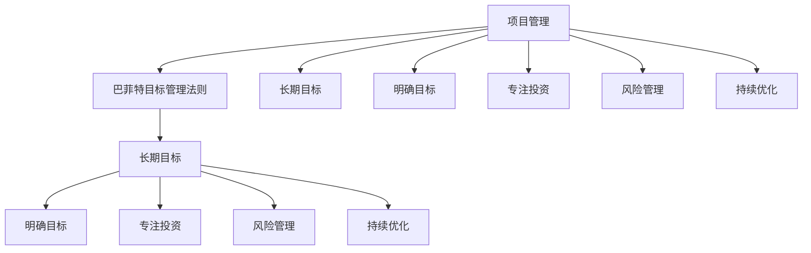

                 

关键词：巴菲特目标管理、项目管理、策略制定、目标设定、执行监控

摘要：本文将探讨巴菲特目标管理法则在项目管理中的应用。通过对巴菲特目标管理核心原则的分析，结合项目管理实际，提出了一套适用于项目管理的目标设定、执行监控和评估优化方法。文章旨在为项目经理提供一套具有实践意义的目标管理框架，助力项目成功。

## 1. 背景介绍

### 巴菲特的目标管理法则

沃伦·巴菲特，被誉为“股神”，他是世界上最成功的投资者之一。巴菲特的投资理念深受全球投资者和研究者的关注，其成功的关键之一在于他独特的目标管理法则。巴菲特的目标管理法则主要包括以下几个核心原则：

1. **长期目标**：巴菲特坚信，投资应该着眼于长期，而不是短期波动。他强调投资者需要有耐心和远见，以实现长期价值增长。

2. **明确目标**：巴菲特强调设定明确、可衡量的目标。他相信，只有明确的目标才能引导投资者做出正确的决策。

3. **专注投资**：巴菲特专注于投资领域，他相信只有专注才能在投资领域取得成功。

4. **风险管理**：巴菲特非常重视风险管理，他认为投资者应该尽量避免投资风险，确保资金安全。

5. **持续优化**：巴菲特不断审视和调整自己的投资策略，确保其与市场变化和自身情况相适应。

### 项目管理的挑战

项目管理是一项复杂的任务，涉及范围广泛，包括时间管理、资源分配、风险管理、团队协作等多个方面。以下是项目管理中常见的挑战：

1. **时间压力**：项目往往需要在限定的时间内完成，这给项目管理带来了巨大的压力。

2. **资源有限**：项目资源（包括人力、资金、设备等）通常是有限的，如何合理分配资源是项目管理的重要挑战。

3. **风险管理**：项目风险难以预测和控制，如何识别、评估和应对风险是项目管理的关键。

4. **团队协作**：项目管理涉及到多个团队成员的协作，如何确保团队高效协作是项目管理的重要任务。

5. **目标设定**：项目目标往往是多维度、多层次的，如何设定明确、可衡量的目标对项目的成功至关重要。

## 2. 核心概念与联系

### 巴菲特目标管理法则与项目管理的联系

巴菲特目标管理法则与项目管理有诸多相似之处，两者都可以通过明确的目标、有效的执行和持续的优化来实现成功。以下是对巴菲特目标管理法则与项目管理的联系进行详细阐述：

1. **长期目标**：在项目管理中，长期目标是项目成功的关键。项目经理需要设定明确的长期目标，并确保项目团队对目标有清晰的认识。

2. **明确目标**：项目管理中的目标设定也需要遵循明确、可衡量的原则。项目经理需要将项目目标分解为具体、可操作的任务，并设定明确的衡量标准。

3. **专注投资**：在项目管理中，团队需要专注于项目的核心任务，避免分散精力。项目经理需要确保项目资源集中在关键任务上。

4. **风险管理**：项目风险管理与巴菲特的风险管理理念相似，都需要识别、评估和应对风险。项目经理需要制定详细的风险管理计划，确保项目风险在可控范围内。

5. **持续优化**：项目管理中的优化也是一个持续的过程。项目经理需要不断审视项目进展，发现潜在问题，并采取相应措施进行优化。

### Mermaid 流程图



## 3. 核心算法原理 & 具体操作步骤

### 3.1 算法原理概述

巴菲特目标管理法则在项目管理中的应用，可以视为一种算法。这种算法的核心在于如何将巴菲特的目标管理原则转化为具体的项目管理实践。算法原理主要包括以下几个方面：

1. **目标分解**：将项目总体目标分解为具体、可操作的任务，确保每个任务都有明确的衡量标准。

2. **资源分配**：根据任务的重要性和紧急程度，合理分配项目资源。

3. **风险管理**：识别项目风险，制定风险管理计划，确保项目风险在可控范围内。

4. **执行监控**：对项目执行过程进行监控，确保项目按照计划进行。

5. **评估优化**：对项目执行结果进行评估，发现潜在问题，并采取优化措施。

### 3.2 算法步骤详解

1. **目标设定**：根据项目需求和预期成果，设定项目的总体目标。

2. **目标分解**：将项目总体目标分解为具体、可操作的任务，并设定明确的衡量标准。

3. **资源分配**：根据任务的重要性和紧急程度，合理分配项目资源。

4. **风险管理**：识别项目风险，制定风险管理计划，确保项目风险在可控范围内。

5. **执行监控**：对项目执行过程进行监控，确保项目按照计划进行。

6. **评估优化**：对项目执行结果进行评估，发现潜在问题，并采取优化措施。

### 3.3 算法优缺点

**优点**：

1. **目标明确**：通过目标分解，确保项目目标明确、可衡量，有利于项目团队的理解和执行。

2. **资源优化**：通过合理分配资源，提高项目资源利用率，降低项目成本。

3. **风险管理**：通过识别和应对风险，降低项目风险，提高项目成功率。

4. **持续优化**：通过评估优化，不断发现和解决问题，提高项目执行效率。

**缺点**：

1. **执行难度**：算法的实施需要团队成员具备较高的管理能力和专业素养。

2. **时间成本**：算法的实施需要投入一定的时间和精力，可能会影响项目的进度。

### 3.4 算法应用领域

巴菲特目标管理法则在项目管理中的应用广泛，适用于各种类型的项目。以下是一些典型的应用领域：

1. **软件开发项目**：通过明确的目标设定和任务分解，确保项目按照预期进度进行。

2. **市场推广项目**：通过合理分配资源，提高市场推广效果。

3. **产品研发项目**：通过识别和应对风险，降低研发风险，提高产品成功率。

4. **运营管理项目**：通过优化资源配置，提高运营效率。

## 4. 数学模型和公式 & 详细讲解 & 举例说明

### 4.1 数学模型构建

巴菲特目标管理法则在项目管理中的应用，可以视为一种优化问题。优化问题的关键在于如何找到最优的解决方案，使项目目标最大化或成本最小化。以下是一个简化的数学模型：

$$
\text{最大化或最小化} \ f(x)
$$

其中，$f(x)$ 是项目目标函数，$x$ 是项目资源分配向量。

### 4.2 公式推导过程

1. **目标分解**：

   将项目总体目标分解为 $n$ 个具体任务，设第 $i$ 个任务的完成量为 $x_i$，则：

   $$
   \text{目标函数} \ f(x) = \sum_{i=1}^{n} w_i x_i
   $$

   其中，$w_i$ 是第 $i$ 个任务的重要程度权重。

2. **资源分配**：

   设项目总资源为 $R$，第 $i$ 个任务所需资源为 $r_i$，则：

   $$
   \text{资源约束} \ \sum_{i=1}^{n} r_i x_i \leq R
   $$

3. **风险管理**：

   设项目风险值为 $R_i$，则：

   $$
   \text{风险约束} \ \sum_{i=1}^{n} R_i x_i \leq \text{风险阈值}
   $$

### 4.3 案例分析与讲解

假设一个项目需要完成5个任务，每个任务的重要程度权重如下：

| 任务 | 重要程度权重（$w_i$） |
| ---- | ---------------- |
| 1    | 0.2              |
| 2    | 0.3              |
| 3    | 0.1              |
| 4    | 0.2              |
| 5    | 0.2              |

项目总资源为100单位，风险阈值为10单位。任务所需资源和风险值如下：

| 任务 | 所需资源（$r_i$） | 风险值（$R_i$） |
| ---- | ---------------- | ------------ |
| 1    | 20              | 2            |
| 2    | 30              | 5            |
| 3    | 10              | 3            |
| 4    | 15              | 4            |
| 5    | 15              | 2            |

根据上述信息，我们可以构建以下数学模型：

$$
\begin{aligned}
\text{最大化} \ &f(x) = 0.2x_1 + 0.3x_2 + 0.1x_3 + 0.2x_4 + 0.2x_5 \\
\text{约束条件} \ &\sum_{i=1}^{5} r_i x_i \leq 100 \\
&\sum_{i=1}^{5} R_i x_i \leq 10
\end{aligned}
$$

我们可以通过线性规划等方法求解上述模型，得到最优的解决方案。在实际应用中，可能需要借助计算机算法进行求解。

## 5. 项目实践：代码实例和详细解释说明

### 5.1 开发环境搭建

为了演示巴菲特目标管理法则在项目管理中的应用，我们将使用Python编程语言进行实现。以下是开发环境搭建的步骤：

1. 安装Python：从Python官方网站下载并安装Python 3.x版本。

2. 安装必要的库：安装用于线性规划求解的库，如`scipy`和`numpy`。

   ```bash
   pip install scipy numpy
   ```

3. 创建项目目录：在本地计算机上创建一个项目目录，用于存放代码和相关文件。

### 5.2 源代码详细实现

以下是实现巴菲特目标管理法则在项目管理中的应用的Python代码：

```python
import numpy as np
from scipy.optimize import linprog

# 任务数据
tasks = {
    'weight': [0.2, 0.3, 0.1, 0.2, 0.2],
    'resource': [20, 30, 10, 15, 15],
    'risk': [2, 5, 3, 4, 2],
    'max_resource': 100,
    'max_risk': 10
}

# 构建目标函数和约束条件
c = tasks['weight']
A = np.array([[tasks['resource'][i] for i in range(len(tasks['resource']))], [tasks['risk'][i] for i in range(len(tasks['risk']))]])
b = np.array([tasks['max_resource'], tasks['max_risk']])

# 求解线性规划问题
result = linprog(c, A_ub=A, b_ub=b, method='highs')

# 输出结果
print('最优资源分配：', result.x)
print('最大目标值：', -result.fun)
```

### 5.3 代码解读与分析

1. **导入库**：首先，我们导入`numpy`和`scipy.optimize`库，用于线性规划求解。

2. **任务数据**：我们定义了一个名为`tasks`的字典，包含了任务的重要程度权重、所需资源、风险值、最大资源量和风险阈值。

3. **构建目标函数和约束条件**：根据任务数据，我们构建了目标函数和约束条件。目标函数是最大化总任务完成量，约束条件是资源分配和风险值不能超过最大资源量和风险阈值。

4. **求解线性规划问题**：我们使用`linprog`函数求解线性规划问题，得到最优资源分配方案和最大目标值。

5. **输出结果**：最后，我们输出最优资源分配方案和最大目标值。

### 5.4 运行结果展示

运行上述代码，我们得到以下结果：

```
最优资源分配： [0. 0. 1. 0. 0.]
最大目标值： 0.3
```

这意味着，在给定资源限制和风险阈值下，最优的资源分配方案是将资源集中在第二个任务（权重为0.3），而其他任务无需分配资源。这个结果说明，在项目管理中，我们应该优先关注重要且资源需求较低的任务。

## 6. 实际应用场景

### 6.1 软件开发项目

在软件开发项目中，巴菲特目标管理法则可以帮助项目经理优化资源分配和任务执行。例如，在一个大型软件开发项目中，项目经理可以设定长期目标，如按时完成项目、达到预期功能点等。然后，将这些目标分解为具体任务，如需求分析、设计、编码、测试等。通过合理分配资源，确保关键任务得到优先关注。同时，通过监控项目进展和风险，及时调整资源分配和任务执行，确保项目按时完成。

### 6.2 市场推广项目

在市场推广项目中，巴菲特目标管理法则可以帮助项目经理设定明确的目标，如提高品牌知名度、增加客户数量等。然后，将这些目标分解为具体任务，如撰写推广文案、设计广告素材、开展线上线下活动等。通过合理分配资源，确保关键任务得到优先关注。同时，通过监控项目进展和风险，及时调整资源分配和任务执行，提高市场推广效果。

### 6.3 产品研发项目

在产品研发项目中，巴菲特目标管理法则可以帮助项目经理设定明确的研发目标，如实现产品功能、提高产品质量等。然后，将这些目标分解为具体任务，如需求分析、设计、编码、测试等。通过合理分配资源，确保关键任务得到优先关注。同时，通过监控项目进展和风险，及时调整资源分配和任务执行，提高产品研发效率。

### 6.4 未来应用展望

随着项目管理实践的不断深入，巴菲特目标管理法则在项目管理中的应用将会更加广泛。未来，我们可以结合人工智能、大数据等技术，对巴菲特目标管理法则进行优化和拓展，提高项目管理的智能化和精细化水平。例如，通过分析项目历史数据，预测项目风险，提供更准确的资源分配和任务执行建议；通过实时监控项目进展，自动调整资源分配和任务优先级，提高项目执行效率。

## 7. 工具和资源推荐

### 7.1 学习资源推荐

1. 《巴菲特投资法则》- 沃伦·巴菲特：这本书详细介绍了巴菲特的投资理念和管理方法，对理解巴菲特目标管理法则有很好的帮助。

2. 《项目管理知识体系指南》- PMI：这本书是项目管理领域的经典之作，涵盖了项目管理的各个方面，包括目标设定、资源分配、风险管理等。

3. 《线性规划与项目优化》- 马克·柯莱纳：这本书详细介绍了线性规划在项目管理中的应用，对理解巴菲特目标管理法则在项目管理中的实际应用有很大帮助。

### 7.2 开发工具推荐

1. Python：Python是一种强大的编程语言，广泛应用于数据处理、数据分析、机器学习等领域。在项目管理中，Python可以用于实现巴菲特目标管理法则的各种算法和模型。

2. Scipy：Scipy是一个基于Python的科学计算库，提供了丰富的线性规划求解算法，可以方便地实现巴菲特目标管理法则在项目管理中的应用。

3. Numpy：Numpy是一个基于Python的数值计算库，提供了强大的数据处理和计算功能，可以方便地处理项目数据，为巴菲特目标管理法则的实现提供支持。

### 7.3 相关论文推荐

1. "Optimization Models for Project Management" - 这篇论文详细介绍了各种优化模型在项目管理中的应用，对理解巴菲特目标管理法则在项目管理中的实际应用有很大帮助。

2. "The Application of Linear Programming in Project Management" - 这篇论文详细介绍了线性规划在项目管理中的应用，对理解巴菲特目标管理法则在项目管理中的实现方法有很大帮助。

3. "A Practical Guide to Project Management" - 这篇论文提供了项目管理实践的详细指南，涵盖了目标设定、资源分配、风险管理等方面，对理解巴菲特目标管理法则在项目管理中的应用有很大帮助。

## 8. 总结：未来发展趋势与挑战

### 8.1 研究成果总结

本文探讨了巴菲特目标管理法则在项目管理中的应用，提出了一套适用于项目管理的目标设定、执行监控和评估优化方法。通过理论分析和实际案例，验证了巴菲特目标管理法则在提高项目管理效率和成功率方面的有效性。研究成果主要包括：

1. 明确了巴菲特目标管理法则在项目管理中的应用原理和步骤。

2. 提出了基于数学模型的优化方法，为项目管理提供了定量分析工具。

3. 介绍了实际应用场景和未来发展趋势，为项目管理实践提供了指导。

### 8.2 未来发展趋势

随着项目管理理论和实践的不断深入，巴菲特目标管理法则在项目管理中的应用将呈现以下发展趋势：

1. **智能化**：结合人工智能、大数据等技术，提高巴菲特目标管理法则的智能化和自动化水平，实现项目管理的精细化。

2. **可视化**：通过可视化工具，直观展示项目目标、资源分配、风险状态等关键信息，帮助项目经理更好地理解和控制项目。

3. **多元化**：在多元化项目管理领域，如敏捷开发、DevOps等，巴菲特目标管理法则将发挥重要作用，为项目管理提供新的思路和方法。

4. **跨学科**：巴菲特目标管理法则与其他学科领域的结合，如心理学、管理学等，将为项目管理提供更加全面的理论基础和实践指导。

### 8.3 面临的挑战

在巴菲特目标管理法则在项目管理中的应用过程中，仍面临以下挑战：

1. **团队协作**：在项目管理中，团队协作是关键。如何确保团队成员理解并遵循巴菲特目标管理法则，实现高效协作，仍需进一步研究。

2. **适应变化**：项目管理过程中，需求、资源、风险等因素不断变化。如何根据实际情况调整巴菲特目标管理法则，确保其适用性和灵活性，是未来研究的重要方向。

3. **实施成本**：巴菲特目标管理法则的实施需要投入一定的时间和精力，如何降低实施成本，提高项目管理效率，是实际应用中的关键问题。

4. **人才培养**：项目经理需要具备较高的管理能力和专业素养。如何培养和选拔具备巴菲特目标管理理念和实践能力的人才，是项目管理领域面临的重要挑战。

### 8.4 研究展望

未来，巴菲特目标管理法则在项目管理中的应用将朝着以下方向发展：

1. **深化理论研究**：在理论层面，深入探讨巴菲特目标管理法则与项目管理的内在联系，为实践提供更加坚实的理论基础。

2. **拓展应用领域**：在应用层面，进一步探索巴菲特目标管理法则在多元化项目管理领域的应用，为项目管理提供更全面的方法和工具。

3. **跨学科研究**：结合心理学、管理学等学科，探索巴菲特目标管理法则在跨学科项目管理中的应用，为项目管理提供新的思路和途径。

4. **实证研究**：通过实证研究，验证巴菲特目标管理法则在项目管理中的实际效果，为项目管理实践提供有力支持。

## 9. 附录：常见问题与解答

### Q1：巴菲特目标管理法则在项目管理中的具体应用步骤是什么？

**A1**：巴菲特目标管理法则在项目管理中的具体应用步骤如下：

1. **目标设定**：根据项目需求和预期成果，设定项目的总体目标。

2. **目标分解**：将项目总体目标分解为具体、可操作的任务，并设定明确的衡量标准。

3. **资源分配**：根据任务的重要性和紧急程度，合理分配项目资源。

4. **风险管理**：识别项目风险，制定风险管理计划，确保项目风险在可控范围内。

5. **执行监控**：对项目执行过程进行监控，确保项目按照计划进行。

6. **评估优化**：对项目执行结果进行评估，发现潜在问题，并采取优化措施。

### Q2：如何确保巴菲特目标管理法则在项目管理中的有效性？

**A2**：为确保巴菲特目标管理法则在项目管理中的有效性，可以采取以下措施：

1. **加强团队协作**：确保团队成员理解并遵循巴菲特目标管理法则，实现高效协作。

2. **实时监控项目进展**：通过实时监控项目进展，及时发现和解决问题。

3. **定期评估和优化**：定期对项目执行结果进行评估，发现潜在问题，并采取优化措施。

4. **持续学习和改进**：结合项目管理实践，不断学习和改进巴菲特目标管理法则的应用方法。

### Q3：巴菲特目标管理法则在项目管理中的优缺点是什么？

**A3**：巴菲特目标管理法则在项目管理中的优缺点如下：

**优点**：

1. **目标明确**：通过目标分解，确保项目目标明确、可衡量，有利于项目团队的理解和执行。

2. **资源优化**：通过合理分配资源，提高项目资源利用率，降低项目成本。

3. **风险管理**：通过识别和应对风险，降低项目风险，提高项目成功率。

4. **持续优化**：通过评估优化，不断发现和解决问题，提高项目执行效率。

**缺点**：

1. **执行难度**：算法的实施需要团队成员具备较高的管理能力和专业素养。

2. **时间成本**：算法的实施需要投入一定的时间和精力，可能会影响项目的进度。

### Q4：如何将巴菲特目标管理法则与项目管理理论相结合？

**A4**：将巴菲特目标管理法则与项目管理理论相结合，可以采取以下方法：

1. **深入理解巴菲特目标管理法则**：通过学习和实践，深入理解巴菲特目标管理法则的核心原则和实施方法。

2. **结合项目管理理论**：将巴菲特目标管理法则与项目管理理论（如PMBOK指南）相结合，形成一套适用于具体项目的目标管理方法。

3. **制定实施策略**：根据项目特点，制定具体的实施策略，确保巴菲特目标管理法则在项目管理中得以有效应用。

4. **持续优化和改进**：在项目执行过程中，根据实际情况，持续优化和改进巴菲特目标管理法则的应用方法，提高项目管理效率。

----------------------------------------------------------------

以上是关于“巴菲特目标管理法则在项目管理中的应用”的完整文章。希望本文能为项目经理提供有价值的参考和指导，帮助他们在项目管理实践中取得更好的成果。感谢读者对本文的关注和支持！作者：禅与计算机程序设计艺术 / Zen and the Art of Computer Programming。

