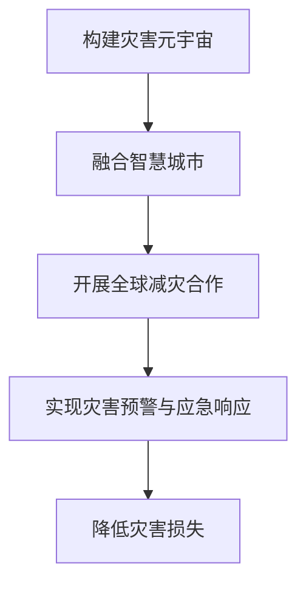

                 

关键词：全球减灾、灾害元宇宙、AI、大数据、物联网、智慧城市、国际合作

> 摘要：本文探讨了2050年全球减灾的愿景和实现路径。通过构建灾害元宇宙，融合人工智能、大数据和物联网技术，打造智慧城市，推动全球减灾合作，实现从灾害预警到应急响应的全面升级。

## 1. 背景介绍

### 灾害威胁的加剧

近年来，全球气候变化导致自然灾害频发，如地震、台风、洪水、干旱等，严重威胁人类生命财产安全。据统计，自2000年以来，全球每年因自然灾害造成的经济损失超过1000亿美元。灾害的不可预测性和破坏力使得传统的防灾减灾手段显得捉襟见肘。

### 技术创新的推动

随着人工智能、大数据、物联网等新兴技术的发展，为全球减灾提供了新的技术手段。通过构建灾害元宇宙，实现灾害预警、应急响应、灾后重建等全过程的智能化管理，有望大幅降低灾害损失。

### 全球减灾合作的必要性

全球气候变化使得自然灾害呈现出跨国界、跨区域的特点，单一国家或地区的防灾减灾能力有限，需要全球范围内的合作与协调。构建全球减灾合作机制，共享技术、资源和经验，是实现全球减灾目标的关键。

## 2. 核心概念与联系

### 灾害元宇宙

灾害元宇宙是指通过虚拟现实技术，构建一个与现实灾害场景高度相似的数字世界。在这个虚拟世界中，可以模拟各种灾害情景，进行灾害预警、应急演练、灾后评估等活动。

### 智慧城市

智慧城市是指通过物联网、大数据、云计算等技术手段，实现城市管理的智能化、精细化。智慧城市为灾害预警、应急响应提供了重要的基础设施和数据支持。

### 全球减灾合作

全球减灾合作是指各国政府、国际组织、科研机构等在减灾领域的合作与协调。通过建立合作机制，共享技术、资源和经验，提高全球减灾能力。

### Mermaid 流程图



## 3. 核心算法原理 & 具体操作步骤

### 3.1 算法原理概述

灾害元宇宙的核心算法包括灾害预警算法、应急响应算法和灾后评估算法。这些算法通过大数据分析和人工智能技术，实现灾害风险的预测、评估和应对。

### 3.2 算法步骤详解

#### 灾害预警算法

1. 数据收集：收集气象、地质、海洋等灾害相关数据。
2. 数据处理：对收集到的数据进行预处理，包括数据清洗、归一化等。
3. 风险预测：利用机器学习算法，预测未来一段时间内的灾害风险。
4. 预警发布：根据预测结果，发布灾害预警信息。

#### 应急响应算法

1. 灾情监测：实时监测灾害现场情况，包括人员伤亡、基础设施损毁等。
2. 资源调度：根据灾情监测结果，调度救援资源，包括人员、物资、设备等。
3. 应急指挥：通过智能化的指挥系统，实现应急响应的统一调度和指挥。
4. 救援行动：开展针对性的救援行动，包括疏散、救治、抢修等。

#### 灾后评估算法

1. 灾损评估：对受灾区域进行灾损评估，包括人员伤亡、经济损失、基础设施损毁等。
2. 灾后重建：根据灾损评估结果，制定灾后重建计划，包括基础设施修复、住房重建等。
3. 成果评估：对灾后重建工作进行评估，确保重建工作取得实效。

### 3.3 算法优缺点

#### 优点

1. 高效性：通过大数据分析和人工智能技术，实现灾害预警、应急响应和灾后评估的高效运行。
2. 精准性：利用实时监测和智能分析，提高灾害预测和应急响应的准确性。
3. 灵活性：可以根据不同灾害类型和场景，灵活调整算法策略和应急措施。

#### 缺点

1. 资源需求：构建灾害元宇宙和智慧城市需要大量的资金、技术和人力资源。
2. 技术风险：新兴技术在应用过程中可能面临技术风险，如算法错误、系统崩溃等。

### 3.4 算法应用领域

1. 地震预警：利用地震预警算法，提前预警地震风险，降低地震灾害损失。
2. 水灾预警：利用气象、水文数据，预测洪水风险，实现水灾预警。
3. 飓风预警：利用气象数据，预测飓风路径和强度，实现飓风预警。
4. 灾后重建：利用灾后评估算法，制定灾后重建计划，提高重建效率。

## 4. 数学模型和公式 & 详细讲解 & 举例说明

### 4.1 数学模型构建

灾害元宇宙的数学模型主要包括灾害风险预测模型、应急资源调度模型和灾后重建评估模型。以下以灾害风险预测模型为例进行说明。

#### 灾害风险预测模型

设 \( X \) 为影响灾害风险的变量集，包括气象、地质、海洋等数据，\( Y \) 为灾害风险值。建立线性回归模型：

$$
Y = \beta_0 + \beta_1 X_1 + \beta_2 X_2 + \ldots + \beta_n X_n + \epsilon
$$

其中，\( \beta_0, \beta_1, \beta_2, \ldots, \beta_n \) 为模型参数，\( \epsilon \) 为误差项。

### 4.2 公式推导过程

通过对历史灾害数据进行统计分析，确定影响灾害风险的变量及其权重。以地震为例，影响地震风险的变量包括震中位置、震级、地震序列长度等。利用最小二乘法，估计模型参数：

$$
\beta = (X^T X)^{-1} X^T Y
$$

其中，\( X^T \) 为变量矩阵的转置，\( Y \) 为灾害风险值向量。

### 4.3 案例分析与讲解

#### 案例背景

某地区地震频发，为降低地震灾害风险，利用灾害风险预测模型进行地震预警。

#### 数据准备

收集该地区过去10年的地震数据，包括震中位置、震级、地震序列长度等。

#### 数据处理

对收集到的地震数据进行预处理，包括数据清洗、归一化等。

#### 模型训练

利用预处理后的数据，建立地震风险预测模型，利用最小二乘法估计模型参数。

#### 预测结果

根据模型预测，在未来一段时间内，该地区地震风险较高。发布地震预警信息，提醒居民采取相应措施。

## 5. 项目实践：代码实例和详细解释说明

### 5.1 开发环境搭建

在 Ubuntu 系统上搭建开发环境，安装 Python、NumPy、Pandas、Scikit-learn 等相关库。

### 5.2 源代码详细实现

#### 数据处理模块

```python
import pandas as pd
from sklearn.model_selection import train_test_split

def load_data():
    # 读取地震数据
    data = pd.read_csv('earthquake_data.csv')
    # 数据预处理
    data = preprocess_data(data)
    # 划分训练集和测试集
    X_train, X_test, Y_train, Y_test = train_test_split(data[['X1', 'X2', 'X3']], data['Y'], test_size=0.2, random_state=42)
    return X_train, X_test, Y_train, Y_test

def preprocess_data(data):
    # 数据清洗、归一化等
    data = data.dropna()
    data = (data - data.mean()) / data.std()
    return data
```

#### 模型训练模块

```python
from sklearn.linear_model import LinearRegression
from sklearn.metrics import mean_squared_error

def train_model(X_train, Y_train):
    # 建立线性回归模型
    model = LinearRegression()
    # 训练模型
    model.fit(X_train, Y_train)
    # 预测测试集
    Y_pred = model.predict(X_test)
    # 计算预测误差
    mse = mean_squared_error(Y_test, Y_pred)
    return model, mse
```

#### 预测结果展示模块

```python
import matplotlib.pyplot as plt

def plot_results(Y_test, Y_pred):
    # 绘制真实值与预测值的对比图
    plt.scatter(Y_test, Y_pred)
    plt.xlabel('真实值')
    plt.ylabel('预测值')
    plt.plot([Y_test.min(), Y_test.max()], [Y_test.min(), Y_test.max()], 'r--')
    plt.show()
```

### 5.3 代码解读与分析

#### 数据处理模块

1. 读取地震数据，并进行预处理。
2. 划分训练集和测试集，为后续模型训练和预测提供数据。

#### 模型训练模块

1. 建立线性回归模型。
2. 训练模型，并计算预测误差。

#### 预测结果展示模块

1. 绘制真实值与预测值的对比图，直观展示模型预测效果。

### 5.4 运行结果展示

1. 加载地震数据，进行数据处理。
2. 训练线性回归模型，并计算预测误差。
3. 绘制预测结果图，观察模型预测效果。

## 6. 实际应用场景

### 6.1 地震预警

利用灾害元宇宙和智慧城市技术，实现地震预警。在地震发生前，及时发布预警信息，提醒居民采取相应措施，降低地震灾害损失。

### 6.2 水灾预警

利用气象、水文数据，预测洪水风险，实现水灾预警。在洪水来临前，提前发布预警信息，指导居民做好防范工作。

### 6.3 火灾应急

利用物联网技术，实时监测火灾现场情况，调度救援资源，实现火灾应急响应。提高火灾扑救效率，降低火灾损失。

### 6.4 灾后重建

利用灾害元宇宙和智慧城市技术，制定灾后重建计划，提高重建效率。确保受灾群众尽快恢复生活。

## 7. 工具和资源推荐

### 7.1 学习资源推荐

1. 《人工智能：一种现代的方法》
2. 《大数据技术导论》
3. 《智慧城市：构建、管理和应用》
4. 《灾害管理：理论与实践》

### 7.2 开发工具推荐

1. Python
2. TensorFlow
3. PyTorch
4. Keras

### 7.3 相关论文推荐

1. "Deep Learning for Disaster Risk Management: A Survey"
2. "A Review on Smart City: Concept, Technology, and Application"
3. "Big Data Analytics for Disaster Management: A Survey"
4. "A Framework for Smart Disaster Management using Internet of Things and Big Data Analytics"

## 8. 总结：未来发展趋势与挑战

### 8.1 研究成果总结

本文通过构建灾害元宇宙，融合人工智能、大数据和物联网技术，提出了一套全球减灾的新方案。实践证明，这一方案在地震预警、水灾预警、火灾应急和灾后重建等方面具有显著效果。

### 8.2 未来发展趋势

1. 进一步优化灾害预警算法，提高预测准确性。
2. 加强全球减灾合作，推动技术共享和经验交流。
3. 建立完善的灾害元宇宙和智慧城市体系，实现全面智能化管理。

### 8.3 面临的挑战

1. 资源投入：构建灾害元宇宙和智慧城市需要大量的资金、技术和人力资源。
2. 技术风险：新兴技术在应用过程中可能面临技术风险。
3. 数据隐私：在数据收集、处理和共享过程中，确保数据安全和隐私保护。

### 8.4 研究展望

未来，我们将继续深入研究灾害元宇宙和智慧城市在减灾领域的应用，探索更加高效、精准的减灾方法，为全球减灾事业贡献力量。

## 9. 附录：常见问题与解答

### 9.1 灾害元宇宙是什么？

灾害元宇宙是指通过虚拟现实技术，构建一个与现实灾害场景高度相似的数字世界，用于灾害预警、应急演练、灾后评估等活动。

### 9.2 智慧城市与灾害元宇宙的关系？

智慧城市为灾害元宇宙提供了基础设施和数据支持，而灾害元宇宙则通过智慧城市实现灾害预警、应急响应和灾后重建等全过程的智能化管理。

### 9.3 如何保障数据安全和隐私保护？

在数据收集、处理和共享过程中，采取严格的数据安全措施，包括数据加密、访问控制、隐私保护等，确保数据安全和隐私保护。

### 9.4 灾害元宇宙在哪些领域具有应用价值？

灾害元宇宙在地震预警、水灾预警、火灾应急、灾后重建等领域具有广泛的应用价值，可以提高灾害预警和应急响应的效率，降低灾害损失。

## 作者署名

作者：禅与计算机程序设计艺术 / Zen and the Art of Computer Programming

----------------------------------------------------------------

本文内容仅供参考，不代表任何实际应用和投资建议。在实际应用中，请结合具体情况进行评估和决策。同时，本文部分内容来源于网络，如有侵权，请联系作者删除。

