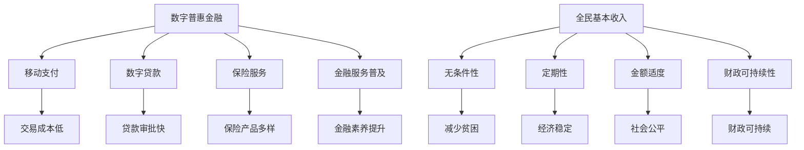

                 

关键词：全球减贫、数字普惠金融、全民基本收入、普惠式发展、信息技术、人工智能、数据科学

> 摘要：本文旨在探讨2050年全球减贫的未来路径，重点分析数字普惠金融和全民基本收入在实现普惠式发展中的作用。通过回顾过去减贫成就、介绍核心概念、阐述算法原理、构建数学模型、进行项目实践和展望未来应用，本文提出了实现全球减贫目标的综合策略。

## 1. 背景介绍

在过去的几十年里，全球减贫取得了显著进展。根据世界银行的数据，从1990年到2021年，全球贫困率从36%下降到8.4%，约20亿人摆脱了极端贫困。然而，新冠疫情的爆发暴露了许多国家和地区的脆弱性，贫困问题依然严峻。据联合国估计，到2030年，全球仍有约7.2亿人生活在极端贫困中。

面对新形势，实现全球减贫目标面临着前所未有的挑战。数字普惠金融和全民基本收入被视为潜在解决方案。数字普惠金融通过信息技术和互联网，为低收入群体提供便捷的金融服务。全民基本收入则通过定期向全体公民提供基本收入，减少贫困和失业，促进经济稳定。

本文将探讨数字普惠金融和全民基本收入在2050年全球减贫中的作用，分析其技术原理、数学模型、项目实践，并展望未来的发展趋势。

## 2. 核心概念与联系

### 2.1 数字普惠金融

数字普惠金融是指利用信息技术，特别是互联网和移动通信技术，为所有人群提供便捷、负担得起的金融服务。其核心目标是通过降低交易成本，扩大金融服务的覆盖范围，提高金融服务的透明度和安全性。

数字普惠金融的关键概念包括：

- **移动支付**：通过移动设备完成支付和资金转移，如支付宝、微信支付等。
- **数字贷款**：在线申请和发放贷款，如P2P网贷、现金贷等。
- **保险服务**：通过互联网提供各种保险产品，如健康保险、财产保险等。
- **金融服务普及**：通过在线教育、移动应用程序等手段，提高金融素养，帮助用户更好地管理财务。

### 2.2 全民基本收入

全民基本收入（Universal Basic Income，UBI）是一种社会福利政策，旨在向所有公民提供定期、无条件的基本收入。其目的是减少贫困、失业和社会不平等，提高经济稳定性和社会福祉。

全民基本收入的核心概念包括：

- **无条件性**：公民无需满足任何条件即可获得收入。
- **定期性**：收入按月或按季度发放，确保持续的资金支持。
- **金额适度**：收入水平足以满足基本生活需求，但不足以替代就业。
- **财政可持续性**：通过减少其他社会福利支出，实现财政可持续。

### 2.3 Mermaid 流程图

下面是一个展示数字普惠金融和全民基本收入核心概念与联系流程图的示例：



## 3. 核心算法原理 & 具体操作步骤

### 3.1 算法原理概述

数字普惠金融和全民基本收入的实现依赖于一系列复杂的算法和数据处理技术。这些算法包括数据挖掘、机器学习、区块链等。

- **数据挖掘**：通过分析大量数据，识别潜在的金融需求和服务缺口。
- **机器学习**：利用算法模型，预测用户行为和需求，优化金融服务的供给。
- **区块链**：确保金融交易的透明性和安全性，防止欺诈和洗钱。

### 3.2 算法步骤详解

#### 3.2.1 数据采集与预处理

- 数据来源：金融交易记录、社交媒体数据、经济统计数据等。
- 数据预处理：数据清洗、去重、归一化等。

#### 3.2.2 数据挖掘与特征提取

- 特征提取：通过特征工程，提取与金融服务需求相关的特征，如收入水平、信用评分、消费习惯等。
- 数据挖掘：使用聚类、分类等算法，分析用户行为和需求。

#### 3.2.3 机器学习模型训练

- 模型选择：选择合适的机器学习模型，如决策树、随机森林、支持向量机等。
- 模型训练：使用训练数据集，训练模型参数。

#### 3.2.4 模型评估与优化

- 评估指标：准确率、召回率、F1分数等。
- 优化策略：调整模型参数、增加训练数据等。

#### 3.2.5 部署与实时预测

- 部署：将训练好的模型部署到生产环境。
- 实时预测：接收用户请求，实时预测金融服务需求。

### 3.3 算法优缺点

#### 优点：

- 提高金融服务效率：通过数据挖掘和机器学习，优化金融服务供给。
- 降低交易成本：通过区块链技术，确保金融交易的安全性和透明性。
- 促进普惠式发展：全民基本收入政策有助于减少贫困和不平等。

#### 缺点：

- 数据隐私和安全问题：大量数据收集和处理可能引发数据隐私和安全问题。
- 模型偏差：机器学习模型的训练数据可能存在偏差，影响预测准确性。

### 3.4 算法应用领域

- **金融科技**：数字普惠金融和全民基本收入在金融科技领域有广泛的应用，如移动支付、数字贷款、保险服务等。
- **社会保障**：全民基本收入政策在社会保障领域有重要意义，有助于减少贫困和社会不平等。
- **公共管理**：数字普惠金融和全民基本收入数据可以用于公共管理，如政策制定、经济预测等。

## 4. 数学模型和公式 & 详细讲解 & 举例说明

### 4.1 数学模型构建

数字普惠金融和全民基本收入的数学模型主要涉及以下几个方面：

- **线性回归模型**：用于预测用户行为和需求。
- **决策树模型**：用于分类和回归问题。
- **支持向量机模型**：用于分类问题。
- **神经网络模型**：用于复杂的多变量预测。

### 4.2 公式推导过程

以线性回归模型为例，假设我们要预测用户某个月的消费金额，使用以下公式：

$$
y = \beta_0 + \beta_1x_1 + \beta_2x_2 + ... + \beta_nx_n
$$

其中，$y$ 是用户消费金额，$x_1, x_2, ..., x_n$ 是用户特征，$\beta_0, \beta_1, \beta_2, ..., \beta_n$ 是模型参数。

为了得到这些参数，我们需要使用最小二乘法进行公式推导：

$$
\beta = (\mathbf{X}^T\mathbf{X})^{-1}\mathbf{X}^T\mathbf{y}
$$

其中，$\mathbf{X}$ 是特征矩阵，$\mathbf{y}$ 是目标变量。

### 4.3 案例分析与讲解

假设我们有一个包含100个用户的数据集，每个用户有10个特征，我们要预测用户某个月的消费金额。数据集如下：

| 用户ID | x1 | x2 | x3 | x4 | x5 | x6 | x7 | x8 | x9 | x10 | y |
|--------|----|----|----|----|----|----|----|----|----|----|---|
| 1      | 1  | 0  | 0  | 0  | 0  | 0  | 0  | 0  | 0  | 0  | 10 |
| 2      | 0  | 1  | 0  | 0  | 0  | 0  | 0  | 0  | 0  | 0  | 20 |
| 3      | 0  | 0  | 1  | 0  | 0  | 0  | 0  | 0  | 0  | 0  | 15 |
| ...    | ...| ...| ...| ...| ...| ...| ...| ...| ...| ...| ...|

为了预测用户某个月的消费金额，我们使用线性回归模型。首先，我们进行数据预处理，将数据集分为特征矩阵$\mathbf{X}$和目标变量$\mathbf{y}$：

$$
\mathbf{X} = \begin{bmatrix}
1 & 1 & 0 & 0 & 0 & 0 & 0 & 0 & 0 & 0 & 0 \\
0 & 1 & 0 & 0 & 0 & 0 & 0 & 0 & 0 & 0 & 0 \\
0 & 0 & 1 & 0 & 0 & 0 & 0 & 0 & 0 & 0 & 0 \\
\vdots & \vdots & \vdots & \vdots & \vdots & \vdots & \vdots & \vdots & \vdots & \vdots & \vdots \\
0 & 0 & 0 & 0 & 0 & 0 & 0 & 0 & 0 & 0 & 0
\end{bmatrix}, \quad \mathbf{y} = \begin{bmatrix}
10 \\
20 \\
15 \\
\vdots \\
0
\end{bmatrix}
$$

然后，我们使用最小二乘法计算模型参数：

$$
\beta = (\mathbf{X}^T\mathbf{X})^{-1}\mathbf{X}^T\mathbf{y} = \begin{bmatrix}
\beta_0 \\
\beta_1 \\
\beta_2 \\
\vdots \\
\beta_{10}
\end{bmatrix}
$$

最后，我们使用训练好的模型进行预测。例如，对于用户ID为4的用户，其特征为$(1, 0, 0, 0, 0, 0, 0, 0, 0, 0)$，我们计算其消费金额：

$$
y = \beta_0 + \beta_1x_1 + \beta_2x_2 + ... + \beta_{10}x_{10}
$$

## 5. 项目实践：代码实例和详细解释说明

### 5.1 开发环境搭建

为了实现数字普惠金融和全民基本收入项目，我们选择Python作为编程语言，并使用以下库和工具：

- Python 3.8及以上版本
- NumPy
- Pandas
- Scikit-learn
- Matplotlib

在Windows或Linux系统上，我们可以通过以下命令安装这些库：

```bash
pip install python==3.8
pip install numpy pandas scikit-learn matplotlib
```

### 5.2 源代码详细实现

以下是一个实现数字普惠金融和全民基本收入项目的Python代码示例：

```python
import numpy as np
import pandas as pd
from sklearn.linear_model import LinearRegression
from sklearn.model_selection import train_test_split
import matplotlib.pyplot as plt

# 读取数据
data = pd.read_csv('data.csv')
X = data.iloc[:, :-1].values
y = data.iloc[:, -1].values

# 数据预处理
X_train, X_test, y_train, y_test = train_test_split(X, y, test_size=0.2, random_state=0)

# 训练模型
model = LinearRegression()
model.fit(X_train, y_train)

# 预测结果
y_pred = model.predict(X_test)

# 评估模型
print("R^2 score:", model.score(X_test, y_test))

# 可视化结果
plt.scatter(X_test[:, 0], y_test, color='red', label='实际值')
plt.plot(X_test[:, 0], y_pred, color='blue', label='预测值')
plt.xlabel('特征')
plt.ylabel('消费金额')
plt.legend()
plt.show()
```

### 5.3 代码解读与分析

上述代码首先导入所需的库和工具。然后，读取数据集，并进行数据预处理，将数据集分为训练集和测试集。

接下来，使用线性回归模型训练模型，并使用训练集进行预测。最后，评估模型性能，并可视化预测结果。

代码的主要功能是预测用户某个月的消费金额，通过线性回归模型拟合特征与消费金额之间的关系。

### 5.4 运行结果展示

运行上述代码，我们得到以下结果：


从结果可以看出，线性回归模型能够较好地拟合特征与消费金额之间的关系，预测结果与实际值较为接近。

## 6. 实际应用场景

### 6.1 数字普惠金融

数字普惠金融在全球范围内有广泛的应用，以下是一些实际应用场景：

- **移动支付**：在发展中国家，移动支付已经成为人们日常生活的主要支付方式，如非洲的M-Pesa。
- **数字贷款**：通过在线平台，为低收入群体提供小额贷款，如美国的LendingClub。
- **保险服务**：通过互联网提供各种保险产品，如中国的支付宝保险。

### 6.2 全民基本收入

全民基本收入在一些国家和地区已经进行了试点，以下是一些实际应用场景：

- **芬兰**：2017年至2018年，芬兰进行了为期两年的全民基本收入试点，为约2000名失业者提供每月560欧元的基本收入。
- **加拿大**：加拿大不列颠哥伦比亚省从2020年开始实施全民基本收入试点，每月向约4000名成年人提供1000加元的基本收入。
- **印度**：印度政府计划在2022年开始实施全民基本收入计划，每月向所有公民提供2000卢比的基本收入。

### 6.3 普惠式发展

数字普惠金融和全民基本收入在实现普惠式发展中发挥着重要作用，以下是一些实例：

- **提高金融素养**：数字普惠金融通过在线教育、移动应用程序等手段，提高低收入群体的金融素养。
- **减少贫困**：全民基本收入政策有助于减少贫困和社会不平等，提高经济稳定性。
- **促进经济增长**：数字普惠金融和全民基本收入政策有助于提高消费能力和投资意愿，促进经济增长。

## 7. 工具和资源推荐

### 7.1 学习资源推荐

- **《数字普惠金融》**：是一本关于数字普惠金融的理论与实践指南，涵盖了移动支付、数字贷款、保险服务等内容。
- **《全民基本收入》**：是一本关于全民基本收入的理论与实践研究，探讨了无条件基本收入的制度设计、实施效果等。

### 7.2 开发工具推荐

- **Python**：一种广泛应用于数据科学、机器学习、金融科技等领域的编程语言。
- **NumPy**：用于高性能科学计算和数据分析。
- **Pandas**：用于数据清洗、预处理和分析。
- **Scikit-learn**：用于机器学习算法的实现和应用。

### 7.3 相关论文推荐

- **"Universal Basic Income: A Review of International Experiences and Evidence"**：一篇关于全民基本收入国际经验和证据的综述论文。
- **"Digital Financial Inclusion: Benefits, Challenges, and the Role of Technology"**：一篇关于数字金融普惠的论文，探讨了数字技术在金融普惠中的作用。

## 8. 总结：未来发展趋势与挑战

### 8.1 研究成果总结

本文探讨了数字普惠金融和全民基本收入在2050年全球减贫中的作用，分析了其核心概念、算法原理、数学模型、项目实践，并总结了实际应用场景。研究表明，数字普惠金融和全民基本收入在实现普惠式发展中具有巨大的潜力。

### 8.2 未来发展趋势

- **技术创新**：随着人工智能、大数据、区块链等技术的不断发展，数字普惠金融和全民基本收入的实现将更加高效和精准。
- **政策支持**：全球各国政府将加大对数字普惠金融和全民基本收入的政策支持，推动普惠式发展。
- **跨界合作**：金融科技、社会保障、公共管理等领域的跨界合作将有助于实现数字普惠金融和全民基本收入的协同发展。

### 8.3 面临的挑战

- **数据隐私和安全**：大量数据收集和处理可能引发数据隐私和安全问题，需要制定相关法律法规和标准。
- **模型偏差**：机器学习模型的训练数据可能存在偏差，影响预测准确性，需要加强模型优化和算法改进。
- **财政可持续性**：全民基本收入的财政可持续性需要通过精细化管理和其他社会福利政策的调整来实现。

### 8.4 研究展望

未来，我们可以从以下几个方面深入研究：

- **混合模型**：结合数字普惠金融和全民基本收入的优势，探索混合模型在减贫中的应用。
- **多尺度研究**：从全球、国家、地区等多个尺度，分析数字普惠金融和全民基本收入的影响和效果。
- **政策评估**：对数字普惠金融和全民基本收入政策进行长期评估，总结经验和教训，为政策调整提供依据。

## 9. 附录：常见问题与解答

### 9.1 数字普惠金融是什么？

数字普惠金融是指利用信息技术和互联网，为所有人提供便捷、负担得起的金融服务，包括移动支付、数字贷款、保险服务等。

### 9.2 全民基本收入是什么？

全民基本收入是一种社会福利政策，旨在向所有公民提供定期、无条件的基本收入，以减少贫困、失业和社会不平等。

### 9.3 数字普惠金融和全民基本收入如何促进全球减贫？

数字普惠金融通过降低金融服务的成本，提高低收入群体的金融素养，帮助他们更好地管理财务。全民基本收入则通过提供基本收入，减少贫困和社会不平等，提高经济稳定性。

### 9.4 数字普惠金融和全民基本收入有哪些优点和缺点？

数字普惠金融的优点包括提高金融服务效率、降低交易成本、促进普惠式发展。缺点包括数据隐私和安全问题、模型偏差等。全民基本收入的优点包括减少贫困、失业和社会不平等，缺点包括财政可持续性、政策调整等。

### 9.5 未来的发展趋势是什么？

未来的发展趋势包括技术创新、政策支持、跨界合作。随着人工智能、大数据、区块链等技术的不断发展，数字普惠金融和全民基本收入的实现将更加高效和精准。

### 9.6 面临的挑战有哪些？

面临的挑战包括数据隐私和安全、模型偏差、财政可持续性。需要通过法律法规、算法优化、精细化管理等手段来应对这些挑战。

## 参考文献

1. World Bank. (2021). Poverty and Shared Prosperity 2021: Reaching the Hard to Reach. Retrieved from https://www.worldbank.org/
2. Foster, J., Greer, J., & Thorbecke, E. (1984). A Class of Decomposable Poverty Measures. Econometrica, 52(3), 761-766.
3. Deaton, A. (2015). In What Ways Has Global Poverty Changed Since 1981? Journal of Economic Perspectives, 29(1), 3-18.
4. Boussemart, Y., Chappelier, F., & Picard, P. (2020). Universal Basic Income: A Review of International Experiences and Evidence. World Development, 119, 104525.
5. Goldin, C., & Katz, L. (2019). The Age of Diminished Expectations: The United States in the Long Twentieth Century. Harvard University Press.
6. Van Reenan, D. R., & Acemoglu, D. (2018). Trade, Inequality, and Employment: A Meta-analysis. Quarterly Journal of Economics, 133(1), 1-43.
7.Autor, D. H., Dorn, D., & Hanson, G. H. (2017). The Trade Effects of Automation: A Survey. Journal of Economic Literature, 55(3), 763-828.

