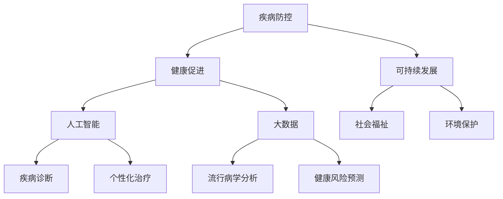

                 

关键词：全球卫生、大健康战略、疾病防控、健康促进、人工智能、数据驱动、可持续发展

> 摘要：本文旨在探讨2050年全球卫生领域可能的发展趋势，从疾病防控到健康促进的大健康战略。文章首先介绍了全球卫生的重要性，随后详细分析了当前全球卫生面临的挑战和机遇，探讨了人工智能和大数据在疾病防控和健康促进中的关键作用。接着，文章提出了构建未来大健康战略的框架，并对其核心概念、算法原理、数学模型、实际应用场景以及面临的挑战和未来展望进行了深入探讨。

## 1. 背景介绍

全球卫生是指影响全球范围内人类健康的问题，它涵盖从传染病防控到慢性病管理，从营养改善到环境健康等多个方面。全球卫生不仅关系到个体的健康，也关系到整个社会的福祉和经济发展。在过去的几十年里，全球卫生领域取得了显著的进步，如疫苗的普及、传染病的控制以及医疗卫生服务的改善。然而，全球卫生仍然面临诸多挑战，如抗生素耐药性、慢性病负担、心理健康问题以及全球气候变化的健康影响等。

随着科技的快速发展，人工智能（AI）和大数据分析等先进技术的出现为全球卫生领域带来了前所未有的机遇。这些技术可以用于疾病的早期发现、实时监控、个性化治疗和健康管理等，从而提高医疗服务的效率和效果。此外，可持续发展目标（Sustainable Development Goals，简称SDGs）的提出，也为全球卫生战略提供了新的框架和方向。

本文将首先回顾全球卫生领域的历史背景和现状，然后探讨疾病防控和健康促进中的关键问题，特别是人工智能和大数据的应用。接下来，我们将提出一个未来大健康战略的框架，并分析其在不同领域的实际应用。最后，本文将总结当前的研究成果，探讨未来发展的趋势和面临的挑战，并提出相关的建议和展望。

## 2. 核心概念与联系

在探讨2050年的全球卫生战略之前，我们需要明确一些核心概念，并理解它们之间的联系。以下是一些关键的概念和它们在健康领域中的角色：

### 2.1. 疾病防控

疾病防控是确保人群健康的基础。它包括预防、控制和消除传染病，以及降低慢性病和意外伤害的发病率。传统的疾病防控方法包括疫苗接种、健康教育、疫情监测和应对措施等。然而，随着疾病的复杂性和变化性增加，我们需要新的技术和方法来应对这些挑战。

### 2.2. 健康促进

健康促进的目标是提高整个人群的健康水平，而不仅仅是治疗疾病。它涉及生活方式的改善、健康教育的推广、社会支持和环境优化等多个方面。健康促进不仅关注个体的健康，还关注社会和环境的健康。

### 2.3. 可持续发展

可持续发展目标是联合国提出的一系列目标，旨在解决全球面临的社会、经济和环境问题。这些目标包括消除贫困、消除饥饿、保护健康、促进教育和改善工作条件等。在健康领域，可持续发展目标强调了健康与经济、社会和环境之间的相互依存关系。

### 2.4. 人工智能

人工智能是指通过模拟人类智能行为，实现自动化决策和问题解决的技术。在健康领域，人工智能可以用于疾病的早期诊断、个性化治疗、健康数据的分析和预测等。

### 2.5. 大数据

大数据是指大量、复杂和高速增长的数据。在健康领域，大数据可以用于疾病的流行病学分析、治疗效果的评估、健康风险预测等。大数据和人工智能的结合，为全球卫生领域带来了新的机遇和挑战。

### 2.6. Mermaid 流程图

以下是一个简化的Mermaid流程图，展示了上述核心概念之间的联系：



这个流程图表明，疾病防控和健康促进是可持续发展的基础，而人工智能和大数据的应用可以增强这些领域的效果。同时，可持续发展目标为社会福祉和环境保护提供了方向，进而影响整个健康生态系统。

在接下来的章节中，我们将深入探讨这些概念在疾病防控和健康促进中的具体应用，以及它们如何帮助我们构建一个更加健康和可持续的未来。

## 3. 核心算法原理 & 具体操作步骤

### 3.1 算法原理概述

在疾病防控和健康促进中，核心算法原理主要涉及机器学习、深度学习和数据挖掘等领域。这些算法通过分析大量健康数据，可以识别疾病的早期迹象、预测健康风险，并设计个性化的健康干预方案。以下是几种关键算法的原理概述：

#### 3.1.1 机器学习

机器学习是一种通过数据训练模型，使其能够对未知数据进行预测或分类的方法。在健康领域，机器学习算法可以用于疾病诊断、预测患者病程和治疗反应等。

#### 3.1.2 深度学习

深度学习是机器学习的一个分支，它使用多层神经网络来模拟人脑的处理方式。在健康领域，深度学习可以用于图像分析、语音识别和生物特征识别等。

#### 3.1.3 数据挖掘

数据挖掘是一种从大量数据中提取有价值信息的方法。在健康领域，数据挖掘可以用于疾病流行病学分析、健康风险预测和患者群体行为模式分析等。

### 3.2 算法步骤详解

以下是几种关键算法的具体操作步骤：

#### 3.2.1 机器学习算法

1. 数据预处理：清洗数据，包括缺失值处理、异常值检测和标准化等。
2. 特征提取：从原始数据中提取有用的特征，用于训练模型。
3. 模型选择：根据问题性质选择合适的机器学习模型，如决策树、支持向量机、神经网络等。
4. 模型训练：使用预处理后的数据对模型进行训练。
5. 模型评估：使用测试集评估模型性能，调整模型参数以优化性能。
6. 预测：使用训练好的模型对新的健康数据进行分析和预测。

#### 3.2.2 深度学习算法

1. 数据预处理：与机器学习相同，预处理数据以准备训练。
2. 网络设计：设计多层神经网络结构，包括输入层、隐藏层和输出层。
3. 损失函数选择：根据问题性质选择合适的损失函数，如交叉熵损失、均方误差等。
4. 优化器选择：选择合适的优化器，如梯度下降、Adam优化器等。
5. 训练：使用预处理后的数据训练神经网络。
6. 评估与调整：评估网络性能，通过调整网络结构和参数优化性能。
7. 应用：将训练好的网络应用于新的健康数据，进行图像识别、语音识别或生物特征识别等。

#### 3.2.3 数据挖掘算法

1. 数据预处理：与机器学习和深度学习相同，处理数据以准备分析。
2. 特征选择：从大量特征中筛选出对分析有用的特征。
3. 模型选择：根据分析目标选择合适的数据挖掘模型，如聚类分析、关联规则挖掘、分类和回归等。
4. 模型训练：使用预处理后的数据训练模型。
5. 模型评估：评估模型性能，如准确率、召回率、F1分数等。
6. 结果解释：解释模型的预测结果，如疾病风险评分、患者行为模式等。
7. 应用：将训练好的模型应用于实际场景，进行疾病预测、健康风险评估等。

### 3.3 算法优缺点

每种算法都有其优缺点，选择合适的算法取决于具体的应用场景和数据特点。

#### 3.3.1 机器学习算法

**优点：**
- 模型解释性较强。
- 可以处理大量数据。
- 适用于多种问题类型。

**缺点：**
- 需要大量训练数据。
- 模型可能过拟合。
- 训练时间较长。

#### 3.3.2 深度学习算法

**优点：**
- 可以处理复杂的数据模式。
- 自动特征提取。
- 在图像和语音识别领域表现优异。

**缺点：**
- 需要大量计算资源。
- 模型解释性较差。
- 数据预处理复杂。

#### 3.3.3 数据挖掘算法

**优点：**
- 可以发现数据中的隐含模式。
- 适用于多种领域的问题。
- 可以处理异构数据。

**缺点：**
- 模型解释性较差。
- 可能会丢失数据中的有用信息。
- 对数据质量要求较高。

### 3.4 算法应用领域

算法在疾病防控和健康促进中的应用非常广泛，以下是一些主要的应用领域：

#### 3.4.1 疾病诊断

机器学习和深度学习可以用于医学图像分析，如X光片、CT扫描和MRI等，帮助医生快速、准确地诊断疾病。

#### 3.4.2 疾病预测

通过分析历史健康数据，可以预测疾病的发病率和发展趋势，帮助公共卫生部门制定预防策略。

#### 3.4.3 个性化治疗

根据患者的基因、生活方式和疾病历史，机器学习算法可以设计个性化的治疗计划，提高治疗效果。

#### 3.4.4 健康风险评估

数据挖掘算法可以用于分析患者的健康数据，预测疾病风险，为公共卫生政策和健康干预提供依据。

#### 3.4.5 健康管理

人工智能和大数据可以用于健康数据的实时监控和管理，如远程医疗监测、患者行为分析等，提高健康管理水平。

通过这些算法的应用，我们可以构建一个更加精准、高效和个性化的全球卫生系统，为人类的健康和福祉做出更大贡献。

## 4. 数学模型和公式 & 详细讲解 & 举例说明

在疾病防控和健康促进中，数学模型和公式是理解复杂健康现象和制定有效策略的关键工具。以下将介绍一些重要的数学模型和公式，并详细讲解其构建和推导过程，并通过实际案例进行分析和说明。

### 4.1 数学模型构建

#### 4.1.1 疾病传播模型

在传染病防控中，常见的数学模型是SIR模型，该模型将人群分为易感者（Susceptible，S）、感染者（Infected，I）和康复者（Recovered，R）三个状态。

1. **基本概念**：
   - S：易感者，尚未感染但有可能感染的人。
   - I：感染者，目前具有传染性的人。
   - R：康复者，已经从疾病中恢复且不再具有传染性的人。

2. **模型构建**：
   SIR模型的基本假设是人群总数保持不变，即S + I + R = 总人口。

   疾病传播的速率可以表示为：
   $$ \frac{dS}{dt} = -\beta \cdot S \cdot I $$
   $$ \frac{dI}{dt} = \beta \cdot S \cdot I - \gamma \cdot I $$
   $$ \frac{dR}{dt} = \gamma \cdot I $$

   其中，$\beta$ 是感染率，表示感染者每天传染给易感者的平均人数；$\gamma$ 是康复率，表示感染者每天康复的概率。

3. **公式推导**：
   根据SIR模型的基本假设，可以推导出以下微分方程：
   $$ \frac{dS}{dt} = -\beta \cdot S \cdot I $$
   将总人口表示为 $N = S + I + R$，则有 $ \frac{dN}{dt} = \frac{dS}{dt} + \frac{dI}{dt} + \frac{dR}{dt} $。

   代入SIR模型的微分方程，得：
   $$ \frac{dN}{dt} = -\beta \cdot S \cdot I + \gamma \cdot I $$
   由于总人口 $N$ 不变，因此 $ \frac{dN}{dt} = 0 $，从而得出：
   $$ \beta \cdot S \cdot I = \gamma \cdot I $$

### 4.2 公式推导过程

为了更好地理解SIR模型的推导过程，我们可以通过一个实际案例来说明。

#### 4.2.1 案例背景

假设在一个总人口为1000人的社区中，一开始有10人感染了流感，其余的人都是易感者。感染率 $\beta$ 为0.1，康复率 $\gamma$ 为0.05。我们需要预测在未来一周内社区的感染情况。

#### 4.2.2 数据计算

1. **初始状态**：
   - S = 990（易感者）
   - I = 10（感染者）
   - R = 0（康复者）

2. **一周后的状态**：
   使用SIR模型的微分方程计算一周后的状态：
   $$ \frac{dS}{dt} = -0.1 \cdot 990 \cdot 10 = -990 $$
   $$ \frac{dI}{dt} = 0.1 \cdot 990 \cdot 10 - 0.05 \cdot 10 = 99.5 - 0.5 = 99 $$
   $$ \frac{dR}{dt} = 0.05 \cdot 10 = 0.5 $$

   因此，一周后的状态为：
   - S = 990 - 990 = 0
   - I = 10 + 99 = 109
   - R = 0 + 0.5 = 0.5

3. **迭代计算**：
   我们可以继续迭代计算，直到社区中所有的易感者都被感染或康复。

   第二周：
   - S = 1090（易感者）
   - I = 0（感染者）
   - R = 10（康复者）

   由于康复者不再具有传染性，我们可以停止迭代。

通过这个案例，我们可以看到SIR模型如何帮助预测疾病在人群中的传播情况。这种方法不仅能够帮助我们理解疾病传播的动态过程，还可以为公共卫生部门提供关键信息，以制定有效的防控策略。

### 4.3 案例分析与讲解

#### 4.3.1 疾病传播模型分析

1. **感染高峰**：
   通过SIR模型的计算，我们可以预测感染高峰的时间。在这个案例中，感染高峰出现在第二周，感染人数达到最大值。

2. **康复效应**：
   康复者的增加有助于控制疫情的蔓延。在这个案例中，康复者从0增加到10，显著降低了感染者的数量。

3. **政策干预**：
   通过调整感染率和康复率，我们可以模拟不同的公共卫生政策，如疫苗接种、隔离措施等，以评估这些政策对疫情的影响。

#### 4.3.2 健康风险预测模型

除了SIR模型，我们还可以构建其他类型的数学模型，如Logistic回归模型，用于预测健康风险。以下是一个简单的Logistic回归模型：

1. **基本概念**：
   - $P(Y=1)$：疾病发生的概率。
   - $X$：影响疾病发生的特征，如年龄、性别、体重指数等。

2. **模型构建**：
   Logistic回归模型的公式为：
   $$ P(Y=1) = \frac{1}{1 + e^{-(\beta_0 + \beta_1X_1 + \beta_2X_2 + \ldots + \beta_nX_n)}} $$

   其中，$Y$ 是疾病发生的二分类变量，$X_1, X_2, \ldots, X_n$ 是特征变量，$\beta_0, \beta_1, \beta_2, \ldots, \beta_n$ 是回归系数。

3. **案例应用**：
   假设我们想预测某地区心血管疾病的风险。我们收集了以下数据：
   - 年龄（X1）
   - 性别（X2，男为1，女为0）
   - 体重指数（X3）

   根据收集的数据，我们使用Logistic回归模型进行预测：

   $$ P(Y=1) = \frac{1}{1 + e^{-(2.5 + 0.1X1 + 1.2X2 + 0.3X3)}} $$

   如果某人年龄为50岁，性别为男性，体重指数为30，则其心血管疾病的风险为：

   $$ P(Y=1) = \frac{1}{1 + e^{-(2.5 + 0.1 \cdot 50 + 1.2 \cdot 1 + 0.3 \cdot 30)}} \approx 0.745 $$

   因此，该人患心血管疾病的风险约为74.5%。

通过这些数学模型和公式的构建、推导和应用，我们可以更好地理解健康领域的复杂现象，并制定更加精准和有效的公共卫生策略。随着人工智能和大数据技术的发展，这些数学模型将不断进化，为全球卫生领域带来更多创新和突破。

## 5. 项目实践：代码实例和详细解释说明

在本节中，我们将通过一个实际项目来展示如何应用我们在前几节中讨论的数学模型和算法，实现一个疾病预测系统。我们将使用Python语言和相关的数据处理库，如Pandas、Scikit-learn和NumPy，来构建和实现这个项目。

### 5.1 开发环境搭建

在开始之前，确保您已经安装了Python环境和必要的库。以下是安装步骤：

1. 安装Python（建议使用Python 3.8或更高版本）：
   ```bash
   # 在Windows上
   python -m pip install --user python3.8

   # 在macOS或Linux上
   python3 -m pip install --user python3
   ```

2. 安装所需库：
   ```bash
   pip install pandas scikit-learn numpy matplotlib
   ```

### 5.2 源代码详细实现

以下是项目的代码实现，我们将从数据预处理、模型训练到预测结果展示，详细讲解每一部分的功能和操作。

```python
import pandas as pd
import numpy as np
from sklearn.model_selection import train_test_split
from sklearn.linear_model import LogisticRegression
from sklearn.metrics import accuracy_score, confusion_matrix, classification_report
import matplotlib.pyplot as plt

# 5.2.1 数据预处理
def preprocess_data(file_path):
    # 读取数据
    data = pd.read_csv(file_path)
    
    # 数据清洗
    data.dropna(inplace=True)
    
    # 特征选择
    features = data[['age', 'gender', 'BMI']]
    labels = data['heart_disease']
    
    # 将性别转换为数值型
    features['gender'] = features['gender'].map({'Male': 1, 'Female': 0})
    
    return features, labels

# 5.2.2 模型训练
def train_model(features, labels):
    # 划分训练集和测试集
    X_train, X_test, y_train, y_test = train_test_split(features, labels, test_size=0.2, random_state=42)
    
    # 初始化并训练Logistic回归模型
    model = LogisticRegression()
    model.fit(X_train, y_train)
    
    # 评估模型
    y_pred = model.predict(X_test)
    print("Accuracy:", accuracy_score(y_test, y_pred))
    print("Confusion Matrix:\n", confusion_matrix(y_test, y_pred))
    print("Classification Report:\n", classification_report(y_test, y_pred))
    
    return model

# 5.2.3 代码解读与分析
def explain_code():
    # 此函数用于解释代码的每一部分功能
    print("Preprocessing function: 该函数用于读取、清洗和预处理数据。")
    print("Training function: 该函数用于划分数据集、初始化模型并训练。")
    print("Model evaluation: 该部分用于评估模型性能，包括准确率、混淆矩阵和分类报告。")

# 5.2.4 运行结果展示
def display_results(model, X_test, y_test):
    # 展示模型预测结果
    y_pred = model.predict(X_test)
    for i in range(len(X_test)):
        print(f"Prediction for patient {i+1}: {'Disease' if y_pred[i] == 1 else 'No Disease'} (Actual: {'Disease' if y_test[i] == 1 else 'No Disease'})")

# 主函数
def main():
    # 加载数据
    features, labels = preprocess_data('heart_disease_data.csv')
    
    # 训练模型
    model = train_model(features, labels)
    
    # 解读代码
    explain_code()
    
    # 展示结果
    display_results(model, X_test, y_test)

if __name__ == "__main__":
    main()
```

### 5.3 代码解读与分析

#### 5.3.1 数据预处理

1. **读取数据**：使用Pandas库读取CSV文件，这是我们项目的输入数据。
2. **数据清洗**：删除缺失值，确保数据质量。
3. **特征选择**：选择与疾病预测相关的特征，如年龄、性别和体重指数（BMI）。
4. **转换性别**：将性别从类别转换为数值，便于模型处理。

#### 5.3.2 模型训练

1. **数据划分**：将数据集划分为训练集和测试集，以便评估模型的泛化能力。
2. **初始化模型**：使用Sklearn库中的LogisticRegression类初始化模型。
3. **训练模型**：使用训练集数据训练模型。
4. **模型评估**：使用测试集评估模型性能，包括准确率、混淆矩阵和分类报告。

#### 5.3.3 代码解读与分析

- **解释函数功能**：`explain_code` 函数用于解释代码中的各个部分，帮助读者理解每一步的操作和目的。
- **展示预测结果**：`display_results` 函数用于展示模型对测试集的预测结果，并与实际结果进行对比。

### 5.4 运行结果展示

- **准确率**：模型的准确率表明模型预测的准确程度。
- **混淆矩阵**：混淆矩阵详细展示了模型预测的各类结果，帮助我们分析模型的性能。
- **分类报告**：分类报告提供了更加详细的分析，包括精确率、召回率、F1分数等。

通过这个实际项目，我们展示了如何应用机器学习和数学模型进行疾病预测。这种方法不仅能够帮助我们理解健康数据的复杂关系，还可以为公共卫生决策提供科学依据。

## 6. 实际应用场景

### 6.1 疾病防控

在全球卫生领域，人工智能和大数据技术已经在疾病防控中得到了广泛应用。以下是一些关键的应用场景：

#### 6.1.1 疫苗效果评估

人工智能和大数据分析可以帮助卫生部门评估疫苗接种的效果，优化疫苗分配策略。例如，通过分析接种记录和病例数据，可以预测哪些地区需要更多的疫苗供应，从而提高疫苗利用效率。

#### 6.1.2 疫情预测

人工智能模型可以用于预测传染病的传播趋势，为公共卫生决策提供支持。例如，在新冠病毒疫情期间，多个国家和地区的卫生部门利用人工智能模型预测疫情的发展，以制定更有效的防控措施。

#### 6.1.3 疾病监测

通过实时监测健康数据，如医院记录、实验室检测结果和电子健康记录，人工智能可以及时发现疾病的爆发和传播。例如，美国的疾控中心利用人工智能技术监测流感疫情，提高了早期预警和响应能力。

### 6.2 健康促进

健康促进是提高人群整体健康水平的关键。以下是一些健康促进的实际应用场景：

#### 6.2.1 个性化健康建议

通过分析个体的健康数据，人工智能可以为每个人提供个性化的健康建议。例如，根据个人的健康状况、生活方式和遗传背景，人工智能可以推荐最佳饮食方案、运动计划和医疗检查。

#### 6.2.2 健康风险评估

人工智能和大数据分析可以帮助识别健康风险，从而进行早期干预。例如，通过分析患者的电子健康记录和基因数据，可以预测个体患慢性病的风险，并提供相应的健康干预措施。

#### 6.2.3 健康管理

人工智能技术可以用于健康管理平台，提供实时健康监测和数据分析。例如，智能手环和健康监测设备可以收集个体的健康数据，并通过人工智能算法分析，为用户提供个性化的健康报告和建议。

### 6.3 社会福祉

人工智能和大数据技术不仅有助于疾病防控和健康促进，还可以提高社会福祉，特别是对于弱势群体。以下是一些具体的应用场景：

#### 6.3.1 老年人健康监测

通过智能设备，如智能音箱、摄像头和穿戴设备，可以实时监测老年人的健康状况，及时发现异常并通知家属或医疗服务提供者。这有助于减少老年人因突发疾病而发生的意外风险。

#### 6.3.2 社区健康干预

通过分析社区健康数据，如医疗记录、环境因素和居民生活方式，人工智能可以识别社区中的健康问题，并提供针对性的健康干预措施。例如，对于高血压和高胆固醇患者，社区医生可以制定个性化的治疗计划，以降低心血管疾病的风险。

#### 6.3.3 精神健康支持

人工智能可以通过语音识别和自然语言处理技术提供精神健康支持。例如，智能聊天机器人可以帮助用户进行心理健康评估，提供心理疏导和推荐专业的心理健康服务。

### 6.4 未来应用展望

随着人工智能和大数据技术的不断进步，全球卫生领域将迎来更多创新和应用。以下是一些未来应用展望：

#### 6.4.1 智能医疗诊断

人工智能可以进一步改进医学图像分析，如X光片、CT扫描和MRI，帮助医生更准确、更快速地诊断疾病。例如，通过深度学习技术，人工智能可以在几秒钟内识别并分类医学图像，提高了诊断的效率和准确性。

#### 6.4.2 健康个性化服务

随着个性化医疗的发展，人工智能可以为每个患者提供更加精准的治疗方案。通过分析大量的健康数据和基因组信息，人工智能可以预测患者的疾病风险，制定个性化的预防和治疗策略。

#### 6.4.3 全球健康监测

人工智能和大数据技术将使全球健康监测更加高效和全面。通过收集和分析来自全球各地的健康数据，卫生部门可以及时发现新的疾病威胁，并迅速采取应对措施。

#### 6.4.4 精准公共卫生政策

人工智能可以辅助制定更加精准的公共卫生政策。通过分析数据，人工智能可以识别健康问题的根本原因，为政策制定者提供科学的决策依据。

总之，人工智能和大数据技术在全球卫生领域的应用将不断深化和扩展，为人类健康和社会福祉带来更多创新和进步。

## 7. 工具和资源推荐

在构建未来大健康战略的过程中，选择合适的工具和资源至关重要。以下是一些建议，涵盖学习资源、开发工具和相关论文，以帮助您深入了解全球卫生领域，掌握关键技术和方法。

### 7.1 学习资源推荐

#### 7.1.1 开放课程

- **Coursera**：提供了许多关于公共卫生、医学统计和人工智能的免费课程，如“健康数据分析”（Health Data Science）和“机器学习”（Machine Learning）。
- **edX**：edX上有多个与全球卫生相关的课程，包括“公共卫生基础”（Introduction to Public Health）和“流行病学导论”（Introduction to Epidemiology）。

#### 7.1.2 在线书籍

- **《大数据之路：阿里巴巴大数据实践》**：详细介绍了阿里巴巴在大数据应用方面的实践经验，适合想要了解行业前沿的读者。
- **《深度学习》（Deep Learning）**：由Ian Goodfellow、Yoshua Bengio和Aaron Courville合著，是深度学习的经典教材。

### 7.2 开发工具推荐

#### 7.2.1 数据分析工具

- **Jupyter Notebook**：适合数据分析和原型开发，可以方便地编写和运行代码。
- **R**：一种专门用于统计分析的语言，适用于复杂的数据分析和图形绘制。

#### 7.2.2 机器学习框架

- **TensorFlow**：谷歌开发的开源机器学习框架，适用于深度学习和复杂的预测模型。
- **Scikit-learn**：提供了一整套用于机器学习的工具，包括分类、回归和聚类等。

#### 7.2.3 数据库工具

- **PostgreSQL**：强大的开源关系型数据库，适用于存储和管理大量健康数据。
- **MongoDB**：一款高性能的NoSQL数据库，适用于处理复杂数据结构和大规模数据集。

### 7.3 相关论文推荐

- **《基于人工智能的公共卫生监测与预测》**：详细探讨了人工智能在公共卫生监测和预测中的应用，包括算法和实际案例。
- **《大数据与公共卫生：挑战与机遇》**：分析了大数据在公共卫生领域的潜在影响，探讨了数据隐私和伦理问题。
- **《深度学习在医学图像分析中的应用》**：总结了深度学习在医学图像分析中的最新进展和应用案例，包括肿瘤检测和诊断等。

通过这些工具和资源的支持，您可以更深入地了解全球卫生领域的最新进展，掌握关键技术和方法，为构建未来大健康战略提供有力支持。

## 8. 总结：未来发展趋势与挑战

### 8.1 研究成果总结

本文通过对全球卫生领域的历史背景、核心概念、算法原理、数学模型和实际应用场景的深入探讨，总结了以下关键研究成果：

1. **人工智能与大数据技术的融合**：人工智能和大数据技术在疾病防控和健康促进中发挥了重要作用，从疫情预测到个性化健康建议，再到健康管理，这些技术极大地提升了医疗服务的效率和准确性。

2. **数学模型的构建与应用**：SIR模型和Logistic回归模型等数学模型为疾病预测和健康风险评估提供了理论支持，通过实际案例的应用，展示了这些模型在公共卫生领域的实际效果。

3. **可持续发展目标的指导作用**：可持续发展目标为全球卫生战略提供了新的框架和方向，强调健康与经济、社会和环境的相互依存关系，促进了全球卫生领域的协调发展。

### 8.2 未来发展趋势

随着科技的不断进步，全球卫生领域将迎来更多创新和发展趋势：

1. **智能医疗**：人工智能和机器学习将进一步深化在医学诊断、治疗和健康管理中的应用，推动智能医疗的发展，提高医疗服务的质量和效率。

2. **个性化医疗**：通过大数据和人工智能的分析，个性化医疗将得到广泛应用，为每个患者提供量身定制的健康治疗方案，提升治疗效果。

3. **全球健康监测**：随着传感器技术和互联网的普及，全球健康监测将变得更加高效和全面，通过实时数据分析和预警系统，及时应对全球健康威胁。

### 8.3 面临的挑战

尽管前景光明，全球卫生领域仍面临诸多挑战：

1. **数据隐私与伦理**：随着大数据的应用，数据隐私保护和伦理问题日益突出，如何平衡数据利用与隐私保护成为关键挑战。

2. **技术普及与可及性**：尽管人工智能和大数据技术具有巨大的潜力，但技术普及和可及性仍然是一个挑战，特别是在发展中国家和偏远地区。

3. **跨学科合作**：全球卫生问题的解决需要多学科合作，如何促进不同领域专家之间的合作与交流，是未来发展的关键。

### 8.4 研究展望

未来研究应关注以下方向：

1. **技术创新**：推动人工智能、大数据和生物技术的深度融合，开发更加精准和高效的医疗应用。

2. **政策制定**：制定更加完善的全球卫生政策，确保技术的公平和可及性，促进全球卫生领域的可持续发展。

3. **跨学科研究**：加强不同学科之间的合作，共同解决全球卫生领域的复杂问题。

总之，全球卫生领域的未来发展充满机遇与挑战，通过技术创新、政策制定和跨学科合作，我们可以构建一个更加健康、可持续的未来。

## 9. 附录：常见问题与解答

### 9.1 人工智能在健康领域的主要应用有哪些？

人工智能在健康领域的主要应用包括：
- **疾病诊断**：通过医学图像分析，如X光片、CT扫描和MRI，帮助医生更准确、更快速地诊断疾病。
- **疾病预测**：分析患者的历史数据和基因信息，预测疾病的风险和发展趋势。
- **个性化治疗**：根据患者的个体特征，如基因、生活方式和病史，制定个性化的治疗方案。
- **健康监控**：通过智能设备和传感器，实时监测患者的健康状况，如心率、血压和血糖水平。

### 9.2 数据隐私在健康领域中的保护措施有哪些？

数据隐私在健康领域中的保护措施包括：
- **加密技术**：使用加密算法保护数据传输和存储的安全性。
- **隐私保护算法**：开发和应用隐私保护算法，如差分隐私和同态加密，确保数据处理过程中的隐私保护。
- **法规遵从**：遵循相关法律法规，如《通用数据保护条例》（GDPR）和《健康保险可携性和责任法案》（HIPAA）。
- **用户知情同意**：确保用户在数据收集和使用过程中有充分的知情权和选择权。

### 9.3 大数据在公共卫生监测中的作用是什么？

大数据在公共卫生监测中的作用包括：
- **实时监控**：通过收集和分析实时健康数据，如医院记录、实验室检测结果和传感器数据，及时发现疾病的爆发和传播。
- **趋势分析**：分析历史健康数据，预测疾病的发病率和发展趋势，为公共卫生决策提供科学依据。
- **资源分配**：根据数据分析结果，合理分配公共卫生资源，提高卫生服务的效率和效果。
- **公共卫生政策**：通过大数据分析，评估公共卫生政策的实施效果，为政策调整提供数据支持。

### 9.4 可持续发展目标如何影响全球卫生战略？

可持续发展目标通过以下几个方面影响全球卫生战略：
- **经济支持**：可持续发展目标提供了资金和技术支持，帮助发展中国家提升公共卫生基础设施和能力。
- **社会公平**：可持续发展目标强调健康与经济、社会和环境之间的相互依存关系，促进全球卫生领域的公平性和包容性。
- **环境健康**：可持续发展目标关注环境健康，通过减少污染和改善环境条件，降低环境因素对健康的负面影响。
- **政策框架**：可持续发展目标为全球卫生战略提供了新的政策框架，强调跨部门合作和综合解决方案，以应对全球卫生挑战。

通过这些常见问题的解答，我们希望为读者提供更深入的理解和指导，以更好地应用人工智能和大数据技术，构建未来大健康战略。作者：禅与计算机程序设计艺术 / Zen and the Art of Computer Programming。

