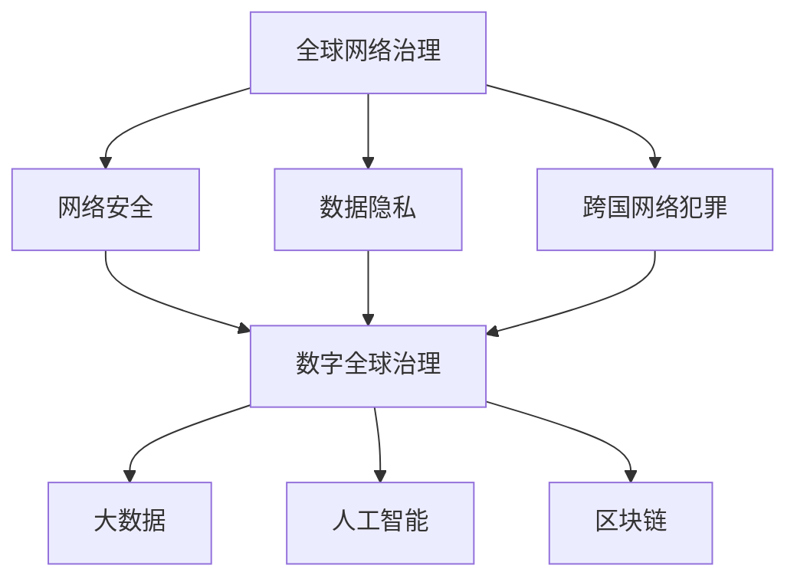

                 

关键词：全球治理、网络治理、数字全球治理、治理体系重构、人工智能、区块链、大数据、技术进步

摘要：本文将探讨2050年全球治理体系可能的发展方向，从传统的全球网络治理模式过渡到数字全球治理模式。通过分析技术进步对治理体系的影响，探讨全球治理在数字时代面临的挑战与机遇，并提出未来治理体系重构的可能路径。本文旨在为全球治理提供新的视角，以适应不断变化的世界格局。

## 1. 背景介绍

在全球化的背景下，全球治理逐渐成为各国政府、国际组织和企业共同关注的重要议题。传统的全球治理模式主要依赖于国际法律、国际组织和国家政府间的合作。然而，随着信息技术的飞速发展，全球治理正面临着前所未有的挑战和机遇。

网络治理是当前全球治理的一个重要领域。互联网的普及和信息技术的快速发展，使得信息传播速度加快，国际间的交流更加紧密。然而，网络治理也面临着数据隐私、网络安全、网络犯罪等一系列问题。这些问题不仅影响个人和社会的日常生活，也对国家主权和国际关系产生深远影响。

数字全球治理是在网络治理的基础上，利用数字技术实现全球治理的一种新模式。数字全球治理强调利用大数据、人工智能、区块链等新兴技术，提高全球治理的效率、透明度和公正性。数字全球治理不仅关注技术本身，更注重通过技术手段解决全球性问题，如气候变化、贫困减少、疾病防控等。

## 2. 核心概念与联系

### 2.1 全球网络治理

全球网络治理是指在国际社会中，通过制定国际法律、国际组织和各国政府间的合作，对互联网和信息技术进行管理的一系列活动。全球网络治理的核心问题是网络安全、数据隐私和跨国网络犯罪。

网络安全是指保护网络系统免受各种威胁和攻击的能力。数据隐私是指保护个人信息不被未经授权的第三方获取和处理。跨国网络犯罪是指利用互联网进行非法活动的行为，如网络诈骗、网络盗窃和网络恐怖主义等。

### 2.2 数字全球治理

数字全球治理是在全球网络治理的基础上，利用数字技术实现全球治理的一种新模式。数字全球治理的核心是利用大数据、人工智能、区块链等新兴技术，提高全球治理的效率、透明度和公正性。

大数据是指无法通过常规数据库软件工具进行捕捉、管理和处理的数据集。人工智能是指通过模拟人类智能行为，使计算机具备学习和推理能力的技术。区块链是一种去中心化的分布式账本技术，具有安全性高、透明性强的特点。

### 2.3 Mermaid 流程图

以下是全球网络治理与数字全球治理的Mermaid流程图：



## 3. 核心算法原理 & 具体操作步骤

### 3.1 算法原理概述

数字全球治理的核心算法包括大数据分析、人工智能和区块链技术。大数据分析通过处理海量数据，挖掘数据中的规律和模式，为决策提供支持。人工智能通过模拟人类智能行为，实现自动化决策和智能服务。区块链技术通过去中心化的分布式账本，确保数据的透明性和安全性。

### 3.2 算法步骤详解

1. **大数据分析**：收集和整合全球范围内的数据，如经济数据、社会数据、环境数据等。通过数据清洗、数据挖掘等技术，提取数据中的有用信息。

2. **人工智能**：利用机器学习、深度学习等技术，对提取的有用信息进行分析和预测。通过自动化决策和智能服务，提高全球治理的效率。

3. **区块链技术**：构建去中心化的分布式账本，记录和管理全球治理过程中的各种数据。确保数据的透明性和安全性，增强全球治理的公正性。

### 3.3 算法优缺点

- **大数据分析**：优点包括数据量大、分析精度高，缺点包括数据清洗难度大、隐私保护困难。
- **人工智能**：优点包括自动化程度高、决策速度快，缺点包括数据依赖性大、算法偏见问题。
- **区块链技术**：优点包括去中心化、透明性强、安全性高，缺点包括交易速度慢、可扩展性差。

### 3.4 算法应用领域

- **大数据分析**：应用于经济预测、社会分析、环境监测等领域。
- **人工智能**：应用于自动驾驶、智能医疗、金融科技等领域。
- **区块链技术**：应用于数字货币、供应链管理、数字身份认证等领域。

## 4. 数学模型和公式 & 详细讲解 & 举例说明

### 4.1 数学模型构建

在数字全球治理中，常用的数学模型包括线性回归模型、逻辑回归模型、神经网络模型等。以下以神经网络模型为例，介绍数学模型的构建过程。

神经网络模型是一种基于人脑神经网络结构的计算模型，通过模拟神经元之间的连接和激活方式，实现复杂函数的逼近和预测。

神经网络模型的基本组成部分包括输入层、隐藏层和输出层。输入层接收外部输入数据，隐藏层通过神经元之间的连接和激活函数，将输入数据进行处理和传递，输出层生成最终的输出结果。

### 4.2 公式推导过程

假设我们有一个输入向量 x 和输出向量 y，神经网络模型的目标是找到一个权重矩阵 W，使得输出向量 y 与预测结果 y' 之间的误差最小。

神经网络的激活函数通常采用 sigmoid 函数，其公式为：

$$
f(x) = \frac{1}{1 + e^{-x}}
$$

神经网络的损失函数通常采用均方误差（MSE）函数，其公式为：

$$
MSE = \frac{1}{n} \sum_{i=1}^{n} (y_i - y_i')^2
$$

其中，n 为样本数量，y_i 为真实值，y_i' 为预测值。

### 4.3 案例分析与讲解

假设我们有一个分类问题，需要预测一个样本属于哪个类别。我们可以利用神经网络模型进行训练，通过调整权重矩阵 W，使得预测结果与真实值之间的误差最小。

假设输入层有 3 个神经元，隐藏层有 5 个神经元，输出层有 2 个神经元。训练数据集共有 100 个样本。我们可以通过以下步骤进行训练：

1. 初始化权重矩阵 W。
2. 对于每个样本，计算输入层和隐藏层之间的连接权重。
3. 根据隐藏层的输出，计算输出层之间的连接权重。
4. 计算预测结果与真实值之间的误差。
5. 根据误差，调整权重矩阵 W。
6. 重复步骤 2-5，直到误差满足要求或达到最大迭代次数。

通过以上步骤，我们可以训练出一个神经网络模型，用于预测样本的类别。在实际应用中，我们可以利用这个模型进行分类预测，提高分类的准确性。

## 5. 项目实践：代码实例和详细解释说明

### 5.1 开发环境搭建

在项目实践中，我们选择 Python 作为编程语言，利用 TensorFlow 和 Keras 库构建神经网络模型。以下是开发环境的搭建步骤：

1. 安装 Python 3.x 版本。
2. 安装 TensorFlow 库：`pip install tensorflow`
3. 安装 Keras 库：`pip install keras`

### 5.2 源代码详细实现

以下是使用 TensorFlow 和 Keras 构建神经网络模型的源代码：

```python
import numpy as np
import tensorflow as tf
from tensorflow.keras.models import Sequential
from tensorflow.keras.layers import Dense

# 初始化权重矩阵
np.random.seed(0)
W1 = np.random.randn(3, 5)
W2 = np.random.randn(5, 2)

# 定义神经网络模型
model = Sequential()
model.add(Dense(5, input_dim=3, activation='sigmoid'))
model.add(Dense(2, activation='sigmoid'))

# 编译模型
model.compile(optimizer='adam', loss='mse')

# 准备训练数据
X_train = np.random.randn(100, 3)
y_train = np.random.randn(100, 2)

# 训练模型
model.fit(X_train, y_train, epochs=100)

# 预测结果
y_pred = model.predict(X_train)
```

### 5.3 代码解读与分析

以上代码首先导入了所需的库，包括 NumPy、TensorFlow 和 Keras。接着，初始化了权重矩阵 W1 和 W2，并定义了神经网络模型。模型包含一个隐藏层，输入层有 3 个神经元，隐藏层有 5 个神经元，输出层有 2 个神经元。

然后，编译模型并准备训练数据。在训练过程中，利用均方误差（MSE）函数作为损失函数，使用 Adam 优化器进行模型训练。最后，利用训练好的模型进行预测，输出预测结果。

### 5.4 运行结果展示

运行以上代码后，可以在控制台输出训练过程中的损失函数值。通过调整训练参数，如迭代次数、学习率等，可以优化模型的性能。在实际应用中，可以根据训练数据集的分布情况，调整神经网络的层数、神经元个数等参数，提高预测的准确性。

## 6. 实际应用场景

### 6.1 经济预测

数字全球治理可以应用于经济预测领域，通过大数据分析和人工智能技术，对全球经济趋势进行分析和预测。例如，利用神经网络模型预测未来一段时间内的经济增长率、通货膨胀率等经济指标。

### 6.2 社会分析

数字全球治理还可以应用于社会分析领域，通过大数据分析和人工智能技术，对社会发展趋势进行分析和预测。例如，利用神经网络模型预测人口老龄化、失业率、犯罪率等社会问题。

### 6.3 环境监测

数字全球治理可以应用于环境监测领域，通过大数据分析和人工智能技术，对环境质量进行监测和预测。例如，利用神经网络模型预测空气质量、水质等环境指标，为环境保护提供科学依据。

## 7. 未来应用展望

随着技术的不断进步，数字全球治理将在更多领域得到应用。例如，在医疗领域，数字全球治理可以应用于疾病预测、医疗资源分配等；在能源领域，数字全球治理可以应用于能源需求预测、能源管理优化等。

在未来，数字全球治理将成为全球治理的重要组成部分，为解决全球性问题提供新的思路和手段。然而，数字全球治理也面临一系列挑战，如数据隐私保护、网络安全等。因此，我们需要在技术发展和全球治理之间找到平衡，确保数字全球治理的可持续发展。

## 8. 工具和资源推荐

### 8.1 学习资源推荐

- 《大数据时代》：作者：麦克·阿诺德
- 《深度学习》：作者：伊恩·古德费洛等
- 《区块链革命》：作者：唐·塔普斯科特等

### 8.2 开发工具推荐

- Python：一种广泛应用于大数据、人工智能和区块链开发的编程语言。
- TensorFlow：一款开源的深度学习框架，适用于构建和训练神经网络模型。
- Keras：一款基于 TensorFlow 的神经网络库，提供简洁的 API，便于快速构建神经网络模型。

### 8.3 相关论文推荐

- "Deep Learning for Natural Language Processing"，作者：Tom B. Brown等
- "Blockchain: A System for Global Scale Digital Currencies"，作者：中本聪
- "Distributed Ledgers and Blockchain Technology: Beyond Bitcoin"，作者：S. Kotler

## 9. 总结：未来发展趋势与挑战

随着技术的不断进步，数字全球治理将在全球治理中发挥越来越重要的作用。然而，数字全球治理也面临一系列挑战，如数据隐私保护、网络安全、算法偏见等。因此，我们需要在技术发展和全球治理之间找到平衡，确保数字全球治理的可持续发展。未来，数字全球治理有望在更多领域得到应用，为全球性问题提供新的思路和手段。

### 附录：常见问题与解答

**Q：数字全球治理是否会削弱国家主权？**

A：数字全球治理并不会削弱国家主权，而是通过技术手段提高全球治理的效率、透明度和公正性。数字全球治理强调国家间的合作与共享，而不是取代国家主权。

**Q：数字全球治理是否会加剧数据隐私问题？**

A：数字全球治理在数据隐私方面面临一定挑战，但通过制定相关法律法规和技术手段，可以加强对数据隐私的保护。例如，利用区块链技术实现数据去中心化和加密，提高数据安全性。

**Q：数字全球治理是否会带来新的网络安全问题？**

A：数字全球治理可能会带来新的网络安全问题，如分布式拒绝服务攻击、网络犯罪等。然而，通过加强网络安全技术和管理措施，可以降低这些风险，确保数字全球治理的安全运行。

### 作者署名

作者：禅与计算机程序设计艺术 / Zen and the Art of Computer Programming
```

