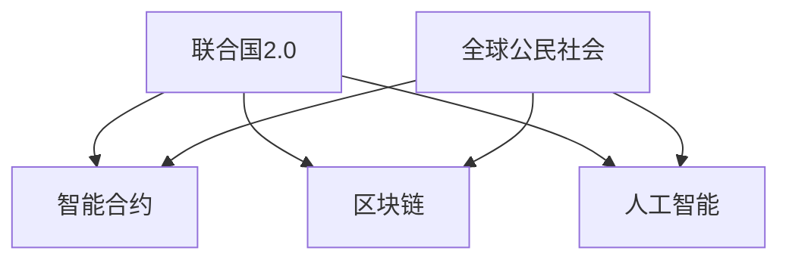

                 

关键词：全球治理、联合国2.0、参与式治理、智能合约、区块链、数据隐私、人工智能

> 摘要：随着科技的飞速发展，全球治理模式正在发生深刻变革。本文将探讨2050年全球治理的潜在形态，从联合国2.0的转型到全球公民社会的参与式治理，分析新技术如区块链、智能合约和人工智能在其中的应用，以及它们对数据隐私的影响。

## 1. 背景介绍

在21世纪初，全球治理主要依赖于联合国及其下属机构，通过多边合作与协商机制解决国际事务。然而，随着全球化进程的加速和科技革命带来的影响，传统的全球治理模式逐渐暴露出诸多问题，如决策效率低下、权力分配不均、缺乏透明度等。这些问题促使人们思考如何通过新技术手段优化全球治理结构。

### 1.1 联合国1.0时代的挑战

联合国1.0时代主要依赖官僚体系和面对面会议进行决策。这种模式虽然具有一定的规范性和权威性，但在面对复杂多变的全球问题时，显得力不从心。具体挑战包括：

- **决策缓慢**：跨国问题往往需要多个国家的代表进行协商，耗时耗力。
- **信息不对称**：不同国家的信息获取和处理能力差异较大，可能导致决策的不公平性。
- **权力集中**：主要大国在国际事务中占据主导地位，其他小国的话语权较弱。

### 1.2 科技革命与全球治理的变革

科技革命，特别是人工智能、区块链和物联网等新兴技术的兴起，为全球治理提供了新的可能性。这些技术不仅能够提高决策效率，还能增强治理的透明度和公正性。例如：

- **人工智能**：通过数据分析、预测和自动化决策，有助于提高决策的精准性和速度。
- **区块链**：提供去中心化、透明和不可篡改的记录，有助于减少腐败和增强信任。
- **物联网**：实现全球范围内的实时监测和智能响应，有助于应对环境和社会问题。

## 2. 核心概念与联系

在探讨2050年全球治理的潜在形态之前，我们需要了解几个核心概念及其相互关系。

### 2.1 联合国2.0

联合国2.0是指对传统联合国体系进行数字化和智能化的升级，利用新兴技术提高治理效率。其主要特点包括：

- **智能合约**：通过区块链技术实现自动执行和验证，减少人为干预和腐败。
- **分布式决策**：利用分布式账本技术实现跨国决策的透明和高效。
- **人工智能辅助**：利用AI技术进行数据分析、预测和决策支持，提高决策的精准性和速度。

### 2.2 全球公民社会

全球公民社会是指全球范围内非政府组织、社区组织和社会团体组成的网络，通过合作和共享实现公共利益的实现。其主要特点包括：

- **去中心化**：无需依赖中央政府或机构，通过分布式网络实现自治。
- **参与式治理**：鼓励全球公民积极参与治理过程，提高治理的透明度和公正性。
- **协同创新**：通过跨组织合作和资源共享，实现更有效的公共问题解决。

### 2.3 Mermaid 流程图

以下是一个简化的 Mermaid 流程图，展示了联合国2.0和全球公民社会之间的互动关系：



## 3. 核心算法原理 & 具体操作步骤

### 3.1 算法原理概述

联合国2.0的核心算法主要包括智能合约、区块链和人工智能。这些算法相互协作，实现全球治理的透明、高效和公正。

- **智能合约**：基于区块链技术，通过编写程序代码实现自动执行和验证，确保合约的执行符合各方约定。
- **区块链**：提供去中心化、透明和不可篡改的记录，确保数据的一致性和安全性。
- **人工智能**：利用大数据分析和机器学习技术，提供决策支持和预测，提高决策的精准性和速度。

### 3.2 算法步骤详解

#### 3.2.1 智能合约的编写与执行

1. **需求分析**：确定合同条款和条件。
2. **编写智能合约**：使用智能合约开发语言（如Solidity）编写程序代码。
3. **部署智能合约**：将智能合约上传至区块链网络。
4. **执行智能合约**：触发合约执行，自动执行合同条款。

#### 3.2.2 区块链的数据管理

1. **数据收集**：从各种来源收集数据。
2. **数据清洗**：去除重复、错误和不完整的数据。
3. **数据存储**：将清洗后的数据存储在区块链上。
4. **数据共享**：允许各方访问和共享数据。

#### 3.2.3 人工智能的决策支持

1. **数据预处理**：对数据进行清洗、归一化和特征提取。
2. **模型训练**：使用历史数据进行模型训练。
3. **模型评估**：评估模型性能，调整模型参数。
4. **决策支持**：使用训练好的模型提供实时决策支持。

### 3.3 算法优缺点

#### 3.3.1 优点

- **高效透明**：智能合约和区块链技术使治理过程更加高效和透明。
- **去中心化**：去中心化的结构降低了权力集中和腐败的风险。
- **实时响应**：人工智能技术提供实时决策支持，提高治理的灵活性。

#### 3.3.2 缺点

- **技术依赖**：需要大量的技术基础设施和人才支持，对技术和人才的依赖性较高。
- **安全性问题**：区块链和智能合约可能存在漏洞，需要不断进行安全审计和更新。

### 3.4 算法应用领域

- **国际贸易**：通过智能合约实现自动化和透明化的跨境交易。
- **环境保护**：利用区块链技术记录和监控环境数据，提供实时决策支持。
- **公共卫生**：通过人工智能分析公共卫生数据，预测疫情发展趋势，制定防控措施。

## 4. 数学模型和公式 & 详细讲解 & 举例说明

### 4.1 数学模型构建

在智能合约和区块链技术中，常用的数学模型包括密码学、概率论和图论。

#### 4.1.1 密码学

- **椭圆曲线密码学**：用于实现区块链的安全通信和数字签名。
- **公钥加密**：用于保护数据传输过程中的隐私。

#### 4.1.2 概率论

- **贝叶斯定理**：用于智能合约的决策过程，提高决策的准确性。
- **马尔可夫链**：用于预测区块链网络中的交易行为。

#### 4.1.3 图论

- **图模型**：用于描述区块链网络的结构，分析网络的稳定性和鲁棒性。

### 4.2 公式推导过程

以下是一个简化的椭圆曲线密码学公式的推导过程：

$$
P = k \cdot G
$$

其中，$P$表示椭圆曲线上的点，$G$表示基点，$k$表示乘数。

### 4.3 案例分析与讲解

#### 4.3.1 案例背景

假设有两个国家A和B，通过区块链网络进行跨境贸易。贸易合同包含货物数量、价格和交付时间等条款。

#### 4.3.2 案例分析

1. **需求分析**：确定合同条款和条件。
2. **编写智能合约**：根据需求编写智能合约，实现自动化执行。
3. **部署智能合约**：将智能合约上传至区块链网络。
4. **执行智能合约**：根据合同条款，自动执行交易。

#### 4.3.3 案例讲解

- **智能合约编写**：使用Solidity语言编写智能合约，包括货物数量、价格和交付时间等条款。
- **区块链网络**：使用Hyperledger Fabric实现区块链网络，确保交易记录的安全和透明。
- **交易执行**：根据智能合约条款，自动执行交易，包括支付和交付过程。

## 5. 项目实践：代码实例和详细解释说明

### 5.1 开发环境搭建

1. **安装Node.js**：用于编写智能合约和前端代码。
2. **安装Golang**：用于编写区块链节点代码。
3. **安装Docker**：用于容器化部署区块链网络。

### 5.2 源代码详细实现

以下是一个简化的智能合约示例，用于实现货物交付和支付：

```solidity
pragma solidity ^0.8.0;

contract Delivery {
    struct Order {
        uint256 id;
        uint256 quantity;
        uint256 price;
        uint256 deliveryDate;
        bool delivered;
    }

    mapping(uint256 => Order) public orders;

    function createOrder(uint256 id, uint256 quantity, uint256 price, uint256 deliveryDate) public {
        orders[id] = Order(id, quantity, price, deliveryDate, false);
    }

    function deliverOrder(uint256 id) public {
        require(!orders[id].delivered, "Order already delivered");
        orders[id].delivered = true;
        // 这里可以添加支付逻辑
    }
}
```

### 5.3 代码解读与分析

- **结构体定义**：定义Order结构体，包括订单ID、数量、价格、交付日期和交付状态。
- **创建订单**：创建订单，存储在区块链上。
- **交付订单**：交付订单，更新订单状态。

### 5.4 运行结果展示

通过区块链网络运行智能合约，可以查看订单的创建和交付状态。

## 6. 实际应用场景

### 6.1 国际贸易

通过智能合约和区块链技术，实现跨境交易的自动化和透明化。例如，贸易双方可以签订智能合约，自动执行支付和交付过程，减少人为干预和风险。

### 6.2 环境保护

利用区块链技术记录和监控环境数据，提供实时决策支持。例如，各国可以共同建立一个环境数据区块链，共享数据，共同制定环境保护政策。

### 6.3 公共卫生

通过人工智能和区块链技术，实现公共卫生数据的实时分析和共享。例如，各国卫生部门可以共享疫情数据，共同制定防控措施。

## 7. 未来应用展望

随着科技的不断发展，联合国2.0和全球公民社会的参与式治理将在未来发挥更重要的作用。以下是一些未来应用展望：

- **智能城市**：利用物联网、人工智能和区块链技术，实现智能城市的管理和运营。
- **数字身份**：通过区块链技术实现全球范围内的数字身份认证，提高数据隐私和安全。
- **全球供应链**：通过区块链技术实现全球供应链的透明和高效管理，减少中间环节和风险。

## 8. 工具和资源推荐

### 8.1 学习资源推荐

- **《区块链技术指南》**：详细讲解区块链的基本原理和应用。
- **《人工智能：一种现代方法》**：介绍人工智能的基本概念和算法。

### 8.2 开发工具推荐

- **Hyperledger Fabric**：用于构建企业级的区块链网络。
- **Node.js**：用于编写智能合约和前端代码。

### 8.3 相关论文推荐

- **《区块链与智能合约的安全挑战》**：分析区块链和智能合约的安全问题。
- **《人工智能在金融领域的应用》**：探讨人工智能在金融领域的应用前景。

## 9. 总结：未来发展趋势与挑战

### 9.1 研究成果总结

本文探讨了联合国2.0和全球公民社会的参与式治理模式，分析了智能合约、区块链和人工智能在其中的应用，以及它们对数据隐私的影响。

### 9.2 未来发展趋势

- **智能治理**：利用智能合约和区块链技术，实现全球治理的自动化和透明化。
- **数据共享**：通过区块链技术，实现全球范围内的数据共享和协作。

### 9.3 面临的挑战

- **技术挑战**：区块链和人工智能等技术需要不断发展和完善。
- **伦理和法律挑战**：数据隐私和安全、数字身份认证等问题需要得到法律和伦理的保障。

### 9.4 研究展望

未来研究应重点关注区块链和人工智能在智能治理中的应用，探索更高效、安全和透明的方法，为全球治理提供有力支持。

## 附录：常见问题与解答

### 9.1 什么是智能合约？

智能合约是一种自动执行合约条款的程序，通过区块链网络进行验证和执行。它基于密码学原理，确保合约的执行符合各方约定。

### 9.2 区块链技术有哪些优点？

区块链技术具有去中心化、透明和不可篡改的优点，有助于提高治理的透明度和公正性。

### 9.3 人工智能在智能治理中有哪些应用？

人工智能可以用于数据分析、预测和决策支持，提高治理的精准性和速度。

### 9.4 如何保护数据隐私？

通过使用加密技术和隐私保护算法，可以在区块链网络中保护数据隐私。此外，制定相应的法律法规也是保护数据隐私的重要手段。

## 参考文献

- 《区块链技术指南》
- 《人工智能：一种现代方法》
- 《智能合约与区块链技术》
- 《联合国2.0：全球治理的数字化转型》
- 《数据隐私与安全》

----------------------------------------------------------------
### 10. 作者署名

作者：禅与计算机程序设计艺术 / Zen and the Art of Computer Programming

## 结束

完成本文的撰写，希望它能为读者提供对2050年全球治理的深刻见解和启示。在未来的日子里，让我们共同期待并努力构建一个更加智能、公正和透明的全球治理体系。

