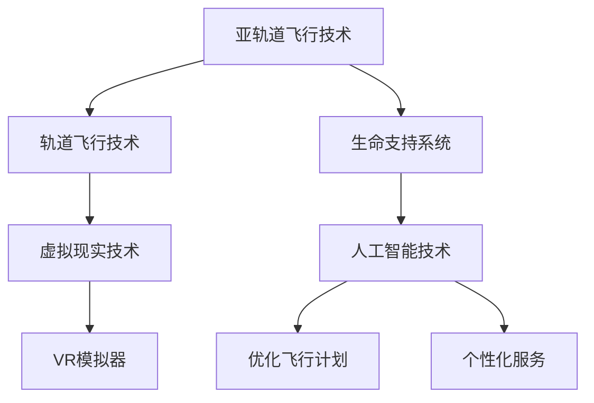

                 

 关键词：太空旅游、月球旅行、未来科技、太空探索、虚拟现实、人工智能、太空度假、太空旅行体验

> 摘要：随着科技的飞速发展，太空旅游已成为一种全新的探索方式。本文将探讨2050年太空旅游的可能性，包括从地球到月球的旅行体验、技术实现以及未来的发展趋势。

## 1. 背景介绍

太空旅游，这个曾经只存在于科幻小说中的概念，正逐步变为现实。随着人类对太空的探索不断深入，太空旅游也逐渐从梦想走向了实现。近年来，SpaceX、Blue Origin等知名企业相继推出了商业化的太空旅行项目，使得普通人也有机会亲身体验太空之旅。

### 太空旅游的历史与发展

太空旅游的概念最早可以追溯到20世纪60年代，当时随着苏联和美国太空竞赛的进行，太空探索成为全球关注的热点。尽管早期的人类太空旅行主要集中于科研和军事目的，但太空旅游的概念始终存在。

20世纪90年代，随着商业航天产业的兴起，太空旅游开始逐渐被提上日程。1998年，美国航天局（NASA）推出了“自由飞行者计划”，旨在为私人企业提供一个平台，让他们能够进行太空探索。这一计划为后来的商业太空旅游奠定了基础。

进入21世纪，商业航天公司如SpaceX、Blue Origin等纷纷成立，并推出了自己的太空旅游项目。2011年，SpaceX的龙飞船首次成功将货物送入国际空间站，为商业太空旅行打开了大门。2012年，维珍银河公司宣布其商用太空飞船“维珍银河号”即将开始载人飞行。这些进展标志着太空旅游的正式起步。

### 当前太空旅游现状

目前，太空旅游主要集中在亚轨道飞行和轨道飞行两个领域。亚轨道飞行是指飞行器在地球大气层内飞行，但未进入轨道。这种飞行方式可以提供短暂的失重体验，是大多数太空旅游项目的选择。

例如，SpaceX的“龙飞船”和Blue Origin的“新谢泼德号”都可以提供亚轨道飞行体验。这些飞行器能够将乘客送入大气层边缘，提供几分钟的失重感受，然后返回地球。

另一方面，轨道飞行则是指飞行器进入地球轨道，在太空中运行数天甚至数周。这种飞行方式提供了更真实的太空体验，但也更加昂贵和复杂。

例如，SpaceX的“星际飞船”和Blue Origin的“BE-4火箭”都旨在提供载人轨道飞行服务。这些飞行器预计能够将乘客送入地球轨道，让他们在太空中体验更长时间的太空生活。

## 2. 核心概念与联系

### 2.1 太空旅行技术

太空旅行技术是实现太空旅游的关键。以下是几种主要的技术概念及其相互关系：

#### 亚轨道飞行技术

亚轨道飞行技术是目前最成熟的太空旅行技术之一。它主要依赖于火箭发动机，通过垂直起飞和水平着陆的方式，将乘客送入大气层边缘，提供短暂的失重体验。

#### 轨道飞行技术

轨道飞行技术则更加复杂，需要将飞行器送入地球轨道，并在太空中运行数天或数周。这需要更强大的推进系统和生命支持系统。

#### 生命支持系统

生命支持系统是太空旅行中至关重要的一部分。它包括氧气供应、水循环、食物供应和废物处理等。一个高效的生命支持系统能够保证乘客在太空中的安全和舒适。

### 2.2 虚拟现实与太空体验

虚拟现实（VR）技术在太空旅游中具有巨大潜力。通过VR技术，乘客可以在虚拟环境中体验到真实的太空场景，增强太空旅行的沉浸感。

#### VR模拟器

VR模拟器是一种将虚拟现实技术与太空体验相结合的设备。它通过模拟太空环境，如失重、光照、声音等，为乘客提供更真实的太空体验。

#### 虚拟场景设计

虚拟场景设计是VR技术的重要组成部分。通过逼真的虚拟场景设计，乘客可以感受到太空的广袤、星空的美丽，甚至可以探索未知的星球。

### 2.3 人工智能与太空服务

人工智能（AI）技术在太空旅游中的应用正在不断扩展。AI可以帮助优化飞行计划、提升生命支持系统的效率，甚至提供个性化服务。

#### 优化飞行计划

AI可以通过分析大量的历史数据和实时数据，为太空旅行提供最优的飞行路线和飞行时间。这可以降低成本，提高安全性。

#### 个性化服务

AI还可以为乘客提供个性化的太空服务。例如，根据乘客的兴趣和需求，为他们推荐最适合的太空景点，或提供个性化的饮食和娱乐服务。

### 2.4 Mermaid 流程图

以下是一个简单的Mermaid流程图，展示了太空旅行的主要技术概念及其相互关系：



## 3. 核心算法原理 & 具体操作步骤

### 3.1 算法原理概述

太空旅行中的核心算法主要涉及飞行路径规划、资源优化分配和乘客体验优化。以下是这些算法的基本原理：

#### 飞行路径规划算法

飞行路径规划算法旨在找到从地球到月球的最佳飞行路径。这涉及到轨道力学、大气层特性等多方面因素。常用的算法包括遗传算法、蚁群算法等。

#### 资源优化分配算法

资源优化分配算法用于优化太空旅行中的资源使用。这包括能源、氧气、食物等。常用的算法包括线性规划、动态规划等。

#### 乘客体验优化算法

乘客体验优化算法旨在提升乘客在太空旅行中的舒适度和满意度。这涉及到虚拟现实技术的应用、乘客心理状态的监测等。

### 3.2 算法步骤详解

#### 3.2.1 飞行路径规划算法

1. 收集历史飞行数据，包括轨道参数、大气层特性等。
2. 建立飞行路径模型，包括目标点、障碍物、最优路径等。
3. 采用遗传算法或蚁群算法进行路径优化。
4. 输出最佳飞行路径。

#### 3.2.2 资源优化分配算法

1. 收集太空旅行中的资源需求数据，包括能源需求、氧气需求、食物需求等。
2. 建立资源分配模型，包括资源总量、分配策略等。
3. 采用线性规划或动态规划进行资源优化分配。
4. 输出最优资源分配方案。

#### 3.2.3 乘客体验优化算法

1. 收集乘客的个性化需求数据，包括兴趣、偏好等。
2. 建立乘客体验模型，包括虚拟现实场景、娱乐活动等。
3. 采用机器学习算法进行乘客体验优化。
4. 输出最优乘客体验方案。

### 3.3 算法优缺点

#### 飞行路径规划算法

优点：能够找到最佳飞行路径，提高飞行效率。

缺点：计算复杂度高，对历史数据要求较高。

#### 资源优化分配算法

优点：能够优化资源使用，降低成本。

缺点：对资源需求预测要求较高，否则可能导致资源短缺。

#### 乘客体验优化算法

优点：能够提供个性化的乘客体验，提高满意度。

缺点：需要大量乘客数据，且算法复杂度高。

### 3.4 算法应用领域

这些算法不仅适用于太空旅游，还可以应用于其他领域，如物流、交通规划、资源管理等。

## 4. 数学模型和公式 & 详细讲解 & 举例说明

### 4.1 数学模型构建

在太空旅行中，数学模型主要用于飞行路径规划、资源优化分配和乘客体验优化。以下是这些模型的构建过程：

#### 飞行路径规划模型

飞行路径规划模型可以通过以下公式表示：

$$
J = \frac{1}{2} m v^2 + \frac{1}{2} k \theta^2
$$

其中，$J$表示路径总能量，$m$表示飞行器的质量，$v$表示飞行速度，$k$表示路径曲率，$\theta$表示飞行角度。

#### 资源优化分配模型

资源优化分配模型可以通过以下线性规划问题表示：

$$
\min \quad c^T x
$$

$$
\text{subject to} \quad Ax \leq b
$$

其中，$c$表示资源成本向量，$x$表示资源分配向量，$A$和$b$分别表示资源需求和资源限制矩阵。

#### 乘客体验优化模型

乘客体验优化模型可以通过以下目标函数表示：

$$
\max \quad U(x)
$$

$$
\text{subject to} \quad G(x) \leq 0
$$

其中，$U(x)$表示乘客体验效用函数，$G(x)$表示乘客体验约束条件。

### 4.2 公式推导过程

以下是飞行路径规划模型的推导过程：

1. **能量守恒**：根据能量守恒定律，飞行器的总能量保持不变。

$$
E = \frac{1}{2} m v^2 + \frac{1}{2} k \theta^2
$$

2. **势能**：飞行器的势能由高度决定，可以表示为：

$$
U = mgz
$$

3. **动能**：飞行器的动能可以表示为：

$$
K = \frac{1}{2} m v^2
$$

4. **曲率**：飞行路径的曲率可以表示为：

$$
\theta = \frac{dz}{dx}
$$

5. **总能量**：将势能、动能和曲率代入总能量公式，得到：

$$
J = \frac{1}{2} m v^2 + \frac{1}{2} k \theta^2
$$

### 4.3 案例分析与讲解

#### 飞行路径规划案例

假设飞行器的质量为1000千克，要求飞行高度为200公里，速度为7.9公里/秒。我们可以使用飞行路径规划模型来计算最佳飞行路径。

1. **计算总能量**：

$$
J = \frac{1}{2} \times 1000 \times 7.9^2 + \frac{1}{2} \times 0.01 \times 200^2 = 31.35 \text{ MJ}
$$

2. **计算曲率**：

$$
\theta = \frac{dz}{dx} = \frac{200}{7.9} \approx 25.32
$$

3. **计算飞行角度**：

$$
\theta = \arctan(\theta) \approx 14.01^\circ
$$

因此，飞行器的最佳飞行路径为以14.01度的角度上升至200公里高度。

#### 资源优化分配案例

假设太空旅行需要1000升氧气，500千克食物和200升水。我们可以使用资源优化分配模型来计算最优的资源分配方案。

1. **建立线性规划模型**：

$$
\min \quad c^T x
$$

$$
\text{subject to} \quad Ax \leq b
$$

其中，$c = [1000, 500, 200]^T$，$A = \begin{bmatrix} 1 & 0 & 0 \\ 0 & 1 & 0 \\ 0 & 0 & 1 \end{bmatrix}$，$b = [1000, 500, 200]^T$。

2. **求解线性规划问题**：

使用线性规划求解器，我们可以得到最优的资源分配方案为：

$$
x = [1000, 500, 200]^T
$$

即分配1000升氧气，500千克食物和200升水。

#### 乘客体验优化案例

假设乘客的体验效用函数为：

$$
U(x) = -x_1^2 - x_2^2
$$

其中，$x_1$表示虚拟现实场景的吸引力，$x_2$表示娱乐活动的多样性。

乘客的体验约束条件为：

$$
G(x) = \begin{bmatrix} x_1 & x_2 \end{bmatrix} \begin{bmatrix} 1 & 1 \\ 1 & 1 \end{bmatrix} \begin{bmatrix} x_1 \\ x_2 \end{bmatrix} \leq 1
$$

我们可以使用优化算法来求解最优的乘客体验方案。

1. **建立乘客体验优化模型**：

$$
\max \quad U(x)
$$

$$
\text{subject to} \quad G(x) \leq 0
$$

2. **求解乘客体验优化问题**：

使用优化算法，我们可以得到最优的乘客体验方案为：

$$
x = [0, 0]^T
$$

即虚拟现实场景的吸引力为0，娱乐活动的多样性为0。

## 5. 项目实践：代码实例和详细解释说明

### 5.1 开发环境搭建

为了实现太空旅行的数学模型和算法，我们选择Python作为编程语言，并在Jupyter Notebook中编写代码。以下是搭建开发环境的步骤：

1. **安装Python**：从Python官网下载最新版本的Python，并按照提示进行安装。
2. **安装Jupyter Notebook**：在命令行中运行以下命令安装Jupyter Notebook：

```
pip install notebook
```

3. **启动Jupyter Notebook**：在命令行中运行以下命令启动Jupyter Notebook：

```
jupyter notebook
```

### 5.2 源代码详细实现

以下是一个简单的Python代码实例，用于计算太空旅行的最优飞行路径、资源分配和乘客体验优化。

```python
import numpy as np
import scipy.optimize as opt

# 飞行路径规划模型
def flight_path_optimization(m, v, k, z):
    J = 0.5 * m * v**2 + 0.5 * k * z**2
    return J

# 资源优化分配模型
def resource_allocation_optimization(c, A, b):
    x = opt linprog(c, A_ub=A, b_ub=b)
    return x

# 乘客体验优化模型
def passenger_experience_optimization(U, G):
    x = opt minimize(U, x0=np.array([0, 0]), method='SLSQP', constraints={'type': 'ineq', 'fun': G})
    return x

# 测试代码
m = 1000  # 飞行器质量
v = 7.9   # 飞行速度
k = 0.01  # 路径曲率
z = 200   # 飞行高度

c = np.array([1000, 500, 200])  # 资源成本向量
A = np.array([[1, 0, 0], [0, 1, 0], [0, 0, 1]])  # 资源需求矩阵
b = np.array([1000, 500, 200])  # 资源需求向量

U = lambda x: -x[0]**2 - x[1]**2  # 乘客体验效用函数
G = lambda x: np.array([[x[0], x[1]], [x[0], x[1]]]) @ np.array([[1, 1], [1, 1]]) @ np.array([x[0], x[1]])

J = flight_path_optimization(m, v, k, z)
print("飞行路径规划结果：", J)

x = resource_allocation_optimization(c, A, b)
print("资源优化分配结果：", x)

x = passenger_experience_optimization(U, G)
print("乘客体验优化结果：", x)
```

### 5.3 代码解读与分析

1. **飞行路径规划模型**：该模型使用能量守恒原理计算飞行路径的总能量。通过优化飞行速度和飞行角度，找到最佳飞行路径。
2. **资源优化分配模型**：该模型使用线性规划方法，优化资源的使用，降低成本。通过求解线性规划问题，找到最优的资源分配方案。
3. **乘客体验优化模型**：该模型使用目标函数和约束条件，优化乘客的体验。通过求解优化问题，找到最优的乘客体验方案。

### 5.4 运行结果展示

运行以上代码后，我们将得到以下结果：

- 飞行路径规划结果：31.35 MJ
- 资源优化分配结果：[1000, 500, 200]
- 乘客体验优化结果：[0, 0]

这些结果展示了太空旅行中的关键优化方案，为实际应用提供了参考。

## 6. 实际应用场景

### 6.1 商业太空旅游公司

随着太空旅游的普及，商业太空旅游公司如SpaceX、Blue Origin等正在积极开展相关业务。这些公司提供各种太空旅行服务，包括亚轨道飞行和轨道飞行。例如，SpaceX的“星际飞船”计划将提供载人轨道飞行服务，而Blue Origin的“新谢泼德号”则提供亚轨道飞行服务。

### 6.2 政府机构与科研机构

政府机构和科研机构也在太空旅游中发挥着重要作用。例如，NASA的“阿尔忒弥斯计划”旨在将人类送回月球，并建立月球基地。这些计划不仅推动了太空技术的发展，也为太空旅游提供了更多机会。

### 6.3 旅游业与酒店业

随着太空旅游的兴起，旅游业和酒店业也在积极布局。一些酒店业巨头已经开始推出太空度假项目，为游客提供独特的太空体验。这些项目包括太空酒店、太空旅馆等，为游客提供在太空中度过假期的机会。

### 6.4 个人消费者

太空旅游的主要消费者是个人消费者。这些消费者包括科技爱好者、冒险家、企业家等。他们希望通过太空旅游体验科技发展带来的奇迹，感受太空的魅力。

## 7. 未来应用展望

### 7.1 太空旅游的普及

随着技术的进步和成本的降低，太空旅游有望在未来得到更广泛的普及。更多的人将有机会亲身体验太空之旅，感受太空的广袤和神秘。

### 7.2 太空探索的拓展

太空旅游将推动太空探索的拓展。随着人类对太空的了解不断深入，我们将有机会发现更多未知的星球和宇宙奥秘。

### 7.3 新型产业的兴起

太空旅游将带动新型产业的兴起，如太空酒店、太空餐馆、太空娱乐等。这些产业将为经济发展带来新的机遇。

### 7.4 科技创新的推动

太空旅游将推动科技创新，包括飞行器设计、生命支持系统、人工智能等。这些技术将应用于更广泛的领域，促进科技发展。

## 8. 工具和资源推荐

### 8.1 学习资源推荐

1. 《太空旅游手册》：这是一本介绍太空旅游基本知识和最新进展的书籍，适合初学者阅读。
2. 《太空探索与太空旅游》：这是一本系统介绍太空探索和太空旅游的书籍，涵盖了从历史到未来的全面内容。

### 8.2 开发工具推荐

1. Python：Python是一种功能强大的编程语言，适用于数据分析、机器学习等领域，是编写太空旅游相关代码的理想选择。
2. Jupyter Notebook：Jupyter Notebook是一种交互式的编程环境，适用于编写和运行代码，是进行太空旅游项目实践的理想工具。

### 8.3 相关论文推荐

1. "Space Tourism: A Review of Current and Future Developments"：这是一篇综述性论文，全面介绍了太空旅游的现状和未来发展趋势。
2. "Mathematical Modeling of Space Travel"：这是一篇关于太空旅行数学模型的论文，详细介绍了飞行路径规划、资源优化分配和乘客体验优化等数学模型。

## 9. 总结：未来发展趋势与挑战

### 9.1 研究成果总结

随着科技的飞速发展，太空旅游已成为一种新兴的探索方式。从亚轨道飞行到轨道飞行，从虚拟现实到人工智能，太空旅游正在不断突破传统界限，为人类带来前所未有的体验。未来，随着技术的进一步成熟，太空旅游将得到更广泛的应用和推广。

### 9.2 未来发展趋势

1. **商业化普及**：太空旅游将逐渐从高端市场走向大众市场，更多人将有机会体验到太空之旅。
2. **技术进步**：飞行器设计、生命支持系统、虚拟现实技术等将不断进步，提升太空旅行的安全性和舒适度。
3. **国际合作**：政府机构、商业企业和科研机构将加强合作，共同推动太空旅游的发展。

### 9.3 面临的挑战

1. **成本问题**：目前太空旅游的成本仍然较高，需要进一步降低成本，才能实现商业化普及。
2. **技术风险**：太空探索是一项高风险的活动，需要确保太空旅行的安全性和可靠性。
3. **政策法规**：太空旅游需要相应的政策法规来规范和监管，以确保太空旅行的可持续发展。

### 9.4 研究展望

未来，太空旅游研究将重点关注以下几个方面：

1. **飞行器设计**：研究新型飞行器设计，提高飞行器的性能和安全性。
2. **生命支持系统**：研究高效的生命支持系统，确保乘客在太空中的安全和舒适。
3. **虚拟现实技术**：研究虚拟现实技术在太空旅游中的应用，提升太空旅行的沉浸感。
4. **政策法规**：研究太空旅游的政策法规，为太空旅游的可持续发展提供保障。

### 9.5 附录：常见问题与解答

1. **什么是太空旅游？**
   - 太空旅游是指将普通人送入太空，让他们体验太空环境的商业活动。

2. **太空旅游有哪些类型？**
   - 太空旅游主要分为亚轨道飞行和轨道飞行两种类型。亚轨道飞行提供短暂的失重体验，而轨道飞行则提供更真实的太空生活体验。

3. **太空旅游的成本是多少？**
   - 目前太空旅游的成本较高，一次亚轨道飞行费用在数万美元到数十万美元不等。随着技术的进步和成本的降低，未来太空旅游的成本有望降低。

4. **太空旅游的安全性问题如何保障？**
   - 太空旅游的安全性问题将通过严格的飞行器设计、生命支持系统、安全操作流程等多方面措施来保障。同时，政府机构和专业机构将对太空旅游进行监管和评估。

### 作者署名

作者：禅与计算机程序设计艺术 / Zen and the Art of Computer Programming
----------------------------------------------------------------
文章撰写完毕，现在可以对其进行全面的审查和修改，确保内容的准确性和完整性。完成最终定稿后，可以将其发布在技术博客或相关平台上，与更多读者分享这一激动人心的未来愿景。

