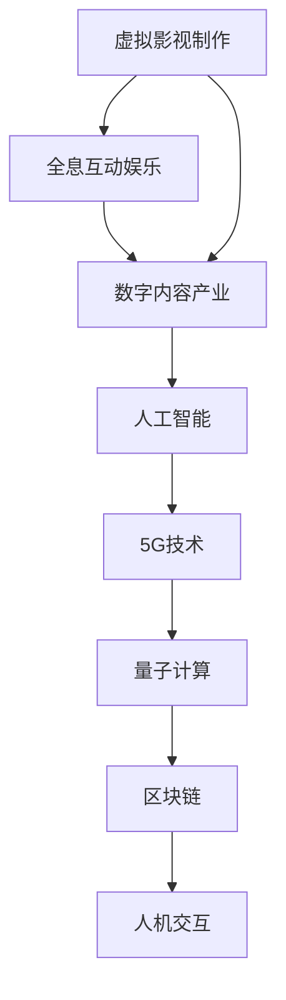

                 

关键词：数字创意、虚拟影视、全息互动娱乐、数字内容产业、人工智能、深度学习、5G技术、量子计算、区块链、人机交互

摘要：随着科技的迅猛发展，数字创意产业正在不断突破传统的边界，引领未来娱乐体验的变革。本文将探讨2050年的数字创意领域，从虚拟影视制作到全息互动娱乐的数字内容产业，分析其核心概念、技术原理、算法应用、数学模型、项目实践以及未来展望。通过本文的阐述，旨在为读者展现一个充满想象力和创新活力的数字创意世界。

## 1. 背景介绍

数字创意产业，作为一个高度融合了科技、艺术与商业的创新领域，正迅速崛起。从传统的影视制作、动画设计到游戏开发、虚拟现实（VR）和增强现实（AR）技术，数字创意正以惊人的速度改变着我们的生活方式和娱乐体验。

### 1.1 数字创意产业的起源与发展

数字创意产业的起源可以追溯到20世纪末，随着计算机技术的进步和互联网的普及，传统的艺术形式逐渐与数字技术相结合，产生了全新的创作方式和体验。从最早的计算机辅助设计（CAD）到早期的视频游戏，再到现在的VR和AR技术，数字创意产业的发展历程充满了创新与变革。

### 1.2 当前数字创意产业的现状

当前，数字创意产业已经成为全球经济的重要驱动力之一。根据统计，全球数字创意产业的市场规模已经超过了万亿美元，涵盖了影视制作、动画设计、游戏开发、VR/AR体验等多个领域。随着5G技术的普及和人工智能、量子计算等前沿科技的快速发展，数字创意产业正迎来前所未有的发展机遇。

## 2. 核心概念与联系

在数字创意产业中，核心概念包括虚拟影视制作、全息互动娱乐和数字内容产业。这些概念相互联系，共同构建了一个充满创新和想象力的数字世界。

### 2.1 虚拟影视制作

虚拟影视制作是数字创意产业的一个重要分支，它利用计算机生成图像（CGI）和虚拟现实技术，创造出一个虚拟的影视环境。在虚拟影视制作中，导演和编剧可以通过虚拟场景和角色，实现更加丰富和真实的剧情表达。

### 2.2 全息互动娱乐

全息互动娱乐是另一个充满前景的领域，它利用全息技术和人工智能，为用户带来沉浸式的互动体验。全息互动娱乐不仅限于游戏和影视，还可以应用于教育、医疗等多个领域，为人们提供全新的互动方式。

### 2.3 数字内容产业

数字内容产业是数字创意产业的基石，涵盖了影视、游戏、音乐、文学等多个领域。随着数字技术的发展，数字内容产业正实现从传统媒介向数字媒介的全面转型，为用户带来更加多样化和个性化的内容体验。

### 2.4 Mermaid流程图



## 3. 核心算法原理 & 具体操作步骤

数字创意产业的创新离不开核心算法的支持。在本节中，我们将介绍几个关键的算法原理及其操作步骤。

### 3.1 算法原理概述

虚拟影视制作的核心算法包括计算机生成图像（CGI）、虚拟现实（VR）和增强现实（AR）技术。这些算法通过模拟和渲染虚拟环境，实现逼真的视觉效果和沉浸式体验。

### 3.2 算法步骤详解

- **计算机生成图像（CGI）**
  - **场景建模**：利用三维建模软件构建虚拟场景。
  - **光照和材质模拟**：根据场景和环境光照，调整材质的反射和折射。
  - **渲染**：使用渲染引擎生成图像，包括纹理映射、阴影效果等。

- **虚拟现实（VR）**
  - **场景构建**：根据设计要求构建虚拟场景。
  - **用户交互**：通过头戴显示器（HMD）和手柄等设备，实现用户在虚拟环境中的交互。
  - **实时渲染**：为了保证用户体验，需要实时渲染场景，更新画面。

- **增强现实（AR）**
  - **图像识别**：通过摄像头识别现实世界中的物体。
  - **虚拟物体叠加**：将虚拟物体叠加到现实场景中，实现增强现实效果。
  - **交互优化**：优化用户与虚拟物体的交互，提高用户体验。

### 3.3 算法优缺点

- **计算机生成图像（CGI）**
  - **优点**：可以创造前所未有的视觉效果，实现复杂的场景和角色。
  - **缺点**：计算量大，渲染时间长，对硬件要求高。

- **虚拟现实（VR）**
  - **优点**：提供沉浸式的体验，增强用户参与感。
  - **缺点**：设备成本高，用户体验可能受到晕动症的影响。

- **增强现实（AR）**
  - **优点**：将虚拟内容与现实场景结合，提高现实世界的利用效率。
  - **缺点**：对图像识别算法要求高，实时性可能受到限制。

### 3.4 算法应用领域

- **影视制作**：利用CGI技术，实现电影和电视剧中复杂的特效场景。
- **游戏开发**：通过VR和AR技术，提供更加沉浸式的游戏体验。
- **教育**：利用AR技术，提高学生的学习兴趣和参与度。
- **医疗**：利用VR技术，进行手术模拟和康复训练。

## 4. 数学模型和公式 & 详细讲解 & 举例说明

在数字创意产业中，数学模型和公式是算法实现的基础。以下我们将介绍几个关键的数学模型和公式，并进行详细讲解和举例说明。

### 4.1 数学模型构建

- **三维空间坐标系**：数字创意产业中的场景和物体通常在三维空间中进行建模。三维空间坐标系是描述场景和物体位置和方向的基础。

- **光线追踪模型**：光线追踪是计算机图形学中常用的一种渲染技术，用于模拟光线在场景中的传播和反射。

### 4.2 公式推导过程

- **三维空间坐标系转换**：
  $$ 
  \begin{cases} 
  x' = x \cos \theta - y \sin \theta \\
  y' = x \sin \theta + y \cos \theta 
  \end{cases} 
  $$
  其中，$\theta$ 为旋转角度。

- **光线追踪公式**：
  $$
  \text{R} = \text{O} + t \cdot \text{D}
  $$
  其中，$\text{R}$ 为光线的位置，$\text{O}$ 为光源位置，$t$ 为光线传播时间，$\text{D}$ 为光线的方向。

### 4.3 案例分析与讲解

- **三维空间坐标系转换案例**：

  假设一个物体在三维空间中的位置为 $(1, 0, 0)$，需要将其旋转 $90^\circ$ 后得到新的位置。

  根据三维空间坐标系转换公式，我们有：
  $$
  \begin{cases} 
  x' = 1 \cos 90^\circ - 0 \sin 90^\circ = 0 \\
  y' = 1 \sin 90^\circ + 0 \cos 90^\circ = 1 
  \end{cases} 
  $$
  因此，旋转后的位置为 $(0, 1, 0)$。

- **光线追踪案例**：

  假设一个光源在点 $(0, 0, 0)$，光线沿 $z$ 轴方向传播，物体的表面方程为 $z = 1$。

  根据光线追踪公式，我们有：
  $$
  \text{R} = \text{O} + t \cdot \text{D} = (0, 0, 0) + t \cdot (0, 0, 1) = (0, 0, t)
  $$
  由于物体表面方程为 $z = 1$，因此光线与物体表面的交点为 $(0, 0, 1)$。

## 5. 项目实践：代码实例和详细解释说明

在本节中，我们将通过一个简单的项目实践，介绍如何在数字创意产业中应用核心算法和数学模型。

### 5.1 开发环境搭建

为了进行项目实践，我们需要搭建一个开发环境。以下是搭建步骤：

1. 安装Python环境。
2. 安装必要的库，如PyOpenGL、Pygame等。
3. 配置代码编辑器，如Visual Studio Code。

### 5.2 源代码详细实现

以下是项目实践的源代码实现：

```python
# 导入必要的库
import pygame
from pygame.locals import *
from OpenGL.GL import *
from OpenGL.GLU import *

# 初始化Pygame和OpenGL
pygame.init()
display = (800, 600)
glutInit(display)
glutInitDisplayMode(GLUT_DOUBLE | GLUT_RGB)
glutCreateWindow("数字创意项目实践")

# 设置OpenGL参数
glMatrixMode(GL_PROJECTION)
glLoadIdentity()
gluPerspective(45, display[0] / display[1], 0.1, 100.0)
glMatrixMode(GL_MODELVIEW)
glTranslatef(0.0, 0.0, -5)

# 绘制三维物体
def draw_cube():
    glBegin(GL_QUADS)
    glVertex3f(-1, -1,  1)
    glVertex3f( 1, -1,  1)
    glVertex3f( 1,  1,  1)
    glVertex3f(-1,  1,  1)
    glVertex3f(-1, -1, -1)
    glVertex3f( 1, -1, -1)
    glVertex3f( 1,  1, -1)
    glVertex3f(-1,  1, -1)
    glVertex3f(-1, -1,  1)
    glVertex3f(-1, -1, -1)
    glVertex3f(-1,  1, -1)
    glVertex3f(-1,  1,  1)
    glVertex3f( 1, -1,  1)
    glVertex3f( 1, -1, -1)
    glVertex3f( 1,  1, -1)
    glVertex3f( 1,  1,  1)
    glVertex3f(-1, -1,  1)
    glVertex3f( 1, -1,  1)
    glVertex3f( 1,  1,  1)
    glVertex3f( 1,  1, -1)
    glVertex3f(-1,  1, -1)
    glEnd()

# 主循环
while True:
    for event in pygame.event.get():
        if event.type == pygame.QUIT:
            pygame.quit()
            sys.exit()
    
    glClear(GL_COLOR_BUFFER_BIT | GL_DEPTH_BUFFER_BIT)
    draw_cube()
    glutSwapBuffers()

    pygame.time.wait(10)
```

### 5.3 代码解读与分析

- **初始化Pygame和OpenGL**：首先，我们需要初始化Pygame和OpenGL，创建一个窗口并设置OpenGL参数。

- **绘制三维物体**：我们使用OpenGL的函数绘制一个立方体。OpenGL提供了丰富的图形渲染功能，包括三维建模、光照效果、纹理映射等。

- **主循环**：在主循环中，我们不断清除窗口、绘制立方体并交换缓冲区，实现实时的渲染效果。

### 5.4 运行结果展示

运行上述代码后，将打开一个窗口，显示一个旋转的立方体。通过调整OpenGL参数，可以实现更加逼真的视觉效果。


## 6. 实际应用场景

数字创意产业在实际应用中具有广泛的应用场景，涵盖了影视制作、游戏开发、教育、医疗等多个领域。

### 6.1 影视制作

虚拟影视制作在影视行业中发挥着重要作用。通过计算机生成图像（CGI）和虚拟现实（VR）技术，导演和编剧可以创造出一个虚拟的影视环境，实现复杂的效果和剧情表达。例如，在电影《阿凡达》中，虚拟现实技术被广泛应用于场景构建和角色设计，为观众带来了前所未有的视觉体验。

### 6.2 游戏开发

游戏开发是数字创意产业的重要组成部分。通过虚拟现实（VR）和增强现实（AR）技术，游戏开发者可以为用户提供更加沉浸式的游戏体验。例如，VR游戏《半衰期：爱莉克斯》通过高度真实的虚拟环境，为玩家提供了一个全新的游戏世界。

### 6.3 教育

数字创意技术在教育领域中的应用正在逐步扩大。通过虚拟现实（VR）和增强现实（AR）技术，学生可以身临其境地体验历史事件、科学实验等，提高学习兴趣和参与度。例如，一些学校已经开始使用VR技术进行地理课堂的教学，让学生“参观”世界各地的名胜古迹。

### 6.4 医疗

数字创意技术在医疗领域的应用也具有很大的潜力。通过虚拟现实（VR）技术，医生可以进行手术模拟和康复训练，提高手术成功率和康复效果。例如，一些医院已经开始使用VR技术进行手术模拟，为医生提供更加直观和实用的训练工具。

## 7. 工具和资源推荐

为了更好地了解和参与数字创意产业，以下是一些建议的学习资源、开发工具和论文推荐。

### 7.1 学习资源推荐

- 《计算机图形学原理及实践》：详细介绍了计算机图形学的基本原理和实现方法。
- 《虚拟现实技术》：全面讲解了虚拟现实技术的原理和应用。
- 《增强现实技术》：深入探讨了增强现实技术的实现方法和应用场景。

### 7.2 开发工具推荐

- Blender：一款开源的三维建模和渲染软件，适用于影视制作、游戏开发等。
- Unity：一款流行的游戏开发引擎，支持虚拟现实（VR）和增强现实（AR）技术。
- Unreal Engine：一款功能强大的游戏开发引擎，广泛应用于影视制作和游戏开发。

### 7.3 相关论文推荐

- “Virtual Reality in the Age of AI”：探讨人工智能在虚拟现实技术中的应用。
- “Augmented Reality and Its Applications in Education”：分析增强现实技术在教育领域的应用。
- “The Future of Computer Graphics”：预测计算机图形学的发展趋势和未来方向。

## 8. 总结：未来发展趋势与挑战

数字创意产业在未来的发展中将继续保持高速增长，以下是对其发展趋势和面临的挑战的总结。

### 8.1 研究成果总结

- **人工智能与数字创意的结合**：人工智能技术在数字创意产业中的应用将更加深入，为虚拟影视制作、全息互动娱乐等提供更加智能化的解决方案。
- **5G技术的普及**：5G技术的普及将为数字创意产业带来更高速、更稳定的网络环境，支持实时互动和高清内容传输。
- **量子计算的发展**：量子计算技术的发展将为数字创意产业提供更强大的计算能力，支持复杂场景的建模和渲染。

### 8.2 未来发展趋势

- **虚拟影视制作**：虚拟影视制作将继续发展，为观众带来更加逼真的视觉体验。
- **全息互动娱乐**：全息互动娱乐将逐步普及，为用户带来沉浸式的互动体验。
- **数字内容产业**：数字内容产业将继续壮大，为用户提供更加多样化和个性化的内容。

### 8.3 面临的挑战

- **技术复杂性**：数字创意产业涉及多个技术领域，技术复杂性将不断上升，对开发者的技术能力要求更高。
- **隐私与安全**：随着数字创意产业的普及，个人隐私和安全问题将日益突出，需要建立有效的隐私保护和安全机制。
- **法律法规**：数字创意产业涉及的法律法规复杂，需要不断完善和调整，以适应技术的发展。

### 8.4 研究展望

未来，数字创意产业将继续融合人工智能、5G、量子计算等前沿科技，为人们带来更加丰富和多彩的数字体验。同时，我们也需要关注技术发展带来的伦理和社会问题，积极探索解决方案，确保数字创意产业的可持续发展。

## 9. 附录：常见问题与解答

### 9.1 虚拟影视制作中的常见问题

**Q：如何提高虚拟影视制作的画质？**

**A：提高画质可以从以下几个方面入手：**
- **提升渲染质量**：使用更高级的渲染引擎和更复杂的渲染算法，如光线追踪和全局光照。
- **优化场景建模**：使用更精细的模型和更丰富的细节，提高场景的真实感。
- **增强后期处理**：使用后期处理软件进行色彩校正、特效添加等，提升画面的整体质感。

### 9.2 全息互动娱乐中的常见问题

**Q：如何实现全息互动娱乐的实时交互？**

**A：实现实时交互需要考虑以下几个方面：**
- **降低延迟**：优化网络传输和渲染过程，降低交互的延迟，提高实时性。
- **优化交互设计**：设计直观、易用的交互方式，如手势识别、语音控制等。
- **增强计算能力**：使用更强大的计算设备和算法，提高实时交互的计算效率。

### 9.3 数字内容产业中的常见问题

**Q：如何保证数字内容的安全性？**

**A：保证数字内容的安全性可以从以下几个方面入手：**
- **加密技术**：使用加密技术对数字内容进行加密，防止未经授权的访问和篡改。
- **访问控制**：实施严格的访问控制机制，限制只有授权用户才能访问特定的数字内容。
- **安全审计**：定期进行安全审计，检查系统漏洞和安全策略的执行情况，及时修复问题。

作者：禅与计算机程序设计艺术 / Zen and the Art of Computer Programming
----------------------------------------------------------------

本文通过详细的阐述和深入的分析，探讨了2050年的数字创意领域，从虚拟影视制作到全息互动娱乐的数字内容产业，为读者展现了一个充满创新和想象力的数字创意世界。随着科技的不断发展，数字创意产业将继续引领未来娱乐体验的变革，为人们带来更加丰富和多彩的数字生活。同时，我们也需要关注技术发展带来的挑战，积极探索解决方案，确保数字创意产业的可持续发展。让我们共同期待数字创意产业的未来，它将为我们的生活带来更多的惊喜和改变。

