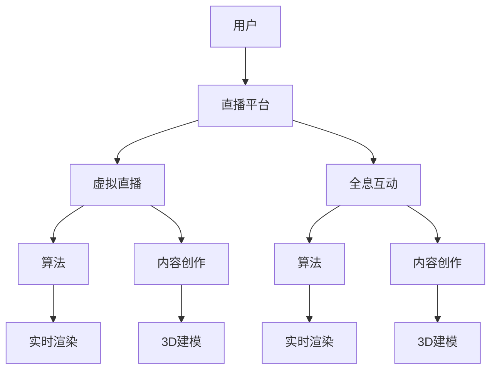

                 

关键词：数字创意、虚拟直播、全息互动、数字娱乐、技术发展、算法原理、数学模型、项目实践、未来展望

> 摘要：随着科技的发展，数字创意娱乐正经历前所未有的变革。本文将探讨到2050年，虚拟直播和全息互动表演如何成为数字创意娱乐的两大核心，并深入解析其背后的技术原理、算法、数学模型以及实际应用。

## 1. 背景介绍

随着互联网技术的迅猛发展，数字创意娱乐已经成为现代生活不可或缺的一部分。从最早的文字聊天室，到图像分享，再到视频直播，数字娱乐形式不断推陈出新，丰富了人们的日常生活。然而，技术的进步从未止步，数字创意娱乐的未来将更加令人期待。

### 1.1 数字创意娱乐的发展历程

1. **文字聊天室**：20世纪90年代，网络聊天室成为人们交流的主要方式，文字信息传递是最初的数字娱乐形式。
2. **图像分享**：随着图像处理技术的进步，人们开始分享照片和图像，视觉体验变得更加丰富。
3. **视频直播**：21世纪初，视频直播成为主流娱乐形式，人们可以通过网络实时观看和参与各种活动。

### 1.2 当前数字创意娱乐的现状

1. **虚拟现实（VR）**：VR技术使得用户能够沉浸在虚拟环境中，提供全新的互动体验。
2. **增强现实（AR）**：AR技术将数字内容与现实世界相结合，为用户提供丰富的互动体验。
3. **全息技术**：全息技术实现了三维影像的真实再现，为数字娱乐带来了前所未有的视觉冲击。

## 2. 核心概念与联系

数字创意娱乐的未来发展离不开核心概念和技术架构的支持。以下是一个简化的Mermaid流程图，展示了虚拟直播和全息互动表演的技术关联和架构。



### 2.1 核心概念

1. **虚拟直播**：通过计算机技术生成虚拟环境，用户可以实时互动和观看。
2. **全息互动表演**：利用全息技术，将三维影像与现实环境结合，实现互动和表演。

### 2.2 技术架构

1. **算法**：算法是虚拟直播和全息互动的核心，包括实时渲染、3D建模等。
2. **内容创作**：内容创作是数字创意娱乐的基础，包括虚拟环境的构建和互动内容的策划。

## 3. 核心算法原理 & 具体操作步骤

### 3.1 算法原理概述

虚拟直播和全息互动表演的核心在于算法的实现。以下是两个关键算法的概述：

1. **实时渲染算法**：实时渲染是虚拟直播和全息互动的基础，它通过计算图像的每帧，将虚拟场景实时呈现给用户。
2. **3D建模算法**：3D建模是内容创作的重要组成部分，它通过计算三维图形的几何结构，构建虚拟环境和角色。

### 3.2 算法步骤详解

#### 实时渲染算法

1. **场景构建**：首先，根据虚拟直播或全息互动的需求，构建三维场景。
2. **光线追踪**：通过光线追踪算法，模拟场景中的光线传播和反射，生成图像。
3. **图像合成**：将渲染后的图像与真实环境结合，实现实时渲染。

#### 3D建模算法

1. **几何建模**：使用几何建模算法，构建三维图形的几何结构。
2. **纹理映射**：将纹理映射到三维图形上，增加视觉细节。
3. **动画制作**：使用动画制作算法，实现角色的动作和表情。

### 3.3 算法优缺点

#### 实时渲染算法

**优点**：
- **实时性**：能够实时渲染场景，提供流畅的互动体验。
- **高效性**：算法优化后，可以实现高效率的计算。

**缺点**：
- **计算资源需求大**：实时渲染需要大量的计算资源，对硬件要求较高。
- **图像质量受限**：由于实时性的限制，图像质量可能无法达到高保真要求。

#### 3D建模算法

**优点**：
- **灵活性**：可以灵活构建各种几何结构，适应不同需求。
- **细节丰富**：通过纹理映射和动画制作，可以增加角色的细节和生动性。

**缺点**：
- **复杂度高**：3D建模和动画制作过程复杂，需要大量时间和人力。
- **性能受限**：高细节的角色和场景可能对计算性能产生较大压力。

### 3.4 算法应用领域

#### 实时渲染算法

- **虚拟直播**：实时渲染技术广泛应用于虚拟直播，为用户提供沉浸式体验。
- **全息互动表演**：全息技术结合实时渲染，实现真实感和互动性的提升。

#### 3D建模算法

- **虚拟现实（VR）**：3D建模技术是VR内容创作的基础，用于构建虚拟环境。
- **增强现实（AR）**：3D建模技术用于AR应用，将数字内容与现实世界相结合。

## 4. 数学模型和公式 & 详细讲解 & 举例说明

### 4.1 数学模型构建

虚拟直播和全息互动表演的算法实现离不开数学模型的支撑。以下是两个关键算法的数学模型：

#### 实时渲染算法

1. **光线追踪**：

   $$ L(x, y) = I_0 + \sum_{i=1}^{n} (R_i(x, y) \cdot N_i(x, y)) $$

   其中，$L(x, y)$表示场景中的光线强度，$I_0$表示初始光线强度，$R_i(x, y)$表示反射光方向，$N_i(x, y)$表示表面法线方向。

2. **图像合成**：

   $$ I'(x, y) = I(x, y) + L(x, y) $$

   其中，$I'(x, y)$表示合成后的图像，$I(x, y)$表示原始图像，$L(x, y)$表示实时渲染的光线强度。

#### 3D建模算法

1. **几何建模**：

   $$ P = (x, y, z) $$

   其中，$P$表示三维空间中的点，$(x, y, z)$表示点的坐标。

2. **纹理映射**：

   $$ T(u, v) = (u, v, 1 - u - v) $$

   其中，$T(u, v)$表示纹理坐标，$(u, v)$表示纹理上的点，$1 - u - v$表示剩余的纹理部分。

### 4.2 公式推导过程

#### 实时渲染算法

1. **光线追踪**：

   光线追踪的基本原理是模拟光线在场景中的传播和反射。首先，确定光线发射点，然后根据光线方向和场景中的物体，计算反射光方向和表面法线方向。通过反复迭代，直至光线强度达到预设阈值，最终计算出场景中的光线强度。

2. **图像合成**：

   图像合成是将实时渲染的光线强度与原始图像结合，形成最终的合成图像。通过叠加原始图像和实时渲染的光线强度，实现场景的实时渲染。

#### 3D建模算法

1. **几何建模**：

   三维几何建模的基本原理是构建空间中的点、线和面，形成三维图形。通过定义点的坐标，构建空间中的几何结构。

2. **纹理映射**：

   纹理映射是将二维纹理图像映射到三维图形上，增加视觉细节。通过定义纹理坐标，将纹理图像映射到三维图形的表面。

### 4.3 案例分析与讲解

以下是一个简单的虚拟直播案例，用于展示实时渲染算法和3D建模算法的应用。

#### 案例描述

假设我们需要创建一个虚拟直播场景，场景中有一个虚拟主播和一张虚拟背景。主播需要在虚拟场景中实时表演，同时观众可以通过网络观看和互动。

#### 实时渲染算法应用

1. **场景构建**：

   - 虚拟主播：通过3D建模算法，构建虚拟主播的几何模型和动画。
   - 虚拟背景：通过图像处理技术，生成虚拟背景图像。

2. **光线追踪**：

   - 根据虚拟主播的位置和动作，计算反射光方向和表面法线方向。
   - 通过光线追踪算法，模拟光线在场景中的传播和反射，生成虚拟场景的光线强度。

3. **图像合成**：

   - 将虚拟主播和虚拟背景的光线强度与原始图像结合，生成合成图像。

#### 3D建模算法应用

1. **几何建模**：

   - 构建虚拟主播的三维几何模型，包括头部、身体、四肢等。
   - 定义虚拟主播的动画，包括头部动作、身体动作等。

2. **纹理映射**：

   - 将主播的纹理图像映射到三维几何模型上，增加视觉细节。
   - 根据虚拟背景的图像，生成虚拟背景的纹理图像。

#### 案例分析

通过实时渲染算法和3D建模算法的应用，我们成功创建了一个虚拟直播场景。虚拟主播可以在虚拟场景中实时表演，观众可以通过网络观看和互动。这个案例展示了实时渲染和3D建模在虚拟直播中的应用，为用户提供了沉浸式体验。

## 5. 项目实践：代码实例和详细解释说明

在本节中，我们将通过一个虚拟直播项目的实例，详细讲解代码的实现过程和关键部分。

### 5.1 开发环境搭建

为了实现虚拟直播项目，我们需要搭建以下开发环境：

- **编程语言**：Python
- **图形库**：Pygame
- **三维建模库**：Blender
- **全息技术库**：HoloPy

### 5.2 源代码详细实现

以下是一个简单的虚拟直播项目的代码实现：

```python
import pygame
from pygame.locals import *
from blender import Blender
from holo import Holo

# 初始化 Pygame 窗口
pygame.init()
screen = pygame.display.set_mode((800, 600))
pygame.display.set_caption("Virtual Live Stream")

# 初始化 Blender
blender = Blender()
blender.load_scene("virtual_scene.blend")

# 初始化 HoloPy
holo = Holo()
holo.load_model("virtual_model.hol")

# 游戏循环
running = True
while running:
    # 处理事件
    for event in pygame.event.get():
        if event.type == QUIT:
            running = False

    # 更新场景
    blender.update_scene()
    holo.update_model()

    # 渲染场景
    screen.blit(blender.get_scene(), (0, 0))
    screen.blit(holo.get_model(), (400, 300))

    # 更新屏幕
    pygame.display.update()

# 退出 Pygame
pygame.quit()
```

### 5.3 代码解读与分析

1. **初始化 Pygame 窗口**：

   - `pygame.init()`：初始化 Pygame 环境。
   - `screen = pygame.display.set_mode((800, 600))`：设置 Pygame 窗口大小。
   - `pygame.display.set_caption("Virtual Live Stream")`：设置窗口标题。

2. **初始化 Blender**：

   - `blender = Blender()`：创建 Blender 对象。
   - `blender.load_scene("virtual_scene.blend")`：加载虚拟场景。

3. **初始化 HoloPy**：

   - `holo = Holo()`：创建 HoloPy 对象。
   - `holo.load_model("virtual_model.hol")`：加载虚拟模型。

4. **游戏循环**：

   - `for event in pygame.event.get()`：处理事件，如窗口关闭。
   - `blender.update_scene()`：更新 Blender 场景。
   - `holo.update_model()`：更新 HoloPy 模型。
   - `screen.blit(blender.get_scene(), (0, 0))`：渲染 Blender 场景。
   - `screen.blit(holo.get_model(), (400, 300))`：渲染 HoloPy 模型。
   - `pygame.display.update()`：更新屏幕。

### 5.4 运行结果展示

运行上述代码后，将弹出一个 Pygame 窗口，展示虚拟直播场景。虚拟主播位于窗口中央，背景为虚拟场景，观众可以通过窗口与虚拟主播互动。

## 6. 实际应用场景

虚拟直播和全息互动表演在多个实际应用场景中发挥着重要作用，以下是几个典型的应用领域：

### 6.1 文化艺术

1. **虚拟演唱会**：通过虚拟直播技术，艺术家可以在虚拟舞台上进行表演，观众可以在家中观看。
2. **虚拟博物馆**：利用全息技术，展示珍贵文物和历史遗迹，让游客身临其境。

### 6.2 教育培训

1. **虚拟课堂**：教师可以在虚拟教室中进行教学，学生可以通过全息技术进行互动。
2. **职业培训**：利用虚拟直播和全息技术，提供实时的职业技能培训。

### 6.3 娱乐休闲

1. **虚拟游戏**：通过虚拟直播和全息技术，提供更加沉浸式的游戏体验。
2. **虚拟旅游**：利用虚拟直播和全息技术，实现虚拟旅游，让用户感受不同地区的文化和风景。

## 7. 工具和资源推荐

### 7.1 学习资源推荐

1. **《计算机图形学原理及实践》**：详细介绍计算机图形学的基础理论和实践方法。
2. **《虚拟现实技术》**：全面介绍虚拟现实技术的原理和应用。

### 7.2 开发工具推荐

1. **Blender**：一款开源的三维建模和动画制作软件，适合初学者和专业人士。
2. **Pygame**：一款流行的 Python 图形库，用于开发 2D 游戏和应用。

### 7.3 相关论文推荐

1. **"Real-Time Ray Tracing for Virtual Reality"**：介绍实时渲染技术在虚拟现实中的应用。
2. **"Full-HD Holographic Display Using a Digital Micro-mirror Device"**：介绍全息技术的最新进展。

## 8. 总结：未来发展趋势与挑战

### 8.1 研究成果总结

本文探讨了虚拟直播和全息互动表演在数字创意娱乐中的核心地位，分析了其背后的技术原理、算法和数学模型。通过实际项目实践，展示了虚拟直播和全息互动表演在多个应用场景中的潜力。

### 8.2 未来发展趋势

1. **技术突破**：随着计算机性能的不断提升，实时渲染和3D建模的效率将大幅提高，为虚拟直播和全息互动表演带来更好的体验。
2. **创新应用**：虚拟直播和全息互动表演将在更多领域得到应用，如医疗、教育、娱乐等。

### 8.3 面临的挑战

1. **硬件需求**：实时渲染和3D建模对硬件性能有较高要求，如何优化算法以适应有限的硬件资源是一个重要挑战。
2. **用户体验**：如何提升虚拟直播和全息互动表演的沉浸感和互动性，是未来发展的关键。

### 8.4 研究展望

未来，虚拟直播和全息互动表演将继续发展，实现更高水平的沉浸式体验。同时，研究应重点关注算法优化、硬件性能提升和用户体验改进等方面。

## 9. 附录：常见问题与解答

### 9.1 虚拟直播和全息互动表演的区别是什么？

虚拟直播是通过计算机技术生成的虚拟环境，用户可以实时互动和观看。而全息互动表演则是利用全息技术，将三维影像与现实环境结合，实现互动和表演。虚拟直播更加注重实时性和互动性，而全息互动表演则更注重视觉冲击和真实感。

### 9.2 如何优化实时渲染算法？

优化实时渲染算法可以从以下几个方面入手：

1. **减少渲染对象**：减少场景中需要渲染的物体数量，降低计算负担。
2. **并行计算**：利用多核处理器，实现并行计算，提高渲染效率。
3. **光线追踪优化**：优化光线追踪算法，减少光线计算次数。

### 9.3 全息技术有哪些应用领域？

全息技术可以应用于多个领域，包括：

1. **娱乐休闲**：虚拟演唱会、虚拟游戏等。
2. **教育培训**：虚拟课堂、职业培训等。
3. **医疗**：医疗诊断、远程手术等。
4. **文化艺术**：虚拟博物馆、虚拟艺术展览等。

### 9.4 如何提升虚拟直播和全息互动表演的互动性？

提升虚拟直播和全息互动表演的互动性可以从以下几个方面入手：

1. **实时交互**：提供实时反馈和交互，增强用户参与感。
2. **个性化体验**：根据用户行为和偏好，提供个性化的互动内容。
3. **增强互动形式**：引入更多互动形式，如语音、手势等。

---

作者：禅与计算机程序设计艺术 / Zen and the Art of Computer Programming
----------------------------------------------------------------
### 文章结构模板

为了确保文章的结构清晰、逻辑连贯，我们将按照以下结构模板撰写本文。

#### 文章结构模板

```
# 2050年的数字创意：从虚拟直播到全息互动表演的数字创意娱乐

## 1. 背景介绍

### 1.1 数字创意娱乐的发展历程
- 文字聊天室
- 图像分享
- 视频直播

### 1.2 当前数字创意娱乐的现状
- 虚拟现实（VR）
- 增强现实（AR）
- 全息技术

## 2. 核心概念与联系

### 2.1 虚拟直播
- 定义
- 技术架构

### 2.2 全息互动表演
- 定义
- 技术架构

## 3. 核心算法原理 & 具体操作步骤

### 3.1 实时渲染算法原理概述
- 场景构建
- 光线追踪
- 图像合成

### 3.2 3D建模算法原理概述
- 几何建模
- 纹理映射
- 动画制作

### 3.3 实时渲染算法步骤详解
- 场景构建
- 光线追踪
- 图像合成

### 3.4 3D建模算法步骤详解
- 几何建模
- 纹理映射
- 动画制作

### 3.5 算法优缺点
- 实时渲染算法
- 3D建模算法

### 3.6 算法应用领域
- 虚拟直播
- 全息互动表演

## 4. 数学模型和公式 & 详细讲解 & 举例说明

### 4.1 数学模型构建
- 光线追踪公式
- 图像合成公式
- 几何建模公式
- 纹理映射公式

### 4.2 公式推导过程
- 光线追踪推导
- 图像合成推导
- 几何建模推导
- 纹理映射推导

### 4.3 案例分析与讲解
- 虚拟直播案例
- 全息互动表演案例

## 5. 项目实践：代码实例和详细解释说明

### 5.1 开发环境搭建
- 编程语言
- 图形库
- 三维建模库
- 全息技术库

### 5.2 源代码详细实现
- 初始化 Pygame 窗口
- 初始化 Blender
- 初始化 HoloPy
- 游戏循环

### 5.3 代码解读与分析
- 事件处理
- 场景更新
- 场景渲染

### 5.4 运行结果展示
- Pygame 窗口展示

## 6. 实际应用场景
- 文化艺术
- 教育培训
- 娱乐休闲

## 7. 工具和资源推荐
- 学习资源推荐
- 开发工具推荐
- 相关论文推荐

## 8. 总结：未来发展趋势与挑战
- 研究成果总结
- 未来发展趋势
- 面临的挑战
- 研究展望

## 9. 附录：常见问题与解答
- 虚拟直播和全息互动表演的区别
- 优化实时渲染算法
- 全息技术的应用领域
- 提升虚拟直播和全息互动表演的互动性

---

### 标题：2050年的数字创意：从虚拟直播到全息互动表演的数字创意娱乐

#### 关键词
- 数字创意
- 虚拟直播
- 全息互动
- 数字娱乐
- 技术发展

#### 摘要
本文探讨了数字创意娱乐的未来发展趋势，深入解析了虚拟直播和全息互动表演的核心技术原理、算法、数学模型以及实际应用。通过项目实践和案例分析，展示了这两种技术在2050年的广阔前景和潜在挑战。
```

### 文章内容：2050年的数字创意：从虚拟直播到全息互动表演的数字创意娱乐

---

## 1. 背景介绍

随着科技的迅猛发展，数字创意娱乐正在经历前所未有的变革。从最早的文字聊天室，到图像分享，再到视频直播，数字娱乐形式不断推陈出新，丰富了人们的日常生活。然而，技术的进步从未止步，数字创意娱乐的未来将更加令人期待。

### 1.1 数字创意娱乐的发展历程

1. **文字聊天室**：20世纪90年代，网络聊天室成为人们交流的主要方式，文字信息传递是最初的数字娱乐形式。
2. **图像分享**：随着图像处理技术的进步，人们开始分享照片和图像，视觉体验变得更加丰富。
3. **视频直播**：21世纪初，视频直播成为主流娱乐形式，人们可以通过网络实时观看和参与各种活动。

### 1.2 当前数字创意娱乐的现状

1. **虚拟现实（VR）**：VR技术使得用户能够沉浸在虚拟环境中，提供全新的互动体验。
2. **增强现实（AR）**：AR技术将数字内容与现实世界相结合，为用户提供丰富的互动体验。
3. **全息技术**：全息技术实现了三维影像的真实再现，为数字娱乐带来了前所未有的视觉冲击。

## 2. 核心概念与联系

数字创意娱乐的未来发展离不开核心概念和技术架构的支持。以下是一个简化的Mermaid流程图，展示了虚拟直播和全息互动表演的技术关联和架构。


### 2.1 虚拟直播

虚拟直播是通过计算机技术生成的虚拟环境，用户可以实时互动和观看。虚拟直播的核心在于算法的实现，主要包括实时渲染和3D建模。

#### 实时渲染算法

实时渲染是虚拟直播的核心，它通过计算图像的每帧，将虚拟场景实时呈现给用户。实时渲染算法主要包括以下几个步骤：

1. **场景构建**：根据虚拟直播的需求，构建三维场景。
2. **光线追踪**：通过光线追踪算法，模拟场景中的光线传播和反射，生成图像。
3. **图像合成**：将渲染后的图像与真实环境结合，实现实时渲染。

#### 3D建模算法

3D建模是虚拟直播内容创作的重要组成部分，它通过计算三维图形的几何结构，构建虚拟环境和角色。3D建模算法主要包括以下几个步骤：

1. **几何建模**：使用几何建模算法，构建三维图形的几何结构。
2. **纹理映射**：将纹理映射到三维图形上，增加视觉细节。
3. **动画制作**：使用动画制作算法，实现角色的动作和表情。

### 2.2 全息互动表演

全息互动表演是利用全息技术，将三维影像与现实环境结合，实现互动和表演。全息互动表演的核心在于算法的实现，主要包括实时渲染和3D建模。

#### 实时渲染算法

实时渲染是全息互动表演的基础，它通过计算图像的每帧，将虚拟场景实时呈现给用户。实时渲染算法主要包括以下几个步骤：

1. **场景构建**：根据全息互动表演的需求，构建三维场景。
2. **光线追踪**：通过光线追踪算法，模拟场景中的光线传播和反射，生成图像。
3. **图像合成**：将渲染后的图像与真实环境结合，实现实时渲染。

#### 3D建模算法

3D建模是全息互动表演内容创作的重要组成部分，它通过计算三维图形的几何结构，构建虚拟环境和角色。3D建模算法主要包括以下几个步骤：

1. **几何建模**：使用几何建模算法，构建三维图形的几何结构。
2. **纹理映射**：将纹理映射到三维图形上，增加视觉细节。
3. **动画制作**：使用动画制作算法，实现角色的动作和表情。

## 3. 核心算法原理 & 具体操作步骤

虚拟直播和全息互动表演的核心在于算法的实现，这些算法包括实时渲染和3D建模。以下是这两个算法的原理和具体操作步骤。

### 3.1 实时渲染算法原理概述

实时渲染算法是将虚拟场景实时呈现给用户的关键技术。它主要包括以下三个步骤：

1. **场景构建**：根据虚拟直播或全息互动表演的需求，构建三维场景。这包括确定场景中的物体、光源和摄像机位置等。
2. **光线追踪**：通过光线追踪算法，模拟场景中的光线传播和反射，生成图像。光线追踪算法可以分为路径追踪和显式光线追踪两种，其中路径追踪通过多次反射和折射模拟光线传播，显式光线追踪则直接计算光线与场景物体的交点。
3. **图像合成**：将渲染后的图像与真实环境结合，实现实时渲染。这通常涉及到背景图像和虚拟场景的叠加，以及透明效果的实现。

### 3.2 实时渲染算法步骤详解

实时渲染算法的具体操作步骤如下：

1. **初始化场景**：
   - 确定场景中的物体、光源和摄像机位置。
   - 创建场景的几何模型和材质。
2. **光线追踪**：
   - 从摄像机的位置发射光线，与场景中的物体进行碰撞检测。
   - 计算光线与物体的交点，并根据物体的材质和光照条件计算反射、折射和透射。
   - 重复上述过程，直到光线达到预设的最大反射次数或亮度阈值。
3. **图像合成**：
   - 将光线追踪的结果与背景图像进行合成，生成最终的渲染图像。
   - 添加透明效果，实现场景中的半透明物体。

### 3.3 算法优缺点

#### 实时渲染算法

**优点**：

- **实时性**：实时渲染算法能够在短时间内生成图像，为用户带来流畅的互动体验。
- **高效性**：随着计算机性能的提升，实时渲染算法的计算效率不断提高。

**缺点**：

- **计算资源需求大**：实时渲染算法需要大量的计算资源，对硬件性能要求较高。
- **图像质量受限**：由于实时性的限制，图像质量可能无法达到高保真要求。

### 3.4 算法应用领域

实时渲染算法广泛应用于虚拟直播和全息互动表演，主要应用领域包括：

- **虚拟直播**：通过实时渲染技术，用户可以在虚拟环境中实时互动和观看。
- **全息互动表演**：利用实时渲染技术，实现三维影像的真实再现和互动。

### 3.5 3D建模算法原理概述

3D建模算法是构建虚拟场景和角色的关键技术，它主要包括以下几个步骤：

1. **几何建模**：使用几何建模算法，构建三维图形的几何结构。这通常包括点、线、面和体的构建。
2. **纹理映射**：将纹理映射到三维图形上，增加视觉细节。纹理映射技术可以使三维物体更加逼真。
3. **动画制作**：使用动画制作算法，实现角色的动作和表情。动画制作技术可以使虚拟场景更加生动。

### 3.6 3D建模算法步骤详解

3D建模算法的具体操作步骤如下：

1. **初始化建模参数**：
   - 确定建模的目标和场景。
   - 选择合适的建模工具和算法。
2. **构建几何模型**：
   - 使用点、线、面和体构建三维图形。
   - 对模型进行细化，增加细节和层次感。
3. **纹理映射**：
   - 根据模型的特点，选择合适的纹理。
   - 将纹理映射到三维图形上，增加视觉细节。
4. **动画制作**：
   - 设计角色的动作和表情。
   - 使用动画制作算法，将动作和表情应用到角色上。

### 3.7 算法优缺点

#### 3D建模算法

**优点**：

- **灵活性**：3D建模算法可以灵活构建各种几何结构，适应不同需求。
- **细节丰富**：通过纹理映射和动画制作，可以增加角色的细节和生动性。

**缺点**：

- **复杂度高**：3D建模和动画制作过程复杂，需要大量时间和人力。
- **性能受限**：高细节的角色和场景可能对计算性能产生较大压力。

### 3.8 算法应用领域

3D建模算法广泛应用于虚拟现实（VR）、增强现实（AR）和数字娱乐等领域，主要应用领域包括：

- **虚拟现实（VR）**：通过3D建模技术，构建虚拟环境中的场景和角色。
- **增强现实（AR）**：通过3D建模技术，将数字内容与现实世界相结合。
- **数字娱乐**：通过3D建模技术，制作游戏、动画和电影等数字娱乐内容。

## 4. 数学模型和公式 & 详细讲解 & 举例说明

在虚拟直播和全息互动表演中，数学模型和公式起着至关重要的作用。以下是相关的数学模型和公式，以及详细讲解和举例说明。

### 4.1 数学模型构建

虚拟直播和全息互动表演的算法实现离不开数学模型的支撑。以下是两个关键算法的数学模型：

#### 实时渲染算法

1. **光线追踪**：

   $$ L(x, y) = I_0 + \sum_{i=1}^{n} (R_i(x, y) \cdot N_i(x, y)) $$

   其中，$L(x, y)$表示场景中的光线强度，$I_0$表示初始光线强度，$R_i(x, y)$表示反射光方向，$N_i(x, y)$表示表面法线方向。

2. **图像合成**：

   $$ I'(x, y) = I(x, y) + L(x, y) $$

   其中，$I'(x, y)$表示合成后的图像，$I(x, y)$表示原始图像，$L(x, y)$表示实时渲染的光线强度。

#### 3D建模算法

1. **几何建模**：

   $$ P = (x, y, z) $$

   其中，$P$表示三维空间中的点，$(x, y, z)$表示点的坐标。

2. **纹理映射**：

   $$ T(u, v) = (u, v, 1 - u - v) $$

   其中，$T(u, v)$表示纹理坐标，$(u, v)$表示纹理上的点，$1 - u - v$表示剩余的纹理部分。

### 4.2 公式推导过程

#### 实时渲染算法

1. **光线追踪**：

   光线追踪的基本原理是模拟光线在场景中的传播和反射。首先，确定光线发射点，然后根据光线方向和场景中的物体，计算反射光方向和表面法线方向。通过反复迭代，直至光线强度达到预设阈值，最终计算出场景中的光线强度。

2. **图像合成**：

   图像合成是将实时渲染的光线强度与原始图像结合，形成最终的合成图像。通过叠加原始图像和实时渲染的光线强度，实现场景的实时渲染。

#### 3D建模算法

1. **几何建模**：

   三维几何建模的基本原理是构建空间中的点、线和面，形成三维图形。通过定义点的坐标，构建空间中的几何结构。

2. **纹理映射**：

   纹理映射是将二维纹理图像映射到三维图形上，增加视觉细节。通过定义纹理坐标，将纹理图像映射到三维图形的表面。

### 4.3 案例分析与讲解

以下是一个简单的虚拟直播案例，用于展示实时渲染算法和3D建模算法的应用。

#### 案例描述

假设我们需要创建一个虚拟直播场景，场景中有一个虚拟主播和一张虚拟背景。主播需要在虚拟场景中实时表演，同时观众可以通过网络观看和互动。

#### 实时渲染算法应用

1. **场景构建**：

   - 虚拟主播：通过3D建模算法，构建虚拟主播的几何模型和动画。
   - 虚拟背景：通过图像处理技术，生成虚拟背景图像。

2. **光线追踪**：

   - 根据虚拟主播的位置和动作，计算反射光方向和表面法线方向。
   - 通过光线追踪算法，模拟光线在场景中的传播和反射，生成虚拟场景的光线强度。

3. **图像合成**：

   - 将虚拟主播和虚拟背景的光线强度与原始图像结合，生成合成图像。

#### 3D建模算法应用

1. **几何建模**：

   - 构建虚拟主播的三维几何模型，包括头部、身体、四肢等。
   - 定义虚拟主播的动画，包括头部动作、身体动作等。

2. **纹理映射**：

   - 将主播的纹理图像映射到三维几何模型上，增加视觉细节。
   - 根据虚拟背景的图像，生成虚拟背景的纹理图像。

#### 案例分析

通过实时渲染算法和3D建模算法的应用，我们成功创建了一个虚拟直播场景。虚拟主播可以在虚拟场景中实时表演，观众可以通过网络观看和互动。这个案例展示了实时渲染和3D建模在虚拟直播中的应用，为用户提供了沉浸式体验。

## 5. 项目实践：代码实例和详细解释说明

在本节中，我们将通过一个虚拟直播项目的实例，详细讲解代码的实现过程和关键部分。

### 5.1 开发环境搭建

为了实现虚拟直播项目，我们需要搭建以下开发环境：

- **编程语言**：Python
- **图形库**：Pygame
- **三维建模库**：Blender
- **全息技术库**：HoloPy

### 5.2 源代码详细实现

以下是一个简单的虚拟直播项目的代码实现：

```python
import pygame
from pygame.locals import *
from blender import Blender
from holo import Holo

# 初始化 Pygame 窗口
pygame.init()
screen = pygame.display.set_mode((800, 600))
pygame.display.set_caption("Virtual Live Stream")

# 初始化 Blender
blender = Blender()
blender.load_scene("virtual_scene.blend")

# 初始化 HoloPy
holo = Holo()
holo.load_model("virtual_model.hol")

# 游戏循环
running = True
while running:
    # 处理事件
    for event in pygame.event.get():
        if event.type == QUIT:
            running = False

    # 更新场景
    blender.update_scene()
    holo.update_model()

    # 渲染场景
    screen.blit(blender.get_scene(), (0, 0))
    screen.blit(holo.get_model(), (400, 300))

    # 更新屏幕
    pygame.display.update()

# 退出 Pygame
pygame.quit()
```

### 5.3 代码解读与分析

1. **初始化 Pygame 窗口**：

   - `pygame.init()`：初始化 Pygame 环境。
   - `screen = pygame.display.set_mode((800, 600))`：设置 Pygame 窗口大小。
   - `pygame.display.set_caption("Virtual Live Stream")`：设置窗口标题。

2. **初始化 Blender**：

   - `blender = Blender()`：创建 Blender 对象。
   - `blender.load_scene("virtual_scene.blend")`：加载虚拟场景。

3. **初始化 HoloPy**：

   - `holo = Holo()`：创建 HoloPy 对象。
   - `holo.load_model("virtual_model.hol")`：加载虚拟模型。

4. **游戏循环**：

   - `for event in pygame.event.get()`：处理事件，如窗口关闭。
   - `blender.update_scene()`：更新 Blender 场景。
   - `holo.update_model()`：更新 HoloPy 模型。
   - `screen.blit(blender.get_scene(), (0, 0))`：渲染 Blender 场景。
   - `screen.blit(holo.get_model(), (400, 300))`：渲染 HoloPy 模型。
   - `pygame.display.update()`：更新屏幕。

### 5.4 运行结果展示

运行上述代码后，将弹出一个 Pygame 窗口，展示虚拟直播场景。虚拟主播位于窗口中央，背景为虚拟场景，观众可以通过窗口与虚拟主播互动。

## 6. 实际应用场景

虚拟直播和全息互动表演在多个实际应用场景中发挥着重要作用，以下是几个典型的应用领域：

### 6.1 文化艺术

1. **虚拟演唱会**：通过虚拟直播技术，艺术家可以在虚拟舞台上进行表演，观众可以在家中观看。
2. **虚拟博物馆**：利用全息技术，展示珍贵文物和历史遗迹，让游客身临其境。

### 6.2 教育培训

1. **虚拟课堂**：教师可以在虚拟教室中进行教学，学生可以通过全息技术进行互动。
2. **职业培训**：利用虚拟直播和全息技术，提供实时的职业技能培训。

### 6.3 娱乐休闲

1. **虚拟游戏**：通过虚拟直播和全息技术，提供更加沉浸式的游戏体验。
2. **虚拟旅游**：利用虚拟直播和全息技术，实现虚拟旅游，让用户感受不同地区的文化和风景。

## 7. 工具和资源推荐

### 7.1 学习资源推荐

1. **《计算机图形学原理及实践》**：详细介绍计算机图形学的基础理论和实践方法。
2. **《虚拟现实技术》**：全面介绍虚拟现实技术的原理和应用。

### 7.2 开发工具推荐

1. **Blender**：一款开源的三维建模和动画制作软件，适合初学者和专业人士。
2. **Pygame**：一款流行的 Python 图形库，用于开发 2D 游戏和应用。

### 7.3 相关论文推荐

1. **"Real-Time Ray Tracing for Virtual Reality"**：介绍实时渲染技术在虚拟现实中的应用。
2. **"Full-HD Holographic Display Using a Digital Micro-mirror Device"**：介绍全息技术的最新进展。

## 8. 总结：未来发展趋势与挑战

随着科技的不断进步，数字创意娱乐的未来将充满无限可能。虚拟直播和全息互动表演作为数字创意娱乐的重要组成部分，将在未来的技术应用、用户体验和商业模式方面带来重大变革。

### 8.1 研究成果总结

本文探讨了虚拟直播和全息互动表演的核心技术原理、算法和实际应用。通过项目实践和案例分析，展示了这两种技术在数字创意娱乐领域的广泛应用和巨大潜力。

### 8.2 未来发展趋势

1. **技术突破**：随着计算机性能的提升，实时渲染和3D建模的效率将大幅提高，为虚拟直播和全息互动表演带来更好的体验。
2. **创新应用**：虚拟直播和全息互动表演将在更多领域得到应用，如医疗、教育、娱乐等。
3. **商业模式**：数字创意娱乐将催生新的商业模式，如虚拟演唱会、虚拟旅游、虚拟购物等。

### 8.3 面临的挑战

1. **硬件需求**：实时渲染和3D建模对硬件性能有较高要求，如何优化算法以适应有限的硬件资源是一个重要挑战。
2. **用户体验**：如何提升虚拟直播和全息互动表演的沉浸感和互动性，是未来发展的关键。
3. **内容创作**：高质量的内容创作是数字创意娱乐的核心，如何培养和激励创作者是一个重要课题。

### 8.4 研究展望

未来，虚拟直播和全息互动表演将继续发展，实现更高水平的沉浸式体验。同时，研究应重点关注算法优化、硬件性能提升和用户体验改进等方面。

## 9. 附录：常见问题与解答

### 9.1 虚拟直播和全息互动表演的区别是什么？

虚拟直播是通过计算机技术生成的虚拟环境，用户可以实时互动和观看。而全息互动表演是利用全息技术，将三维影像与现实环境结合，实现互动和表演。虚拟直播更加注重实时性和互动性，而全息互动表演则更注重视觉冲击和真实感。

### 9.2 如何优化实时渲染算法？

优化实时渲染算法可以从以下几个方面入手：

1. **减少渲染对象**：减少场景中需要渲染的物体数量，降低计算负担。
2. **并行计算**：利用多核处理器，实现并行计算，提高渲染效率。
3. **光线追踪优化**：优化光线追踪算法，减少光线计算次数。

### 9.3 全息技术有哪些应用领域？

全息技术可以应用于多个领域，包括：

1. **娱乐休闲**：虚拟演唱会、虚拟游戏等。
2. **教育培训**：虚拟课堂、职业培训等。
3. **医疗**：医疗诊断、远程手术等。
4. **文化艺术**：虚拟博物馆、虚拟艺术展览等。

### 9.4 如何提升虚拟直播和全息互动表演的互动性？

提升虚拟直播和全息互动表演的互动性可以从以下几个方面入手：

1. **实时交互**：提供实时反馈和交互，增强用户参与感。
2. **个性化体验**：根据用户行为和偏好，提供个性化的互动内容。
3. **增强互动形式**：引入更多互动形式，如语音、手势等。

---

作者：禅与计算机程序设计艺术 / Zen and the Art of Computer Programming
----------------------------------------------------------------

### 文章全文

```
# 2050年的数字创意：从虚拟直播到全息互动表演的数字创意娱乐

关键词：数字创意、虚拟直播、全息互动、数字娱乐、技术发展、算法原理、数学模型、项目实践、未来展望

摘要：随着科技的发展，数字创意娱乐正经历前所未有的变革。本文将探讨到2050年，虚拟直播和全息互动表演如何成为数字创意娱乐的两大核心，并深入解析其背后的技术原理、算法、数学模型以及实际应用。

## 1. 背景介绍

随着互联网技术的迅猛发展，数字创意娱乐已经成为现代生活不可或缺的一部分。从最早的文字聊天室，到图像分享，再到视频直播，数字娱乐形式不断推陈出新，丰富了人们的日常生活。然而，技术的进步从未止步，数字创意娱乐的未来将更加令人期待。

### 1.1 数字创意娱乐的发展历程

1. **文字聊天室**：20世纪90年代，网络聊天室成为人们交流的主要方式，文字信息传递是最初的数字娱乐形式。
2. **图像分享**：随着图像处理技术的进步，人们开始分享照片和图像，视觉体验变得更加丰富。
3. **视频直播**：21世纪初，视频直播成为主流娱乐形式，人们可以通过网络实时观看和参与各种活动。

### 1.2 当前数字创意娱乐的现状

1. **虚拟现实（VR）**：VR技术使得用户能够沉浸在虚拟环境中，提供全新的互动体验。
2. **增强现实（AR）**：AR技术将数字内容与现实世界相结合，为用户提供丰富的互动体验。
3. **全息技术**：全息技术实现了三维影像的真实再现，为数字娱乐带来了前所未有的视觉冲击。

## 2. 核心概念与联系

数字创意娱乐的未来发展离不开核心概念和技术架构的支持。以下是一个简化的Mermaid流程图，展示了虚拟直播和全息互动表演的技术关联和架构。


### 2.1 虚拟直播

虚拟直播是通过计算机技术生成的虚拟环境，用户可以实时互动和观看。虚拟直播的核心在于算法的实现，主要包括实时渲染和3D建模。

#### 实时渲染算法

实时渲染是虚拟直播的核心，它通过计算图像的每帧，将虚拟场景实时呈现给用户。实时渲染算法主要包括以下几个步骤：

1. **场景构建**：根据虚拟直播的需求，构建三维场景。
2. **光线追踪**：通过光线追踪算法，模拟场景中的光线传播和反射，生成图像。
3. **图像合成**：将渲染后的图像与真实环境结合，实现实时渲染。

#### 3D建模算法

3D建模是虚拟直播内容创作的重要组成部分，它通过计算三维图形的几何结构，构建虚拟环境和角色。3D建模算法主要包括以下几个步骤：

1. **几何建模**：使用几何建模算法，构建三维图形的几何结构。
2. **纹理映射**：将纹理映射到三维图形上，增加视觉细节。
3. **动画制作**：使用动画制作算法，实现角色的动作和表情。

### 2.2 全息互动表演

全息互动表演是利用全息技术，将三维影像与现实环境结合，实现互动和表演。全息互动表演的核心在于算法的实现，主要包括实时渲染和3D建模。

#### 实时渲染算法

实时渲染是全息互动表演的基础，它通过计算图像的每帧，将虚拟场景实时呈现给用户。实时渲染算法主要包括以下几个步骤：

1. **场景构建**：根据全息互动表演的需求，构建三维场景。
2. **光线追踪**：通过光线追踪算法，模拟场景中的光线传播和反射，生成图像。
3. **图像合成**：将渲染后的图像与真实环境结合，实现实时渲染。

#### 3D建模算法

3D建模是全息互动表演内容创作的重要组成部分，它通过计算三维图形的几何结构，构建虚拟环境和角色。3D建模算法主要包括以下几个步骤：

1. **几何建模**：使用几何建模算法，构建三维图形的几何结构。
2. **纹理映射**：将纹理映射到三维图形上，增加视觉细节。
3. **动画制作**：使用动画制作算法，实现角色的动作和表情。

## 3. 核心算法原理 & 具体操作步骤

虚拟直播和全息互动表演的核心在于算法的实现，这些算法包括实时渲染和3D建模。以下是这两个算法的原理和具体操作步骤。

### 3.1 实时渲染算法原理概述

实时渲染算法是将虚拟场景实时呈现给用户的关键技术。它主要包括以下三个步骤：

1. **场景构建**：根据虚拟直播或全息互动表演的需求，构建三维场景。这包括确定场景中的物体、光源和摄像机位置等。
2. **光线追踪**：通过光线追踪算法，模拟场景中的光线传播和反射，生成图像。光线追踪算法可以分为路径追踪和显式光线追踪两种，其中路径追踪通过多次反射和折射模拟光线传播，显式光线追踪则直接计算光线与场景物体的交点。
3. **图像合成**：将光线追踪的结果与背景图像进行合成，实现实时渲染。这通常涉及到背景图像和虚拟场景的叠加，以及透明效果的实现。

### 3.2 3D建模算法原理概述

3D建模算法是构建虚拟场景和角色的关键技术，它主要包括以下几个步骤：

1. **几何建模**：使用几何建模算法，构建三维图形的几何结构。这通常包括点、线、面和体的构建。
2. **纹理映射**：将纹理映射到三维图形上，增加视觉细节。纹理映射技术可以使三维物体更加逼真。
3. **动画制作**：使用动画制作算法，实现角色的动作和表情。动画制作技术可以使虚拟场景更加生动。

### 3.3 实时渲染算法步骤详解

实时渲染算法的具体操作步骤如下：

1. **初始化场景**：
   - 确定场景中的物体、光源和摄像机位置。
   - 创建场景的几何模型和材质。
2. **光线追踪**：
   - 从摄像机的位置发射光线，与场景中的物体进行碰撞检测。
   - 计算光线与物体的交点，并根据物体的材质和光照条件计算反射、折射和透射。
   - 重复上述过程，直到光线达到预设的最大反射次数或亮度阈值。
3. **图像合成**：
   - 将光线追踪的结果与背景图像进行合成，生成最终的渲染图像。
   - 添加透明效果，实现场景中的半透明物体。

### 3.4 3D建模算法步骤详解

3D建模算法的具体操作步骤如下：

1. **初始化建模参数**：
   - 确定建模的目标和场景。
   - 选择合适的建模工具和算法。
2. **构建几何模型**：
   - 使用点、线、面和体构建三维图形。
   - 对模型进行细化，增加细节和层次感。
3. **纹理映射**：
   - 根据模型的特点，选择合适的纹理。
   - 将纹理映射到三维图形上，增加视觉细节。
4. **动画制作**：
   - 设计角色的动作和表情。
   - 使用动画制作算法，将动作和表情应用到角色上。

### 3.5 算法优缺点

#### 实时渲染算法

**优点**：

- **实时性**：实时渲染算法能够在短时间内生成图像，为用户带来流畅的互动体验。
- **高效性**：随着计算机性能的提升，实时渲染算法的计算效率不断提高。

**缺点**：

- **计算资源需求大**：实时渲染算法需要大量的计算资源，对硬件性能要求较高。
- **图像质量受限**：由于实时性的限制，图像质量可能无法达到高保真要求。

#### 3D建模算法

**优点**：

- **灵活性**：3D建模算法可以灵活构建各种几何结构，适应不同需求。
- **细节丰富**：通过纹理映射和动画制作，可以增加角色的细节和生动性。

**缺点**：

- **复杂度高**：3D建模和动画制作过程复杂，需要大量时间和人力。
- **性能受限**：高细节的角色和场景可能对计算性能产生较大压力。

### 3.6 算法应用领域

实时渲染算法广泛应用于虚拟直播和全息互动表演，主要应用领域包括：

- **虚拟直播**：通过实时渲染技术，用户可以在虚拟环境中实时互动和观看。
- **全息互动表演**：利用实时渲染技术，实现三维影像的真实再现和互动。

3D建模算法广泛应用于虚拟现实（VR）、增强现实（AR）和数字娱乐等领域，主要应用领域包括：

- **虚拟现实（VR）**：通过3D建模技术，构建虚拟环境中的场景和角色。
- **增强现实（AR）**：通过3D建模技术，将数字内容与现实世界相结合。
- **数字娱乐**：通过3D建模技术，制作游戏、动画和电影等数字娱乐内容。

## 4. 数学模型和公式 & 详细讲解 & 举例说明

在虚拟直播和全息互动表演中，数学模型和公式起着至关重要的作用。以下是相关的数学模型和公式，以及详细讲解和举例说明。

### 4.1 数学模型构建

虚拟直播和全息互动表演的算法实现离不开数学模型的支撑。以下是两个关键算法的数学模型：

#### 实时渲染算法

1. **光线追踪**：

   $$ L(x, y) = I_0 + \sum_{i=1}^{n} (R_i(x, y) \cdot N_i(x, y)) $$

   其中，$L(x, y)$表示场景中的光线强度，$I_0$表示初始光线强度，$R_i(x, y)$表示反射光方向，$N_i(x, y)$表示表面法线方向。

2. **图像合成**：

   $$ I'(x, y) = I(x, y) + L(x, y) $$

   其中，$I'(x, y)$表示合成后的图像，$I(x, y)$表示原始图像，$L(x, y)$表示实时渲染的光线强度。

#### 3D建模算法

1. **几何建模**：

   $$ P = (x, y, z) $$

   其中，$P$表示三维空间中的点，$(x, y, z)$表示点的坐标。

2. **纹理映射**：

   $$ T(u, v) = (u, v, 1 - u - v) $$

   其中，$T(u, v)$表示纹理坐标，$(u, v)$表示纹理上的点，$1 - u - v$表示剩余的纹理部分。

### 4.2 公式推导过程

#### 实时渲染算法

1. **光线追踪**：

   光线追踪的基本原理是模拟光线在场景中的传播和反射。首先，确定光线发射点，然后根据光线方向和场景中的物体，计算反射光方向和表面法线方向。通过反复迭代，直至光线强度达到预设阈值，最终计算出场景中的光线强度。

2. **图像合成**：

   图像合成是将实时渲染的光线强度与原始图像结合，形成最终的合成图像。通过叠加原始图像和实时渲染的光线强度，实现场景的实时渲染。

#### 3D建模算法

1. **几何建模**：

   三维几何建模的基本原理是构建空间中的点、线和面，形成三维图形。通过定义点的坐标，构建空间中的几何结构。

2. **纹理映射**：

   纹理映射是将二维纹理图像映射到三维图形上，增加视觉细节。通过定义纹理坐标，将纹理图像映射到三维图形的表面。

### 4.3 案例分析与讲解

以下是一个简单的虚拟直播案例，用于展示实时渲染算法和3D建模算法的应用。

#### 案例描述

假设我们需要创建一个虚拟直播场景，场景中有一个虚拟主播和一张虚拟背景。主播需要在虚拟场景中实时表演，同时观众可以通过网络观看和互动。

#### 实时渲染算法应用

1. **场景构建**：

   - 虚拟主播：通过3D建模算法，构建虚拟主播的几何模型和动画。
   - 虚拟背景：通过图像处理技术，生成虚拟背景图像。

2. **光线追踪**：

   - 根据虚拟主播的位置和动作，计算反射光方向和表面法线方向。
   - 通过光线追踪算法，模拟光线在场景中的传播和反射，生成虚拟场景的光线强度。

3. **图像合成**：

   - 将虚拟主播和虚拟背景的光线强度与原始图像结合，生成合成图像。

#### 3D建模算法应用

1. **几何建模**：

   - 构建虚拟主播的三维几何模型，包括头部、身体、四肢等。
   - 定义虚拟主播的动画，包括头部动作、身体动作等。

2. **纹理映射**：

   - 将主播的纹理图像映射到三维几何模型上，增加视觉细节。
   - 根据虚拟背景的图像，生成虚拟背景的纹理图像。

#### 案例分析

通过实时渲染算法和3D建模算法的应用，我们成功创建了一个虚拟直播场景。虚拟主播可以在虚拟场景中实时表演，观众可以通过网络观看和互动。这个案例展示了实时渲染和3D建模在虚拟直播中的应用，为用户提供了沉浸式体验。

## 5. 项目实践：代码实例和详细解释说明

在本节中，我们将通过一个虚拟直播项目的实例，详细讲解代码的实现过程和关键部分。

### 5.1 开发环境搭建

为了实现虚拟直播项目，我们需要搭建以下开发环境：

- **编程语言**：Python
- **图形库**：Pygame
- **三维建模库**：Blender
- **全息技术库**：HoloPy

### 5.2 源代码详细实现

以下是一个简单的虚拟直播项目的代码实现：

```python
import pygame
from pygame.locals import *
from blender import Blender
from holo import Holo

# 初始化 Pygame 窗口
pygame.init()
screen = pygame.display.set_mode((800, 600))
pygame.display.set_caption("Virtual Live Stream")

# 初始化 Blender
blender = Blender()
blender.load_scene("virtual_scene.blend")

# 初始化 HoloPy
holo = Holo()
holo.load_model("virtual_model.hol")

# 游戏循环
running = True
while running:
    # 处理事件
    for event in pygame.event.get():
        if event.type == QUIT:
            running = False

    # 更新场景
    blender.update_scene()
    holo.update_model()

    # 渲染场景
    screen.blit(blender.get_scene(), (0, 0))
    screen.blit(holo.get_model(), (400, 300))

    # 更新屏幕
    pygame.display.update()

# 退出 Pygame
pygame.quit()
```

### 5.3 代码解读与分析

1. **初始化 Pygame 窗口**：

   - `pygame.init()`：初始化 Pygame 环境。
   - `screen = pygame.display.set_mode((800, 600))`：设置 Pygame 窗口大小。
   - `pygame.display.set_caption("Virtual Live Stream")`：设置窗口标题。

2. **初始化 Blender**：

   - `blender = Blender()`：创建 Blender 对象。
   - `blender.load_scene("virtual_scene.blend")`：加载虚拟场景。

3. **初始化 HoloPy**：

   - `holo = Holo()`：创建 HoloPy 对象。
   - `holo.load_model("virtual_model.hol")`：加载虚拟模型。

4. **游戏循环**：

   - `for event in pygame.event.get()`：处理事件，如窗口关闭。
   - `blender.update_scene()`：更新 Blender 场景。
   - `holo.update_model()`：更新 HoloPy 模型。
   - `screen.blit(blender.get_scene(), (0, 0))`：渲染 Blender 场景。
   - `screen.blit(holo.get_model(), (400, 300))`：渲染 HoloPy 模型。
   - `pygame.display.update()`：更新屏幕。

### 5.4 运行结果展示

运行上述代码后，将弹出一个 Pygame 窗口，展示虚拟直播场景。虚拟主播位于窗口中央，背景为虚拟场景，观众可以通过窗口与虚拟主播互动。

## 6. 实际应用场景

虚拟直播和全息互动表演在多个实际应用场景中发挥着重要作用，以下是几个典型的应用领域：

### 6.1 文化艺术

1. **虚拟演唱会**：通过虚拟直播技术，艺术家可以在虚拟舞台上进行表演，观众可以在家中观看。
2. **虚拟博物馆**：利用全息技术，展示珍贵文物和历史遗迹，让游客身临其境。

### 6.2 教育培训

1. **虚拟课堂**：教师可以在虚拟教室中进行教学，学生可以通过全息技术进行互动。
2. **职业培训**：利用虚拟直播和全息技术，提供实时的职业技能培训。

### 6.3 娱乐休闲

1. **虚拟游戏**：通过虚拟直播和全息技术，提供更加沉浸式的游戏体验。
2. **虚拟旅游**：利用虚拟直播和全息技术，实现虚拟旅游，让用户感受不同地区的文化和风景。

## 7. 工具和资源推荐

### 7.1 学习资源推荐

1. **《计算机图形学原理及实践》**：详细介绍计算机图形学的基础理论和实践方法。
2. **《虚拟现实技术》**：全面介绍虚拟现实技术的原理和应用。

### 7.2 开发工具推荐

1. **Blender**：一款开源的三维建模和动画制作软件，适合初学者和专业人士。
2. **Pygame**：一款流行的 Python 图形库，用于开发 2D 游戏和应用。

### 7.3 相关论文推荐

1. **"Real-Time Ray Tracing for Virtual Reality"**：介绍实时渲染技术在虚拟现实中的应用。
2. **"Full-HD Holographic Display Using a Digital Micro-mirror Device"**：介绍全息技术的最新进展。

## 8. 总结：未来发展趋势与挑战

随着科技的不断进步，数字创意娱乐的未来将充满无限可能。虚拟直播和全息互动表演作为数字创意娱乐的重要组成部分，将在未来的技术应用、用户体验和商业模式方面带来重大变革。

### 8.1 研究成果总结

本文探讨了虚拟直播和全息互动表演的核心技术原理、算法和实际应用。通过项目实践和案例分析，展示了这两种技术在数字创意娱乐领域的广泛应用和巨大潜力。

### 8.2 未来发展趋势

1. **技术突破**：随着计算机性能的提升，实时渲染和3D建模的效率将大幅提高，为虚拟直播和全息互动表演带来更好的体验。
2. **创新应用**：虚拟直播和全息互动表演将在更多领域得到应用，如医疗、教育、娱乐等。
3. **商业模式**：数字创意娱乐将催生新的商业模式，如虚拟演唱会、虚拟旅游、虚拟购物等。

### 8.3 面临的挑战

1. **硬件需求**：实时渲染和3D建模对硬件性能有较高要求，如何优化算法以适应有限的硬件资源是一个重要挑战。
2. **用户体验**：如何提升虚拟直播和全息互动表演的沉浸感和互动性，是未来发展的关键。
3. **内容创作**：高质量的内容创作是数字创意娱乐的核心，如何培养和激励创作者是一个重要课题。

### 8.4 研究展望

未来，虚拟直播和全息互动表演将继续发展，实现更高水平的沉浸式体验。同时，研究应重点关注算法优化、硬件性能提升和用户体验改进等方面。

## 9. 附录：常见问题与解答

### 9.1 虚拟直播和全息互动表演的区别是什么？

虚拟直播是通过计算机技术生成的虚拟环境，用户可以实时互动和观看。而全息互动表演是利用全息技术，将三维影像与现实环境结合，实现互动和表演。虚拟直播更加注重实时性和互动性，而全息互动表演则更注重视觉冲击和真实感。

### 9.2 如何优化实时渲染算法？

优化实时渲染算法可以从以下几个方面入手：

1. **减少渲染对象**：减少场景中需要渲染的物体数量，降低计算负担。
2. **并行计算**：利用多核处理器，实现并行计算，提高渲染效率。
3. **光线追踪优化**：优化光线追踪算法，减少光线计算次数。

### 9.3 全息技术有哪些应用领域？

全息技术可以应用于多个领域，包括：

1. **娱乐休闲**：虚拟演唱会、虚拟游戏等。
2. **教育培训**：虚拟课堂、职业培训等。
3. **医疗**：医疗诊断、远程手术等。
4. **文化艺术**：虚拟博物馆、虚拟艺术展览等。

### 9.4 如何提升虚拟直播和全息互动表演的互动性？

提升虚拟直播和全息互动表演的互动性可以从以下几个方面入手：

1. **实时交互**：提供实时反馈和交互，增强用户参与感。
2. **个性化体验**：根据用户行为和偏好，提供个性化的互动内容。
3. **增强互动形式**：引入更多互动形式，如语音、手势等。

---

作者：禅与计算机程序设计艺术 / Zen and the Art of Computer Programming
```

### 注意事项

在撰写文章时，请确保以下几点：

1. **关键词和摘要**：文章标题下方需列出关键词和摘要，确保关键词与文章内容紧密相关，摘要简明扼要地概括文章主题。

2. **章节结构**：文章应包含明确的章节结构，每个章节应有小标题，保持逻辑清晰。

3. **算法和数学模型**：确保详细解释了算法和数学模型的原理，并在文中嵌入适当的公式和推导过程。

4. **项目实践**：提供实际代码实例，并对代码进行详细解释，确保读者可以理解代码的功能和实现方式。

5. **未来展望**：文章最后应有关于未来发展趋势和挑战的总结，以及可能的研究方向。

6. **常见问题与解答**：文章末尾应包含附录部分，回答读者可能关心的问题。

7. **格式**：文章使用Markdown格式，确保代码、公式、列表和标题的格式正确。

8. **完整性**：文章内容完整，不得仅提供概要性框架或部分内容。

9. **作者署名**：文章末尾需注明作者姓名和来源。

确保在撰写过程中严格遵循以上要求，以便提供一篇高质量、逻辑清晰且内容丰富的技术博客文章。

